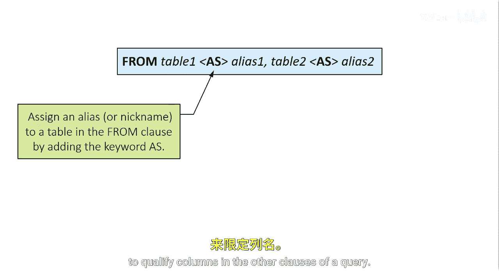

# 045：使用表别名 📝

在本节课中，我们将学习如何在SQL查询中为数据表指定一个别名。别名可以简化查询语句的编写，特别是在涉及多个表的复杂查询中。

## 概述

SQL允许您在`FROM`子句中为数据表分配一个别名或昵称。这通过添加可选的`AS`关键字和您选择的别名来实现。别名是数据表的一个临时替代名称。随后，您可以在查询的其他子句中使用该别名来代替完整的表名，以限定列名。

## 表别名的定义与作用

上一节我们了解了别名的基本概念，本节中我们来看看它的具体语法和作用。

别名是数据表的一个临时替代名称。其核心语法是在`FROM`子句中，在表名后使用`AS`关键字（该关键字是可选的）来指定。

**代码示例：**
```sql
SELECT column_name
FROM table_name AS alias_name;
-- 或者省略 AS 关键字
SELECT column_name
FROM table_name alias_name;
```

定义别名后，您可以在`SELECT`、`WHERE`、`JOIN`等子句中使用这个别名来引用原表，使代码更简洁清晰。

## 别名使用实例

理解了别名的定义后，让我们通过一个具体例子来看看它的实际应用。

以下是一个使用别名的查询示例。假设我们有两个表：`small_customer`（客户表）和`small_transaction`（交易表）。




在这个例子中，小型客户表的别名是`C`，小型交易表的别名是`T`。在查询中，我们可以使用`C.column_name`和`T.column_name`的方式来明确指定每一列属于哪个表。

**代码示例：**
```sql
SELECT C.customer_id, C.name, T.transaction_date, T.amount
FROM small_customer AS C
INNER JOIN small_transaction AS T
ON C.customer_id = T.customer_id;
```

## 选择别名的技巧

学会了如何使用别名，我们再来探讨一下如何为表选择一个合适的别名。

通常，在分配表别名时，您希望使用一个能代表该表的简称。例如，用`Cust`代表`Customer`表，用`Prod`代表`Product`表。选择简短且有意义的别名可以提高查询语句的可读性。


再次强调，使用`AS`关键字是可选的。以下两种写法是等效的：


以下是两种等效的别名定义方式：
*   `FROM table_name AS alias_name`
*   `FROM table_name alias_name`

## 总结

本节课中我们一起学习了SQL中表别名的使用。我们了解到，别名是表的临时替代名称，通过`FROM table_name [AS] alias`的语法定义，它能使多表查询的语句更加简洁和易读。记住，`AS`关键字是可选的，并且为表选择简短、有代表性的别名是一个好习惯。