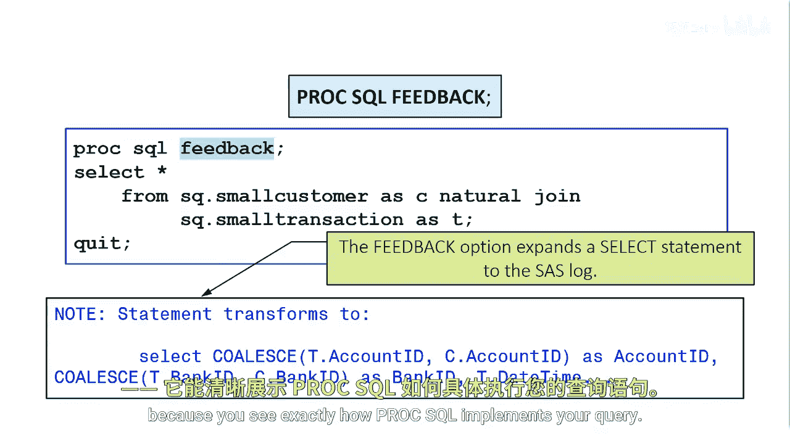

# 046：使用自然连接匹配行

在本节课中，我们将学习SAS PROC SQL中的自然连接。自然连接是一种简化代码的连接方式，它会自动识别并匹配两个表中具有相同名称和数据类型的列。

## 自然连接概述

上一节我们介绍了不同类型的连接操作，本节中我们来看看自然连接。自然连接会自动从每个表中选择具有相同名称和数据类型的列，并基于这些列的相等值来匹配行。


## 自然连接的工作原理

PROC SQL会自动识别两个表中所有名称和数据类型都相同的列，并将这些列作为连接条件。其基本语法如下：

```sql
PROC SQL;
    SELECT *
    FROM table1
    NATURAL JOIN table2;
QUIT;
```

## 自然连接的优势与注意事项

使用自然连接的主要优势在于代码简洁。它隐含了`ON`子句，并且对于两个表共有的列名，你不需要使用表别名来限定。

然而，在使用自然连接前，你必须充分了解你的数据。因为它基于所有同名同类型列的相等值进行连接。如果你对没有至少一个共同列名的表使用自然连接，结果将是一个笛卡尔积。此时，你可以使用`WHERE`子句来限制输出。

如果你想基于不等式或其他比较运算符进行连接，则应使用标准的连接语法。

## 使用PROC SQL选项辅助调试

到目前为止，我们已经见过`NOEQUALS`和`OUTOBS=`选项，它们通过限制行数来减少代码开发时的查询执行时间。

另一个非常有用的PROC SQL选项是`FEEDBACK`选项。`FEEDBACK`选项会将`SELECT`语句的扩展形式输出到SAS日志中。如果表没有别名，列名会以表名作为前缀。

以下是使用`FEEDBACK`选项的示例代码：

```sql
PROC SQL FEEDBACK;
    SELECT *
    FROM table1
    NATURAL JOIN table2;
QUIT;
```

在调试自然连接查询时，`FEEDBACK`选项尤其有用，因为它能让你清晰地看到PROC SQL是如何具体执行你的查询的。

## 总结



本节课中我们一起学习了PROC SQL中的自然连接。我们了解到自然连接通过自动匹配同名同类型的列来简化连接代码，但使用前必须充分了解数据结构。我们还介绍了`FEEDBACK`选项，它对于理解和调试自然连接等复杂查询非常有帮助。记住，对于非等值连接，应使用标准的连接语法。