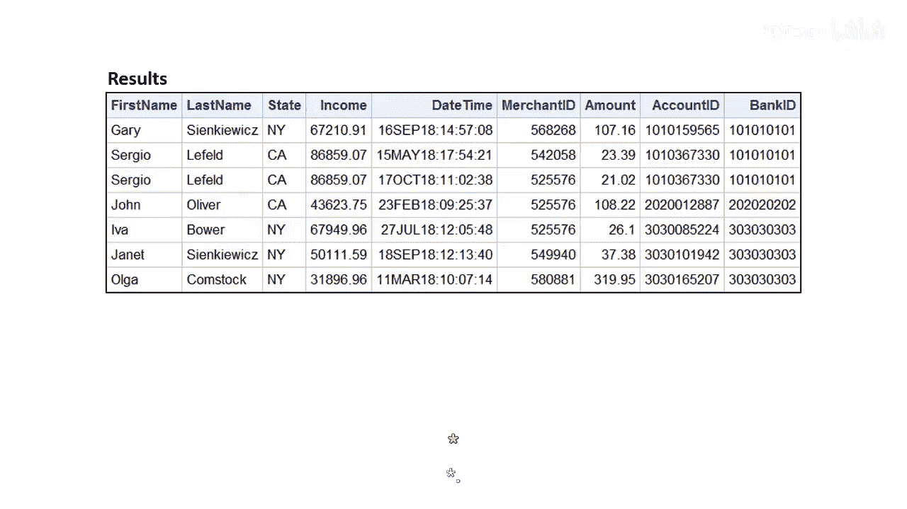
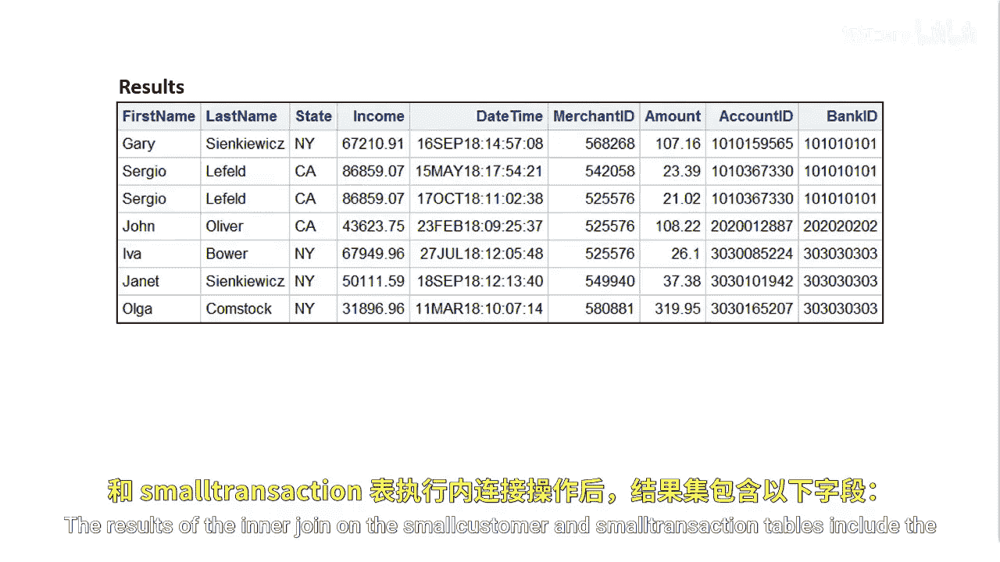
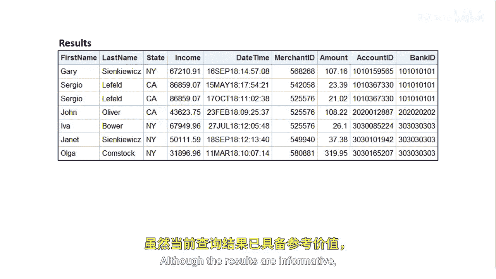

# 047：从两个以上表中选择数据 🧩

在本节课中，我们将学习如何通过一次查询，将两个以上的数据表连接起来，以获取更完整、更易于理解的信息。



上一节我们介绍了两个表之间的内连接。本节中我们来看看如何将三个或更多的表连接在一起。

## 内连接结果分析


对小型客户表和小型交易表执行内连接后，结果包含以下列：`first_name`、`last_name`、`state`、`income`、`date_time`、`merchant_id`、`amount`、`account_id` 和 `bank_id`。




虽然这些结果提供了信息，但我们希望更深入地了解银行和商户的详细信息。

## 连接多个表的必要性




我们不想通过查找 `bank_id` 和 `merchant_id` 来获取对应的银行名和商户名。


我们希望直接找到一个包含这些必要信息的表。

## 解决方案：多表连接


为了完成这个任务，我们需要找到包含 `bank_id` 和 `merchant_id` 对应信息的查找表，然后在一次查询中将所有这些表连接起来。

以下是实现多表连接的基本步骤：


1.  **识别关键列**：确定连接各个表所需的关键列，通常是主键或外键。
2.  **编写连接语句**：在 `PROC SQL` 的 `SELECT` 语句中使用多个 `JOIN` 子句。
3.  **指定连接条件**：为每个 `JOIN` 明确指定表之间的连接条件。

一个典型的多表连接 `PROC SQL` 代码如下：

```sas
PROC SQL;
    SELECT 
        c.first_name,
        c.last_name,
        t.amount,
        b.bank_name,      -- 来自银行查找表
        m.merchant_name   -- 来自商户查找表
    FROM 
        work.small_customer AS c
    INNER JOIN 
        work.small_transaction AS t
        ON c.customer_id = t.customer_id
    LEFT JOIN 
        work.bank_lookup AS b
        ON t.bank_id = b.bank_id
    LEFT JOIN 
        work.merchant_lookup AS m
        ON t.merchant_id = m.merchant_id;
QUIT;
```


通过这种方式，我们可以将客户信息、交易记录、银行详情和商户详情整合到一个清晰的结果集中，无需手动查找ID对应的名称。

本节课中我们一起学习了如何从两个以上的表中选择和连接数据。关键在于理解表之间的关系，并依次使用 `JOIN` 子句将它们组合起来，从而在一次查询中获得丰富、直观的分析结果。