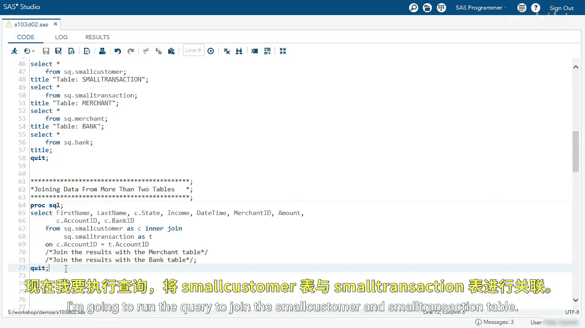
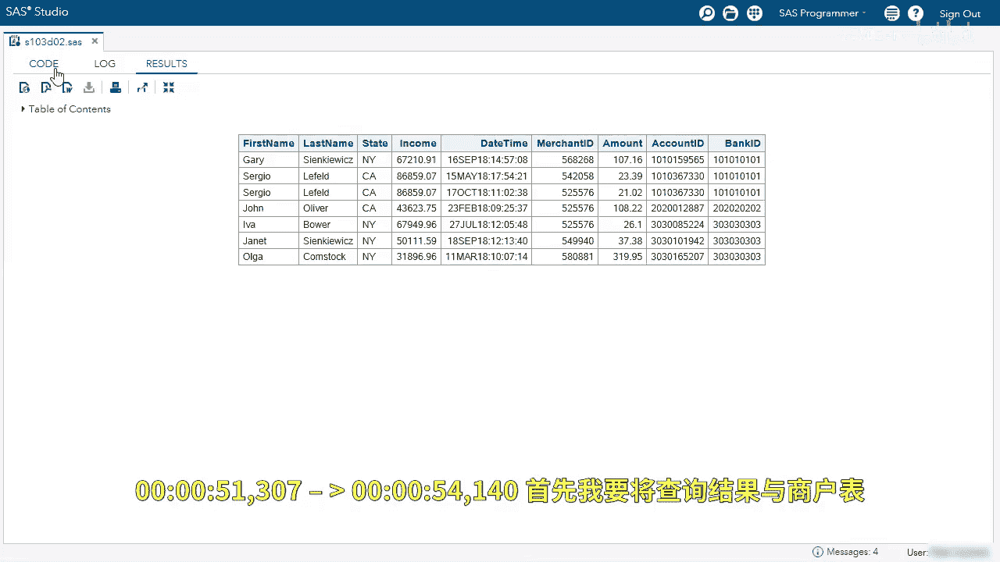
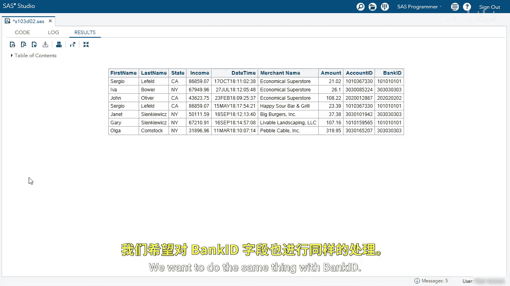
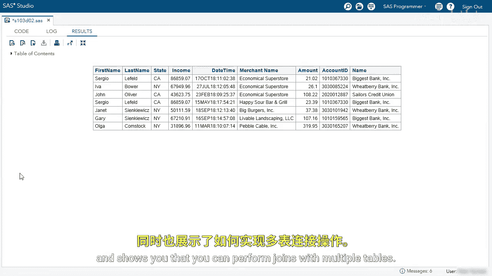

# 048：对四个表执行内连接演示 🧩

在本节课中，我们将学习如何使用Proc SQL对四个数据表执行内连接操作。我们将从一个简单的两表连接开始，逐步添加第三和第四个表，以获取更丰富的信息，例如商户名称和银行名称。


## 概述

我们将使用Proc SQL执行内连接。首先，我们会探索将要使用的数据表，然后分步演示如何连接它们，最终生成一个包含客户信息、交易记录、商户名称和银行名称的完整报告。

## 探索数据表


以下是我们要使用的四个数据表：


*   **小型客户表**：包含客户信息。
*   **小型交易表**：包含客户的交易记录。我们之前通过`AccountID`来连接此表。
*   **商户表**：包含商户ID和对应的商户名称。
*   **银行表**：包含银行ID和对应的银行名称。



我们的目标是连接这些表，以便在结果中不仅看到商户ID和银行ID，还能看到它们对应的名称。

## 第一步：连接客户表与交易表

首先，我们运行一个查询来连接`小型客户表`和`小型交易表`。这是后续多表连接的基础。



```sql
PROC SQL;
    SELECT *
    FROM work.small_customer AS C
    INNER JOIN work.small_transaction AS T
        ON C.AccountID = T.AccountID;
QUIT;
```

在结果中，我们可以看到`MerchantID`和`BankID`，但我们不知道它们具体代表哪个商户或银行。

## 第二步：加入商户表以获取商户名称

上一节我们得到了客户和交易信息的合并结果。本节中，我们来看看如何加入第三个表——商户表，以将商户ID替换为更具可读性的商户名称。

我们将使用`INNER JOIN`来连接上一步的结果与商户表。

以下是连接三个表的关键步骤：
1.  使用`INNER JOIN`引入`SQ.merchant`表，并为其指定别名`M`。
2.  使用`ON`子句指定连接条件：交易表的`MerchantID`等于商户表的`MerchantID`。
3.  在`SELECT`语句中，将`MerchantID`替换为`M.Name`以选择商户名称。

修改后的查询代码如下：


```sql
PROC SQL;
    SELECT C.*, T.TransactionDate, T.Amount,
           M.Name AS MerchantName,  -- 替换MerchantID为商户名称
           T.BankID
    FROM work.small_customer AS C
    INNER JOIN work.small_transaction AS T
        ON C.AccountID = T.AccountID
    INNER JOIN work.small_merchant AS M  -- 加入第三个表
        ON T.MerchantID = M.MerchantID;
QUIT;
```

运行此查询后，结果中原本的`MerchantID`列现在显示为从商户表获取的`MerchantName`，这为我们提供了更多信息。

## 第三步：加入银行表以获取银行名称



现在，我们的结果已经包含了商户名称。接下来，我们执行最后一步，加入第四个表——银行表，以获取银行名称。

我们将再次使用`INNER JOIN`来连接当前结果与银行表。

以下是加入银行表的步骤：
1.  在前一个`INNER JOIN`后，继续添加一个`INNER JOIN`，引入`work.small_bank`表，并为其指定别名`B`。
2.  使用`ON`子句指定新的连接条件：客户表的`BankID`等于银行表的`BankID`。
3.  在`SELECT`语句中，将`C.BankID`替换为`B.Name`以选择银行名称。

完整的四表连接查询代码如下：

```sql
PROC SQL;
    SELECT C.CustomerID, C.Name AS CustomerName, C.AccountID,
           T.TransactionDate, T.Amount,
           M.Name AS MerchantName,
           B.Name AS BankName  -- 替换BankID为银行名称
    FROM work.small_customer AS C
    INNER JOIN work.small_transaction AS T
        ON C.AccountID = T.AccountID
    INNER JOIN work.small_merchant AS M
        ON T.MerchantID = M.MerchantID
    INNER JOIN work.small_bank AS B  -- 加入第四个表
        ON C.BankID = B.BankID;
QUIT;
```


运行最终的查询。现在，在结果的最后一列，我们可以看到从银行表获取的`BankName`。这份报告比最初的两表连接包含了更丰富的信息。

## 总结



本节课中我们一起学习了如何使用Proc SQL对多个数据表执行内连接。我们从连接两个核心表开始，然后逐步加入商户表和银行表，最终生成了一个集成了客户信息、交易详情、商户名称和银行名称的综合报告。这个演示清楚地表明，你可以通过连续使用`INNER JOIN`子句来连接任意多个存在关联关系的表，从而从分散的数据中提取出有意义的业务洞察。