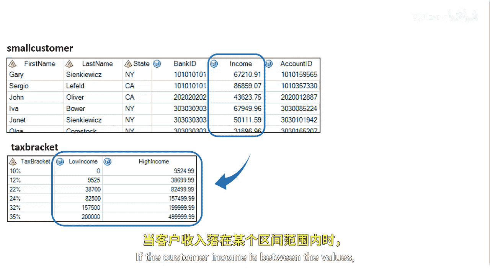

# 050：创建非等值连接 🔗

在本节课中，我们将要学习如何创建非等值连接。虽然内连接或等值连接非常重要，但有时我们需要根据非等值的条件来关联数据表。

## 概述
上一节我们介绍了基于等值条件的连接。本节中我们来看看如何使用比较运算符（如大于、小于）来创建连接，这种连接被称为非等值连接。

## 应用场景：确定客户税级
假设我们需要确定每位客户的税级。为此，我们必须将每位客户的收入与税级表中的收入范围进行比较。

如果客户的收入介于税级表的某个最低值和最高值之间，那么该税级就适用于这位客户。




## 解决方案：使用比较运算符
为了解决这个问题，我们可以调整 `ON` 子句，使用比较运算符来代替等号。

以下是实现此逻辑的SQL代码示例：
```sql
SELECT c.customer_id, c.income, t.tax_bracket
FROM customers c
INNER JOIN tax_brackets t
ON c.income > t.low_income AND c.income <= t.high_income;
```
在这段代码中，我们使用了大于（`>`）和小于等于（`<=`）运算符。我们将客户的收入与税级表中的低收入值和高收入值进行比较，利用这个范围来确定每位客户的税级。


## 核心步骤解析
以下是创建非等值连接的关键步骤：
1.  **确定连接条件**：明确需要比较的字段和逻辑关系（例如，介于某个范围）。
2.  **选择比较运算符**：根据逻辑关系，在 `ON` 子句中选用合适的运算符，如 `>`、`<`、`>=`、`<=`、`BETWEEN`。
3.  **组合条件**：通常需要使用 `AND` 来组合多个比较条件，以定义一个有效的范围或规则。


## 总结
本节课中我们一起学习了非等值连接的创建方法。我们了解到，通过将 `ON` 子句中的等号（`=`）替换为其他比较运算符，可以根据更灵活的条件（如数值范围）来关联多个表中的数据。这在处理诸如税级划分、折扣区间等基于范围的业务逻辑时非常有用。