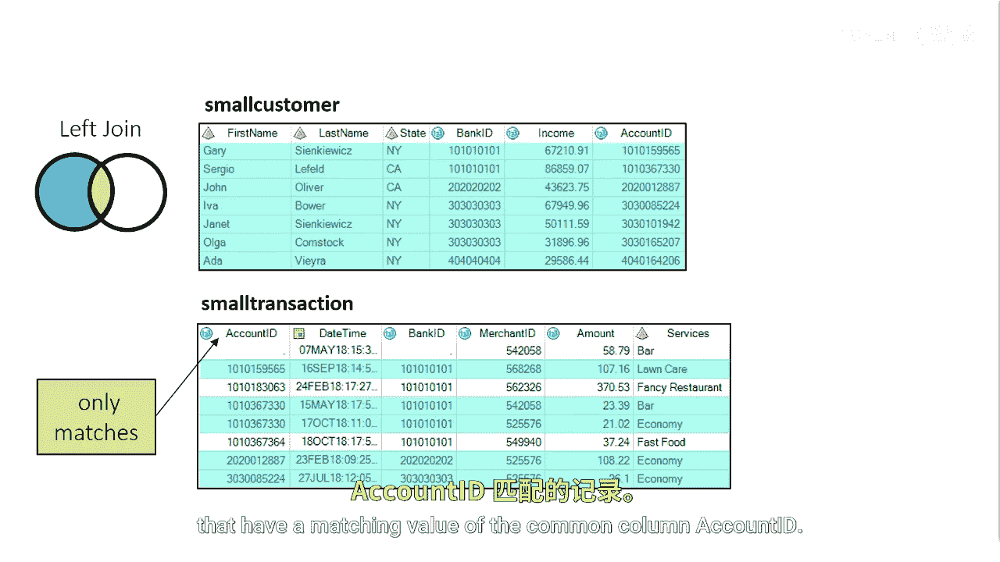
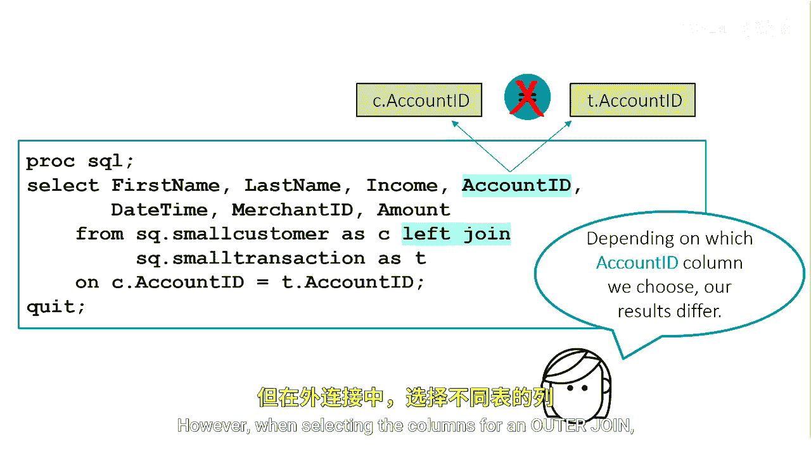

# 052：执行左外连接与右外连接

在本节课中，我们将学习如何使用SAS SQL执行左外连接和右外连接。这两种连接方式允许我们在合并表时，保留其中一个表中的所有行，无论它们在另一个表中是否有匹配项。这对于生成包含所有客户或所有交易的报告非常有用。

## 左外连接：保留左表所有行

假设我们需要一份报告，列出所有客户，无论他们是否有交易记录。



上一节我们介绍了内连接，本节中我们来看看如何执行左外连接。左外连接会返回左表（`small_customer`）中的所有行，以及右表（`small_transaction`）中与连接条件匹配的行。如果右表中没有匹配项，结果集中对应的列将显示为缺失值。

以下是执行左外连接的SQL代码结构：
```sql
PROC SQL;
    SELECT *
    FROM small_customer AS c
    LEFT JOIN small_transaction AS t
    ON c.account_id = t.account_id;
QUIT;
```
*   **`FROM small_customer AS c`**：指定左表为`small_customer`，并为其定义别名`c`。
*   **`LEFT JOIN small_transaction AS t`**：指定进行左外连接，右表为`small_transaction`，别名为`t`。
*   **`ON c.account_id = t.account_id`**：定义连接条件，即两个表通过`account_id`列进行匹配。

如果使用内连接，则只会列出有匹配交易的客户。而左外连接确保了报告包含`small_customer`表中的所有客户。


## 右外连接：保留右表所有行

那么，如果我们想查看一份报告，列出所有交易记录，无论其是否有对应的客户信息，该如何操作呢？


上一节我们使用左外连接保留了客户表的所有行，本节中我们来看看其反向操作——右外连接。右外连接会返回右表（`small_transaction`）中的所有行，以及左表（`small_customer`）中与连接条件匹配的行。

以下是执行右外连接的SQL代码结构：
```sql
PROC SQL;
    SELECT *
    FROM small_customer AS c
    RIGHT JOIN small_transaction AS t
    ON c.account_id = t.account_id;
QUIT;
```
*   **`RIGHT JOIN small_transaction AS t`**：指定进行右外连接，此时`small_transaction`表作为右表。
*   连接条件`ON`子句保持不变。


右外连接与左外连接逻辑相反。在`FROM`子句中，第二个列出的表（即`RIGHT JOIN`后面的表）成为右表。查询结果将包含右表的所有行（无论是否匹配）以及左表中所有匹配的行。

## 外连接中选择列的重要区别

在执行内连接时，选择哪个表的连接条件列（如`account_id`）通常没有区别，返回的结果是相同的。

然而，在执行外连接时，选择来自左表还是右表的连接条件列，可能会导致不同的结果。这是因为外连接会为一侧表中未匹配的行生成缺失值。如果选择包含缺失值的那一方的列，那么这些行的连接条件列也会显示为缺失。理解这一点对于准确解读外连接的结果至关重要。



本节课中我们一起学习了SAS SQL中的左外连接与右外连接。左外连接（`LEFT JOIN`）保留左表全部行，右外连接（`RIGHT JOIN`）保留右表全部行。它们都是生成包含“所有”记录报告的有力工具，同时需要注意在外连接中选择输出列可能对结果产生影响。