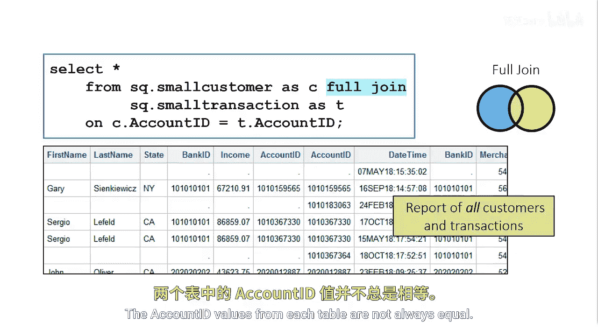
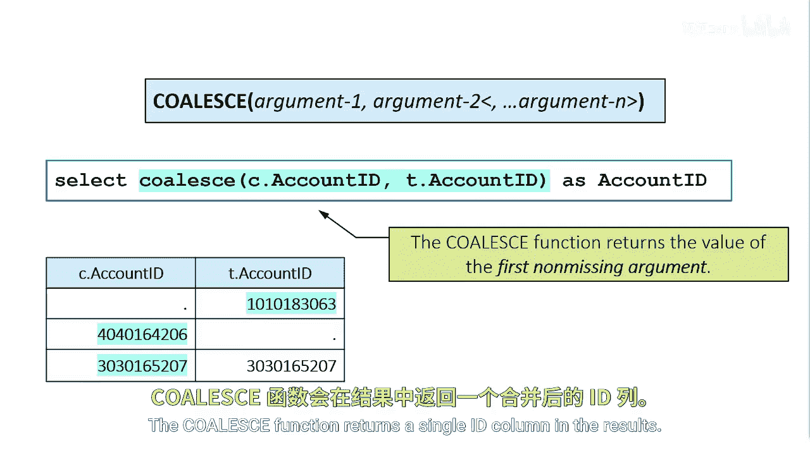

# 053：使用全连接合并两个表

在本节课中，我们将学习如何使用**全连接**来合并两个表，以生成一份包含所有匹配及不匹配记录的完整报告。我们还将介绍如何使用`COALESCE`函数来处理合并后可能出现的缺失值问题。

## 概述：全连接的应用场景

假设你需要生成一份报告，其中包含所有客户及其交易记录，无论这些记录在两个表中是否存在匹配项。


## 使用全连接合并数据

上一节我们介绍了合并表的基本概念，本节中我们来看看如何实现包含所有记录的合并。你可以使用**全连接**来同时包含匹配的记录和不匹配的记录。



以下是全连接操作的图示：


## 处理合并后的列值问题

当我们使用全连接合并两个表时，来自两个表的账户ID值并不总是相等。如果我们需要在最终报告中包含账户ID列，该如何选择包含有效值的ID呢？

以下是该问题的图示：


## 使用COALESCE函数整合列


为了解决上述问题，我们可以使用`COALESCE`函数来叠加列。`COALESCE`函数返回其参数列表中第一个非缺失的值。

以下是一个在SAS中使用`COALESCE`函数的代码示例：

```sas
/* 使用全连接合并表，并用COALESCE函数处理账户ID */
proc sql;
    create table full_join_report as
    select
        coalesce(a.account_id, b.account_id) as account_id,
        a.customer_name,
        b.transaction_amount
    from
        customers as a
    full join
        transactions as b
    on a.account_id = b.account_id;
quit;
```

这个例子在前一个全连接示例的基础上增加了`COALESCE`函数，用于叠加两个账户ID列。该函数在结果中返回一个单一的ID列。

以下是使用`COALESCE`函数后的结果图示：



## 总结


本节课中我们一起学习了**全连接**的用法，它能够合并两个表的所有行，无论是否存在匹配键。我们还掌握了如何使用`COALESCE`函数来智能地选择第一个可用的非缺失值，从而在合并后生成整洁、可用的数据列。这是生成包含完整数据视图报告的关键技术。