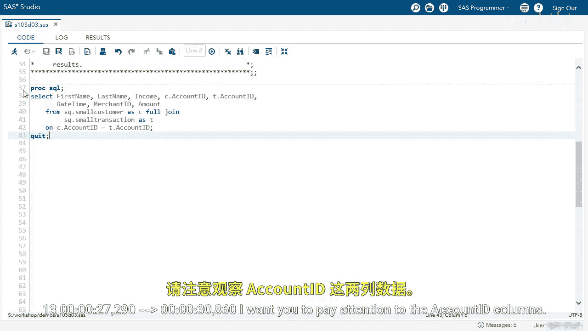
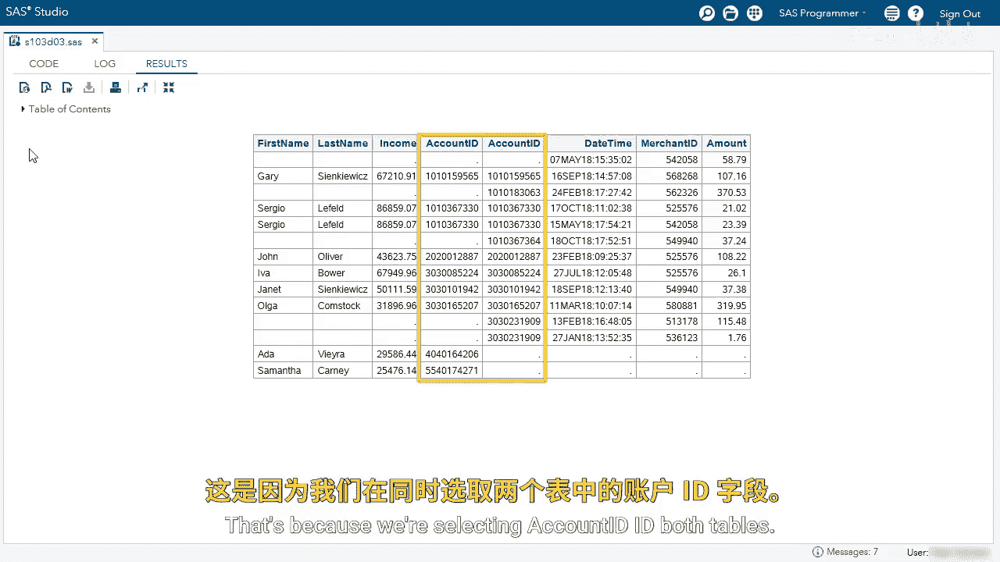
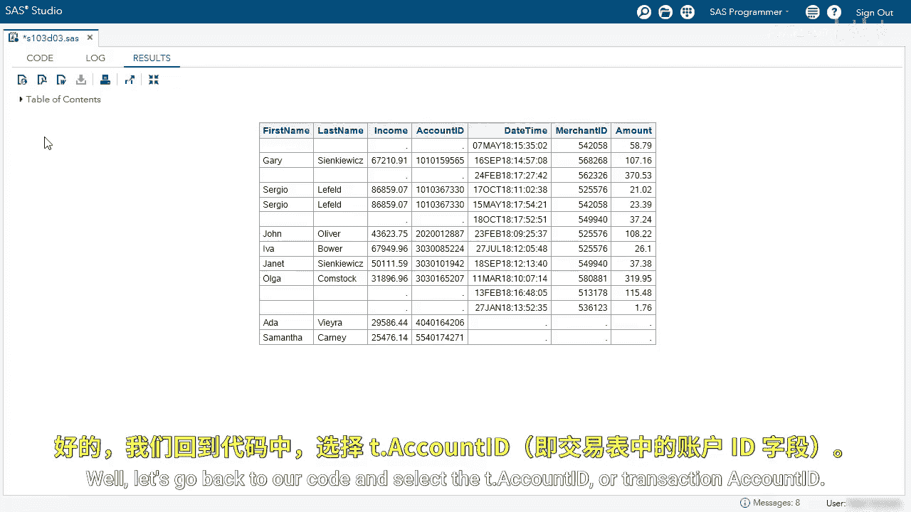
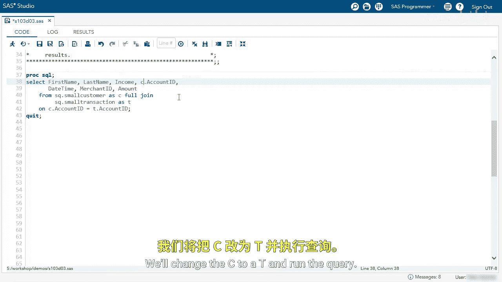
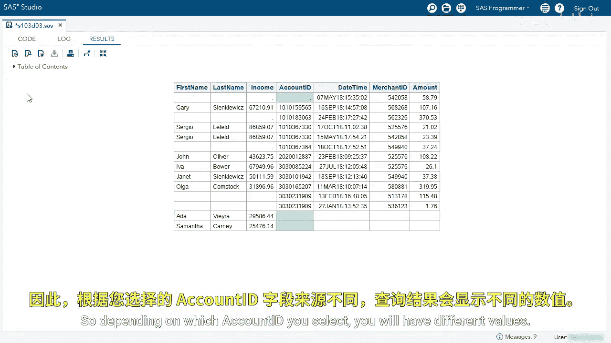
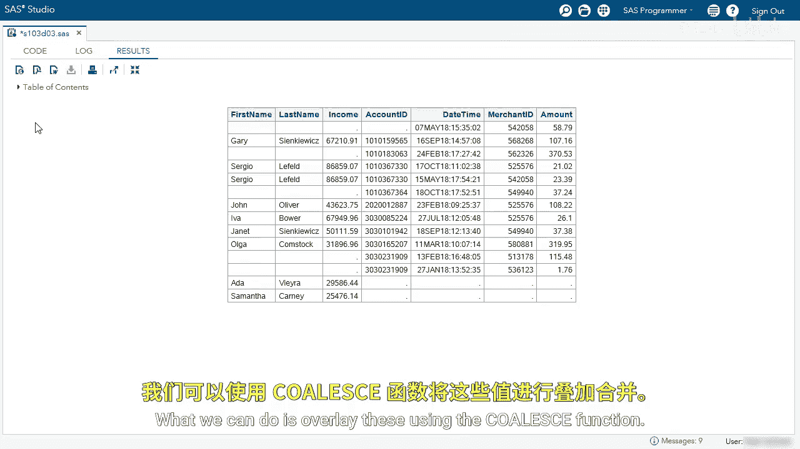
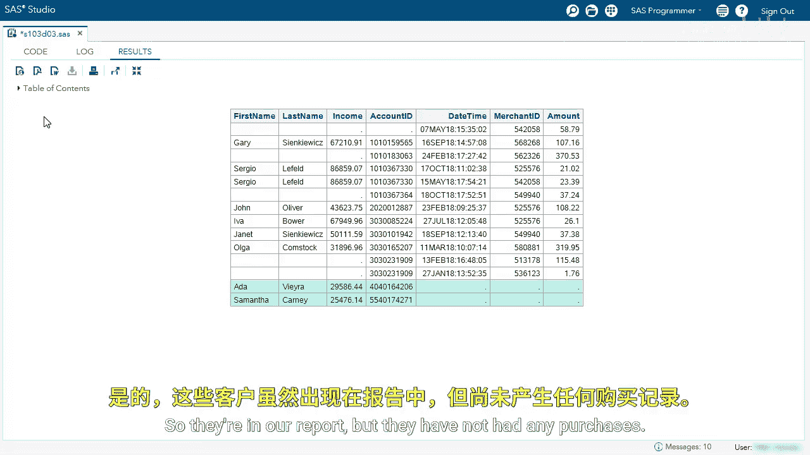

# 054：使用 PROC SQL 执行全连接 🧩

在本节课中，我们将学习如何使用 PROC SQL 在 SAS 中执行全连接操作。全连接能够合并两个表中的所有记录，无论它们在连接键上是否匹配。我们将通过一个具体的例子，演示如何编写查询、处理结果，并解决连接后可能出现的重复列问题。

---

我们使用 PROC SQL 在两个表之间执行全连接。让我们查看这个查询。

我们选择名字、姓氏、收入，并且同时选择两个账户 ID：一个来自 `small_customer` 表，一个来自 `small_transaction` 表。我们还选择日期时间、商户 ID 和金额。我们基于 `account_id` 对 `small_customer` 和 `small_transaction` 表进行全连接。

我们运行查询并查看结果。

请注意观察两个 `account_id` 列。它们完全相同吗？

可以看到一些差异：有些行两个值都缺失，有些行两个值都有。有时左边的值缺失，有时右边的值缺失。这是因为我们同时从两个表中选择了 `account_id` 列。我们的目标是合并这两列。

---

我将移除 `T.account_id`，即来自 `small_transaction` 表的账户 ID。然后运行查询。

---

现在你看到有多少个缺失的 `account_id` 值？

---

我看到有五个。让我们回到代码，改为选择 `T.account_id`，即交易表的账户 ID。

---

我们将代码中的 `C` 改为 `T`。

---

然后运行查询。现在我看到 `account_id` 有三个缺失值。

因此，根据你选择哪个 `account_id`，你会得到不同的值。

---

我们可以使用 `COALESCE` 函数来合并这两个列。

---

回到编辑器，使用 `COALESCE` 函数。我们将两个 `account_id` 作为参数传入。

我将删除旧的 `account_id` 列。并稍微清理一下代码。

我将这个新列命名为 `acct_id`，并赋予它 `10.` 的格式，以确保显示完整的数字。

---

现在查看 `account_id` 列，可以看到我们只有一个缺失值。

这样我们就合并了这两列，并取用了第一个非缺失值。

通过这份报告，我们完成了一个全连接。我想进一步分析一下。

查看第一行，我们没有账户 ID、名字、姓氏或收入值。我们不知道是哪位顾客进行了这笔购买，也许这个人是用现金支付的。

可以看到剩余的行都有账户 ID，因此那些有顾客信息的行可以轻松匹配。但有些行没有顾客姓名和收入，由于某些原因我们缺少这些值，这可能需要进一步调查。

最后，我想看看最后两行。我们有顾客 Ada 和 Samantha。她们没有日期时间、商户 ID 或金额信息。这些顾客没有购买任何东西，所以她们出现在报告中，但没有任何购买记录。

---

---

## 总结

在本节课中，我们一起学习了如何使用 PROC SQL 执行全连接。我们了解到全连接会返回两个表中所有的行，无论连接条件是否匹配。当两个表都有连接键列时，会产生重复列，我们演示了如何使用 `COALESCE` 函数来合并这些列，取用第一个非缺失值。最后，我们分析了连接结果，识别出那些只有交易记录没有顾客信息，以及只有顾客信息没有交易记录的行，这有助于我们理解数据的完整性和潜在的数据质量问题。