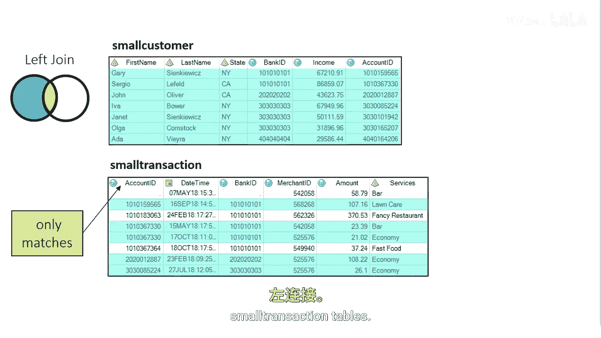
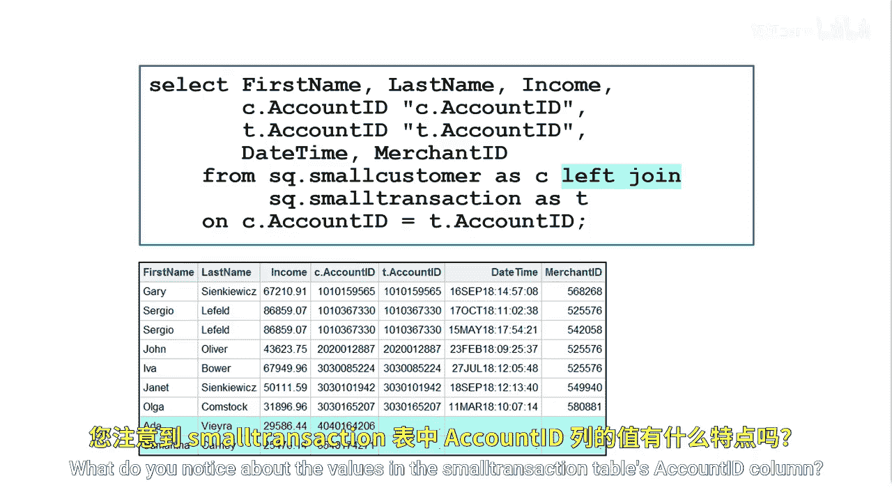

# 055：识别不匹配的行 🔍

在本节课中，我们将学习如何利用左连接（LEFT JOIN）来识别两个数据表中不匹配的行。具体来说，我们将找出那些在客户表中存在，但在交易表中没有对应记录的客户。

---



## 回顾左连接

上一节我们介绍了表连接的基本概念。现在，让我们回顾之前使用小型客户表（`small_customer`）和小型交易表（`small_transaction`）创建的左连接。


这个左连接的结果集包含了所有客户，无论他们是否有交易记录。有交易的客户，其交易信息会被匹配并显示；没有交易的客户，其交易表对应的列则会显示为缺失值。


## 明确目标：找出无交易的客户

假设我们的目标是生成一份年度内没有任何交易记录的客户名单。获取这份信息的目的，可能是为了向这些客户进行营销，鼓励他们更频繁地使用我们的信用卡服务。


为了达成这个目标，我们首先完成客户表与交易表之间的左连接。这一步我们已经熟悉，它会生成一份包含所有客户（无论有无交易）的报告。然而，我们的任务是专门找出那些没有交易的客户。

## 深入分析连接结果

让我们仔细查看这份连接后的报告。最后两行对应的是客户 Ada 和 Samantha。你注意到 `small_transaction` 表的 `account_ID` 列在这两行中的值有什么特点吗？



关键点在于，对于没有匹配交易记录的客户（如 Ada 和 Samantha），来自交易表（即右表）的列（例如 `T_account_ID`）的值是**缺失的**（在SAS中表示为空值或 `null`）。


因此，要生成无交易客户的名单，我们需要筛选出那些 `T_account_ID`（即来自 `small_transaction` 表的 `account_ID`）值为缺失的行。这些行就标识了所有没有交易记录的客户。


## 实现方法：添加 WHERE 子句过滤

我们可以在左连接的 `PROC SQL` 语句中添加一个 `WHERE` 子句，来筛选出 `small_transaction` 表的连接键（`account_ID`）为 `null` 的所有行。

以下是实现此逻辑的SQL代码示例：


```sql
PROC SQL;
    CREATE TABLE customers_no_transaction AS
    SELECT c.*
    FROM small_customer c
    LEFT JOIN small_transaction t
        ON c.account_ID = t.account_ID
    WHERE t.account_ID IS NULL;
QUIT;
```

这段代码将创建一个左连接，但只返回客户没有交易记录的结果。**`WHERE` 子句在连接操作完成之后对行进行过滤**。


通过这种方式，我们最终得到的数据集 `customers_no_transaction` 将只包含那些在 `small_transaction` 表中没有匹配项的客户信息。

---

## 本节总结


本节课中，我们一起学习了如何利用左连接结合 `WHERE` 子句来识别两个表之间不匹配的行。核心步骤是：
1.  执行左连接，保留左表（本例中的客户表）的所有行。
2.  在 `WHERE` 子句中，筛选右表（本例中的交易表）的连接键值为 `NULL` 的行。
这种方法非常适用于查找“存在于A表但不存在于B表”的数据场景，例如找出未下单的客户、未注册的用户等。