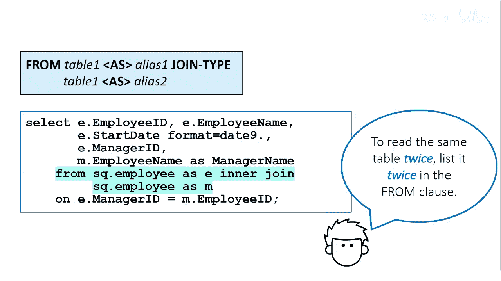

# 056：使用自反连接 👥

在本节课中，我们将学习如何使用自反连接（Self-Join）来解决一个常见的数据查询问题：如何从一个员工表中，同时获取员工及其直接经理的姓名。

## 概述

假设我们需要创建一个表格，其中列出所有员工以及每位员工的直接经理姓名。

员工表包含了所有员工的列表以及多个列。员工ID列包含了所有员工，包括经理本人。然而，该表并不直接包含员工的经理姓名，只包含每位员工的经理ID。

因此，我们需要为每位员工找到其经理的姓名。

## 问题分析与解决思路


我们可以通过员工表自身进行自反连接来满足这个需求。

观察第一行数据，员工Abbott Ray的经理ID是121144。如果我们向下查看员工ID列，会发现员工ID 121144对应的也是一位员工，但她同时也是一位经理。通过将员工表与自身进行连接，我们就可以获取到经理的姓名。

## 实施步骤：自反连接

为了从同一张表中读取两次，该表必须在FROM子句中出现两次。同时，需要使用不同的表别名来区分这两个实例。

我们将第一次出现的表别名为 **E**（代表员工），第二次出现的表别名为 **M**（代表经理）。

以下是实现此连接的核心SQL代码结构：


```sql
PROC SQL;
    CREATE TABLE work.emp_mgr AS
    SELECT E.Employee_ID,
           E.Employee_Name,
           E.Manager_ID,
           M.Employee_Name AS Manager_Name
    FROM sashelp.employees AS E
    LEFT JOIN sashelp.employees AS M
        ON E.Manager_ID = M.Employee_ID;
QUIT;
```

**关键连接逻辑公式**：
`E.Manager_ID = M.Employee_ID`

这个连接条件意味着：用员工表（E）中的经理ID，去匹配经理表（M）中的员工ID，从而找到对应的经理记录。

## 总结



本节课我们一起学习了自反连接的应用。通过将同一张表使用不同别名进行自连接，我们成功地解决了从单一数据源中同时获取员工及其上级经理信息的问题。这种方法在处理具有层级关系（如组织架构、产品分类）的数据时非常实用。