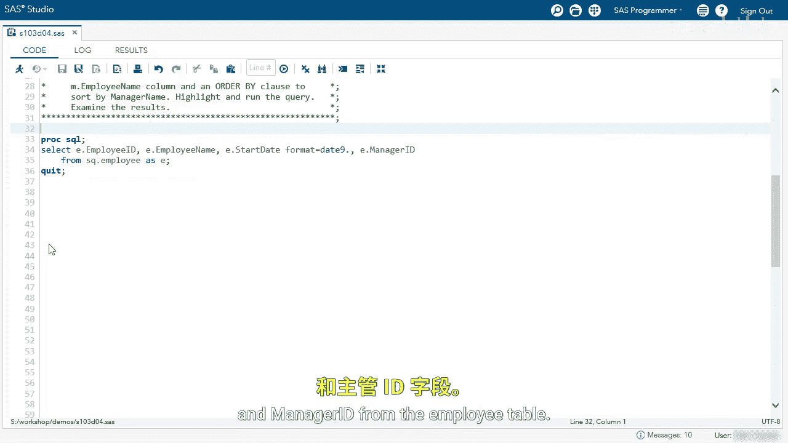
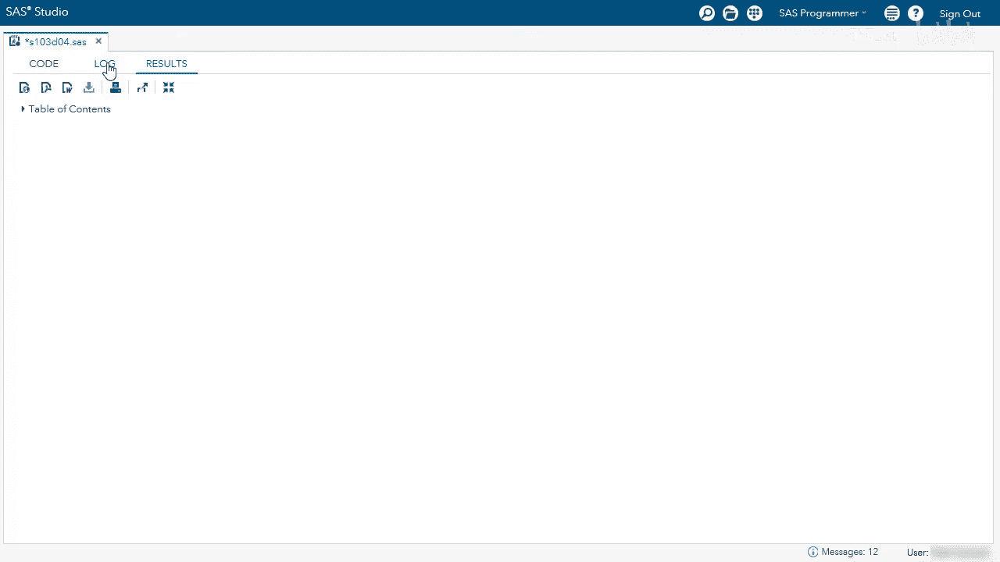

# 057：执行自反连接演示 🧩

在本节课程中，我们将学习如何使用PROC SQL在SAS中执行自反连接（或称自连接）。自反连接是一种特殊的连接操作，它允许我们将同一张表视为两个独立的实体进行连接，常用于解决如查找员工与其经理对应关系这类问题。



## 初始查询与问题定义

首先，我们运行一个基础查询来查看员工表的结构。该查询选取了员工ID、员工姓名、入职日期以及经理ID。

```sql
SELECT EmployeeID, EmployeeName, StartDate, ManagerID
FROM SQ.emp;
```


查询结果显示了每位员工的ID、姓名、入职日期及其对应的经理ID。我们的目标是找出每位员工的经理姓名。

## 执行自反连接

为了找到经理姓名，我们需要将员工表（`SQ.emp`）与其自身进行连接。以下是实现自反连接的具体步骤。

我们将使用内连接（INNER JOIN）并在FROM子句中两次引用同一张表。为此，必须为表使用不同的别名。

以下是修改后的SQL代码：

```sql
SELECT e.EmployeeID,
       e.EmployeeName,
       e.StartDate,
       e.ManagerID,
       m.EmployeeName AS ManagerName
FROM SQ.emp AS e
INNER JOIN SQ.emp AS m
    ON e.ManagerID = m.EmployeeID
ORDER BY ManagerName;
```



**代码解析：**
*   `SQ.emp AS e`：将员工表第一次引用，别名为 `e`，代表“员工”视角。
*   `SQ.emp AS m`：将员工表第二次引用，别名为 `m`，代表“经理”视角。
*   `ON e.ManagerID = m.EmployeeID`：这是连接条件。它表示将员工（`e`）记录中的`ManagerID`与经理（`m`）记录中的`EmployeeID`进行匹配，从而找到对应的经理。
*   `m.EmployeeName AS ManagerName`：从经理视角（`m`）选取员工姓名，并将其重命名为`ManagerName`作为输出列。

## 常见错误与修正

在初次尝试编写连接条件时，一个常见的错误是在ON子句中错误地引用了表别名。

**错误示例：**
```sql
ON e.ManagerID = e.EmployeeID -- 错误！这试图在同一行数据内匹配，逻辑错误。
```
此错误会导致SAS日志提示“执行笛卡尔积”，因为连接条件逻辑无效，无法正确关联两个表实例。


**正确做法：**
必须确保连接条件关联的是两个不同的表实例。应将条件更正为：
```sql
ON e.ManagerID = m.EmployeeID -- 正确！将员工的经理ID与经理表的员工ID关联。
```


运行修正后的查询，我们即可得到包含`ManagerName`列的完整结果集，清晰展示了每位员工及其对应经理的信息。

## 本节总结


本节课中，我们一起学习了自反连接（自连接）的概念与应用。通过为同一张表赋予不同的别名（如 `e` 和 `m`），我们能够在SQL查询中将其视为两个独立的表。关键步骤在于正确编写连接条件（`ON e.ManagerID = m.EmployeeID`），从而建立员工记录与其经理记录之间的关联。这种技术是处理层次化数据（如组织架构、产品分类）的强大工具。