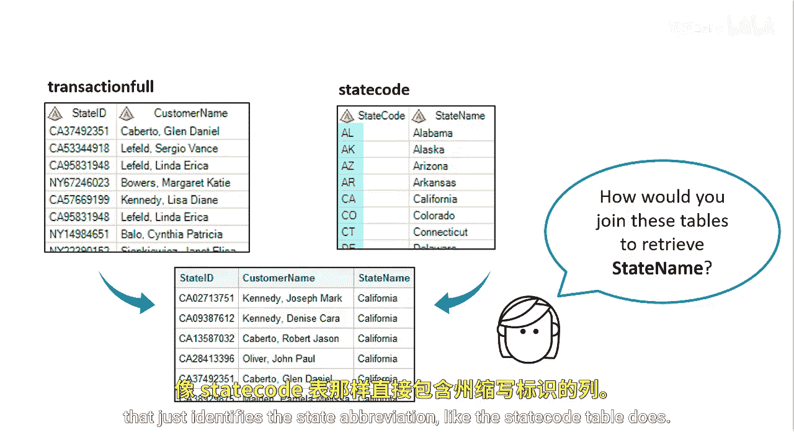

# 058：使用函数连接表

在本节课中，我们将学习如何使用SAS函数作为连接条件来合并没有共同列的数据表。我们将通过一个具体案例，演示如何利用`SUBSTR`函数提取信息，并以此为基础连接两个表。

## 概述

有时，我们需要连接的两个表之间没有可以直接匹配的列。例如，一个表包含完整的地址信息，而另一个表使用州代码缩写。本节将介绍如何运用SAS函数从现有数据中提取关键信息，从而建立表之间的连接关系。

## 使用函数建立连接条件

假设我们需要将交易明细表与州代码表进行连接，目的是为每位客户获取对应的州名称。

然而，交易明细表中并没有一个独立的列来存放与州代码表直接匹配的州缩写。




为了解决这个问题，我们可以使用**子字符串函数**。具体方法是，从交易明细表的`StateID`列中提取前两个字符，这部分内容包含了州的缩写。

然后，利用提取出的州缩写信息，与州代码表中包含州缩写的`StateCode`列进行连接。


我们可以在SQL的`ON`子句中直接使用`SUBSTR`函数来定义连接条件。

以下是实现此操作的示例代码：

```sql
PROC SQL;
    CREATE TABLE work.joined_table AS
    SELECT a.*, b.StateName
    FROM work.transaction_full a
    LEFT JOIN work.state_code b
    ON SUBSTR(a.StateID, 1, 2) = b.StateCode;
QUIT;
```


在这段代码中：
*   `SUBSTR(a.StateID, 1, 2)` 函数从`a.StateID`列的第一个字符开始，提取长度为2的子字符串。
*   提取的结果与`b.StateCode`列的值进行相等匹配，从而将两个表连接起来。

## 总结

本节课我们一起学习了在SAS中使用函数进行表连接的高级技巧。当表之间缺乏直接关联列时，我们可以通过`SUBSTR`等函数对现有数据进行加工和提取，创造出可用于连接的匹配键。这种方法极大地增强了数据处理的灵活性，是解决复杂数据合并问题的有效工具。