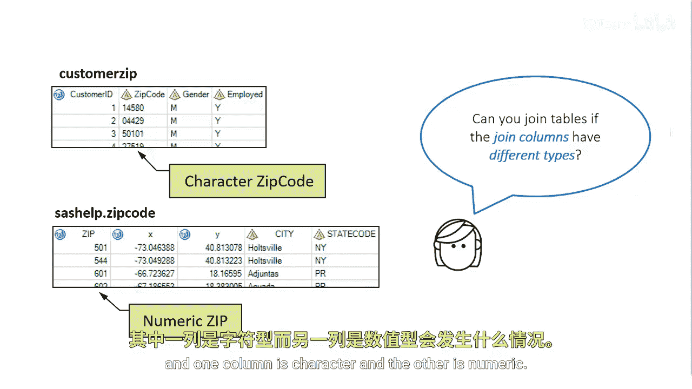

# 059：当连接列类型不同时使用函数进行连接

在本节课中，我们将学习当两个数据表的连接列具有不同数据类型（例如字符型与数值型）时，如何进行有效的连接操作。我们将探讨直接连接可能遇到的问题，并学习如何使用SAS函数来解决这些问题。

## 问题引入：连接列类型不匹配

上一节我们介绍了基于相同列进行表连接的基本方法。本节中我们来看看当连接列的数据类型不同时会发生什么情况。


在下面的例子中，我们有两个数据表。`customer_zip` 表包含字符型的邮政编码，而 `zip_codes` 表包含一个数值型的邮政编码列。


## 直接连接尝试与问题

如果连接列具有不同的数据类型，能否成功连接这两个表呢？

让我们看看当我们尝试连接一个表，其中一个列是字符型而另一个是数值型时会发生什么。



直接使用 `PROC SQL` 进行连接，例如 `ON customer_zip.zip_char = zip_codes.zip_num`，SAS会尝试进行隐式类型转换。然而，这种转换可能导致以下问题：
*   **连接失败**：如果转换不成功（例如，字符列中包含非数字字符），则相应的行无法匹配。
*   **性能下降**：隐式转换会增加处理开销。
*   **结果不可预测**：依赖于SAS的默认转换规则，可能导致意料之外的结果。

## 解决方案：使用函数进行显式类型转换


为了保证连接的准确性和效率，最佳实践是使用SAS函数对连接列进行显式的类型转换，使它们的数据类型保持一致。

以下是常用的类型转换函数：

*   **`INPUT` 函数**：将字符型数据转换为数值型数据。
    *   **公式**：`数值变量 = INPUT(字符变量, 数值格式.);`
    *   **示例代码**：`zip_num = INPUT(zip_char, 5.);` 将5位字符邮政编码转换为数值。

*   **`PUT` 函数**：将数值型数据转换为字符型数据。
    *   **公式**：`字符变量 = PUT(数值变量, 字符格式.);`
    *   **示例代码**：`zip_char = PUT(zip_num, z5.);` 将数值邮政编码转换为5位字符，不足位左补零。

## 应用示例

假设我们需要连接 `customer_zip` 和 `zip_codes` 表，我们可以选择将字符型的 `zip_char` 转换为数值型，或者将数值型的 `zip_num` 转换为字符型。

**方法一：将字符型转换为数值型后连接**
```sas
PROC SQL;
    CREATE TABLE joined_table AS
    SELECT a.*, b.*
    FROM customer_zip a
    INNER JOIN zip_codes b
    ON INPUT(a.zip_char, 5.) = b.zip_num;
QUIT;
```

**方法二：将数值型转换为字符型后连接**
```sas
PROC SQL;
    CREATE TABLE joined_table AS
    SELECT a.*, b.*
    FROM customer_zip a
    INNER JOIN zip_codes b
    ON a.zip_char = PUT(b.zip_num, z5.);
QUIT;
```

选择哪种方法取决于数据特性和后续分析的需要。通常，选择转换后能更好保持数据完整性和便于比较的格式。


## 总结

本节课中我们一起学习了如何处理连接列数据类型不同的情况。核心要点是避免依赖SAS的隐式转换，而是使用 `INPUT` 或 `PUT` 函数进行显式的类型转换，确保连接条件两边数据类型一致，从而获得准确可靠的连接结果。记住，在编写连接代码时，始终检查并处理好连接列的数据类型是成为一名高级SAS程序员的重要习惯。