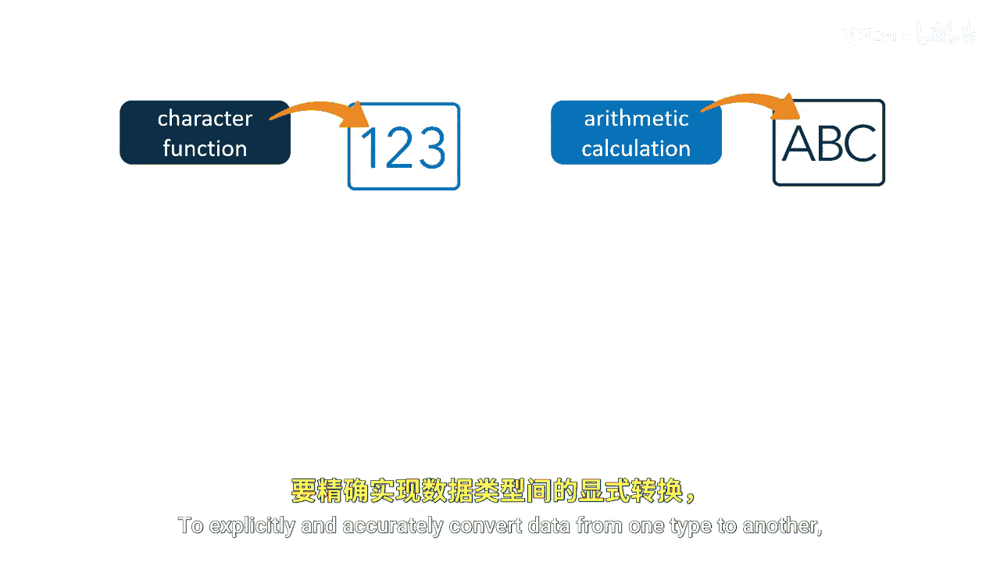

# 060：使用函数转换列值

在本节课中，我们将学习如何在SAS中转换列的数据类型。SAS不允许使用不同类型的数据列来连接表。为了明确且准确地将数据从一种类型转换为另一种类型，我们可以使用特定的函数。

## 数据类型转换的必要性



上一节我们介绍了SAS中数据类型的重要性。本节中我们来看看，当需要连接两个表，但连接键的数据类型不匹配时，我们该如何处理。SAS不允许使用不同类型的数据列来连接表。为了明确且准确地将数据从一种类型转换为另一种类型，我们可以使用特殊的函数。

## 转换函数概述

以下是两种核心的数据类型转换函数及其用途：


*   **INPUT函数**：用于将字符值转换为数值。
    *   我们使用一个**输入格式**来指示应如何读取该字符串。
    *   **公式**：`数值变量 = INPUT(字符变量, 输入格式);`
*   **PUT函数**：用于将数值转换为字符值。
    *   使用一个**输出格式**来指示应如何写入该值。
    *   **公式**：`字符变量 = PUT(数值变量, 输出格式);`

## 实战示例：转换邮政编码

现在，我们通过一个具体的例子来应用这些函数。假设我们有一个包含美国邮政编码的数值列，需要将其转换为字符类型以便进行表连接。

对于这个例子，我们可以使用PUT函数将`Z.zip`列从数值转换为字符。

以下是转换步骤：
1.  指定源列`Z.zip`。
2.  使用`Z5.`格式。
3.  `Zw.`格式会以指定的宽度写入带有前导零的标准数值数据。
4.  这里，我们指定宽度为5，因为美国邮政编码的长度是5位。
5.  例如，如果邮政编码是数值`4429`，使用`Z5.`格式的PUT函数会将其转换为字符串`"04429"`。
6.  这个转换可以在`ON`子句的连接条件中直接执行。

**代码示例**：
```sas
/* 在PROC SQL的JOIN条件中直接转换数据类型 */
proc sql;
    create table combined as
    select a.*, b.*
    from table_a as a
    inner join table_b as b
    on a.char_zip = put(b.num_zip, z5.); /* 将数值邮编转换为字符格式进行匹配 */
quit;
```

## 课程总结


本节课中我们一起学习了SAS中数据类型转换的关键技巧。我们了解到，使用`INPUT`函数可以将字符数据转换为数值，而使用`PUT`函数可以将数值数据转换为字符。通过在实际的表连接操作中应用`PUT`函数和`Zw.`格式，我们可以有效地解决因数据类型不匹配而无法连接表的问题，例如为数值邮政编码添加前导零以符合标准的字符格式。