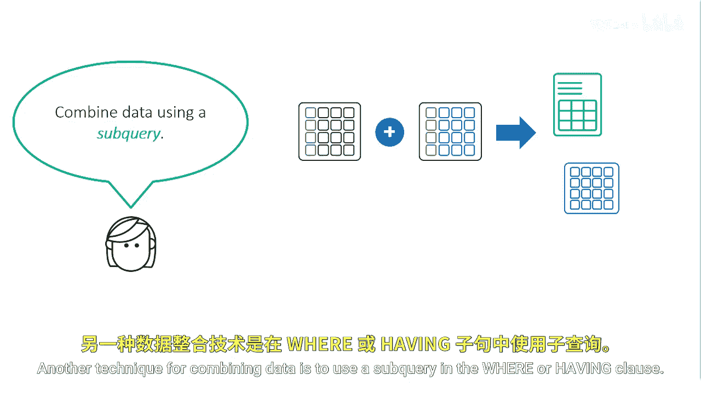
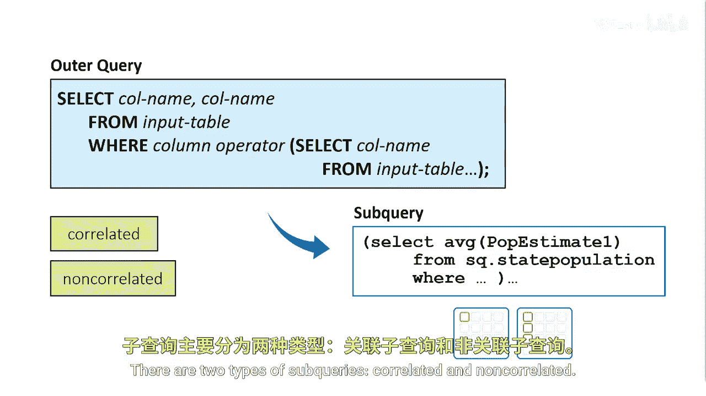
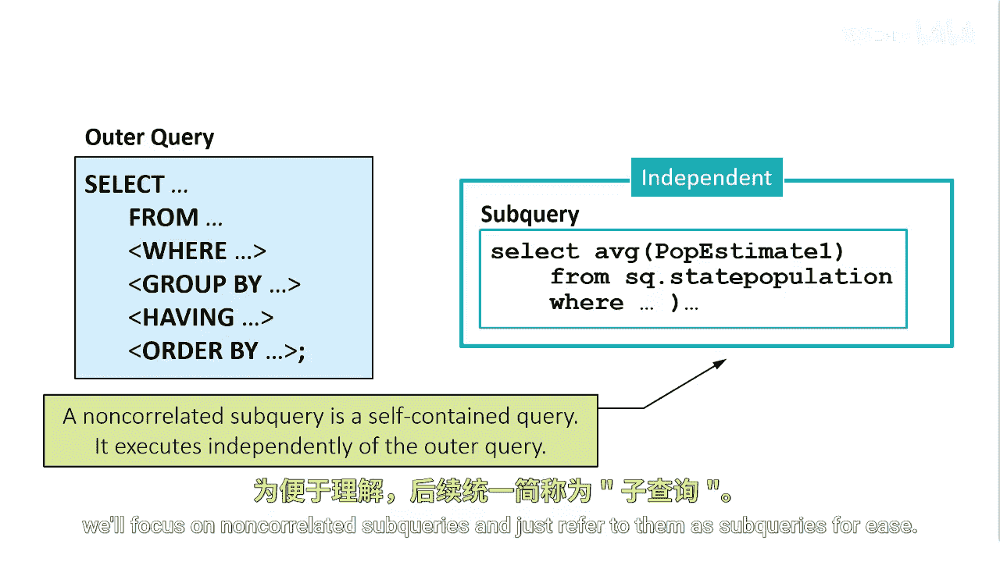

# 062：什么是子查询 🔍

在本节课中，我们将要学习SAS Proc SQL中一个重要的数据组合技术——子查询。我们将了解子查询的基本概念、它与连接（JOIN）的区别、工作原理以及主要类型。

## 概述

您知道可以通过使用不同类型的连接（JOIN）来组合来自多个表的数据。连接是在单个查询中指定的。另一种组合数据的技术是在WHERE或HAVING子句中使用子查询。

## 子查询的定义与工作原理

上一节我们提到了子查询是组合数据的一种技术，本节中我们来看看它的具体定义。

子查询，有时也称为内部查询，是嵌套在外部查询或主查询中的一个查询。Proc SQL采用由内而外的方式评估查询，即先处理子查询，最后处理外部查询。

在WHERE或HAVING子句中的子查询只能返回一列。它可以返回该列的一个单一值或多个值。

## 子查询的类型

了解了子查询的基本工作原理后，接下来我们区分一下子查询的两种主要类型。

子查询分为两种类型：相关子查询和非相关子查询。

### 非相关子查询

最常见的子查询类型是非相关子查询。非相关子查询是一个独立的、自包含的子查询。它在外部查询之前独立执行，然后将一个或多个值传递回外部查询。非相关子查询使您能够分块构建和测试代码。

在本课程中，为简便起见，我们将重点讨论非相关子查询，并直接将其称为子查询。

## 总结

本节课中我们一起学习了SAS Proc SQL中子查询的核心概念。我们了解到子查询是嵌套在主查询中的内部查询，它主要在WHERE或HAVING子句中使用，用于返回一列的一个或多个值以供外部查询筛选。Proc SQL以由内而外的顺序执行它。我们还区分了相关与非相关子查询，并明确了本课程将重点讨论独立执行的非相关子查询。掌握子查询是进行复杂数据操作和分析的关键一步。