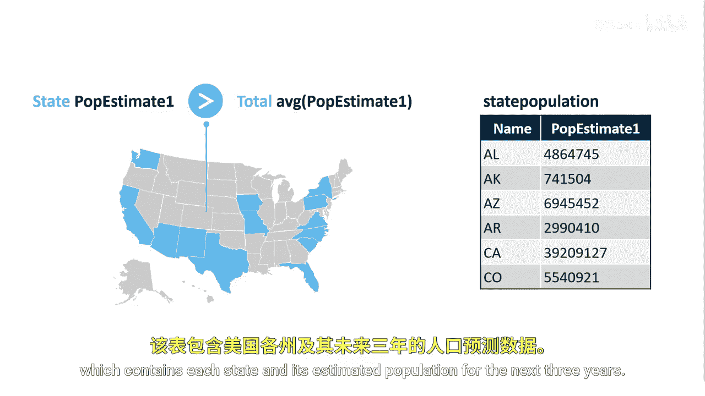
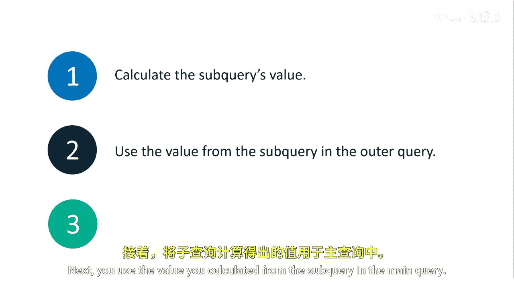
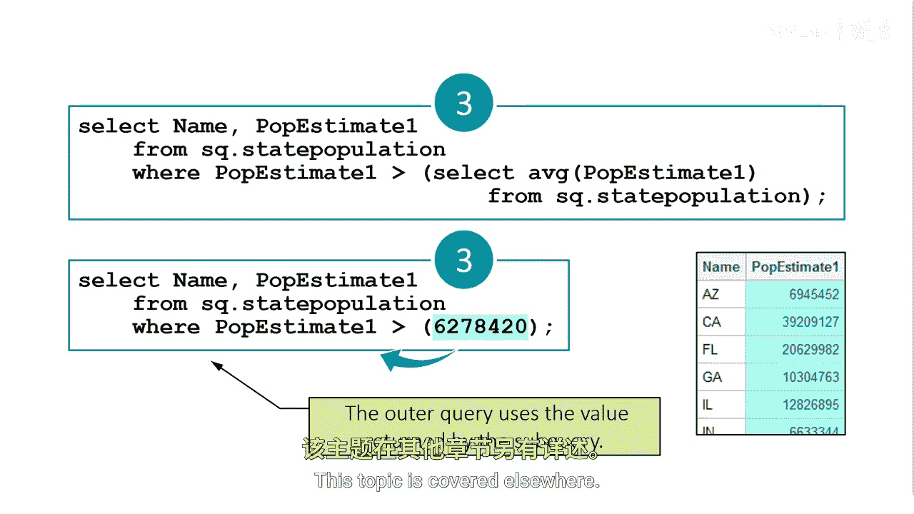

# 063：在WHERE子句中使用子查询 🧩

在本节课中，我们将学习如何在SAS的WHERE子句中有效地使用子查询。子查询是一种强大的工具，它允许您在一个查询内部嵌套另一个查询，从而使程序更加动态和高效。我们将通过一个具体的例子来理解其工作原理。

## 概述


假设您需要分析明年的预估人口数据，以决定在哪些州增加市场投入。您被要求生成一份报告，列出预估人口高于所有州平均人口的那些州。

为了完成这个任务，我们将使用一个包含各州及其未来三年预估人口的表格。



## 理解子查询的步骤

使用子查询时，将其分解为步骤有助于理解。通常，第一步是计算子查询（或内部查询）的值。接下来，在主查询中使用从子查询计算出的这个值。

最后，将子查询与外部查询结合起来。



## 分步构建查询

以下是构建查询的具体步骤。

### 第一步：计算内部查询的单一值

首先，我们需要确定内部查询需要返回的单一值，并计算它。在这个例子中，我们需要计算所有州预估人口的平均值。

```sql
/* 第一步：计算所有州明年预估人口的平均值 */
PROC SQL;
    SELECT AVG(P_estimate1) INTO :avg_pop
    FROM state_population;
QUIT;
```

此查询对 `P_estimate1` 列使用 `AVG` 函数，返回结果 `6,278,420`。这就是所有州的平均预估人口。第一步查询成功。

### 第二步：手动应用平均值进行筛选

接下来，我们需要找出人口预估超过我们计算出的平均值的那些州。我们可以手动将第一步查询得到的值放入WHERE子句中。

```sql
/* 第二步：使用静态平均值进行筛选 */
PROC SQL;
    SELECT State
    FROM state_population
    WHERE P_estimate1 > 6278420;
QUIT;
```

虽然这种方法可行，但它不够动态和高效。如果州人口表中的预估人口数据发生变化怎么办？您将不得不重新运行第一个查询以获得新的平均值，然后用新值替换第二个查询中的静态值。此外，您使用了两个查询来完成本可以用一个查询完成的任务。

### 第三步：整合为单一查询（使用子查询）

这正是我们可以使用子查询来动态、高效解决问题的完美例子。一旦前两个查询正常工作，我们就可以进入第三步，将其编写为单一查询。


```sql
/* 第三步：在WHERE子句中使用子查询 */
PROC SQL;
    SELECT State
    FROM state_population
    WHERE P_estimate1 > (SELECT AVG(P_estimate1) FROM state_population);
QUIT;
```

在第三步中，您只需将子查询插入到外部查询中。这里，我们将返回明年所有州预估人口平均值的第一个查询，放在了之前静态值的位置。

## 子查询的执行过程

当这个查询运行时，SAS首先评估内部查询并返回一个值。然后，SAS执行外部查询，并使用子查询返回的值。

这个子查询独立于外部查询执行，在执行前将一个或多个值传递回外部查询，因此它是一个**非关联子查询**。


具体过程如下：
1.  子查询执行，并将值 `6,278,420` 返回给外部查询。
2.  外部查询执行，在WHERE子句中使用这个平均值。

## 优势与注意事项

使用子查询是使您的程序更加动态和高效的好方法，并且可以解决独特的问题。

请注意，当使用子查询时，您不会直接看到从子查询检索到的值。查看该值的一种方法是将其存储在宏变量中，这个主题将在其他地方介绍。

## 总结



在本节课中，我们一起学习了如何在SAS的WHERE子句中使用子查询。我们通过一个从州人口表中筛选出高于平均预估人口的州的例子，理解了子查询的分步构建过程、执行原理及其带来的动态性和效率优势。掌握子查询将极大地增强您处理复杂数据筛选任务的能力。