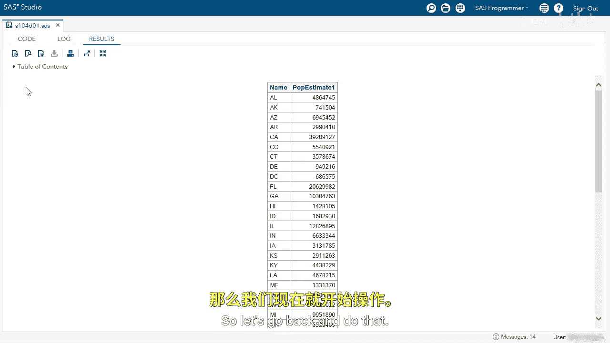
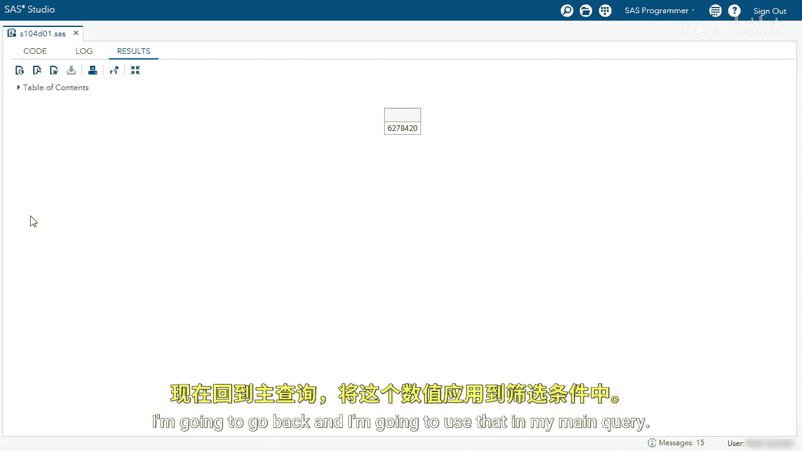
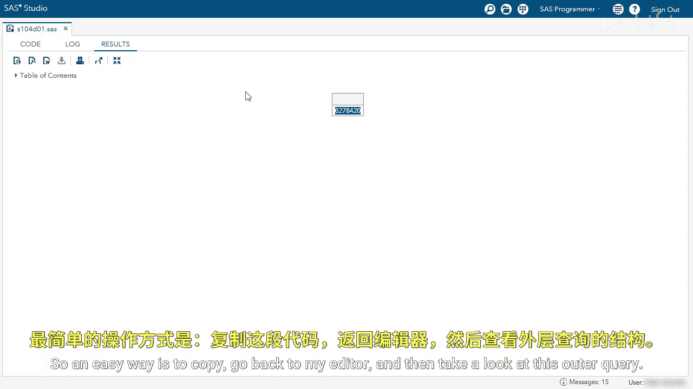
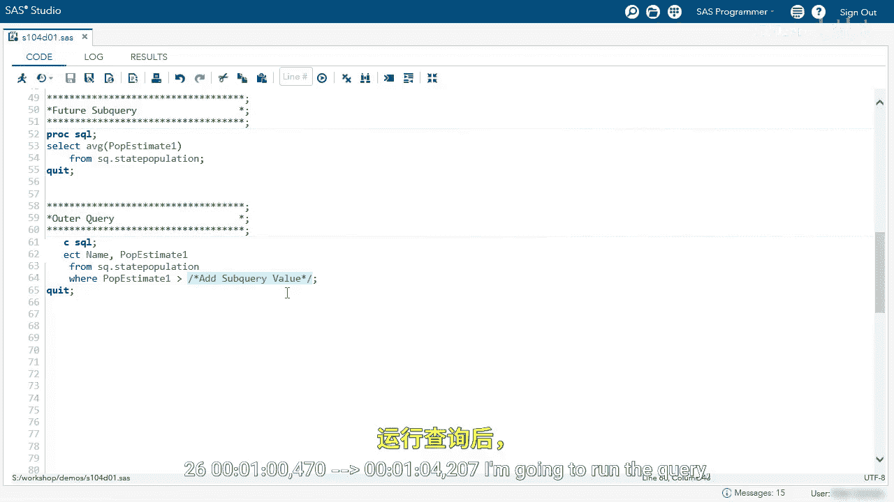
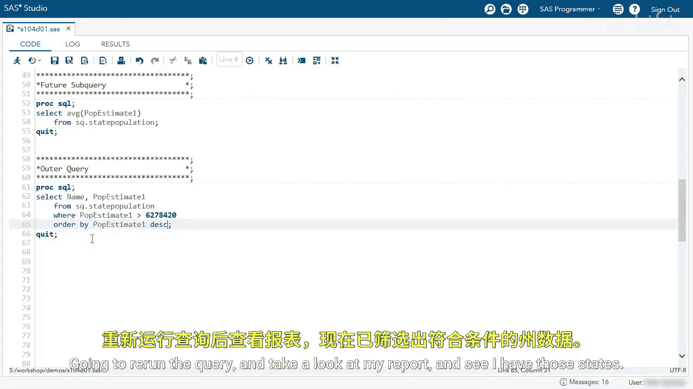
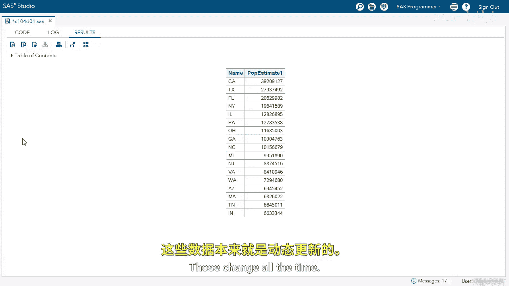

# 064：使用返回单个值的子查询 🎯

在本节课中，我们将学习如何在SAS查询中使用一种特殊的子查询——返回单个值的子查询。这种技术允许我们动态地获取一个值（如平均值、总和），并将其用于主查询的条件判断中，从而使代码更加灵活和自动化。

## 探索数据表


首先，我们来查看将要使用的数据表 `state population`。


该表包含州名缩写和人口估计值等列。我们的目标是找出所有“人口估计值1”高于总平均值的州。

## 计算平均值



为了进行比较，我们需要先计算出“人口估计值1”列的平均值。


以下是计算平均值的查询语句：
```sql
SELECT AVG(P_estimate_1) FROM state_population
```

运行该查询后，我们得到了平均值。




结果显示，平均人口约为620万。接下来，我们将把这个值用于主查询。



## 使用静态值进行查询

最直接的方法是将计算出的平均值作为一个静态数字写入主查询的条件中。




以下是主查询语句，我们暂时将平均值 `6200000` 硬编码进去：
```sql
SELECT name, P_estimate_1
FROM state_population
WHERE P_estimate_1 > 6200000
```

运行查询后，我们得到了所有人口高于平均值的州。


为了使结果更清晰，我们可以添加 `ORDER BY` 子句，按人口降序排列。

```sql
SELECT name, P_estimate_1
FROM state_population
WHERE P_estimate_1 > 6200000
ORDER BY P_estimate_1 DESC
```

再次运行查询，结果将按人口从高到低显示。




## 静态方法的局限性



然而，使用静态值存在一个问题：如果底层数据更新，平均值发生变化，我们就必须重新计算平均值，并手动更新主查询中的数字。


这个过程既繁琐又容易出错。为了解决这个问题，我们可以使用子查询。

## 引入子查询

子查询可以嵌入到主查询中，动态地提供所需的值。这样，每次运行查询时，都会自动计算最新的平均值。

以下是使用子查询的步骤：
1.  复制计算平均值的查询语句（注意不要复制末尾的分号）。
2.  在主查询中，用括号 `()` 包裹这个子查询，替换掉静态值。

修改后的查询语句如下：
```sql
SELECT name, P_estimate_1
FROM state_population
WHERE P_estimate_1 > (SELECT AVG(P_estimate_1) FROM state_population)
ORDER BY P_estimate_1 DESC
```

运行这个查询，我们会得到与之前完全相同的结果，但过程是全自动的。


## 子查询的灵活性

子查询的强大之处在于，它返回的值不一定非要来自主查询所使用的表。


例如，我们可以修改子查询，从另一个表 `SAShelp.us_data` 中计算2010年的人口平均值，并用它作为筛选条件。

```sql
SELECT name, P_estimate_1
FROM state_population
WHERE P_estimate_1 > (SELECT AVG(Population_2010) FROM SAShelp.us_data)
ORDER BY P_estimate_1 DESC
```

运行此查询，我们将基于2010年的平均人口值得出结果。


## 总结


本节课中，我们一起学习了如何使用返回单个值的子查询。
*   我们首先通过计算静态平均值来筛选数据，但指出了这种方法在数据变化时不便于维护。
*   然后，我们引入了子查询的概念，将计算平均值的语句直接嵌入到 `WHERE` 条件中，实现了条件的动态化。
*   最后，我们还了解到子查询可以引用其他表中的数据，这大大增加了查询的灵活性和功能性。


掌握这种子查询技术，能使你的SAS编程更加高效和健壮。