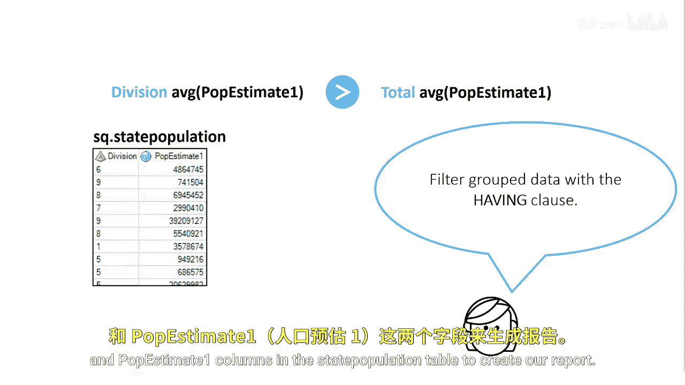
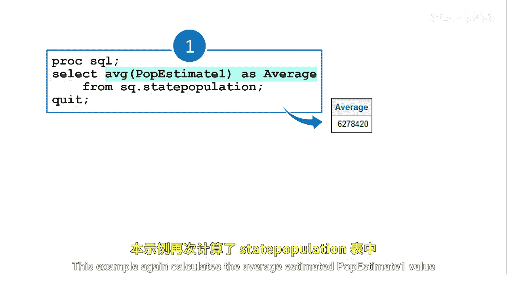
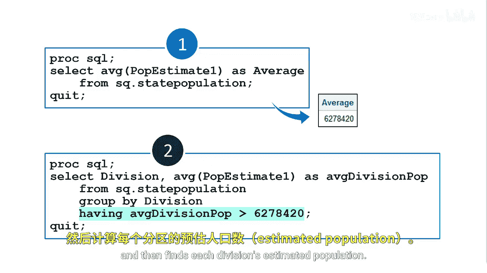

# 065：在HAVING子句中使用子查询 🎯

在本节课中，我们将学习如何在SQL的`HAVING`子句中使用子查询。我们将通过一个具体的例子来理解如何筛选分组聚合后的数据。

## 概述

上一节我们讨论了在`WHERE`子句中使用子查询。本节中，我们来看看如何在`HAVING`子句中使用子查询来对分组后的数据进行筛选。

## 场景介绍

美国被划分为九个区域，每个区域都有一个区域编号。现在需要生成一份报告，显示那些平均预估人口大于所有州总平均人口的区域。


这个场景与之前的类似，但区别在于，我们现在需要对分组后的数据进行筛选。

## 使用HAVING子句筛选分组数据

要对分组数据进行筛选，我们可以使用`HAVING`子句。我们将使用`state_population`表中的`division`和`P_estimate1`列来创建报告。



## 手动方法生成程序

首先，我们使用手动方法来生成程序。这个例子再次计算了`state_population`表中`P_estimate1`的平均值。

以下是核心的SQL代码结构：



```sql
SELECT division, AVG(P_estimate1) AS avg_pop
FROM state_population
GROUP BY division
HAVING AVG(P_estimate1) > (SELECT AVG(P_estimate1) FROM state_population);
```

## 子查询与外部查询的配合

然后，我们使用子查询返回的值来完成外部查询的`HAVING`子句。外部查询将每个州分组到其对应的区域，然后计算每个区域的预估人口平均值。



在外部查询中，我们必须使用`HAVING`子句来筛选我们的分组聚合结果。

## 总结


本节课中，我们一起学习了在SQL的`HAVING`子句中使用子查询的方法。通过一个具体的报告需求，我们了解了如何先通过子查询计算出一个整体的平均值，然后在外部查询的分组聚合中使用`HAVING`子句进行筛选，从而得到符合条件的分组结果。