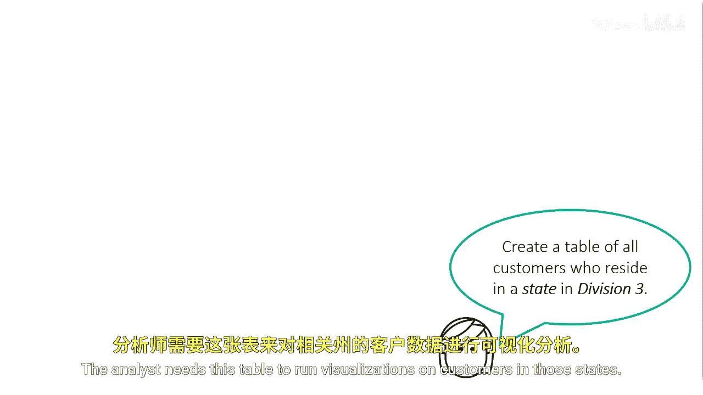
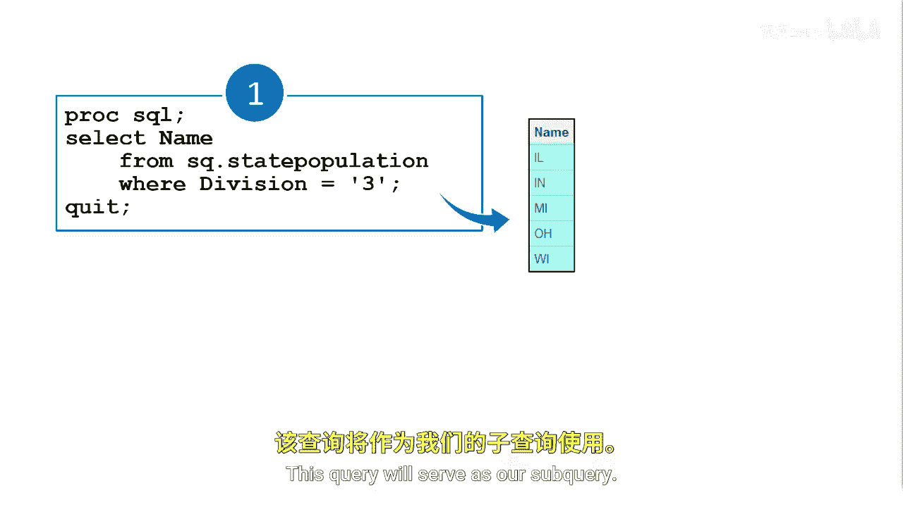

# 066：返回多个值的子查询 🔍

在本节课中，我们将要学习如何在SAS的`WHERE`子句中使用能够返回多个值的子查询。之前我们介绍的子查询都只返回单个值，而本节将扩展这一概念，处理返回多行结果的子查询。

## 子查询返回值的限制

上一节我们介绍了返回单个值的子查询。在`WHERE`和`HAVING`子句中使用的子查询必须只返回一列数据。


但是，这一列可以包含单个行值，也可以包含多个行值。

## 业务场景引入

假设你被要求为团队中的分析师创建一个表格，其中包含所有居住在“第三分区”的客户。分析师需要此表格来对这些州的客户进行可视化分析。



完成任务所需的信息存储在`state_population`（州人口）表和`customer`（客户）表中。

## 分步任务分析

以下是完成此任务的两个关键步骤：

1.  在`state_population`表中，需要筛选出`division`（分区）为3的行，然后返回属于该分区的所有州名。
2.  在`customer`表中，需要使用属于第三分区的那些州名来筛选表格。

你可以使用子查询来完成这项任务，下面我们来看看具体如何操作。

## 构建子查询


首先，我们使用一个独立查询来从`state_population`表中筛选出所有位于第三分区的州。

```sql
SELECT state
FROM state_population
WHERE division = 3;
```

执行此查询的结果显示，有五个州位于第三分区。这个查询将作为我们的子查询。

## 构建主查询（静态方法）



在第二个查询中，我们希望创建一个名为`Division3`的新表，其中包含居住在我们之前结果中任一州的客户。

最初，我们可以手动在`WHERE`子句中键入州名，并使用`IN`操作符。

```sql
CREATE TABLE Division3 AS
SELECT *
FROM customer
WHERE state IN ('IL', 'IN', 'MI', 'OH', 'WI');
```

当我们执行第二个查询时，将获得一个包含来自IL、IN、MI、OH、WI州客户列表的新表。

虽然这种方法有效，但我们的程序是静态的。如果我们想将分区从3改为4，或者为了代码整洁而希望用一个查询而不是两个查询来编写，该怎么办？

## 整合为动态子查询

我们可以将第一个查询作为子查询嵌入到`WHERE`子句中，动态构建第三分区的州列表，而第二个查询则成为主查询。

```sql
CREATE TABLE Division3 AS
SELECT *
FROM customer
WHERE state IN (SELECT state
                FROM state_population
                WHERE division = 3);
```

这个解决方案更加高效，并且可以根据分区动态生成结果。

## 本节总结


本节课中我们一起学习了如何使用返回多个值的子查询。关键点在于，在`WHERE`子句中使用`IN`操作符配合子查询，可以动态地基于一个条件（如分区号）筛选出符合多个值（如州名）的记录。这种方法比硬编码值列表更灵活、更易于维护。