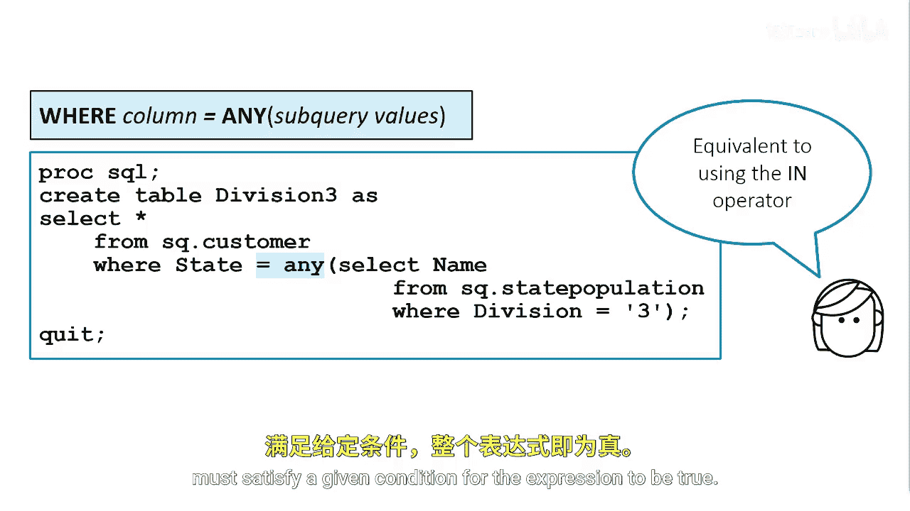
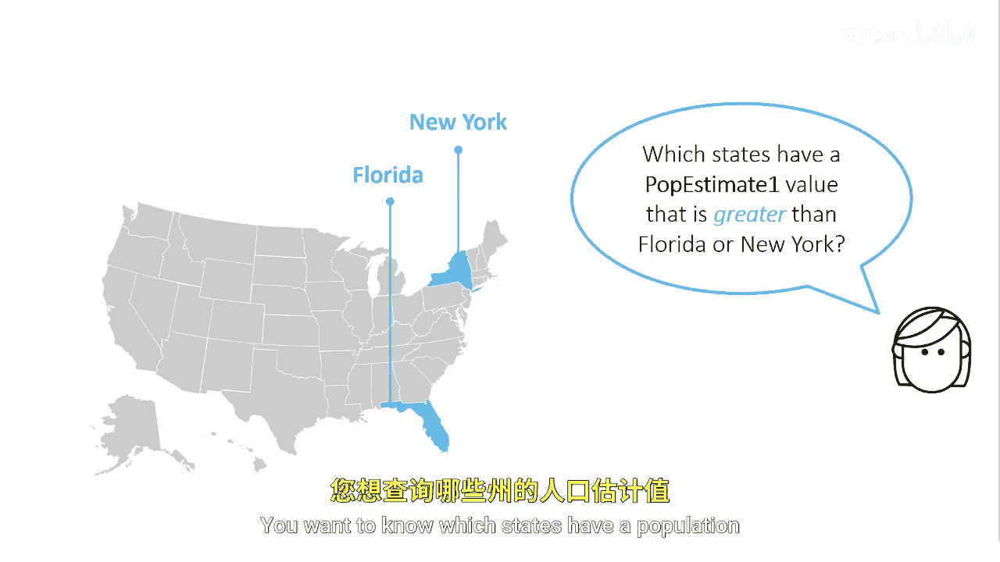
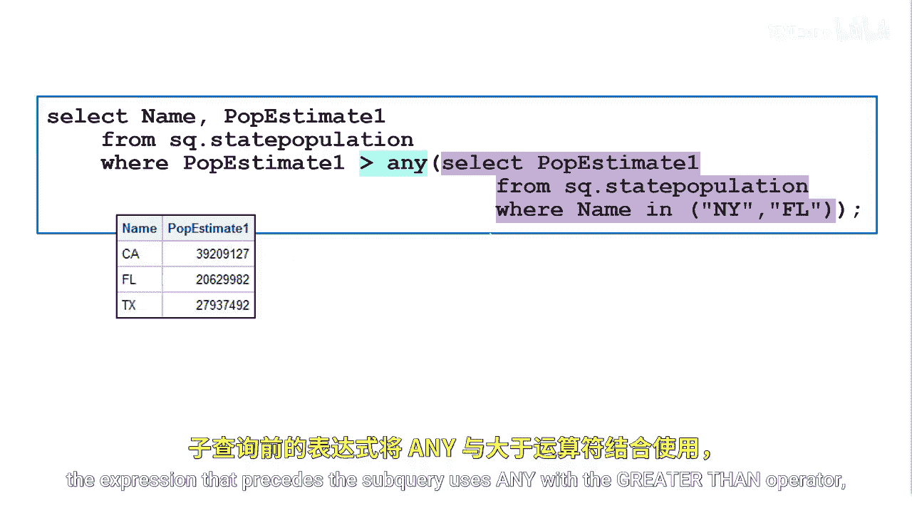

# 068：使用ANY关键字

在本节课中，我们将学习如何在SAS中使用`ANY`关键字。`ANY`关键字与子查询结合使用，用于判断主查询中的值是否满足与子查询返回的**任意一个**值之间的特定条件。

## 概述

`ANY`关键字的功能类似于`IN`运算符，但它允许与比较运算符（如`>`、`<`、`=`等）结合使用，提供更灵活的条件判断。通过本节学习，你将掌握`ANY`关键字的基本语法、工作原理及其应用场景。

## ANY关键字的基本概念

与`IN`运算符类似，你可以使用`ANY`关键字来指定：从子查询获得的一组值中，**至少有一个**值满足给定条件时，整个表达式即为真。



其基本语法结构可以表示为：
```
主查询表达式 比较运算符 ANY (子查询)
```
例如：`value > ANY (SELECT column FROM table)`

## ANY关键字的工作原理

为了帮助你理解`ANY`关键字如何工作，我们来看一个具体的例子。

假设你正在处理一个返回两个值的子查询：佛罗里达州和纽约州的人口估计值。你想知道哪些州的人口估计值大于这两个州中的**任意一个**。

以下是实现此查询的代码示例：
```sql
proc sql;
    SELECT State
    FROM census_data
    WHERE P_Estimate1 > ANY (
        SELECT P_Estimate1
        FROM census_data
        WHERE State IN ('Florida', 'New York')
    );
quit;
```



在这个例子中，子查询前的表达式将`ANY`关键字与大于运算符（`>`）结合使用。因此，当指定列的值大于子查询返回的**任何**一个值时，该表达式即为真。

## 深入理解ANY与比较运算符

让我们更具体地分析一下。实际上，当使用`value > ANY (子查询)`时，只要`value`大于子查询结果中的**最小值**，条件就成立。

延续上面的例子，如果子查询返回佛罗里达州的人口值`21,000,000`和纽约州的人口值`19,641,589`，那么`ANY`表达式为真的条件是：主查询中州的人口值大于`19,641,589`（即两个值中的较小者）。

换句话说，当列中的任何值大于子查询返回的最小值时（在本例中为`19,641,589`），表达式即为真。



## ANY关键字的替代写法

你还可以在子查询内部使用`MIN`函数来返回最小的`P_Estimate1`值。然后，你可以直接将该值与比较运算符一起使用，而无需`ANY`关键字。

以下是等价的写法：
```sql
proc sql;
    SELECT State
    FROM census_data
    WHERE P_Estimate1 > (
        SELECT MIN(P_Estimate1)
        FROM census_data
        WHERE State IN ('Florida', 'New York')
    );
quit;
```

这种方法先通过子查询计算出明确的最小值，再在主查询中进行比较，逻辑上更直观，但`ANY`关键字写法通常更简洁。


## 应用场景与注意事项

在结束之前，我们总结一下`ANY`关键字的核心应用与要点。

以下是`ANY`关键字的主要使用场景：
*   **与各类比较运算符结合**：除了`>`，还可以与`<`、`=`、`>=`、`<=`、`<>`（不等于）等结合使用。
*   **简化查询逻辑**：当需要判断主查询值是否满足与子查询结果集中**任一**值的关系时，使用`ANY`可以使SQL语句更清晰。
*   **处理未知的结果集**：当子查询可能返回多个值，且数量不确定时，`ANY`提供了一种动态的比较方式。

需要注意的是：
*   `ANY`与`SOME`关键字在SAS中功能完全相同，可以互换使用。
*   当子查询返回空集时，`ANY`条件的结果为**假**。
*   理解`ANY`与`ALL`关键字的区别至关重要（`ALL`要求满足与子查询**所有**值的比较关系）。

## 总结


本节课中，我们一起学习了SAS中`ANY`关键字的使用。我们了解到，`ANY`关键字用于构建主查询与子查询之间的条件关系，它要求主查询的值满足与子查询返回的**任意一个**值之间的比较条件。我们通过人口数据的例子，探讨了它的语法、工作原理，并介绍了使用`MIN`函数的等效写法。掌握`ANY`关键字，能让你编写出更强大、更灵活的SQL查询语句。