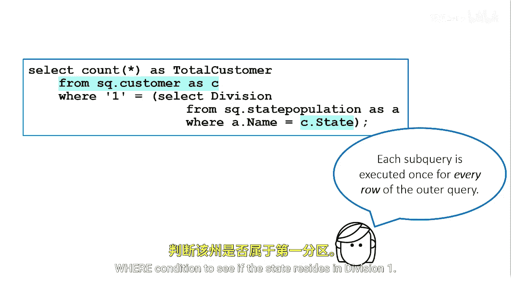
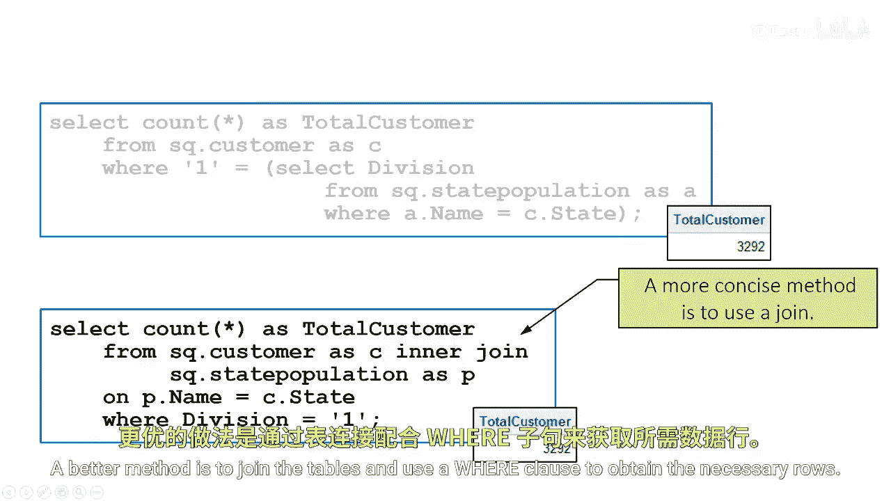

# 069：使用关联子查询 🔗

在本节课中，我们将要学习关联子查询的概念、工作原理，以及它与非关联子查询的区别。我们还将探讨为何应尽量避免使用关联子查询，并介绍更优的替代方案。

---

上一节我们介绍了非关联子查询，它们是自包含的，可以独立于外部查询执行。

关联子查询则依赖于外部查询。

它需要外部查询传递一个或多个值给它，然后子查询才能被解析。

这意味着ProCSQL必须多次处理关联子查询。

外部查询处理的每一行表数据，子查询都会执行一次。

关联子查询往往非常消耗资源。

你通常应该避免使用关联子查询，我们稍后会简要讨论其原因。

---

以下是使用关联子查询的一个示例场景。

我们想找出有多少客户来自某个州且属于Division1。

我们之前已经见过使用非关联子查询解决此问题的方案。

但我们也可以使用关联子查询来解决它。

我们在WHERE子句中使用静态值‘1’来代表Division1。

WHERE子句中的关联子查询会为每一行执行一个查询，该查询在州人口表和客户表之间进行连接。

连接的结果将返回居住在Division1的客户。

关联子查询不是独立的，因为它们需要从主查询中获取额外信息。

内部查询中的WHERE表达式引用了外部查询中某个表的值。

关联子查询会针对外部查询中的每一行进行评估。外部查询获取一行数据。

然后利用子查询的结果来测试WHERE条件，以判断该州是否属于Division 1。

如果是，则向外部查询返回一行。

---

然而，存在更好的方法。

更好的方法是连接这些表，并使用WHERE子句来获取所需的行。

---

本节课中我们一起学习了关联子查询。我们了解到，关联子查询依赖于外部查询的值，会为外部查询的每一行执行一次，因此效率较低。在大多数情况下，使用表连接配合WHERE子句是更高效、更推荐的数据检索方式。