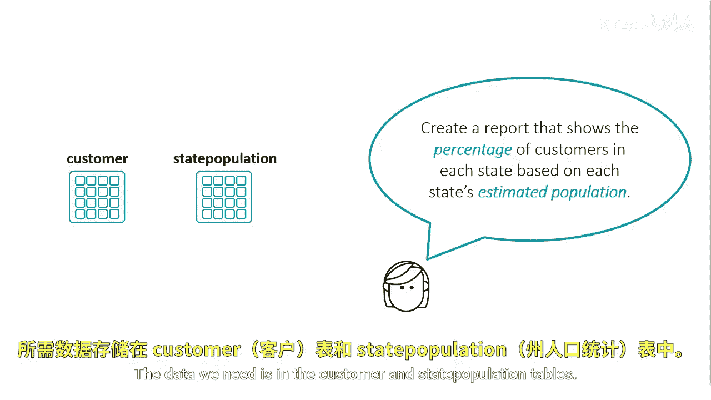
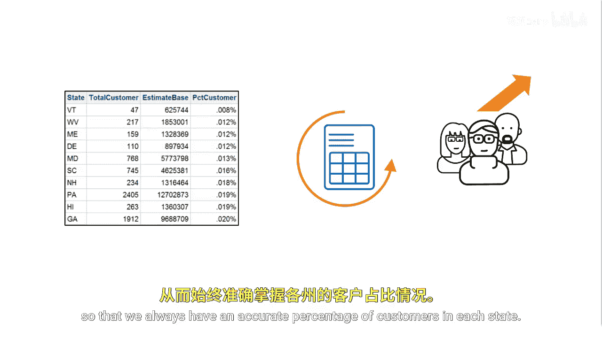
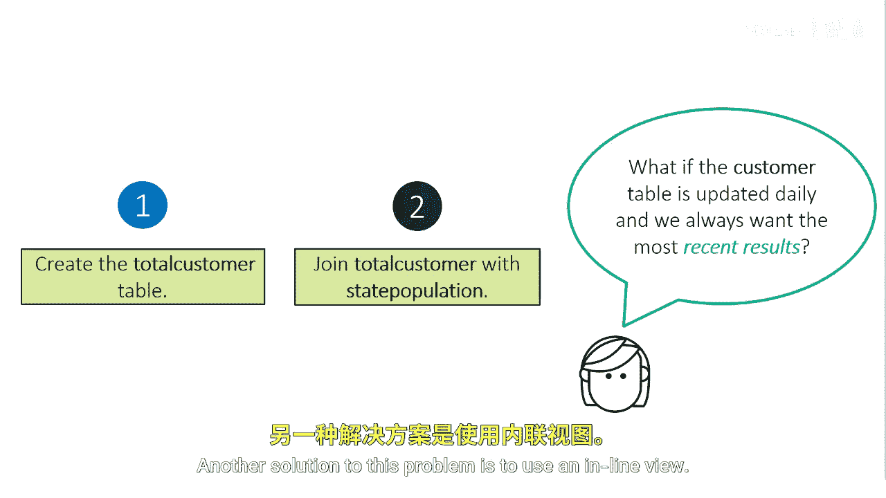

# 070：使用临时表与内联视图 🧮

在本节课中，我们将学习如何生成一份报告，用于展示基于各州估计人口计算的客户百分比。我们将探讨两种实现方法：使用临时表和使用内联视图，并比较它们的优劣。

## 概述



假设我们需要一份报告，根据各州的估计人口来显示每个州的客户百分比。所需的数据分别位于 `customer`（客户）表和 `state_population`（州人口）表中。

## 使用临时表的方法

一种创建此报告的方法是使用临时表。我们可以编写一个查询，从 `customer` 表中统计每个州的客户总数，并将结果存入一个名为 `Tot_customer` 的临时表中。

以下是创建该临时表的查询示例：
```sql
CREATE TABLE Tot_customer AS
SELECT State, COUNT(*) AS Total_Customers
FROM customer
GROUP BY State;
```


创建临时表后，我们需要将其与 `state_population` 表进行连接，然后计算每个州的客户百分比。

连接与计算的查询示例如下：
```sql
SELECT sp.State, sp.Estimated_Population,
       tc.Total_Customers,
       (tc.Total_Customers / sp.Estimated_Population) * 100 AS Percent_Customers
FROM state_population sp
JOIN Tot_customer tc ON sp.State = tc.State;
```


这个解决方案是有效的，但它需要进行一次连接操作并依赖一个临时表。我们希望即使客户列表不断增长，也能生成这份报告，以确保每个州的客户百分比始终准确。

## 临时表方法的局限性

如果 `customer` 表中的数据每日更新，那么每次运行此查询时，我们都必须重复第一步，即重新创建 `Tot_customer` 临时表，然后再连接 `Tot_customer` 和 `state_population` 表。这个过程可能效率较低。

## 使用内联视图的解决方案



针对此问题的另一个解决方案是使用内联视图。内联视图允许我们在一个查询中定义子查询，而无需创建物理临时表。

以下是使用内联视图的查询示例：
```sql
SELECT sp.State, sp.Estimated_Population,
       cust_counts.Total_Customers,
       (cust_counts.Total_Customers / sp.Estimated_Population) * 100 AS Percent_Customers
FROM state_population sp
JOIN (
    SELECT State, COUNT(*) AS Total_Customers
    FROM customer
    GROUP BY State
) cust_counts ON sp.State = cust_counts.State;
```

在这个查询中，`(SELECT ... FROM customer GROUP BY State)` 部分就是一个内联视图（或称为派生表）。它直接在 `JOIN` 子句中执行分组和计数，其结果会与 `state_population` 表即时连接。这样就不再需要先创建和维护一个单独的临时表。

## 总结



本节课中，我们一起学习了生成州级客户百分比报告的两种方法。我们首先介绍了使用**临时表**的步骤，包括创建表、连接和计算。随后，我们探讨了该方法的局限性，特别是在数据频繁更新时的重复操作问题。最后，我们介绍了更高效的**内联视图**解决方案，它通过在一个查询内嵌入子查询来避免创建物理临时表，使代码更简洁且易于维护。理解这两种方法有助于你根据不同的数据更新频率和场景，选择最合适的查询策略。