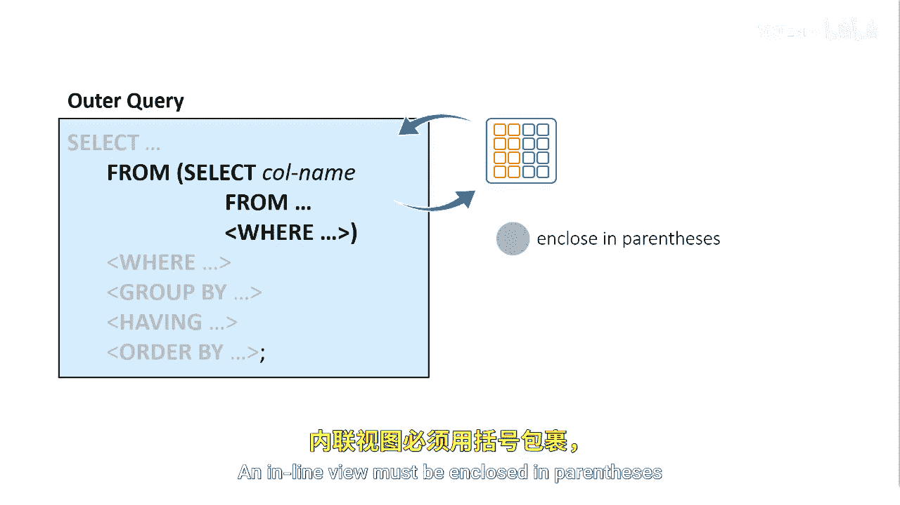

# 071：什么是内联视图 🔍

在本节课中，我们将要学习SAS SQL中一个重要的概念——**内联视图**。我们将了解它的定义、作用、语法规则以及它与子查询的区别。

## 概述


内联视图是嵌套在另一个查询`FROM`子句中的查询。它充当一个虚拟表，供外层查询使用，而不是使用物理表。

## 内联视图的定义与作用

上一节我们介绍了内联视图的基本概念，本节中我们来看看它的具体表现形式和作用。


内联视图是一个被嵌套在另一个查询`FROM`子句中的查询。其基本语法结构如下：
```sql
SELECT ...
FROM (SELECT ... FROM ...) AS inline_view_name
WHERE ...
```
它充当一个**虚拟表**，外层查询可以像使用普通物理表一样使用它。

## 内联视图的语法规则


了解了内联视图是什么之后，我们来看看使用它时必须遵守的语法规则。

一个内联视图可以包含`SELECT`语句中的大多数子句，但有一个关键限制。以下是其主要语法特征：
*   内联视图可以包含`SELECT`语句中的任何子句，**除了**`ORDER BY`子句。
*   内联视图**必须**用圆括号括起来。
*   内联视图只能在定义它的查询中被引用。

## 内联视图与子查询的区别


初学者有时会混淆内联视图和子查询。它们的关键区别在于返回的结果。

与子查询不同，内联视图可以向外层查询返回**单列或多列**数据。而子查询通常作为表达式使用，返回单个值或一列值。

## 内联视图的应用场景



那么，在什么情况下我们会使用内联视图呢？


当你构建复杂的SQL查询时，内联视图通常非常有用。它可以帮助你分步处理数据、简化连接操作或预先进行数据聚合，从而使主查询的逻辑更加清晰。

## 总结

本节课中我们一起学习了SAS SQL中的**内联视图**。我们了解到它是一个嵌套在`FROM`子句中的虚拟表，必须用括号括起，并且可以返回多列数据。掌握内联视图有助于我们编写更加模块化和强大的复杂查询。