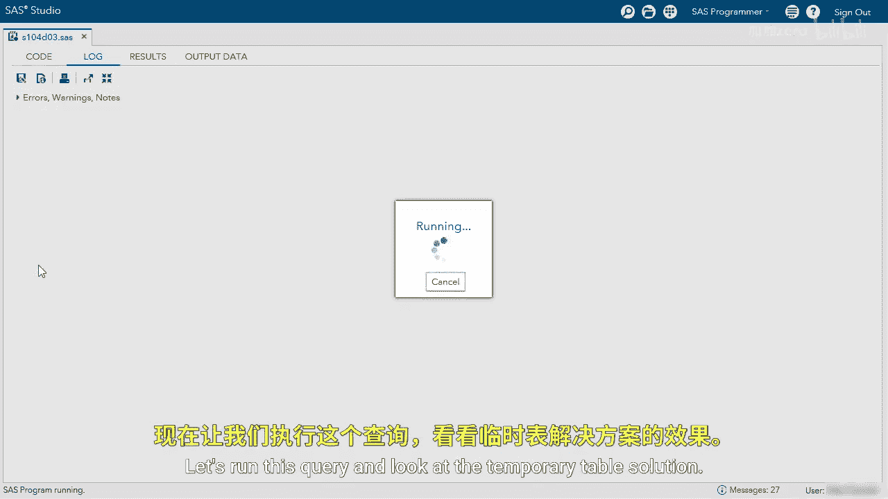

# 072：使用内联视图

在本节课中，我们将学习如何使用内联视图来解决一个具体的数据查询问题。我们将通过一个计算各州客户占比的案例，演示如何将临时表查询转换为更高效的内联视图查询。

## 概述

我们将要解决的问题是：计算每个州的客户数量占该州总人口的百分比。首先，我们会使用创建临时表的方法来实现，然后将其优化为使用内联视图的单一查询。

## 探索数据与问题定义

首先，我们需要了解涉及的两张表：客户表和州人口表。我们的目标是统计每个州的客户总数，然后将其与州人口表中的估计人口数结合，通过公式 **客户数 / 估计人口数** 来计算客户占比。

## 解决方案一：使用临时表

以下是使用临时表解决问题的分步方法。


第一步，我们创建一个名为 `TotalCustomer` 的临时表，用于存放每个州的客户总数。



```sql
CREATE TABLE TotalCustomer AS
SELECT State, COUNT(*) AS Total_Customers
FROM SQ.Customer
GROUP BY State;
```

运行上述查询后，`TotalCustomer` 临时表将包含两列：`State`（州名）和 `Total_Customers`（该州客户总数）。

接下来，我们需要将这个临时表与州人口表进行连接。

```sql
SELECT
    c.State,
    c.Total_Customers,
    s.Estimated_Population,
    (c.Total_Customers / s.Estimated_Population) AS Percent_Customer
FROM TotalCustomer c
INNER JOIN StatePopulation s
    ON c.State = s.Name
ORDER BY Percent_Customer;
```

运行此连接查询后，结果将按客户百分比升序排列。例如，佛蒙特州（VT）的客户占比可能最低，而华盛顿特区（DC）的占比可能最高。这个方案虽然有效，但需要创建和维护一个额外的临时表。

## 解决方案二：使用内联视图

上一节我们介绍了使用临时表的方法，本节中我们来看看如何用内联视图来优化这个过程。内联视图允许我们将一个查询的结果作为虚拟表，直接在另一个查询的 `FROM` 子句中使用。

以下是使用内联视图的查询语句。它与临时表方案的核心逻辑相同，但将所有步骤合并到了一个查询中。

```sql
SELECT
    c.State,
    c.Total_Customers,
    s.Estimated_Population,
    (c.Total_Customers / s.Estimated_Population) AS Percent_Customer
FROM (
    -- 这是内联视图，替代了之前的临时表
    SELECT State, COUNT(*) AS Total_Customers
    FROM SQ.Customer
    GROUP BY State
) c
INNER JOIN StatePopulation s
    ON c.State = s.Name
ORDER BY Percent_Customer;
```

**关键点**：在编写内联视图时，需要注意，**内联视图内部不能包含 `ORDER BY` 子句**。如果包含，会导致语法错误。因此，在将临时表查询转换为内联视图时，必须移除内层查询的 `ORDER BY`。

运行此查询，你将得到与临时表方案完全相同的结果集。然而，使用内联视图有一个重要优势：**内联视图在查询执行的瞬间动态计算**。这意味着，如果源数据表 `SQ.Customer` 中的数据增长或变化，下次运行此查询时，内联视图会自动计算最新的客户总数，无需手动更新临时表。

## 总结


本节课中我们一起学习了内联视图的应用。我们首先通过创建临时表的方法解决了计算州客户占比的问题，然后将其优化为使用单一查询的内联视图方案。内联视图的核心优势在于其**动态性**和**简洁性**，它避免了创建物理临时表的开销，并能实时反映数据变化。记住，在使用内联视图时，要确保内层查询不包含 `ORDER BY` 子句。