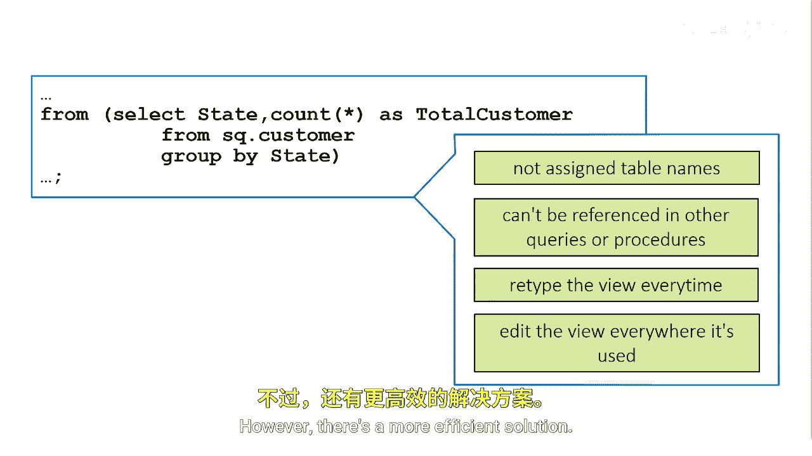
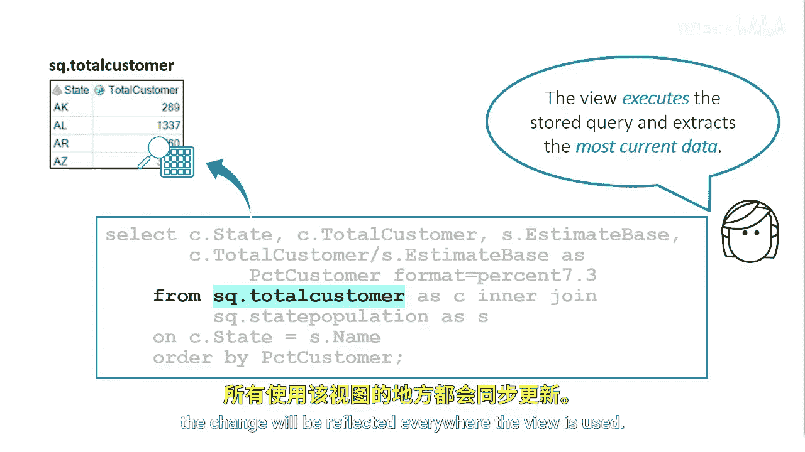

SAS高级程序员专项课程：P73：创建视图 👁️

在本节课中，我们将学习如何创建和使用Proc SQL视图，以解决内联视图无法在其他查询中重复使用的问题。

上一节我们介绍了内联视图的使用，本节中我们来看看如何创建可重复使用的视图。

**什么是Proc SQL视图？**
内联视图没有被分配表名，不能像表一样在其他查询或SAS过程中被引用。它们只能在定义它们的查询中被引用。为了重用这个内联视图，每次需要时都必须重新输入代码。虽然这个内联视图很短，但其他视图可能更复杂，重新输入它们可能非常耗时。此外，如果需要编辑代码，则必须在每个使用该内联视图的地方进行编辑。



然而，有一个更高效的解决方案。


你可以创建一个可以在其他查询中引用的Proc SQL视图。Proc SQL视图是一个存储的查询，可以基于一个或多个表或任何类型的SAS视图（例如，数据步视图或SAS访问视图）。因此，Proc SQL视图包含查询代码，但不包含实际数据。它不是一个物理表。相反，视图有时被称为虚拟表，因为它可以像物理表一样在查询和其他SAS程序中被引用。视图在每次使用时都会提取底层数据，并访问最新的数据。

**如何创建Proc SQL视图？**
要创建Proc SQL视图，需要使用`CREATE VIEW`语句。与`CREATE TABLE`语句不同，`CREATE VIEW`语句只有一种形式，即包含一个查询。


当你提交`CREATE VIEW`语句时，查询的报告输出会被抑制。在`CREATE VIEW`关键字之后，你需要指定视图的名称。视图名称必须遵循SAS命名规则，并且不能指定同一SAS库中现有表或视图的名称。

接下来，指定关键字`AS`，后跟查询子句。在这个例子中，`CREATE VIEW`语句创建了一个名为`SQ.total_customer`的Proc SQL视图。

从技术上讲，你可以在`CREATE VIEW`语句中使用任何可选的查询子句。然而，为了提高效率，建议避免在定义视图的查询中使用`ORDER BY`子句，因为它会强制Proc SQL在每次引用视图时都对数据进行排序。相反，你可以在引用视图的查询中使用`ORDER BY`子句。

以下是创建视图的基本语法：
```sql
CREATE VIEW 视图名称 AS
SELECT 列1, 列2, ...
FROM 表名
WHERE 条件;
```

**如何使用Proc SQL视图？**
要使用视图，只需将内联视图替换为已创建的视图。


在这个基本的Proc SQL查询中，`FROM`子句引用了名为`SQ.total_customer`的Proc SQL视图。当这个程序运行时，视图会执行并从底层数据源提取最新的数据。


如果你需要对视图进行更改，这个更改将在所有使用该视图的地方反映出来。


**Proc SQL视图的优势**
以下是使用Proc SQL视图的主要优势：
*   **代码复用**：避免重复编写复杂的查询逻辑。
*   **数据实时性**：每次使用都访问最新的底层数据。
*   **维护简便**：只需修改视图定义，所有引用该视图的程序都会自动更新。
*   **逻辑封装**：将复杂的查询逻辑封装在视图中，使主查询更简洁。



**总结**
本节课中我们一起学习了Proc SQL视图的创建和使用。我们了解到，视图是一种存储的查询（虚拟表），它不包含数据本身，而是在被引用时动态地从底层数据源提取数据。通过使用`CREATE VIEW`语句，我们可以创建可重复使用的视图，从而避免代码重复、简化维护，并确保数据访问的实时性。记住，在定义视图时通常应避免使用`ORDER BY`子句以提升效率。