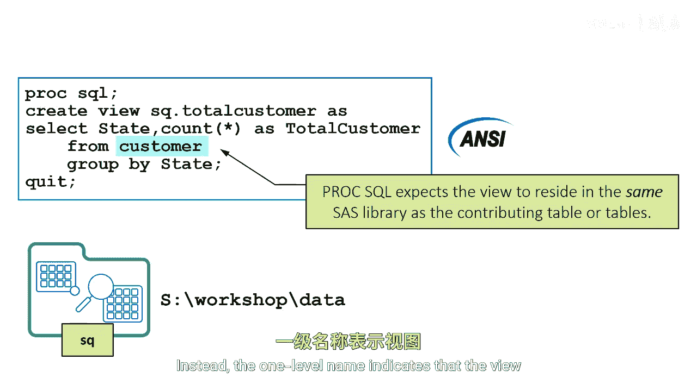
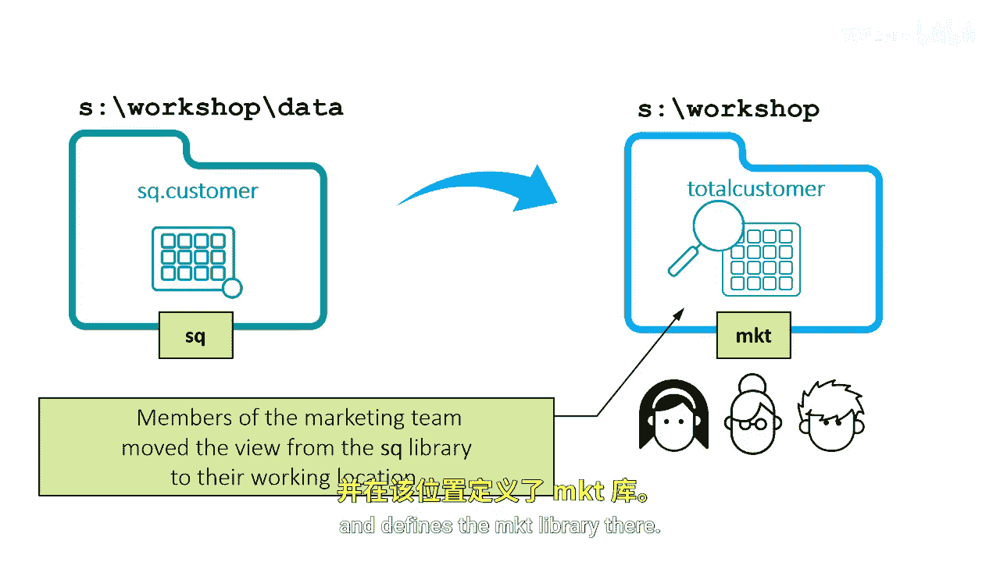
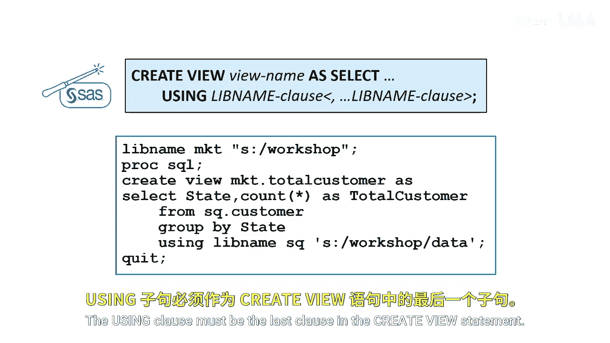

# 074：使视图可移植 📂

在本节课中，我们将学习如何创建可移植的SAS视图。根据ANSI标准，视图通常必须与其源表位于同一物理位置，这限制了视图的灵活性。我们将探讨如何通过使用`USING`子句来打破这一限制，使视图能够独立于其源表的位置被存储和使用。

## 标准视图的位置限制

根据ANSI标准，视图必须与其引用的源表位于同一物理位置。

因此，在`FROM`子句中引用的表的隐式库引用，就是包含该视图的库，或者是`SQL`库和`SASWORK`数据文件夹。

由于视图和数据源在同一位置，按照ANSI标准，你可以在`FROM`子句中使用单层名称来指定表。

这里的单层名称并非指代`SASWORK`库中的临时表。相反，它表示视图与其源表存储在同一位置。

## 视图移植性问题示例

假设一个营销团队将一个视图移动到他们的`SASWORKSHOP`文件夹，并在那里定义了`MKT`库。

然后，他们尝试使用该视图执行查询，却收到一个错误，提示`customer`表不存在。为什么会这样？让我们回顾一下这个视图是如何创建的。

存储的查询使用了单层命名约定，因此`PROC SQL`会假定`customer`表位于`SQL`库中。

这违反了ANSI的单层命名约定。当营销团队移动了视图并使用它运行查询时，存储的查询会假定`customer`表现在位于`SASWORKSHOP`的`MKT`库中。然而，`customer`表实际上并不在那个位置。

## 创建可移植视图的解决方案

通过使用一项增强功能，你可以创建一个与其源表存储在不同物理位置的视图。换句话说，你可以使视图变得可移植。

当你基于永久表创建永久视图时，可以在`CREATE VIEW`语句中添加`USING`子句来指定源表库的位置，从而使你的视图可移植。

`USING`子句是一个嵌入式的`LIBNAME`语句，它允许你为源表分配一个库引用。

这个`USING`子句指定了`customer`表的位置（例如`SASWORK.DATA`），而视图本身位于`SASWORKSHOP`。这被称为库名子句，因为它出现在另一个子句内部。

通常，当你基于永久表创建永久的`PROC SQL`视图时，最佳实践是使用`USING`子句。`USING`子句必须是`CREATE VIEW`语句中的最后一个子句。

## 总结

本节课中，我们一起学习了SAS视图的可移植性问题及其解决方案。我们了解到，标准的ANSI约定要求视图与源表同库，这带来了使用上的不便。通过引入`USING`子句，我们可以明确指定源表的库位置，从而创建出可以独立存储和迁移的视图，这大大提高了代码的灵活性和可维护性。记住，在创建基于永久表的永久视图时，养成使用`USING`子句的习惯是一个好做法。