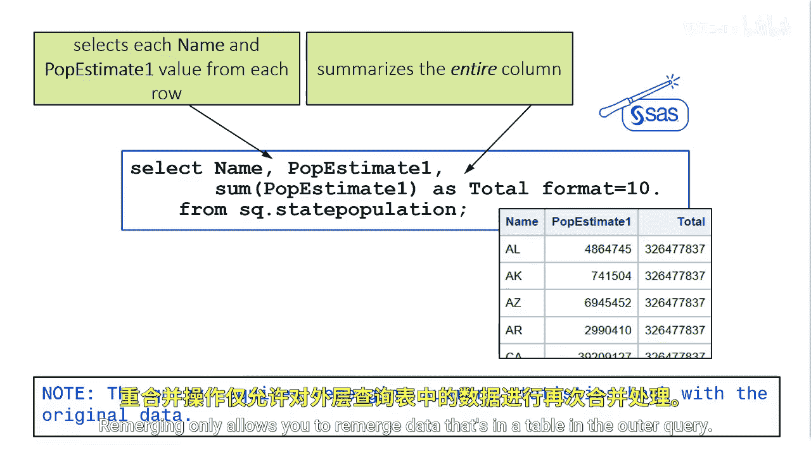

# 076：在PROC SQL中重新合并汇总统计量 📊

在本节课中，我们将学习PROC SQL中一个强大的功能——重新合并。这个功能允许我们在查询中直接使用汇总函数（如求和、平均值），并将汇总结果与原始数据行进行合并，从而简化复杂计算。

## 概述

上一节我们介绍了PROC SQL的基础查询。本节中，我们来看看如何使用SAS对SQL语言的增强功能，即通过重新合并数据来创建包含汇总统计量的报告。

SAS对SQL语言的一个重要增强是，能够使用汇总函数使相同的计算为每一行重复执行。这发生在PROC SQL重新合并数据时。当SELECT子句中包含由汇总函数创建的列、其他未汇总的列，并且没有GROUP BY子句时，就会发生重新合并。

## 重新合并的工作原理


PROC SQL的重新合并功能会对表进行两次处理。第一次处理创建的数据将在第二次处理中用于完成查询。

以下是重新合并过程的步骤说明：


1.  **执行内部查询以汇总数据**：PROC SQL首先运行一个内部查询，对整个目标列进行汇总计算。
2.  **执行第二个内部查询以选择数据**：接着，PROC SQL运行另一个内部查询，从每一行中选择所需的列（如名称和原始值）。
3.  **合并结果**：计算出的汇总值（例如总和）会与每一行的原始数据合并，从而在结果集的每一行中重复出现。

例如，考虑以下查询，它计算了每个州人口占总人口的百分比：

```sql
proc sql;
    select State,
           PopEstimate1,
           PopEstimate1 / sum(PopEstimate1) as Percent format=percent8.2
    from census;
quit;
```



在这个查询中：
*   `sum(PopEstimate1)` 汇总了整个`PopEstimate1`列，得到明年的总估计人口。
*   每个州的人口值被除以这个汇总后的总值，计算出百分比。
*   PROC SQL先运行内部查询计算总和，再运行另一个内部查询进行除法运算。

## 重要注意事项

在使用重新合并功能时，有几点需要牢记：

*   **日志提示**：当一个查询重新合并数据时，PROC SQL会在日志中显示一条注释，表明发生了数据重新合并。
*   **数据来源限制**：重新合并只允许你重新合并外部查询表中存在的数据。它不能直接用于合并来自不同表或子查询的汇总数据，除非这些数据已在主查询的FROM子句中可用。

## 总结


本节课中我们一起学习了PROC SQL中的重新合并功能。我们了解到，通过在SELECT子句中结合使用汇总函数和非汇总列（且不使用GROUP BY），SAS可以自动执行两次数据传递，将汇总结果便捷地合并到每一行原始数据中。这个功能极大地简化了诸如计算百分比、与总体平均值比较等常见分析任务的代码编写。