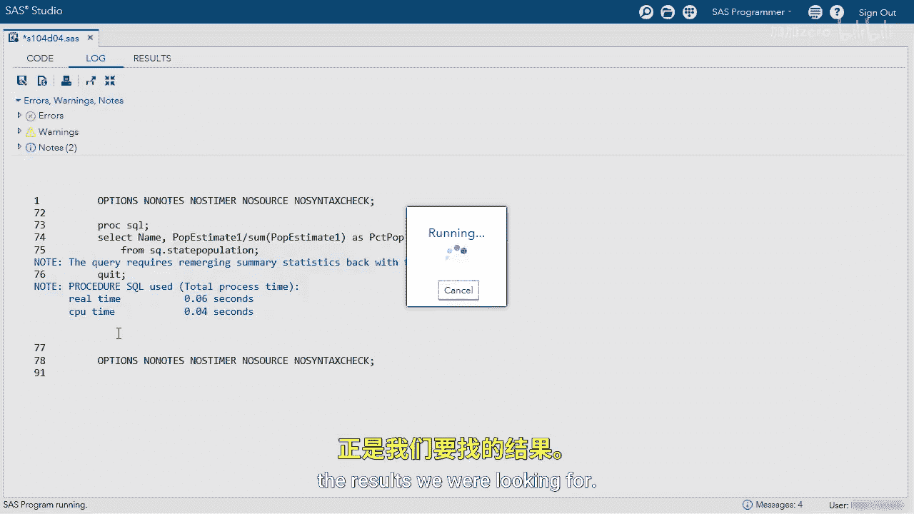
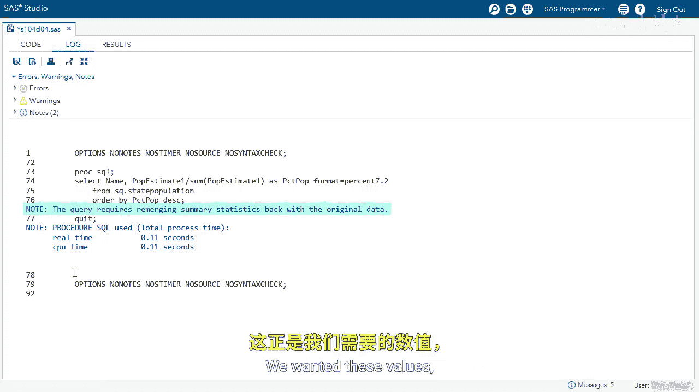

# 077：重新合并汇总统计量 📊

在本节课中，我们将学习如何在SAS查询中重新合并汇总统计量，并利用这一特性计算每个州人口占总人口的百分比。

## 概述

上一节我们介绍了汇总统计量的基本概念。本节中，我们来看看如何将计算出的汇总统计量（如总和）重新合并回原始数据行，以进行进一步的计算，例如计算百分比。

## 查询演示

以下是初始查询步骤。我们首先从`state_population`表中选择`name`和`P_estimate1`列，同时使用`SUM`函数计算`P_estimate1`的总和。

```sql
PROC SQL;
    SELECT name, P_estimate1, SUM(P_estimate1) FORMAT=COMMA12.
    FROM state_population;
QUIT;
```

运行此查询后，结果会显示每一行的`name`和`P_estimate1`值，并且`SUM(P_estimate1)`计算出的单个总和值会出现在每一行中。这表明汇总统计量已被重新合并。

查看日志，可以看到一条注释：“查询将汇总统计量重新合并回原始数据”。这虽然不完全是我们最终想要的结果，但为我们解决问题提供了基础。

## 计算百分比

我们的目标是计算每个州的人口估计值占总人口的百分比。为此，我们需要用每个州的`P_estimate1`除以它的总和。

以下是修改后的查询，我们添加了百分比计算和格式化：

```sql
PROC SQL;
    SELECT name,
           P_estimate1,
           P_estimate1 / SUM(P_estimate1) AS PCT_Pop FORMAT=PERCENT7.2
    FROM state_population;
QUIT;
```




注意，我们使用`AS`关键字为计算出的百分比列命名（`PCT_Pop`），并使用`PERCENT7.2`格式将其显示为百分比。

运行此查询后，我们得到了每个州人口占总人口的百分比。例如，加利福尼亚州约占12%。

## 排序结果

为了更清晰地查看数据，我们可以对结果进行排序。我们希望按`PCT_Pop`降序排列，以看到人口占比最高的州。

以下是添加了`ORDER BY`子句的最终查询：

```sql
PROC SQL;
    SELECT name,
           P_estimate1,
           P_estimate1 / SUM(P_estimate1) AS PCT_Pop FORMAT=PERCENT7.2
    FROM state_population
    ORDER BY PCT_Pop DESC;
QUIT;
```

运行最终查询后，结果按人口百分比从高到低排列。加利福尼亚州位居榜首，其次是德克萨斯州、佛罗里达州等。列表底部是怀俄明州和佛蒙特州，占比约为0.19%和0.18%。

## 总结

本节课中，我们一起学习了SAS中“重新合并汇总统计量”的特性。通过演示，我们掌握了如何：
1.  在`SELECT`语句中使用聚合函数（如`SUM`）。
2.  利用重新合并的特性，在行级别进行基于总和的计算（如计算百分比）。
3.  使用`AS`关键字为计算列命名。
4.  使用`FORMAT`语句格式化输出结果。
5.  使用`ORDER BY`子句对查询结果进行排序。



这个功能是SAS SQL的一个增强特性，能够高效地解决需要在详细数据旁展示汇总信息的常见分析需求。