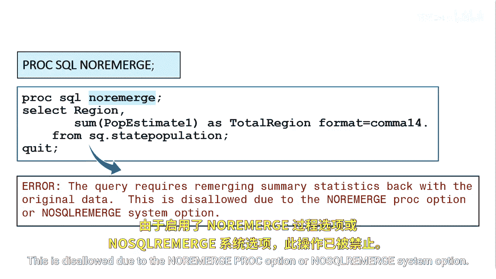

# 078：控制重新合并

在本节课中，我们将学习SAS Proc SQL中一个重要的概念——重新合并。我们将了解它的作用、可能引发的问题，以及如何通过系统选项来控制它，以避免产生非预期的结果。

## 重新合并的概念与常见问题

上一节我们介绍了重新合并的基本机制。本节中我们来看看一个因疏忽而导致重新合并出错的常见场景。

重新合并是一个强大的工具，但它并不总能提供期望的结果。最常见的例子是在查询中忘记使用`GROUP BY`子句。

在以下代码中，我们希望找出每个区域下一年度的预估总人口。

```sql
SELECT region, SUM(p_estimate1)
FROM table_name;
```

因为我们没有包含`GROUP BY`语句，所以意外地触发了数据的重新合并，并得到了一个非预期的答案。总计的区域值被显示在了报告中的每一行。


## 如何禁用重新合并

了解了问题所在后，我们来看看如何防止这种情况发生。当你在`SELECT`子句或`HAVING`子句中使用汇总函数时，Proc SQL可能会重新合并数据。

以下是控制重新合并的两种方法：

*   **`PROC SQL NOREMERGE` 选项**：在Proc SQL步骤中设置此选项。
*   **`NOSQLREMERGE` 系统选项**：在SAS会话级别设置此系统选项。

如果你设置了`PROC SQL NOREMERGE`选项或`NOSQLREMERGE`系统选项，Proc SQL将不会处理数据的重新合并。

## 禁用重新合并后的效果

那么，禁用重新合并后，之前出错的查询会怎样呢？提交带有`NOREMERGE`选项的查询不会产生输出，并会在日志中生成一条错误信息。

错误信息表明：该查询需要将汇总统计量重新合并回原始数据；但由于设置了`NOREMERGE` Proc选项或`NOSQLREMERGE`系统选项，此操作被禁止。



## 课程总结


本节课中我们一起学习了如何控制Proc SQL中的重新合并。我们首先回顾了因遗漏`GROUP BY`子句导致错误重新合并的典型问题，然后介绍了通过`NOREMERGE`选项来禁用此功能的方法。理解并正确控制重新合并，对于编写准确、高效的SQL查询至关重要。