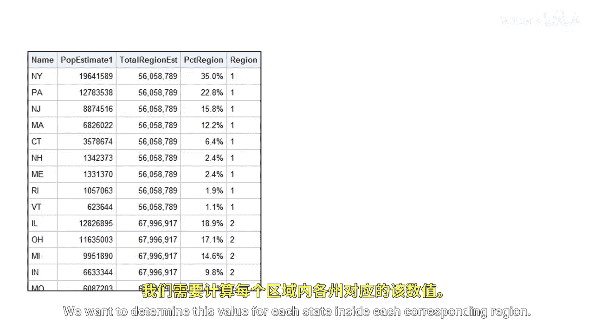
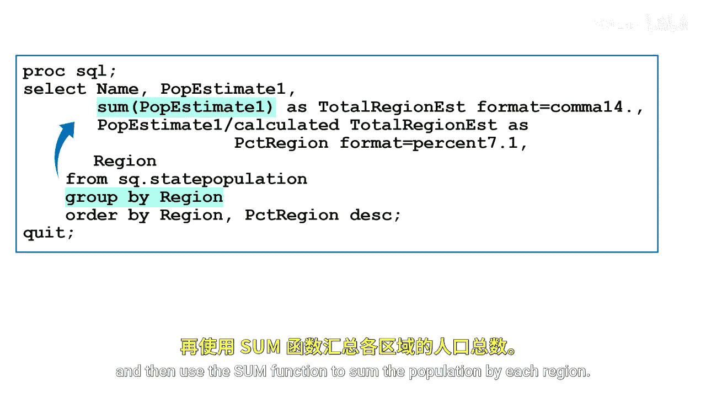
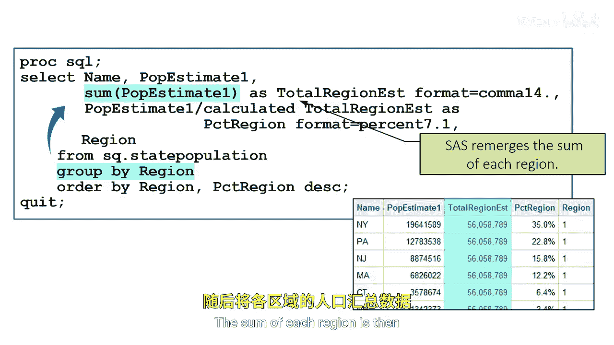
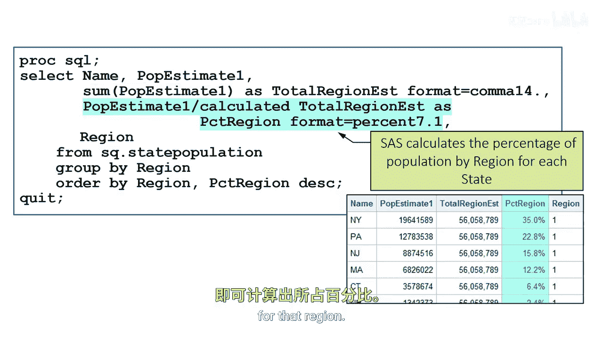

# 079：重新合并分组汇总统计量 📊

在本节课中，我们将学习如何利用“重新合并”技术，在分组内计算汇总统计量，并将其与原始数据合并。我们将通过一个具体案例——计算每个州在其所属区域内的总人口占比——来掌握这一方法。

上一节我们介绍了如何重新合并单个汇总值。本节中，我们来看看如何在分组内进行重新合并。

假设我们需要计算每个州在其所属区域内的估计人口占比。如何利用重新合并汇总统计量来实现这个目标？

`PCT_region` 列将展示每个州基于其所属区域的估计人口百分比。这个值的计算方法是：用每个州的 `P_estimate1` 列数值，除以该州所属区域的估计人口总数。

我们需要为每个区域内的每个州确定这个百分比。可以通过重新合并汇总统计量来计算按区域划分的人口占比。具体做法是：在 `GROUP BY` 子句中使用 `region` 列，然后使用 `SUM` 函数汇总每个区域的人口。

```sql
SELECT region, SUM(P_estimate1) AS region_total
FROM census_data
GROUP BY region;
```





每个区域的人口总和随后会与未汇总的原始数据（如州名 `name` 和该州人口 `P_estimate1`）重新合并。

以下是实现重新合并并计算百分比的关键步骤：


1.  在查询中使用 `GROUP BY region` 对数据进行分组。
2.  使用聚合函数 `SUM(P_estimate1)` 计算每个区域的总人口。
3.  SAS会自动将这个区域级别的汇总值“重新合并”到该区域内每一个州的观测记录中。
4.  最后，我们可以创建一个新变量，其计算公式为：`P_estimate1 / region_total`，从而得到每个州在区域内的占比。

```sql
SELECT name,
       region,
       P_estimate1,
       SUM(P_estimate1) AS region_total,
       (P_estimate1 / CALCULATED region_total) AS PCT_region FORMAT=PERCENT8.2
FROM census_data
GROUP BY region;
```







本节课中，我们一起学习了如何利用SAS的重新合并功能，在分组（如区域）内部计算汇总值（如区域总人口），并将其与组内详细数据合并，进而计算出像“州人口占区域总人口百分比”这样的衍生指标。这种方法高效且简洁，是进行分组内相对值分析的强大工具。