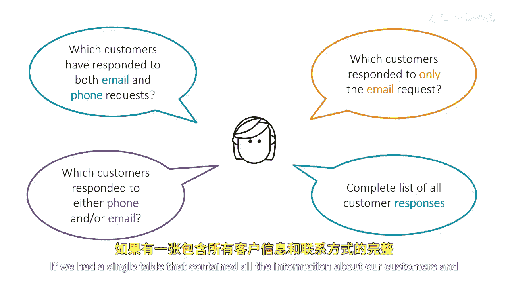
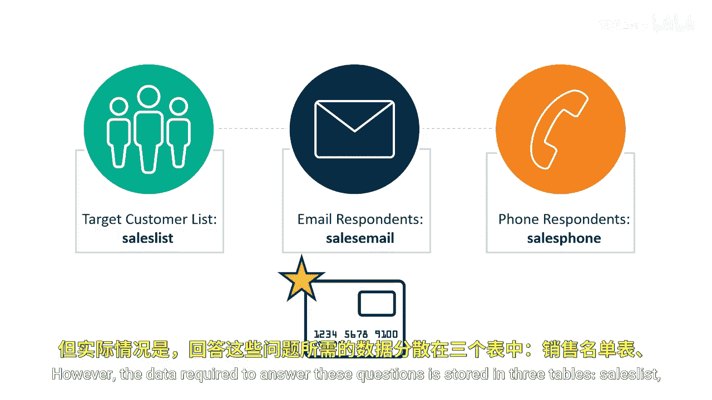

# 081：使用集合运算符合并数据 📊

在本节课中，我们将学习如何使用SAS中的集合运算符来合并数据，以回答关于客户联系方式的四个具体业务问题。我们将通过分析三个独立的数据表，演示如何垂直组合查询结果。

假设您的经理要求提供四份报告，内容涉及所有通过电话或电子邮件联系的目标销售客户。公司希望联系每一位目标客户，并确定哪些客户需要再次联系以获得回应。我们的目标是分析我们与客户的联系情况。报告需要回答以下四个问题：
1.  哪些客户同时回应了电子邮件和电话请求？
2.  哪些客户回应了电话和/或电子邮件？
3.  哪些客户仅回应了电子邮件请求？
4.  是否存在一份包含所有客户回应的完整列表？

如果我们有一个包含所有客户信息和联系方式的数据表，那么编程任务将非常简单。

然而，回答这些问题所需的数据存储在三个独立的表中：`sales_list`、`sales_email` 和 `sales_phone`。

`sales_list` 表包含了我们希望在营销活动中联系的目标客户的联系信息。它包含客户ID、电子邮件以及可以联系到客户的电话号码。

`sales_email` 表包含了通过电子邮件接受或拒绝我们报价的客户回应。`sales_phone` 表则包含了来自电话销售的回应。如果客户未出现在这些表中，则意味着该客户目前尚未回应我们。如果客户要求回电，他们可能会在 `sales_phone` 表中出现两次。

现在我们来比较一下数据的组织方式。`sales_email` 和 `sales_phone` 两个表都包含 `Customer_ID` 列和一个回应列，但回应列的名称不同。这两个表存储回应的方式也不同。

在 `sales_email` 表中，每个电子邮件对应一个回应，回应可以是 `Accepted` 或 `Declined`。在 `sales_phone` 表中，`Sales_Rep` 列表示进行呼叫的销售代表，`Phone_Response` 列表示回应，回应可以是 `Declined`、`Callback` 或 `Accepted`。

所有三个表都包含 `Customer_ID` 列，但该列在各表中的位置并不相同。

了解了数据结构后，您有何想法？仅通过查询一个表，能否回答经理提出的四个问题中的任何一个？所有这些问题都需要您查询多个表。

您可以使用集合运算符来垂直组合查询，并创建能够回答这四个问题的报告。

---

上一节我们介绍了业务背景和数据概况，本节中我们来看看如何使用SAS集合运算符来解决具体问题。以下是使用集合运算符的基本思路：

*   **INTERSECT（交集）**：用于找出同时出现在两个查询结果中的行，对应问题1（哪些客户同时回应了电子邮件和电话请求？）。
*   **UNION（并集）**：用于合并两个查询结果并去除重复行，对应问题2（哪些客户回应了电话和/或电子邮件？）和问题4（所有客户回应的完整列表）。
*   **EXCEPT（差集）**：用于找出只出现在第一个查询结果中，而不出现在第二个查询结果中的行，对应问题3（哪些客户仅回应了电子邮件请求？）。

在编写代码时，需要确保参与运算的查询结果具有相同数量和类型的列。通常，我们只选择关键的标识列（如 `Customer_ID`）进行比较和合并。

本节课中，我们一起学习了如何利用SAS的集合运算符（`INTERSECT`、`UNION`、`EXCEPT`）来垂直合并来自不同数据表的查询结果，从而高效地回答复杂的多表关联业务问题。关键在于理解每个运算符的数学含义，并将其映射到具体的业务逻辑上。