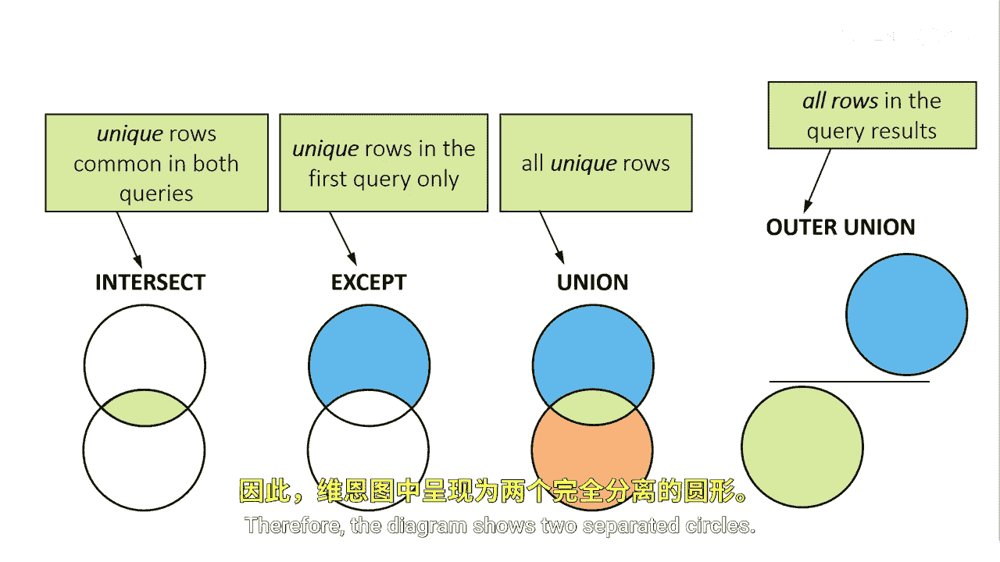

# 082：集合运算符详解

在本节课中，我们将要学习SAS中集合运算符的工作原理、类型及其行为差异。集合运算符是垂直组合两个查询结果集以生成最终结果集的重要工具。

## 集合运算符如何工作？

集合运算符垂直组合来自两个查询的中间结果集，以生成最终结果集。

它们的中间结果集包含行和列，集合运算符作用于这些中间结果集，而非直接作用于输入表。

## 集合运算符的类型

要垂直组合两个查询的结果，可以使用以下四种集合运算符之一：`INTERSECT`、`EXCEPT`、`UNION`和`OUTER UNION`。

其中，`INTERSECT`、`EXCEPT`和`UNION`运算符是SQL ANSI标准中规定的。`OUTER UNION`运算符则是SAS的增强功能。

为了解释每种方法的结果，我们将用简化的维恩图将两个表表示为圆圈。

### INTERSECT（交集）

`INTERSECT`运算符返回同时出现在第一个查询和第二个查询中的行。换句话说，它返回两个查询中共同存在的唯一行。

这在维恩图中表示为两个圆圈的重叠区域。

### EXCEPT（差集）

`EXCEPT`运算符返回来自第一个查询但不在第二个查询中的行。换句话说，它仅返回第一个查询中的唯一行。

这在维恩图中表示为顶部的圆圈。

### UNION（并集）

`UNION`运算符组合两个查询的结果。它生成来自两个查询的所有唯一行。也就是说，如果一个行出现在第一个表、第二个表或两个表中，它都会被返回。

这在维恩图中表示为顶部和底部的圆圈。`UNION`不返回重复行。如果一个行出现多次，则只返回一次。

### OUTER UNION（外并集）

`OUTER UNION`运算符组合两个查询的结果。它包含所有的行和列，且没有任何重叠。

因此，图表显示为两个分离的圆圈。

## 列处理方式的差异

上一节我们介绍了四种集合运算符，本节中我们来看看不同集合运算符在处理列时的默认行为差异。

`INTERSECT`、`EXCEPT`和`UNION`集合运算符根据两个结果集中列的位置来对齐列。

例如，这些集合运算符根据列在参考表中的位置来组合两个查询的列，而不考虑单个列名。

两个查询中相同相对位置的列必须具有相同的数据类型。第一个查询中表的列名将成为输出表的列名。

而`OUTER UNION`集合运算符则包含两个结果集中的所有列。

## 总结

本节课中我们一起学习了SAS中四种集合运算符：`INTERSECT`、`EXCEPT`、`UNION`和`OUTER UNION`。我们了解了它们如何垂直组合查询结果，并通过维恩图直观地理解了每种运算符返回的数据范围。同时，我们也掌握了标准集合运算符与`OUTER UNION`在列对齐和包含规则上的关键区别。理解这些运算符是有效进行数据合并与比较的基础。