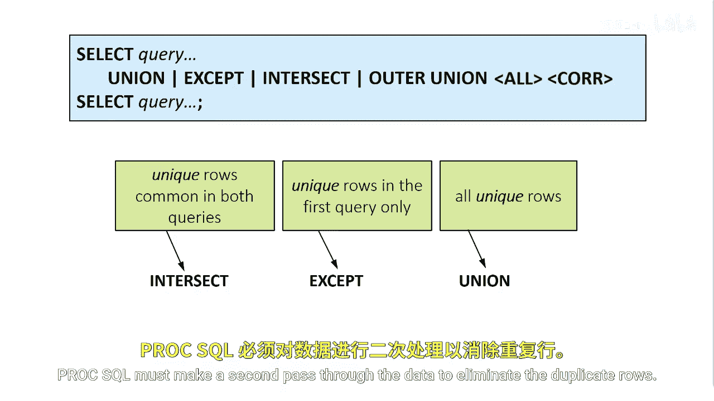
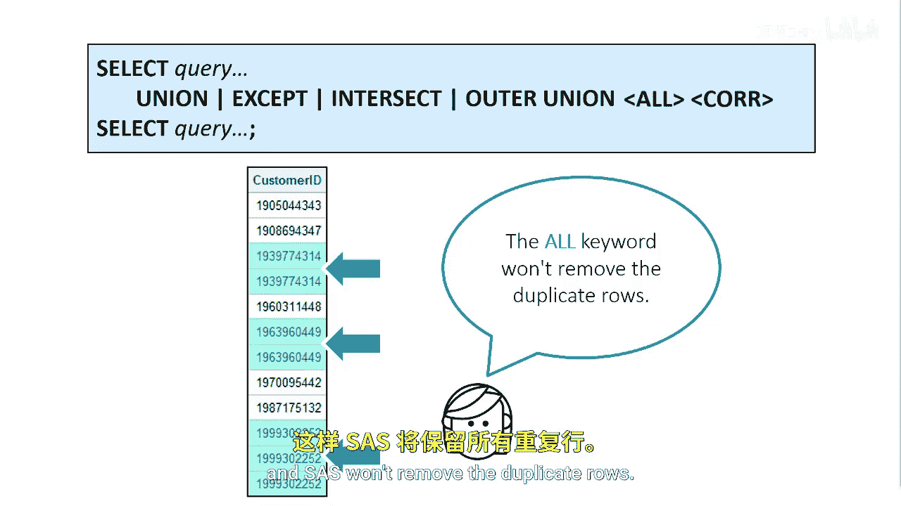

# 083：使用集合运算符

在本节课中，我们将要学习如何在PROC SQL中使用集合运算符。集合运算符允许你将多个查询的结果组合成一个单一的结果集。我们将重点了解集合运算符的默认行为，以及如何使用`ALL`和`CORR`关键字来修改这些行为，以满足不同的数据处理需求。

## 集合运算符基础


集合运算由两个查询子句组成，通过四种集合运算符之一进行组合。

整个集合运算是一个单一的`SELECT`语句，因此你只需在最后一个`SELECT`语句后放置一个分号。

**代码示例：**
```sql
SELECT column1 FROM table1
UNION
SELECT column1 FROM table2;
```

## 修改默认行处理行为



上一节我们介绍了集合运算符的基本结构，本节中我们来看看如何修改其默认行为。当你使用集合运算符时，并不局限于它们的默认设置。



请记住，`INTERSECT`、`EXCEPT`和`UNION`集合运算符在默认情况下只产生唯一的行。PROC SQL必须对数据进行第二次扫描以消除重复行。

为了改变这种针对行的默认行为，你可以在代码中添加`ALL`关键字，这样SAS就不会移除重复行。

**代码示例：**
```sql
SELECT column1 FROM table1
UNION ALL
SELECT column1 FROM table2;
```

在以下任一条件发生时，应考虑使用`ALL`关键字：
*   最终结果集中存在重复行不会导致问题。
*   重复行不可能出现。例如，如果列上存在唯一或主键约束。

再次强调，使用`ALL`关键字可以提高集合运算符的效率，因为SAS无需进行第二次扫描来移除重复项。

## 修改默认列处理行为


了解了如何控制行的去重后，我们再来看看如何调整列的匹配方式。你可以使用`CORR`关键字来修改列的默认对齐行为。

请记住，`INTERSECT`、`EXCEPT`和`UNION`集合运算符根据列在中间结果集中的位置来对齐列。

`CORR`关键字会根据两个中间结果集中具有相同名称的列来对齐它们。对于`OUTER UNION`集合运算符，`CORR`同样会根据列名来对齐列。

**代码示例：**
```sql
SELECT name, age FROM students
UNION CORR
SELECT name, score FROM exams;
```


本节课中我们一起学习了PROC SQL中集合运算符的使用。我们首先了解了集合运算的基本构成，然后探讨了如何使用`ALL`关键字来保留重复行以提高效率，最后学习了如何使用`CORR`关键字根据列名而非位置来对齐列。掌握这些技巧能让你更灵活地组合和比较数据集。