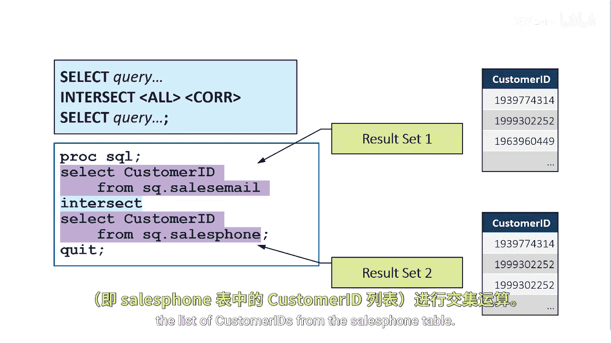
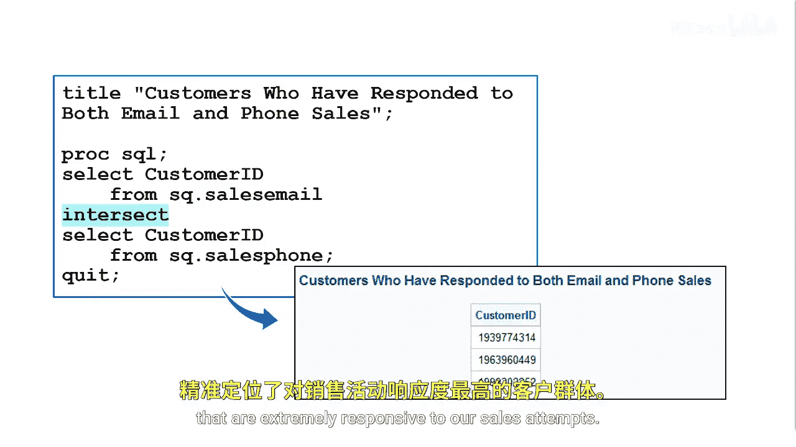

**SAS高级程序员专项课程：P84：使用 INTERSECT 运算符** 🔍

在本节课中，我们将学习如何使用 SAS 中的 **INTERSECT** 集合运算符。该运算符用于查找两个查询结果之间的交集，即找出同时出现在两个数据集中的行。我们将通过一个具体的客户响应分析案例来演示其用法。

---

### 概述


我们的目标是找出那些对我们的销售活动响应积极的客户。具体来说，我们希望找到那些**既回复了电子邮件营销，又接听了电话营销**的客户，无论他们最终是接受了还是拒绝了我们的报价。这些客户可以被视为“高响应度”客户。

### 数据来源

符合“回复了电子邮件”或“接听了电话”条件的客户列表，分别存储在 `sales.email` 和 `sales.phone` 两个数据表中。我们的任务是从这两个表中找出匹配的客户 ID。


### 使用 INTERSECT 运算符

为了找出两个查询结果中相交的客户 ID，我们将使用 **INTERSECT** 集合运算符。在本例中，我们只引用 `Customer_ID` 这一列。

以下是实现此目标的 SAS 代码结构：

```sas
PROC SQL;
    SELECT Customer_ID FROM sales.email
    INTERSECT
    SELECT Customer_ID FROM sales.phone;
QUIT;
```

*   **第一个查询**：返回 `sales.email` 表中的所有客户 ID。
*   **INTERSECT 运算符**：连接两个查询。
*   **第二个查询**：返回 `sales.phone` 表中的所有客户 ID。



### INTERSECT 的工作原理

`INTERSECT` 运算符的执行分为两个关键步骤：

1.  **消除各结果集中的重复行**：首先，它会分别对两个查询的中间结果集进行去重。例如，即使 `sales.phone` 表中可能存在重复的客户 ID 记录，在此步骤中也会被移除。
2.  **选取共有行**：接着，运算符会从第一个去重后的结果集中，选取那些也存在于第二个去重后结果集中的行。这些就是两个数据集共有的“等效行”。

这个过程确保了最终结果集中每个客户 ID 都是唯一的，并且同时出现在两个源表中。

### 结果解读

执行上述 `INTERSECT` 查询后，得到的结果列表将包含那些对我们邮件和电话销售尝试都做出了响应的客户 ID。这份列表精准地标识出了我们寻找的“高响应度”客户群体。

---


### 总结

本节课我们一起学习了 **INTERSECT** 运算符的核心应用。通过一个客户分析的实例，我们了解到：
*   `INTERSECT` 用于获取两个查询结果集的交集。
*   它在内部会自动进行**去重**处理。
*   它是筛选同时满足多个条件的数据行的有效工具，例如在本例中识别对多种营销渠道均做出响应的客户。



掌握 `INTERSECT` 能帮助你在数据比对、客户细分和一致性检查等场景中高效工作。