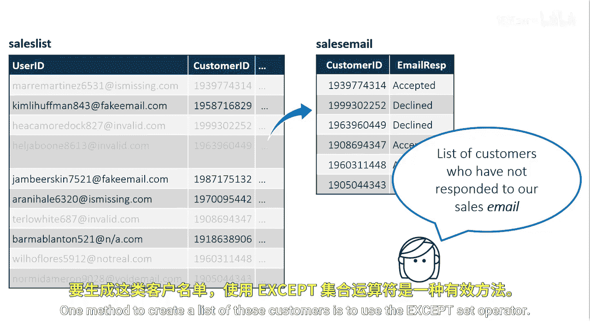
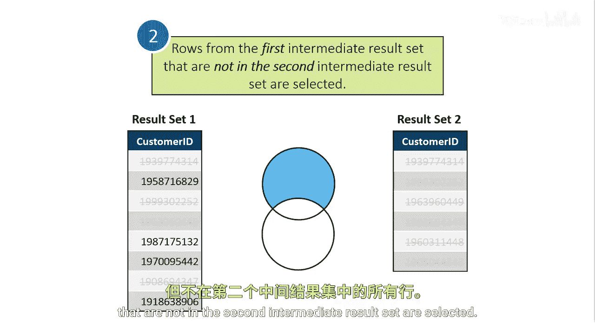

# 085：使用 EXCEPT 运算符 🧩

在本节课中，我们将学习如何使用 **EXCEPT** 集合运算符。这个运算符能帮助我们从一个结果集中筛选出不存在于另一个结果集中的行，是进行数据对比和筛选的实用工具。

## 概述

假设我们有一个销售目标客户列表，并且已经向列表中的所有客户发送了电子邮件营销。我们尚未进行电话跟进，但希望只联系那些未对初始邮件做出回应的客户。使用 **EXCEPT** 运算符可以高效地生成这份“待电话跟进”的客户名单。

## 构建查询思路

以下是创建该名单的逻辑步骤。



首先，我们需要定义两个结果集。第一个结果集包含销售目标列表中的所有客户ID。

```sql
SELECT customer_id FROM sales_list_table;
```

第二个结果集则包含已对营销邮件做出回应的客户ID，这些信息可能存储在另一个表中。

```sql
SELECT customer_id FROM sales_email_table;
```


## EXCEPT 运算符的工作原理

上一节我们介绍了查询的构建思路，本节中我们来看看 **EXCEPT** 运算符具体是如何工作的。它的处理逻辑与 **INTERSECT** 运算符类似，遵循两个核心步骤。

1.  **去除重复行**：运算符会先分别在两个中间结果集中查找并移除重复的行。在本案例中，由于我们目前只向每位客户发送了一封邮件，所以两个结果集内部均不存在重复的客户ID。
2.  **执行差集运算**：接着，运算符会从第一个结果集中，剔除那些也出现在第二个结果集中的所有行。

最终，我们得到的结果就是那些存在于第一个结果集（所有目标客户）但不存在于第二个结果集（已回应邮件的客户）中的客户ID列表。

## 结果与应用

通过上述操作，我们成功获得了一份尚未回应邮件的客户名单。




利用这份精准的名单，我们的销售团队可以有针对性地进行电话跟进，从而提升工作效率，避免打扰已对邮件感兴趣的客户。

## 总结


本节课中我们一起学习了 **EXCEPT** 运算符的用途与工作原理。我们通过一个具体的营销场景，演示了如何利用该运算符从全部目标客户中筛选出未回应邮件的人员，实现了数据的差异化筛选。掌握此运算符能帮助你在数据处理中更高效地进行集合比较和记录筛选。