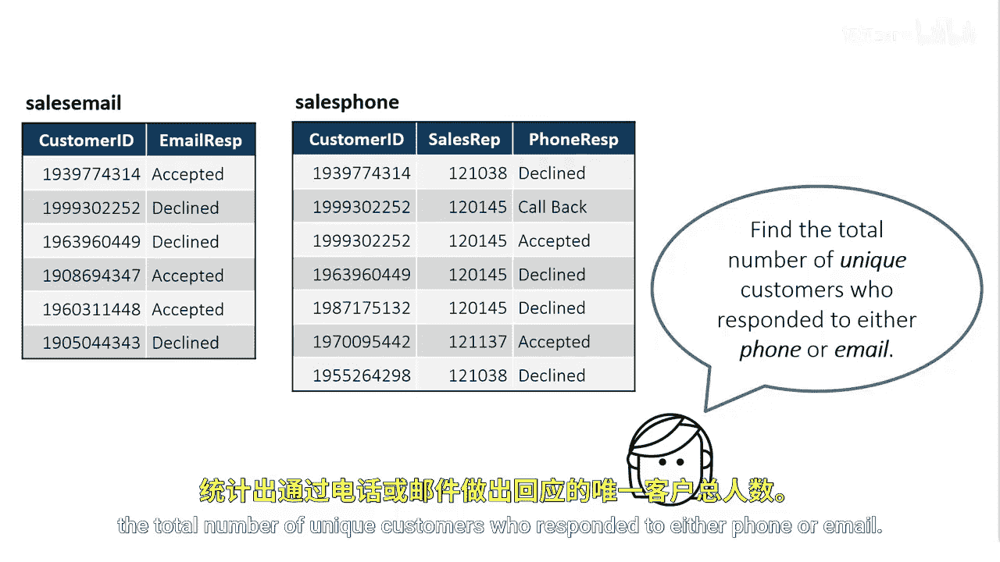

# 086：使用UNION运算符

在本节课中，我们将学习如何使用SQL中的`UNION`运算符，来合并两个查询的结果集并去除重复值，从而找出响应了电话或邮件营销活动的唯一客户总数。

上一节我们介绍了基础的查询操作，本节中我们来看看如何组合多个查询的结果。

## 概述与目标

我们的目标是找出那些响应了我们邮件或电话联系的客户，无论他们最终是接受还是拒绝了我们的优惠。然后，利用这些信息计算出响应了电话或邮件的唯一客户总数量。

为了实现这个目标，我们需要分别从销售邮件表和销售电话表中查询客户ID，然后将两个结果集合并起来。

## 使用UNION运算符

`UNION`是一个集合运算符，它首先将两个或多个`SELECT`语句的结果集组合在一起。

以下是使用`UNION`的基本语法结构：

```sql
SELECT column_name(s) FROM table1
UNION
SELECT column_name(s) FROM table2;
```

关键点在于，每个`SELECT`语句中的列数必须相同，并且对应列的数据类型需要兼容。



## UNION的工作流程

`UNION`运算符的执行主要分为两个步骤：

第一步，组合结果集。运算符会获取第一个查询的所有行，然后附加第二个查询的所有行，形成一个包含所有记录的中间结果集。


第二步，去除重复值。在组合了结果集之后，`UNION`会自动删除其中完全相同的行，只保留唯一的行。这是`UNION`与`UNION ALL`操作符的核心区别。


因此，最终返回的是来自两个源表的、不重复的客户ID列表。

## 应用实例：查找响应客户

根据我们的业务需求，具体的SQL查询步骤如下：


1.  从邮件营销表（例如 `sales_email`）中选取客户ID。
2.  从电话营销表（例如 `sales_phone`）中选取客户ID。
3.  使用`UNION`运算符将两个查询结果合并，并自动去重。

以下是完整的查询示例：

```sql
PROC SQL;
    SELECT Customer_ID FROM sales_email
    UNION
    SELECT Customer_ID FROM sales_phone;
QUIT;
```

运行此查询后，得到的结果集就是所有至少通过一种方式（邮件或电话）给出了回复的唯一客户集合。要计算总数，只需使用`COUNT`函数。


## 本节课总结

本节课中我们一起学习了`UNION`运算符的用法。我们了解到，`UNION`用于合并多个查询的结果，并自动移除重复的行，从而高效地获取唯一值的集合。通过将其应用于邮件和电话响应数据的案例，我们掌握了如何找出对营销活动做出响应的唯一客户总数量。记住，当你需要合并数据并确保结果没有重复时，`UNION`是一个非常有用的工具。