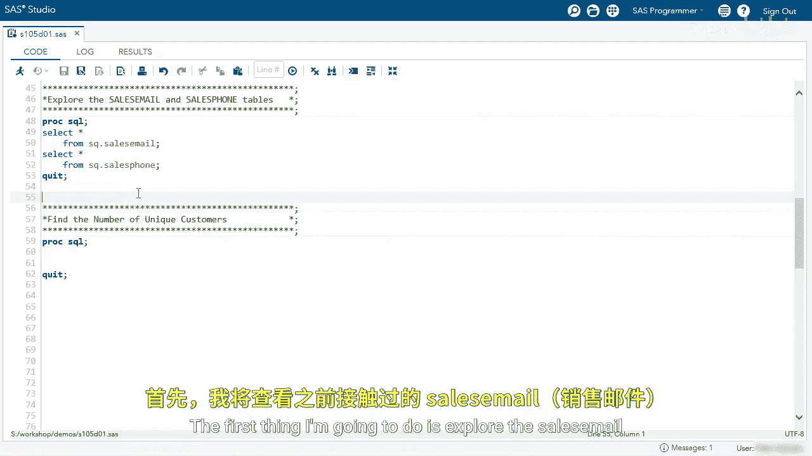
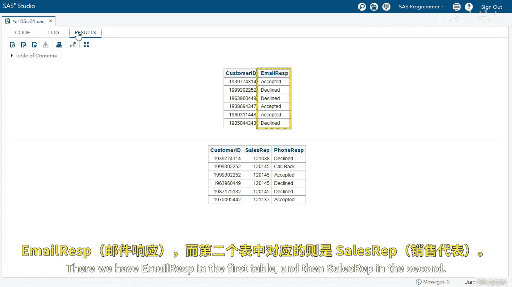
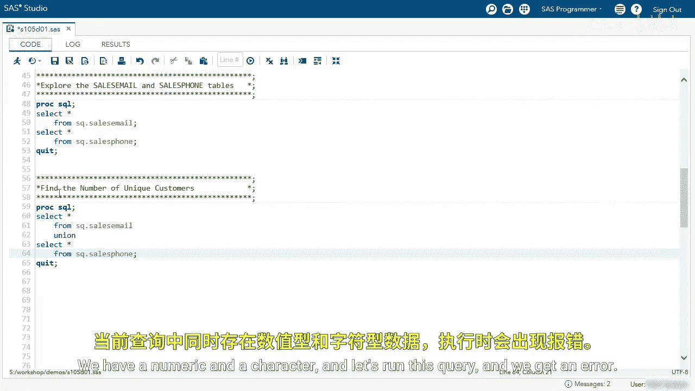
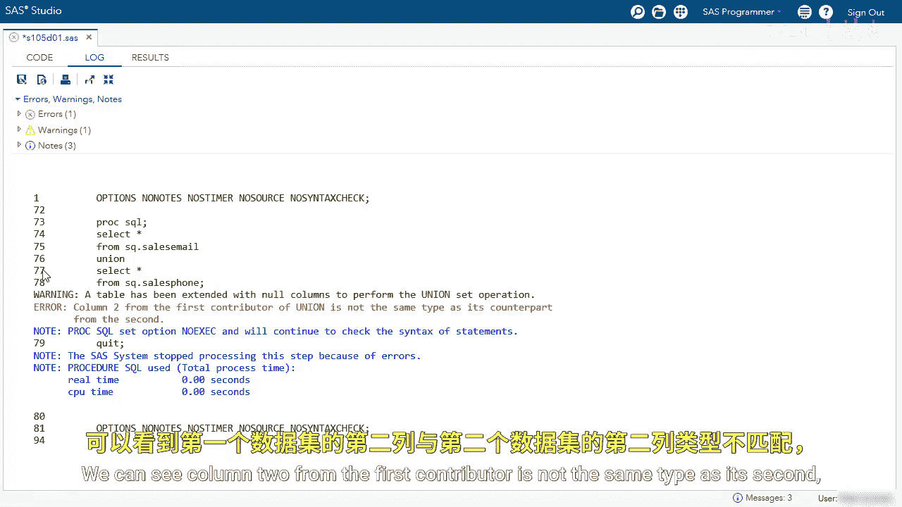
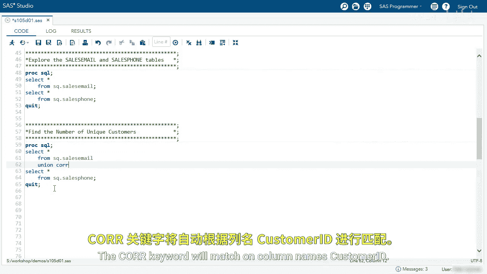
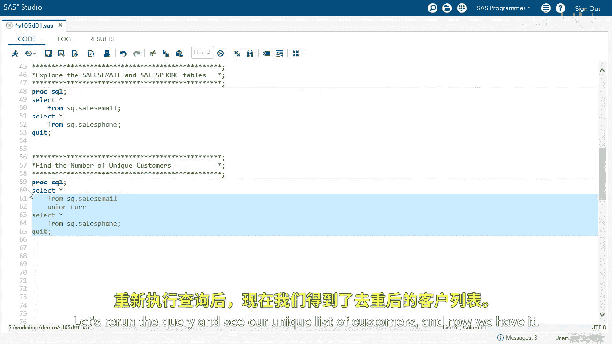

# 087：使用UNION运算符查找所有唯一行 📊

在本节课中，我们将学习如何使用SQL中的`UNION`集合运算符，来统计对电子邮件或电话销售尝试做出回应的唯一客户数量。

## 概述与数据探索



首先，我们来查看将要使用的两个数据表：`sales_email`和`sales_phone`。


可以看到两个表的结构。第一个表`sales_email`包含`customer_id`和`email_response`两列，其中`email_response`记录了“accepted”或“declined”。第二个表`sales_phone`包含`customer_id`、`sales_rep`和`response`三列。

我们的目标是合并这两个表，找出所有做出过回应的不重复客户。


## 初次尝试与错误分析

上一节我们查看了数据，本节中我们尝试使用`UNION`运算符来组合这两个表。

我首先编写查询，从`sales_email`表中选择所有列，然后使用`UNION`运算符，再从`sales_phone`表中选择所有列。代码如下：
```sql
SELECT * FROM sq.sales_email
UNION
SELECT * FROM sq.sales_phone;
```
在运行之前，请思考一下结果会怎样。第一个表有两列，第二个表有三列。回顾之前的截图，我们需要特别注意第二列：第一个表的第二列是字符型的`email_response`，而第二个表的第二列是数值型的`sales_rep`。








现在运行这个查询，我们得到了一个错误。





错误信息指出：第一个贡献表的第二列与第二个贡献表的第二列数据类型不同。`UNION`操作要求对应列的数据类型必须兼容。

## 使用CORRESPONDING关键字修正

回到代码中。我记得两个表中都有`customer_id`列。因此，这次我将添加`CORRESPONDING`关键字。这个关键字会根据列名进行匹配，在这里就是匹配`customer_id`列。



修改后的查询如下：
```sql
SELECT * FROM sq.sales_email
UNION CORRESPONDING
SELECT * FROM sq.sales_phone;
```
重新运行查询，现在我们得到了唯一的客户列表。





## 指定列名以提升代码明确性

虽然使用`CORRESPONDING`关键字可以解决问题，但我个人在编码时更喜欢明确指定列名，这样代码意图更清晰。

因此，我将移除`CORRESPONDING`修饰符，并在两个`SELECT`语句中明确指定只选择`customer_id`列。

修改后的查询如下：
```sql
SELECT customer_id FROM sq.sales_email
UNION
SELECT customer_id FROM sq.sales_phone;
```
运行这个查询，我们得到了相同的结果。明确指定列名使代码更易于理解和维护。


## 统计唯一客户数量


我们的最终目标是统计唯一客户的数量。虽然可以手动数出来，但实际工作中通常会处理更大的表，所以我们需要让SQL来计数。

以下是实现计数的步骤：
1.  将上面使用`UNION`的查询作为一个内联视图（子查询）。
2.  在外层查询中使用`COUNT(*)`函数对这个视图的结果进行计数。

具体代码如下：
```sql
SELECT COUNT(*) AS total_num
FROM (
    SELECT customer_id FROM sq.sales_email
    UNION
    SELECT customer_id FROM sq.sales_phone
) AS unique_customers;
```
这个查询会计算我们定义为内联视图的那个虚拟表中的行数。


查看结果，我们看到有8位不同的客户做出了回应。


## 总结


本节课中我们一起学习了如何使用SQL的`UNION`运算符。我们首先尝试合并两个结构不同的表并遇到了数据类型错误，然后通过使用`CORRESPONDING`关键字根据列名匹配解决了问题。接着，我们采用了更佳实践，通过明确选择`customer_id`列来执行`UNION`操作，最终通过将`UNION`查询作为子查询并结合`COUNT(*)`函数，成功统计出了做出回应的唯一客户总数为8位。`UNION`运算符是合并结果集并自动去除重复行的有效工具。