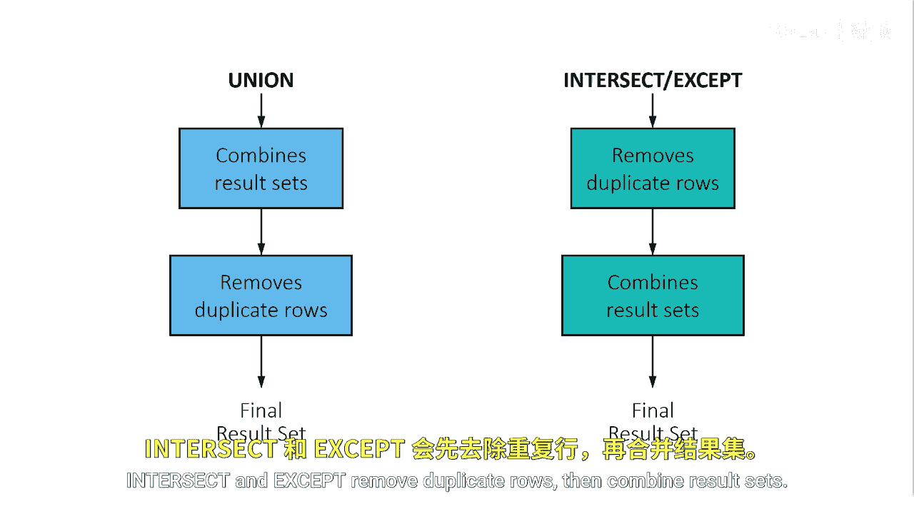

# 088：UNION运算符的默认行为 ⚙️

在本节课中，我们将要学习SAS中`UNION`集合运算符的默认行为。我们将了解它与其他集合运算符（如`INTERSECT`和`EXCEPT`）在处理顺序上的关键区别，以及当合并的表格结构不同时，SAS如何处理列名和列数。

## 处理顺序的差异

上一节我们介绍了集合运算符的基本概念，本节中我们来看看`UNION`运算符独特的工作流程。

`UNION`集合运算符的工作顺序与`INTERSECT`和`EXCEPT`运算符不同。

`UNION`集合运算符首先合并结果集，然后删除重复的行。



`INTERSECT`和`EXCEPT`运算符则是先删除重复的行，然后再合并结果集。

这个顺序差异在处理大数据集时可能对性能和结果产生影响。

## 列数不匹配的处理

当需要合并的两个中间结果集拥有不同数量的列时，SAS会进行自动调整以确保操作能够进行。

如果两个中间结果集的列数不同，SAS会通过添加空列来扩展其中一个表，从而使两个中间结果集拥有相同的列数。

如果结果集一被扩展了空列，那么结果集二中对应列的名称将被用于最终结果。

在这些情况下，SAS会向日志写入一条说明性注释。

以下是SAS处理此情况的逻辑伪代码描述：
```sas
IF ncol(table1) != ncol(table2) THEN DO;
    /* 扩展列数较少的表 */
    extended_table = ADD_NULL_COLUMNS(smaller_table, difference);
    /* 使用未扩展表的列名 */
    final_column_names = COLUMN_NAMES(larger_table);
END;
```

## 总结


本节课中我们一起学习了`UNION`运算符的核心行为。我们明确了其**先合并后去重**的顺序，这与`INTERSECT`和`EXCEPT`的**先去重后合并**形成对比。同时，我们也了解了SAS如何智能地处理列数不匹配的情况——通过扩展空列并采用特定列的命名规则。理解这些默认行为对于编写正确、高效的SAS集合运算代码至关重要。