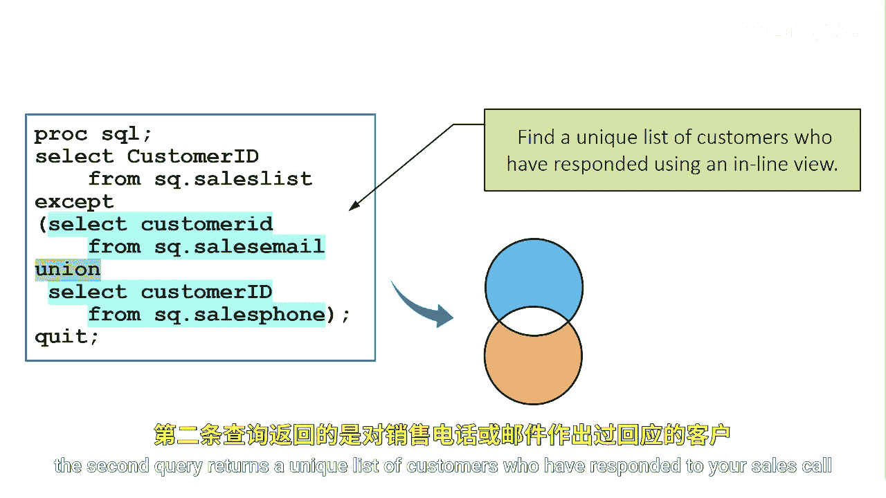

# 089：组合集合运算符 🧩

在本节课中，我们将学习如何结合使用集合运算符，以解决一个常见的业务问题：如何找出那些既未回复电子邮件也未接听电话的潜在客户。

上一节我们介绍了基础的集合运算符，本节中我们来看看如何将它们组合起来，实现更复杂的逻辑筛选。

## 概述与问题定义

假设您需要一份客户名单，这些客户既未回应电子邮件销售，也未回应电话销售。解决此问题需要两个步骤：
1.  首先，找出所有已回应过**任何一种**销售方式的客户。
2.  然后，从总客户名单中**排除**这部分已回应的客户。

## 解决方案：结合UNION与EXCEPT

以下是实现此逻辑的步骤分解。

### 第一步：获取已回应客户的唯一列表

我们需要将`sales_email`（邮件销售）表和`sales_phone`（电话销售）表合并，并去除重复项。这可以通过`UNION`集合运算符实现。


```sql
PROC SQL;
    SELECT Customer_ID
    FROM sales_email
    WHERE Responded = ‘Yes’
    UNION
    SELECT Customer_ID
    FROM sales_phone
    WHERE Responded = ‘Yes’;
QUIT;
```
这段代码会返回一个不重复的客户ID列表，包含了所有回应过邮件**或**电话销售的客户。

### 第二步：从总名单中排除已回应客户

接下来，我们从完整的销售名单表（`sales_list`）中，排除上一步通过`UNION`得到的结果集。这需要使用`EXCEPT`集合运算符。



以下是完整的组合查询代码：

```sql
PROC SQL;
    SELECT Customer_ID
    FROM sales_list
    EXCEPT
    (SELECT Customer_ID
     FROM sales_email
     WHERE Responded = ‘Yes’
     UNION
     SELECT Customer_ID
     FROM sales_phone
     WHERE Responded = ‘Yes’);
QUIT;
```

### 结果解读

执行上述代码后，最终结果将只包含那些在`sales_list`表中，但**没有**出现在`UNION`结果集中的客户ID。根据示例，最终会剩下两名未对任何销售尝试做出回应的客户。

## 总结


本节课中我们一起学习了如何组合使用`UNION`和`EXCEPT`集合运算符。关键思路是：先利用`UNION`合并条件并去重，再使用`EXCEPT`从主集合中剔除这部分数据，从而高效地筛选出符合复杂否定条件（既非A也非B）的记录。这种方法在数据清洗、客户细分和异常检测等场景中非常实用。