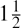

# 《计算机程序的构造和解释》前言，1984 年

> 原文：[Foreword to Structure and Interpretation of Computer Programs, 1984](https://sourceacademy.org/sicpjs/foreword84)
> 
> 译者：[飞龙](https://github.com/wizardforcel)
> 
> 协议：[CC BY-NC-SA 4.0](https://creativecommons.org/licenses/by-nc-sa/4.0/)

教育家、将军、营养师、心理学家和父母都在进行程序设计。军队、学生和一些社会也在进行程序设计。对于大问题的攻击采用了一系列程序，其中大部分在途中出现。这些程序充满了似乎特定于手头问题的问题。要欣赏编程作为一种独立的智力活动，你必须转向计算机编程；你必须阅读和编写计算机程序——其中很多。程序的内容并不重要，它们服务于什么应用也不重要。重要的是它们的表现如何以及它们如何与其他程序顺利地结合以创建更大的程序。程序员必须追求部分的完美和整体的充分性。在这本书中，“程序”的使用集中在使用 Lisp 方言编写的、在数字计算机上执行的程序的创建、执行和研究上。使用 Lisp，我们限制或限定的不是我们可以编程的内容，而只是我们程序描述的符号。

我们与本书的主题有三个焦点：人类思维、计算机程序集合和计算机。每个计算机程序都是一个模型，在头脑中孵化出一个真实或心理过程的模型。这些过程源自人类的经验和思想，数量庞大，细节复杂，而且在任何时候只能部分理解。我们的计算机程序很少能完全满足我们对模型的要求。因此，即使我们的程序是精心制作的离散符号集合，是相互交织功能的马赛克，它们不断地演变：随着我们对模型的认识加深、扩大、泛化，我们改变它们，直到模型最终在我们努力的另一个模型中达到一个亚稳定的位置。与计算机编程相关的振奋源于头脑和计算机中不断展开的机制，这些机制被表达为程序，产生了感知的爆发。如果艺术诠释我们的梦想，那么计算机以程序的形式执行它们！

尽管计算机很强大，但它是一个严格的任务主人。它的程序必须是正确的，我们希望表达的内容必须在每一个细节上都准确无误。与其他符号活动一样，我们通过论证来确信程序的真实性。Lisp 本身可以被赋予语义（顺便说一句，这是另一个模型），如果一个程序的功能可以在谓词演算中指定，那么逻辑的证明方法可以用来进行可接受的正确性论证。不幸的是，随着程序变得庞大和复杂，几乎总是如此，规范的充分性、一致性和正确性本身变得值得怀疑，因此完整的正确性论证很少伴随大型程序。由于大型程序是由小型程序发展而来的，因此我们必须开发一套我们确信正确的标准程序结构的工具库——我们称之为成语，并学会使用经过验证的组织技术将它们组合成更大的结构。这些技术在本书中得到了详细的处理，理解它们对参与被称为编程的普罗米修斯企业至关重要。最重要的是，发现和掌握强大的组织技术加速了我们创造大型、重要程序的能力。相反，由于编写大型程序非常费力，我们被激发去发明新的方法来减少要适应大型程序的功能和细节的负担。

与程序不同，计算机必须遵守物理定律。如果它们希望快速执行——每个状态变化几纳秒——它们必须只传输电子的短距离（最多英尺）。由于这么多设备在空间中集中产生的热量必须被移除。一种精致的工程艺术已经发展出来，在功能的多样性和设备的密度之间取得平衡。无论如何，硬件始终在比我们编程关心的更原始的水平上运行。将我们的 Lisp 程序转换为“机器”程序的过程本身就是我们编程的抽象模型。它们的研究和创建为我们提供了对与编程任意模型相关的组织程序的深刻洞察。当然，计算机本身也可以被建模。想想看：最小的物理开关元件的行为是由量子力学建模的，由微分方程描述，其详细行为由在计算机上执行的数值逼近所捕捉，而这些计算机由...组成！

将三个焦点分开识别并不仅仅是战术上的便利。尽管人们说，一切都在头脑中，但这种逻辑上的分离会加速这些焦点之间的符号交流，其丰富性、活力和潜力仅被人类经验中的生命演化所超越。在最好的情况下，焦点之间的关系是亚稳定的。计算机永远不够大，也不够快。硬件技术的每一次突破都会导致更大规模的编程项目、新的组织原则和抽象模型的丰富化。每个读者都应该定期问自己“朝着什么目标，朝着什么目标？”但不要问得太频繁，以免错过编程的乐趣，而陷入苦涩哲学的便秘中。

在我们编写的程序中，一些（但从来不够）执行精确的数学功能，比如排序或查找一系列数字的最大值，确定素数，或者找到平方根。我们称这样的程序为算法，对它们的最佳行为已经有很多了解，特别是关于执行时间和数据存储需求这两个重要参数。程序员应该掌握良好的算法和习惯用法。尽管有些程序抵制精确的规范，但程序员有责任估计，并始终努力改进它们的性能。

Lisp 是一个幸存者，已经使用了大约四分之一世纪。在活跃的编程语言中，只有 Fortran 的历史更长。这两种语言都支持重要应用领域的编程需求，Fortran 用于科学和工程计算，Lisp 用于人工智能。这两个领域仍然很重要，他们的程序员对这两种语言如此忠诚，以至于 Lisp 和 Fortran 可能会继续活跃使用至少另一个四分之一世纪。

Lisp 发生了变化。本书中使用的 Scheme 方言已经从原始的 Lisp 发展出来，在几个重要方面与后者不同，包括变量绑定的静态作用域和允许函数产生函数作为值。在其语义结构上，Scheme 与 Algol 60 和早期的 Lisps 有着密切的联系。Algol 60 永远不会再成为一种活跃的语言，它在 Scheme 和 Pascal 的基因中继续存在。很难找到比围绕这两种语言聚集的文化更不同的两种语言。Pascal 用于构建金字塔——由推动沉重的方块到位的军队建造的令人印象深刻、令人叹为观止的静态结构。Lisp 用于构建有机体——由适应波动的无数简单有机体的小队建造的令人印象深刻、令人叹为观止的动态结构。在这两种情况下使用的组织原则是相同的，除了一个非常重要的区别：赋予个体 Lisp 程序员的自由功能远远超过 Pascal 企业中所能找到的。Lisp 程序用功能膨胀的库，其效用超越了产生它们的应用程序。列表，Lisp 的本地数据结构，在很大程度上负责这种效用的增长。列表的简单结构和自然适用性反映在那些令人惊讶地非特异的函数中。在 Pascal 中，可声明的数据结构的丰富多样导致函数内的专业化，抑制和惩罚了随意的合作。最好是有 100 个函数操作一个数据结构，而不是有 10 个函数操作 10 个数据结构。因此，金字塔必须在千年不变；有机体必须进化或灭亡。

为了说明这种差异，比较一下这本书中的材料和练习的处理方式与使用 Pascal 的任何第一课文本中的处理方式。不要误以为这是麻省理工学院专用的教材，只有那里的学生才能理解。这本书必须是一本严肃的 Lisp 编程书，不管学生是谁，它在哪里使用。

请注意，这是一本关于编程的书，不同于大多数 Lisp 书籍，后者被用作人工智能工作的准备。毕竟，软件工程和人工智能的关键编程问题在研究的系统变得更大时往往会融合在一起。这解释了为什么人工智能之外对 Lisp 的兴趣越来越大。

正如人们所期望的那样，人工智能研究产生了许多重要的编程问题。在其他编程文化中，这些问题的激增导致了新语言的产生。事实上，在任何非常大的编程任务中，一个有用的组织原则是通过发明语言来控制和隔离任务模块内的流量。随着接近我们人类最常互动的系统边界，这些语言往往变得不那么原始。因此，这些系统包含了许多次复制的复杂语言处理功能。Lisp 具有如此简单的语法和语义，以至于解析可以被视为一项基本任务。因此，解析技术在 Lisp 程序中几乎不起作用，语言处理器的构建很少成为大型 Lisp 系统增长和变化速度的障碍。最后，正是这种语法和语义的简单性造成了所有 Lisp 程序员所承担的负担和自由。任何规模超过几行的 Lisp 程序都无法在没有自由功能的情况下编写。发明和适应；发作和重新发明！我们向在括号的巢穴中书写他的思想的 Lisp 程序员干杯。

—Alan J. Perlis，康涅狄格州纽黑文
