# 一、使用函数构建抽象

> 原文：[1 Building Abstractions with Functions](https://sourceacademy.org/sicpjs/1)
> 
> 译者：[飞龙](https://github.com/wizardforcel)
> 
> 协议：[CC BY-NC-SA 4.0](https://creativecommons.org/licenses/by-nc-sa/4.0/)

> 心灵的行为，其中它对简单的想法施加其力量，主要有以下三种：1.将几个简单的想法组合成一个复合的想法，从而形成所有复杂的想法。2.第二个是将两个想法，无论是简单的还是复杂的，放在一起，并将它们放在一起，以便一次看到它们，而不将它们合并成一个，从而获得它们所有的关系想法。3.第三个是将它们与实际存在的所有其他想法分开：这被称为抽象，从而形成所有的一般想法。
> 
> ——约翰·洛克，《人类理解论》（1690）

我们将要研究*计算过程*的概念。计算过程是存在于计算机中的抽象实体。随着它们的发展，过程操纵其他抽象的东西，称为*数据*。过程的演变由一组称为*程序*的规则指导。人们创建程序来指导过程。实际上，我们用我们的咒语召唤计算机的精神。

计算过程确实很像巫师对精神的想法。它看不见，摸不着。它根本不是由物质组成的。然而，它是非常真实的。它可以进行智力工作。它可以回答问题。它可以通过在银行分发钱或控制工厂中的机器人手臂来影响世界。我们用来施法的程序就像巫师的咒语。它们是从奥秘和神秘的*编程语言*中的符号表达式中精心组成的，这些语言规定了我们希望我们的过程执行的任务。

计算过程在一个正确工作的计算机中精确和准确地执行程序。因此，像巫师的学徒一样，新手程序员必须学会理解和预料他们施法的后果。即使是程序中的小错误（通常称为*bug*）也可能产生复杂和意想不到的后果。

幸运的是，学习编程远比学习巫术危险得多，因为我们处理的精神被方便地以安全的方式包含在其中。然而，现实世界的编程需要谨慎、专业知识和智慧。例如，计算机辅助设计程序中的一个小错误可能导致飞机或大坝的灾难性崩溃，或者工业机器人的自我毁灭。

优秀的软件工程师有能力组织程序，以便他们可以相当确信所得到的过程将执行预期的任务。他们可以预先可视化系统的行为。他们知道如何构造程序，以便意想不到的问题不会导致灾难性后果，而当问题出现时，他们可以*调试*他们的程序。设计良好的计算系统，就像设计良好的汽车或核反应堆一样，都是以模块化的方式设计的，以便部件可以分别构建、更换和调试。

##### JavaScript 编程

我们需要一个适当的语言来描述过程，为此我们将使用编程语言 JavaScript。正如我们的日常思维通常用我们的母语（如英语、瑞典语或中文）表达一样，对数量现象的描述用数学符号表示，我们的过程思维将用 JavaScript 表示。JavaScript 于 1995 年开发，用作控制万维网浏览器行为的编程语言，通过嵌入在网页中的脚本。该语言最初由 Brendan Eich 构思，最初名为*Mocha*，后来更名为*LiveScript*，最终改名为 JavaScript。名称“JavaScript”是 Oracle Corporation 的商标。

尽管 JavaScript 最初是作为网页脚本语言而诞生的，但它是一种通用编程语言。JavaScript *解释器*是一台执行 JavaScript 语言描述的过程的机器。第一个 JavaScript 解释器是由 Eich 在网景通信公司为网景导航器网页浏览器实现的。JavaScript 从 Scheme 和 Self 编程语言继承了其核心特性。Scheme 是 Lisp 的一个方言，并且曾被用作本书原始版本的编程语言。JavaScript 从 Scheme 继承了其最基本的设计原则，如词法作用域的一流函数和动态类型。

JavaScript 与其（最终）命名的语言 Java 只有表面上的相似之处；Java 和 JavaScript 都使用语言 C 的块结构。与通常使用编译到低级语言的 Java 和 C 相反，JavaScript 程序最初是由网页浏览器*解释*的。在网景导航器之后，其他网页浏览器提供了对该语言的解释器，包括微软的 Internet Explorer，其 JavaScript 版本称为*JScript*。JavaScript 在控制网页浏览器方面的流行性促使了一项标准化工作，最终导致了*ECMAScript*的产生。ECMAScript 标准的第一版由盖伊·刘易斯·斯蒂尔（Guy Lewis Steele Jr.）领导，并于 1997 年 6 月完成（ECMA 1997）。第六版，即 ECMAScript 2015，由艾伦·韦尔夫斯-布洛克（Allen Wirfs-Brock）领导，并于 2015 年 6 月被 ECMA 大会采纳（ECMA 2015）。

将 JavaScript 程序嵌入网页的做法鼓励了网页浏览器的开发人员实现 JavaScript 解释器。随着这些程序变得更加复杂，解释器在执行它们时变得更加高效，最终采用了诸如即时（JIT）编译等复杂的实现技术。截至本文撰写时（2021 年），大多数 JavaScript 程序都嵌入在网页中，并由浏览器解释，但 JavaScript 越来越多地被用作通用编程语言，使用诸如 Node.js 等系统。

ECMAScript 2015 拥有一系列功能，使其成为研究重要的编程构造和数据结构以及将它们与支持它们的语言特性相关联的绝佳媒介。它的词法作用域的一流函数及其通过 lambda 表达式的语法支持直接而简洁地访问函数抽象，动态类型允许适应保持接近 Scheme 原始状态。除了这些考虑之外，在 JavaScript 中编程非常有趣。

## 1.1 编程的元素

强大的编程语言不仅仅是指示计算机执行任务的手段。语言还作为一个框架，我们在其中组织关于过程的想法。因此，当我们描述一种语言时，我们应该特别关注语言提供的手段，用于将简单的想法组合成更复杂的想法。每种强大的语言都有三种机制来实现这一点：

+   **原始表达式**，代表语言关注的最简单的实体，

+   **组合手段**，通过这种手段，可以从更简单的元素构建复合元素，以及

+   **抽象手段**，通过这种手段，可以将复合元素命名并作为单元进行操作。

在编程中，我们处理两种元素：函数和数据。（后来我们会发现它们实际上并不那么不同。）非正式地说，数据是我们想要操作的“东西”，而函数是描述操作数据规则的描述。因此，任何强大的编程语言都应该能够描述原始数据和原始函数，并且应该有方法来组合和抽象函数和数据。

在本章中，我们只处理简单的数值数据，以便我们可以专注于构建函数的规则。¹在后面的章节中，我们将看到这些相同的规则允许我们构建函数来操作复合数据。

### 1.1.1 表达式

开始编程的一种简单方法是检查与 JavaScript 语言解释器的一些典型交互。您键入一个*语句*，解释器会通过显示其*求值*结果来做出响应。

您可能键入的一种语句是表达式语句，它由一个*表达式*后跟一个分号组成。一种原始表达式是数字。（更准确地说，您键入的表达式由表示十进制数字的数字组成。）如果您向 JavaScript 提供程序

```js
486;
```

解释器将通过打印²来做出响应

```js
486
```

表示数字的表达式可以与运算符（如`+`或`*`）结合，形成一个复合表达式，表示对这些数字应用相应原始函数的应用。例如，

```js
137 + 349;
486

1000 - 334;
666

5 * 99;
495

10 / 4;
2.5

2.7 + 10;
12.7
```

这样的表达式，其中包含其他表达式作为组成部分，被称为*组合*。由*运算符*符号在中间形成的组合，左右两侧是*操作数*表达式，被称为*运算符组合*。运算符组合的值是通过将运算符指定的函数应用于操作数的值来获得的。

将运算符放在操作数之间的约定称为*中缀表示法*。它遵循您在学校和日常生活中最熟悉的数学表示法。与数学一样，运算符组合可以是*嵌套*的，也就是说，它们可以有自身是运算符组合的操作数：

```js
(3 * 5) + (10 - 6);
19
```

通常情况下，括号用于分组运算符组合，以避免歧义。当省略括号时，JavaScript 也遵循通常的约定：乘法和除法比加法和减法更紧密地绑定。例如，

```js
3 * 5 + 10 / 2;
```

代表

```js
(3 * 5) + (10 / 2);
```

我们说`*`和`/`比`+`和`-`有*更高的优先级*。加法和减法的序列从左到右读取，乘法和除法的序列也是如此。因此，

```js
1 - 5 / 2 * 4 + 3;
```

代表

```js
(1 - ((5 / 2) * 4)) + 3;
```

我们说`+`、`-`、`*`和`/`是*左结合*的。

在原则上，这种嵌套的深度和 JavaScript 解释器可以求值的表达式的整体复杂性没有限制。我们人类可能会被仍然相对简单的表达式所困惑，比如

```js
3 * 2 * (3 - 5 + 4) + 27 / 6 * 10;
```

解释器会立即求值为 57。我们可以通过以以下形式编写这样的表达式来帮助自己

```js
3 * 2 * (3 - 5 + 4)
+
27 / 6 * 10;
```

以视觉上分隔表达式的主要组件。

即使是复杂的表达式，解释器始终以相同的基本循环运行：它读取用户键入的语句，求值语句，并打印结果。这种操作模式通常被称为解释器运行在*读取-求值-打印循环*中。特别要注意的是，不需要明确指示解释器打印语句的值。³

### 1.1.2 命名和环境

编程语言的一个关键方面是它提供了使用名称来引用计算对象的手段，我们的第一种手段是*常量*。我们说名称标识了一个值为对象的常量。

在 JavaScript 中，我们使用*常量声明*为常量命名。

```js
const size = 2;
```

使解释器将值 2 与名称`size`关联起来。⁴一旦名称`size`与数字 2 关联起来，我们可以通过名称引用值 2：

```js
size;
2

5 * size;
10
```

以下是对`const`的进一步使用示例：

```js
const pi = 3.14159;

const radius = 10;

pi * radius * radius;
314.159

const circumference = 2 * pi * radius;

circumference;
62.8318
```

常量声明是我们语言中最简单的抽象手段，因为它允许我们使用简单的名称来引用复合操作的结果，例如上面计算的`circumference`。一般来说，计算对象可能具有非常复杂的结构，要记住并重复它们的细节每次想要使用它们将会非常不方便。事实上，复杂的程序是通过逐步构建越来越复杂的计算对象而构建的。解释器使得这种逐步程序构建特别方便，因为名称-对象关联可以在连续的交互中逐步创建。这个特性鼓励程序的逐步开发和测试，并且在很大程度上负责 JavaScript 程序通常由大量相对简单的函数组成。

应该清楚的是，将值与名称关联并稍后检索这些值的可能性意味着解释器必须维护一种记忆，以跟踪名称-对象对。这种记忆称为*环境*（更确切地说是*程序环境*，因为我们将在后面看到，计算可能涉及多种不同的环境）。

### 1.1.3 求值运算符组合

在本章中，我们的一个目标是分离有关过程式思维的问题。例如，让我们考虑一下，在求值运算符组合时，解释器本身正在遵循一个过程。

+   要求值运算符组合，请执行以下操作：

    1.  1. 求值组合的操作数表达式。

    1.  2. 应用由运算符表示的函数到操作数的值。

即使这个简单的规则也说明了一般过程中的一些重要点。首先，观察到第一步规定，为了完成组合的求值过程，我们必须首先对组合的每个操作数执行求值过程。因此，求值规则在本质上是*递归*的；也就是说，它包括作为其步骤之一的需要调用规则本身。

注意递归的想法如何简洁地表达了在深度嵌套组合的情况下，否则将被视为一个相当复杂的过程。例如，求值

```js
(2 + 4 * 6) * (3 + 12);
```

需要将求值规则应用于四种不同的组合。我们可以通过将组合表示为树的形式来获得这个过程的图像，如下图所示。每个组合都由一个节点表示，其分支对应于从中衍生出的运算符和组合的操作数。终端节点（即没有从它们衍生出的分支的节点）表示运算符或数字。从树的角度来看求值，我们可以想象操作数的值从终端节点向上渗透，然后在更高的层次上组合。一般来说，我们将看到递归是一种处理分层、树状对象的非常强大的技术。事实上，“向上渗透值”形式的求值规则是一种称为*树累积*的一般过程的例子。

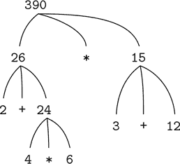

图 1.1 树表示，显示每个子表达式的值。

接下来，观察到第一步的重复应用使我们到达需要求值的点，不是组合，而是诸如数字或名称的原始表达式。我们通过规定以下来处理原始情况：

+   数字的值是它们所代表的数字，而

+   名称的值是环境中与这些名称关联的对象。

要注意的关键点是环境在确定表达式中名称的含义方面的作用。在 JavaScript 这样的交互式语言中，谈论表达式的值，比如`x + 1`，而不指定任何关于提供名称`x`含义的环境信息是没有意义的。正如我们将在第 3 章中看到的，环境的一般概念作为提供求值所发生的上下文将在我们理解程序执行方面发挥重要作用。

请注意，上面给出的求值规则不处理声明。例如，求值`const x = 3;`不会将等号`=`应用于两个参数，其中一个是名称`x`的值，另一个是 3，因为声明的目的恰好是将`x`与一个值关联起来。（也就是说，`const x = 3;`不是一个组合。）

`const`中的字母以粗体呈现，以表明它是 JavaScript 中的*关键字*。关键字具有特定的含义，因此不能用作名称。语句中的关键字或关键字组合指示 JavaScript 解释器以特殊方式处理语句。每种这样的*语法形式*都有其自己的求值规则。各种类型的语句和表达式（每种都有其关联的求值规则）构成了编程语言的语法。

### 1.1.4 复合函数

我们已经确定了 JavaScript 中必须出现的一些元素：

+   数字和算术运算是原始数据和函数。

+   组合的嵌套提供了一种组合操作的方法。

+   将名称与值关联的常量声明提供了有限的抽象手段。

现在我们将学习*函数声明*，这是一种更强大的抽象技术，通过它可以给复合操作命名，然后作为一个单元引用。

我们首先来看如何表达“平方”的概念。我们可以说，“对某物求平方，就是将其乘以自身。”在我们的语言中，这可以表达为

```js
function square(x) {
    return x * x;
}
```

我们可以这样理解：

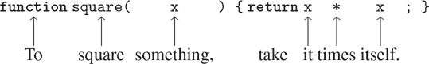

我们这里有一个*复合函数*，它被命名为`square`。该函数表示将某物乘以自身的操作。要被乘的东西被赋予一个本地名称`x`，它扮演的角色与自然语言中的代词相同。求值声明会创建这个复合函数，并将其与名称`square`关联起来。⁶

函数声明的最简单形式是

```js
function name(parameters) { return expression; }
```

*名称*是一个符号，用于将函数定义与环境关联起来。⁷ *参数*是函数体内用于引用函数对应参数的名称。*参数*被括在括号内，并用逗号分隔，就像在应用被声明的函数时一样。在最简单的形式中，函数声明的*函数体*是一个单一的*返回语句*，⁸它由关键字`return`后跟将产生函数应用值的*返回表达式*组成，当参数被实际参数替换时，函数将被应用。与常量声明和表达式语句一样，返回语句以分号结束。

声明了`square`之后，我们现在可以在*函数应用*表达式中使用它，并使用分号将其转换为语句。

```js
square(21);
441
```

函数应用是——在操作符组合之后——我们遇到的将表达式组合成更大表达式的第二种组合。函数应用的一般形式是

```js
function-expression(argument-expressions)
```

应用的`function-expression`指定要应用于逗号分隔的`argument-expressions`的函数。为了求值函数应用，解释器遵循了与 1.1.3 节中描述的操作符组合的过程非常相似的过程。

+   要求值函数应用，执行以下操作：

    1.  1.求值应用的子表达式，即函数表达式和参数表达式。

    1.  2.将函数表达式的值应用于参数表达式的值。

```js
square(2 + 5);
49
```

在这里，参数表达式本身是一个复合表达式，操作符组合`2 + 5`。

```js
square(square(3));
81
```

当然，函数应用表达式也可以作为参数表达式。

我们还可以使用`square`作为定义其他函数的构建块。例如，`x² + y²`可以表示为

```js
square(x) + square(y)
```

我们可以轻松地声明一个名为`sum_of_squares`⁹的函数，它给定任意两个数字作为参数，产生它们的平方和：

```js
function sum_of_squares(x, y) {
    return square(x) + square(y);
}

sum_of_squares(3, 4);
25
```

现在我们可以使用`sum_of_squares`作为构建更多函数的构建块：

```js
function f(a) {
    return sum_of_squares(a + 1, a * 2);
}

f(5);
136
```

除了复合函数，任何 JavaScript 环境都提供了内置于解释器或从库加载的原始函数。除了由操作符提供的原始函数之外，本书中使用的 JavaScript 环境还包括其他原始函数，例如计算其参数的自然对数的函数`math_log`¹⁰。这些额外的原始函数与复合函数完全相同；求值应用`math_log(1)`的结果是数字 0。事实上，通过查看上面给出的`sum_of_squares`的定义，无法确定`square`是内置于解释器中，从库加载，还是定义为复合函数。

### 1.1.5 函数应用的替换模型

为了求值函数应用，解释器遵循 1.1.4 节中描述的过程。也就是说，解释器求值应用的元素，并将函数（即应用的函数表达式的值）应用于参数（即应用的参数表达式的值）。

我们可以假设原始函数的应用由解释器或库处理。对于复合函数，应用过程如下：

+   要将复合函数应用于参数，求值函数的返回表达式，其中每个参数都替换为相应的参数。¹¹

为了说明这个过程，让我们求值应用

```js
f(5)
```

其中`f`是 1.1.4 节中声明的函数。我们首先检索`f`的返回表达式：

```js
sum_of_squares(a + 1, a * 2)
```

然后我们用参数 5 替换参数`a`：

```js
sum_of_squares(5 + 1, 5 * 2)
```

因此，问题简化为求值具有两个参数和函数表达式`sum_of_squares`的应用。求值此应用涉及三个子问题。我们必须求值函数表达式以获得要应用的函数，并且我们必须求值参数表达式以获得参数。现在`5 + 1`产生 6，`5 * 2`产生 10，因此我们必须将`sum_of_squares`函数应用于 6 和 10。这些值替换为`sum_of_squares`的主体中的参数`x`和`y`，将表达式简化为

```js
square(6) + square(10)
```

如果我们使用`square`的声明，这将简化为

```js
(6 * 6) + (10 * 10)
```

这通过乘法减少到

```js
36 + 100
```

最后

```js
136
```

我们刚刚描述的过程称为函数应用的*替换模型*。就本章中的函数而言，它可以被视为确定函数应用“含义”的模型。但是，有两点应该强调：

+   替换的目的是帮助我们思考函数应用，而不是提供解释器实际工作方式的描述。典型的解释器不会通过操纵函数的文本来替换参数的值来求值函数应用。实际上，“替换”是通过使用参数的本地环境来完成的。当我们在第 3 和第 4 章中详细研究解释器的实现时，我们将更全面地讨论这一点。

+   在本书的过程中，我们将提出一系列越来越复杂的解释器工作模型，最终在第 5 章中实现一个解释器和编译器的完整实现。替换模型只是这些模型中的第一个，是一种开始正式思考求值过程的方式。一般来说，在科学和工程中建模现象时，我们从简化的、不完整的模型开始。随着我们更详细地研究事物，这些简单的模型变得不足以满足需求，必须被更精细的模型所取代。替换模型也不例外。特别是，当我们在第 3 章中讨论使用带有“可变数据”的函数时，我们将看到替换模型崩溃了，必须被更复杂的函数应用模型所取代。

##### 应用顺序与正常顺序

根据 1.1.4 节中给出的求值描述，解释器首先求值函数和参数表达式，然后将得到的函数应用于得到的参数。这不是执行求值的唯一方法。另一种求值模型将不会求值参数，直到它们的值被需要为止。相反，它首先用参数表达式替换参数，直到获得只涉及运算符和原始函数的表达式，然后执行求值。如果我们使用这种方法，那么

```js
f(5)
```

将按照扩展的顺序进行。

```js
sum_of_squares(5 + 1, 5 * 2)

square(5 + 1)     + square(5 * 2)

(5 + 1) * (5 + 1) + (5 * 2) * (5 * 2)
```

随后是减少

```js
6    *    6    +    10    *    10

    36         +         100

              136
```

这与我们先前的求值模型得出相同的答案，但过程是不同的。特别是，`5 + 1`和`5 * 2`的求值在这里分别执行两次，对应于表达式的减少

```js
x * x
```

分别用`5 + 1`和`5 * 2`替换`x`。

这种替代的“完全展开然后减少”求值方法被称为*正常顺序求值*，与解释器实际使用的“求值参数然后应用”方法相对应，后者被称为*应用顺序求值*。可以证明，对于可以使用替换进行建模的函数应用（包括本书前两章中的所有函数）并产生合法值，正常顺序和应用顺序求值会产生相同的值。（参见练习 1.5，其中有一个“非法”值的例子，正常顺序和应用顺序求值得出的结果不同。）

JavaScript 使用应用顺序求值，部分原因是为了避免像上面所示的`5 + 1`和`5 * 2`这样的表达式的多次求值所获得的额外效率，更重要的是，当我们离开可以通过替换建模的函数领域时，正常顺序求值变得更加复杂。另一方面，正常顺序求值可以是一个非常有价值的工具，我们将在第 3 和第 4 章中探讨它的一些影响。

### 1.1.6 条件表达式和谓词

到目前为止，我们可以定义的函数类的表达能力非常有限，因为我们无法进行测试并根据测试结果执行不同的操作。例如，我们无法声明一个通过测试数字是否为非负来计算绝对值的函数，并根据规则分别采取不同的操作

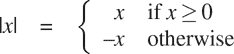

这个结构是一个案例分析，并且可以用 JavaScript 的条件表达式来写成

```js
function abs(x) {
    return x >= 0 ? x : - x;
}
```

这可以用英语表达为“如果`x`大于或等于零，则返回`x`；否则返回`–x`。”条件表达式的一般形式是

```js
predicate ? consequent-expression : alternative-expression
```

条件表达式以`predicate`开头，即其值为 JavaScript 中的两个特殊布尔值`true`或`false`的表达式。原始布尔表达式`true`和`false`分别以布尔值`true`和`false`进行简单求值。`predicate`后面跟着一个问号，`consequent-expression`，一个冒号，最后是`alternative-expression`。

为了求值条件表达式，解释器首先求值表达式的谓词。如果谓词求值为`true`，解释器求值结果表达式并返回其值作为条件表达式的值。如果谓词求值为`false`，它求值替代表达式并返回其值作为条件表达式的值。

单词“谓词”用于返回`true`或`false`的运算符和函数，以及求值为`true`或`false`的表达式。绝对值函数`abs`使用原始谓词`>=`，这是一个接受两个数字作为参数并测试第一个数字是否大于或等于第二个数字的运算符，根据情况返回`true`或`false`。

如果我们更喜欢单独处理零的情况，我们可以通过写一个函数来指定计算一个数字的绝对值

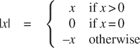

在 JavaScript 中，我们通过在其他条件表达式中将替代表达式作为条件表达式的替代表达式来嵌套条件表达式来表示具有多个情况的案例分析：

```js
function abs(x) {
    return x > 0
           ? x
           : x === 0
           ? 0
           : - x;
}
```

括号不需要在替代表达式`x === 0 ? 0 : - x`周围，因为条件表达式的语法形式是右结合的。解释器忽略空格和换行符，这里插入是为了可读性，以使`?`和`:`在案例分析的第一个谓词下对齐。案例分析的一般形式是

```js
p[1]
? e[1]
: p[2]
? e[2]
⁝
: p[n]
? e[n]
: final-alternative-expression
```

我们将谓词`p[i]`和其结果表达式`e[i]`一起称为*子句*。案例分析可以看作是一系列子句，后跟最终的替代表达式。根据条件表达式的求值，案例分析首先求值谓词`p[1]`。如果它的值为`false`，则求值`p[2]`。如果`p[2]`的值也为`false`，则求值`p[3]`。这个过程一直持续，直到找到一个值为`true`的谓词，此时解释器将返回子句的相应结果表达式`e`的值作为案例分析的值。如果没有找到任何`p`为`true`，则案例分析的值是最终替代表达式的值。

除了应用于数字的原始谓词，如`>=`、`>`、`<`、`<=`、`===`和`!==`之外，还有逻辑组合操作，它们使我们能够构造复合谓词。最常用的三个是这些：

+   `表达式[1] && 表达式[2]`

    这个操作表示逻辑连接，大致意思与英语单词“and”相同。这种语法形式是语法糖，用于

    `表达式[1] ? 表达式[2] : false`。

+   `表达式[1]  表达式[2]`

    这个操作表示逻辑析取，大致意思与英语单词“or”相同。这种语法形式是语法糖。

   `表达式[1] ? true : 表达式[2]`。

+   `! 表达式`

    这个操作表示逻辑否定，大致意思与英语单词“not”相同。当表达式求值为`false`时，表达式的值为`true`，当表达式求值为`true`时，表达式的值为`false`。

注意`&&`和`||`是语法形式，而不是运算符；它们的右侧表达式并不总是被求值。另一方面，运算符`!`遵循第 1.1.3 节的求值规则。它是一个 *一元* 运算符，这意味着它只接受一个参数，而迄今为止讨论的算术运算符和原始谓词都是 *二元* 运算符，接受两个参数。运算符`!`在其参数之前；我们称它为 *前缀运算符*。另一个前缀运算符是数值否定运算符，其示例是上面的`abs`函数中的表达式`- x`。

作为这些谓词如何使用的一个例子，表达一个数`x`在范围`5 < x < 10`中的条件可以表示为

```js
x > 5 && x < 10
```

`&&`的语法形式的优先级低于比较运算符`>`和`<`，条件表达式的语法形式`... ?... :...`的优先级低于迄今为止我们遇到的任何其他运算符，这是我们在上面的`abs`函数中使用的一个特性。

作为另一个例子，我们可以声明一个谓词，测试一个数字是否大于或等于另一个数字

```js
function greater_or_equal(x, y) {
    return x > y || x === y;
}
```

或者作为

```js
function greater_or_equal(x, y) {
    return ! (x < y);
}
```

函数`greater_or_equal`应用于两个数字时，与运算符`>=`的行为相同。一元运算符的优先级高于二元运算符，这使得这个例子中的括号是必需的。

##### 练习 1.1

下面是一系列的陈述。解释器对每个陈述的响应中打印的结果是什么？假设要按照呈现的顺序进行求值。

```js
10;

5 + 3 + 4;

9 - 1;

6 / 2;

2 * 4 + (4 - 6);

const a = 3;

const b = a + 1;

 a + b + a * b;

a === b;

b > a && b < a * b ? b : a;

a === 4
? 6
: b === 4
? 6 + 7 + a
: 25;

2 + (b > a ? b : a);

(a > b
? a
: a < b
? b
: -1)
*
(a + 1);
```

最后两个陈述中条件表达式周围的括号是必需的，因为条件表达式的语法形式的优先级低于算术运算符`+`和`*`。

##### 练习 1.2

将以下表达式翻译成 JavaScript

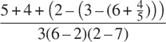

##### 练习 1.3

声明一个以三个数字作为参数并返回两个较大数字的平方和的函数。

##### 练习 1.4

注意我们的求值模型允许应用其函数表达式为复合表达式的应用。使用这一观察来描述`a_plus_abs_b`的行为：

```js
function plus(a, b) { return a + b; }
function minus(a, b) { return a - b; }
function a_plus_abs_b(a, b) {
    return (b >= 0 ? plus : minus)(a, b);
}
```

##### 练习 1.5

Ben Bitdiddle 发明了一个测试，以确定他所面对的解释器是使用应用序求值还是正则序求值。他声明了以下两个函数：

```js
function p() { return p(); }

function test(x, y) {
    return x === 0 ? 0 : y;
}
```

然后他求值了这个陈述

```js
test(0, p());
```

Ben 会观察到使用应用序求值的解释器会有什么行为？他会观察到使用正则序求值的解释器会有什么行为？解释你的答案。（假设条件表达式的求值规则在解释器使用正常或应用序时是相同的：谓词表达式首先被求值，结果决定是求值结果还是替代表达式。）

### 1.1.7 例子：牛顿法求平方根

如上所述，函数很像普通的数学函数。它们指定由一个或多个参数确定的值。但是数学函数和计算机函数之间有一个重要的区别。计算机函数必须是有效的。

作为一个例子，考虑计算平方根的问题。我们可以定义平方根函数为

`√x = y`，满足`y ≥ 0`和`y² = x`

这描述了一个完全合法的数学函数。我们可以用它来识别一个数字是否是另一个数字的平方根，或者推导关于平方根的一般事实。另一方面，这个定义并不描述一个计算机函数。事实上，它几乎没有告诉我们如何实际找到给定数字的平方根。重新用伪 JavaScript 重新表述这个定义也不会有所帮助：

```js
function sqrt(x) {
    return the y with y >= 0 && square(y) === x;
}
```

这只是在回避问题。

数学函数和计算机函数之间的对比反映了描述事物属性和描述如何做事物的一般区别，有时也被称为声明性知识和命令性知识之间的区别。在数学中，我们通常关注声明性（是什么）描述，而在计算机科学中，我们通常关注命令性（如何）描述。¹⁷

如何计算平方根？最常见的方法是使用牛顿的迭代逼近法，该方法指出，每当我们对数字`x`的平方根的值有一个猜测`y`时，我们可以通过对`y`和`x / y`进行平均来进行简单的操作，得到一个更好的猜测（更接近实际平方根）。¹⁸ 例如，我们可以计算 2 的平方根如下。假设我们的初始猜测是 1：

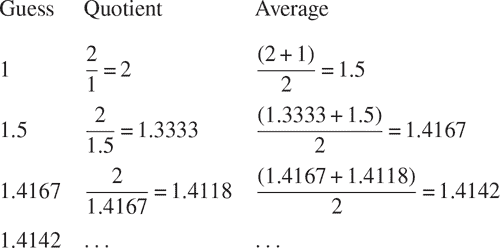

继续这个过程，我们得到越来越好的近似值。

现在让我们用函数的术语来形式化这个过程。我们从被开方数（我们试图计算其平方根的数字）的值和猜测的值开始。如果猜测对我们的目的来说足够好，我们就完成了；如果不是，我们必须用一个改进的猜测重复这个过程。我们将这个基本策略写成一个函数：

```js
function sqrt_iter(guess, x) {
    return is_good_enough(guess, x)
           ? guess
           : sqrt_iter(improve(guess, x), x);
}
```

通过将猜测与被开方数和旧猜测的商进行平均来改进猜测：

```js
function improve(guess, x) {
    return average(guess, x / guess);
}
```

其中

```js
function average(x, y) {
    return (x + y) / 2;
}
```

我们还必须说明“足够好”的含义。以下内容可以用于说明，但实际上并不是一个非常好的测试。（见练习 1.7。）这个想法是改进答案，直到它足够接近，以至于它的平方与被开方数之间的差异小于预定的容差（这里是 0.001）：¹⁹

```js
function is_good_enough(guess, x) {
    return abs(square(guess) - x) < 0.001;
}
```

最后，我们需要一种开始的方法。例如，我们总是可以猜测任何数字的平方根是 1：

```js
function sqrt(x) {
    return sqrt_iter(1, x);
}
```

如果我们将这些声明输入解释器，我们可以像使用任何函数一样使用`sqrt`：

```js
sqrt(9);
3.00009155413138

sqrt(100 + 37);
11.704699917758145

sqrt(sqrt(2) + sqrt(3));
1.7739279023207892

square(sqrt(1000));
1000.000369924366
```

`sqrt`程序还说明了我们迄今为止介绍的简单函数语言足以编写任何纯数值程序，这些程序可以在 C 或 Pascal 中编写。这可能看起来令人惊讶，因为我们的语言中没有包括任何迭代（循环）结构，指导计算机一遍又一遍地做某事。另一方面，函数`sqrt_iter`演示了如何使用除了普通调用函数的能力之外，还可以实现迭代。²⁰

##### 练习 1.6

Alyssa P. Hacker 不喜欢条件表达式的语法，涉及到字符`?`和`:`。“为什么我不能只声明一个普通的条件函数，其应用方式就像条件表达式一样呢？”她问道。²¹ Alyssa 的朋友 Eva Lu Ator 声称这确实可以做到，并声明了一个`conditional`函数如下：

```js
function conditional(predicate, then_clause, else_clause) {
    return predicate ? then_clause : else_clause;
}
```

Eva 为 Alyssa 演示程序：

```js
conditional(2 === 3, 0, 5);
`5`
conditional(1 === 1, 0, 5);
`0`
```

高兴的是，Alyssa 使用`conditional`来重写平方根程序：

```js
function sqrt_iter(guess, x) {
    return conditional(is_good_enough(guess, x),
                        guess,
                        sqrt_iter(improve(guess, x),
                                  x));
}
```

当 Alyssa 尝试使用这个方法来计算平方根时会发生什么？解释。

##### 练习 1.7

用于计算平方根的`is_good_enough`测试对于找到非常小的数字的平方根不会非常有效。此外，在实际计算机中，算术运算几乎总是以有限的精度进行。这使得我们的测试对于非常大的数字是不够的。解释这些陈述，并举例说明测试对于小数字和大数字的失败。实现`is_good_enough`的另一种策略是观察`guess`从一次迭代到下一次迭代的变化，并在变化是猜测的一个非常小的分数时停止。设计一个使用这种结束测试的平方根函数。这对于小数字和大数字效果更好吗？

##### 练习 1.8

牛顿的立方根方法是基于这样一个事实：如果`y`是`x`的立方根的近似值，那么更好的近似值由这个值给出

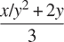

使用这个公式来实现一个类似于平方根函数的立方根函数。（在第 1.3.4 节中，我们将看到如何将牛顿方法作为这些平方根和立方根函数的抽象来实现。）

### 1.1.8 函数作为黑盒抽象

函数`sqrt`是我们第一个例子，它是由一组相互定义的函数定义的过程。请注意，`sqrt_iter`的声明是*递归*的；也就是说，函数是根据自身定义的。能够根据自身定义函数的想法可能会让人感到不安；可能不清楚这样的“循环”定义到底如何有意义，更不用说指定计算机执行的明确定义的过程了。这将在第 1.2 节中更加仔细地讨论。但首先让我们考虑一下`sqrt`示例所说明的一些其他重要点。

注意，计算平方根的问题自然地分解为许多子问题：如何判断猜测是否足够好，如何改进猜测，等等。每个任务都由一个单独的函数完成。整个`sqrt`程序可以被看作是一组函数（在图 1.2 中显示），它反映了将问题分解为子问题的过程。

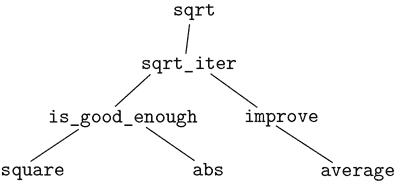

图 1.2 `sqrt`程序的功能分解。

这种分解策略的重要性不仅仅在于将程序分成部分。毕竟，我们可以将任何大型程序分成部分——前十行，接下来的十行，再接下来的十行，依此类推。相反，关键在于每个函数都能够完成一个可识别的任务，可以用作定义其他函数的模块。例如，当我们根据`square`定义`is_good_enough`函数时，我们可以将`square`函数视为“黑盒”。我们当时并不关心函数如何计算其结果，只关心它计算平方的事实。计算平方的细节可以被抑制，以便在以后考虑。实际上，就`is_good_enough`函数而言，`square`不完全是一个函数，而是一个函数的抽象，所谓的*函数抽象*。在这个抽象级别上，任何计算平方的函数都是一样好的。

因此，仅考虑它们返回的值，下面两个平方一个数字的函数应该是无法区分的。每个函数都接受一个数字参数，并将该数字的平方作为值返回。

```js
function square(x) {
    return x * x;
}

function square(x) {
    return math_exp(double(math_log(x)));
}

function double(x) {
    return x + x;
}
```

因此，函数应该能够抑制细节。函数的用户可能并没有自己编写函数，而是从另一个程序员那里获得的一个黑盒。用户不需要知道函数的实现方式就能使用它。

##### 本地名称

函数实现的一个细节不应该影响函数的用户，那就是实现者对函数参数的名称的选择。因此，以下函数不应该有区别：

```js
function square(x) {
    return x * x;
}

function square(y) {
    return y * y;
}
```

这个原则——函数的含义应该与其作者使用的参数名称无关——表面上似乎是不言自明的，但其后果是深远的。最简单的结果是函数的参数名称必须局限于函数体内。例如，在我们的平方根函数的`is_good_enough`声明中，我们使用了`square`：

```js
function is_good_enough(guess, x) {
    return abs(square(guess) - x) < 0.001;
}
```

`is_good_enough`的作者的意图是确定第一个参数的平方是否在给定的公差范围内与第二个参数相匹配。我们看到`is_good_enough`的作者使用名称`guess`来指代第一个参数，`x`指代第二个参数。`square`的参数是`guess`。如果`square`的作者使用`x`（如上所述）来指代该参数，我们可以看到`is_good_enough`中的`x`必须是与`square`中的不同的`x`。运行函数`square`不应该影响`is_good_enough`使用的`x`的值，因为`is_good_enough`在`square`计算完成后可能需要该值。

如果参数不是局限于各自函数体的局部变量，那么`square`中的参数`x`可能会与`is_good_enough`中的参数`x`混淆，而`is_good_enough`的行为将取决于我们使用的`square`的版本。因此，`square`将不会是我们所期望的黑匣子。

函数的参数在函数声明中有一个非常特殊的角色，即参数的名称是什么并不重要。这样的名称称为*绑定*，我们说函数声明*绑定*了它的参数。如果一个名称没有被绑定，我们说它是*自由*的。一个绑定声明名称的语句集被称为该名称的*作用域*。在函数声明中，作为函数参数声明的绑定名称具有函数体作为它们的作用域。

在上面的`is_good_enough`声明中，`guess`和`x`是绑定的名称，但`abs`和`square`是自由的。`is_good_enough`的含义应该与我们为`guess`和`x`选择的名称无关，只要它们与`abs`和`square`不同即可。（如果我们将`guess`重命名为`abs`，我们将通过*捕获*名称`abs`引入一个错误。它将从自由变为绑定。）然而，`is_good_enough`的含义并不独立于其自由名称的选择。然而，它肯定取决于（不包括在此声明中的）名称`abs`是指计算数字的绝对值的函数。如果我们在其声明中用`math_cos`（原始余弦函数）替换`abs`，`is_good_enough`将计算一个不同的函数。

##### 内部声明和块结构

到目前为止，我们已经有一种名称隔离的方式：函数的参数是局限于函数体的。求平方根的程序展示了我们希望控制名称使用的另一种方式。现有的程序由独立的函数组成：

```js
function sqrt(x) {
    return sqrt_iter(1, x);
}
function sqrt_iter(guess, x) {
    return is_good_enough(guess, x)
           ? guess
           : sqrt_iter(improve(guess, x), x);
}
function is_good_enough(guess, x) {
    return abs(square(guess) - x) < 0.001;
}
function improve(guess, x) {
    return average(guess, x / guess);
}
```

这个程序的问题在于，对于`sqrt`的用户来说，唯一重要的函数是`sqrt`。其他函数（`sqrt_iter`，`is_good_enough`和`improve`）只会混淆他们的思维。他们可能不会在另一个程序中声明任何名为`is_good_enough`的其他函数，以便与求平方根程序一起工作，因为`sqrt`需要它。这个问题在由许多独立程序员构建大型系统时尤为严重。例如，在构建大型数值函数库时，许多数值函数是作为连续逼近计算的，因此可能有名为`is_good_enough`和`improve`的辅助函数。我们希望将子函数局部化，将它们隐藏在`sqrt`内部，以便`sqrt`可以与其他连续逼近并存，每个都有自己的私有`is_good_enough`函数。

为了实现这一点，我们允许函数具有局部于该函数的内部声明。例如，在求平方根的问题中，我们可以写

```js
function sqrt(x) {
    function is_good_enough(guess, x) {
        return abs(square(guess) - x) < 0.001;
    }
    function improve(guess, x) {
        return average(guess, x / guess);
        }
    function sqrt_iter(guess, x) {
        return is_good_enough(guess, x)
               ? guess
               : sqrt_iter(improve(guess, x), x);
    }
    return sqrt_iter(1, x);
}
```

任何匹配的大括号对都指定了一个*块*，并且块内的声明对该块是局部的。这种声明的嵌套，称为*块结构*，基本上是最简单的名称封装问题的正确解决方案。但这里潜在的想法更好。除了内部化辅助函数的声明外，我们还可以简化它们。由于`x`在`sqrt`的声明中被绑定，因此在`sqrt`内部声明的`is_good_enough`、`improve`和`sqrt_iter`函数在`x`的作用域内。因此，不需要显式地将`x`传递给这些函数中的每一个。相反，我们允许`x`在内部声明中成为一个自由名称，如下所示。然后，`x`从调用封闭函数`sqrt`的参数中获取其值。这种规则称为*词法作用域*。²⁴

```js
function sqrt(x) {
    function is_good_enough(guess) {
        return abs(square(guess) - x) < 0.001;
    }
    function improve(guess) {
        return average(guess, x / guess);
    }
    function sqrt_iter(guess) {
        return is_good_enough(guess)
               ? guess
               : sqrt_iter(improve(guess));
    }
    return sqrt_iter(1);
}
```

我们将广泛使用块结构来帮助我们将大型程序分解为可处理的部分。²⁵ 块结构的概念起源于编程语言 Algol 60。它出现在大多数高级编程语言中，是帮助组织大型程序构建的重要工具。

## 1.2 函数及其生成的过程

我们现在已经考虑了编程的元素：我们使用了原始算术运算，我们组合了这些运算，并通过将它们声明为复合函数来抽象化这些复合运算。但这还不足以使我们能够说我们知道如何编程。我们的情况类似于学会了国际象棋中棋子如何移动的规则，但对典型的开局、战术或策略一无所知的人。就像初学国际象棋的人一样，我们还不知道领域中的常见使用模式。我们缺乏哪些着法是值得做的（哪些函数值得声明）的知识。我们缺乏预测做出着法（执行函数）后的后果的经验。

能够可视化所考虑行动的后果对于成为专业程序员至关重要，就像在任何综合的创造性活动中一样。例如，要成为专业摄影师，必须学会如何观察一个场景，并知道每个区域在曝光和处理选项的每种可能选择下在打印品上会显得多暗。只有这样，才能向后推理，规划构图、光线、曝光和处理，以获得期望的效果。编程也是如此，我们在规划进程采取的行动，并通过程序控制进程。要成为专家，我们必须学会可视化各种类型函数生成的过程。只有在我们培养了这样的技能之后，才能学会可靠地构建表现出所需行为的程序。

函数是计算过程的*局部演变*的模式。它指定了过程的每个阶段是如何建立在前一个阶段之上的。我们希望能够对由函数指定局部演变的过程的整体或*全局*行为做出陈述。这在一般情况下非常难以做到，但我们至少可以尝试描述一些典型的过程演变模式。

在本节中，我们将研究一些简单函数生成的常见“形状”。我们还将调查这些过程消耗时间和空间等重要计算资源的速率。我们将考虑的函数非常简单。它们的作用类似于摄影中的测试图案：作为过度简化的原型模式，而不是实际示例。

### 1.2.1 线性递归和迭代

我们首先考虑阶乘函数的定义。

```js
n != n · (n – 1) *·* (n – 2) ... 3 · 2 · 1
```

计算阶乘有很多方法。一种方法是利用这样的观察：对于任何正整数`n`，`n!`等于`n`乘以`(n – 1)!`：

```js
n! = n · [(n – 1) · (n – 2) ... 3 · 2 · 1] = n · (n – 1)!
```
因此，我们可以通过计算`(n – 1)!`并将结果乘以`n`来计算`n!`。如果我们添加规定 1! 等于 1，这一观察直接转化为计算机函数：

```js
function factorial(n) {
    return n === 1
           ? 1
           : n * factorial(n - 1);
}
```

我们可以使用第 1.1.5 节的替换模型来观察这个函数计算`6!`的过程，如图 1.3 所示。

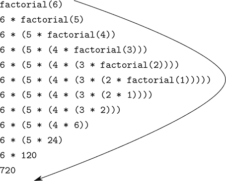

图 1.3 计算 6! 的线性递归过程。

现在让我们以不同的角度来计算阶乘。我们可以通过指定首先将 1 乘以 2，然后将结果乘以 3，然后乘以 4，依此类推，直到达到`n`，来描述计算`n!`的规则。更正式地说，我们保持一个运行乘积，以及一个从 1 计数到`n`的计数器。我们可以通过以下规则描述计算过程：

```js
product ← counter · product

counter ← counter + 1
```

并规定当计数器超过`n`时，`n!`是乘积的值。

再次，我们可以将我们的描述重新构造为计算阶乘的函数：²⁶

```js
function factorial(n) {
    return fact_iter(1, 1, n);
}
function fact_iter(product, counter, max_count) {
    return counter > max_count
           ? product
           : fact_iter(counter * product,
                       counter + 1,
                       max_count);
}
```

与之前一样，我们可以使用替换模型来可视化计算 6! 的过程，如图 1.4 所示。

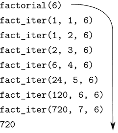

图 1.4 计算 6! 的线性迭代过程。

比较这两个过程。从某种角度来看，它们似乎几乎没有什么不同。两者都在相同的域上计算相同的数学函数，并且每个都需要与`n`成比例的步骤来计算`n!`。事实上，这两个过程甚至执行相同的乘法序列，得到相同的部分积序列。另一方面，当我们考虑这两个过程的“形状”时，我们发现它们的演变方式完全不同。

考虑第一个过程。替换模型显示了一个扩展后跟着收缩的形状，如图 1.3 中的箭头所示。扩展发生在过程构建一系列*延迟操作*（在本例中是一系列乘法）时。收缩发生在实际执行操作时。这种过程，以一系列延迟操作为特征，被称为*递归过程*。执行这个过程需要解释器跟踪稍后要执行的操作。在计算`n!`时，延迟乘法的链的长度，因此需要跟踪它的信息量，与步骤数量一样，随`n`线性增长（与`n`成比例）。这样的过程被称为*线性递归过程*。

相比之下，第二个过程不会增长和缩小。在每一步中，无论`n`是多少，我们都只需要跟踪名称`product`、`counter`和`max_count`的当前值。我们称这个过程为*迭代过程*。一般来说，迭代过程是指其状态可以由固定数量的*状态变量*以及描述状态变量如何在过程从一个状态转移到另一个状态时更新的固定规则以及（可选的）结束测试来总结。在计算`n!`时，所需的步骤数量随`n`增长而线性增长。这样的过程被称为*线性迭代过程*。

两个过程之间的对比可以从另一个角度看出。在迭代的情况下，状态变量提供了在任何时候过程状态的完整描述。如果我们在步骤之间停止计算，只需向解释器提供三个状态变量的值，就可以恢复计算。而在递归过程中则不然。在这种情况下，还有一些额外的“隐藏”信息，由解释器维护，不包含在状态变量中，它指示了在处理延迟操作链时的“位置”。链越长，就必须维护的信息就越多。

在对比迭代和递归时，我们必须小心，不要混淆递归*过程*的概念和递归*函数*的概念。当我们将一个函数描述为递归时，我们指的是函数声明引用（直接或间接）函数本身的语法事实。但是当我们描述一个遵循某种模式的过程时，比如说线性递归，我们说的是过程如何演变，而不是函数的语法如何编写。将递归函数`fact_iter`称为生成迭代过程可能看起来令人不安。然而，这个过程确实是迭代的：它的状态完全由它的三个状态变量捕获，解释器只需要跟踪三个名称就能执行这个过程。

区分过程和函数可能令人困惑的一个原因是，大多数常见语言的实现（包括 C、Java 和 Python）都是设计成这样的方式，即任何递归函数的解释都会消耗随着函数调用次数增加而增长的内存，即使所描述的过程原则上是迭代的。因此，这些语言只能通过专门的“循环结构”（如`do`、`repeat`、`until`、`for`和`while`）来描述迭代过程。我们将在第 5 章中考虑的 JavaScript 实现不具有这个缺陷。即使迭代过程是由递归函数描述的，它也将在恒定空间中执行迭代过程。具有这种属性的实现被称为*尾递归*。使用尾递归实现，迭代可以使用普通的函数调用机制来表达，因此特殊的迭代结构只有作为语法糖才有用。

##### 练习 1.9

以下两个函数中的每一个都定义了一个方法，用函数`inc`来增加其参数 1，和函数`dec`来减少其参数 1，来实现两个正整数的加法。

```js
function plus(a, b) {
    return a === 0 ? b : inc(plus(dec(a), b));
}

function plus(a, b) {
    return a === 0 ? b : plus(dec(a), inc(b));
}
```

使用替换模型，说明每个函数生成的过程在求值`plus(4, 5);`时。这些过程是迭代的还是递归的？

##### 练习 1.10

以下函数计算了一个称为 Ackermann 函数的数学函数。

```js
function A(x, y) {
    return y === 0
           ? 0
           : x === 0
           ? 2 * y
           : y === 1
           ? 2
           : A(x - 1, A(x, y - 1));
}
```

以下语句的值是多少？

```js
A(1, 10);

A(2, 4);

A(3, 3);
```

考虑以下函数，其中`A`是上面声明的函数：

```js
function f(n) {
    return A(0, n);
}
function g(n) {
    return A(1, n);
}
function h(n) {
    return A(2, n);
}
function k(n) {
    return 5 * n * n;
}
```

给出函数`f`，`g`和`h`的简洁数学定义，用于正整数值`n`。例如，`k(n)`计算`5n²`。

### 1.2.2 树递归

另一种常见的计算模式称为*树递归*。例如，考虑计算斐波那契数列，其中每个数字是前两个数字的和：

```js
0, 1, 1, 2, 3, 5, 8, 13, 21, ...
```

一般来说，斐波那契数可以通过以下规则定义

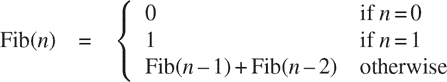

我们可以立即将这个定义转化为一个递归函数，用于计算斐波那契数：

```js
function fib(n) {
    return n === 0
           ? 0
           : n === 1
           ? 1
           : fib(n - 1) + fib(n - 2);
}
```

考虑这个计算的模式。要计算`fib(5)`，我们计算`fib(4)`和`fib(3)`。要计算`fib(4)`，我们计算`fib(3)`和`fib(2)`。一般来说，演变的过程看起来像一棵树，如图 1.5 所示。注意到在每个级别（除了底部）分支分成两个，这反映了`fib`函数每次被调用时调用自身两次的事实。

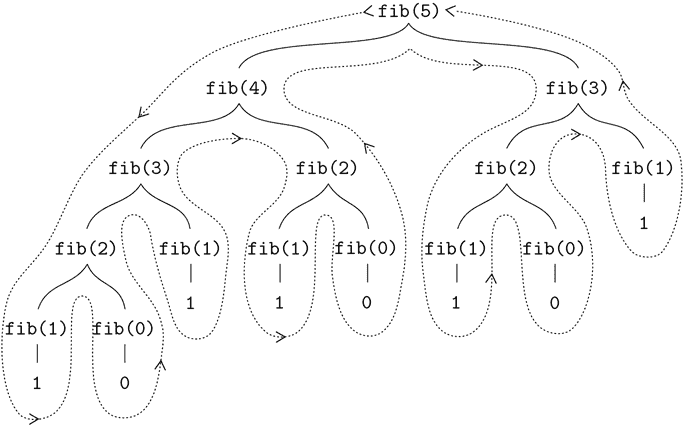

图 1.5 计算`fib(5)`时生成的树递归过程。

这个函数作为一个典型的树递归很有启发性，但它是计算斐波那契数的一种可怕的方式，因为它做了很多冗余的计算。注意在图 1.5 中，`fib(3)`的整个计算——几乎一半的工作——是重复的。事实上，不难证明函数将计算`fib(1)`或`fib(0)`（通常情况下上述树中的叶子数）的次数恰好是`Fib(n + 1)`。为了了解这有多糟糕，可以证明`Fib(n)`的值随着`n`的增长呈指数增长。更准确地说（见练习 1.13），`Fib(n)`是最接近`ϕⁿ/√5`的整数，其中

```js
ϕ = (1 + √5)/2 ≈ 1.6180
```

是*黄金比例*，满足方程

```js
ϕ² = ϕ + 1
```

因此，这个过程所需的步骤数随着输入的增长呈指数增长。另一方面，所需的空间只是线性增长，因为我们只需要在计算的任何时候跟踪树中在我们上面的哪些节点。一般来说，树递归过程所需的步骤数将与树中的节点数成正比，而所需的空间将与树的最大深度成正比。

我们还可以制定一个迭代的过程来计算斐波那契数。这个想法是使用一对整数`a`和`b`，初始化为`Fib(1) = 1`和`Fib(0) = 0`，并反复应用同时的转换

```js
a ← a + b
b ← a
```

不难证明，经过这种转换`n`次后，`a`和`b`分别等于`Fib(n + 1)`和`Fib(n)`。因此，我们可以使用以下函数迭代地计算斐波那契数

```js
function fib(n) {
    return fib_iter(1, 0, n);
}
function fib_iter(a, b, count) {
    return count === 0
           ? b
           : fib_iter(a + b, a, count - 1);
}
```

这种计算`Fib(n)`的第二种方法是线性迭代。这两种方法所需的步骤数的差异——一个与`n`成正比，一个与`Fib(n)`本身一样快地增长——是巨大的，即使对于小的输入也是如此。

我们不应该因此得出树递归过程是无用的结论。当我们考虑操作层次结构化数据而不是数字的过程时，我们会发现树递归是一种自然而强大的工具。³⁰但即使在数值运算中，树递归过程也可以帮助我们理解和设计程序。例如，尽管第一个`fib`函数比第二个函数效率低得多，但它更直接，几乎只是斐波那契数列定义的 JavaScript 翻译。要制定迭代算法，需要注意到计算可以重塑为具有三个状态变量的迭代。

##### 例子：找零

只需要一点巧妙就能想出迭代的斐波那契算法。相比之下，考虑以下问题：我们有多少种不同的方法可以找零 1.00 美元（100 美分），给定半美元、25 美分、10 美分、5 美分和 1 美分的硬币（分别为 50 美分、25 美分、10 美分、5 美分和 1 美分）？更一般地，我们能否编写一个函数来计算任意给定金额的找零方式？

这个问题有一个简单的解决方案，作为一个递归函数。假设我们把可用的硬币类型按照某种顺序排列。那么以下关系成立：

使用`n`种硬币来改变金额`a`的方式数等于

+   使用除第一种硬币之外的所有硬币来改变金额`a`的方式，再加上

+   使用所有`n`种硬币来改变金额`a - d`的方式，其中`d`是第一种硬币的面额。

要看到这是为什么，观察一下找零的方式可以分为两组：那些不使用第一种硬币的和那些使用的。因此，某个金额的找零方式的总数等于不使用第一种硬币的金额的找零方式的数量，加上假设我们使用第一种硬币的找零方式的数量。但后者的数量等于使用第一种硬币后剩下的金额的找零方式的数量。

因此，我们可以递归地将改变给定金额的问题减少到改变较小金额或使用更少种类的硬币的问题。仔细考虑这个减少规则，并让自己相信，我们可以用它来描述一个算法，如果我们指定以下退化情况：³¹

+   如果`a`恰好为 0，我们应该将其视为 1 种找零的方式。

+   如果`a`小于 0，我们应该将其视为 0 种找零的方式。

+   如果`n`为 0，我们应该将其视为 0 种找零的方式。

我们可以很容易地将这个描述转化为一个递归函数：

```js
function count_change(amount) {
    return cc(amount, 5);
}
function cc(amount, kinds_of_coins) {
    return amount === 0
           ? 1
           : amount < 0 || kinds_of_coins === 0
           ? 0
           : cc(amount, kinds_of_coins - 1)
             +
             cc(amount - first_denomination(kinds_of_coins), 
                kinds_of_coins);
}
function first_denomination(kinds_of_coins) {
    return kinds_of_coins === 1 ? 1
         : kinds_of_coins === 2 ? 5
         : kinds_of_coins === 3 ? 10
         : kinds_of_coins === 4 ? 25
         : kinds_of_coins === 5 ? 50
         : 0;
}
```

（`first_denomination`函数以可用硬币种类的数量作为输入，并返回第一种硬币的面额。在这里，我们将硬币按从大到小的顺序排列，但任何顺序都可以。）现在我们可以回答关于找零一美元的最初问题：

```js
count_change(100);
292
```

函数`count_change`生成了一个树形递归过程，其中包含与我们对`fib`的第一个实现类似的冗余。另一方面，设计一个更好的算法来计算结果并不明显，我们将这个问题留作挑战。树形递归过程可能非常低效，但通常易于指定和理解的观察，这导致人们提出，通过设计一个“智能编译器”，可以将树形递归函数转换为计算相同结果的更有效的函数，从而获得两全其美的最佳结果。³²

##### 练习 1.11

一个函数`f`由以下规则定义：如果`n < 3`，`f(n) = n`，如果`n > 3`，`f(n) = f(n - 1) + 2f(n - 2) + 3f(n - 3)`。编写一个通过递归过程计算`f`的 JavaScript 函数。编写一个通过迭代过程计算`f`的函数。

##### 练习 1.12

以下数字模式称为*帕斯卡三角形*。

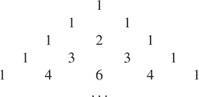

三角形边缘的数字都是 1，三角形内部的每个数字都是它上面两个数字的和。³³编写一个通过递归过程计算帕斯卡三角形元素的函数。

##### 练习 1.13

证明`Fib(n)`是最接近`ϕⁿ/√5`的整数，其中`ϕ=(1+√5)/2`。提示：使用归纳法和斐波那契数的定义来证明`Fib(n)=(ϕⁿ-ψⁿ)/√5`，其中`ψ=(1-√5)/2`。

### 1.2.3 增长的顺序

前面的例子说明了过程在消耗计算资源的速率上可能有很大的不同。描述这种差异的一种方便的方法是使用*增长的顺序*的概念，以获得一个粗略的度量，即随着输入变大，过程所需的资源。

让`n`成为衡量问题规模的参数，`R(n)`是过程对规模为`n`的问题所需的资源量。在我们之前的例子中，我们取`n`为要计算给定函数的数字，但还有其他可能性。例如，如果我们的目标是计算一个数字的平方根的近似值，我们可能会取`n`为所需的精度位数。对于矩阵乘法，我们可能会取`n`为矩阵中的行数。一般来说，关于问题的一些属性是值得分析给定过程的。同样，`R(n)`可能衡量使用的内部存储寄存器的数量，执行的基本机器操作的数量等等。在一次只执行固定数量的操作的计算机中，所需的时间将与执行的基本机器操作的数量成正比。

我们说`R(n)`的增长顺序是`Θ(f(n))`，写作`R(n) = Θ(f(n))`（读作“theta `f(n)`”），如果存在正常数`k[1]`和`k[2]`，独立于`n`，使得

```js
k[1] f(n) ≤ R(n) ≤ k[2] f(n)
```

对于任何足够大的`n`值。（换句话说，对于大的`n`，值`R(n)`夹在`k[1]f(n)`和`k[2]f(n)`之间。）

例如，在第 1.2.1 节中描述的用于计算阶乘的线性递归过程，步数与输入`n`成比例增长。因此，此过程所需的步数增长为`Θ(n)`。我们还看到所需的空间增长为`Θ(n)`。对于迭代阶乘，步数仍然是`Θ(n)`，但空间是`Θ(1)`——即常数。[^34] 在第 1.2.2 节中描述的黄金比例`ϕ`，树递归的斐波那契计算需要`Θ(ϕⁿ)`步和`Θ(n)`空间。

增长顺序只提供了对过程行为的粗略描述。例如，需要`n²`步的过程和需要`1000n²`步的过程以及需要`3n² + 10n + 17`步的过程都具有`Θ(n²)`的增长顺序。另一方面，增长顺序提供了一个有用的指示，告诉我们当问题的规模改变时，我们可以期望过程的行为如何改变。对于`Θ(n)`（线性）过程，将问题规模加倍将大致使资源使用量加倍。对于指数过程，问题规模的每个增量将通过一个常数因子来增加资源利用率。在第 1.2 节的其余部分，我们将研究两种增长顺序为对数的算法，因此问题规模加倍将使资源需求增加一个常数量。

##### 练习 1.14

绘制树，说明第 1.2.2 节中的`count_change`函数生成的过程，用于找零 11 美分。随着要找零的金额增加，该过程使用的空间和步数的增长顺序是多少？

##### 练习 1.15

如果`x`足够小，则可以利用近似值`sin x ≈ x`来计算角的正弦（以弧度表示），以及三角恒等式

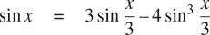

减小`sin`的参数大小。（对于本练习而言，如果角的大小不大于 0.1 弧度，则被认为是“足够小”。）这些想法被纳入以下函数：

```js
function cube(x) {
    return x * x * x;
}
function p(x) {
    return 3 * x - 4 * cube(x);
}
function sine(angle) {
    return ! (abs(angle) > 0.1)
           ? angle
           : p(sine(angle / 3));
}
```

1.  a. 当计算`sine(12.15)`时，函数`p`被应用了多少次？

1.  b. 当计算`sine(a)`时，由`sine`函数生成的过程的空间和步数的增长顺序是多少（作为`a`的函数）？

### 1.2.4 指数

考虑计算给定数字的指数的问题。我们希望有一个函数，它以基数`b`和正整数指数`n`作为参数，并计算`bⁿ`。一种方法是通过递归定义来实现这一点

```js
bⁿ = b bⁿ^(–1)

b⁰ = 1
```

这很容易转化为函数

```js
function expt(b, n) {
    return n === 0
           ? 1
           : b * expt(b, n - 1);
}
```

这是一个线性递归过程，需要`Θ(n)`步和`Θ(n)`空间。就像阶乘一样，我们可以很容易地制定一个等效的线性迭代：

```js
function expt(b, n) {
    return expt_iter(b, n, 1);
}
function expt_iter(b, counter, product) {
    return counter === 0
           ? product
           : expt_iter(b, counter - 1, b * product);
}
```

这个版本需要`Θ(n)`步和`Θ(1)`空间。

通过使用连续平方，我们可以用更少的步骤计算指数。例如，不是计算`b`⁸为

```js
b · (b · (b · (b · (b · (b · (b · b))))))
```

我们可以使用三次乘法来计算它：

```js
b² = b · b

b⁴ = b² · b²

b⁸ = b⁴ · b⁴
```

这种方法适用于 2 的幂次方。如果我们使用规则

`bⁿ = (b^(n/2))²`如果`n`是偶数

`bⁿ = b · b^(n–1)`如果`n`是奇数

我们可以将这种方法表达为一个函数：

```js
function fast_expt(b, n) {
    return n === 0
           ? 1
           : is_even(n)
           ? square(fast_expt(b, n / 2))
           : b * fast_expt(b, n - 1);
}
```

其中用于测试整数是否为偶数的谓词是根据运算符`％`定义的，该运算符在整数除法后计算余数，通过

```js
function is_even(n) {
    return n % 2 === 0;
}
```

`fast_expt`产生的过程在空间和步数上都以对数方式增长。观察到使用`fast_expt`计算`b²ⁿ`只需要比计算`bⁿ`多一次乘法。因此，我们可以大约每次允许新的乘法时，我们可以计算的指数大小加倍。因此，对于`n`的指数所需的乘法数量大约与以 2 为底的`n`的对数一样快。该过程具有`Θ(log n)`增长。³⁵

当`n`变大时，`Θ(log n)`增长和`Θ(n)`增长之间的差异变得明显。例如，`n=1000`时，`fast_expt`只需要 14 次乘法。³⁶也可以使用连续平方的想法设计一个迭代算法，该算法使用对数数量的步骤计算指数（参见练习 1.16），尽管通常情况下，这与递归算法一样，不那么直接。³⁷

##### 练习 1.16

设计一个函数，它演变出一个使用连续平方并使用对数数量步骤的迭代指数过程，就像`fast_expt`一样。（提示：使用观察到的事实`(b^(n/2))² = (b²)^(n/2)`，除了指数`n`和基数`b`之外，还保留一个额外的状态变量`a`，并定义状态转换，使得乘积`abⁿ`从一个状态到另一个状态保持不变。在过程开始时，`a`被认为是 1，并且答案由过程结束时的`a`的值给出。通常，定义一个从一个状态到另一个状态保持不变的*不变量*数量的技术是思考设计迭代算法的强大方法。）

##### 练习 1.17

本节中的幂运算算法是基于通过重复乘法进行幂运算。类似地，可以通过重复加法执行整数乘法。下面的乘法函数（假设我们的语言只能加法，不能乘法）类似于`expt`函数：

```js
function times(a, b) {
    return b === 0
           ? 0
           : a + times(a, b - 1);
}
```

该算法的步骤数量与`b`成正比。现在假设我们还包括`double`函数，它可以将整数加倍，以及`halve`函数，它可以将（偶数）整数除以 2。使用这些函数，设计一个类似于`fast_expt`的乘法函数，它使用对数数量的步骤。

##### 练习 1.18

使用练习 1.16 和 1.17 的结果，设计一个函数，该函数生成一个迭代过程，用于以加法，加倍和减半的术语乘以两个整数，并且使用对数数量的步骤。³⁸

##### 练习 1.19

有一个巧妙的算法可以在对数步骤内计算斐波那契数。回顾第 1.2.2 节中`fib_iter`过程中状态变量`a`和`b`的转换：`a, a + b`和`b, a`。将这个转换称为`T`，观察到反复应用`Tⁿ`次，从 1 和 0 开始，会产生一对`Fib(n + 1)`和`Fib(n)`。换句话说，斐波那契数是通过从一对`(1, 0)`开始应用`Tⁿ`，即`T`的`n`次幂，产生的。现在考虑`T`是变换`T[pq]`中`p = 0`和`q = 1`的特殊情况，其中`T[pq]`根据`a ← bq + aq + ap`和`b ← bp + aq`转换对`(a, b)`。证明如果我们两次应用这样的变换`T[pq]`，其效果与使用相同形式的单个变换`T[p′q′]`相同，并计算`p′`和`q′`。这给了我们一个明确的方法来平方这些变换，因此我们可以使用连续平方来计算`Tⁿ`，就像`fast_expt`函数中一样。将所有这些放在一起，完成以下函数，可以在对数步骤内运行：³⁹

```js
function fib(n) {
    return fib_iter(1, 0, 0, 1, n);
}
function fib_iter(a, b, p, q, count) {
    return count === 0
           ? b
           : is_even(count)
           ? fib_iter(a,
                      b,
                      (??),          // compute p′
                      (??),          // compute q′
                      count / 2)
           : fib_iter(b * q + a * q + a * p,
                      b * p + a * q,
                      p,
                      q,
                      count - 1);
}
```

### 1.2.5 最大公约数

两个整数`a`和`b`的最大公约数（GCD）被定义为能够整除`a`和`b`且没有余数的最大整数。例如，16 和 28 的 GCD 是 4。在第 2 章中，当我们研究如何实现有理数算术时，我们需要能够计算 GCD 以将有理数化简为最低项。 （要将有理数化简为最低项，我们必须将分子和分母都除以它们的 GCD。例如，16/28 化简为 4/7。）找到两个整数的 GCD 的一种方法是对它们进行因式分解并搜索公因数，但有一个著名的算法效率更高。

该算法的思想基于这样的观察：如果`a`除以`b`的余数为`r`，那么`a`和`b`的公约数恰好与`b`和`r`的公约数相同。因此，我们可以使用方程式

```js
GCD(a, b) = GCD(b, r)
```

将计算 GCD 的问题逐步减少为计算更小的整数对的 GCD 的问题。例如，

```js
GCD(206, 40) = GCD(40, 6)

= GCD(6, 4)

= GCD(4, 2)

= GCD(2, 0)

= 2
```

将 GCD(206, 40)减少到 GCD(2, 0)，即为 2。可以证明，从任意两个正整数开始，进行重复的减少操作最终总会产生一个第二个数字为 0 的对。然后 GCD 就是对中的另一个数字。这种计算 GCD 的方法被称为*欧几里得算法*。⁴⁰

很容易将欧几里得算法表达为一个函数：

```js
function gcd(a, b) {
    return b === 0 ? a : gcd(b, a % b);
}
```

这产生了一个迭代过程，其步数随涉及的数字的对数增长。

欧几里得算法所需的步骤数量具有对数增长与斐波那契数有有趣的关系：

* * *

**拉梅定理：**如果欧几里得算法需要`k`步来计算一对的 GCD，那么一对中较小的数字必须大于或等于第`k`个斐波那契数。⁴¹

* * *

我们可以使用这个定理来估计欧几里得算法的增长顺序。让`n`为函数的两个输入中较小的那个。如果过程需要`k`步，那么我们必须有`n ≥ Fib(k) ≈ ϕ^k/√5`。因此，步数`k`随着`n`的对数（以`ϕ`为底）增长。因此，增长顺序为`Θ(log n)`。

##### 练习 1.20

函数生成的过程当然取决于解释器使用的规则。例如，考虑上面给出的迭代`gcd`函数。假设我们使用正则序求值来解释这个函数，就像在 1.1.5 节中讨论的那样。(条件表达式的正则序求值规则在练习 1.5 中描述。)使用替换方法(用于正则序)，说明在求值`gcd(206, 40)`时生成的过程，并指出实际执行的`remainder`操作。在正则序求值`gcd(206, 40)`时实际执行了多少次`remainder`操作？在应用序求值中呢？

### 1.2.6 示例：素性测试

本节描述了检查整数`n`的素性的两种方法，一种具有Θ(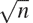)的增长阶数，另一种是具有`Θ(log n)`的“概率”算法。本节末尾的练习建议基于这些算法进行编程项目。

##### 寻找除数

自古以来，数学家们一直对素数问题着迷，许多人一直致力于确定测试数字是否为质数的方法。测试一个数是否为质数的一种方法是找到这个数的除数。以下程序找到给定数字`n`的最小整数除数(大于 1)。它通过以 2 开始的连续整数测试`n`是否可被整除的方式来直接进行。

```js
function smallest_divisor(n) {
    return find_divisor(n, 2);
}
function find_divisor(n, test_divisor) {
    return square(test_divisor) > n
           ? n
           : divides(test_divisor, n)
           ? test_divisor
           : find_divisor(n, test_divisor + 1);
}
function divides(a, b) {
    return b % a === 0;
}
```

我们可以通过以下方式测试一个数是否为质数：`n`是质数当且仅当`n`是其自身的最小除数。

```js
function is_prime(n) {
    return n === smallest_divisor(n);
}
```

`find_divisor`的结束测试基于这样一个事实，即如果`n`不是质数，它必须有一个小于或等于`√n`的除数。⁴²这意味着算法只需要测试 1 和`√n`之间的除数。因此，识别`n`为质数所需的步骤数量将具有`Θ(√n)`的增长阶数。

##### 费马测试

`Θ(log n)`素性测试基于数论中称为费马小定理的结果。⁴³

* * *

**费马小定理:** 如果`n`是一个质数，`a`是小于`n`的任意正整数，则`a`的`n`次幂与`n`模同余。

* * *

(如果两个数除以`n`的余数相同，则它们被称为`n`模同余。当一个数`a`除以`n`的余数也被称为`a`模`n`的余数，或者简称为`a`模`n`。)

如果`n`不是质数，那么一般来说，大多数小于`n`的数`a`都不满足上述关系。这导致了用于测试素性的以下算法：给定一个数`n`，选择一个小于`n`的随机数`a`，并计算*aⁿ*模`n`的余数。如果结果不等于`a`，那么`n`肯定不是质数。如果它等于`a`，那么`n`很可能是质数。现在选择另一个随机数`a`，并用相同的方法进行测试。如果它也满足方程，则我们可以更加确信`n`是质数。通过尝试更多的`a`值，我们可以增加对结果的信心。这个算法被称为费马测试。

为了实现费马测试，我们需要一个计算一个数的指数模另一个数的函数：

```js
function expmod(base, exp, m) {
    return exp === 0
           ? 1
           : is_even(exp)
           ? square(expmod(base, exp / 2, m)) % m
           : (base * expmod(base, exp - 1, m)) % m;
}
```

这与 1.2.4 节中的`fast_expt`函数非常相似。它使用连续平方，因此步骤数量随指数对数增长。⁴⁴

费马测试是通过随机选择一个介于 1 和`n-1`之间的数字`a`来执行的，并检查`a`的`n`次幂的模`n`的余数是否等于`a`。随机数`a`是使用原始函数`math_random`选择的，该函数返回小于 1 的非负数。因此，要获得 1 和`n-1`之间的随机数，我们将`math_random`的返回值乘以`n-1`，用原始函数`math_floor`向下舍入结果，然后加 1。

```js
function fermat_test(n) {
    function try_it(a) {
        return expmod(a, n, n) === a;
    }
    return try_it(1 + math_floor(math_random() * (n - 1)));
}
```

以下函数根据参数指定的次数运行测试。如果测试每次都成功，则其值为`true`，否则为`false`。

```js
function fast_is_prime(n, times) {
    return times === 0
           ? true
           : fermat_test(n)
           ? fast_is_prime(n, times - 1)
           : false;
}
```

##### 概率方法

费马测试在性质上与大多数熟悉的算法不同，大多数算法计算的答案是保证正确的。在这里，获得的答案只是可能正确。更准确地说，如果`n`曾经未通过费马测试，我们可以肯定`n`不是质数。但是，`n`通过测试的事实，虽然是一个极为强有力的指示，但仍不能保证`n`是质数。我们想说的是，对于任何数字`n`，如果我们进行足够多次测试并发现`n`总是通过测试，那么我们的素性测试中的错误概率可以尽可能小。

不幸的是，这个断言并不完全正确。确实存在一些可以欺骗费马测试的数字：不是质数但具有性质`aⁿ`对`n`取模等于`a`对`n`取模的数字`n`，其中所有整数`a < n`。这样的数字非常罕见，因此费马测试在实践中是相当可靠的。费马测试有一些无法被欺骗的变体。在这些测试中，与费马方法一样，通过选择一个随机整数`a < n`并检查依赖于`n`和`a`的某些条件来测试整数`n`的素性。（有关这种测试的示例，请参见练习 1.28。）另一方面，与费马测试相反，可以证明对于任何`n`，除非`n`是质数，否则大多数整数`a < n`都不满足条件。因此，如果`n`对某个随机选择的`a`通过了测试，那么`n`是质数的可能性甚至更大。如果`n`对两个随机选择的`a`通过了测试，那么`n`是质数的可能性超过 4 分之 3。通过使用更多和更多随机选择的`a`值运行测试，我们可以使错误的概率尽可能小。

对于可以证明错误几率变得任意小的测试的存在引起了对这种类型算法的兴趣，这种算法被称为*概率算法*。在这个领域有大量的研究活动，概率算法已经成功地应用到许多领域。

##### 练习 1.21

使用`smallest_divisor`函数找出以下数字的最小除数：199、1999、19999。

##### 练习 1.22

假设有一个没有参数的原始函数`get_time`，它返回自 1970 年 1 月 1 日星期四 UTC 时间 00:00:00 以来经过的毫秒数。以下`timed_prime_test`函数在调用整数 n 时打印 n 并检查 n 是否为质数。如果 n 是质数，则该函数打印三个星号，然后是执行测试所用的时间量。

```js
function timed_prime_test(n) { 
    display(n);
    return start_prime_test(n, get_time());
}
function start_prime_test(n, start_time) {
    return is_prime(n)
           ? report_prime(get_time() - start_time)
           : true;
}
function report_prime(elapsed_time) {
    display(" *** ");
    display(elapsed_time);
}
```

使用这个函数，编写一个名为`search_for_primes`的函数，它检查指定范围内连续奇数的素性。使用你的函数找到大于 1000 的三个最小素数；大于 10,000；大于 100,000；大于 1,000,000。注意测试每个素数所需的时间。由于测试算法的增长阶为Θ()，你应该期望在 10,000 左右的素数测试大约需要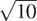倍于在 1000 左右的素数测试。你的计时数据是否支持这一点？100,000 和 1,000,000 的数据对的预测有多好的支持？你的结果是否符合程序在你的机器上运行时间与计算所需步骤数量成正比的概念？

##### 练习 1.23

本节开头显示的`smallest_divisor`函数进行了许多不必要的测试：在检查数字是否可被 2 整除后，没有必要检查它是否可被任何更大的偶数整除。这表明用于`test_divisor`的值不应该是 2, 3, 4, 5, 6, ...而应该是 2, 3, 5, 7, 9，为了实现这个改变，声明一个函数`next`，如果它的输入等于 2，则返回 3，否则返回它的输入加 2。修改`smallest_divisor`函数，使用`next(test_divisor)`代替`test_divisor + 1`。使用包含这个修改版本的`smallest_divisor`的`timed_prime_test`，对在练习 1.22 中找到的 12 个素数进行测试。由于这个修改减少了测试步骤的数量，你应该期望它运行大约快两倍。这个期望是否得到确认？如果没有，两个算法的速度比率是多少，你如何解释它与 2 不同的事实？

##### 练习 1.24

修改练习 1.22 的`timed_prime_test`函数，使用`fast_is_prime`（费马方法），并测试你在那个练习中找到的 12 个素数。由于费马测试具有`Θ(log n)`的增长，你会预期测试接近 1,000,000 的素数所需的时间与测试接近 1000 的素数相比如何？你的数据是否支持这一点？你能解释你发现的任何差异吗？

##### 练习 1.25

Alyssa P. Hacker 抱怨我们在编写`expmod`时做了很多额外的工作。她说，毕竟，既然我们已经知道如何计算指数，我们本来可以简单地写成

```js
function expmod(base, exp, m) {
    return fast_expt(base, exp) % m;
}
```

她是正确的吗？这个函数对我们的快速素数测试器是否有用？解释一下。

##### 练习 1.26

路易斯·里森纳在做练习 1.24 时遇到了很大的困难。他的`fast_is_prime`测试似乎比他的`is_prime`测试运行得更慢。路易斯叫他的朋友伊娃·卢·阿托过来帮忙。当他们检查路易斯的代码时，他们发现他已经重写了`expmod`函数，使用了显式乘法，而不是调用`square`：

```js
function expmod(base, exp, m) {
    return exp === 0
           ? 1
           : is_even(exp)
           ? (  expmod(base, exp / 2, m)
              * expmod(base, exp / 2, m)) % m
           : (base * expmod(base, exp - 1, m)) % m;
}
```

“我不明白那会有什么不同，”路易斯说。“我明白，”伊娃说。“通过那样写函数，你已经将`Θ(log n)`的过程转变为`Θ(n)`的过程。”解释一下。

##### 练习 1.27

证明脚注 45 中列出的卡迈克尔数确实愚弄了费马测试。也就是说，编写一个函数，它接受一个整数`n`，并测试对于每个`a < n`，`aⁿ`是否与`a`模`n`同余，并在给定的卡迈克尔数上尝试你的函数。

##### 练习 1.28

一个无法被愚弄的费马测试的变体被称为*米勒-拉宾测试*（Miller 1976; Rabin 1980）。这是从费马小定理的另一种形式开始的，该定理陈述了如果`n`是一个质数，`a`是小于`n`的任意正整数，则`a`的`(n - 1)`次方与`n`模同余于 1。通过米勒-拉宾测试来测试一个数`n`的素性，我们选择一个随机数`a < n`，并使用`expmod`函数将`a`的`(n - 1)`次方模`n`。然而，每当我们在`expmod`中执行平方步骤时，我们检查是否发现了“非平凡的模`n`的平方根”，即不等于 1 或`n - 1`的平方等于模`n`的 1 的数。可以证明，如果存在这样一个非平凡的模 1 的平方根，那么`n`不是质数。也可以证明，如果`n`是一个不是质数的奇数，那么至少有一半的数`a < n`，通过这种方式计算`a^(n–1)`将会显示出模`n`的非平凡的平方根。（这就是为什么米勒-拉宾测试无法被愚弄的原因。）修改`expmod`函数以便在发现非平凡的模 1 的平方根时发出信号，并使用这个来实现米勒-拉宾测试，方法类似于`fermat_test`。通过测试各种已知的质数和非质数来检查你的函数。提示：使`expmod`发出信号的一个方便的方法是让它返回 0。

## 1.3 用高阶函数制定抽象

我们已经看到，函数实际上是描述数字的复合操作的抽象，与特定数字无关。例如，当我们声明

```js
function cube(x) {
    return x * x * x;
}
```

我们不是在谈论特定数字的立方，而是在谈论获得任何数字的立方的方法。当然，我们可以不声明这个函数，总是写诸如

```js
3 * 3 * 3
x * x * x
y * y * y
```

并且从不明确提到`cube`。这将使我们处于严重的不利地位，迫使我们总是在语言中原语的特定操作级别上工作（在这种情况下是乘法），而不是在更高级别的操作上工作。我们的程序可以计算立方，但我们的语言缺乏表达立方概念的能力。我们应该从一个强大的编程语言中要求的一件事是，通过为常见模式分配名称来构建抽象的能力，然后直接使用这些抽象。函数提供了这种能力。这就是为什么除了最原始的编程语言之外，所有的编程语言都包括声明函数的机制。

然而，即使在数值处理中，如果我们被限制为参数必须是数字的函数，我们在创建抽象的能力上也会受到严重限制。通常相同的编程模式会与许多不同的函数一起使用。为了将这样的模式表达为概念，我们需要构建可以接受函数作为参数或返回函数作为值的函数。操作函数的函数称为*高阶函数*。本节展示了高阶函数如何作为强大的抽象机制，大大增加了我们语言的表达能力。

### 1.3.1 函数作为参数

考虑以下三个函数。第一个计算从`a`到`b`的整数的和：

```js
function sum_integers(a, b) {
    return a > b
           ? 0
           : a + sum_integers(a + 1, b);
}
```

第二个计算给定范围内整数的立方和：

```js
function sum_cubes(a, b) {
    return a > b
           ? 0
           : cube(a) + sum_cubes(a + 1, b);
}
```

第三个计算序列中一系列项的和

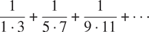

这收敛到`π/8`（非常慢）：⁴⁹

```js
function pi_sum(a, b) {
    return a > b
           ? 0
           : 1 / (a * (a + 2)) + pi_sum(a + 4, b);
}
```

这三个函数显然共享一个共同的基本模式。它们在大部分情况下是相同的，只是函数的名称不同，用于计算要添加的项的`a`的函数不同，以及提供`a`的下一个值的函数不同。我们可以通过在相同的模板中填充槽来生成每个函数：

```js
function name(a, b) {
    return a > b
           ? 0
           : term(a) + name(next(a), b);
}
```

这种常见模式的存在是有力的证据，表明有一个有用的抽象正在等待被提出。事实上，数学家很久以前就确定了*级数求和*的抽象，并发明了“Σ符号”，例如

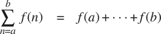

来表达这个概念。Σ符号的力量在于它允许数学家处理求和概念本身，而不仅仅是特定的和，例如，制定关于独立于被求和的特定系列的一般结果。

同样，作为程序设计师，我们希望我们的语言足够强大，以便我们可以编写一个表达求和概念本身而不仅仅是计算特定和的函数。在我们的函数语言中，我们可以很容易地采用上面显示的常见模板，并将“插槽”转换为参数：

```js
function sum(term, a, next, b) {
    return a > b
           ? 0
           : term(a) + sum(term, next(a), next, b);
}
```

注意，`sum`以它的参数下限和上限`a`和`b`以及函数`term`和`next`作为参数。我们可以像使用任何函数一样使用`sum`。例如，我们可以使用它（以及一个将其参数增加 1 的函数`inc`）来定义`sum_cubes`：

```js
function inc(n) {
    return n + 1;
}
function sum_cubes(a, b) {
    return sum(cube, a, inc, b);
}
```

使用这个，我们可以计算 1 到 10 的整数的立方和：

```js
sum_cubes(1, 10);
3025
```

借助一个计算项的恒等函数，我们可以定义`sum_integers`：

```js
function identity(x) {
    return x;
}

function sum_integers(a, b) {
    return sum(identity, a, inc, b);
}
```

然后我们可以计算 1 到 10 的整数的和：

```js
sum_integers(1, 10);
55
```

我们也可以用同样的方法定义`pi_sum`：⁵⁰

```js
function pi_sum(a, b) {
    function pi_term(x) {
        return 1 / (x * (x + 2));
    }
    function pi_next(x) {
        return x + 4;
    }
    return sum(pi_term, a, pi_next, b);
}
```

使用这些函数，我们可以计算`π`的近似值：

```js
8 * pi_sum(1, 1000);
3.139592655589783
```

一旦我们有了`sum`，我们就可以将其用作构建进一步概念的基础。例如，函数`f`在限制`a`和`b`之间的定积分可以使用以下公式在数值上近似：

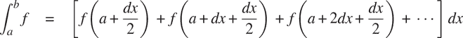

对于小的`dx`值。我们可以直接表示这个函数：

```js
function integral(f, a, b, dx) {
    function add_dx(x) {
        return x + dx;
    }
    return sum(f, a + dx / 2, add_dx, b) * dx;
}

integral(cube, 0, 1, 0.01);
0.24998750000000042

integral(cube, 0, 1, 0.001);
0.249999875000001
```

（函数`cube`在 0 和 1 之间的积分的确切值为 1/4。）

##### 练习 1.29

辛普森法则是一种比上面所示方法更准确的数值积分方法。使用辛普森法则，函数`f`在`a`和`b`之间的积分可以近似为

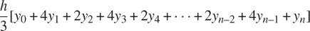

其中`h = (b - a)/n`，对于一些偶数`n`，`y[k] = f(a + kh)`。 （增加`n`会增加近似的准确性。）声明一个函数，它以`f, a, b`和`n`作为参数，并使用辛普森法则计算积分的值。使用你的函数来计算`cube`在 0 和 1 之间的积分（`n = 100`和`n = 1000`），并将结果与上面所示的`integral`函数的结果进行比较。

##### 练习 1.30

上面的`sum`函数生成一个线性递归。可以重写该函数，使求和以迭代方式执行。通过填写以下声明中的缺失表达式，展示如何做到这一点：

```js
function sum(term, a, next, b) {
    function iter(a, result) {
        return 〈??〉
               ? 〈??〉
               : iter(〈??〉, 〈??〉);
    }
    return iter(〈??〉, 〈??〉);
}
```

##### 练习 1.31

1.  a. `sum`函数只是许多类似抽象中最简单的一个。⁵¹编写一个名为`product`的类似函数，它返回给定范围内点的函数值的乘积。展示如何用`product`来定义`factorial`。还使用`product`来使用公式计算`π`的近似值⁵²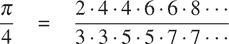

1.  b. 如果你的`product`函数生成一个递归过程，写一个生成迭代过程的函数。如果它生成一个迭代过程，写一个生成递归过程的函数。

##### 练习 1.32

1.  a. 证明`sum`和`product`（练习 1.31）都是更一般的称为`accumulate`的特殊情况，它使用一些一般的累积函数来组合一系列项：

    ```js
    accumulate(combiner, null_value, term, a, next, b);
    ```

    函数`accumulate`接受与`sum`和`product`相同的项和范围规范，以及一个`combiner`函数（两个参数）作为参数，该函数指定如何将当前项与前面项的累积组合在一起，以及一个`null_value`，用于指定项用完时要使用的基本值。编写`accumulate`并展示如何将`sum`和`product`都声明为对`accumulate`的简单调用。

    b. 如果您的`accumulate`函数生成递归过程，请编写一个生成迭代过程的函数。如果它生成迭代过程，请编写一个生成递归过程的函数。

##### 练习 1.33

您可以通过引入对要组合的项进行*筛选*的概念来获得`accumulate`的更通用版本（练习 1.32）。也就是说，仅组合满足指定条件的范围中的值导出的那些项。生成的`filtered_accumulate`抽象接受与 accumulate 相同的参数，以及指定筛选器的一个参数的附加谓词。编写`filtered_accumulate`作为一个函数。展示如何使用`filtered_accumulate`来表达以下内容：

1.  a. 在区间`a`到`b`中素数的平方的和（假设您已经编写了`is_prime`谓词）

1.  b. 所有小于`n`的正整数的乘积，这些整数与`n`互质（即，所有正整数`i < n`，使得`GCD(i, n) = 1`）。

### 1.3.2 使用 Lambda 表达式构建函数

在使用`sum`时，似乎非常笨拙地声明诸如`pi_term`和`pi_next`之类的微不足道的函数，以便我们可以将它们用作高阶函数的参数。与其声明`pi_next`和`pi_term`，不如直接指定“返回其输入加 4 的函数”和“返回其输入的倒数乘以其输入加 2 的函数”更方便。我们可以通过引入*lambda 表达式*作为一种用于创建函数的语法形式来实现这一点。使用 lambda 表达式，我们可以描述我们想要的内容

```js
x => x + 4
```

和

```js
x => 1 / (x * (x + 2))
```

然后我们可以表达我们的`pi_sum`函数，而不声明任何辅助函数：

```js
function pi_sum(a, b) {
    return sum(x => 1 / (x * (x + 2)),
               a,
               x => x + 4,
               b);
}
```

再次使用 lambda 表达式，我们可以编写`integral`函数，而无需声明辅助函数`add_dx`：

```js
function integral(f, a, b, dx) {
    return sum(f,
               a + dx / 2,
               x => x + dx,
               b)
           * 
           dx;
}
```

通常，lambda 表达式用于创建函数，方式与函数声明相同，只是没有为函数指定名称，并且省略了`return`关键字和大括号（如果只有一个参数，则可以省略参数列表周围的括号，就像我们看到的例子一样）。⁵³

```js
(parameters) => expression
```

生成的函数与使用函数声明语句创建的函数一样。唯一的区别是它没有与环境中的任何名称关联。我们认为

```js
function plus4(x) {
    return x + 4;
}
```

等同于⁵⁴

```js
const plus4 = x => x + 4;
```

我们可以按照以下方式阅读 lambda 表达式：

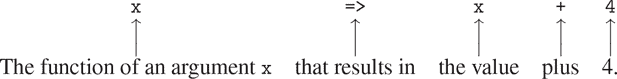

像任何具有函数作为其值的表达式一样，lambda 表达式可以用作应用程序中的函数表达式，例如

```js
((x, y, z) => x + y + square(z))(1, 2, 3);
12
```

或者，更一般地，在我们通常使用函数名称的任何上下文中。⁵⁵ 请注意，`=>`的优先级低于函数应用，因此这里括号是必要的。

##### 使用`const`创建本地名称

lambda 表达式的另一个用途是创建本地名称。我们在函数中经常需要本地名称，而不仅仅是已绑定为参数的名称。例如，假设我们希望计算函数

```js
f (x, y) = x(1 + xy)² + y(1 – y) + (1 + xy)(1 – y)
```

我们也可以表达为

```js
a = 1 + xy

b = 1 – y

f (x, y) = xa² + yb + ab
```

在编写一个计算`f`的函数时，我们希望将局部名称不仅包括`x`和`y`，还包括像`a`和`b`这样的中间量的名称。实现这一点的一种方法是使用辅助函数来绑定局部名称：

```js
function f(x, y) {
    function f_helper(a, b) {
        return x * square(a) + y * b + a * b;
    }
    return f_helper(1 + x * y, 1 - y);
}
```

当然，我们可以使用 lambda 表达式来指定一个匿名函数来绑定我们的局部名称。然后函数体变成了对该函数的单个调用：

```js
function f_2(x, y) {
    return ( (a, b) => x * square(a) + y * b + a * b
           )(1 + x * y, 1 - y);
}
```

通过在函数体内使用常量声明，更方便地声明局部名称的一种方法是使用常量声明。使用`const`，函数可以写成

```js
function f_3(x, y) {
    const a = 1 + x * y; 
    const b = 1 - y;
    return x * square(a) + y * b + a * b;
}
```

在块内部使用`const`声明的名称将其所在的最近块的主体作为其作用域。⁵⁶^,⁵⁷

##### 条件语句

我们已经看到，在函数声明中声明局部名称通常是有用的。当函数变得很大时，我们应该尽可能地保持名称的范围狭窄。例如考虑练习 1.26 中的`expmod`。

```js
function expmod(base, exp, m) {
    return exp === 0
           ? 1
           : is_even(exp)
           ? ( expmod(base, exp / 2, m)
              * expmod(base, exp / 2, m)) % m
           : (base * expmod(base, exp - 1, m)) % m;
}
```

这个函数是不必要的低效，因为它包含了两个相同的调用：

```js
expmod(base, exp / 2, m);
```

虽然在这个例子中可以很容易地使用`square`函数来修复这个问题，但在一般情况下并不容易。如果不使用`square`，我们可能会尝试引入一个表达式的局部名称，如下所示：

```js
function expmod(base, exp, m) {
    const half_exp = expmod(base, exp / 2, m);
    return exp === 0
           ? 1
           : is_even(exp)
           ? (half_exp * half_exp) % m
           : (base * expmod(base, exp - 1, m)) % m;
}
```

这将使函数不仅效率低下，而且实际上是非终止的！问题在于常量声明出现在条件表达式之外，这意味着即使满足基本情况`exp === 0`，它也会被执行。为了避免这种情况，我们提供了*条件语句*，并允许返回语句出现在语句的分支中。使用条件语句，我们可以将函数`expmod`写成如下形式：

```js
function expmod(base, exp, m) {
    if (exp === 0) {
        return 1;
    } else {
        if (is_even(exp)) {
            const half_exp = expmod(base, exp / 2, m);
            return (half_exp * half_exp) % m;
        } else {
            return (base * expmod(base, exp - 1, m)) % m;
        }
    }
}
```

条件语句的一般形式是

```js
if (predicate) { consequent-statements } else { alternative-statements }
```

对于条件表达式，解释器首先求值`predicate`。如果它求值为`true`，解释器按顺序求值`consequent-statements`，如果它求值为`false`，解释器按顺序求值`alternative-statements`。返回语句的求值从周围的函数返回，忽略返回语句后的任何语句和条件语句后的任何语句。请注意，任何在任一部分中发生的常量声明都是该部分的局部声明，因为每个部分都被括号括起来，因此形成自己的块。

##### 练习 1.34

假设我们声明

```js
function f(g) {
    return g(2);
}
```

然后我们有

```js
f(square);
`4`

f(z => z * (z + 1));
`6`
```

如果我们（刻意地）要求解释器求值应用`f(f)`会发生什么？解释。

### 1.3.3 函数作为一般方法

我们在 1.1.4 节介绍了复合函数作为一种抽象数值操作模式的机制，使其独立于特定的数字。通过高阶函数，比如 1.3.1 节的`integral`函数，我们开始看到一种更强大的抽象：用于表达计算的一般方法，独立于特定的函数。在本节中，我们将讨论两个更复杂的例子——查找函数的零点和不动点的一般方法，并展示这些方法如何直接表达为函数。

##### 通过半区间法找到方程的根

*半区间方法*是一种简单但强大的技术，用于找到方程`f(x)=0`的根，其中`f`是一个连续函数。其思想是，如果我们给定了`f(a)<0<f(b)`的点`a`和`b`，那么`f`必须至少在`a`和`b`之间有一个零点。为了找到零点，让`x`为`a`和`b`的平均值，并计算`f(x)`。如果`f(x)>0`，则`f`必须在`a`和`x`之间有一个零点。如果`f(x)<0`，则`f`必须在`x`和`b`之间有一个零点。以此类推，我们可以确定`f`必须有一个零点的更小的区间。当我们达到一个足够小的区间时，过程停止。由于不确定性的区间在过程的每一步都减半，所以所需的最大步数增长为`Θ(log(L/T))`，其中`L`是原始区间的长度，`T`是误差容限（即我们将考虑“足够小”的区间的大小）。以下是实现这种策略的函数：

```js
function search(f, neg_point, pos_point) {
    const midpoint = average(neg_point, pos_point);
    if (close_enough(neg_point, pos_point)) {
        return midpoint;
    } else {
        const test_value = f(midpoint);
        return positive(test_value)
               ? search(f, neg_point, midpoint)
               : negative(test_value)
               ? search(f, midpoint, pos_point)
               : midpoint;
    }
}
```

我们假设我们最初给定了函数`f`以及其值为负和正的点。我们首先计算两个给定点的中点。接下来，我们检查给定的区间是否足够小，如果是，我们就简单地返回中点作为我们的答案。否则，我们计算中点处`f`的值作为测试值。如果测试值为正，则我们继续从原始负点到中点的新区间进行该过程。如果测试值为负，则我们继续从中点到正点的区间。最后，有可能测试值为 0，这种情况下中点本身就是我们正在寻找的根。为了测试端点是否“足够接近”，我们可以使用类似于 1.1.7 节中用于计算平方根的函数：

```js
function close_enough(x, y) {
    return abs(x - y) < 0.001;
}
```

`search`函数直接使用起来很麻烦，因为我们可能会无意中给出`f`的值没有所需符号的点，这样我们就会得到错误的答案。相反，我们将通过以下函数使用`search`，该函数检查哪个端点具有负函数值，哪个具有正函数值，并相应地调用`search`函数。如果函数在两个给定点上具有相同的符号，则无法使用半区间方法，在这种情况下，函数会发出错误信号。

```js
function half_interval_method(f, a, b) {
    const a_value = f(a);
    const b_value = f(b);
    return negative(a_value) && positive(b_value)
           ? search(f, a, b)
           : negative(b_value) && positive(a_value)
           ? search(f, b, a)
           : error("values are not of opposite sign");
}
```

以下示例使用半区间方法在 2 和 4 之间近似`π`作为`sinx=0`的根：

```js
half_interval_method(math_sin, 2, 4);
3.14111328125
```

以下是另一个例子，使用半区间方法在 1 和 2 之间搜索方程`x³ - 2x - 3 = 0`的根：

```js
half_interval_method(x => x * x * x - 2 * x - 3, 1, 2);
1.89306640625
```

##### 查找函数的固定点

如果`x`满足方程`f(x)=x`，则称数字`x`为函数`f`的*固定点*。对于一些函数`f`，我们可以通过从初始猜测开始并重复应用`f`来找到一个固定点，

```js
f(x), f(f(x)), f(f(f(x))), ...
```

直到值变化不是很大为止。利用这个想法，我们可以设计一个函数`fixed_point`，它以函数和初始猜测为输入，并产生函数的一个近似固定点。我们重复应用该函数，直到找到两个连续值的差小于某个预定的容差：

```js
const tolerance = 0.00001;
function fixed_point(f, first_guess) {
    function close_enough(x, y) {
        return abs(x - y) < tolerance;
    }
    function try_with(guess) {
        const next = f(guess);
        return close_enough(guess, next)
               ? next
               : try_with(next);
    }
    return try_with(first_guess);
}
```

例如，我们可以使用这种方法来近似余弦函数的固定点，从 1 开始作为初始近似值：

```js
fixed_point(math_cos, 1);
0.7390822985224023
```

同样，我们可以找到方程`y=siny+cosy`的解：

```js
fixed_point(y => math_sin(y) + math_cos(y), 1);
1.2587315962971173
```

固定点过程让人想起了我们在 1.1.7 节中用于找平方根的过程。两者都基于反复改进猜测的想法，直到结果满足某些标准。实际上，我们可以很容易地将平方根计算公式化为固定点搜索。计算某个数`x`的平方根需要找到一个`y`，使得`y² = x`。将这个方程转化为等价形式`y = x / y`，我们意识到我们正在寻找函数⁶¹ `y = x/y`的一个固定点，因此我们可以尝试计算平方根

```js
function sqrt(x) {
    return fixed_point(y => x / y, 1);
}
```

不幸的是，这种固定点搜索不会收敛。考虑一个初始猜测`y[1]`。下一个猜测是`y[2] = x/y[1]`，下一个猜测是`y[3] = x/y[2] = x/(x/y[1]) = y[1]`。这导致了一个无限循环，其中两个猜测`y[1]`和`y[2]`一遍又一遍地重复，围绕答案振荡。

控制这种振荡的一种方法是防止猜测变化太大。由于答案总是在我们的猜测`y`和`x / y`之间，我们可以做一个新的猜测，这个猜测不像`x / y`那么远离`y`，通过平均`y`和`x / y`，这样在`y`之后的下一个猜测就是`1/2 (y + x / y)`而不是`x / y`。这种猜测序列的过程只是寻找`y -> 1/2 (y + x / y)`的固定点的过程。

```js
function sqrt(x) {
    return fixed_point(y => average(y, x / y), 1);
}
```

（注意`y = 1/2 (y + x / y)`是方程`y = x / y`的简单变换；为了推导它，将`y`添加到方程的两边，然后除以 2。）

有了这个修改，平方根函数就可以工作了。实际上，如果我们展开定义，我们可以看到这里生成的平方根近似序列与我们原来的 1.1.7 节平方根函数生成的序列完全相同。这种平均连分数的方法通常有助于固定点搜索的收敛。

##### 练习 1.35

证明黄金分割比`ϕ`（1.2.2 节）是变换`x -> 1 + 1/x`的一个固定点，并利用这一事实通过`fixed_point`函数计算`ϕ`。

##### 练习 1.36

修改`fixed_point`，以便它打印生成的近似值序列，使用练习 1.22 中显示的原始函数`display`。然后通过找到`xˣ = 1000`的固定点来找到解，即`x -> log(1000)/ log(x)`。 （使用计算自然对数的原始函数`math_log`。）比较使用和不使用平均阻尼所需的步骤数。（请注意，您不能从 1 开始`fixed_point`，因为这将导致除以`log(1) = 0`。）

##### 练习 1.37

无限连分数是一个形式的表达式

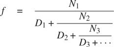

例如，可以证明，所有`N[i]`和`D[i]`都等于 1 的无限连分数展开产生`1/ϕ`，其中`ϕ`是黄金分割比（在 1.2.2 节中描述）。近似无限连分数的一种方法是在给定项数后截断展开。这种截断——所谓的`k`项有限连分数——具有形式

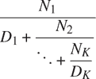

1.  a.假设`n`和`d`是一个参数（项索引`i`）的函数，返回连分数项的`N[i]`和`D[i]`。声明一个函数`cont_frac`，使得求值`cont_frac(n, d, k)`计算`k`项有限连分数的值。通过近似 1`ϕ`检查您的函数

    ```js
    cont_frac(i => 1, i => 1, k);
    ```

    对于连续的`k`值。为了获得精确到小数点后 4 位的近似值，您需要使`k`有多大？

1.  b. 如果您的`cont_frac`函数生成递归过程，请编写一个生成迭代过程的函数。如果它生成迭代过程，请编写一个生成递归过程的函数。

##### 练习 1.38

1737 年，瑞士数学家 Leonhard Euler 发表了一篇题为*De Fractionibus Continuis*的备忘录，其中包括了` e  - 2`的一个连分数展开，其中`e`是自然对数的底数。在这个分数中，`N[i]`都是 1，`D[i]`依次为 1、2、1、1、4、1、1、6、1、1、8，编写一个程序，使用练习 1.37 中的`cont_frac`函数来根据 Euler 的展开来近似`e`。

##### 练习 1.39

1770 年，德国数学家 J.H. Lambert 发表了正切函数的连分数表示：

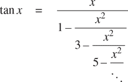

其中`x`以弧度为单位。声明一个函数`tan_cf(x, k)`，根据 Lambert 的公式计算正切函数的近似值。与练习 1.37 一样，`k`指定要计算的项数。

### 1.3.4 作为返回值的函数

上述例子展示了将函数作为参数传递的能力如何显著增强了我们编程语言的表达能力。通过创建其返回值本身是函数的函数，我们可以实现更多的表达能力。

我们可以通过再次查看第 1.3.3 节末尾描述的不动点示例来说明这个想法。我们将一个新版本的平方根函数表述为一个不动点搜索，从观察到`√x`是函数`y -> x / y`的不动点开始。然后我们使用平均阻尼使近似值收敛。平均阻尼本身是一个有用的通用技术。也就是说，给定一个函数`f`，我们考虑其在`x`处的值等于`x`和`f(x)`的平均值的函数。

我们可以通过以下函数表达平均阻尼的想法：

```js
function average_damp(f) {
    return x => average(x, f(x));
}
```

函数`average_damp`以函数`f`作为参数，并返回一个函数（由 lambda 表达式生成），当应用于数字`x`时，产生`x`和`f(x)`的平均值。例如，将`average_damp`应用于`square`函数会产生一个函数，其在某个数字`x`处的值是`x`和`x`²的平均值。将这个结果函数应用于 10 会返回 10 和 100 的平均值，即 55。

```js
average_damp(square)(10);
55
```

使用`average_damp`，我们可以重新表述平方根函数如下：

```js
function sqrt(x) {
    return fixed_point(average_damp(y => x / y), 1);
}
```

注意这种表述如何明确了方法中的三个思想：不动点搜索、平均阻尼和函数`y = x/y`。比较这种平方根方法的表述与第 1.1.7 节中给出的原始版本是有益的。请记住，这些函数表达了相同的过程，注意当我们用这些抽象的术语表达过程时，这个想法变得更加清晰。一般来说，有许多方法可以将一个过程表述为一个函数。有经验的程序员知道如何选择特别明晰的过程表述，并且在有用的情况下，将过程的元素公开为可以在其他应用中重复使用的单独实体。作为重用的一个简单例子，注意`x`的立方根是函数`y = x/y²`的不动点，因此我们可以立即将我们的平方根函数推广为一个提取立方根的函数。

```js
function cube_root(x) {
   return fixed_point(average_damp(y => x / square(y)), 1);
}
```

##### 牛顿法

当我们首次介绍平方根函数时，在第 1.1.7 节中，我们提到这是*牛顿法*的一个特例。如果`x -> g(x)`是一个可微函数，那么方程`g(x) = 0`的解是函数`x -> f (x)`的不动点，其中

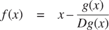

和`Dg(x)`是在`x`处求导的`g`的导数。牛顿法是使用我们上面看到的固定点方法来近似方程的解，通过找到函数`f`的固定点。⁶⁴ 对于许多函数`g`和对于足够好的`x`的初始猜测，牛顿法收敛得非常快，以便解决`g(x) = 0`。⁶⁵

为了将牛顿法实现为一个函数，我们必须首先表达导数的概念。注意，“导数”和平均阻尼一样，是将一个函数转换为另一个函数的东西。例如，函数`x -> x³`的导数是函数`x ->  3x²`。一般来说，如果`g`是一个函数，`dx`是一个小数，那么`g`的导数`Dg`是一个函数，其在任何数`x`处的值（在小`dx`的极限情况下）由

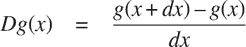

因此，我们可以将导数的概念（取`dx`为 0.00001）表示为函数

```js
function deriv(g) {
    return x => (g(x + dx) - g(x)) / dx;
}
```

以及声明

```js
const dx = 0.00001;
```

像`average_damp`一样，`deriv`是一个以函数作为参数并返回函数作为值的函数。例如，要近似计算`x`³在 5 处的导数（其精确值为 75），我们可以计算

```js
function cube(x) { return x * x * x; }

deriv(cube)(5);
75.00014999664018
```

借助于`deriv`，我们可以将牛顿法表达为一个固定点过程：

```js
function newton_transform(g) {
    return x => x - g(x) / deriv(g)(x);
}
function newtons_method(g, guess) {
    return fixed_point(newton_transform(g), guess);
}
```

`newton_transform`函数表达了本节开头的公式，`newtons_method`可以很容易地根据这个定义。它的参数是一个计算我们想要找到零点的函数的函数，以及一个初始猜测。例如，要找到`x`的平方根，我们可以使用牛顿法来找到函数`y -> y² – x`的零点，从初始猜测为 1 开始。⁶⁶ 这提供了平方根函数的另一种形式：

```js
function sqrt(x) {
    return newtons_method(y => square(y) - x, 1);
}
```

##### 抽象和一级函数

我们已经看到了两种将平方根计算表达为更一般方法的实例，一种是作为固定点搜索，另一种是使用牛顿法。由于牛顿法本身被表达为一个固定点过程，我们实际上看到了两种计算平方根作为固定点的方法。每种方法都以一个函数开始，并找到函数的某个变换的固定点。我们可以将这个一般的想法本身表达为一个函数：

```js
function fixed_point_of_transform(g, transform, guess) {
    return fixed_point(transform(g), guess);
}
```

这个非常一般的函数以一个计算某个函数的函数`g`，一个转换`g`的函数和一个初始猜测作为参数。返回的结果是转换函数的一个固定点。

使用这种抽象，我们可以将本节中第一个平方根计算（其中我们寻找`y -> x / y`的平均阻尼版本的固定点）重新表述为这种一般方法的一个实例：

```js
function sqrt(x) {
    return fixed_point_of_transform(
               y => x / y,
               average_damp,
               1);
}
```

同样，我们可以将本节中第二个平方根计算（牛顿法的一个实例，找到`y -> y² – x`的牛顿变换的固定点）表达为

```js
function sqrt(x) {
    return fixed_point_of_transform(
               y => square(y) - x,
               newton_transform,
               1);
}
```

我们在 1.3 节开始时观察到，复合函数是一个关键的抽象机制，因为它们允许我们将计算的一般方法表达为编程语言中的显式元素。现在我们已经看到了高阶函数如何允许我们操纵这些一般方法以创建进一步的抽象。

作为程序员，我们应该警惕机会，识别程序中的基本抽象，并在其上构建和泛化，以创建更强大的抽象。这并不是说我们应该总是以最抽象的方式编写程序；专业程序员知道如何选择适合其任务的抽象级别。但是，重要的是能够以这些抽象的方式思考，以便我们可以准备在新的上下文中应用它们。高阶函数的重要性在于它们使我们能够将这些抽象明确地表示为我们编程语言中的元素，以便它们可以像其他计算元素一样被处理。

一般来说，编程语言对计算元素的操作方式施加了限制。具有最少限制的元素被称为*第一类*状态。第一类元素的一些“权利和特权”是：

+   它们可以使用名称来引用。

+   它们可以作为函数的参数传递。

+   它们可以作为函数的结果返回。

+   它们可以包含在数据结构中。

JavaScript，像其他高级编程语言一样，授予函数完全的第一类状态。这对于高效实现提出了挑战，但由此产生的表达能力的增强是巨大的。

##### 练习 1.40

声明一个函数`cubic`，它可以与`newtons_method`函数一起使用，形式如下：

```js
newtons_method(cubic(a, b, c), 1)
```

来近似三次方程`x³+ax²+bx+c`的零点。

##### 练习 1.41

声明一个函数`double`，它以一个参数的函数作为参数，并返回一个应用原始函数两次的函数。例如，如果`inc`是一个将其参数加 1 的函数，则`double(inc)`应该是一个将其参数加 2 的函数。通过

```js
double(double(double))(inc)(5);
```

##### 练习 1.42

设`f`和`g`是两个一元函数。`g`之后`f`的*组合*被定义为函数`x -> f (g(x)`）。声明一个实现组合的函数`compose`。例如，如果`inc`是一个将其参数加 1 的函数，

```js
compose(square, inc)(6);
49
```

##### 练习 1.43

如果`f`是一个数值函数，`n`是一个正整数，那么我们可以形成`f`的`n`次重复应用，它被定义为其在`x`处的值是`f(f(...(f(x))...))`。例如，如果`f`是函数`x -> x + 1`，那么`f`的`n`次重复应用是函数`x -> x + n`。如果`f`是平方数的操作，那么`f`的`n`次重复应用是将其参数提高到`2ⁿ`次幂的函数。编写一个函数，它以计算`f`的函数和一个正整数`n`作为输入，并返回计算`f`的`n`次重复应用的函数。您的函数应该能够像下面这样使用：

```js
repeated(square, 2)(5);
625
```

提示：您可能会发现使用练习 1.42 中的`compose`很方便。

##### 练习 1.44

平滑函数的概念是信号处理中的重要概念。如果`f`是一个函数，`dx`是一个小数，那么`f`的平滑版本是一个函数，其在点`x`的值是`f(x-dx)`、`f(x)`和`f(x+dx)`的平均值。编写一个函数`smooth`，它以计算`f`的函数作为输入，并返回一个计算平滑`f`的函数。有时重复平滑一个函数（即平滑平滑的函数，依此类推）是有价值的，以获得`n`次平滑函数。展示如何使用练习 1.43 中的`smooth`和`repeated`生成任何给定函数的`n`次平滑函数。

##### 练习 1.45

在 1.3.3 节中，我们看到通过天真地寻找`y -> x / y`的不动点来计算平方根并不收敛，这可以通过平均阻尼来修复。同样的方法也适用于寻找立方根，作为平均阻尼`y -> x / y²`的不动点。不幸的是，这个过程对于四次方根并不适用——单一的平均阻尼不足以使`y -> x / y³`的不动点搜索收敛。另一方面，如果我们进行两次平均阻尼（即使用`y -> x / y³`的平均阻尼的平均阻尼），不动点搜索就会收敛。进行一些实验，以确定计算`n`次方根所需的平均阻尼次数，作为基于`y -> x/y^(n–1)`的重复平均阻尼的不动点搜索。使用这个来实现一个简单的函数，使用`fixed_point`、`average_damp`和练习 1.43 的`repeated`函数来计算`n`次方根。假设你需要的任何算术运算都可以作为原语使用。

##### 练习 1.46

本章描述的几种数值方法都是极其一般的计算策略*迭代改进*的实例。迭代改进说，为了计算某事物，我们从一个初始猜测开始，测试猜测是否足够好，否则改进猜测并继续使用改进后的猜测作为新的猜测。编写一个函数`iterative_improve`，它接受两个函数作为参数：一个用于判断猜测是否足够好的方法，一个用于改进猜测的方法。函数`iterative_improve`应该返回一个函数作为其值，该函数接受一个猜测作为参数，并持续改进猜测，直到猜测足够好为止。以`iterative_improve`的术语重写 1.1.7 节的`sqrt`函数和 1.3.3 节的`fixed_point`函数。
