# 二、使用数据构建抽象

> 原文：[2 Building Abstractions with Data](https://sourceacademy.org/sicpjs/2)
> 
> 译者：[飞龙](https://github.com/wizardforcel)
> 
> 协议：[CC BY-NC-SA 4.0](https://creativecommons.org/licenses/by-nc-sa/4.0/)

> 我们现在来到数学抽象的决定性步骤：我们忘记符号代表什么。...[数学家]不需要闲着；他可以用这些符号进行许多操作，而无需看它们所代表的东西。
> 
> ——赫尔曼·维尔，《数学思维方式》

在第 1 章，我们集中讨论了计算过程和函数在程序设计中的作用。我们看到了如何使用原始数据（数字）和原始操作（算术操作），如何通过组合、条件语句和参数的使用来组合函数以形成复合函数，以及如何通过使用函数声明来抽象过程。我们看到函数可以被看作是一个过程的局部演变的模式，并且我们对一些常见的过程模式进行了分类、推理和简单的算法分析，这些过程模式体现在函数中。我们还看到，高阶函数通过使我们能够操纵，从而能够根据一般的计算方法进行推理，增强了我们语言的能力。这正是编程的本质的很大一部分。

在本章中，我们将研究更复杂的数据。第 1 章中的所有函数都是针对简单的数值数据进行操作，而简单的数据对于我们希望使用计算解决的许多问题是不够的。程序通常被设计来模拟复杂的现象，往往必须构建具有多个部分的计算对象，以模拟具有多个方面的现实世界现象。因此，虽然我们在第 1 章的重点是通过组合函数来构建抽象函数，但在本章中，我们转向编程语言的另一个关键方面：它提供了一种通过组合数据对象来构建*复合数据*的手段。

为什么我们希望在编程语言中使用复合数据？出于与希望使用复合函数相同的原因：提高我们设计程序的概念水平，增加设计的模块化，并增强我们语言的表达能力。正如声明函数的能力使我们能够处理比语言的原始操作更高概念水平的过程一样，构建复合数据对象的能力使我们能够处理比语言的原始数据对象更高概念水平的数据。

考虑设计一个系统来执行有理数的算术运算的任务。我们可以想象一个操作`add_rat`，它接受两个有理数并产生它们的和。就简单数据而言，有理数可以被看作是两个整数：一个分子和一个分母。因此，我们可以设计一个程序，其中每个有理数将由两个整数（一个分子和一个分母）表示，并且`add_rat`将由两个函数实现（一个产生和的分子，一个产生分母）。但这将是笨拙的，因为我们将需要明确地跟踪哪个分子对应哪个分母。在一个旨在对许多有理数执行许多操作的系统中，这些簿记细节将大大地使程序混乱，更不用说它们对我们的思维会产生什么影响了。如果我们能够“粘合”分子和分母以形成一对——一个*复合数据对象*，那将会好得多，这样我们的程序就可以以一种一致的方式来操作它，这种方式将有助于将有理数视为一个单一的概念单位。

复合数据的使用还使我们能够增加程序的模块化。如果我们可以直接将有理数作为对象进行操作，那么我们就可以将处理有理数本身的程序部分与有理数如何表示为整数对的细节分开。隔离处理数据对象如何表示的程序部分与处理数据对象如何使用的程序部分是一种称为*数据抽象*的强大设计方法。我们将看到数据抽象如何使程序更容易设计、维护和修改。

复合数据的使用实际上增加了我们编程语言的表达能力。考虑形成“线性组合”`ax + by`的想法。我们可能希望编写一个函数，接受`a`、`b`、`x`和`y`作为参数，并返回`ax + by`的值。如果参数是数字，这没有困难，因为我们可以轻松地声明函数。

```js
function linear_combination(a, b, x, y) {
    return a * x + b * y;
}
```

但是，假设我们不仅关心数字。假设我们希望描述一个过程，只要定义了加法和乘法，就可以形成线性组合——对于有理数、复数、多项式或其他任何东西。我们可以将这表达为以下形式的函数。

```js
function linear_combination(a, b, x, y) {
    return add(mul(a, x), mul(b, y));
}
```

`add`和`mul`不是原始函数`+`和`*`，而是更复杂的东西，它们将根据我们传递的参数`a`、`b`、`x`和`y`执行适当的操作。关键是`linear_combination`唯一需要知道的是函数`add`和`mul`将执行适当的操作。从`linear_combination`函数的角度来看，`a`、`b`、`x`和`y`是什么并不重要，甚至更不重要的是它们可能如何以更原始的数据形式表示。这个例子也说明了为什么我们的编程语言提供直接操作复合对象的能力是重要的：如果没有这一点，`linear_combination`这样的函数就无法将其参数传递给`add`和`mul`，而不必知道它们的详细结构。

我们通过实现上面提到的有理数算术系统来开始本章。这将为我们讨论复合数据和数据抽象提供背景。与复合函数一样，需要解决的主要问题是抽象作为一种处理复杂性的技术，我们将看到数据抽象如何使我们能够在程序的不同部分之间建立适当的*抽象屏障*。

我们将看到形成复合数据的关键在于编程语言应该提供某种“粘合剂”，使得数据对象可以组合成更复杂的数据对象。有许多可能的粘合剂。事实上，我们将发现如何使用没有特殊“数据”操作的函数来形成复合数据。这将进一步模糊“函数”和“数据”的区别，这在第 1 章末尾已经变得模糊。我们还将探讨一些表示序列和树的常规技术。处理复合数据的一个关键思想是*闭包*的概念——我们用于组合数据对象的粘合剂应该允许我们组合不仅是原始数据对象，还有复合数据对象。另一个关键思想是复合数据对象可以作为*常规接口*，以混合和匹配的方式组合程序模块。我们通过介绍一个利用闭包的简单图形语言来说明这些想法。

然后，我们将通过引入*符号表达式*来增强我们语言的表现力——数据的基本部分可以是任意符号，而不仅仅是数字。我们探索表示对象集的各种替代方案。我们将发现，就像给定的数值函数可以通过许多不同的计算过程来计算一样，给定数据结构可以用更简单的对象来表示的方式有很多种，表示的选择对操纵数据的过程的时间和空间要求有重要影响。我们将在符号微分、集合表示和信息编码的背景下研究这些想法。接下来，我们将解决处理可能由程序的不同部分以不同方式表示的数据的问题。这导致需要实现*通用操作*，这些操作必须处理许多不同类型的数据。在存在通用操作的情况下保持模块化需要比仅使用简单数据抽象建立更强大的抽象屏障。特别是，我们引入*数据导向编程*作为一种技术，允许单独设计数据表示，然后*累加*（即不修改）组合这些表示。为了说明这种系统设计方法的强大之处，我们通过将所学应用于在多项式上执行符号算术的包的实现来结束本章，其中多项式的系数可以是整数、有理数、复数，甚至其他多项式。

## 2.1 数据抽象简介

在 1.1.8 节中，我们注意到一个作为创建更复杂函数的元素使用的函数不仅可以被视为一组特定操作，还可以被视为一个函数抽象。也就是说，可以抑制函数的实现细节，并且可以用具有相同整体行为的任何其他函数来替换特定的函数本身。换句话说，我们可以进行一个抽象，将函数的使用方式与如何使用更基本的函数来实现函数的细节分离。复合数据的类似概念称为*数据抽象*。数据抽象是一种方法论，使我们能够将复合数据对象的使用方式与它是如何由更基本的数据对象构造出来的细节隔离开来。

数据抽象的基本思想是构造使用复合数据对象的程序，使其操作“抽象数据”。也就是说，我们的程序应该以一种不假设关于数据的任何信息的方式来使用数据，除了执行手头的任务所严格需要的信息。与此同时，“具体”数据表示是独立于使用数据的程序定义的。我们系统的这两部分之间的接口将是一组函数，称为*选择器*和*构造器*，它们以具体表示为基础实现抽象数据。为了说明这种技术，我们将考虑如何设计一组用于操作有理数的函数。

### 2.1.1 示例：有理数的算术运算

假设我们想要对有理数进行算术运算。我们希望能够对它们进行加法、减法、乘法和除法，并测试两个有理数是否相等。

让我们首先假设我们已经有一种方法，可以从分子和分母构造一个有理数。我们还假设，给定一个有理数，我们有一种方法来提取（或选择）它的分子和分母。让我们进一步假设构造器和选择器作为函数是可用的：

+   `make_rat(n, d)`返回其分子为整数`n`，分母为整数`d`的有理数。

+   `numer(x)`返回有理数`x`的分子。

+   `denom(x)`返回有理数`x`的分母。

我们在这里使用了一种强大的综合策略：*wishful thinking*。我们还没有说有理数是如何表示的，或者函数`numer`、`denom`和`make_rat`应该如何实现。即使如此，如果我们有了这三个函数，我们就可以通过以下关系来进行加法、减法、乘法、除法和相等性测试：

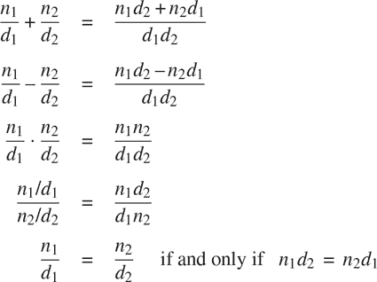

我们可以将这些规则表示为函数：

```js
function add_rat(x, y) {
    return make_rat(numer(x) * denom(y) + numer(y) * denom(x),
                    denom(x) * denom(y));
}
function sub_rat(x, y) {
    return make_rat(numer(x) * denom(y) - numer(y) * denom(x),
                    denom(x) * denom(y));
}
function mul_rat(x, y) {
    return make_rat(numer(x) * numer(y),
                    denom(x) * denom(y));
}
function div_rat(x, y) {
    return make_rat(numer(x) * denom(y),
                    denom(x) * numer(y));
}
function equal_rat(x, y) {
    return numer(x) * denom(y) === numer(y) * denom(x);
}
```

现在我们已经定义了有理数的操作，这些操作是基于选择器定义的

和构造函数`numer`、`denom`和`make_rat`。但我们还没有定义这些。我们需要一种方法来将分子和分母粘合在一起形成一个有理数。

##### 对

为了使我们能够实现数据抽象的具体层，我们的 JavaScript 环境提供了一种称为*pair*的复合结构，它可以用原始函数`pair`构造。此函数接受两个参数并返回一个包含两个参数作为部分的复合数据对象。给定一个对，我们可以使用原始函数`head`和`tail`提取部分。因此，我们可以如下使用`pair`、`head`和`tail`：

```js
const x = pair(1, 2);
head(x);
`1`
tail(x);
`2`
```

注意，对是一个可以被赋予名称并且可以被操作的数据对象，就像原始数据对象一样。此外，`pair`可以用来形成其元素为对的对，依此类推：

```js
const x = pair(1, 2);

const y = pair(3, 4);

const z = pair(x, y);

head(head(z));
`1`

head(tail(z));
`3`
```

在第 2.2 节中，我们将看到这种组合对的能力意味着对可以用作通用的构建块来创建各种复杂的数据结构。由对构造的数据对象称为*列表结构*数据。

##### 表示有理数

对提供了一种自然的方式来完成有理数系统。简单地将有理数表示为两个整数的对：一个分子和一个分母。然后`make_rat`、`numer`和`denom`可以如下实现：²

```js
function make_rat(n, d) { return pair(n, d); }
function numer(x) { return head(x); }
function denom(x) { return tail(x); }
```

此外，为了显示我们计算的结果，我们可以通过打印分子、斜杠和分母来打印有理数。我们使用原始函数`stringify`将任何值（这里是一个数字）转换为字符串。JavaScript 中的运算符`+`是*重载*的；它可以应用于两个数字或两个字符串，在后一种情况下，它返回*连接*两个字符串的结果。³

```js
function print_rat(x) {
    return display(stringify(numer(x)) + " / " + stringify(denom(x)));
}
```

现在我们可以尝试我们的有理数函数：⁴

```js
const one_half = make_rat(1, 2);

print_rat(one_half);
"1 / 2"

const one_third = make_rat(1, 3);

print_rat(add_rat(one_half, one_third));
"5 / 6"

print_rat(mul_rat(one_half, one_third));
"1 / 6"

print_rat(add_rat(one_third, one_third));
"6 / 9"
```

正如最后一个例子所示，我们的有理数实现没有将有理数化简为最低项。我们可以通过更改`make_rat`来解决这个问题。如果我们有一个像第 1.2.5 节中那样产生两个整数的最大公约数的`gcd`函数，我们可以使用`gcd`在构造对之前将分子和分母化简为最低项：

```js
function make_rat(n, d) {
    const g = gcd(n, d);
    return pair(n / g, d / g);
}
```

现在我们有

```js
print_rat(add_rat(one_third, one_third));
"2 / 3"
```

如所需。通过更改构造函数`make_ rat`而不更改实现实际操作的任何函数（如`add_rat`和`mul_rat`），已完成此修改。

##### 练习 2.1

定义一个更好的`make_rat`版本，处理正数和负数参数。函数`make_rat`应该规范化符号，以便如果有理数是正数，则分子和分母都是正数，如果有理数是负数，则只有分子是负数。

### 2.1.2 抽象屏障

在继续介绍复合数据和数据抽象的更多示例之前，让我们考虑一下有理数示例引发的一些问题。我们用构造函数`make_rat`和选择器`numer`和`denom`来定义有理数运算。一般来说，数据抽象的基本思想是为每种数据对象类型确定一组基本操作，通过这些操作来表达对该类型数据对象的所有操作，然后在操作数据时只使用这些操作。

我们可以将有理数系统的结构设想为图 2.1 所示。水平线代表*抽象屏障*，隔离系统的不同“层级”。在每个层级，该屏障将使用数据抽象的程序（上方）与实现数据抽象的程序（下方）分开。使用有理数的程序仅通过有理数包提供的“供公共使用”的函数来操作它们：`add_rat`、`sub_rat`、`mul_rat`、`div_rat`和`equal_rat`。这些函数又仅仅是通过构造函数和选择器`make_rat`、`numer`和`denom`来实现的，它们本身是通过对偶实现的。对偶的具体实现细节对于有理数包的其余部分来说是无关紧要的，只要对偶可以通过`pair`、`head`和`tail`来操作。实际上，每个层级的函数都是定义抽象屏障并连接不同层级的接口。这个简单的想法有很多优点。其中一个优点是它使程序更容易维护和修改。任何复杂的数据结构都可以用编程语言提供的原始数据结构的多种方式来表示。当然，表示的选择会影响操作它的程序；因此，如果表示在以后的某个时间被更改，所有这样的程序可能都必须相应地进行修改。对于大型程序来说，这个任务可能会耗费大量时间和金钱，除非通过设计将对表示的依赖限制在非常少的程序模块中。

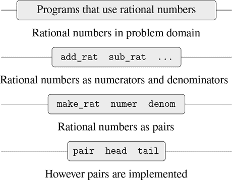

图 2.1 有理数包中的数据抽象屏障。

例如，解决将有理数化简为最低项的问题的另一种方法是在访问有理数的部分时执行化简，而不是在构造有理数时执行。这导致了不同的构造函数和选择器函数：

```js
function make_rat(n, d) {
    return pair(n, d);
}
function numer(x) {
    const g = gcd(head(x), tail(x));
    return head(x) / g;
}
function denom(x) {
    const g = gcd(head(x), tail(x));
    return tail(x) / g;
}
```

这种实现与之前的实现的不同之处在于我们何时计算`gcd`。如果在我们典型的有理数使用中，我们多次访问相同有理数的分子和分母，那么在构造有理数时计算`gcd`会更好。如果不是，我们可能最好等到访问时计算`gcd`。无论如何，当我们从一种表示形式改变为另一种表示形式时，函数`add_rat`、`sub_rat`等都不需要进行任何修改。

将对表示的依赖限制在少数接口函数中有助于我们设计程序以及修改程序，因为它允许我们保持灵活性来考虑替代实现。继续我们的简单例子，假设我们正在设计一个有理数包，最初无法确定是在构造时还是在选择时执行`gcd`。数据抽象方法为我们提供了一种推迟决定而不失去在系统的其余部分上取得进展的方法。

##### 练习 2.2

考虑在平面上表示线段的问题。每个线段都表示为一对点：起点和终点。声明一个构造器`make_segment`和选择器`start_segment`和`end_segment`，以点的形式定义线段的表示。此外，一个点可以表示为一对数字：`x`坐标和`y`坐标。因此，指定一个构造器`make_point`和选择器`x_point`和`y_point`来定义这种表示。最后，使用您的选择器和构造器，声明一个函数`midpoint_segment`，它以线段作为参数并返回其中点（坐标是端点坐标的平均值）。要尝试您的函数，您需要一种打印点的方法：

```js
function print_point(p) {
    return display("(" + stringify(x_point(p)) + ", "
                       + stringify(y_point(p)) + ")");
}
```

##### 练习 2.3

在平面上实现矩形的表示。 （提示：您可能需要使用练习 2.2。）根据您的构造器和选择器，创建计算给定矩形的周长和面积的函数。现在实现矩形的不同表示。您能否设计您的系统，使得具有合适的抽象屏障，以便相同的周长和面积函数将使用任一表示？

### 2.1.3 数据的含义是什么？

我们在 2.1.1 节中开始了有理数的实现，通过实现有理数操作`add_rat`，`sub_rat`等，这些操作是根据三个未指定的函数`make_rat`，`numer`和`denom`来定义的。在那时，我们可以认为这些操作是根据数据对象——分子、分母和有理数——来定义的，后三个函数规定了它们的行为。

但是，*数据*究竟是什么意思？仅仅说“由给定的选择器和构造器实现的任何东西”是不够的。显然，并非每一组任意的三个函数都可以作为有理数实现的适当基础。我们需要保证，如果我们从一对整数`n`和`d`构造一个有理数`x`，那么提取`x`的`numer`和`denom`并将它们相除应该得到与`n`除以`d`相同的结果。换句话说，`make_rat`，`numer`和`denom`必须满足这样的条件，对于任何整数`n`和任何非零整数`d`，如果`x`是`make_rat(n, d)`，那么

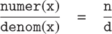

事实上，这是`make_rat`，`numer`和`denom`必须满足的唯一条件，以形成有理数表示的合适基础。一般来说，我们可以认为数据是由一些选择器和构造器的集合定义的，以及这些函数必须满足的指定条件，以便成为有效的表示。[5]

这种观点不仅可以用来定义“高级”数据对象，比如有理数，还可以用来定义更低级的对象。考虑一对的概念，我们用它来定义我们的有理数。我们从来没有说过一对是什么，只是语言提供了用于操作对的函数`pair`，`head`和`tail`。但我们只需要知道关于这三个操作的唯一事情是，如果我们使用`pair`将两个对象粘合在一起，我们可以使用`head`和`tail`来检索对象。也就是说，这些操作满足这样的条件，对于任何对象`x`和`y`，如果`z`是`pair(x, y)`，那么`head(z)`是`x`，`tail(z)`是`y`。事实上，我们提到这三个函数是作为原语包含在我们的语言中的。然而，任何满足上述条件的三个函数的三元组都可以用作实现对的基础。这一点通过这样一个事实引人注目，即我们可以实现`pair`，`head`和`tail`而不使用任何数据结构，只使用函数。以下是定义：[6]

```js
function pair(x, y) {
    function dispatch(m) {
        return m === 0
               ? x
               : m === 1
               ? y
               : error(m, "argument not 0 or 1 – pair");
    }
    return dispatch;
}
function head(z) { return z(0); }
function tail(z) { return z(1); }
```

这种使用函数的方法与我们对数据的直观概念完全不同。然而，要证明这是表示对偶的有效方式，我们只需要验证这些函数是否满足上面给出的条件。

要注意的微妙之处是`pair(x, y)`返回的值是一个函数——即内部定义的函数`dispatch`，它接受一个参数，并根据参数是 0 还是 1 返回`x`或`y`。相应地，`head(z)`被定义为将 0 应用于`z`。因此，如果`z`是由`pair(x, y)`形成的函数，那么将 0 应用于`z`将产生`x`。因此，我们已经证明了`head(pair(x, y))`产生`x`，就像我们希望的那样。类似地，`tail(pair(x, y))`将由`pair(x, y)`返回的函数应用于 1，返回`y`。因此，这种对偶的函数实现是有效的实现，如果我们只使用`pair`、`head`和`tail`来访问对偶，我们无法将这种实现与使用“真实”数据结构的实现区分开。

展示对偶的函数表示的重点不在于我们的语言是否以这种方式工作（对偶的高效实现可能会使用 JavaScript 的原始*向量*数据结构），而在于它可以以这种方式工作。函数表示，虽然晦涩，但是是表示对偶的完全足够的方式，因为它满足对偶需要满足的唯一条件。这个例子还表明，能够操作函数作为对象自动提供了表示复合数据的能力。现在这可能看起来像是一种奇特现象，但是数据的函数表示将在我们的编程技能中扮演一个核心角色。这种编程风格通常被称为*消息传递*，当我们在第 3 章讨论建模和模拟的问题时，我们将把它作为一个基本工具来使用。

##### 练习 2.4

这里是对对偶的另一种函数表示。对于这种表示，验证`head(pair(x, y))`对于任何对象`x`和`y`都产生`x`。

```js
function pair(x, y) {
    return m => m(x, y);
}
function head(z) {
    return z((p, q) => p);
}
```

`tail`的对应定义是什么？（提示：要验证这个定义是否有效，可以利用第 1.1.5 节的替换模型。）

##### 练习 2.5

证明我们可以只使用数字和算术运算来表示非负整数对，如果我们将对偶`a`和`b`表示为乘积`2^a3^b`的整数。给出函数`pair`、`head`和`tail`的相应定义。

##### 练习 2.6

如果将对偶表示为函数（练习 2.4）还不够令人费解，那么可以考虑，在一个可以操作函数的语言中，我们可以通过实现 0 和加 1 的操作来不使用数字（至少就非负整数而言）：

```js
const zero = f => x => x;

function add_1(n) {
    return f => x => f(n(f)(x));
}
```

这种表示被称为*Church 数*，以其发明者阿隆佐·邱奇命名，他是发明*λ*演算的逻辑学家。

直接定义`one`和`two`（不要用`zero`和`add_1`）。（提示：使用替换来计算`add_1(zero)`）。直接定义加法函数`plus`（不要用重复应用`add_1`）。

### 2.1.4 扩展练习：区间算术

Alyssa P. Hacker 正在设计一个帮助人们解决工程问题的系统。她希望在她的系统中提供一个功能，可以处理不精确的数量（例如物理设备的测量参数），并且知道精度，这样当使用这种近似数量进行计算时，结果将是已知精度的数字。

电气工程师将使用 Alyssa 的系统来计算电气量。有时，他们需要使用以下公式计算两个电阻`R[1]`和`R[2]`的并联等效电阻`R[p]`的值


电阻值通常只能知道制造商保证的一定公差。例如，如果你购买一个标有“6.8 欧姆，公差 10%”的电阻器，你只能确定电阻器的电阻在 6.8 - 0.68 = 6.12 和 6.8 + 0.68 = 7.48 欧姆之间。因此，如果你有一个 6.8 欧姆 10%的电阻器与一个 4.7 欧姆 5%的电阻器并联，组合的电阻可以在大约 2.58 欧姆（如果两个电阻器在下限）到大约 2.97 欧姆（如果两个电阻器在上限）之间变化。

Alyssa 的想法是将“区间算术”实现为一组用于组合“区间”的算术操作（表示不精确数量的可能值范围的对象）。将两个区间相加、相减、相乘或相除的结果本身是一个区间，表示结果的范围。

Alyssa 假设存在一个称为“区间”的抽象对象，它有两个端点：一个下限和一个上限。她还假设，给定区间的端点，她可以使用数据构造函数`make_interval`构造区间。Alyssa 首先编写了一个函数来添加两个区间。她推断出和的最小值是两个下限的和，最大值是两个上限的和：

```js
function add_interval(x, y) {
    return make_interval(lower_bound(x) + lower_bound(y),
                         upper_bound(x) + upper_bound(y));
}
```

Alyssa 还通过找到边界的最小值和最大值来计算两个区间的乘积，并将它们用作结果区间的边界。（函数`math_min`和`math_max`是原始函数，用于找到任意数量参数的最小值或最大值。）

```js
function mul_interval(x, y) {
    const p1 = lower_bound(x) * lower_bound(y); 
    const p2 = lower_bound(x) * upper_bound(y);
    const p3 = upper_bound(x) * lower_bound(y);
    const p4 = upper_bound(x) * upper_bound(y);
    return make_interval(math_min(p1, p2, p3, p4),
                         math_max(p1, p2, p3, p4));
}
```

要划分两个区间，Alyssa 将第一个乘以第二个的倒数。注意倒数区间的边界是上限的倒数和下限的倒数，按顺序排列。

```js
function div_interval(x, y) {
    return mul_interval(x, make_interval(1 / upper_bound(y),
                                         1 / lower_bound(y)));
}
```

##### 练习 2.7

Alyssa 的程序是不完整的，因为她没有指定区间抽象的实现。这里是区间构造函数的定义：

```js
function make_interval(x, y) { return pair(x, y); }
```

定义选择器`upper_bound`和`lower_bound`来完成实现。

##### 练习 2.8

使用类似 Alyssa 的推理，描述如何计算两个区间的差。定义一个相应的减法函数，称为`sub_interval`。

##### 练习 2.9

区间的*宽度*是其上限和下限之间的差的一半。宽度是区间指定的数字的不确定性的度量。对于一些算术操作，组合两个区间的结果的宽度仅取决于参数区间的宽度，而对于其他一些算术操作，组合的宽度并不是参数区间的宽度的函数。证明两个区间的和（或差）的宽度仅取决于要添加（或减去）的区间的宽度。举例说明，这对于乘法或除法来说并不成立。

##### 练习 2.10

专家系统程序员 Ben Bitdiddle 看着 Alyssa 的肩膀，评论说不清楚通过跨越零的区间进行除法意味着什么。修改 Alyssa 的程序以检查这种情况，并在发生时发出错误信号。

##### 练习 2.11

顺便说一句，Ben 也神秘地评论说：“通过测试区间端点的符号，可以将`mul_interval`分解为九种情况，其中只有一种需要超过两次乘法。”使用 Ben 的建议重写这个函数。

调试完她的程序后，Alyssa 将其展示给一个潜在的用户，后者抱怨说她的程序解决了错误的问题。他想要一个能够处理以中心值和加法公差表示的数字的程序；例如，他想要处理像 3.5 ± 0.15 这样的区间，而不是[3.35, 3.65]。Alyssa 回到她的桌子上，通过提供一个替代构造函数和替代选择器来解决这个问题：

```js
function make_center_width(c, w) {
    return make_interval(c - w, c + w);
}
function center(i) {
    return (lower_bound(i) + upper_bound(i)) / 2;
}
function width(i) {
    return (upper_bound(i) - lower_bound(i)) / 2;
}
```

不幸的是，Alyssa 的大多数用户都是工程师。真正的工程情况通常涉及只有小不确定性的测量，测量值是区间宽度与区间中点的比率。工程师通常会在设备参数上指定百分比的容差，就像前面给出的电阻器规格一样。

##### 练习 2.12

定义一个构造函数`make_center_percent`，它接受一个中心和一个百分比容差，并产生所需的区间。你还必须定义一个选择器`percent`，它为给定的区间产生百分比容差。`center`选择器与上面显示的相同。

##### 练习 2.13

证明在小百分比容差的假设下，有一个简单的公式可以用因子的容差来近似计算两个区间的乘积的百分比容差。你可以通过假设所有数字都是正数来简化这个问题。

经过相当多的工作，Alyssa P. Hacker 交付了她的成品系统。几年后，当她已经忘记了这一切时，她接到了一个愤怒的用户 Lem E. Tweakit 的电话。看来 Lem 已经注意到并联电阻的公式可以用两种代数上等价的方式来写：

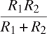

并且

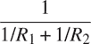

他写了以下两个程序，每个程序都以不同的方式计算并联电阻的公式：

```js
function par1(r1, r2) {
    return div_interval(mul_interval(r1, r2),
                        add_interval(r1, r2));
}
function par2(r1, r2) {
    const one = make_interval(1, 1);
    return div_interval(one,
                        add_interval(div_interval(one, r1),
                                     div_interval(one, r2)));
}
```

Lem 抱怨 Alyssa 的程序对于两种计算方式给出了不同的答案。这是一个严重的投诉。

##### 练习 2.14

证明 Lem 是对的。研究系统对各种算术表达式的行为。创建一些区间`A`和`B`，并在计算表达式`A / A`和`A / B`时使用它们。通过使用宽度是中心值的小百分比的区间，你将获得最多的见解。以中心百分比形式检查计算结果（参见练习 2.12）。

##### 练习 2.15

另一位用户 Eva Lu Ator 也注意到了不同的区间是由不同但代数上等价的表达式计算出来的。她说，使用 Alyssa 的系统计算区间的公式，如果可以以不重复代表不确定数字的名称的形式编写，将产生更紧的误差界限。因此，她说，`par2`比`par1`是一个“更好”的并联电阻程序。她是对的吗？为什么？

##### 练习 2.16

一般来说，解释等价的代数表达式可能导致不同的答案。你能设计一个没有这个缺点的区间算术包吗，还是这个任务是不可能的？（警告：这个问题非常困难。）

## 2.2 分层数据和闭包性质

正如我们所看到的，一对提供了一个原始的“粘合剂”，我们可以用它来构造复合数据对象。图 2.2 显示了一种标准的可视化一对的方法——在这种情况下，是由`pair(1, 2)`形成的一对。在这种表示中，称为*盒式和指针表示法*，每个复合对象都显示为指向一个盒子的*指针*。一对的盒子有两部分，左部分包含一对的头部，右部分包含尾部。


图 2.2 `pair(1, 2)`的盒式图表示。

我们已经看到`pair`不仅可以用来组合数字，还可以用来组合一对。 （你在做练习 2.2 和 2.3 时已经利用了这一事实，或者应该利用了。）因此，一对提供了一个通用的构建块，我们可以用它来构造各种数据结构。图 2.3 显示了使用一对组合数字 1、2、3 和 4 的两种方法。

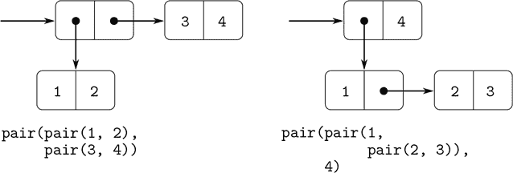

图 2.3 使用一对的两种组合 1、2、3 和 4 的方法。

创建元素为对的对的能力是列表结构作为表示工具的重要性的本质。我们将这种能力称为`pair`的*闭包属性*。一般来说，如果组合数据对象的操作满足闭包属性，那么使用该操作组合的结果本身可以使用相同的操作进行组合。⁷ 闭包是任何组合手段中权力的关键，因为它允许我们创建*分层*结构——由部分组成的结构，这些部分本身又由部分组成，依此类推。

从第 1 章开始，我们在处理函数时已经基本使用了闭包，因为除了非常简单的程序之外，所有程序都依赖于组合的元素本身可以是组合的事实。在本节中，我们将讨论闭包对于复合数据的影响。我们描述了一些使用对来表示序列和树的传统技术，并展示了一种图形语言，以生动的方式说明了闭包。

### 2.2.1 表示序列

我们可以使用对构建一种*序列*，即有序的数据对象集合。当然，有许多方法可以用对来表示序列。其中一种特别直接的表示方法如图 2.4 所示，其中序列 1, 2, 3, 4 被表示为一系列对。每对的`head`是链中对应的项目，而对的`tail`是链中的下一个对。最后一对的`tail`表示序列的结尾，在盒子和指针图中表示为对角线，而在程序中表示为 JavaScript 的原始值`null`。整个序列是通过嵌套的`pair`操作构建的：

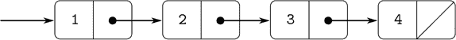

图 2.4 序列 1, 2, 3, 4 表示为一系列对。

```js
pair(1,
     pair(2,
          pair(3,
               pair(4, null))));
```

由嵌套的`pair`应用形成的这样一系列对称为*列表*，我们的 JavaScript 环境提供了一个名为`list`的原语来帮助构建列表。⁸ 上述序列可以通过`list(1, 2, 3, 4)`生成。一般来说，

```js
list(`a[1]`, `a[2], ..., `a[n]`)
```

等同于

```js
pair(`a[1]`, pair(`a[2]`, pair(..., pair(a[n], null)...)))
```

我们的解释器使用盒子和指针图的文本表示来打印对。`pair(1, 2)`的结果打印为`1, 2]`，[图 2.4 中的数据对象打印为`[1, [2, [3, [4, null]]]]`：

```js
const one_through_four = list(1, 2, 3, 4);

one_through_four;
[1, [2, [3, [4, null]]]]
```

我们可以将`head`视为选择列表中的第一项，将`tail`视为选择除第一项外的所有子列表。可以使用嵌套的`head`和`tail`应用来提取列表中的第二、第三和后续项。构造函数`pair`使得像原始列表一样的列表，但在开头增加了一个额外的项目。

```js
head(one_through_four);
1

tail(one_through_four);
[2, [3, [4, null]]]

head(tail(one_through_four));
2

pair(10, one_through_four);
[10, [1, [2, [3, [4, null]]]]]

pair(5, one_through_four);
[5, [1, [2, [3, [4, null]]]]]
```

用于终止对链的值`null`可以被视为没有元素的序列，即*空列表*。⁹

盒子表示法有时很难阅读。在本书中，当我们想要指示数据结构的列表性质时，我们将使用另一种*列表表示法*：在可能的情况下，列表表示法使用`list`的应用，其求值将导致所需的结构。例如，代替盒子表示法

```js
*[1, [[2, 3], [[4, [5, null]], [6, null]]]]*
```

我们写

```js
list(1, [2, 3], list(4, 5), 6)
```

在列表表示法中。¹⁰

##### 列表操作

使用对来表示列表中元素的序列的方法伴随着传统的编程技术，通过连续使用`tail`来遍历列表。例如，函数`list_ref`以列表和数字`n`作为参数，并返回列表的第`n`项。习惯上从 0 开始对列表的元素进行编号。计算`list_ref`的方法如下：

+   对于`n = 0`，`list_ref`应返回列表的`head`。

+   否则，`list_ref`应返回列表的`tail`的`(n – 1)`项。

```js
function list_ref(items, n) {
    return n === 0
           ? head(items)
           : list_ref(tail(items), n - 1);
}

const squares = list(1, 4, 9, 16, 25);

list_ref(squares, 3);
16
```

通常我们会遍历整个列表。为了帮助实现这一点，我们的 JavaScript 环境包括一个原始谓词`is_null`，用于测试其参数是否为空列表。返回列表中项目的数量的函数`length`说明了这种典型的使用模式：

```js
function length(items) {
    return is_null(items)
           ? 0
           : 1 + length(tail(items));
}

const odds = list(1, 3, 5, 7);

length(odds);
`4`
```

`length`函数实现了一个简单的递归计划。减少步骤是：

+   任何列表的`length`都是`tail`的`length`加 1。

这将一直应用，直到达到基本情况：

+   空列表的`length`为 0。

我们也可以以迭代的方式计算`length`：

```js
function length(items) {
    function length_iter(a, count) {
        return is_null(a)
               ? count
               : length_iter(tail(a), count + 1);
    }
    return length_iter(items, 0);
}
```

另一种常规的编程技术是通过使用`pair`将元素附加到列表的前面来构造一个答案列表，同时使用`tail`在列表中行走，就像函数`append`中那样，该函数接受两个列表作为参数并组合它们的元素以生成一个新列表：

```js
append(squares, odds);
list(1, 4, 9, 16, 25, 1, 3, 5, 7)

append(odds, squares);
list(1, 3, 5, 7, 1, 4, 9, 16, 25)
```

函数`append`也是使用递归计划实现的。要`append`列表`list1`和`list2`，请执行以下操作：

+   如果`list1`是空列表，则结果就是`list2`。

+   否则，`append` `list1`的`tail`和`list2`，并将`list1`的`head`添加到结果中：

```js
function append(list1, list2) {
    return is_null(list1)
           ? list2
           : pair(head(list1), append(tail(list1), list2));
}
```

##### 练习 2.17

定义一个函数`last_pair`，返回一个只包含给定（非空）列表的最后一个元素的列表：

```js
last_pair(list(23, 72, 149, 34));
list(34)
```

##### 练习 2.18

定义一个函数`reverse`，它以列表作为参数并返回相同元素的逆序列表：

```js
reverse(list(1, 4, 9, 16, 25));
list(25, 16, 9, 4, 1)
```

##### 练习 2.19

考虑第 1.2.2 节的找零程序。很高兴能够轻松更改程序使用的货币，这样我们就可以计算例如英镑的找零方式。按照程序的编写方式，货币的知识部分分布在函数`first_denomination`和函数`count_change`中（它知道有五种美国硬币）。最好能够提供要用于找零的硬币列表。

我们想要重写函数`cc`，使得它的第二个参数是要使用的硬币的值的列表，而不是指定要使用哪些硬币的整数。然后我们可以有定义每种货币的列表：

```js
const us_coins = list(50, 25, 10, 5, 1);
const uk_coins = list(100, 50, 20, 10, 5, 2, 1);
```

然后我们可以这样调用`cc`：

```js
cc(100, us_coins);
292
```

这将需要在一定程度上更改程序`cc`。它仍然具有相同的形式，但将以不同的方式访问其第二个参数，如下所示：

```js
function cc(amount, coin_values) {
    return amount === 0
           ? 1
           : amount < 0 || no_more(coin_values)
           ? 0
           : cc(amount, except_first_denomination(coin_values)) +
             cc(amount - first_denomination(coin_values), coin_values);
}
```

根据列表结构的原始操作定义函数`first_denomination`、`except_first_denomination`和`no_more`。列表`coin_values`的顺序是否会影响`cc`产生的答案？为什么？

##### 练习 2.20

在高阶函数的存在下，函数不一定需要有多个参数；一个就足够了。如果我们有一个像`plus`这样自然需要两个参数的函数，我们可以编写一个函数的变体，逐个传递参数。将变体应用于第一个参数可能会返回一个函数，然后我们可以将其应用于第二个参数，依此类推。这种做法——称为*柯里化*，以美国数学家和逻辑学家 Haskell Brooks Curry 命名——在 Haskell 和 OCaml 等编程语言中非常常见。在 JavaScript 中，`plus`的柯里化版本如下。

```js
function plus_curried(x) {
    return y => x + y;
}
```

编写一个函数`brooks`，它以柯里化函数作为第一个参数，并以柯里化函数应用的给定顺序逐个应用作为第二个参数的参数列表。例如，`brooks`的以下应用应该与`plus_curried(3)(4)`具有相同的效果：

```js
brooks(plus_curried, list(3, 4));
`7`
```

趁热打铁，我们也可以对函数`brooks`进行柯里化！编写一个函数`brooks_curried`，可以按以下方式应用：

```js
brooks_curried(list(plus_curried, 3, 4));
`7`
```

使用这个函数`brooks_curried`，求值以下两个语句的结果是什么？

```js
brooks_curried(list(brooks_curried,
                    list(plus_curried, 3, 4)));

brooks_curried(list(brooks_curried,
                    list(brooks_curried,
                         list(plus_curried, 3, 4))));
```

##### 对列表进行映射

有一个非常有用的操作是对列表中的每个元素应用一些转换，并生成结果列表。例如，以下函数通过给定的因子来缩放列表中的每个数字：

```js
function scale_list(items, factor) {
    return is_null(items)
           ? null
           : pair(head(items) * factor,
                  scale_list(tail(items), factor));
}

scale_list(list(1, 2, 3, 4, 5), 10);
*[10, [20, [30, [40, [50, null]]]]]*
```

我们可以将这个一般的想法抽象出来，并将其作为一个通用模式表达为一个高阶函数，就像在 1.3 节中一样。这里的高阶函数称为`map`。函数`map`接受一个参数和一个列表，并返回通过将函数应用于列表中的每个元素产生的结果列表：

```js
function map(fun, items) {
    return is_null(items)
           ? null
           : pair(fun(head(items)),
                  map(fun, tail(items)));
}

map(abs, list(-10, 2.5, -11.6, 17));
*[10, [2.5, [11.6, [17, null]]]]*

map(x => x * x, list(1, 2, 3, 4));
*[1, [4, [9, [16, null]]]]*
```

现在我们可以通过`map`给出`scale_list`的新定义：

```js
function scale_list(items, factor) {
    return map(x => x * factor, items);
}
```

函数`map`是一个重要的构造，不仅因为它捕捉了一个常见的模式，而且因为它在处理列表时建立了一个更高的抽象级别。在`scale_list`的原始定义中，程序的递归结构引起了对列表的逐个处理的注意。通过`map`定义`scale_list`抑制了那个细节级别，并强调了缩放将元素列表转换为结果列表。这两个定义之间的区别不是计算机执行了不同的过程（它没有），而是我们对过程的思考方式不同。实际上，`map`有助于建立一个抽象屏障，将转换列表的函数的实现与提取和组合列表元素的细节隔离开来。就像图 2.1 中显示的屏障一样，这种抽象给了我们改变序列如何实现的低级细节的灵活性，同时保留了将序列转换为序列的操作的概念框架。2.2.3 节扩展了这种将序列作为组织程序的框架的用法。

##### 练习 2.21

函数`square_list`接受一个数字列表作为参数，并返回这些数字的平方列表。

```js
square_list(list(1, 2, 3, 4));
*[1, [4, [9, [16, null]]]]*
```

这里有两种不同的`square_list`的定义。通过填写缺失的表达式来完成它们：

```js
function square_list(items) {
    return is_null(items)
           ? null
           : pair(〈??〉, 〈??〉);
}

function square_list(items) {
    return map(〈??〉, 〈??〉);
}
```

##### 练习 2.22

Louis Reasoner 试图重写练习 2.21 的第一个`square_list`函数，以便它演变成一个迭代过程：

```js
function square_list(items) {
    function iter(things, answer) {
        return is_null(things)
               ? answer
               : iter(tail(things),
                      pair(square(head(things)),
                           answer));
    }
    return iter(items, null);
}
```

不幸的是，用这种方式定义`square_list`会产生与期望的相反顺序的答案列表。为什么？

然后 Louis 尝试通过交换`pair`的参数来修复他的错误：

```js
function square_list(items) {
    function iter(things, answer) {
        return is_null(things)
               ? answer
               : iter(tail(things),
                      pair(answer,
                           square(head(things))));
    }
    return iter(items, null);
}
```

这也不起作用。解释一下。

##### 练习 2.23

函数`for_each`类似于`map`。它接受一个函数和一个元素列表作为参数。但是，`for_each`不会形成结果列表，而是依次对每个元素应用函数，从左到右。应用函数到元素后返回的值根本不会被使用——`for_each`用于执行动作的函数，比如打印。例如，

```js
for_each(x => display(x), list(57, 321, 88));
57
321
88
```

调用`for_each`（上面未显示）的返回值可以是任意的，比如`true`。给出`for_each`的实现。

### 2.2.2 分层结构

以列表的形式表示序列的表示自然地推广到表示元素本身可以是序列的序列。例如，我们可以将由`[[1, [2, null]], [3, [4, null]]]`构成的对象视为

```js
pair(list(1, 2), list(3, 4));
```

作为一个包含三个项目的列表，第一个项目本身是一个列表，`1, [2, null]]`。[图 2.5 显示了这个结构的表示形式。

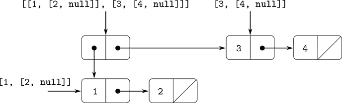

图 2.5 `pair(list(1, 2), list(3, 4))`形成的结构。

将元素为序列的序列视为*树*的另一种方式。序列的元素是树的分支，而元素本身是序列的元素是子树。图 2.6 显示了图 2.5 中的结构被视为树。

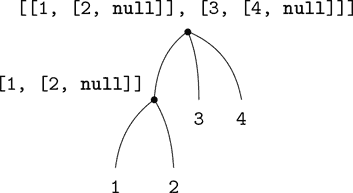

图 2.6 图 2.5 中的列表结构被视为树。

递归是处理树结构的自然工具，因为我们通常可以将树上的操作减少到对其分支的操作，这些操作反过来又减少到对分支的分支的操作，依此类推，直到达到树的叶子。例如，比较第 2.2.1 节的`length`函数和`count_leaves`函数，后者返回树的总叶子数：

```js
const x = pair(list(1, 2), list(3, 4));

length(x);
`3`

count_leaves(x);
`4`

list(x, x);
list(list(list(1, 2), 3, 4), list(list(1, 2), 3, 4))

length(list(x, x));
`2`

count_leaves(list(x, x));
`8`
```

要实现`count_leaves`，请回想一下计算`length`的递归计划：

+   列表`x`的`length`是 1 加上`x`的`tail`的`length`。

+   空列表的`length`为 0。

函数`count_leaves`类似。空列表的值是相同的：

+   空列表的`count_leaves`为 0。

但在减少步骤中，我们剥离列表的`head`时，我们必须考虑到`head`本身可能是一个我们需要计算叶子的树。因此，适当的减少步骤是

+   树`x`的`count_leaves`是`x`的`head`的`count_leaves`加上`x`的`tail`的`count_leaves`。

最后，通过取`head`，我们到达实际的叶子，因此我们需要另一个基本情况：

+   叶子的`count_leaves`为 1。

为了帮助编写树的递归函数，我们的 JavaScript 环境提供了原始谓词`is_pair`，用于测试其参数是否为对。以下是完整的函数：¹¹

```js
function count_leaves(x) {
    return is_null(x)
           ? 0
           : ! is_pair(x)
           ? 1
           : count_leaves(head(x)) + count_leaves(tail(x));
}
```

##### 练习 2.24

假设我们求值表达式`list(1, list(2, list(3, 4)))`。给出解释器打印的结果，相应的框和指针结构，以及将其解释为树的解释（如图 2.6 中所示）。

##### 练习 2.25

给出`head`和`tail`的组合，将从以下每个列表中挑选出 7 个，以列表表示：

```js
list(1, 3, list(5, 7), 9)

list(list(7))

list(1, list(2, list(3, list(4, list(5, list(6, 7))))))
```

##### 练习 2.26

假设我们定义`x`和`y`为两个列表：

```js
const x = list(1, 2, 3);
const y = list(4, 5, 6);
```

求值以下每个表达式的结果是什么，以框表示法和列表表示法？

```js
append(x, y)

pair(x, y)

list(x, y)
```

##### 练习 2.27

修改练习 2.18 的`reverse`函数，以生成一个`deep_reverse`函数，该函数以列表作为参数，并将其值作为其元素反转，并且所有子列表也进行深度反转。例如，

```js
const x = list(list(1, 2), list(3, 4));

x;
list(list(1, 2), list(3, 4))

reverse(x);
list(list(3, 4), list(1, 2))

deep_reverse(x);
list(list(4, 3), list(2, 1))
```

##### 练习 2.28

编写一个名为`fringe`的函数，该函数以树（表示为列表）作为参数，并返回一个列表，其中的元素都是树的叶子，按从左到右的顺序排列。例如，

```js
const x = list(list(1, 2), list(3, 4));

fringe(x);
list(1, 2, 3, 4)

fringe(list(x, x));
list(1, 2, 3, 4, 1, 2, 3, 4)
```

##### 练习 2.29

二进制移动由两个分支组成，左分支和右分支。每个分支都是一根特定长度的杆，从中悬挂着一个重量或另一个二进制移动。我们可以使用复合数据来表示二进制移动，通过从两个分支构造它（例如，使用`list`）：

```js
function make_mobile(left, right) {
    return list(left, right);
}
```

分支由`length`（必须是数字）和`structure`（可以是数字（表示简单重量）或另一个移动）组成：

```js
function make_branch(length, structure) {
    return list(length, structure);
}
```

1.  a.编写相应的选择器`left_branch`和`right_branch`，它们返回移动的分支，以及`branch_length`和`branch_structure`，它们返回分支的组件。

1.  b.使用您的选择器，定义一个名为`total_weight`的函数，返回移动的总重量。

1.  c.如果移动的顶部左分支施加的力矩等于顶部右分支施加的力矩（也就是说，如果左杆的长度乘以悬挂在该杆上的重量等于右侧对应的乘积），并且挂在其分支上的每个子移动都是平衡的，则称移动为*平衡*。设计一个谓词，测试二进制移动是否平衡。

1.  d.假设我们更改移动的表示形式，使构造函数为

    ```js
    function make_mobile(left, right) {
        return pair(left, right);
    }
    function make_branch(length, structure) {
        return pair(length, structure);
    }
    ```

    您需要更改程序以转换为新表示形式吗？

##### 对树进行映射

就像`map`是处理序列的强大抽象一样，`map`和递归一起是处理树的强大抽象。例如，`scale_tree`函数类似于 2.2.1 节的`scale_list`，它的参数是一个数字因子和一个叶子为数字的树。它返回一个相同形状的树，其中每个数字都乘以因子。`scale_tree`的递归计划类似于`count_leaves`的计划：

```js
function scale_tree(tree, factor) {
    return is_null(tree)
           ? null
           : ! is_pair(tree)
           ? tree * factor
           : pair(scale_tree(head(tree), factor),
                  scale_tree(tail(tree), factor));
}

scale_tree(list(1, list(2, list(3, 4), 5), list(6, 7)),
           10);
list(10, list(20, list(30, 40), 50), list(60, 70))
```

另一种实现`scale_tree`的方法是将树视为子树序列，并使用`map`。我们在序列上进行映射，依次缩放每个子树，并返回结果列表。在基本情况下，树是叶子时，我们只需乘以因子：

```js
function scale_tree(tree, factor) {
    return map(sub_tree => is_pair(sub_tree)
                           ? scale_tree(sub_tree, factor)
                           : sub_tree * factor,
               tree);
}
```

许多树操作可以通过类似的序列操作和递归的组合来实现。

##### 练习 2.30

声明一个类似于练习 2.21 的`square_list`函数的函数`square_tree`。也就是说，`square_tree`应该表现如下：

```js
square_tree(list(1,
                 list(2, list(3, 4), 5),
                 list(6, 7)));
list(1, list(4, list(9, 16), 25), list(36, 49)))
```

声明`square_tree`，既直接（即，不使用任何高阶函数），也使用`map`和递归。

##### 练习 2.31

将您对练习 2.30 的答案抽象化，以生成一个具有`square_tree`属性的函数`tree_map`，可以声明为

```js
function square_tree(tree) { return tree_map(square, tree); }
```

##### 练习 2.32

我们可以将集合表示为不同元素的列表，并且可以将集合的所有子集表示为列表的列表。例如，如果集合是`list(1, 2, 3)`，那么所有子集的集合是

```js
list(null, list(3), list(2), list(2, 3),
     list(1), list(1, 3), list(1, 2),
     list(1, 2, 3))
```

完成以下函数声明，生成一个集合的子集，并清楚解释为什么它有效：

```js
function subsets(s) {
    if (is_null(s)) {
        return list(null);
    } else {
        const rest = subsets(tail(s));
        return append(rest, map( ?? , rest));
    }
}
```

### 2.2.3 序列作为常规接口

在处理复合数据时，我们强调了数据抽象如何使我们能够设计程序，而不会陷入数据表示的细节，并且抽象保留了对我们来说灵活性，可以尝试替代表示。在本节中，我们介绍了另一个处理数据结构的强大设计原则——使用*常规接口*。

在 1.3 节中，我们看到了程序抽象如何作为高阶函数实现，可以捕捉处理数字数据的程序中的常见模式。我们能够为处理复合数据制定类似操作的能力，关键取决于我们操作数据结构的风格。例如，考虑以下函数，类似于 2.2.2 节中的`count_leaves`函数，它以树作为参数，并计算奇数叶子的平方和：

```js
function sum_odd_squares(tree) {
    return is_null(tree)
           ? 0
           : ! is_pair(tree)
           ? is_odd(tree) ? square(tree) : 0
           : sum_odd_squares(head(tree)) +
             sum_odd_squares(tail(tree));
}
```

表面上，这个函数与以下函数非常不同，后者构造了一个所有偶数斐波那契数`Fib(k)`的列表，其中`k`小于或等于给定的整数`n`：

```js
function even_fibs(n) {
    function next(k) {
        if (k > n) {
            return null;
        } else {
            const f = fib(k);
            return is_even(f)
                   ? pair(f, next(k + 1))
                   : next(k + 1);
        }
    }
    return next(0);
}
```

尽管这两个函数在结构上非常不同，但对这两个计算的更抽象描述揭示了很多相似之处。第一个程序

+   枚举树的叶子；

+   过滤它们，选择奇数；

+   平方选定的每一个；和

+   使用`+`累积结果，从 0 开始。

第二个程序

+   枚举从 0 到`n`的整数；

+   计算每个整数的斐波那契数；

+   过滤它们，选择偶数；和

+   使用`pair`累积结果，从空列表开始。

信号处理工程师会自然地将这些过程概念化为信号流经过一系列阶段，每个阶段实现程序计划的一部分，如图 2.7 所示。在`sum_odd_squares`中，我们从一个*枚举*开始，它生成一个由给定树的叶子组成的“信号”。这个信号通过一个*过滤器*，它消除除奇数元素以外的所有元素。结果信号依次通过一个*映射*，它是一个应用`square`函数到每个元素的“转换器”。映射的输出然后被传递给一个*累加器*，它使用`+`组合元素，从初始 0 开始。`even_fibs`的计划是类似的。

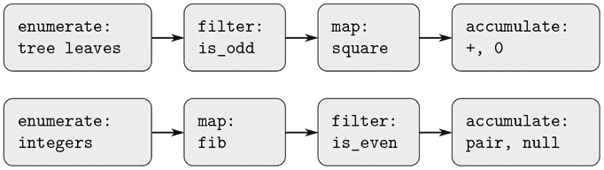

图 2.7 函数`sum_odd_squares`（顶部）和`even_fibs`（底部）的信号流计划揭示了这两个程序之间的共同点。

不幸的是，上述两个函数声明未能展现出这种信号流结构。例如，如果我们检查`sum_odd_squares`函数，我们会发现枚举部分部分地由`is_null`和`is_pair`测试实现，部分地由函数的树递归结构实现。同样，累积部分地在测试中找到，部分地在递归中使用的加法中找到。一般来说，两个函数没有明显的部分与信号流描述中的元素相对应。我们的两个函数以不同的方式分解计算，将枚举分散到程序中，并将其与映射、过滤和累积混合在一起。如果我们能够组织我们的程序，使得信号流结构在我们编写的函数中显现出来，这将增加结果程序的概念清晰度。

##### 序列操作

组织程序以更清晰地反映信号流结构的关键是集中于从一个过程阶段到下一个阶段流动的“信号”。如果我们将这些信号表示为列表，那么我们可以使用列表操作来实现每个阶段的处理。例如，我们可以使用第 2.2.1 节中的`map`函数来实现信号流图的映射阶段：

```js
map(square, list(1, 2, 3, 4, 5));
list(1, 4, 9, 16, 25)
```

通过过滤序列以选择仅满足给定谓词的元素来实现

```js
function filter(predicate, sequence) {
    return is_null(sequence)
           ? null
           : predicate(head(sequence))
           ? pair(head(sequence),
                  filter(predicate, tail(sequence)))
           : filter(predicate, tail(sequence));
}
```

例如，

```js
filter(is_odd, list(1, 2, 3, 4, 5));
list(1, 3, 5)
```

累积可以通过实现

```js
function accumulate(op, initial, sequence) {
    return is_null(sequence)
           ? initial
           : op(head(sequence),
                accumulate(op, initial, tail(sequence)));
}

accumulate(plus, 0, list(1, 2, 3, 4, 5));
15

accumulate(times, 1, list(1, 2, 3, 4, 5));
120

accumulate(pair, null, list(1, 2, 3, 4, 5));
list(1, 2, 3, 4, 5)
```

实现信号流图的所有剩下的部分就是枚举要处理的元素序列。对于`even_fibs`，我们需要生成给定范围内的整数序列，可以按如下方式实现：

```js
function enumerate_interval(low, high) {
    return low > high
           ? null
           : pair(low,
                  enumerate_interval(low + 1, high));
}

enumerate_interval(2, 7);
list(2, 3, 4, 5, 6, 7)
```

要枚举树的叶子，我们可以使用¹²

```js
function enumerate_tree(tree) {
    return is_null(tree)
           ? null
           : ! is_pair(tree)
           ? list(tree)
           : append(enumerate_tree(head(tree)),
                    enumerate_tree(tail(tree)));
}

enumerate_tree(list(1, list(2, list(3, 4)), 5));
list(1, 2, 3, 4, 5)
```

现在我们可以像信号流图一样重新制定`sum_odd_squares`和`even_fibs`。对于`sum_odd_squares`，我们枚举树的叶子序列，过滤以保留序列中的奇数，对每个元素求平方，并求和结果：

```js
function sum_odd_squares(tree) {
    return accumulate(plus,
                      0,
                      map(square,
                          filter(is_odd,
                                 enumerate_tree(tree))));
}
```

对于`even_fibs`，我们枚举从 0 到`n`的整数，为每个整数生成斐波那契数，过滤结果序列以保留偶数元素，并将结果累积到列表中：

```js
function even_fibs(n) {
    return accumulate(pair,
                      null,
                      filter(is_even,
                             map(fib,
                                 enumerate_interval(0, n))));
}
```

将程序表达为序列操作的价值在于，这有助于我们制定模块化的程序设计，即由相对独立的部分组合而成的设计。我们可以通过提供一组标准组件的库以及用灵活方式连接组件的传统接口来鼓励模块化设计。

在工程设计中，模块化构建是控制复杂性的强大策略。例如，在实际的信号处理应用中，设计师经常通过级联从标准化的滤波器和传感器系列中选择的元素来构建系统。同样，序列操作提供了一系列标准程序元素的库，我们可以随意组合。例如，我们可以在一个程序中重用`sum_odd_squares`和`even_fibs`函数的部分，以构建前`n + 1`个斐波那契数的平方的列表：

```js
function list_fib_squares(n) {
    return accumulate(pair,
                      null,
                      map(square,
                          map(fib,
                              enumerate_interval(0, n))));
}

list_fib_squares(10);
list(0, 1, 1, 4, 9, 25, 64, 169, 441, 1156, 3025)
```

我们可以重新排列这些部分，并在计算序列中奇数的平方的乘积时使用它们：

```js
function product_of_squares_of_odd_elements(sequence) {
    return accumulate(times,
                      1,
                      map(square,
                          filter(is_odd, sequence)));
}

product_of_squares_of_odd_elements(list(1, 2, 3, 4, 5));
225
```

我们还可以用序列操作来制定常规的数据处理应用。假设我们有一个人员记录序列，我们想要找到薪水最高的程序员的薪水。假设我们有一个选择器`salary`，返回记录的薪水，和一个谓词`is_programmer`，测试记录是否是程序员。然后我们可以写

```js
function salary_of_highest_paid_programmer(records) {
    return accumulate(math_max,
                      0,
                      map(salary,
                          filter(is_programmer, records)));
}
```

这些例子只是给出了可以表达为序列操作的广泛操作范围的一点提示。¹³

这里实现的序列作为列表，作为一个传统接口，允许我们组合处理模块。此外，当我们将结构统一表示为序列时，我们已经将程序中的数据结构依赖局限在了少量序列操作中。通过更改这些操作，我们可以尝试使用序列的替代表示，同时保持程序的整体设计不变。在第 3.5 节中，我们将利用这种能力，将序列处理范式推广到允许无限序列。

##### 练习 2.33

填写缺失的表达式，以完成一些基本的列表操作的累积定义：

```js
function map(f, sequence) {
    return accumulate((x, y) => 〈??〉,
                      null, sequence);
}
function append(seq1, seq2) {
    return accumulate(pair, 〈??〉, 〈??〉);
}
function length(sequence) {
    return accumulate( 〈??〉, 0, sequence);
}
```

##### 练习 2.34

在给定`x`的值的情况下，用`x`求值多项式可以被制定为一个累积。我们求值多项式

```js
a[n]xⁿ + a[n][–1]xⁿ^(–1) + ... + a[1]x + a[0]
```

使用一种称为*Horner's rule*的著名算法，将计算结构化为

```js
(... (a[n]x + a[n–1])x + ... + a[1]) x + a[0]
```

换句话说，我们从`a[n]`开始，乘以`x`，加上`a[n]–1`，乘以`x`，依此类推，直到达到`a[0]`.¹⁴ 填写以下模板，以生成使用 Horner's rule 计算多项式的函数。假设多项式的系数按顺序排列，从`a[0]`到`a[n]`。

```js
function horner_eval(x, coefficient_sequence) {
    return accumulate((this_coeff, higher_terms) => ?? ,
                      0,
                      coefficient_sequence);
}
```

例如，要计算`1 + 3x + 5x³ + x⁵`在`x = 2`时，您需要计算

```js
horner_eval(2, list(1, 3, 0, 5, 0, 1));
```

##### 练习 2.35

将 2.2.2 节中的`count_leaves`重新定义为累积：

```js
function count_leaves(t) {
    return accumulate( ?? , ?? , map( ?? , ?? ));
}
```

##### 练习 2.36

函数`accumulate_n`类似于`accumulate`，只是它的第三个参数是一个序列的序列，假定它们都有相同数量的元素。它将指定的累积函数应用于组合所有序列的第一个元素，所有序列的第二个元素，依此类推，并返回结果的序列。例如，如果`s`是一个包含四个序列的序列

```js
list(list(1, 2, 3), list(4, 5, 6), list(7, 8, 9), list(10, 11, 12))
```

然后`accumulate_n(plus, 0, s)`的值应该是序列`list(22, 26, 30)`。填写以下`accumulate_n`的定义中缺失的表达式：

```js
function accumulate_n(op, init, seqs) {
    return is_null(head(seqs))
           ? null
           : pair(accumulate(op, init, 〈??〉),
                  accumulate_n(op, init, 〈??〉));
}
```

##### 练习 2.37

假设我们将向量`v = (v[i])`表示为数字序列，并将矩阵`m = (m[ij])`表示为向量序列（矩阵的行）。例如，矩阵

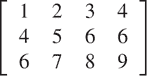

表示为以下序列：

```js
list(list(1, 2, 3, 4),
     list(4, 5, 6, 6),
     list(6, 7, 8, 9))
```

有了这种表示，我们可以使用序列操作简洁地表示基本的矩阵和向量操作。这些操作（在任何一本关于矩阵代数的书中都有描述）如下：

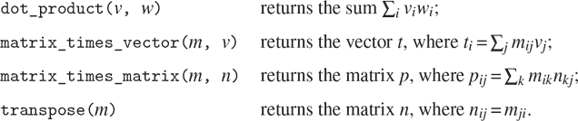

我们可以将点积定义为¹⁵

```js
function dot_product(v, w) {
    return accumulate(plus, 0, accumulate_n(times, 1, list(v, w)));
}
```

填写以下函数中的缺失表达式，用于计算其他矩阵操作。（函数`accumulate_n`在练习 2.36 中声明。）

```js
function matrix_times_vector(m, v) {
    return map( ?? , m);
}
function transpose(mat) {
    return accumulate_n( ?? , ?? , mat);
}
function matrix_times_matrix(n, m) {
    const cols = transpose(n);
    return map( ?? , m);
}
```

##### 练习 2.38

`accumulate`函数也被称为`fold_right`，因为它将序列的第一个元素与组合所有元素的结果结合。还有一个`fold_left`，它类似于`fold_right`，只是它是从相反方向组合元素的：

```js
function fold_left(op, initial, sequence) {
    function iter(result, rest) {
        return is_null(rest)
               ? result
               : iter(op(result, head(rest)),
                      tail(rest));
    }
    return iter(initial, sequence);
}
```

以下是

```js
fold_right(divide, 1, list(1, 2, 3));

fold_left(divide, 1, list(1, 2, 3));

fold_right(list, null, list(1, 2, 3));

fold_left(list, null, list(1, 2, 3));
```

给出一个`op`应满足的属性，以确保`fold_right`和`fold_left`对于任何序列都会产生相同的值。

##### 练习 2.39

根据练习 2.38 中的`fold_right`和`fold_left`，完成`reverse`（练习 2.18）的以下定义：

```js
function reverse(sequence) {
    return fold_right((x, y) => ?? , null, sequence);
}

function reverse(sequence) {
    return fold_left((x, y) => ?? , null, sequence);
}
```

##### 嵌套映射

我们可以扩展序列范式，包括许多通常使用嵌套循环表达的计算。¹⁶考虑这个问题：给定一个正整数`n`，找到所有有序对的不同正整数`i`和`j`，其中`1 j < i n`，使得`i + j`是素数。例如，如果`n`为 6，则这些对是以下的：

| `i` | 2 | 3 | 4 | 4 | 5 | 6 | 6 |
| --- | --- | --- | --- | --- | --- | --- | --- |
| `j` | 1 | 2 | 1 | 3 | 2 | 1 | 5 |
| `i + j` | 3 | 5 | 5 | 7 | 7 | 7 | 11 |

组织这个计算的一种自然方式是生成所有小于或等于`n`的正整数的有序对序列，过滤以选择其和为素数的那些对，然后对于通过过滤的每个对`(i, j)`，产生三元组`(i, j, i + j)`。

以下是生成对序列的方法：对于每个整数`i <= n`，枚举小于`i`的整数`j`，对于这样的`i`和`j`生成对`(i, j)`。在序列操作方面，我们沿着序列`enumerate_interval(1, n)`进行映射。对于这个序列中的每个`i`，我们沿着序列`enumerate_interval(1, i - 1)`进行映射。对于后一个序列中的每个`j`，我们生成对`list(i, j)`。这给我们每个`i`的一系列对。将所有`i`的序列组合起来（通过累积使用`append`）产生所需的对序列：¹⁷

```js
accumulate(append,
           null,
           map(i => map(j => list(i, j),
                        enumerate_interval(1, i - 1)),
               enumerate_interval(1, n)));
```

在这种程序中，映射和使用`append`进行累积的组合是如此常见，以至于我们将其作为一个单独的函数进行隔离：

```js
function flatmap(f, seq) {
    return accumulate(append, null, map(f, seq));
}
```

现在过滤这些对的序列，找到其和为素数的对。过滤谓词对序列的每个元素进行调用；它的参数是一个对，并且它必须从对中提取整数。因此，应用于序列中的每个元素的谓词是

```js
function is_prime_sum(pair) {
    return is_prime(head(pair) + head(tail(pair)));
}
```

最后，通过使用以下函数对过滤后的对进行映射，生成结果的序列，该函数构造一个由对的两个元素及其和组成的三元组：

```js
function make_pair_sum(pair) {
    return list(head(pair), head(tail(pair)),
                head(pair) + head(tail(pair)));
}
```

将所有这些步骤组合起来得到完整的函数：

```js
function prime_sum_pairs(n) {
    return map(make_pair_sum,
               filter(is_prime_sum,
                      flatmap(i => map(j => list(i, j),
                                       enumerate_interval(1, i - 1)),
                              enumerate_interval(1, n))));
}
```

嵌套映射对于除了枚举间隔的序列之外的序列也是有用的。假设我们希望生成集合`S`的所有排列；也就是说，集合中项目的所有排序方式。例如，{1, 2, 3}的排列是{1, 2, 3}，{1, 3, 2}，{2, 1, 3}，{2, 3, 1}，{3, 1, 2}和{3, 2, 1}。以下是生成`S`的排列的计划：对于`S`中的每个项目`x`，递归生成`S` – `x`的排列序列，然后将`x`添加到每个排列的前面。这为`S`中的每个`x`产生了以`x`开头的排列序列。将所有`x`的这些序列组合起来得到`S`的所有排列：¹⁹

```js
function permutations(s) {
    return is_null(s) // empty set?
           ? list(null) // sequence containing empty set
           : flatmap(x => map(p => pair(x, p),
                              permutations(remove(x, s))),
                     s);
}
```

注意这种策略如何将生成`S`的排列的问题简化为生成比`S`元素更少的集合的排列的问题。在终端情况下，我们一直向下工作，直到空列表，它表示没有元素的集合。对于这个，我们生成`list(null)`，它是一个具有一个项目的序列，即没有元素的集合。`permutations`中使用的`remove`函数返回给定序列中除了给定项目之外的所有项目。这可以表示为一个简单的过滤器：

```js
function remove(item, sequence) {
    return filter(x => ! (x === item),
                  sequence);
}
```

##### 练习 2.40

编写一个名为`unique_pairs`的函数，给定一个整数`n`，生成一对`(i, j)`的序列，其中`1, j < i, n`。使用`unique_pairs`来简化上面给出的`prime_sum_pairs`的定义。

##### 练习 2.41

编写一个函数，找到所有小于或等于给定整数`n`的不同正整数`i`、`j`和`k`的有序三元组，它们的和为给定整数`s`。

##### 练习 2.42

“八皇后问题”是问如何在国际象棋棋盘上放置八个皇后，以便没有一个皇后受到其他任何一个皇后的攻击（即，没有两个皇后在同一行，列或对角线上）。一个可能的解决方案如图 2.8 所示。解决这个难题的一种方法是逐列工作，将一个皇后放在每一列。一旦我们放置了`k - 1`个皇后，我们必须将第`k`个皇后放在一个位置，使得它不会攻击棋盘上已经存在的任何一个皇后。我们可以递归地制定这种方法：假设我们已经生成了在棋盘的前`k - 1`列中放置`k - 1`个皇后的所有可能方式的序列。对于这些方式中的每一种，通过在第`k`列的每一行放置一个皇后来生成一个扩展的位置集。现在过滤这些位置，只保留对其他皇后来说第`k`列中的皇后是安全的位置。这样就产生了在前`k`列中放置`k`个皇后的所有方式的序列。通过继续这个过程，我们将产生不止一个解决方案，而是所有解决方案。

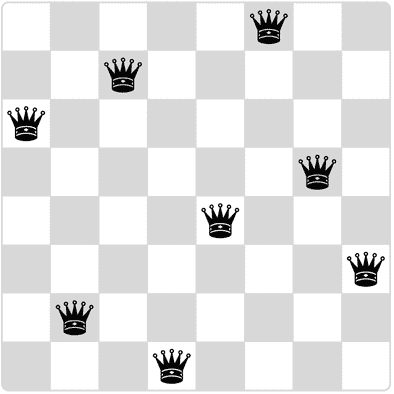

图 2.8 八皇后问题的一个解决方案。

我们将这个解决方案实现为一个名为`queens`的函数，它返回在*n n*国际象棋棋盘上放置`n`个皇后的所有解决方案的序列。函数`queens`有一个内部函数`queens_cols`，它返回在棋盘的前`k`列中放置皇后的所有方式的序列。

```js
function queens(board_size) {
    function queen_cols(k) {
        return k === 0
               ? list(empty_board)
               : filter(positions => is_safe(k, positions),
                        flatmap(rest_of_queens =>
                                  map(new_row =>
                                        adjoin_position(new_row, k,
                                                        rest_of_queens),
                                      enumerate_interval(1, board_size)),
                                queen_cols(k - 1)));
    }
    return queen_cols(board_size);
}
```

在这个函数中，`rest_of_queens`是在前`k - 1`列中放置`k - 1`个皇后的一种方法，`new_row`是一个建议的行，用于放置第`k`列的皇后。通过实现代表棋盘位置集的函数`adjoin_position`，包括将新的行列位置添加到位置集的函数`adjoin_position`，以及代表空位置集的函数`empty_board`，来完成程序。您还必须编写函数`is_safe`，它确定一组位置中的第`k`列的皇后是否与其他皇后安全。（请注意，我们只需要检查新皇后是否安全——其他皇后已经保证彼此之间是安全的。）

##### 练习 2.43

Louis Reasoner 在做练习 2.42 时遇到了很大的困难。他的`queens`函数似乎可以工作，但运行速度非常慢。（Louis 甚至没有等到它解决 6 6 的情况。）当 Louis 向 Eva Lu Ator 寻求帮助时，她指出他已经交换了`flatmap`中嵌套映射的顺序，将其写成

```js
flatmap(new_row =>
          map(rest_of_queens =>
                adjoin_position(new_row, k, rest_of_queens),
              queen_cols(k - 1)),
        enumerate_interval(1, board_size));
```

解释为什么这种交换会使程序运行缓慢。估计 Louis 的程序解决八皇后问题需要多长时间，假设练习 2.42 中的程序在时间`T`内解决了这个问题。

### 2.2.4 例子：一个图片语言

本节介绍了一种简单的绘图语言，它展示了数据抽象和闭包的强大力量，并且以一种基本的方式利用了高阶函数。该语言旨在使实验变得容易，例如图 2.9 中的图案，这些图案由重复的元素组成，这些元素被移动和缩放。在这种语言中，被组合的数据对象被表示为函数，而不是列表结构。正如`pair`满足闭包属性使我们能够轻松构建任意复杂的列表结构一样，这种语言中的操作也满足闭包属性，使我们能够轻松构建任意复杂的图案。

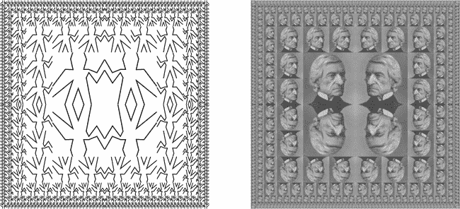

图 2.9 使用图片语言生成的设计。

##### 图片语言

当我们在 1.1 节开始学习编程时，我们强调了通过关注语言的基本元素、组合方式和抽象方式来描述一种语言的重要性。我们将在这里遵循这个框架。

这种图片语言的优雅之处在于只有一种元素，称为*画家*。画家绘制的图像被移动和缩放以适应指定的平行四边形框架。例如，有一个我们称为`wave`的原始画家，它绘制了一个粗线条的图像，如图 2.10 所示。图像的实际形状取决于框架——图 2.10 中的所有四幅图像都是由相同的`wave`画家生成的，但是与四个不同的框架相关。画家可以比这更复杂：名为`rogers`的原始画家绘制了麻省理工学院的创始人威廉·巴顿·罗杰斯的画像，如图 2.11 所示。图 2.11 中的四幅图像是与图 2.10 中的`wave`图像相对应的四个框架绘制的。

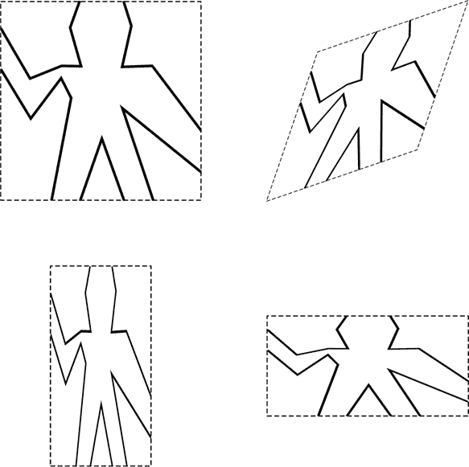

图 2.10 由`wave`画家生成的图像，与四个不同的框架相关。虚线框不是图像的一部分。

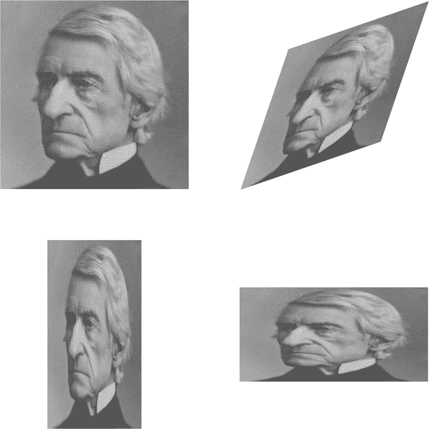

图 2.11 以与图 2.10 相同的四个框架为基础绘制的麻省理工学院创始人和第一任校长威廉·巴顿·罗杰斯的形象（原始图片由麻省理工学院博物馆提供）。

为了组合图像，我们使用各种操作从给定的画家构造新的画家。例如，`beside`操作接受两个画家，并产生一个新的复合画家，它在帧的左半部分绘制第一个画家的图像，在右半部分绘制第二个画家的图像。类似地，`below`接受两个画家，并产生一个复合画家，它在第一个画家的图像下方绘制第二个画家的图像。一些操作可以转换单个画家以产生新的画家。例如，`flip_vert`接受一个画家，并产生一个绘制其图像上下颠倒的画家，`flip_horiz`产生一个绘制原始画家图像从左到右翻转的画家。

图 2.12 显示了一个名为`wave4`的画家的绘制，它是从`wave`开始分两个阶段构建的：

```js
const wave2 = beside(wave, flip_vert(wave));
const wave4 = below(wave2, wave2);
```

通过这种方式构建复杂的图像，我们利用了画家在语言的组合方式下是闭合的这一事实。两个画家的`beside`或`below`本身就是一个画家；因此，我们可以将其用作制作更复杂画家的元素。与使用`pair`构建列表结构一样，数据在组合方式下的闭合对于能够仅使用少量操作创建复杂结构至关重要。

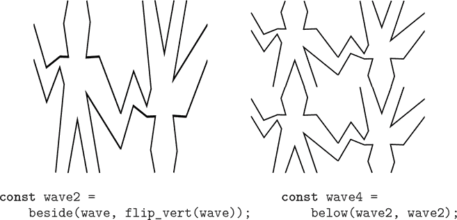

图 2.12 从图 2.10 的`wave`画家开始创建一个复杂的图形。

一旦我们能够组合画家，我们希望能够抽象出典型的组合画家模式。我们将画家操作实现为 JavaScript 函数。这意味着在图片语言中我们不需要特殊的抽象机制：由于组合的方式是普通的 JavaScript 函数，我们自动具有对画家操作进行任何操作的能力。例如，我们可以将`wave4`中的模式抽象为

```js
function flipped_pairs(painter) {
    const painter2 = beside(painter, flip_vert(painter));
    return below(painter2, painter2);
}
```

并将`wave4`声明为此模式的一个实例：

```js
const wave4 = flipped_pairs(wave);
```

我们还可以定义递归操作。以下是一个使画家向右分割和分支的操作，如图 2.13 和 2.14 所示：

```js
function right_split(painter, n) {
    if (n === 0) {
        return painter;
    } else {
        const smaller = right_split(painter, n - 1);
        return beside(painter, below(smaller, smaller));
    }
}
```

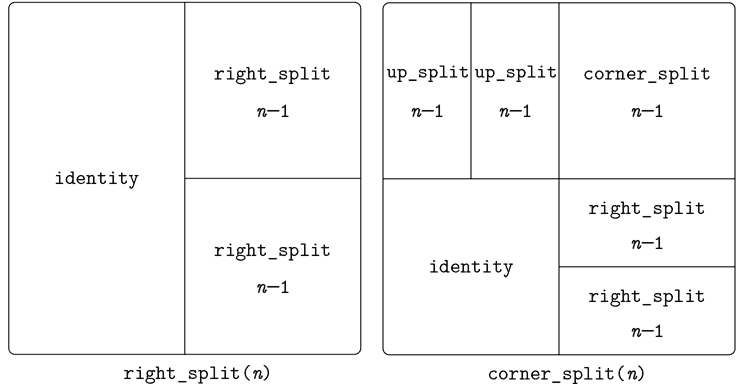

图 2.13 `right_split`和`corner_split`的递归计划。

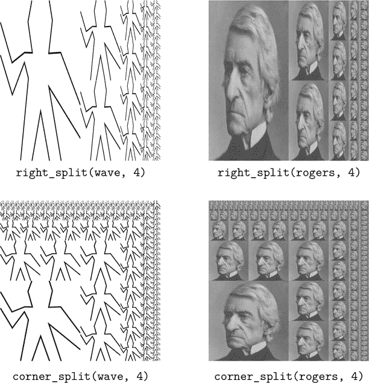

图 2.14 递归操作`right_split`应用于画家`wave`和`rogers`。将四个`corner_split`图形组合成对称的`square_limit`，如图 2.9 所示。

我们可以通过向上和向右分支来产生平衡的图案（参见练习 2.44 和图 2.13 和 2.14）：

```js
function corner_split(painter, n) {
    if (n === 0) {
        return painter;
    } else {
        const up = up_split(painter, n - 1);
        const right = right_split(painter, n - 1);
        const top_left = beside(up, up);
        const bottom_right = below(right, right);
        const corner = corner_split(painter, n - 1);
        return beside(below(painter, top_left),
                      below(bottom_right, corner));
    }
}
```

通过适当放置四个`corner_split`的副本，我们可以获得一个名为`square_limit`的图案，其应用于`wave`和`rogers`如图 2.9 所示：

```js
function square_limit(painter, n) {
    const quarter = corner_split(painter, n);
    const half = beside(flip_horiz(quarter), quarter);
    return below(flip_vert(half), half);
}
```

##### 练习 2.44

声明由`corner_split`使用的函数`up_split`。它类似于`right_split`，只是它交换了`below`和`beside`的角色。

##### 高阶操作

除了抽象出组合画家的模式之外，我们还可以在更高的层次上工作，抽象出组合画家操作的模式。也就是说，我们可以将画家操作视为要操作的元素，并且可以编写这些元素的组合方式——接受画家操作作为参数并创建新的画家操作的函数。

例如，`flipped_pairs`和`square_limit`都将画家的图像排列成方形图案的四个副本；它们之间的区别只在于它们如何定位这些副本。抽象这种画家组合的一种方法是使用以下函数，该函数接受四个一元画家操作并生成一个画家操作，该操作使用这四个操作对给定的画家进行变换并将结果排列成一个方形。²² 函数`tl`、`tr`、`bl`和`br`分别是要应用于左上角副本、右上角副本、左下角副本和右下角副本的变换。

```js
function square_of_four(tl, tr, bl, br) {
    return painter => {
        const top = beside(tl(painter), tr(painter));
        const bottom = beside(bl(painter), br(painter));
        return below(bottom, top);
    };
}
```

然后可以根据`square_of_four`定义`flipped_pairs`如下：²³

```js
function flipped_pairs(painter) {
    const combine4 = square_of_four(identity, flip_vert,
                                    identity, flip_vert);
    return combine4(painter);
}
```

和`square_limit`可以表示为²⁴

```js
function square_limit(painter, n) {
    const combine4 = square_of_four(flip_horiz, identity,
                                    rotate180, flip_vert);
    return combine4(corner_split(painter, n));
}
```

##### 练习 2.45

函数`right_split`和`up_split`可以表示为一般分割操作的实例。声明一个具有属性的函数`split`，使其求值

```js
const right_split = split(beside, below);
const up_split = split(below, beside);
```

生成具有与已声明的相同行为的函数`right_split`和`up_split`。

##### 帧

在我们展示如何实现画家及其组合方式之前，我们必须首先考虑帧。一个帧可以由三个向量描述——一个原点向量和两个边缘向量。原点向量指定了帧的原点与平面上某个绝对原点的偏移量，而边缘向量指定了帧的角落与其原点的偏移量。如果边缘是垂直的，那么帧将是矩形的。否则，帧将是一个更一般的平行四边形。

图 2.15 显示了一个帧及其相关的向量。根据数据抽象，我们不需要具体说明帧是如何表示的，除了说有一个构造函数`make_frame`，它接受三个向量并生成一个帧，以及三个相应的选择器`origin_frame`、`edge1_frame`和`edge2_frame`（参见练习 2.47）。

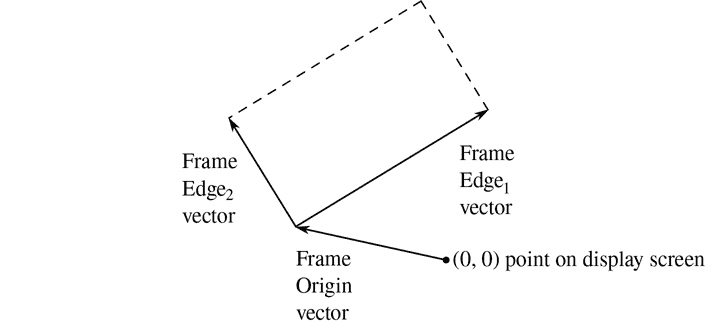

图 2.15 一个框架由三个向量描述——一个原点和两个边。

我们将使用单位正方形中的坐标`(0 ≤ x, y ≤ 1)`来指定图像。对于每个框架，我们关联一个 *框架坐标映射*，它将用于移动和缩放图像以适应框架。该映射通过将单位正方形映射到框架来将向量`v = (x, y)`映射到向量和

```js
原点(框架) + x · 边[1] (框架) + y · 边[2] (框架)
```

例如，`(0, 0)`被映射到框架的原点，`(1, 1)`被映射到对角于原点的顶点，`(0.5, 0.5)`被映射到框架的中心。我们可以使用以下函数创建框架的坐标映射：²⁵

```js
function frame_coord_map(frame) {
    return v => add_vect(origin_frame(frame),
                         add_vect(scale_vect(xcor_vect(v),
                                             edge1_frame(frame)),
                                  scale_vect(ycor_vect(v),
                                             edge2_frame(frame))));
}
```

观察将`frame_coord_map`应用于框架会返回一个函数，给定一个向量，返回一个向量。如果参数向量在单位正方形内，则结果向量将在框架内。例如，

```js
frame_coord_map(a_frame)(make_vect(0, 0)); 
```

返回与

```js
origin_frame(a_frame);
```

##### 练习 2.46

从原点到一个点的二维向量`v`可以表示为一个对，包括一个`x`坐标和一个`y`坐标。通过给出一个构造函数`make_vect`和相应的选择器`xcor_vect`和`ycor_vect`来为向量实现数据抽象。根据你的选择器和构造函数，实现函数`add_vect`、`sub_vect`和`scale_vect`，执行向量加法、向量减法和将向量乘以标量的操作：

```js
 (x[1], y[1]) + (x[2], y[2])  =  (x[1] + x[2], y[1] + y[2]) 

 (x[1], y[1]) – (x[2], y[2])  =  (x[1] – x[2], y[1] – y[2]) 

 s · (x, y)  =  (sx, sy) 
```

##### 练习 2.47

以下是框架的两个可能的构造函数：

```js
function make_frame(origin, edge1, edge2) {
    return list(origin, edge1, edge2);
}

function make_frame(origin, edge1, edge2) {
   return pair(origin, pair(edge1, edge2));
}
```

对于每个构造函数，提供适当的选择器以生成框架的实现。

##### 画家

画家表示为一个函数，给定一个框架作为参数，绘制一个特定的图像，移位和缩放以适应框架。也就是说，如果`p`是一个画家，`f`是一个框架，那么我们通过调用`p`传入`f`作为参数来在`f`中产生`p`的图像。

原始画家的实现细节取决于图形系统的特定特性和要绘制的图像类型。例如，假设我们有一个函数`draw_line`，它在屏幕上在两个指定点之间画一条线。然后我们可以根据线段列表创建线条绘制的画家，例如 图 2.10 中的`wave`画家，如下所示：²⁶

```js
function segments_to_painter(segment_list) {
    return frame =>
             for_each(segment =>
                        draw_line(
                            frame_coord_map(frame)
                                (start_segment(segment)),
                            frame_coord_map(frame)
                                (end_segment(segment))),
                      segment_list);
}
```

使用单位正方形的坐标给出线段。对于列表中的每个线段，画家使用框架坐标映射转换线段端点，并在转换后的点之间画一条线。

将画家表示为函数在图片语言中建立了强大的抽象屏障。我们可以创建和混合各种基于各种图形能力的原始画家。它们的实现细节并不重要。任何函数都可以作为画家，只要它以框架作为参数并绘制适合框架的内容。²⁷

##### 练习 2.48

平面上的有向线段可以表示为一对向量——从原点到线段起点的向量，以及从原点到线段终点的向量。使用练习 2.46 中的向量表示来定义具有构造函数`make_segment`和选择器`start_segment`和`end_segment`的线段表示。

##### 练习 2.49

使用`segments_to_painter`来定义以下原始画家：

1.  a. 绘制指定框架的轮廓的画家。

1.  b. 通过连接框架的对角线绘制`X`的画家。

1.  c. 连接框架边中点绘制菱形形状的画家。

1.  d. `wave`画家。

##### 转换和组合画家

对画家的操作（如`flip_vert`或`beside`）通过创建一个画家来实现，该画家根据参数框架派生的框架调用原始画家。因此，例如，`flip_vert`不需要知道画家的工作方式就可以翻转它——它只需要知道如何将框架颠倒：翻转后的画家只是使用原始画家，但在倒置的框架中。

画家操作基于`transform_painter`函数，它接受一个画家和如何转换框架的信息作为参数，并产生一个新的画家。转换后的画家在给定一个框架时，会转换框架并在转换后的框架上调用原始画家。`transform_painter`的参数是指定新框架角落的点（表示为向量）：当映射到框架中时，第一个点指定新框架的原点，另外两个点指定其边缘向量的端点。因此，在单位正方形内的参数指定了包含在原始框架内的框架。

```js
function transform_painter(painter, origin, corner1, corner2) {
    return frame => {
             const m = frame_coord_map(frame);
             const new_origin = m(origin);
             return painter(make_frame(
                                new_origin,
                                sub_vect(m(corner1), new_origin),
                                sub_vect(m(corner2), new_origin)));
           };
}
```

以下是如何垂直翻转画家图像：

```js
function flip_vert(painter) {
    return transform_painter(painter,
                             make_vect(0, 1),  // new origin
                             make_vect(1, 1),  // new end of edge1
                             make_vect(0, 0)); // new end of edge2
}
```

使用`transform_painter`，我们可以轻松定义新的转换。例如，我们可以声明一个画家，将其图像缩小到给定框架的右上角。

```js
function shrink_to_upper_right(painter) {
    return transform_painter(painter,
                             make_vect(0.5, 0.5),
                             make_vect(1, 0.5),
                             make_vect(0.5, 1));
}
```

其他转换将图像逆时针旋转 90 度²⁸

```js
function rotate90(painter) {
    return transform_painter(painter,
                             make_vect(1, 0),
                             make_vect(1, 1),
                             make_vect(0, 0));
}
```

或者将图像压缩到框架的中心：²⁹

```js
function squash_inwards(painter) {
    return transform_painter(painter,
                             make_vect(0, 0),
                             make_vect(0.65, 0.35),
                             make_vect(0.35, 0.65));
}
```

框架转换也是定义两个或更多画家组合方式的关键。例如，`beside`函数接受两个画家，将它们转换为分别在参数框架的左半部分和右半部分绘制，并产生一个新的复合画家。当给复合画家一个框架时，它调用第一个转换后的画家在框架的左半部分绘制，并调用第二个转换后的画家在框架的右半部分绘制：

```js
function beside(painter1, painter2) {
    const split_point = make_vect(0.5, 0);
    const paint_left = transform_painter(painter1,
                                         make_vect(0, 0),
                                         split_point,
                                         make_vect(0, 1));
    const paint_right = transform_painter(painter2,
                                         split_point,
                                         make_vect(1, 0),
                                         make_vect(0.5, 1));
    return frame => {
               paint_left(frame);
               paint_right(frame);
           };
}
```

观察画家数据抽象，特别是将画家表示为函数，使得`beside`易于实现。`beside`函数不需要了解组件画家的任何细节，只需要知道每个画家将在其指定的框架中绘制一些东西。

##### 练习 2.50

声明转换`flip_horiz`，它可以水平翻转画家，并且可以逆时针旋转 180 度和 270 度。

##### 练习 2.51

声明画家的`below`操作。`below`函数接受两个画家作为参数。给定一个框架，结果画家用第一个画家在框架底部绘制，并用第二个画家在顶部绘制。以两种不同的方式定义`below`——首先编写一个类似于上面给出的`beside`函数的函数，然后再根据`beside`和适当的旋转操作（来自练习 2.50）定义`below`。

##### 语言水平的稳健设计

图片语言利用了我们介绍的关于函数和数据抽象的一些关键思想。基本数据抽象，画家，是使用函数表示实现的，这使得语言可以以统一的方式处理不同的基本绘图能力。组合的方式满足封闭性质，这使我们可以轻松地构建复杂的设计。最后，所有用于抽象函数的工具都可以用于抽象画家的组合方式。

我们还对语言和程序设计的另一个关键思想有了一瞥。这就是*分层设计*的方法，即复杂系统应该被构造为一系列使用一系列语言描述的级别。每个级别都是通过组合在该级别被视为原始的部分构建的，而在下一个级别，每个级别构建的部分都被用作原语。分层设计的每个级别使用适合该级别细节的原语、组合手段和抽象手段。

分层设计渗透到复杂系统的工程中。例如，在计算机工程中，电阻器和晶体管被组合（并使用模拟电路语言描述）以产生诸如与门和或门之类的部件，这些部件构成了数字电路设计语言的原语。这些部件被组合以构建处理器、总线结构和存储系统，然后使用适合计算机体系结构的语言将它们组合成计算机。计算机被组合成分布式系统，使用适合描述网络互连的语言，依此类推。

作为分层的一个微小示例，我们的图片语言使用原始元素（原始画家）来指定点和线，以提供像`rogers`这样的画家的形状。我们对图片语言的描述主要集中在组合这些原始元素上，使用几何组合器如`beside`和`below`。我们还在更高的级别上工作，将`beside`和`below`视为在一个语言中被操作的原语，这个语言的操作，比如`square_of_four`，捕捉了组合几何组合器的常见模式。

分层设计有助于使程序*健壮*，也就是说，这样做可以使规范的微小变化很可能只需要相应地对程序进行微小的修改。例如，假设我们想要根据图 2.9 中显示的`wave`来改变图像。我们可以在最低级别上改变`wave`元素的详细外观；我们可以在中间级别上改变`corner_split`复制`wave`的方式；我们可以在最高级别上改变`square_limit`如何排列四个角的方式。通常情况下，分层设计的每个级别都提供了一个不同的词汇表来表达系统的特征，并且提供了不同类型的改变能力。

##### 练习 2.52

通过在上述每个级别上工作，对`wave`的`square_limit`进行更改，如图 2.9 所示。特别是：

1.  a. 向练习 2.49 中的原始`wave`画家添加一些段（例如添加一个微笑）。

1.  b. 改变`corner_split`构造的模式（例如，只使用一个`up_split`和`right_split`图像的副本，而不是两个）。

1.  c. 修改使用`square_of_four`来组装角落的`square_limit`版本，以便以不同的模式组装角落。（例如，你可以让大的 Mr. Rogers 从正方形的每个角向外看。）

## 2.3 符号数据

到目前为止，我们使用的所有复合数据对象最终都是由数字构建的。在本节中，我们通过引入使用字符字符串的能力来扩展我们的语言的表示能力。

### 2.3.1 字符串

到目前为止，我们已经使用字符串来显示消息，使用`display`和`error`函数（例如在练习 1.22 中）。我们可以使用字符串形成复合数据，并且有列表，比如

```js
list("a", "b", "c", "d")
list(23, 45, 17)
list(list("Jakob", 27), list("Lova", 9), list("Luisa", 24))
```

为了区分字符串和名称，我们用双引号将它们括起来。例如，JavaScript 表达式`z`表示名称`z`的值，而 JavaScript 表达式`"z"`表示由单个字符组成的字符串，即英语字母表中的最后一个字母的小写形式。

通过引号，我们可以区分字符串和名称：

```js
const a = 1;
const b = 2;

list(a, b);
[1, [2, null]]

list("a", "b");
["a", ["b", null]]

list("a", b);
["a", [2, null]]
```

在第 1.1.6 节，我们将`===`和`!==`作为数字的原始谓词引入。从现在开始，我们将允许`===`和`!==`的操作数为两个字符串。谓词`===`返回`true`，当且仅当两个字符串相同时，`!==`返回`true`，当且仅当两个字符串不同时。使用`===`，我们可以实现一个有用的函数称为`member`。它有两个参数：一个字符串和一个字符串列表或一个数字和一个数字列表。如果第一个参数不包含在列表中（即不与列表中的任何项`===`），则`member`返回`null`。否则，它返回列表中从第一次出现的字符串或数字开始的子列表：

```js
function member(item, x) {
    return is_null(x)
           ? null
           : item === head(x)
           ? x
           : member(item, tail(x));
}
```

例如，值为

```js
member("apple", list("pear", "banana", "prune"))
```

是`null`，而

```js
member("apple", list("x", "y", "apple", "pear"))
```

是`list("apple", "pear")`。

##### 练习 2.53

求出以下每个表达式的求值结果，使用框表示法和列表表示法？

```js
list("a", "b", "c")

list(list("george"))

tail(list(list("x1", "x2"), list("y1", "y2")))

tail(head(list(list("x1", "x2"), list("y1", "y2"))))

member("red", list("blue", "shoes", "yellow", "socks"))

member("red", list("red", "shoes", "blue", "socks"))
```

##### 练习 2.54

如果两个列表包含相同顺序排列的相等元素，则称它们为`equal`。例如，

```js
equal(list("this", "is", "a", "list"), list("this", "is", "a", "list"))
```

是`true`，但

```js
equal(list("this", "is", "a", "list"), list("this", list("is", "a"), "list"))
```

是`false`。更准确地说，我们可以通过基本的`===`相等性递归地定义`equal`，即如果`a`和`b`都是字符串或数字并且它们`===`，或者如果它们都是对，使得`head(a)`等于`head(b)`并且`tail(a)`等于`tail(b)`。使用这个想法，实现`equal`作为一个函数。

##### 练习 2.55

JavaScript 解释器在双引号`"`后读取字符，直到找到另一个双引号。两者之间的所有字符都是字符串的一部分，不包括双引号本身。但是如果我们想要一个字符串包含双引号呢？为此，JavaScript 还允许*单引号*来界定字符串，例如在`'say your name aloud'`中。在单引号字符串中，我们可以使用双引号，反之亦然，因此`'say "your name" aloud'`和`"say 'your name' aloud"`是有效的字符串，它们在位置 4 和 14 有不同的字符，如果我们从 0 开始计数。根据使用的字体，两个单引号可能不容易与双引号区分开。你能分辨出哪个是哪个，并计算出以下表达式的值吗？

```js
' " ' === " "
```

### 2.3.2 示例：符号微分

作为符号操作的示例和数据抽象的进一步说明，考虑设计一个执行代数表达式的符号微分的函数。我们希望该函数以代数表达式和变量作为参数，并返回表达式相对于变量的导数。例如，如果函数的参数是`ax² + bx + c`和`x`，则函数应返回`2ax + b`。符号微分在 Lisp 编程语言中具有特殊的历史意义。它是符号操作计算机语言开发背后的激励示例之一。此外，它标志着导致强大的符号数学工作系统开发的研究线的开始，这些系统如今被应用数学家和物理学家常规使用。

在开发符号微分程序时，我们将遵循数据抽象的相同策略，这与我们在开发第 2.1.1 节有理数系统时所遵循的策略相同。也就是说，我们将首先定义一个微分算法，该算法可以操作抽象对象，如“和”、“积”和“变量”，而不用担心这些对象如何表示。之后才会解决表示问题。

##### 具有抽象数据的微分程序

为了简化问题，我们将考虑一个非常简单的符号微分程序，该程序处理的表达式仅使用加法和乘法两个参数进行构建。任何这种表达式的微分都可以通过应用以下简化规则来进行：

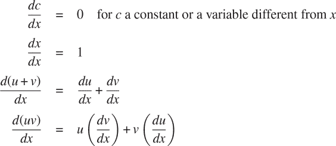

注意后两条规则的递归性质。也就是说，要获得和的导数，我们首先找到项的导数并将它们相加。每个项可能又是需要分解的表达式。分解成越来越小的部分最终会产生常数或变量的部分，它们的导数将是 0 或 1。

为了将这些规则体现在函数中，我们进行了一些希望的思考，就像我们在设计有理数实现时所做的那样。如果我们有一种表示代数表达式的方法，我们应该能够判断一个表达式是和、积、常数还是变量。我们应该能够提取表达式的部分。例如，对于和，我们希望能够提取加数（第一项）和被加数（第二项）。我们还应该能够从部分构造表达式。让我们假设我们已经有了实现以下选择器、构造函数和谓词的函数：

`is_variable(e)` | `e`是变量吗？|
| --- | --- |
| `is_same_variable(v1, v2)` | `v1`和`v2`是相同的变量吗？|
| `is_sum(e)` | `e`是和吗？|
| `addend(e)` | 和`e`的加数。|
| `augend(e)` | 和`e`的被加数。|
| `make_sum(a1, a2)` | 构造`a1`和`a2`的和。|
| `is_product(e)` | `e`是乘积吗？|
| `multiplier(e)` | 产品`e`的乘数。|
| `multiplicand(e)` | 产品`e`的被乘数。|
| `make_product(m1, m2)` | 构造`m1`和`m2`的乘积。|

使用这些和原始谓词`is_number`，它识别数字，我们可以将微分规则表达为以下函数：

```js
function deriv(exp, variable) {
    return is_number(exp)
           ? 0
           : is_variable(exp)
           ? is_same_variable(exp, variable) ? 1 : 0
           : is_sum(exp)
           ? make_sum(deriv(addend(exp), variable),
                      deriv(augend(exp), variable))
           : is_product(exp)
           ? make_sum(make_product(multiplier(exp),
                                   deriv(multiplicand(exp),
                                         variable)),
                     make_product(deriv(multiplier(exp),
                                         variable),
                                  multiplicand(exp)))
           : error(exp, "unknown expression type – deriv");
}
```

这个`deriv`函数包含了完整的微分算法。由于它是用抽象数据表示的，所以无论我们选择如何表示代数表达式，只要我们设计一个合适的选择器和构造函数，它都能工作。这是我们接下来必须解决的问题。

##### 表示代数表达式

我们可以想象许多使用列表结构来表示代数表达式的方法。例如，我们可以使用符号列表来反映通常的代数表示法，将`ax + b`表示为`list("a", "*", "x", "+", "b")`。但是，如果我们在 JavaScript 值中反映表达式的数学结构，将`ax + b`表示为`list("+", list("*", "a", "x"), "b")`会更方便。将二元运算符放在其操作数之前称为*前缀表示*，与第 1.1.1 节介绍的中缀表示相反。使用前缀表示，微分问题的数据表示如下：

+   变量只是字符串。它们由原始谓词`is_string`识别：

    ```js
        function is_variable(x) { return is_string(x); }
    ```

+   如果表示它们的字符串相等，两个变量是相同的：

    ```js
        function is_same_variable(v1, v2) {
            return is_variable(v1) && is_variable(v2) && v1 === v2;
        }
    ```

+   和积是作为列表构造的：

    ```js
        function make_sum(a1, a2) { return list("+", a1, a2); }
        function make_product(m1, m2) { return list("*", m1, m2); }
    ```

+   和是一个列表，其第一个元素是字符串`"+"`：

    ```js
        function is_sum(x) {
            return is_pair(x) && head(x) === "+";
        }
    ```

+   被加数是和列表的第二项：

    ```js
        function addend(s) { return head(tail(s)); }
    ```

+   被加数是和列表的第三项：

    ```js
        function augend(s) { return head(tail(tail(s))); }
    ```

+   乘积是一个列表，其第一个元素是字符串`"*"`：

    ```js
        function is_product(x) {
            return is_pair(x) && head(x) === "*";
        }
    ```

+   乘数是产品列表的第二项：

    ```js
        function multiplier(s) { return head(tail(s)); }
    ```

+   被乘数是产品列表的第三项：

    ```js
        function multiplicand(s) { return head(tail(tail(s))); }
    ```

因此，我们只需要将这些与由`deriv`体现的算法结合起来，就可以拥有一个可工作的符号微分程序。让我们看一些其行为的例子：

```js
deriv(list("+", "x", 3), "x");
list("+", 1, 0)

deriv(list("*", "x", "y"), "x");
list("+", list("*", "x", 0), list("*", 1, "y"))

deriv(list("*", list("*", "x", "y"), list("+", "x", 3)), "x");
list("+", list("*", list("*", "x", "y"), list("+", 1, 0)),
          list("*", list("+", list("*", "x", 0), list("*", 1, "y")),
                    list("+", "x", 3)))
```

该程序生成的答案是正确的；但是，它们是未简化的。事实上

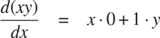

但我们希望程序知道`x· 0 = 0`，`1 · y = y`，`0 + y = y`。第二个例子的答案应该只是`y`。正如第三个例子所示，当表达式变得复杂时，这将成为一个严重的问题。

我们的困难很像我们在实现有理数时遇到的困难：我们没有将答案简化为最简形式。为了完成有理数的简化，我们只需要改变实现的构造函数和选择器。我们可以在这里采用类似的策略。我们不会改变`deriv`。相反，我们将改变`make_sum`，以便如果两个加数都是数字，`make_sum`将把它们相加并返回它们的和。此外，如果其中一个加数是 0，那么`make_sum`将返回另一个加数。

```js
function make_sum(a1, a2) {
    return number_equal(a1, 0)
           ? a2
           : number_equal(a2, 0)
           ? a1
           : is_number(a1) && is_number(a2)
           ? a1 + a2
           : list("+", a1, a2);
}
```

这使用了函数`number_equal`，它检查表达式是否等于给定的数字：

```js
function number_equal(exp, num) {
    return is_number(exp) && exp === num;
}
```

同样，我们将改变`make_product`以内置规则，即 0 乘以任何数都是 0，1 乘以任何数都是它本身：

```js
function make_product(m1, m2) {
    return number_equal(m1, 0) || number_equal(m2, 0)
           ? 0
           : number_equal(m1, 1)
           ? m2
           : number_equal(m2, 1)
           ? m1
           : is_number(m1) && is_number(m2)
           ? m1 * m2
           : list("*", m1, m2);
}
```

这是这个版本在我们的三个例子上的工作方式：

```js
deriv(list("+", "x", 3), "x");
`1`

deriv(list("*", "x", "y"), "x");
"y"

deriv(list("*", list("*", "x", "y"), list("+", "x", 3)), "x");
list("+", list("*", "x", "y"), list("*", "y", list("+", "x", 3)))
```

尽管这是一个很大的改进，但第三个例子表明，在我们得到一个将表达式放入我们可能同意的“最简形式”的程序之前，我们还有很长的路要走。代数简化的问题很复杂，因为，除其他原因外，对于一个目的来说可能是最简单的形式对于另一个目的来说可能不是。

##### 练习 2.56

展示如何扩展基本的差异化器以处理更多种类的表达式。例如，实现差异化规则

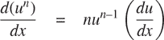

通过向`deriv`程序添加一个新子句并定义适当的函数`is_exp`、`base`、`exponent`和`make_exp`来实现这个表示法。（你可以使用字符串`**`来表示指数。）内置规则，任何数的 0 次方都是 1，任何数的 1 次方都是它本身。

##### 练习 2.57

将差异化程序扩展到处理任意数量（两个或更多）项的和与积。然后上面的最后一个例子可以表示为

```js
deriv(list("*", "x", "y", list("+", "x", 3)), "x");
```

尝试只通过改变和积的表示形式，而不改变`deriv`函数来实现这一点。例如，和的`addend`将是第一项，`augend`将是其余项的和。

##### 练习 2.58

假设我们想修改差异化程序，使其适用于普通的数学表示法，其中`+`和`*`是中缀而不是前缀运算符。由于差异化程序是根据抽象数据定义的，我们可以通过仅改变定义差异化器要操作的代数表达式的表示的谓词、选择器和构造函数来修改它，以便它适用于不同的表达式表示。

1.  a. 展示如何以中缀形式来区分代数表达式，就像这个例子一样：

    ```js
    list("x", "+", list(3, "*", list("x", "+", list("y", "+", 2))))
    ```

    为了简化任务，假设`+`和`*`总是带有两个参数，并且表达式是完全括号化的。

1.  b. 如果我们允许更接近普通中缀表示法的符号，即省略不必要的括号并假定乘法比加法优先级高，那么问题就会变得更加困难，就像这个例子一样：

    ```js
    list("x", "+", "3", "*", list("x", "+", "y", "+", 2))
    ```

    你能设计适当的谓词、选择器和构造函数，使我们的导数程序仍然有效吗？

### 2.3.3 例子：表示集合

在前面的例子中，我们为两种复合数据对象构建了表示：有理数和代数表达式。在这些例子中，我们可以选择在构建时间或选择时间简化（减少）表达式，但除此之外，在列表方面选择这些结构的表示是直接的。当我们转向集合的表示时，表示的选择就不那么明显了。实际上，有许多可能的表示，它们在几个方面彼此之间有显著的不同。

非正式地，集合只是不同对象的集合。为了给出更精确的定义，我们可以采用数据抽象的方法。也就是说，我们通过指定在集合上使用的操作来定义“集合”。这些操作包括`union_set`，`intersection_set`，`is_element_of_set`和`adjoin_set`。函数`is_element_of_set`是一个谓词，用于确定给定元素是否是集合的成员。函数`adjoin_set`接受一个对象和一个集合作为参数，并返回一个包含原始集合元素和附加元素的集合。函数`union_set`计算两个集合的并集，即包含在任一参数中出现的每个元素的集合。函数`intersection_set`计算两个集合的交集，即仅包含同时出现在两个参数中的元素的集合。从数据抽象的角度来看，我们可以自由设计任何实现这些操作的表示，以与上述解释一致的方式实现。³³

##### 无序列表的集合

一种表示集合的方法是将其元素列表化，其中没有元素出现超过一次。空集由空列表表示。在这种表示中，`is_element_of_set`类似于第 2.3.1 节的`member`函数。它使用`equal`而不是`===`，因此集合元素不必仅仅是数字或字符串：

```js
function is_element_of_set(x, set) {
    return is_null(set)
           ? false
           : equal(x, head(set))
           ? true
           : is_element_of_set(x, tail(set));
}
```

使用这个，我们可以编写`adjoin_set`。如果要添加的对象已经在集合中，我们只需返回集合。否则，我们使用`pair`将对象添加到表示集合的列表中：

```js
function adjoin_set(x, set) {
    return is_element_of_set(x, set)
           ? set
           : pair(x, set);
}
```

对于`intersection_set`，我们可以使用递归策略。如果我们知道如何形成`set2`和`set1`的`tail`的交集，我们只需要决定是否在其中包含`set1`的`head`。但这取决于`head(set1)`是否也在`set2`中。以下是得到的函数：

```js
function intersection_set(set1, set2) {
    return is_null(set1) || is_null(set2)
           ? null
           : is_element_of_set(head(set1), set2)
           ? pair(head(set1), intersection_set(tail(set1), set2))
           : intersection_set(tail(set1), set2);
}
```

在设计表示时，我们应该关注的一个问题是效率。考虑我们的集合操作所需的步骤数。由于它们都使用`is_element_of_set`，因此此操作的速度对整个集合实现的效率有重大影响。现在，为了检查对象是否是集合的成员，`is_element_of_set`可能需要扫描整个集合。（在最坏的情况下，对象可能不在集合中。）因此，如果集合有`n`个元素，`is_element_of_set`可能需要最多`n`步。因此，所需的步骤数随着`Θ(n)`增长。使用此操作的`adjoin_set`所需的步骤数也随着`Θ(n)`增长。对于`intersection_set`，它对`set1`的每个元素进行`is_element_of_set`检查，所需的步骤数随着涉及的集合大小的乘积增长，或者对于大小为`n`的两个集合，为`Θ(n²)`。`union_set`也是如此。

##### 练习 2.59

为无序列表表示的集合实现`union_set`操作。

##### 练习 2.60

我们规定集合将被表示为一个没有重复的列表。现在假设我们允许重复。例如，集合`{1, 2, 3}`可以表示为列表`list(2, 3, 2, 1, 3, 2, 2)`。设计函数`is_element_of_set`、`adjoin_set`、`union_set`和`intersection_set`，这些函数操作这种表示。每个函数的效率与非重复表示的相应函数相比如何？是否有应用程序会优先使用这种表示而不是非重复表示？

##### 有序列表的集合

加速我们的集合操作的一种方法是更改表示，使得集合元素按升序列出。为此，我们需要某种方法来比较两个对象，以便我们可以说哪个更大。例如，我们可以按字典顺序比较字符串，或者我们可以同意一些方法来为对象分配唯一的数字，然后通过比较相应的数字来比较元素。为了保持我们的讨论简单，我们只考虑集合元素是数字的情况，这样我们可以使用`>`和`<`来比较元素。我们将通过按升序列出其元素来表示一组数字。而我们上面的第一种表示允许我们以任何顺序列出集合`{1, 3, 6, 10}`的元素，我们的新表示只允许列表`list(1, 3, 6, 10)`。

有序的一个优点在于`is_element_of_set`中显示出来：在检查项目是否存在时，我们不再需要扫描整个集合。如果我们到达一个大于我们要查找的项目的集合元素，那么我们就知道该项目不在集合中。

```js
function is_element_of_set(x, set) {
    return is_null(set)
           ? false
           : x === head(set)
           ? true
           : x < head(set)
           ? false
           : // x > head(set)
             is_element_of_set(x, tail(set));
}
```

这节省了多少步？在最坏的情况下，我们要找的项目可能是集合中最大的项目，因此步数与无序表示的步数相同。另一方面，如果我们搜索许多不同大小的项目，有时我们可以期望能够在列表开头附近停止搜索，而其他时候我们仍然需要检查大部分列表。平均而言，我们应该期望需要检查集合中大约一半的项目。因此，所需的平均步数约为`n/2`。这仍然是`Θ(n)`的增长，但平均而言，与先前的实现相比，它可以节省我们约 2 倍的步数。

我们通过`intersection_set`获得了更令人印象深刻的加速。在无序表示中，这个操作需要`Θ(n²)`步，因为我们对`set2`的每个元素执行了完整的扫描。但是在有序表示中，我们可以使用更聪明的方法。首先比较两个集合的初始元素`x1`和`x2`。如果`x1`等于`x2`，那么这给出了交集的一个元素，其余的交集是两个集合的`tail`的交集。然而，假设`x1`小于`x2`。由于`x2`是`set2`中最小的元素，我们可以立即得出`x1`不可能出现在`set2`中，因此不在交集中。因此，交集等于`set2`与`set1`的`tail`的交集。同样，如果`x2`小于`x1`，那么交集由`set1`与`set2`的`tail`的交集给出。这是函数：

```js
function intersection_set(set1, set2) {
    if (is_null(set1) || is_null(set2)) {
        return null;
    } else {
        const x1 = head(set1);
        const x2 = head(set2);
        return x1 === x2
               ? pair(x1, intersection_set(tail(set1), tail(set2)))
               : x1 < x2
               ? intersection_set(tail(set1), set2)
               : // x2 < x1
                 intersection_set(set1, tail(set2));
    }
}
```

要估计此过程所需的步数，观察到在每一步中，我们将交集问题减少到计算更小集合的交集——从`set1`或`set2`或两者中删除第一个元素。因此，所需的步数最多是`set1`和`set2`大小的总和，而不是无序表示的大小乘积。这是`Θ(n)`的增长，而不是`Θ(n²)`——即使对于中等大小的集合，这也是相当大的加速。

##### 练习 2.61

使用有序表示法给出`adjoin_set`的实现。类似于`is_element_of_set`，展示如何利用排序来生成一个函数，平均需要的步骤数量大约是无序表示的一半。

##### 练习 2.62

为作为有序列表表示的集合提供一个`Θ(n)`的`union_set`实现。

##### 将集合表示为二叉树

我们可以通过以树的形式排列集合元素来比有序列表表示更好。树的每个节点都包含集合的一个元素，称为该节点的“条目”，以及指向两个其他（可能为空）节点的链接。 “左”链接指向小于节点处的元素，“右”链接指向大于节点处的元素。图 2.16 显示了表示集合`{1, 3, 5, 7, 9, 11}`的一些树。同一集合可以用多种不同的方式表示为树。我们对有效表示的唯一要求是左子树中的所有元素都小于节点条目，右子树中的所有元素都大于节点条目。

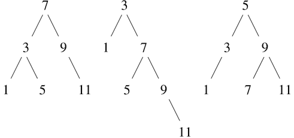

图 2.16 表示集合`{1, 3, 5, 7, 9, 11}`的各种二叉树。

树表示的优势在于：假设我们想要检查数字`x`是否包含在集合中。我们首先将`x`与顶部节点中的条目进行比较。如果`x`小于此条目，我们知道我们只需要搜索左子树；如果`x`大于此条目，我们只需要搜索右子树。现在，如果树是“平衡的”，这些子树的大小将约为原始大小的一半。因此，我们已经将搜索大小为`n`的树的问题减少到搜索大小为`n/2`的树。由于树的大小在每一步都减半，我们应该期望搜索大小为`n`的树所需的步骤数增长为`Θ(log n)`。对于大型集合，这将比以前的表示方式显著加快速度。

我们可以使用列表来表示树。每个节点将是一个包含三个项目的列表：节点处的条目，左子树和右子树。空列表的左子树或右子树表示那里没有连接的子树。我们可以通过以下函数描述这种表示法：

```js
function entry(tree) { return head(tree); }
function left_branch(tree) { return head(tail(tree)); }
function right_branch(tree) { return head(tail(tail(tree))); }
function make_tree(entry, left, right) {
    return list(entry, left, right);
}
```

现在我们可以使用上述策略编写`is_element_of_set`：

```js
function is_element_of_set(x, set) {
    return is_null(set)
           ? false
           : x === entry(set)
           ? true
           : x < entry(set)
           ? is_element_of_set(x, left_branch(set))
           : // x > entry(set)
             is_element_of_set(x, right_branch(set));
}
```

将项目添加到集合中的方法类似实现，并且需要`Θ(log n)`步骤。要添加项目`x`，我们将`x`与节点条目进行比较，以确定`x`应该添加到右侧还是左侧分支，并且在将`x`添加到适当的分支后，我们将这个新构造的分支与原始条目和另一个分支组合在一起。如果`x`等于条目，我们只需返回节点。如果我们被要求将`x`添加到空树中，我们生成一个具有`x`作为条目和空右侧和左侧分支的树。以下是函数：

```js
function adjoin_set(x, set) {
    return is_null(set)
           ? make_tree(x, null, null)
           : x === entry(set)
           ? set
           : x < entry(set)
           ? make_tree(entry(set),
                       adjoin_set(x, left_branch(set)),
                       right_branch(set))
           : // x > entry(set)
             make_tree(entry(set),
                       left_branch(set),
                       adjoin_set(x, right_branch(set)));
}
```

上述声称搜索树可以在对数步骤中执行的假设是树是“平衡的”，即每棵树的左子树和右子树大致具有相同数量的元素，因此每个子树包含其父树元素的大约一半。但是我们如何确保我们构造的树是平衡的呢？即使我们从平衡树开始，使用`adjoin_set`添加元素可能会产生不平衡的结果。由于新添加元素的位置取决于元素与集合中已有项目的比较方式，我们可以预期，如果我们“随机”添加元素，树将平均平衡。但这并不是一个保证。例如，如果我们从空集开始，按顺序添加数字 1 到 7，我们最终得到图 2.17 中显示的高度不平衡的树。在这棵树中，所有左子树都是空的，因此它与简单的有序列表没有任何优势。解决这个问题的一种方法是定义一个操作，将任意树转换为具有相同元素的平衡树。然后我们可以在每隔几次`adjoin_set`操作之后执行此转换，以保持我们的集合平衡。还有其他解决这个问题的方法，其中大多数涉及设计新的数据结构，用于在`Θ(log n)`步骤中进行搜索和插入。³⁶

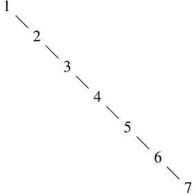

图 2.17 顺序添加 1 到 7 所产生的不平衡树。

##### 练习 2.63

以下两个函数中的每一个都将二叉树转换为列表。

```js
function tree_to_list_1(tree) {
    return is_null(tree)
           ? null
           : append(tree_to_list_1(left_branch(tree)),
                    pair(entry(tree),
                         tree_to_list_1(right_branch(tree))));
}

function tree_to_list_2(tree) {
    function copy_to_list(tree, result_list) {
        return is_null(tree)
               ? result_list
               : copy_to_list(left_branch(tree),
                              pair(entry(tree),
                                   copy_to_list(right_branch(tree),
                                                result_list)));
    }
    return copy_to_list(tree, null);
}
```

1.  a. 这两个函数对每棵树都产生相同的结果吗？如果不是，结果有何不同？这两个函数为图 2.16 中的树产生了什么列表？

1.  b. 这两个函数在将具有`n`个元素的平衡树转换为列表所需的步骤数量的增长顺序相同吗？如果不是，哪一个增长更慢？

##### 练习 2.64

以下函数`list_to_tree`将有序列表转换为平衡二叉树。辅助函数`partial_tree`以整数`n`和至少`n`个元素的列表作为参数，并构造包含列表的前`n`个元素的平衡树。`partial_tree`返回的结果是一个由`pair`组成的对，其`head`是构造的树，`tail`是未包含在树中的元素列表。

```js
function list_to_tree(elements) {
    return head(partial_tree(elements, length(elements)));
}
function partial_tree(elts, n) {
    if (n === 0) {
        return pair(null, elts);
    } else {
        const left_size = math_floor((n - 1) / 2);
        const left_result = partial_tree(elts, left_size);
        const left_tree = head(left_result);
        const non_left_elts = tail(left_result);
        const right_size = n - (left_size + 1);
        const this_entry = head(non_left_elts);
        const right_result = partial_tree(tail(non_left_elts), right_size);
        const right_tree = head(right_result);
        const remaining_elts = tail(right_result);
        return pair(make_tree(this_entry, left_tree, right_tree),
                    remaining_elts);
    }
}
```

1.  a. 用尽可能清晰的方式写一段简短的段落，解释`partial_tree`是如何工作的。为列表`list(1, 3, 5, 7, 9, 11)`绘制`list_to_tree`生成的树。

1.  b. `list_to_tree`将`n`个元素的列表转换为所需的步骤数量的增长顺序是多少？

##### 练习 2.65

使用练习 2.63 和 2.64 的结果，为作为（平衡）二叉树实现的集合提供`union_set`和`intersection_set`的`Θ(n)`实现。³⁷

##### 集合和信息检索

我们已经研究了使用列表表示集合的选项，并且已经看到数据对象的表示选择对使用数据的程序的性能有很大影响。专注于集合的另一个原因是，这里讨论的技术在涉及信息检索的应用中一再出现。

考虑一个包含大量个体记录的数据库，例如公司的人事档案或会计系统中的交易。典型的数据管理系统花费大量时间访问或修改记录中的数据，因此需要一种有效的访问记录的方法。这是通过识别每个记录的一部分作为标识*键*来完成的。键可以是任何唯一标识记录的东西。对于人事档案，它可能是员工的 ID 号。对于会计系统，它可能是交易号。无论键是什么，当我们将记录定义为数据结构时，我们应该包括一个`key`选择器函数，用于检索与给定记录关联的键。

现在我们将数据库表示为一组记录。要定位具有给定键的记录，我们使用一个名为`lookup`的函数，它以键和数据库作为参数，并返回具有该键的记录，如果没有这样的记录则返回`false`。函数`lookup`的实现方式几乎与`is_element_of_set`相同。例如，如果记录集被实现为无序列表，我们可以使用

```js
function lookup(given_key, set_of_records) {
    return is_null(set_of_records)
           ? false
           : equal(given_key, key(head(set_of_records)))
           ? head(set_of_records)
           : lookup(given_key, tail(set_of_records));
}
```

当然，有更好的方法来表示大型集合，而不是作为无序列表。记录必须“随机访问”的信息检索系统通常通过基于树的方法实现，例如之前讨论过的二叉树表示。在设计这样的系统时，数据抽象的方法论可以提供很大的帮助。设计者可以使用简单直接的表示方法（例如无序列表）创建一个初始实现。这对于最终的系统来说是不合适的，但它可以用来提供一个“快速脏数据”数据库，用于测试系统的其余部分。稍后，数据表示可以修改为更复杂的形式。如果数据库是根据抽象选择器和构造器访问的，那么这种表示的更改不需要对系统的其余部分进行任何更改。

##### 练习 2.66

为记录集结构化为按键的数值顺序排列的二叉树的情况实现`lookup`函数。

### 2.3.4 示例：霍夫曼编码树

本节提供了使用列表结构和数据抽象来操作集合和树的实践。应用于将数据表示为一系列一和零（位）的方法。例如，用于在计算机中表示文本的 ASCII 标准代码将每个字符编码为七位序列。使用七位可以区分`2⁷`，或 128 个可能的不同字符。一般来说，如果我们想区分`n`个不同的符号，我们将需要使用`log₂n`位每个符号。如果我们的所有消息由八个符号 A、B、C、D、E、F、G 和 H 组成，我们可以选择每个字符三位的代码，例如

| A | 000 | C | 010 | E | 100 | G | 110 |
| --- | --- | --- | --- | --- | --- | --- | --- |
| B | 001 | D | 011 | F | 101 | H | 111 |

使用这个代码，消息

```js
BACADAEAFABBAAAGAH
```

被编码为 54 位的字符串

```js
001000010000011000100000101000001001000000000110000111
```

诸如 ASCII 和上面的 A 到 H 代码之类的代码被称为*固定长度*代码，因为它们用相同数量的位表示消息中的每个符号。有时使用*可变长度*代码是有利的，其中不同的符号可以由不同数量的位表示。例如，莫尔斯电码不使用相同数量的点和破折号来表示字母表中的每个字母。特别是，最常见的字母 E 由一个单点表示。一般来说，如果我们的消息中有一些符号出现非常频繁，而另一些符号出现非常少，如果我们为频繁的符号分配较短的代码，我们可以更有效地编码数据（即每个消息使用更少的位）。考虑以下字母 A 到 H 的替代代码：

| A | 0 | C | 1010 | E | 1100 | G | 1110 |
| --- | --- | --- | --- | --- | --- | --- | --- |
| B | 100 | D | 1011 | F | 1101 | H | 1111 |

使用这个编码，与上面相同的消息被编码为

```js
100010100101101100011010100100000111001111
```

这个字符串包含 42 位，因此与上面显示的固定长度编码相比，节省了超过 20%的空间。

使用可变长度编码的一个困难是在读取一系列零和一时，知道何时已经到达符号的结尾。摩尔斯电码通过在每个字母的点和划线序列之后使用特殊的*分隔符编码*（在这种情况下是暂停）来解决这个问题。另一个解决方案是设计编码，使得任何符号的完整编码都不是另一个符号的编码的开头（或*前缀*）。这样的编码称为*前缀编码*。在上面的例子中，A 由 0 编码，B 由 100 编码，因此没有其他符号可以以 0 或 100 开头的编码。

一般来说，如果我们使用可变长度的前缀编码，可以实现显著的节省，这些编码利用了消息中符号的相对频率。其中一种特定的方案称为哈夫曼编码方法，以其发现者大卫·哈夫曼命名。哈夫曼编码可以表示为一个二叉树，其叶子节点是被编码的符号。在树的每个非叶节点上，有一个包含所有位于节点下方的叶子中的符号的集合。此外，每个叶子上的符号被分配一个权重（即其相对频率），每个非叶节点包含一个权重，该权重是其下方所有叶子的权重之和。权重不用于编码或解码过程。我们将在下面看到它们如何用于帮助构建树。

图 2.18 显示了上面给出的 A 到 H 编码的哈夫曼树。叶子上的权重表明，该树是为了相对频率为 8 的 A、相对频率为 3 的 B 和其他每个字母的相对频率为 1 的消息而设计的。

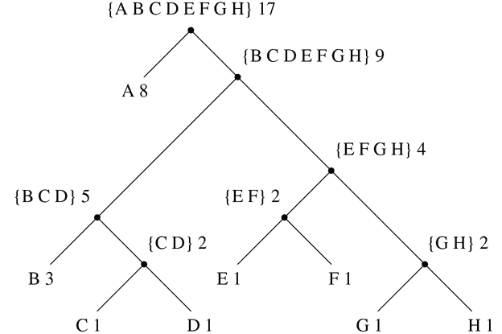

图 2.18 哈夫曼编码树。

给定一个哈夫曼树，我们可以通过从根开始并向下移动，直到到达包含符号的叶子为止，找到任何符号的编码。每次向下移动左分支时，我们将 0 添加到编码中，每次向下移动右分支时，我们将 1 添加到编码中。（我们决定要跟随哪个分支，通过测试看哪个分支是符号的叶节点或包含符号在其集合中。）例如，从图 2.18 的树的根开始，我们通过向右、向左、向右、向右移动到达 D 的叶子；因此，D 的编码是 1011。

使用哈夫曼树解码比特序列时，我们从根开始，使用比特序列的连续零和一来确定是向左还是向右移动。每次到达叶子时，我们在消息中生成一个新的符号，然后我们从树的根重新开始，找到下一个符号。例如，假设我们有上面的树和序列 10001010。从根开始，我们向右移动（因为字符串的第一个位是 1），然后向左移动（因为第二位是 0），然后向左移动（因为第三位也是 0）。这将带我们到 B 的叶子，因此解码消息的第一个符号是 B。现在我们再次从根开始，因为字符串的下一个位是 0，所以我们向左移动。这将带我们到 A 的叶子。然后我们从树的根重新开始，使用剩下的字符串 1010，所以我们向右、左、右、左移动，到达 C。因此，整个消息是 BAC。

##### 生成哈夫曼树

给定一组符号和它们的相对频率的“字母表”，我们如何构建“最佳”编码？（换句话说，哪棵树会用最少的位来编码消息？）赫夫曼提出了一个算法来做到这一点，并证明了所得到的编码确实是相对频率与编码构造时频率匹配的消息的最佳可变长度编码。我们将不在这里证明赫夫曼编码的最优性，但我们将展示赫夫曼树是如何构建的。

生成赫夫曼树的算法非常简单。其思想是安排树，使得频率最低的符号出现在距离根最远的地方。从包含符号和它们的频率的叶子节点集开始，这些频率是根据构造编码的初始数据确定的。现在找到两个权重最低的叶子并合并它们，以产生一个节点，该节点具有这两个节点作为其左右分支。新节点的权重是两个权重的总和。从原始集合中删除这两个叶子，并用这个新节点替换它们。现在继续这个过程。在每一步中，合并两个权重最小的节点，将它们从集合中删除，并用一个节点替换它们，该节点具有这两个节点作为其左右分支。当只剩下一个节点时，即整个树的根节点时，该过程停止。以下是图 2.18 的赫夫曼树是如何生成的：

| 初始叶子 | `{(A 8) (B 3) (C 1) (D 1) (E 1) (F 1) (G 1) (H 1)}` |
| --- | --- |
| 合并 | `{(A 8) (B 3) ({C D} 2) (E 1) (F 1) (G 1) (H 1)}` |
| 合并 | `{(A 8) (B 3) ({C D} 2) ({E F} 2) (G 1) (H 1)}` |
| 合并 | `{(A 8) (B 3) ({C D} 2) ({E F} 2) ({G H} 2)}` |
| 合并 | `{(A 8) (B 3) ({C D} 2) ({E F G H} 4)}` |
| 合并 | `{(A 8) ({B C D} 5) ({E F G H} 4)}` |
| 合并 | `{(A 8) ({B C D E F G H} 9)}` |
| 最终合并 | `{({A B C D E F G H} 17)}` |

该算法并不总是指定一个唯一的树，因为在每一步可能没有唯一的最小权重节点。此外，合并两个节点的顺序（即哪个将成为右分支，哪个将成为左分支）是任意的。

##### 表示赫夫曼树

在下面的练习中，我们将使用一个使用赫夫曼树来编码和解码消息并根据上述算法生成赫夫曼树的系统。我们将首先讨论树是如何表示的。

树的叶子由包含字符串`leaf`，叶子上的符号和权重的列表表示：

```js
function make_leaf(symbol, weight) {
    return list("leaf", symbol, weight);
}
function is_leaf(object) {
    return head(object) === "leaf";
}
function symbol_leaf(x) { return head(tail(x)); }
function weight_leaf(x) { return head(tail(tail(x))); }
```

一棵一般的树将是一个字符串`code_tree`的列表，一个左分支，一个右分支，一组符号和一个权重。符号集将只是符号的列表，而不是一些更复杂的集合表示。当我们通过合并两个节点来构造一棵树时，我们得到树的权重是节点权重的总和，符号集是节点的符号集的并集。由于我们的符号集被表示为列表，我们可以使用我们在 2.2.1 节中定义的`append`函数来形成并集：

```js
function make_code_tree(left, right) {
    return list("code_tree", left, right,
                append(symbols(left), symbols(right)),
                weight(left) + weight(right));
}
```

如果我们以这种方式制作一棵树，我们将有以下选择器：

```js
function left_branch(tree) { return head(tail(tree)); }
function right_branch(tree) { return head(tail(tail(tree))); }
function symbols(tree) {
    return is_leaf(tree)
           ? list(symbol_leaf(tree))
           : head(tail(tail(tail(tree))));
}
function weight(tree) {
    return is_leaf(tree)
           ? weight_leaf(tree)
           : head(tail(tail(tail(tail(tree)))));
}
```

函数`symbols`和`weight`必须根据它们是与叶子还是一般树一起调用而稍有不同。这些是*通用函数*（可以处理多种数据类型的函数）的简单示例，我们将在 2.4 和 2.5 节中有更多关于它们的话要说。

##### 解码函数

以下函数实现了解码算法。它以零和一的列表以及赫夫曼树作为参数。

```js
function decode(bits, tree) {
    function decode_1(bits, current_branch) {
        if (is_null(bits)) {
            return null;
        } else {
            const next_branch = choose_branch(head(bits),
                                              current_branch);
            return is_leaf(next_branch)
                   ? pair(symbol_leaf(next_branch),
                          decode_1(tail(bits), tree))
                   : decode_1(tail(bits), next_branch);
        }
    }
    return decode_1(bits, tree);
}
function choose_branch(bit, branch) {
    return bit === 0
           ? left_branch(branch)
           : bit === 1
           ? right_branch(branch)
           : error(bit, "bad bit – choose_branch");
}
```

函数`decode_1`接受两个参数：剩余位的列表和树中的当前位置。它不断地“向下”移动树，根据列表中的下一个位是零还是一选择左侧或右侧分支。（这是通过函数`choose_branch`完成的。）当它到达叶子时，它返回该叶子上的符号作为消息中的下一个符号，将其与解码消息的其余部分连接起来，从树的根开始。请注意`choose_branch`的最后一个子句中的错误检查，如果函数在输入数据中找到除零或一之外的其他内容，则会发出投诉。

##### 加权元素的集合

在我们对树的表示中，每个非叶节点包含一组符号，我们已经将其表示为一个简单的列表。然而，上面讨论的生成树算法要求我们还要处理叶子和树的集合，依次合并两个最小的项目。由于我们需要重复地在集合中找到最小的项目，因此方便起见，我们使用有序表示来表示这种类型的集合。

我们将一个叶子和树的集合表示为一个元素列表，按权重递增排列。用于构建集合的`adjoin_set`函数与练习 2.61 中描述的类似；然而，项目是按其权重进行比较的，并且要添加到集合中的元素从未在其中。

```js
function adjoin_set(x, set) {
    return is_null(set)
           ? list(x)
           : weight(x) < weight(head(set))
           ? pair(x, set)
           : pair(head(set), adjoin_set(x, tail(set)));
}
```

以下函数接受一个符号-频率对的列表，例如

```js
list(list("A", 4), list("B", 2), list("C", 1), list("D", 1))
```

并构建一个初始的有序叶子集，准备根据 Huffman 算法合并：

```js
function make_leaf_set(pairs) {
    if (is_null(pairs)) {
        return null;
    } else {
        const first_pair = head(pairs);
        return adjoin_set(
                   make_leaf(head(first_pair),        // symbol
                             head(tail(first_pair))), // frequency
                   make_leaf_set(tail(pairs)));
    }
}
```

##### 练习 2.67

声明一个编码树和一个样本消息：

```js
const sample_tree = make_code_tree(make_leaf("A", 4),
                                   make_code_tree(make_leaf("B", 2),
                                                  make_code_tree(
                                                      make_leaf("D", 1),
                                                      make_leaf("C", 1))));
const sample_message = list(0, 1, 1, 0, 0, 1, 0, 1, 0, 1, 1, 1, 0);
```

使用`decode`函数解码消息，并给出结果。

##### 练习 2.68

`encode`函数以消息和树作为参数，并生成给定编码消息的位列表。

```js
function encode(message, tree) {
    return is_null(message)
           ? null
           : append(encode_symbol(head(message), tree),
                    encode(tail(message), tree));
}
```

函数`encode_symbol`由你编写，返回根据给定树对给定符号进行编码的位列表。你应该设计`encode_symbol`，以便如果符号根本不在树中，则发出错误信号。通过使用样本树对你在练习 2.67 中获得的结果进行编码，并查看它是否与原始样本消息相同来测试你的函数。

##### 练习 2.69

以下函数以其参数为一个符号-频率对的列表（其中没有一个符号出现在多个对中），并根据 Huffman 算法生成 Huffman 编码树。

```js
function generate_huffman_tree(pairs) {
    return successive_merge(make_leaf_set(pairs));
}
```

将转换成一个有序叶子集的`make_leaf_set`函数如上所示。使用`make_code_tree`编写`successive_merge`函数，以便连续合并集合中最小权重的元素，直到只剩下一个元素，即所需的 Huffman 树。（这个函数有点棘手，但并不是真的复杂。如果你发现自己设计了一个复杂的函数，那么你几乎肯定做错了什么。你可以充分利用我们使用有序集合表示的事实。）

##### 练习 2.70

以下带有相关相对频率的八个符号字母表被设计用来高效地编码 1950 年代摇滚歌曲的歌词。（注意，“字母表”的“符号”不一定是单个字母。）

| A | 2 | NA | 16 |
| --- | --- | --- | --- |
| BOOM | 1 | SHA | 3 |
| GET | 2 | YIP | 9 |
| JOB | 2 | WAH | 1 |

使用`generate_huffman_tree`（练习 2.69）生成相应的 Huffman 树，并使用`encode`（练习 2.68）对以下消息进行编码：

```js
找一份工作

Sha na na na na na na na na

找一份工作

Sha na na na na na na na na

Wah yip yip yip yip yip yip yip yip yip

Sha boom
```

需要多少位来进行编码？如果我们对这个八个符号字母表使用固定长度编码，那么需要的最小位数是多少？

##### 练习 2.71

假设我们有一个用于`n`个符号的赫夫曼树，并且符号的相对频率为`1, 2, 4, ..., 2^(n–1)`。为`n=5`绘制树；为`n=10`绘制树。在这样的树中（对于一般的`n`），编码最频繁的符号需要多少位？最不频繁的符号呢？

##### 练习 2.72

考虑您在练习 2.68 中设计的编码函数。编码一个符号所需步骤的增长顺序是多少？确保包括在每个遇到的节点上搜索符号列表所需的步骤数。一般来说，回答这个问题是困难的。考虑相对频率如练习 2.71 中描述的`n`个符号的特殊情况，并给出编码字母表中最频繁和最不频繁的符号所需步骤数的增长顺序（作为`n`的函数）。

## 2.4 抽象数据的多重表示

我们引入了数据抽象，这是一种构建系统的方法，使得程序的大部分内容可以独立于实现程序操作的数据对象的选择而指定。例如，我们在 2.1.1 节中看到了如何将设计使用有理数的程序的任务与使用计算机语言的原始机制构造复合数据的任务分开。关键思想是建立一个抽象屏障——在这种情况下，有理数的选择器和构造器（`make_rat`、`numer`、`denom`）——它将有理数的使用方式与它们在列表结构方面的底层表示隔离开来。类似的抽象屏障将执行有理数算术的函数的细节（`add_rat`、`sub_rat`、`mul_rat`和`div_rat`）与使用有理数的“高级”函数隔离开来。生成的程序的结构如图 2.1 所示。

这些数据抽象屏障是控制复杂性的强大工具。通过隔离数据对象的底层表示，我们可以将设计大型程序的任务分解为可以分开执行的较小任务。但这种数据抽象还不够强大，因为对于数据对象来说，“底层表示”并不总是有意义的。

首先，一个数据对象可能有多个有用的表示方式，我们可能希望设计可以处理多个表示的系统。举个简单的例子，复数可以用两种几乎等效的方式表示：直角坐标形式（实部和虚部）和极坐标形式（幅度和角度）。有时直角坐标形式更合适，有时极坐标形式更合适。事实上，可以想象一个系统，其中复数以两种方式表示，并且用于操作复数的函数可以使用任一种表示。

更重要的是，编程系统通常是由许多人在较长时间内共同设计的，受到随时间变化的要求的影响。在这样的环境中，不可能让每个人事先就数据表示的选择达成一致。因此，除了将表示与使用隔离的数据抽象屏障之外，我们还需要将不同的设计选择与其他选择隔离开，并允许不同的选择在单个程序中共存。此外，由于大型程序通常是通过组合先前独立设计的模块创建的，我们需要一些约定，允许程序员将模块“增量”地合并到更大的系统中，即无需重新设计或重新实现这些模块。

在本节中，我们将学习如何处理可能由程序的不同部分以不同方式表示的数据。这需要构建*通用函数*——可以操作以多种方式表示的数据的函数。我们构建通用函数的主要技术是使用*类型标签*的数据对象，即包含有关如何处理它们的显式信息的数据对象。我们还将讨论*数据导向*编程，这是一种强大而方便的实现策略，用于通过加法组装具有通用操作的系统。

我们从简单的复数示例开始。我们将看到类型标签和数据导向风格如何使我们能够为复数设计独立的矩形和极坐标表示，同时保持抽象“复数”数据对象的概念。我们将通过定义复数的算术函数（`add_complex`、`sub_complex`、`mul_complex`和`div_complex`）来实现这一点，这些函数是基于通用选择器定义的，这些选择器可以访问复数的部分，而不考虑数字的表示方式。如图 2.19 所示，得到的复数系统包含两种不同的抽象屏障。 “水平”抽象屏障起到与图 2.1 中相同的作用。它们将“高级”操作与“低级”表示隔离开来。此外，还有一个“垂直”屏障，使我们能够分别设计和安装替代表示。

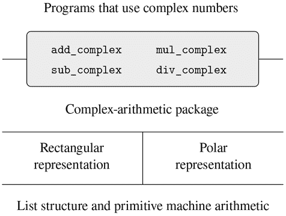

图 2.19 复数系统中的数据抽象屏障。

在第 2.5 节中，我们将展示如何使用类型标签和数据导向风格来开发通用算术包。这提供了函数（`add`、`mul`等），可以用于操作各种“数字”，并且在需要新类型的数字时可以轻松扩展。在第 2.5.3 节中，我们将展示如何在执行符号代数的系统中使用通用算术。

### 2.4.1 复数的表示

我们将开发一个系统，它可以对复数执行算术运算，这是一个简单但不切实际的示例，用于使用通用操作的程序。我们首先讨论复数的两种合理表示形式：有序对的矩形形式（实部和虚部）和极坐标形式（大小和角度）。第 2.4.2 节将展示如何通过使用类型标签和通用操作，使这两种表示可以在单个系统中共存。

与有理数一样，复数自然地表示为有序对。复数集可以被看作是一个二维空间，有两个正交轴，“实”轴和“虚”轴。（见图 2.20。）从这个角度来看，复数`z = x + iy`（其中`i² = –1`）可以被看作是平面上的点，其实部是`x`，虚部是`y`。复数的加法在这种表示中减少到坐标的加法：

```js
Real-part(z[1] + z[2])  =  Real-part(z[1]) + Real-part(z[2]) 
Imaginary-part(z[1] + z[2])  =  Imaginary-part(z[1]) + Imaginary-part(z[2]) 
```

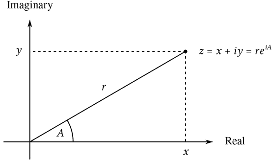

图 2.20 复数作为平面上的点。

当乘法复数时，更自然地考虑以极坐标形式表示复数，即大小和角度（图 2.20 中的`r`和`A`）。两个复数的乘积是通过拉伸一个复数的长度并通过另一个复数的角度旋转得到的向量：

```js
Magnitude(z[1] · z[2])  =  Magnitude(z[1]) · Magnitude(z[2]) 

Angle(z[1] · z[2])  =  Angle(z[1]) + Angle(z[2]) 
```

因此，复数有两种不同的表示形式，适用于不同的操作。然而，从使用复数的程序编写者的角度来看，数据抽象原则表明，无论计算机使用哪种表示形式，都应该提供操纵复数的所有操作。例如，通常有用的是能够找到由矩形坐标指定的复数的幅值。同样，通常有用的是能够确定由极坐标指定的复数的实部。

为了设计这样一个系统，我们可以遵循与在 2.1.1 节中设计有理数包时相同的数据抽象策略。假设复数的操作是根据四个选择器实现的：`real_part`、`imag_part`、`magnitude`和`angle`。还假设我们有两个用于构造复数的函数：`make_from_real_imag`返回具有指定实部和虚部的复数，`make_from_mag_ang`返回具有指定幅值和角度的复数。这些函数具有这样的属性，对于任何复数`z`，都有

```js
make_from_real_imag(real_part(z), imag_part(z));
```

和

```js
make_from_mag_ang(magnitude(z), angle(z));
```

产生等于`z`的复数。

使用这些构造函数和选择器，我们可以使用构造函数和选择器指定的“抽象数据”来实现复数的算术运算，就像我们在 2.1.1 节中对有理数所做的那样。如上面的公式所示，我们可以根据实部和虚部相加和相减复数，而根据幅值和角度相乘和相除复数：

```js
function add_complex(z1, z2) {
    return make_from_real_imag(real_part(z1) + real_part(z2),
                               imag_part(z1) + imag_part(z2));
}
function sub_complex(z1, z2) {
    return make_from_real_imag(real_part(z1) - real_part(z2),
                               imag_part(z1) - imag_part(z2));
}
function mul_complex(z1, z2) {
    return make_from_mag_ang(magnitude(z1) * magnitude(z2),
                             angle(z1) + angle(z2));
}
function div_complex(z1, z2) {
    return make_from_mag_ang(magnitude(z1) / magnitude(z2),
                             angle(z1) - angle(z2));
}
```

为了完成复数包，我们必须选择一种表示，并且必须根据原始数字和原始列表结构实现构造函数和选择器。有两种明显的方法可以做到这一点：我们可以将复数表示为“矩形形式”，即一对（实部，虚部），或者将其表示为“极坐标形式”，即一对（幅值，角度）。我们应该选择哪一种呢？

为了使不同的选择具体化，想象有两个程序员，Ben Bitdiddle 和 Alyssa P. Hacker，他们独立设计复数系统的表示。Ben 选择用矩形形式表示复数。通过这种选择，选择复数的实部和虚部是直接的，就像构造具有给定实部和虚部的复数一样。为了找到幅值和角度，或者构造具有给定幅值和角度的复数，他使用三角关系

```js
 x = r cos A  
 r = √(x² + y²)

 y = r sin A  
 A = arctan(y, x) 
```

这些关系将实部和虚部`(x, y)`与幅值和角度`(r, A)`联系起来。因此，Ben 的表示由以下选择器和构造函数给出：

```js
function real_part(z) { return head(z); }
function imag_part(z) { return tail(z); }
function magnitude(z) {
    return math_sqrt(square(real_part(z)) + square(imag_part(z)));
}
function angle(z) {
    return math_atan2(imag_part(z), real_part(z));
}
function make_from_real_imag(x, y) { return pair(x, y); }

function make_from_mag_ang(r, a) {
    return pair(r * math_cos(a), r * math_sin(a));
}
```

相比之下，Alyssa 选择用极坐标形式表示复数。对她来说，选择幅值和角度是直接的，但她必须使用三角关系来获得实部和虚部。Alyssa 的表示是：

```js
function real_part(z) {
    return magnitude(z) * math_cos(angle(z));
}
function imag_part(z) {
    return magnitude(z) * math_sin(angle(z));
}
function magnitude(z) { return head(z); }
function angle(z) { return tail(z); }
function make_from_real_imag(x, y) {
    return pair(math_sqrt(square(x) + square(y)),
                math_atan2(y, x));
}
function make_from_mag_ang(r, a) { return pair(r, a); }
```

数据抽象的学科确保`add_complex`、`sub_complex`、`mul_complex`和`div_complex`的相同实现将适用于 Ben 的表示或 Alyssa 的表示。

### 2.4.2 标记数据

将数据抽象视为“最小承诺原则”的应用之一。在 2.4.1 节中实现复数系统时，我们可以使用 Ben 的矩形表示或 Alyssa 的极坐标表示。由选择器和构造函数形成的抽象屏障使我们能够在最后可能的时刻推迟对数据对象的具体表示的选择，从而在系统设计中保留最大的灵活性。

最小承诺原则可以被推到更极端的程度。如果我们愿意，甚至可以在设计选择器和构造器之后保持表示的模糊性，并选择同时使用本的表示和 Alyssa 的表示。然而，如果两种表示都包含在一个系统中，我们将需要一些方法来区分极坐标形式的数据和矩形形式的数据。否则，例如，如果我们被要求找到一对（3，4）的“大小”，我们将不知道是回答 5（解释为矩形形式的数字）还是 3（解释为极坐标形式的数字）。实现这种区分的一种简单方法是在每个复数中包含一个*类型标签*——字符串“矩形”或“极坐标”。然后，当我们需要操作一个复数时，我们可以使用标签来决定应用哪个选择器。

为了操作带标签的数据，我们将假设我们有函数`type_tag`和`contents`，它们从数据对象中提取标签和实际内容（在复数的情况下是极坐标或矩形坐标）。我们还假设有一个函数`attach_tag`，它接受标签和内容，并产生一个带标签的数据对象。实现这一点的一种简单方法是使用普通的列表结构：

```js
function attach_tag(type_tag, contents) {
    return pair(type_tag, contents);
}
function type_tag(datum) {
    return is_pair(datum)
           ? head(datum)
           : error(datum, "bad tagged datum – type_tag");
}
function contents(datum) {
    return is_pair(datum)
           ? tail(datum)
           : error(datum, "bad tagged datum – contents");
}
```

使用`type_tag`，我们可以定义谓词`is_rectangular`和`is_polar`，分别识别矩形和极坐标数：

```js
function is_rectangular(z) {
    return type_tag(z) === "rectangular";
}
function is_polar(z) {
    return type_tag(z) === "polar";
}
```

有了类型标签，Ben 和 Alyssa 现在可以修改他们的代码，使得他们的两种不同表示可以在同一个系统中共存。每当 Ben 构造一个复数时，他将其标记为矩形。每当 Alyssa 构造一个复数时，她将其标记为极坐标。此外，Ben 和 Alyssa 必须确保他们的函数名称不冲突。一种方法是让 Ben 在他的每个表示函数的名称后附加后缀`rectangular`，让 Alyssa 在她的函数名称后附加`polar`。这是 Ben 修改后的矩形表示，来自第 2.4.1 节：

```js
function real_part_rectangular(z) { return head(z); }
function imag_part_rectangular(z) { return tail(z); }
function magnitude_rectangular(z) {
    return math_sqrt(square(real_part_rectangular(z)) +
                     square(imag_part_rectangular(z)));
}
function angle_rectangular(z) {
    return math_atan(imag_part_rectangular(z),
                     real_part_rectangular(z));
}
function make_from_real_imag_rectangular(x, y) {
    return attach_tag("rectangular", pair(x, y));
}
function make_from_mag_ang_rectangular(r, a) {
    return attach_tag("rectangular",
                      pair(r * math_cos(a), r * math_sin(a)));
}
```

这是 Alyssa 修改后的极坐标表示：

```js
function real_part_polar(z) {
    return magnitude_polar(z) * math_cos(angle_polar(z));
}
function imag_part_polar(z) {
    return magnitude_polar(z) * math_sin(angle_polar(z));
}
function magnitude_polar(z) { return head(z); }
function angle_polar(z) { return tail(z); }
function make_from_real_imag_polar(x, y) {
    return attach_tag("polar",
                      pair(math_sqrt(square(x) + square(y)),
                           math_atan(y, x)));
}
function make_from_mag_ang_polar(r, a) {
    return attach_tag("polar", pair(r, a));
}
```

每个通用选择器都被实现为一个函数，该函数检查其参数的标签，并调用处理该类型数据的适当函数。例如，要获得复数的实部，`real_part`检查标签以确定是使用 Ben 的`real_part_rectangular`还是 Alyssa 的`real_part_polar`。在任何一种情况下，我们使用`contents`来提取裸的、未标记的数据，并根据需要将其发送到矩形或极坐标函数：

```js
function real_part(z) {
    return is_rectangular(z)
           ? real_part_rectangular(contents(z))
           : is_polar(z)
           ? real_part_polar(contents(z))
           : error(z, "unknown type – real_part");
}
function imag_part(z) {
    return is_rectangular(z)
           ? imag_part_rectangular(contents(z))
           : is_polar(z)
           ? imag_part_polar(contents(z))
           : error(z, "unknown type – imag_part");
}
function magnitude(z) {
    return is_rectangular(z)
           ? magnitude_rectangular(contents(z))
           : is_polar(z)
           ? magnitude_polar(contents(z))
           : error(z, "unknown type – magnitude");
}
function angle(z) {
    return is_rectangular(z)
           ? angle_rectangular(contents(z))
           : is_polar(z)
           ? angle_polar(contents(z))
           : error(z, "unknown type – angle");
}
```

为了实现复数算术运算，我们可以使用第 2.4.1 节中的相同函数`add_complex`、`sub_complex`、`mul_complex`和`div_complex`，因为它们调用的选择器是通用的，所以可以与任何表示一起使用。例如，函数`add_complex`仍然是

```js
function add_complex(z1, z2) {
    return make_from_real_imag(real_part(z1) + real_part(z2),
                               imag_part(z1) + imag_part(z2));
}
```

最后，我们必须选择是使用本的表示法还是 Alyssa 的表示法来构造复数。一个合理的选择是，每当我们有实部和虚部时构造矩形数，每当我们有大小和角度时构造极坐标数：

```js
function make_from_real_imag(x, y) {
    return make_from_real_imag_rectangular(x, y);
}
function make_from_mag_ang(r, a) {
    return make_from_mag_ang_polar(r, a);
}
```

生成的复数系统的结构如图 2.21 所示。该系统已被分解为三个相对独立的部分：复数算术运算、Alyssa 的极坐标实现和 Ben 的矩形实现。极坐标和矩形实现可以由本和 Alyssa 分别编写，并且这两者都可以作为第三个程序员在抽象构造器/选择器接口的基础表示来实现复数算术函数。

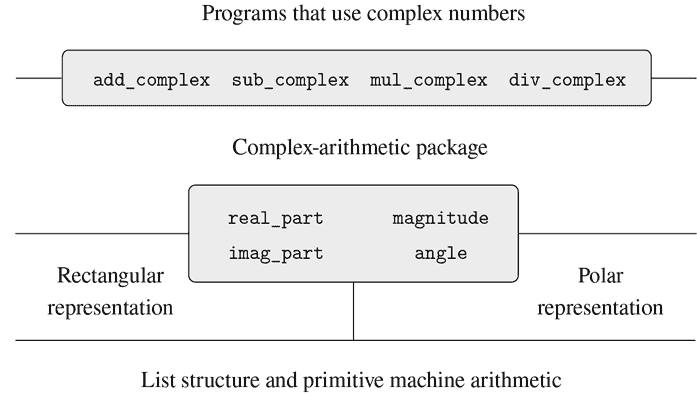

图 2.21 通用复数算术系统的结构。

由于每个数据对象都带有其类型标记，因此选择器以通用方式对数据进行操作。也就是说，每个选择器被定义为具有取决于其应用的特定数据类型的行为。注意将各个表示接口化的一般机制：在给定的表示实现中（比如，艾莉莎的极坐标包），复数是一个无类型的对（幅度，角度）。当通用选择器对`polar`类型的数字进行操作时，它会去掉标记并将内容传递给艾莉莎的代码。相反，当艾莉莎构造一个用于一般用途的数字时，她会给它打上一个类型标记，以便它可以被高级函数适当地识别。随着数据对象从一个级别传递到另一个级别时，去掉和附加标记的这种纪律可以成为一种重要的组织策略，我们将在第 2.5 节中看到。

### 2.4.3 数据导向编程和可加性

检查数据类型并调用适当的函数的一般策略称为*类型分派*。这是在系统设计中获得模块化的强大策略。另一方面，像在第 2.4.2 节中实现分派的方法有两个显著的弱点。一个弱点是通用接口函数（`real_part`、`imag_part`、`magnitude`和`angle`）必须了解所有不同的表示。例如，假设我们想将新的复数表示合并到我们的复数系统中。我们需要用类型标识这个新表示，然后在每个通用接口函数中添加一个子句，以检查新类型并应用该表示的适当选择器。

该技术的另一个弱点是，即使可以单独设计各个表示，我们必须保证整个系统中没有两个函数具有相同的名称。这就是为什么本和艾莉莎不得不更改他们在第 2.4.1 节中的原始函数的名称。

这两个弱点的根本问题是实现通用接口的技术不是*可加的*。实现通用选择器函数的人必须每次安装新表示时修改这些函数，而接口各个表示的人必须修改他们的代码以避免名称冲突。在这些情况下，必须对代码进行的更改是直截了当的，但仍然必须进行这些更改，这是一种不便和错误的来源。对于复数系统来说，这并不是什么大问题，但是假设复数有数百种不同的表示，而不是两种。假设抽象数据接口中有许多通用选择器需要维护。事实上，假设没有一个程序员知道所有接口函数或所有表示。这个问题是真实存在的，必须在大规模数据库管理系统等程序中加以解决。

我们需要的是进一步模块化系统设计的手段。这是由编程技术*数据导向编程*提供的。要理解数据导向编程的工作原理，首先观察一下，每当我们处理一组通用操作，这些操作对一组不同类型都是通用的时候，实际上，我们正在处理一个二维表，该表包含一个轴上可能的操作和另一个轴上可能的类型。表中的条目是为每种类型的参数实现每个操作的函数。在前一节中开发的复数系统中，操作名称、数据类型和实际函数之间的对应关系分散在通用接口函数的各种条件子句中。但是相同的信息可以组织在一个表中，如图 2.22 所示。

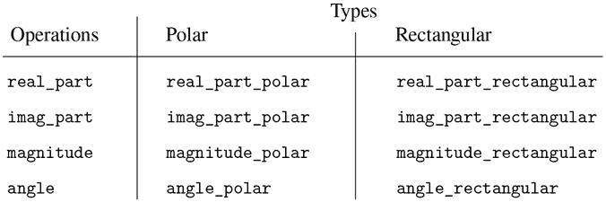

图 2.22 复数系统的操作表。

数据导向编程是一种直接设计程序与这样一个表一起工作的技术。以前，我们实现了将复数算术代码与两个表示包接口化的机制，作为一组函数，每个函数都对类型进行显式分派。在这里，我们将实现接口作为一个单一函数，该函数查找表中的操作名称和参数类型的组合，以找到正确的应用函数，然后将其应用于参数的内容。如果我们这样做，那么要向系统添加新的表示包，我们不需要更改任何现有的函数；我们只需要向表中添加新条目。

为了实现这个计划，假设我们有两个函数`put`和`get`，用于操作操作和类型表：

+   `put(op, type, item)`

    将`item`安装在表中，由`op`和`type`索引。

+   `get(op, type)`

    查找表中的`op`、`type`条目，并返回找到的项目。如果找不到项目，`get`返回一个唯一的原始值，该值由名称`undefined`引用，并由原始谓词`is_undefined`识别。

现在，我们可以假设`put`和`get`包含在我们的语言中。在第 3 章（第 3.3.3 节）中，我们将看到如何实现这些和其他操作来操作表。

以下是数据导向编程如何在复数系统中使用。开发了矩形表示的 Ben，实现他的代码就像他最初做的那样。他定义了一组函数或*包*，并通过向表中添加条目来将其接口化，告诉系统如何在矩形数上操作。这是通过调用以下函数完成的：

```js
function install_rectangular_package() {
    // internal functions
    function real_part(z) { return head(z); }
    function imag_part(z) { return tail(z); }
    function make_from_real_imag(x, y) { return pair(x, y); }
    function magnitude(z) {
        return math_sqrt(square(real_part(z)) + square(imag_part(z)));
    }
    function angle(z) {
        return math_atan(imag_part(z), real_part(z));
    }
    function make_from_mag_ang(r, a) {
        return pair(r * math_cos(a), r * math_sin(a));
    }

    // interface to the rest of the system
    function tag(x) { return attach_tag("rectangular", x); }
    put("real_part", list("rectangular"), real_part);
    put("imag_part", list("rectangular"), imag_part);
    put("magnitude", list("rectangular"), magnitude);
    put("angle", list("rectangular"), angle);
    put("make_from_real_imag", "rectangular",
        (x, y) => tag(make_from_real_imag(x, y)));
    put("make_from_mag_ang", "rectangular",
        (r, a) => tag(make_from_mag_ang(r, a)));
    return "done";
}
```

请注意，这里的内部函数与第 2.4.1 节中 Ben 在孤立工作时编写的相同函数。为了将它们接口化到系统的其余部分，不需要进行任何更改。此外，由于这些函数声明是内部的安装函数，Ben 不必担心与矩形包外的其他函数名称冲突。为了将这些接口化到系统的其余部分，Ben 将他的`real_part`函数安装在操作名称`real_part`和类型`list("rectangular")`下，其他选择器也是如此。接口还定义了外部系统要使用的构造函数。这些与 Ben 内部定义的构造函数相同，只是它们附加了标签。

Alyssa 的极坐标包类似：

```js
function install_polar_package() {
    // internal functions
    function magnitude(z) { return head(z); }
    function angle(z) { return tail(z); }
    function make_from_mag_ang(r, a) { return pair(r, a); }
    function real_part(z) {
        return magnitude(z) * math_cos(angle(z));
    }
    function imag_part(z) {
        return magnitude(z) * math_sin(angle(z));
    }
    function make_from_real_imag(x, y) {
        return pair(math_sqrt(square(x) + square(y)),
                    math_atan(y, x));
    }    

    // interface to the rest of the system
    function tag(x) { return attach_tag("polar", x); }
    put("real_part", list("polar"), real_part);
    put("imag_part", list("polar"), imag_part);
    put("magnitude", list("polar"), magnitude);
    put("angle", list("polar"), angle);
    put("make_from_real_imag", "polar",
        (x, y) => tag(make_from_real_imag(x, y)));
    put("make_from_mag_ang", "polar",
        (r, a) => tag(make_from_mag_ang(r, a)));
    return "done";
}
```

尽管 Ben 和 Alyssa 仍然使用彼此相同名称的原始函数（例如`real_part`），但这些声明现在是内部不同函数的（参见第 1.1.8 节），因此没有名称冲突。

复数算术选择器通过一个名为`apply_generic`的通用“操作”函数访问表，该函数将通用操作应用于一些参数。函数`apply_generic`在表中查找操作的名称和参数的类型，并在存在的情况下应用结果函数。

```js
function apply_generic(op, args) {
    const type_tags = map(type_tag, args);
    const fun = get(op, type_tags);
    return ! is_undefined(fun)
           ? apply_in_underlying_javascript(fun, map(contents, args))
           : error(list(op, type_tags),
                   "no method for these types – apply_generic");
}
```

使用`apply_generic`，我们可以定义我们的通用选择器如下：

```js
function real_part(z) { return apply_generic("real_part", list(z)); }
function imag_part(z) { return apply_generic("imag_part", list(z)); }
function magnitude(z) { return apply_generic("magnitude", list(z)); }
function angle(z)     { return apply_generic("angle", list(z));     }
```

注意，如果系统中添加了新的表示，这些都不会改变。

我们还可以从表中提取构造函数，供程序包外的程序使用，从实部和虚部以及从幅度和角度构造复数。与第 2.4.2 节一样，我们在有实部和虚部时构造矩形数，在有幅度和角度时构造极坐标数：

```js
function make_from_real_imag(x, y) {
    return get("make_from_real_imag", "rectangular")(x, y);
}
function make_from_mag_ang(r, a) {
    return get("make_from_mag_ang", "polar")(r, a);
}
```

##### 练习 2.73

第 2.3.2 节描述了一个执行符号微分的程序：

```js
function deriv(exp, variable) {
    return is_number(exp)
           ? 0
           : is_variable(exp)
           ? is_same_variable(exp, variable) ? 1 : 0
           : is_sum(exp)
           ? make_sum(deriv(addend(exp), variable),
                      deriv(augend(exp), variable))
           : is_product(exp)
           ? make_sum(make_product(multiplier(exp),
                                   deriv(multiplicand(exp), variable)),
                      make_product(deriv(multiplier(exp), variable),
                                   multiplicand(exp)))
           // more rules can be added here
           : error(exp, "unknown expression type – deriv");
}
deriv(list("*", list("*", "x", "y"), list("+", "x", 4)), "x");
list("+", list("*", list("*", x, y), list("+", 1, 0)),
          list("*", list("+", list("*", x, 0), list("*", 1, y)),
                    list("+", x, 4)))
```

我们可以将这个程序视为对要进行区分的表达式类型进行调度。在这种情况下，数据的“类型标签”是代数运算符号（如`+`），正在执行的操作是`deriv`。我们可以通过将基本导数函数重写为数据导向风格来将这个程序转换为数据导向风格

```js
function deriv(exp, variable) {
    return is_number(exp)
           ? 0
           : is_variable(exp)
           ? is_same_variable(exp, variable) ? 1 : 0
           : get("deriv", operator(exp))(operands(exp), variable);
}
function operator(exp) { return head(exp); }
function operands(exp) { return tail(exp); }
```

1.  a. 解释上面做了什么。为什么我们不能将谓词`is_number`和`is_variable`合并到数据导向调度中？

1.  b. 编写求和和乘积的导数函数，以及安装它们在上面程序使用的表中所需的辅助代码。

1.  c. 选择任何你喜欢的额外区分规则，比如指数的规则（练习 2.56），并将其安装在这个数据导向系统中。

1.  d. 在这个简单的代数操作程序中，表达式的类型是将其绑定在一起的代数运算符。然而，假设我们以相反的方式索引函数，使得`deriv`中的调度行看起来像

    ```js
    get(operator(exp), "deriv")(operands(exp), variable);
    ```

    对导数系统的相应更改是什么？

##### 练习 2.74

Insatiable Enterprises, Inc.是一个高度分散的企业集团公司，由遍布全球的大量独立部门组成。该公司的计算机设施刚刚通过一种巧妙的网络接口方案相互连接，使得整个网络对任何用户来说都像是一台单一的计算机。Insatiable 的总裁在首次尝试利用网络从部门档案中提取行政信息时，惊讶地发现，尽管所有部门的档案都以 JavaScript 中的数据结构实现，但使用的特定数据结构因部门而异。部门经理们匆忙召开会议，寻求一种整合档案的策略，既能满足总部的需求，又能保留部门的现有自治权。

展示如何使用数据导向编程实现这样的策略。例如，假设每个部门的人事档案都包含一个单一文件，其中包含以员工姓名为键的一组记录。集合的结构因部门而异。此外，每个员工的记录本身是一个集合（在不同部门结构不同），其中包含以`address`和`salary`为标识的信息。特别是：

1.  a. 为总部实现一个`get_record`函数，该函数从指定的人事档案中检索指定员工的记录。该函数应适用于任何部门的档案。解释个别部门的档案应该如何结构化。特别是，必须提供什么类型的信息？

1.  b. 为总部实现一个`get_salary`函数，该函数从任何部门的人事档案中返回给定员工的薪水信息。为了使此操作起作用，记录应该如何结构化？

1.  c. 为总部实现一个`find_employee_record`函数。这个函数应该搜索所有部门的档案，找到给定员工的记录并返回记录。假设这个函数的参数是员工的姓名和所有部门档案的列表。

1.  d. 当贪婪公司接管新公司时，必须进行哪些更改才能将新员工信息整合到中央系统中？

##### 消息传递

数据导向编程的关键思想是通过显式处理操作和类型表来处理程序中的通用操作，比如图 2.22 中的表。我们在 2.4.2 节中使用的编程风格通过让每个操作负责自己的调度来组织所需的类型调度。实际上，这将操作和类型表分解为行，每个通用操作函数代表表的一行。

另一种实现策略是将表分解为列，而不是使用在数据类型上分派的“智能操作”，而是使用在操作名称上分派的“智能数据对象”。我们可以通过安排事物，使得数据对象，如矩形数，表示为一个函数，该函数以所需的操作名称作为输入，并执行指示的操作。在这样的学科中，`make_from_real_imag`可以被写成

```js
function make_from_real_imag(x, y) {
    function dispatch(op) {
        return op === "real_part"
               ? x
               : op === "imag_part"
               ? y
               : op === "magnitude"
               ? math_sqrt(square(x) + square(y))
               : op === "angle"
               ? math_atan(y, x)
               : error(op, "unknown op – make_from_real_imag");
    }
    return dispatch;
}
```

相应的`apply_generic`函数，将通用操作应用于参数，现在只需将操作名称传递给数据对象，让对象完成工作：⁴⁵

```js
function apply_generic(op, arg) { return head(arg)(op); }
```

请注意，`make_from_real_imag`返回的值是一个函数——内部的`dispatch`函数。这是在`apply_generic`请求执行操作时调用的函数。

这种编程风格称为*消息传递*。这个名字来自这样一个形象，即数据对象是一个接收所请求的操作名称作为“消息”的实体。我们已经在第 2.1.3 节中看到了消息传递的一个例子，在那里我们看到了如何定义`pair`，`head`和`tail`，而不是数据对象，而只是函数。在这里，我们看到消息传递不是一个数学技巧，而是一种组织具有通用操作的系统的有用技术。在本章的其余部分，我们将继续使用数据导向编程，而不是消息传递，来讨论通用算术操作。在第 3 章中，我们将回到消息传递，并且我们将看到它可以是一种构建仿真程序的强大工具。

##### 练习 2.75

以消息传递方式实现构造函数`make_from_mag_ang`。这个函数应该类似于上面给出的`make_from_real_imag`函数。

##### 练习 2.76

随着具有通用操作的大型系统的发展，可能需要新类型的数据对象或新操作。对于三种策略——具有显式分派的通用操作、数据导向风格和消息传递风格——描述必须对系统进行的更改，以添加新类型或新操作。对于经常需要添加新类型的系统，哪种组织方式最合适？对于经常需要添加新操作的系统，哪种组织方式最合适？

## 2.5 具有通用操作的系统

在前一节中，我们看到了如何设计系统，其中数据对象可以以多种方式表示。关键思想是通过通用接口函数将指定数据操作的代码与多种表示链接起来。现在我们将看到如何使用相同的思想，不仅定义可以适用于不同表示的操作，还可以定义可以适用于不同类型参数的操作。我们已经看到了几种不同的算术操作包：语言内置的原始算术（`+`，`-`，`*`，`/`），第 2.1.1 节中的有理数算术（`add_rat`，`sub_rat`，`mul_rat`，`div_rat`），以及我们在第 2.4.3 节中实现的复数算术。现在我们将使用数据导向技术来构建一个包含我们已经构建的所有算术包的算术操作包。

图 2.23 显示了我们将构建的系统的结构。注意抽象屏障。从使用“数字”的人的角度来看，有一个单一的函数`add`，它对提供的任何数字进行操作。函数`add`是通用接口的一部分，它允许使用数字的程序以统一的方式访问单独的普通算术、有理算术和复数算术包。任何单独的算术包（如复数包）本身可以通过通用函数（如`add_complex`）访问，这些函数结合了为不同表示设计的包（如矩形和极坐标）。此外，系统的结构是可加性的，因此可以单独设计各个算术包，并将它们组合以产生通用算术系统。

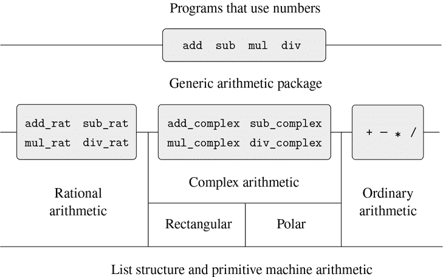

图 2.23 通用算术系统。

### 2.5.1 通用算术操作

设计通用算术操作的任务类似于设计通用复数操作。例如，我们希望有一个通用加法函数`add`，它在普通数字上的行为类似于普通原始加法`+`，在有理数上类似于`add_rat`，在复数上类似于`add_complex`。我们可以通过遵循与我们在 2.4.3 节中用于实现复数的通用选择器相同的策略来实现`add`和其他通用算术操作。我们将为每种数字类型附加一个类型标签，并使通用函数根据其参数的数据类型分派到适当的包。

通用算术函数定义如下：

```js
function add(x, y) { return apply_generic("add", list(x, y)); }
function sub(x, y) { return apply_generic("sub", list(x, y)); }
function mul(x, y) { return apply_generic("mul", list(x, y)); }
function div(x, y) { return apply_generic("div", list(x, y)); }
```

我们首先安装一个用于处理*普通*数字的包，即我们语言的原始数字。我们用字符串`javascript_number`标记这些数字。此包中的算术操作是原始算术函数（因此无需定义额外的函数来处理未标记的数字）。由于这些操作每个都需要两个参数，它们被安装在由列表`list("javascript_number", "javascript_number")`键入的表中。

```js
function install_javascript_number_package() {
    function tag(x) {
        return attach_tag("javascript_number", x);
    }
    put("add", list("javascript_number", "javascript_number"),
        (x, y) => tag(x + y));
    put("sub", list("javascript_number", "javascript_number"),
        (x, y) => tag(x - y));
    put("mul", list("javascript_number", "javascript_number"),
        (x, y) => tag(x * y));
    put("div", list("javascript_number", "javascript_number"),
        (x, y) => tag(x / y));
    put("make", "javascript_number",
        x => tag(x));
    return "done";
}
```

JavaScript-number 包的用户将通过函数创建（标记）普通数字：

```js
function make_javascript_number(n) {
    return get("make", "javascript_number")(n);
}
```

现在通用算术系统的框架已经建立，我们可以轻松地包含新类型的数字。这是一个执行有理数算术的包。注意，由于可加性的好处，我们可以在包中使用 2.1.1 节中的有理数代码作为内部函数，而无需修改：

```js
function install_rational_package() {
    // internal functions
    function numer(x) { return head(x); }
    function denom(x) { return tail(x); }
    function make_rat(n, d) {
        const g = gcd(n, d);
        return pair(n / g, d / g);
    }
    function add_rat(x, y) {
        return make_rat(numer(x) * denom(y) + numer(y) * denom(x),
                        denom(x) * denom(y));
    }
    function sub_rat(x, y) {
        return make_rat(numer(x) * denom(y) - numer(y) * denom(x),
                        denom(x) * denom(y));
    }
    function mul_rat(x, y) {
        return make_rat(numer(x) * numer(y),
                        denom(x) * denom(y));
    }
    function div_rat(x, y) {
        return make_rat(numer(x) * denom(y),
                        denom(x) * numer(y));
    }
    // interface to rest of the system
    function tag(x) {
        return attach_tag("rational", x);
    }
    put("add", list("rational", "rational"),
        (x, y) => tag(add_rat(x, y)));
    put("sub", list("rational", "rational"),
        (x, y) => tag(sub_rat(x, y)));
    put("mul", list("rational", "rational"),
        (x, y) => tag(mul_rat(x, y)));
    put("div", list("rational", "rational"),
        (x, y) => tag(div_rat(x, y)));
    put("make", "rational",
        (n, d) => tag(make_rat(n, d)));
    return "done";
}

function make_rational(n, d) {
    return get("make", "rational")(n, d);
}
```

我们可以安装一个类似的包来处理复数，使用标签`complex`。在创建包时，我们从表中提取了矩形和极坐标包定义的操作`make_from_real_imag`和`make_from_mag_ang`。可加性允许我们使用相同的`add_complex`、`sub_complex`、`mul_complex`和`div_complex`函数作为内部操作，这些函数来自 2.4.1 节。

```js
function install_complex_package() {
    // imported functions from rectangular and polar packages
    function make_from_real_imag(x, y) {
        return get("make_from_real_imag", "rectangular")(x, y);
    }
    function make_from_mag_ang(r, a) {
        return get("make_from_mag_ang", "polar")(r, a);
    }
    // internal functions
    function add_complex(z1, z2) {
        return make_from_real_imag(real_part(z1) + real_part(z2),
                                   imag_part(z1) + imag_part(z2));
    }
    function sub_complex(z1, z2) {
        return make_from_real_imag(real_part(z1) - real_part(z2),
                                   imag_part(z1) - imag_part(z2));
    }
    function mul_complex(z1, z2) {
        return make_from_mag_ang(magnitude(z1) * magnitude(z2),
                                 angle(z1) + angle(z2));
    }
function div_complex(z1, z2) {
    return make_from_mag_ang(magnitude(z1) / magnitude(z2),
                                 angle(z1) - angle(z2));
    }
    // interface to rest of the system
    function tag(z) { return attach_tag("complex", z); }
    put("add", list("complex", "complex"),
        (z1, z2) => tag(add_complex(z1, z2)));
    put("sub", list("complex", "complex"),
        (z1, z2) => tag(sub_complex(z1, z2)));
    put("mul", list("complex", "complex"),
        (z1, z2) => tag(mul_complex(z1, z2)));
    put("div", list("complex", "complex"),
        (z1, z2) => tag(div_complex(z1, z2)));
    put("make_from_real_imag", "complex",
        (x, y) => tag(make_from_real_imag(x, y)));
    put("make_from_mag_ang", "complex",
        (r, a) => tag(make_from_mag_ang(r, a)));
    return "done";
}
```

复数包之外的程序可以通过实部和虚部或幅度和角度构造复数。注意，最初在矩形和极坐标包中定义的基础函数如何被导出到复数包，并从那里导出到外部世界。

```js
function make_complex_from_real_imag(x, y){
    return get("make_from_real_imag", "complex")(x, y);
}
function make_complex_from_mag_ang(r, a){
    return get("make_from_mag_ang", "complex")(r, a);
}
```

我们这里有一个两级标签系统。一个典型的复数，比如矩形形式中的`3 + 4i`，如图 2.24 所示。外部标签(`"complex"`)用于将数字定向到复数包。一旦进入复数包，下一个标签(`"rectangular"`)用于将数字定向到矩形包。在一个庞大而复杂的系统中，可能会有许多级别，每个级别通过通用操作与下一个级别接口连接。当数据对象被“传递”时，用于将其定向到适当包的外部标签被剥离（通过应用`contents`），并且下一个级别的标签（如果有）变得可见，以便用于进一步的分派。

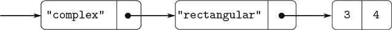

图 2.24 矩形形式中 3 + 4i 的表示。

在上述包中，我们使用了`add_rat`、`add_complex`和其他算术函数，其实就是原始写法。然而，一旦这些声明内部化到不同的安装函数中，它们就不再需要彼此不同的名称：我们可以在两个包中简单地将它们命名为`add`、`sub`、`mul`和`div`。

##### 练习 2.77

路易斯·里森纳试图求值表达式`magnitude(z)`，其中`z`是图 2.24 中显示的对象。令他惊讶的是，他没有得到答案 5，而是从`apply_generic`得到了一个错误消息，说没有针对类型`list("complex")`的`magnitude`操作的方法。他把这个交互展示给了 Alyssa P. Hacker，后者说：“问题在于复数选择器从未为`"complex"`数字定义过，只为`"polar"`和`"rectangular"`数字定义过。要使其工作，你只需将以下内容添加到`complex`包中：”

```js
put("real_part", list("complex"), real_part);
put("imag_part", list("complex"), imag_part);
put("magnitude", list("complex"), magnitude);
put("angle",      list("complex"), angle);
```

详细描述为什么这样可以工作。例如，跟踪在求值表达式`magnitude(z)`时调用的所有函数。特别是`apply_generic`被调用了多少次？在每种情况下分派给了哪个函数？

##### 练习 2.78

`javascript_number`包中的内部函数本质上只是对原始函数`+`、`-`等的调用。由于我们的类型标签系统要求每个数据对象都附有类型，因此无法直接使用语言的原始函数。实际上，所有 JavaScript 实现都有一个类型系统，它们在内部使用。诸如`is_string`和`is_number`之类的原始谓词确定数据对象是否具有特定类型。修改第 2.4.2 节中的`type_tag`、`contents`和`attach_tag`的定义，以便我们的通用系统利用 JavaScript 的内部类型系统。也就是说，该系统应该像以前一样工作，只是普通数字应该简单地表示为 JavaScript 数字，而不是作为`head`为字符串`"javascript_number"`的对。

##### 练习 2.79

定义一个通用相等谓词`is_equal`，用于测试两个数字的相等性，并将其安装在通用算术包中。此操作应适用于普通数字、有理数和复数。

##### 练习 2.80

定义一个通用谓词`is_equal_to_zero`，用于测试其参数是否为零，并将其安装在通用算术包中。此操作应适用于普通数字、有理数和复数。

### 2.5.2 组合不同类型的数据

我们已经看到如何定义一个统一的算术系统，包括普通数、复数、有理数和我们可能决定发明的任何其他类型的数字，但我们忽略了一个重要问题。到目前为止，我们定义的操作将不同的数据类型视为完全独立。因此，有单独的包用于添加两个普通数或两个复数。我们还没有考虑的是，定义跨类型边界的操作是有意义的，比如将复数加到普通数上。我们已经非常费力地引入了程序的各个部分之间的障碍，以便它们可以分开开发和理解。我们希望以一种精心控制的方式引入跨类型操作，以便我们可以支持它们，而不严重违反我们的模块边界。

处理跨类型操作的一种方法是为每种可能的类型组合设计不同的函数，这些函数对于这些操作是有效的。例如，我们可以扩展复数包，以便它提供一个将复数加到普通数的函数，并使用标签`list("complex", "javascript_number")`将其安装在表中：⁴⁶

```js
// to be included in the complex package
function add_complex_to_javascript_num(z, x) {
    return make_complex_from_real_imag(real_part(z) + x, imag_part(z));
}
put("add", list("complex", "javascript_number"),
    (z, x) => tag(add_complex_to_javascript_num(z, x)));
```

这种技术是行得通的，但它很繁琐。在这样的系统中，引入新类型的成本不仅仅是为该类型构建函数包，还包括实现跨类型操作的函数的构建和安装。这很容易比定义类型本身的操作所需的代码多得多。这种方法还破坏了我们将单独的包累加在一起的能力，或者至少限制了个别包的实现者需要考虑其他包的程度。例如，在上面的例子中，处理复数和普通数的混合操作应该是复数包的责任。然而，组合有理数和复数可能由复数包、有理数包或者使用这两个包中提取的操作的第三个包来完成。在设计具有许多包和许多跨类型操作的系统时，制定关于包之间责任分配的一致政策可能是一个艰巨的任务。

##### 强制转换

在完全不相关的操作作用于完全不相关的类型的一般情况下，实现显式的跨类型操作，尽管繁琐，是人们所能期望的最好的。幸运的是，我们通常可以通过利用可能潜在于我们类型系统中的附加结构来做得更好。通常不同的数据类型并不是完全独立的，而且可能有一些方法，可以将一个类型的对象视为另一种类型的对象。这个过程称为*强制转换*。例如，如果我们被要求将一个普通数与一个复数进行算术运算，我们可以将普通数视为其虚部为零的复数。这将问题转化为两个复数的组合问题，可以通过复数算术包以普通方式处理。

一般来说，我们可以通过设计强制转换函数来实现这个想法，这些函数将一个类型的对象转换为另一个类型的等效对象。这是一个典型的强制转换函数，它将给定的普通数转换为具有该实部和零虚部的复数：

```js
function javascript_number_to_complex(n) {
    return make_complex_from_real_imag(contents(n), 0);
}
```

我们将这些强制转换函数安装在一个特殊的强制转换表中，索引为两种类型的名称：

```js
put_coercion("javascript_number", "complex",
             javascript_number_to_complex);
```

（我们假设有`put_coercion`和`get_coercion`函数可用于操作此表。）通常表中的某些槽位将是空的，因为通常无法将每种类型的任意数据对象强制转换为所有其他类型。例如，没有办法将任意复数强制转换为普通数字，因此在表中将不包括通用的`complex_to_javascript_number`函数。

一旦建立了强制转换表，我们可以通过修改第 2.4.3 节中的`apply_generic`函数以统一处理强制转换。当要求应用操作时，我们首先检查操作是否适用于参数的类型，就像以前一样。如果是，我们将分派到在操作和类型表中找到的函数。否则，我们尝试强制转换。为简单起见，我们只考虑有两个参数的情况。我们检查强制转换表，看看第一种类型的对象是否可以被强制转换为第二种类型。如果可以，我们强制转换第一个参数，然后再次尝试操作。如果第一种类型的对象通常无法被强制转换为第二种类型，我们尝试以另一种方式进行强制转换，看看是否有一种方法可以将第二个参数强制转换为第一个参数的类型。最后，如果没有已知的方法可以强制转换任一类型为另一类型，我们放弃。以下是该函数：

```js
function apply_generic(op, args) {
    const type_tags = map(type_tag, args);
    const fun = get(op, type_tags);
    if (! is_undefined(fun)) {
        return apply(fun, map(contents, args));
    } else {
        if (length(args) === 2) {
            const type1 = head(type_tags);
            const type2 = head(tail(type_tags));
            const a1 = head(args);
            const a2 = head(tail(args));
            const t1_to_t2 = get_coercion(type1, type2);
            const t2_to_t1 = get_coercion(type2, type1);
            return ! is_undefined(t1_to_t2)
                   ? apply_generic(op, list(t1_to_t2(a1), a2))
                   : ! is_undefined(t2_to_t1)
                   ? apply_generic(op, list(a1, t2_to_t1(a2)))
                   : error(list(op, type_tags),
                           "no method for these types");
        } else {
            return error(list(op, type_tags),
                         "no method for these types");
        }
    }
}
```

与上述定义显式跨类型操作的方法相比，这种强制转换方案具有许多优点。虽然我们仍然需要编写强制转换函数来关联类型（对于具有`n`种类型的系统，可能需要`n`²个函数），但我们只需要为每对类型编写一个函数，而不是为每组类型和每个通用操作编写不同的函数。我们在这里所依赖的是这样一个事实，即类型之间的适当转换只取决于类型本身，而不取决于要应用的操作。

另一方面，可能有一些应用程序，我们的强制方案并不够通用。即使要合并的两个对象都无法转换为对方的类型，仍然可以通过将两个对象转换为第三种类型来执行操作。为了处理这种复杂性并仍然保持程序的模块化，通常需要构建利用类型之间关系中更进一步结构的系统，接下来我们将讨论这一点。

##### 类型的层次结构

上述强制转换方案依赖于类型对之间存在自然关系的存在。通常，不同类型之间的关系具有更多的“全局”结构。例如，假设我们正在构建一个通用算术系统来处理整数、有理数、实数和复数。在这样的系统中，将整数视为有理数的一种特殊类型，而有理数又是实数的一种特殊类型，实数又是复数的一种特殊类型，这是非常自然的。实际上，我们拥有所谓的*类型层次结构*，例如，整数是有理数的*子类型*（即，可以应用于有理数的任何操作也可以自动应用于整数）。相反，我们说有理数是整数的*超类型*。我们这里拥有的特定层次结构是一种非常简单的结构，其中每种类型最多只有一个超类型和一个子类型。这样的结构，称为*塔*，在图 2.25 中有所说明。

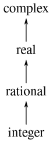

图 2.25 类型的层次结构。

如果我们有一个塔结构，那么我们可以极大地简化将新类型添加到层次结构中的问题，因为我们只需要指定新类型如何嵌入到其上一级的超类型中，以及它如何成为其下一级类型的超类型。例如，如果我们想要将整数添加到复数中，我们不需要明确地定义一个特殊的强制转换函数`integer_to_complex`。相反，我们定义整数如何转换为有理数，有理数如何转换为实数，以及实数如何转换为复数。然后，我们允许系统通过这些步骤将整数转换为复数，然后将两个复数相加。

我们可以按照以下方式重新设计我们的`apply_generic`函数：对于每种类型，我们需要提供一个`raise`函数，它可以将该类型的对象在塔中提升一级。然后，当系统需要对不同类型的对象进行操作时，它可以依次提升较低的类型，直到所有对象在塔中处于相同的级别。（练习 2.83 和 2.84 涉及实现这种策略的细节。）

塔的另一个优点是，我们可以很容易地实现这样一个概念，即每种类型“继承”了在超类型上定义的所有操作。例如，如果我们没有为查找整数的实部提供一个特殊的函数，我们仍然应该期望整数的`real_part`是由于整数是复数的子类型而被定义的。在一个塔中，我们可以通过修改`apply_generic`以一种统一的方式安排这种情况发生。如果给定对象的类型没有直接定义所需的操作，我们将把对象提升到其超类型并重试。因此，我们沿着塔向上爬行，随着我们的参数的转换，直到我们找到可以执行所需操作的级别，或者达到顶部（在这种情况下我们放弃）。

塔相对于更一般的层次结构的另一个优点是，它为我们提供了一种简单的方法来将数据对象“降低”到最简单的表示。例如，如果我们将` 2 + 3i`加到`4 - 3i`，我们希望得到的答案是整数 6，而不是复数`6 + 0i`。练习 2.85 讨论了实现这种降低操作的方法。（诀窍在于我们需要一种通用的方法来区分那些可以被降低的对象，比如`6 + 0i`，和那些不能被降低的对象，比如`6 + 2i`。）

##### 层次结构的不足之处

如果我们的系统中的数据类型可以自然地排列成一个塔，这将极大地简化处理不同类型的通用操作的问题，正如我们所见。不幸的是，这种情况通常并非如此。图 2.26 展示了一种更复杂的混合类型排列，其中显示了不同类型的几何图形之间的关系。我们看到，一般来说，一个类型可能有多个子类型。例如，三角形和四边形都是多边形的子类型。此外，一个类型可能有多个超类型。例如，等腰直角三角形可以被视为等腰三角形或直角三角形。这个多超类型的问题特别棘手，因为这意味着在层次结构中没有唯一的“提升”类型的方法。在对象上应用操作时，找到“正确”的超类型可能需要在整个类型网络中进行大量搜索，这是`apply_generic`等函数的一个问题。由于一般情况下一个类型有多个子类型，因此在将值“降低”到类型层次结构时也存在类似的问题。在设计大型系统的同时处理大量相互关联的类型是非常困难的，也是当前研究的一个重要领域。

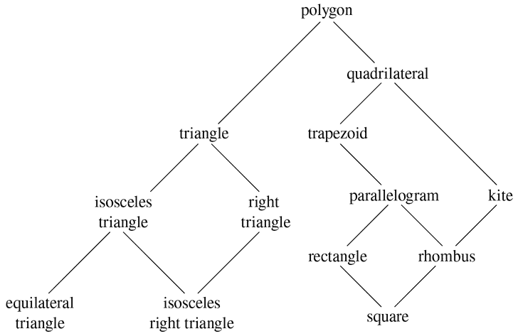

图 2.26 几何图形类型之间的关系。

##### 练习 2.81

路易斯·里森纳（Louis Reasoner）注意到`apply_generic`可能会尝试将参数强制转换为彼此的类型，即使它们已经具有相同的类型。因此，他推断，我们需要在强制转换表中放置函数以将每种类型的参数“强制”为其自己的类型。例如，除了上面显示的`javascript_number_to_complex`强制转换外，他还会这样做：

```js
function javascript_number_to_javascript_number(n) { return n; }
function complex_to_complex(n) { return n; }
put_coercion("javascript_number", "javascript_number",
             javascript_number_to_javascript_number);
put_coercion("complex", "complex", complex_to_complex);
```

1.  a. 如果安装了路易斯的强制转换函数，当`apply_generic`使用两个类型为`complex`的参数或两个类型为`javascript_number`的参数调用一个在这些类型的表中找不到的操作时会发生什么？例如，假设我们定义了一个通用的幂运算操作：

    ```js
    function exp(x, y) {
        return apply_generic("exp", list(x, y));
    }
    ```

    并且在 JavaScript-number 包中放置了一个幂运算函数，但在任何其他包中都没有：

    ```js
    // following added to JavaScript-number package
    put("exp", list("javascript_number", "javascript_number"),
        (x, y) => tag(math_exp(x, y))); // using primitive math_exp
    ```

    如果我们用两个复数作为参数调用`exp`会发生什么？

1.  b. 路易斯是否正确，需要对相同类型的参数进行强制转换，或者`apply_generic`按原样工作？

1.  c. 修改`apply_generic`，使其在两个参数具有相同类型时不尝试强制转换。

##### 练习 2.82

展示如何将`apply_generic`泛化以处理多个参数的一般情况。一种策略是尝试将所有参数强制转换为第一个参数的类型，然后转换为第二个参数的类型，依此类推。给出一个情况的例子，该策略（以及上面给出的两参数版本）不够通用。（提示：考虑存在一些适当的混合类型操作的情况，这些操作将不会被尝试。）

##### 练习 2.83

假设您正在设计一个用于处理类型塔的通用算术系统，如图 2.25 所示：整数，有理数，实数，复数。对于每种类型（复数除外），设计一个将该类型的对象提升一级的函数。展示如何安装一个通用的`raise`操作，该操作将适用于每种类型（复数除外）。

##### 练习 2.84

使用练习 2.83 的`raise`操作，修改`apply_generic`函数，使其通过本节讨论的连续提升的方法强制其参数具有相同的类型。您需要设计一种方法来测试两种类型中哪种更高。以一种与系统的其余部分“兼容”的方式进行此操作，并且不会在向类型塔添加新级别时出现问题。

##### 练习 2.85

本节提到了一种通过将数据对象尽可能降低到类型塔中的方法来“简化”数据对象。设计一个函数`drop`，以实现练习 2.83 中描述的类型塔的降低。关键是以一种一般的方式决定对象是否可以降低。例如，复数`1.5 + 0i`可以降低到`real`，复数`1 + 0i`可以降低到`integer`，而复数`2 + 3i`根本无法降低。以下是确定对象是否可以降低的计划：首先定义一个“推”对象下降到塔中的通用操作`project`。例如，投影复数将涉及丢弃虚部。然后，如果我们`project`它并将结果`raise`回到我们开始的类型，我们得到与我们开始的相等的东西，那么数字就可以被丢弃。展示如何通过编写一个`drop`函数来详细实现这个想法，该函数将对象尽可能地降低。您需要设计各种投影操作⁵⁰并在系统中安装`project`作为通用操作。您还需要使用通用相等谓词，例如练习 2.79 中描述的谓词。最后，使用`drop`重写练习 2.84 中的`apply_generic`，以便“简化”其答案。

##### 练习 2.86

假设我们想处理复数，其实部、虚部、幅度和角度可以是普通数、有理数，或者我们可能希望添加到系统中的其他数。描述并实现系统需要的更改，以适应这一点。您将不得不定义诸如`sine`和`cosine`这样的操作，这些操作对普通数和有理数是通用的。

### 2.5.3 示例：符号代数

符号代数表达式的操作是一个复杂的过程，它展示了大规模系统设计中出现的许多最困难的问题。一般来说，代数表达式可以被看作是一个分层结构，即操作符应用于操作数的树。我们可以通过从一组原始对象（如常数和变量）开始，并通过代数运算符（如加法和乘法）组合这些对象来构造代数表达式。与其他语言一样，我们形成抽象，使我们能够用简单的术语引用复合对象。符号代数中的典型抽象是诸如线性组合、多项式、有理函数或三角函数等概念。我们可以将这些看作是复合的“类型”，它们经常有助于指导表达式的处理。例如，我们可以描述表达式

```js
x² sin(y² + 1) + x cos 2y + cos(y³ – 2y²)
```

作为`x`的多项式，其系数是`y`的多项式的三角函数。

我们不打算在这里开发一个完整的代数运算系统。这样的系统是非常复杂的程序，包含深奥的代数知识和优雅的算法。我们要做的是看一看代数运算的一个简单但重要的部分：多项式的算术。我们将说明这样一个系统的设计者面临的决策类型，并且如何应用抽象数据和通用操作的思想来帮助组织这一努力。

##### 多项式的算术

我们在设计一个用于多项式算术的系统时的第一个任务是决定多项式到底是什么。多项式通常是相对于某些变量（多项式的不定元）定义的。为简单起见，我们将限制自己只处理具有一个不定元的多项式（一元多项式）。我们将定义多项式为项的和，每个项可以是系数、不定元的幂，或者系数和不定元的乘积。系数被定义为不依赖于多项式的不定元的代数表达式。例如，

```js
5x² + 3x + 7
```

是一个关于`x`的简单多项式，以及

```js
(y² + 1)x³ + (2y)x + 1
```

是一个关于`x`的多项式，其系数是`y`的多项式。

我们已经在绕过一些棘手的问题。第一个多项式是否与多项式`5y² + 3y + 7`相同，还是不同？一个合理的答案可能是“如果我们把多项式纯粹看作是一个数学函数，那么是的，但如果我们把多项式看作是一种语法形式，那么不是”。第二个多项式在代数上等价于关于`y`的多项式，其系数是`x`的多项式。我们的系统应该认识到这一点吗？还是不应该？此外，还有其他表示多项式的方式，例如作为因子的乘积，或者（对于一元多项式）作为根的集合，或者作为在指定点集上的多项式值的列表。我们可以通过决定在我们的代数运算系统中，“多项式”将是一种特定的语法形式，而不是其潜在的数学含义来回避这些问题。

现在我们必须考虑如何进行多项式的算术。在这个简单的系统中，我们只考虑加法和乘法。此外，我们要求要组合的两个多项式必须具有相同的不定元。

我们将通过遵循数据抽象的熟悉原则来设计我们的系统。我们将使用一个称为*poly*的数据结构来表示多项式，它由一个变量和一组项组成。我们假设我们有选择器`variable`和`term_list`，它们从多项式中提取这些部分，以及一个构造函数`make_poly`，它从给定的变量和项列表组装一个多项式。一个变量将只是一个字符串，因此我们可以使用第 2.3.2 节中的`is_same_variable`函数来比较变量。以下函数定义了多项式的加法和乘法：

```js
function add_poly(p1, p2) {
    return is_same_variable(variable(p1), variable(p2))
           ? make_poly(variable(p1),
                       add_terms(term_list(p1), term_list(p2)))
           : error(list(p1, p2), "polys not in same var – add_poly");
}
function mul_poly(p1, p2) {
    return is_same_variable(variable(p1), variable(p2))
           ? make_poly(variable(p1),
                       mul_terms(term_list(p1), term_list(p2)))
           : error(list(p1, p2), "polys not in same var – mul_poly");
}
```

为了将多项式纳入我们的通用算术系统，我们需要为它们提供类型标签。我们将使用标签`"polynomial"`，并在操作表中为带标签的多项式安装适当的操作。我们将把所有代码嵌入到多项式包的安装函数中，类似于第 2.5.1 节中的安装函数：

```js
function install_polynomial_package() {
    // internal functions
    // representation of poly
    function make_poly(variable, term_list) {
        return pair(variable, term_list);
    }
    function variable(p) { return head(p); }
    function term_list(p) { return tail(p); }
    〈functions is_same_variable and is_variable from section 2.3.2〉    

    // representation of terms and term lists
    〈functions adjoin_term…coeff from text below〉

    function add_poly(p1, p2) { … }
    〈functions used by add_poly〉
    function mul_poly(p1, p2) { … }
    〈functions used by mul_poly〉    

    // interface to rest of the system
    function tag(p) { return attach_tag("polynomial", p); }
    put("add", list("polynomial", "polynomial"),
        (p1, p2) => tag(add_poly(p1, p2)));
    put("mul", list("polynomial", "polynomial"),
        (p1, p2) => tag(mul_poly(p1, p2)));
    put("make", "polynomial",
        (variable, terms) => tag(make_poly(variable, terms)));
    return "done";
}
```

多项式的加法是逐项进行的。必须合并同一次幂的项（即，具有相同未知数幂的项）。这是通过形成一个新的同一次幂的项来完成的，其系数是被加数的系数的和。一个加数中的项，如果在另一个加数中没有相同次幂的项，那么它们就简单地累积到正在构造的和多项式中。

为了操作项列表，我们将假定我们有一个构造函数`the_empty_termlist`，它返回一个空的项列表，以及一个构造函数`adjoin_ term`，它将一个新的项添加到项列表中。我们还将假定我们有一个谓词`is_empty_termlist`，它告诉我们给定的项列表是否为空，一个选择器`first_term`，它从项列表中提取最高次项，以及一个选择器`rest_terms`，它返回除了最高次项之外的所有项。为了操作项，我们将假设我们有一个构造函数`make_term`，它构造一个具有给定次序和系数的项，以及选择器`order`和`coeff`，它们分别返回项的次序和系数。这些操作使我们能够将项和项列表都视为数据抽象，我们可以分别担心它们的具体表示。

以下是构造两个多项式之和的项列表的函数;⁵³请注意，我们通过允许在`**else**`后面的块中添加另一个条件语句，略微扩展了第 1.3.2 节中描述的条件语句的语法：

```js
function add_terms(L1, L2) {
    if (is_empty_termlist(L1)) {
        return L2;
    } else if (is_empty_termlist(L2)) {
        return L1;
    } else {
        const t1 = first_term(L1);
        const t2 = first_term(L2);
        return order(t1) > order(t2)
               ? adjoin_term(t1, add_terms(rest_terms(L1), L2))
               : order(t1) < order(t2)
               ? adjoin_term(t2, add_terms(L1, rest_terms(L2)))
               : adjoin_term(make_term(order(t1),
                                       add(coeff(t1), coeff(t2))),
                             add_terms(rest_terms(L1),
                                       rest_terms(L2)));
    }
}
```

这里最重要的一点是，我们使用了通用的加法函数`add`来将合并的项的系数相加。这具有强大的后果，我们将在下面看到。

为了将两个项列表相乘，我们将第一个列表的每个项与另一个列表的所有项相乘，重复使用`mul_term_by_all_terms`，它将给定的项与给定的项列表中的所有项相乘。结果项列表（对于第一个列表的每个项）被累积到一个和中。将两个项相乘形成一个次序是因子次序之和，系数是因子系数之积的项：

```js
function mul_terms(L1, L2) {
    return is_empty_termlist(L1)
          ? the_empty_termlist
          : add_terms(mul_term_by_all_terms(
                                first_term(L1), L2),
                      mul_terms(rest_terms(L1), L2));
}
function mul_term_by_all_terms(t1, L) {
    if (is_empty_termlist(L)) {
        return the_empty_termlist;
    } else {
        const t2 = first_term(L);
        return adjoin_term(
                   make_term(order(t1) + order(t2),
                             mul(coeff(t1), coeff(t2))),
                   mul_term_by_all_terms(t1, rest_terms(L)));
    }
}
```

这确实就是多项式的加法和乘法。请注意，由于我们使用通用函数`add`和`mul`对项进行操作，我们的多项式包自动能够处理通用算术包已知的任何类型的系数。如果我们包括一个强制转换机制，例如在第 2.5.2 节中讨论的机制之一，那么我们也能够自动处理不同系数类型的多项式的操作，例如

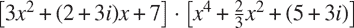

因为我们在通用算术系统中安装了多项式加法和乘法函数`add_ poly`和`mul_poly`作为类型`polynomial`的`add`和`mul`操作，我们的系统也能够自动处理多项式操作，例如

```js
(y + 1)x² + (y² + 1)x + (y – 1) · (y – 2)x + (y³ + 7)
```

原因是当系统尝试组合系数时，它将通过`add`和`mul`进行分派。由于系数本身是多项式（在`y`中），这些将使用`add_poly`和`mul_poly`进行组合。结果是一种“数据导向递归”，例如，对`mul_poly`的调用将导致递归调用`mul_poly`以便乘以系数。如果系数的系数本身是多项式（可能用于表示三个变量的多项式），数据方向将确保系统将遵循另一级递归调用，以及数据结构所决定的任意级别。

##### 表示项列表

最后，我们必须面对实现一个良好的项列表表示的工作。项列表实际上是一组由项的顺序作为键的系数集合。因此，可以将第 2.3.3 节中讨论的任何表示集合的方法应用于此任务。另一方面，我们的函数`add_terms`和`mul_terms`总是按顺序从最高到最低的顺序访问项列表。因此，我们将使用某种有序列表表示。

我们应该如何构造表示项列表的列表？一个考虑因素是我们打算操作的多项式的“密度”。如果多项式在大多数阶的系数中都是非零的，则称为*密集*多项式。如果它有许多零项，则称为*稀疏*。例如，

```js
A：x⁵ + 2x⁴ + 3x² – 2x – 5
```

是一个密集多项式，而

```js
B：x¹⁰⁰ + 2x² + 1
```

是稀疏的。

密集多项式的项列表最有效地表示为系数的列表。例如，上面的多项式`A`可以很好地表示为`list(1, 2, 0, 3, -2, -5)`。在这种表示中，项的顺序是以该项系数开头的子列表的长度，减 1。这对于稀疏多项式`B`来说是一个糟糕的表示：会有一个巨大的零项列表，中间夹杂着一些孤独的非零项。项列表的更合理的表示是作为非零项的列表，其中每个项都是包含该项顺序和该顺序系数的列表。在这样的方案中，多项式`B`可以有效地表示为`list(list(100, 1), list(2, 2), list(0, 1))`。由于大多数多项式操作是在稀疏多项式上执行的，我们将使用这种方法。我们将假设项列表被表示为项的列表，从最高阶到最低阶的项。一旦我们做出了这个决定，实现项和项列表的选择器和构造器就很简单了。

```js
function adjoin_term(term, term_list) {
    return is_equal_to_zero(coeff(term))
           ? term_list
           : pair(term, term_list);
}

const the_empty_termlist = null;
function first_term(term_list) { return head(term_list); }
function rest_terms(term_list) { return tail(term_list); }
function is_empty_termlist(term_list) { return is_null(term_list); }

function make_term(order, coeff) { return list(order, coeff); }
function order(term) { return head(term); }
function coeff(term) { return head(tail(term)); }
```

其中`is_equal_to_zero`如练习 2.80 中所定义。（另见下面的练习 2.87。）

多项式包的用户将通过以下函数创建（标记的）多项式：

```js
function make_polynomial(variable, terms) {
    return get("make", "polynomial")(variable, terms);
}
```

##### 练习 2.87

为通用算术包中的多项式安装`is_equal_to_zero`。这将允许`adjoin_term`用于系数本身是多项式的多项式。

##### 练习 2.88

扩展多项式系统以包括多项式的减法。（提示：您可能会发现定义一个通用的否定操作很有帮助。）

##### 练习 2.89

声明实现上述项列表表示的函数，适用于密集多项式。

##### 练习 2.90

假设我们希望拥有一个对稀疏和密集多项式都有效的多项式系统。实现这一点的一种方法是在我们的系统中允许两种类型的项列表表示。这种情况类似于第 2.4 节中的复数示例，我们在那里允许了矩形和极坐标表示。为了做到这一点，我们必须区分不同类型的项列表，并使项列表上的操作成为通用的。重新设计多项式系统以实现这种泛化。这是一项重大工作，而不是一个局部变化。

##### 练习 2.91

一个一元多项式可以被另一个一元多项式除以，得到一个多项式商和一个多项式余数。例如，

`(x⁵ - 1) / (x² - 1) = x³ + x`, 余数`x – 1`

可以通过长除法进行除法。也就是说，将被除数的最高次项除以除数的最高次项。结果是商的第一项。接下来，将结果乘以除数，从被除数中减去，通过递归地将差除以除数来得出答案的其余部分。当除数的次序超过被除数的次序时停止，并声明被除数为余数。此外，如果被除数变为零，返回零作为商和余数。

我们可以设计一个`div_poly`函数，模仿`add_poly`和`mul_poly`的模式。该函数检查两个多项式是否具有相同的变量。如果是这样，`div_poly`会剥离变量并将问题传递给`div_terms`，后者在项列表上执行除法操作。`div_poly`函数最终会将`div_terms`提供的结果重新附加到变量上。设计`div_terms`计算除法的商和余数是方便的。`div_terms`函数可以接受两个项列表作为参数，并返回商项列表和余数项列表的列表。

通过填写缺失的部分来完成`div_terms`的以下定义。使用这个来实现`div_poly`，它接受两个多项式作为参数，并返回商和余数多项式的列表。

```js
function div_terms(L1, L2) {
    if (is_empty_termlist(L1)) {
        return list(the_empty_termlist, the_empty_termlist);
    } else {
        const t1 = first_term(L1);
        const t2 = first_term(L2);
        if (order(t2) > order(t1)) {
            return list(the_empty_termlist, L1);
        } else {
            const new_c = div(coeff(t1), coeff(t2));
            const new_o = order(t1) - order(t2);
            const rest_of_result = 〈compute rest of result recursively〉;
            〈form and return complete result〉
        }
    }
}
```

##### 符号代数中的类型层次结构

我们的多项式系统说明了一个类型的对象（多项式）实际上可能是复杂对象，其中包含许多不同类型的对象作为部分。这在定义通用操作时并不困难。我们只需要为执行复合类型的部分必要操作安装适当的通用操作。事实上，我们看到多项式形成一种“递归数据抽象”，因为多项式的部分本身可能是多项式。我们的通用操作和数据导向的编程风格可以轻松处理这种复杂性。

另一方面，多项式代数是一个数据类型不能自然排列成塔形的系统。例如，可能存在多项式`x`，其系数是`y`的多项式。也可能存在多项式`y`，其系数是`x`的多项式。这两种类型都没有自然的“上下”关系，然而通常需要将每个集合中的元素相加。有几种方法可以做到这一点。一种可能性是通过扩展和重新排列项，将一个多项式转换为另一个多项式的类型，使得两个多项式具有相同的主要变量。通过对变量进行排序，可以在这个上建立一个类似塔的结构，从而总是将任何多项式转换为一个“规范形式”，其中优先级最高的变量占主导地位，较低优先级的变量被埋在系数中。这种策略效果相当不错，只是转换可能会不必要地扩展多项式，使其难以阅读，也许效率更低。这种塔形策略对于这个领域或者用户可以使用各种组合形式动态地发明新类型的任何领域都不是自然的。例如，三角函数、幂级数和积分。

控制强制转换在大规模代数操作系统的设计中是一个严重的问题并不奇怪。这样的系统的复杂性很大程度上涉及到各种类型之间的关系。事实上，可以说我们还没有完全理解强制转换。事实上，我们甚至还没有完全理解数据类型的概念。然而，我们所知道的为我们提供了强大的结构化和模块化原则，以支持大型系统的设计。

##### 练习 2.92

通过对变量进行排序，扩展多项式包，使得多项式在不同变量中的加法和乘法可以工作。（这并不容易！）

##### 扩展练习：有理函数

我们可以将我们的通用算术系统扩展到包括*有理函数*。这些是“分数”，其分子和分母都是多项式，例如

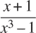

该系统应该能够对有理函数进行加法、减法、乘法和除法，并执行诸如

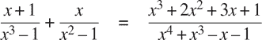

（这里的和已经通过去除公因子来简化。普通的“交叉乘法”会产生一个五次多项式的四次多项式。）

如果我们修改我们的有理算术包，使其使用通用操作，那么它将做我们想要的事情，除了将分数化简为最低项的问题。

##### 练习 2.93

修改有理算术包以使用通用操作，但更改`make_rat`，使其不尝试将分数化简为最低项。通过调用`make_rational`在两个多项式上测试您的系统，以生成一个有理函数

```js
const p1 = make_polynomial("x", list(make_term(2, 1), make_term(0, 1)));
const p2 = make_polynomial("x", list(make_term(3, 1), make_term(0, 1)));
const rf = make_rational(p2, p1);
```

现在使用`add`将`rf`加到自身。您会观察到这个加法函数不会将分数化简为最低项。

我们可以使用与整数相同的思想将多项式分数化简为最低项：修改`make_rat`，将分子和分母都除以它们的最大公约数。对于多项式来说，“最大公约数”的概念是有意义的。事实上，我们可以使用基本上与整数相同的欧几里得算法来计算两个多项式的最大公约数。 ⁵⁷整数版本是

```js
function gcd(a, b) {
    return b === 0
           ? a
           : gcd(b, a % b);
}
```

使用这个，我们可以做一个明显的修改来定义一个在项列表上工作的 GCD 操作：

```js
function gcd_terms(a, b) {
    return is_empty_termlist(b)
           ? a
           : gcd_terms(b, remainder_terms(a, b));
}
```

其中`remainder_terms`选出了由练习 2.91 中实现的项列表除法操作`div_terms`返回的列表的余项部分。

##### 练习 2.94

使用`div_terms`，实现函数`remainder_terms`并使用它来定义`gcd_terms`。现在编写一个函数`gcd_poly`来计算两个多项式的多项式 GCD。（如果两个多项式不是在相同的变量上，则该函数应发出错误信号。）在系统中安装一个通用操作`greatest_common_divisor`，对于多项式，它将简化为`gcd_poly`，对于普通数字，它将简化为普通的`gcd`。作为测试，尝试

```js
const p1 = make_polynomial("x", list(make_term(4, 1), make_term(3, -1),
                                     make_term(2, -2), make_term(1, 2)));
const p2 = make_polynomial("x", list(make_term(3, 1), make_term(1, -1)));
greatest_common_divisor(p1, p2);
```

并通过手动检查您的结果。

##### 练习 2.95

定义`P[1]`，`P[2]`和`P[3]`为多项式

```js
P[1]: x² – 2x + 1

P[2]: 11x² + 7

P[3]: 13x + 5
```

现在定义`Q[1]`为`P[1]`和`P[2]`的乘积，`Q[2]`为`P[1]`和`P[3]`的乘积，并使用`greatest_common_divisor`（练习 2.94）来计算`Q[1]`和`Q[2]`的 GCD。请注意，答案与`P[1]`不同。这个例子引入了非整数运算到计算中，导致 GCD 算法出现困难。要理解发生了什么，请尝试在计算 GCD 时跟踪`gcd_terms`，或者尝试手动进行除法。

如果我们使用以下修改的 GCD 算法（实际上只适用于具有整数系数的多项式），我们可以解决练习 2.95 中展示的问题。在 GCD 计算中进行任何多项式除法之前，我们将被除数乘以一个整数常数因子，选择保证在除法过程中不会出现任何分数。因此，我们的答案将与实际 GCD 相差一个整数常数因子，但在将有理函数化简为最低项时并不重要；GCD 将用于同时除以分子和分母，因此整数常数因子将被抵消。

更准确地说，如果`P`和`Q`是多项式，让`O[1]`是`P`的阶（即`P`的最高项的阶），`O[2]`是`Q`的阶。让`c`是`Q`的首项系数。然后可以证明，如果我们将`P`乘以整数化因子`c^(1+)^O^(1–)^O^(2,)`，则所得多项式可以使用`div_terms`算法除以`Q`，而不会引入任何分数。将被除数乘以这个常数然后再除以它，有时被称为`P`除以`Q`的*伪除法*。除法的余数称为*伪余数*。

##### 练习 2.96

1.  a. 实现函数`pseudoremainder_terms`，它与`remainder_terms`类似，只是在调用`div_terms`之前，它会将被除数乘以上面描述的整数化因子。修改`gcd_terms`以使用`pseudoremainder_terms`，并验证`greatest_common_divisor`现在在练习 2.95 中产生具有整数系数的答案。

1.  b. GCD 现在具有整数系数，但它们比`P[1]`的系数大。修改`gcd_terms`，以便通过将所有系数除以它们的（整数）最大公约数来删除答案的系数的公共因子。

因此，这是将有理函数化简为最低项的方法：

+   使用练习 2.96 中的`gcd_terms`版本计算分子和分母的 GCD。

+   当获得 GCD 时，在通过 GCD 除以分子和分母之前，将分子和分母都乘以相同的整数化因子，以便通过 GCD 除法不会引入任何非整数系数。作为因子，您可以使用 GCD 的首项系数提高到 1 + `O[1]` – `O[2]`的幂，其中`O[2]`是 GCD 的阶，`O[1]`是分子和分母的阶的最大值。这将确保通过 GCD 除以分子和分母不会引入任何分数。

+   这个操作的结果将是一个分子和一个分母，它们都有整数系数。系数通常会非常大，因为所有的整数化因素，所以最后一步是通过计算分子和分母的所有系数的（整数）最大公约数，并通过这个因子除以它来去除冗余因子。

##### 练习 2.97

1.  a. 实现这个算法作为一个函数`reduce_terms`，它接受两个项列表`n`和`d`作为参数，并返回一个列表`nn`，`dd`，它们是通过上面给出的算法将`n`和`d`化简为最低项。还要编写一个函数`reduce_poly`，类似于`add_poly`，它检查两个多项式是否具有相同的变量。如果是这样，`reduce_poly`会剥离变量并将问题传递给`reduce_terms`，然后重新将变量附加到`reduce_terms`提供的两个项列表上。

1.  b. 定义一个类似于`reduce_terms`的函数，它可以为整数做原始的`make_rat`所做的事情：

    ```js
    function reduce_integers(n, d) {
        const g = gcd(n, d);
        return list(n / g, d / g);
    }
    ```

    并定义`reduce`作为一个通用操作，它调用`apply_generic`来分派到`reduce_poly`（对于`polynomial`参数）或`reduce_integers`（对于`javascript_ number`参数）。现在，通过在组合给定的分子和分母形成有理数之前调用`reduce`，可以轻松地使有理算术包将分数化简为最低项。系统现在可以处理整数或多项式的有理表达式。要测试你的程序，请尝试在这个扩展练习的开头的例子：

    ```js
    const p1 = make_polynomial("x", list(make_term(1, 1), make_term(0, 1)));
    const p2 = make_polynomial("x", list(make_term(3, 1), make_term(0, -1)));
    const p3 = make_polynomial("x", list(make_term(1, 1)));
    const p4 = make_polynomial("x", list(make_term(2, 1), make_term(0, -1)));

    const rf1 = make_rational(p1, p2);
    const rf2 = make_rational(p3, p4);

    add(rf1, rf2);
    ```

    看看你是否得到了正确的答案，正确地化简为最低项。

GCD 计算是任何对有理函数进行操作的系统的核心。上面使用的算法，虽然在数学上很直接，但非常慢。这种慢是部分由于大量的除法运算，部分是由于伪除法生成的中间系数的巨大大小。代数操作系统开发中的一个活跃领域是设计更好的算法来计算多项式的最大公约数。
