# 三、模块化、对象和状态

> 原文：[3 Modularity, Objects, and State](https://sourceacademy.org/sicpjs/3)
> 
> 译者：[飞龙](https://github.com/wizardforcel)
> 
> 协议：[CC BY-NC-SA 4.0](https://creativecommons.org/licenses/by-nc-sa/4.0/)

> *变化中安宁*
> 
> （即使它在变化，它仍然保持不变。）
> 
> ——赫拉克利特

> 变化越大，越是相同。
> 
> ——阿方斯·卡尔

前面的章节介绍了构成程序的基本元素。我们看到了原始函数和原始数据是如何组合成复合实体的，我们也了解到抽象对于帮助我们应对大型系统的复杂性是至关重要的。但是这些工具并不足以用于设计程序。有效的程序合成还需要组织原则，可以指导我们制定程序的整体设计。特别是，我们需要策略来帮助我们结构大型系统，使它们成为*模块化*，也就是说，它们可以被“自然地”划分为可以单独开发和维护的连贯部分。

一种强大的设计策略，特别适用于构建用于建模物理系统的程序，是基于被建模系统的结构来构建程序的结构。对于系统中的每个对象，我们构建一个相应的计算对象。对于每个系统动作，我们在计算模型中定义一个符号操作。我们使用这种策略的希望是，扩展模型以适应新对象或新动作将不需要对程序进行战略性的更改，只需要添加这些对象或动作的新符号模拟。如果我们在系统组织上取得了成功，那么要添加新功能或调试旧功能，我们只需要在系统的局部部分工作。

在很大程度上，我们组织大型程序的方式是由我们对待建模系统的看法所决定的。在本章中，我们将研究两种突出的组织策略，这些策略源自对系统结构的两种相当不同的“世界观”。第一种组织策略集中在*对象*上，将一个大型系统视为一组随时间可能发生变化的不同对象。另一种组织策略集中在系统中流动的*信息流*上，就像电气工程师看待信号处理系统一样。

对象为基础的方法和流处理方法都在编程中引发了重大的语言问题。对于对象，我们必须关注计算对象如何改变，但又保持其身份不变。这将迫使我们放弃我们旧的替换计算模型（第 1.1.5 节），转而采用更机械但理论上不太可解的*环境模型*计算。处理对象、改变和身份的困难是需要在计算模型中处理时间的一个基本结果。当我们允许程序并发执行的可能性时，这些困难变得更加严重。当我们在模型中将模拟时间与计算机在求值过程中发生的事件顺序分离时，流方法可以得到最充分的利用。我们将使用一种称为*延迟求值*的技术来实现这一点。

## 3.1 分配和本地状态

我们通常将世界看作由独立的对象组成，每个对象都有随时间变化的状态。如果一个对象的行为受其历史影响，那么就说这个对象“有状态”。例如，银行账户有状态，因为对于问题“我可以取 100 美元吗？”的答案取决于存款和取款交易的历史。我们可以通过一个或多个*状态变量*来描述对象的状态，这些变量中包含了足够的关于历史的信息，以确定对象的当前行为。在一个简单的银行系统中，我们可以通过当前余额来描述账户的状态，而不是通过记住整个账户交易历史。

在由许多对象组成的系统中，这些对象很少是完全独立的。每个对象可能通过相互作用影响其他对象的状态，这些相互作用将一个对象的状态变量与其他对象的状态变量耦合在一起。事实上，当系统的状态变量可以被分成紧密耦合的子系统，并且这些子系统只与其他子系统松散耦合时，系统由独立对象组成的观点是最有用的。

这种对系统的观点可以是组织系统的计算模型的强大框架。为了使这样的模型具有模块化，它应该被分解成模拟系统中实际对象的计算对象。每个计算对象必须有其自己的*本地状态变量*来描述实际对象的状态。由于被建模系统中的对象的状态随时间变化，相应计算对象的状态变量也必须改变。如果我们选择通过编程语言中的普通符号名称来模拟系统中的时间流逝，那么语言必须提供*赋值操作*来使我们能够改变与名称关联的值。

### 3.1.1 本地状态变量

为了说明我们所说的具有时间变化状态的计算对象，让我们模拟从银行账户中取钱的情况。我们将使用一个名为`withdraw`的函数来实现这一点，该函数以要提取的`amount`作为参数。如果账户中有足够的钱来容纳提款，那么`withdraw`应该返回提款后剩余的余额。否则，`withdraw`应该返回消息*资金不足*。例如，如果我们开始

在账户中有 100 美元的情况下，我们应该使用`withdraw`获得以下响应序列：

```js
withdraw(25);
75

withdraw(25);
50

withdraw(60);
"Insufficient funds"

withdraw(15);
35
```

注意，表达式`withdraw(25)`被求值两次，产生不同的值。这是函数的一种新行为。到目前为止，我们所有的 JavaScript 函数都可以被视为计算数学函数的规范。对函数的调用计算了应用于给定参数的函数的值，并且对具有相同参数的同一函数的两次调用总是产生相同的结果。¹

到目前为止，我们所有的名称都是*不可变的*。当应用函数时，其参数引用的值从不改变，一旦声明被求值，声明的名称就不会改变其值。为了实现像`withdraw`这样的函数，我们引入了*变量声明*，它使用关键字`let`，除了使用关键字`const`的常量声明。我们可以声明一个变量`balance`来表示账户中的余额，并将`withdraw`定义为一个访问`balance`的函数。`withdraw`函数检查`balance`是否至少与请求的`amount`一样大。如果是，`withdraw`将`balance`减去`amount`并返回`balance`的新值。否则，`withdraw`返回*资金不足*的消息。这是`balance`和`withdraw`的声明：

```js
let balance = 100;

function withdraw(amount) {
    if (balance >= amount) {
        balance = balance - amount;
        return balance;
    } else {
        return "Insufficient funds";
    }
}
```

通过表达式语句来减少`balance`

```js
balance = balance - amount;
```

*赋值*表达式的语法是

```js
name = new-value
```

这里的`name`已经用`let`声明或作为函数参数，并且`new-value`是任何表达式。赋值改变了`name`，使得其值是通过求值`new-value`得到的结果。在这种情况下，我们正在改变`balance`，使其新值是从先前的`balance`值中减去`amount`得到的结果。²

`withdraw`函数还使用*语句序列*来导致两个语句在`if`测试为真的情况下被求值：首先减少`balance`，然后返回`balance`的值。一般来说，执行一个序列

```js
stmt[1] stmt[2] ...stmt[n]
```

导致语句`stmt[1]`到`stmt[n]`按顺序进行求值。

尽管`withdraw`的功能符合预期，但变量`balance`存在问题。如上所述，`balance`是程序环境中定义的一个名称，并且可以自由访问和修改。如果我们可以将`balance`作为`withdraw`的内部变量，那将会更好，这样`withdraw`将是唯一可以直接访问`balance`的函数，任何其他函数只能间接访问`balance`（通过调用`withdraw`）。这将更准确地模拟`balance`是`withdraw`用来跟踪账户状态的本地状态变量的概念。

我们可以通过以下方式将`balance`作为`withdraw`的内部变量来重写定义：

```js
function make_withdraw_balance_100() {
    let balance = 100;
    return amount => {
               if (balance >= amount) {
                   balance = balance - amount;
                   return balance;
               } else {
                   return "Insufficient funds";
               }
           };
}
const new_withdraw = make_withdraw_balance_100();
```

我们在这里所做的是使用`let`建立一个具有本地变量`balance`的环境，绑定到初始值 100。在这个本地环境中，我们使用 lambda 表达式创建一个函数，该函数以`amount`作为参数，并且像我们之前的`withdraw`函数一样行为。这个函数——作为`make_withdraw_balance_100`函数的主体求值的结果返回——行为与`withdraw`完全相同，但它的变量`balance`不可被任何其他函数访问。

将赋值与变量声明结合起来是我们用于构建具有本地状态的计算对象的一般编程技术。不幸的是，使用这种技术会引发一个严重的问题：当我们首次引入函数时，我们还引入了求值的替换模型（第 1.1.5 节）来解释函数应用的含义。我们说，应用一个函数，其主体是一个返回语句，应该被解释为用参数的值替换后求值函数的返回表达式。对于主体更复杂的函数，我们需要用参数的值替换来求值整个主体。问题在于，一旦我们在语言中引入赋值，替换就不再是函数应用的充分模型。（我们将在第 3.1.3 节看到为什么会这样。）因此，从技术上讲，我们目前无法理解`new_withdraw`函数的行为方式。为了真正理解`new_withdraw`这样的函数，我们需要开发一个新的函数应用模型。在第 3.2 节中，我们将介绍这样一个模型，以及对赋值和变量声明的解释。然而，首先，我们将检查`new_withdraw`所建立的主题的一些变化。

函数的参数以及使用`let`声明的名称都是变量。以下函数`make_withdraw`创建“取款处理器”。`make_withdraw`中的参数`balance`指定了账户中的初始金额。

```js
function make_withdraw(balance) {
    return amount => {
               if (balance >= amount) {
                   balance = balance - amount;
                   return balance;
               } else {
                   return "Insufficient funds";
               }
           };
}
```

函数`make_withdraw`可以如下使用来创建两个对象`W1`和`W2`：

```js
const W1 = make_withdraw(100);
const W2 = make_withdraw(100);

W1(50);
50

W2(70);
30

W2(40);
"Insufficient funds"

W1(40);
10
```

观察到`W1`和`W2`是完全独立的对象，每个对象都有自己的本地状态变量`balance`。从一个对象中提取不会影响另一个对象。

我们还可以创建处理存款和取款的对象，因此我们可以表示简单的银行账户。以下是一个返回具有指定初始余额的“银行账户对象”的函数：

```js
function make_account(balance) {
    function withdraw(amount) {
        if (balance >= amount) {
            balance = balance - amount;
            return balance;
        } else {
            return "Insufficient funds";
        }
    }
    function deposit(amount) {
        balance = balance + amount;
        return balance;
    }
    function dispatch(m) {
        return m === "withdraw"
               ? withdraw
               : m === "deposit"
               ? deposit
               : error(m, "unknown request – make_account");
    }
    return dispatch;
}
```

每次调用`make_account`都会设置一个具有本地状态变量`balance`的环境。在此环境中，`make_account`定义了访问`balance`的函数`deposit`和`withdraw`，以及一个接受“消息”作为输入并返回两个本地函数之一的附加函数`dispatch`。`dispatch`函数本身作为代表银行账户对象的值返回。这正是我们在 2.4.3 节中看到的*消息传递*编程风格，尽管在这里我们将其与修改本地变量的能力结合使用。

函数`make_account`可以如下使用：

```js
const acc = make_account(100);

acc("withdraw")(50);
50

acc("withdraw")(60);
"Insufficient funds"

acc("deposit")(40);
90

acc("withdraw")(60);
30
```

每次调用`acc`都会返回本地定义的`deposit`或`withdraw`函数，然后将其应用于指定的`amount`。与`make_withdraw`一样，对`make_account`的另一个调用

```js
const acc2 = make_account(100);
```

将产生一个完全独立的账户对象，该对象维护其自己的本地`balance`。

##### 练习 3.1

*累加器*是一个反复调用的函数，每次只接受一个数字参数并将其累积到总和中。每次调用它时，它都会返回当前累积的总和。编写一个函数`make_accumulator`，它生成累加器，每个累加器都维护一个独立的总和。`make_accumulator`的输入应该指定总和的初始值；例如

```js
const a = make_accumulator(5); 

a(10);
15

a(10);
25
```

##### 练习 3.2

在软件测试应用程序中，能够计算在计算过程中调用给定函数的次数是很有用的。编写一个函数`make_monitored`，该函数以一个函数`f`作为输入，该函数本身接受一个输入。`make_monitored`返回的结果是第三个函数，称为`mf`，它通过维护内部计数器来跟踪其被调用的次数。如果`mf`的输入是字符串`"how many calls"`，那么`mf`将返回计数器的值。如果输入是字符串`"reset count"`，那么`mf`将计数器重置为零。对于任何其他输入，`mf`返回调用`f`对该输入的结果并增加计数器。例如，我们可以制作`sqrt`函数的监视版本：

```js
const s = make_monitored(math_sqrt);

s(100);
10

s("how many calls");
`1`
```

##### 练习 3.3

修改`make_account`函数，使其创建受密码保护的账户。也就是说，`make_account`应该接受一个字符串作为额外的参数，如下所示

```js
const acc = make_account(100, "secret password");
```

生成的账户对象应该只处理在创建账户时附带的密码，并且否则应该返回投诉：

```js
acc("secret password", "withdraw")(40);
60

acc("some other password", "deposit")(40);
"Incorrect password"
```

##### 练习 3.4

通过添加另一个本地状态变量修改练习 3.3 的`make_account`函数，以便如果一个账户连续访问超过七次并且密码不正确，它会调用函数`call_the_cops`。

### 3.1.2 引入赋值的好处

正如我们将看到的，将赋值引入我们的编程语言会导致一系列困难的概念问题。然而，将系统视为具有本地状态的对象集合是一种维护模块化设计的强大技术。举一个简单的例子，考虑设计一个函数`rand`，每次调用该函数时，它都会返回一个随机选择的整数。

“随机选择”是什么意思并不清楚。我们想要的是连续调用`rand`产生具有均匀分布统计特性的数字序列。我们不会在这里讨论生成适当序列的方法。相反，让我们假设我们有一个函数`rand_update`，如果我们从给定的数字`x[1]`开始并形成

```js
`x[2]` = rand_update(`x[1]`);
`x[3]` = rand_update(`x[2]`);
```

然后值序列`x[1], x[2], x[3], ...`，将具有所需的统计特性。⁷

我们可以将`rand`实现为一个带有本地状态变量`x`的函数，该变量初始化为某个固定值`random_init`。每次调用`rand`都会计算`x`的当前值的`rand_update`，将其作为随机数返回，并将其存储为`x`的新值。

```js
function make_rand() {
    let x = random_init;
    return () => {
              x = rand_update(x);
              return x;
           };
}
const rand = make_rand();
```

当然，我们可以通过直接调用`rand_update`来生成相同的随机数序列，而不使用赋值。然而，这意味着我们程序的任何部分使用随机数都必须明确记住`x`的当前值，以便作为`rand_update`的参数传递。要意识到这将是多么烦人，考虑使用随机数来实现一种称为*蒙特卡罗模拟*的技术。

蒙特卡罗方法包括从一个大集合中随机选择样本实验，然后根据从这些实验结果制表估计的概率进行推断。例如，我们可以利用`6/π²`是两个随机选择的整数没有公共因子的概率来近似`π`；也就是说，它们的最大公约数为 1 的概率。为了获得对`π`的近似值，我们进行大量实验。在每次实验中，我们随机选择两个整数并进行测试，以查看它们的最大公约数是否为 1。测试通过的次数所占的比例给出了我们对`6/π²`的估计，从中我们获得了对`π`的近似值。

我们程序的核心是一个名为`monte_carlo`的函数，它以尝试实验的次数和实验作为参数，实验表示为每次运行时返回真或假的无参数函数。函数`monte_carlo`对指定次数的试验运行实验，并返回一个数字，告诉我们实验被发现为真的试验的比例。

```js
function estimate_pi(trials) {
    return math_sqrt(6 / monte_carlo(trials, dirichlet_test));
}
function dirichlet_test() {
    return gcd(rand(), rand()) === 1;
}
function monte_carlo(trials, experiment) {
    function iter(trials_remaining, trials_passed) {
        return trials_remaining === 0
               ? trials_passed / trials
               : experiment()
               ? iter(trials_remaining - 1, trials_passed + 1)
               : iter(trials_remaining - 1, trials_passed);
    }
    return iter(trials, 0);
}
```

现在让我们尝试使用`rand_update`直接进行相同的计算，而不是使用`rand`，这是我们不得不采取的方式，如果我们不使用赋值来模拟局部状态：

```js
function estimate_pi(trials) {
    return math_sqrt(6 / random_gcd_test(trials, random_init));
}
function random_gcd_test(trials, initial_x) {
    function iter(trials_remaining, trials_passed, x) {
        const x1 = rand_update(x);
        const x2 = rand_update(x1);
        return trials_remaining === 0
               ? trials_passed / trials
               : gcd(x1, x2) === 1
               ? iter(trials_remaining - 1, trials_passed + 1, x2)
               : iter(trials_remaining - 1, trials_passed, x2);
    }
    return iter(trials, 0, initial_x);
}
```

虽然程序仍然很简单，但它暴露了一些痛苦的模块性漏洞。在我们程序的第一个版本中，使用`rand`，我们可以直接将蒙特卡罗方法表达为一个通用的`monte_carlo`函数，该函数以任意的`experiment`函数作为参数。在我们程序的第二个版本中，随机数生成器没有局部状态，`random_gcd_test`必须明确操作随机数`x1`和`x2`，并通过迭代循环将`x2`重新输入到`rand_update`中。随机数的显式处理将累积测试结果的结构与我们特定实验使用两个随机数的事实交织在一起，而其他蒙特卡罗实验可能使用一个随机数或三个随机数。甚至顶层函数`estimate_pi`也必须关注提供初始随机数。随机数生成器的内部泄漏到程序的其他部分，使我们难以将蒙特卡罗思想隔离出来，以便将其应用于其他任务。在程序的第一个版本中，赋值封装了随机数生成器的状态在`rand`函数内部，使得随机数生成的细节保持独立于程序的其他部分。

蒙特卡洛示例所展示的一般现象是：从复杂过程的某一部分的角度来看，其他部分似乎随时间变化。它们具有隐藏的随时间变化的局部状态。如果我们希望编写的计算机程序的结构反映了这种分解，我们将创建计算对象（例如银行账户和随机数生成器），其行为随时间变化。我们用局部状态变量模拟状态，并用对这些变量的赋值来模拟状态的变化。

通过引入赋值和将状态隐藏在局部变量中的技术，我们可以以比必须通过传递额外参数显式操作所有状态更模块化的方式来构建系统。然而，不幸的是，正如我们将看到的那样，事情并不那么简单。

##### 练习 3.5

*蒙特卡洛积分*是一种通过蒙特卡洛模拟来估计定积分的方法。考虑计算由谓词`P(x, y)`描述的空间区域的面积，该谓词对于区域中的点`(x, y)`为真，对于不在区域中的点为假。例如，以(5, 7)为中心的半径为 3 的圆内的区域由测试`(x – 5)² + (y – 7)² = 3²`的谓词描述。为了估计由这样一个谓词描述的区域的面积，首先选择一个包含该区域的矩形。例如，对角线在(2, 4)和(8, 10)的矩形包含上述圆。所需的积分是矩形中位于该区域内的部分的面积。我们可以通过随机选择位于矩形中的点`(x, y)`，并对每个点测试`P(x, y)`来估计积分。如果我们尝试这样做很多次，那么落在该区域内的点的比例应该给出矩形中位于该区域内的比例的估计。因此，将这个比例乘以整个矩形的面积应该产生积分的估计。

实现蒙特卡洛积分作为一个名为`estimate_integral`的函数，该函数以谓词`P`、矩形的上下界`x1`、`x2`、`y1`和`y2`以及进行估计所需的试验次数作为参数。您的函数应该使用与上面用于估计`π`的相同的`monte_carlo`函数。使用您的`estimate_integral`通过测量单位圆的面积来估计`π`。

您会发现有一个从给定范围中随机选择一个数字的函数是很有用的。以下的`random_in_range`函数实现了这一点，它是基于 1.2.6 节中使用的`math_random`函数实现的，该函数返回小于 1 的非负数。

```js
function random_in_range(low, high) {
    const range = high - low;
    return low + math_random() * range;
}
```

##### 练习 3.6

能够重置随机数生成器以产生从给定值开始的序列是很有用的。设计一个新的`rand`函数，它被调用时带有一个参数，该参数是字符串`"generate"`或字符串`"reset"`，并且行为如下：`rand("generate")`产生一个新的随机数；`rand("reset")(new-value)`将内部状态变量重置为指定的`new-value`。因此，通过重置状态，可以生成可重复的序列。在测试和调试使用随机数的程序时，这些是非常方便的。

### 3.1.3 引入赋值的成本

正如我们所看到的，赋值使我们能够模拟具有局部状态的对象。然而，这种优势是有代价的。我们的编程语言不再能够根据我们在 1.1.5 节中介绍的函数应用替换模型来解释。此外，在处理对象和编程语言中的赋值时，没有简单的具有“良好”数学属性的模型可以成为一个足够的框架。

只要我们不使用赋值，对相同参数的同一函数的两次求值将产生相同的结果，因此函数可以被视为计算数学函数。因此，没有使用任何赋值的编程，就像我们在本书的前两章中所做的那样，因此被称为*函数式编程*。

要理解赋值如何使事情复杂化，考虑 3.1.1 节中`make_withdraw`函数的简化版本，它不需要检查金额是否不足：

```js
function make_simplified_withdraw(balance) {
    return amount => {
               balance = balance - amount;
               return balance;
           };
}

const W = make_simplified_withdraw(25);

W(20);
5

W(10);
-5
```

将此函数与不使用赋值的以下`make_decrementer`函数进行比较：

```js
function make_decrementer(balance) {
   return amount => balance - amount;
}
```

函数`make_decrementer`返回一个从指定金额`balance`中减去其输入的函数，但是在连续调用中没有累积效果，就像`make_simplified_withdraw`一样：

```js
const D = make_decrementer(25);

D(20);
`5`

D(10);
15
```

我们可以使用替换模型来解释`make_decrementer`的工作原理。例如，让我们分析表达式的求值

```js
make_decrementer(25)(20)
```

我们首先通过在`make_decrementer`的主体中用 25 替换`balance`来简化应用的函数表达式。这将表达式简化为

```js
(amount => 25 - amount)(20)
```

现在我们通过在 lambda 表达式的主体中用 20 替换`amount`来应用函数：

```js
25 - 20
```

最终答案是 5。

然而，观察一下，如果我们尝试用`make_simplified_withdraw`进行类似的替换分析会发生什么：

```js
make_simplified_withdraw(25)(20)
```

我们首先通过在`make_simplified_withdraw`的主体中用 25 替换`balance`来简化函数表达式。这将表达式简化为⁹

```js
(amount => {
    balance = 25 - amount;
    return 25;
})(20)
```

现在我们通过在 lambda 表达式的主体中用 20 替换`amount`来应用函数：

```js
balance = 25 - 20;
return 25;
```

如果我们坚持替换模型，我们将不得不说函数应用的含义是首先将`balance`设置为 5，然后返回 25 作为表达式的值。这得到了错误的答案。为了得到正确的答案，我们必须以某种方式区分`balance`的第一次出现（在赋值的效果之前）和`balance`的第二次出现（在赋值的效果之后），而替换模型无法做到这一点。

这里的问题是，替换基本上是基于这样一个概念，即我们语言中的名称本质上是值的符号。这对常量效果很好。但是，一个变量的值可以随着赋值而改变，不能简单地成为一个值的名称。变量在某种程度上指的是一个值可以被存储的地方，而存储在这个地方的值可以改变。在 3.2 节中，我们将看到环境如何在我们的计算模型中扮演“位置”的角色。

##### 相同和变化

这里出现的问题比计算模型的简单崩溃更加深刻。一旦我们在计算模型中引入变化，许多以前简单明了的概念就变得棘手。考虑两个事物“相同”的概念。 

假设我们用相同的参数两次调用`make_decrementer`来创建两个函数：

```js
const D1 = make_decrementer(25);
const D2 = make_decrementer(25);
```

`D1`和`D2`是相同的吗？一个可以接受的答案是是，因为`D1`和`D2`具有相同的计算行为——每个都是从 25 中减去其输入的函数。实际上，`D1`可以在任何计算中替换为`D2`而不改变结果。

与此形成对比的是两次调用`make_simplified_withdraw`：

```js
const W1 = make_simplified_withdraw(25);
const W2 = make_simplified_withdraw(25);
```

`W1`和`W2`是相同的吗？当然不是，因为对`W1`和`W2`的调用具有不同的效果，如下交互序列所示：

```js
W1(20);
5

W1(20);
-15

W2(20);
5
```

即使`W1`和`W2`在某种意义上是“相等”的，因为它们都是通过求值相同的表达式`make_simplified_withdraw(25)`创建的，但并不是说`W1`可以在任何表达式中替换为`W2`而不改变表达式的结果。

一个支持“等号可以替换为等号”概念的语言在不改变表达式的值的情况下被称为*引用透明*。当我们在计算机语言中包含赋值时，引用透明性就会被违反。这使得确定何时可以通过替换等价表达式来简化表达式变得非常棘手。因此，对使用赋值的程序进行推理变得极其困难。

一旦我们放弃了引用透明性，计算对象“相同”的概念就变得难以以正式的方式捕捉。事实上，我们的程序模拟的现实世界中“相同”的含义本身就不太清晰。通常情况下，我们只能通过修改一个对象，然后观察另一个对象是否以相同的方式发生了变化，来确定两个看似相同的对象是否确实是“同一个”。但是，我们如何判断一个对象是否“改变”，除了观察“相同”的对象两次并查看对象的某些属性是否从一次观察到下一次观察发生了变化？因此，我们无法在没有某种先验的“相同”概念的情况下确定“改变”，也无法在没有观察到改变的效果的情况下确定相同。

举个编程中出现这个问题的例子，考虑一下彼得和保罗各自有 100 美元的银行账户的情况。将这种情况建模为

```js
const peter_acc = make_account(100);
const paul_acc = make_account(100);
```

和将其建模为

```js
const peter_acc = make_account(100);
const paul_acc = peter_acc;
```

在第一种情况下，两个银行账户是不同的。彼得的交易不会影响保罗的账户，反之亦然。然而，在第二种情况下，我们已经定义`paul_acc`与`peter_acc`是*同一件事*。实际上，彼得和保罗现在有一个联合银行账户，如果彼得从`peter_acc`中取款，保罗会发现`paul_acc`中的钱变少。这两种相似但不同的情况可能会在构建计算模型时造成混淆。特别是对于共享账户，令人困惑的是有一个对象（银行账户）有两个不同的名称（`peter_acc`和`paul_acc`）；如果我们正在寻找程序中所有可能改变`paul_acc`的地方，我们必须记得也要查看那些改变`peter_acc`的地方。¹⁰

关于“相同”和“改变”的上述评论，可以观察到，如果彼得和保罗只能查看他们的银行余额，并且不能执行改变余额的操作，那么两个账户是否不同的问题就没有意义了。一般来说，只要我们不修改数据对象，我们就可以认为复合数据对象恰好是其各部分的总和。例如，有理数是通过给出其分子和分母来确定的。但是，在存在改变的情况下，复合数据对象具有一个与其组成部分不同的“身份”。即使我们通过取款改变了银行账户的余额，银行账户仍然是“相同的”银行账户；反之，我们可以有两个具有相同状态信息的不同银行账户。这种复杂性是我们对银行账户作为一个对象的感知的结果，而不是我们的编程语言的结果。例如，我们通常不将有理数视为具有身份的可变对象，这样我们就可以改变分子但仍然拥有“相同”的有理数。

##### 命令式编程的陷阱

与函数式编程相比，大量使用赋值的编程被称为*命令式编程*。除了引发关于计算模型的复杂性之外，以命令式风格编写的程序容易出现在函数式程序中不会出现的错误。例如，回想一下 1.2.1 节中的迭代阶乘程序（这里使用条件语句而不是条件表达式）：

```js
function factorial(n) {
    function iter(product, counter) {
        if (counter > n) {
            return product;
        } else {
            return iter(counter * product,
                        counter + 1);
        }
    }
    return iter(1, 1);
}
```

与在内部迭代循环中传递参数不同，我们可以采用更加命令式的风格，通过显式赋值来更新变量`product`和`counter`的值：

```js
function factorial(n) { 
    let product = 1;
    let counter = 1;
    function iter() {
        if (counter > n) {
            return product;
        } else {
            product = counter * product;
            counter = counter + 1;
            return iter();
        }
    }
    return iter();
}
```

这并不会改变程序产生的结果，但它确实引入了一个微妙的陷阱。我们如何决定赋值的顺序？事实上，程序按照原样编写是正确的。但是，如果将赋值的顺序写反

```js
counter = counter + 1;
product = counter * product;
```

一般来说，使用赋值进行编程会迫使我们仔细考虑赋值的相对顺序，以确保每个语句都使用了已更改的变量的正确版本。这个问题在函数式程序中根本不会出现。

如果考虑到多个进程同时执行的应用程序，那么命令式程序的复杂性将变得更加糟糕。我们将在第 3.4 节中回到这一点。然而，首先，我们将解决涉及赋值的表达式的计算模型，并探讨在设计模拟中使用具有局部状态的对象的用途。

##### 练习 3.7

考虑`make_account`创建的银行账户对象，其中包括练习 3.3 中描述的密码修改。假设我们的银行系统需要能够创建联合账户。定义一个名为`make_joint`的函数来实现这一点。函数`make_joint`应该有三个参数。第一个是受密码保护的账户。第二个参数必须与账户定义时的密码匹配，才能进行`make_joint`操作。第三个参数是一个新密码。函数`make_joint`将使用新密码创建对原始账户的额外访问。例如，如果`peter_acc`是一个密码为`"open sesame"`的银行账户，则

```js
const paul_acc = make_joint(peter_acc, "open sesame", "rosebud");
```

将允许使用名称`paul_acc`和密码`"rosebud"`在`peter_acc`上进行交易。您可能希望修改您对练习 3.3 的解决方案，以适应这一新功能。

##### 练习 3.8

当我们在第 1.1.3 节中定义了求值模型时，我们说求值表达式的第一步是求值其子表达式。但我们从未指定子表达式应该以何种顺序进行求值（例如，从左到右还是从右到左）。当我们引入赋值时，操作符组合的操作数的求值顺序可能会影响结果。定义一个简单的函数`f`，使得求值`f(0) + f(1)`将返回 0，如果`+`的操作数从左到右进行求值，但如果操作数从右到左进行求值，则返回 1。

## 3.2 求值的环境模型

当我们在第 1 章介绍了复合函数时，我们使用了求值的替换模型（第 1.1.5 节）来定义应用函数到参数的含义：

+   要将复合函数应用到参数上，用相应的参数替换每个参数后，求值函数的返回表达式（更一般地说，是主体）。

一旦我们允许在我们的编程语言中进行赋值，这样的定义就不再合适。特别是，第 3.1.3 节认为，在存在赋值的情况下，一个名称不能仅仅被认为是代表一个值。相反，一个名称必须以某种方式指定一个“位置”，在这个位置中值可以被存储。在我们的新的求值模型中，这些位置将被维护在称为*环境*的结构中。

环境是一个*帧*的序列。每个帧都是一个*绑定*（可能为空）的表，它将名称与相应的值关联起来。（单个帧最多可以包含一个名称的绑定。）每个帧还有一个指向其*封闭环境*的指针，除非出于讨论的目的，该帧被认为是*全局*的。与环境相关的名称*的值*是由环境中包含该名称的第一个帧中的绑定给出的值。如果序列中的任何帧都没有为名称指定绑定，则称该名称在环境中是*未绑定*的。

图 3.1 显示了一个简单的环境结构，由三个标记为 I、II 和 III 的框架组成。在图中，A、B、C 和 D 是指向环境的指针。C 和 D 指向相同的环境。名称`z`和`x`在框架 II 中绑定，而`y`和`x`在框架 I 中绑定。环境 D 中`x`的值为 3。相对于环境 B，`x`的值也是 3。这是这样确定的：我们检查序列中的第一个框架（框架 III），并没有找到`x`的绑定，所以我们继续到封闭的环境 D，并在框架 I 中找到了绑定。另一方面，相对于环境 A，`x`的值为 7，因为序列中的第一个框架（框架 II）包含了`x`绑定到 7。相对于环境 A，框架 II 中`x`绑定到 7 被称为*屏蔽*了框架 I 中`x`绑定到 3。

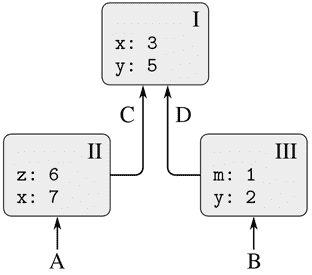

图 3.1 一个简单的环境结构。

环境对于求值过程至关重要，因为它决定了表达式应该在其中环境中进行求值的上下文。事实上，可以说编程语言中的表达式本身并没有任何意义。相反，表达式只有在某个环境中进行求值时才会获得意义。甚至对于像`display(1)`这样直接的表达式的解释也取决于理解在其中名称`display`指的是显示值的原始函数的上下文。因此，在我们的求值模型中，我们将始终讨论相对于某个环境求值表达式。为了描述与解释器的交互，我们假设存在一个全局环境，由一个单一框架（没有封闭环境）组成，其中包括与原始函数相关联的名称的值。例如，`display`是原始显示函数的名称的想法被捕捉为名称`display`在全局环境中绑定到原始显示函数。

在求值程序之前，我们在全局环境中添加一个新框架，即*程序框架*，得到*程序环境*。我们将程序顶层声明的名称添加到这个框架中，这些名称在任何块之外声明。然后，给定的程序将相对于程序环境进行求值。

### 3.2.1 求值规则

解释器求值函数应用的整体规范与我们在第 1.1.4 节首次介绍时保持一致：

+   要求值一个应用：

    1.  1. 求值应用的子表达式。¹²

    1.  2. 将函数子表达式的值应用于参数子表达式的值。

求值环境模型取代了替换模型，以指定将复合函数应用于参数的含义。

在求值环境模型中，函数始终是一个由一些代码和指向环境的指针组成的对。函数只能通过求值 lambda 表达式来创建。这会产生一个函数，其代码是从 lambda 表达式的文本中获取的，其环境是求值 lambda 表达式以产生函数的环境。例如，考虑函数声明

```js
function square(x) {
    return x * x;
}
```

在程序环境中求值。函数声明语法等同于底层的隐式 lambda 表达式。使用¹³也是等效的

```js
const square = x => x * x;
```

这将求值`x => x * x`并将`square`绑定到结果值，都在程序环境中。

图 3.2 显示了求值此声明语句的结果。全局环境包含程序环境。为了减少混乱，在此图之后，我们将不显示全局环境（因为它总是相同的），但是通过从程序环境向上的指针来提醒我们它的存在。函数对象是一个对，其代码指定函数有一个参数，即`x`，和一个函数体`return x * x;`。函数的环境部分是指向程序环境的指针，因为这是求值 lambda 表达式以生成函数的环境。一个新的绑定，将函数对象与名称`square`关联起来，已添加到程序帧中。

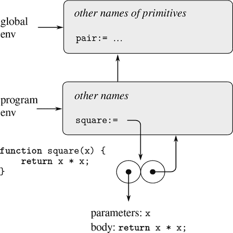

图 3.2 在程序环境中求值`function square(x) { return x * x; }`所产生的环境结构。

一般来说，`const`，`function`和`let`会向帧中添加绑定。常量不允许赋值，因此我们的环境模型需要区分指向常量的名称和指向变量的名称。我们通过在名称后面的冒号后写一个等号来表示名称是常量。我们认为函数声明等同于常量声明；请参见图 3.2 中冒号后的等号。

现在我们已经看到了函数是如何创建的，我们可以描述函数是如何应用的。环境模型指定：要将函数应用于参数，创建一个新的环境，其中包含一个将参数绑定到参数值的帧。此帧的封闭环境是函数指定的环境。现在，在这个新环境中，求值函数体。

为了展示这条规则是如何遵循的，图 3.3 说明了在程序环境中求值表达式`square(5)`所创建的环境结构，其中`square`是在图 3.2 中生成的函数。应用函数会导致创建一个新的环境，图中标记为 E1，它以一个帧开始，其中函数的参数`x`绑定到参数 5。请注意，环境 E1 中的名称`x`后面跟着一个冒号，没有等号，这表明参数`x`被视为变量。从这个帧向上指的指针显示了帧的封闭环境是程序环境。这里选择程序环境，因为这是`square`函数对象的一部分所指示的环境。在 E1 中，我们求值函数体，`return x * x;`。由于 E1 中`x`的值是 5，结果是`5 * 5`，即 25。

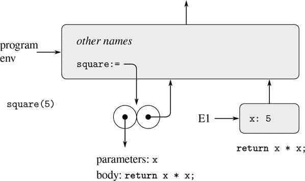

图 3.3 在程序环境中求值`square(5)`所创建的环境。

函数应用的环境模型可以总结为两条规则：

+   通过构建一个帧，将函数的参数绑定到调用的参数，然后在构建的新环境的上下文中求值函数体，将函数对象应用于一组参数。新帧的封闭环境是被应用的函数对象的环境部分。应用的结果是在求值函数体时遇到的第一个`return`语句的返回表达式的结果。

+   通过在给定环境中求值 lambda 表达式来创建函数。生成的函数对象是一个对，包括 lambda 表达式的文本和指向创建函数的环境的指针。

最后，我们指定了赋值的行为，这个操作迫使我们首先引入环境模型。在某个环境中求值表达式`name = value`会找到环境中名称的绑定。也就是说，找到环境中包含名称绑定的第一个框架。如果绑定是变量绑定——在框架中名称后面只有`:`表示——那么该绑定将被更改以反映变量的新值。否则，如果框架中的绑定是常量绑定——在名称后面由`:=`表示——赋值会发出“对常量赋值”的错误。如果环境中的名称未绑定，则赋值会发出“变量未声明”的错误。

这些求值规则虽然比替换模型复杂得多，但仍然相当简单。此外，求值模型虽然抽象，但提供了解释器如何求值表达式的正确描述。在第 4 章中，我们将看到这个模型如何作为实现工作解释器的蓝图。以下各节通过分析一些说明性程序详细阐述了该模型的细节。

### 3.2.2 应用简单函数

当我们在 1.1.5 节介绍了替换模型时，我们展示了应用`f(5)`的求值结果为 136，给定以下函数声明：

```js
function square(x) {
    return x * x;
}
function sum_of_squares(x, y) {
    return square(x) + square(y);
}
function f(a) {
    return sum_of_squares(a + 1, a * 2);
}
```

我们可以使用环境模型分析相同的例子。图 3.4 显示了通过在程序环境中求值`f`，`square`和`sum_of_squares`的定义而创建的三个函数对象。每个函数对象由一些代码组成，以及指向程序环境的指针。

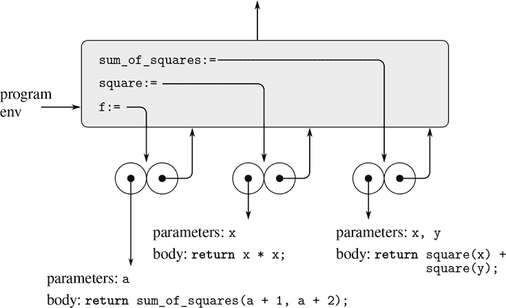

图 3.4 程序框架中的函数对象。

在图 3.5 中，我们看到通过求值表达式`f(5)`创建的环境结构。对`f`的调用创建了一个新的环境 E1，从一个框架开始，其中`f`的参数`a`绑定到参数 5。在 E1 中，我们求值`f`的主体：

```js
return sum_of_squares(a + 1, a * 2);
```

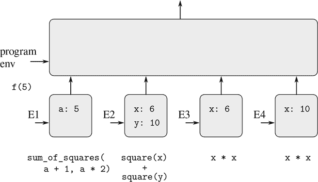

图 3.5 通过使用图 3.4 中的函数求值`f(5)`而创建的环境。

为了求值返回语句，我们首先求值返回表达式的子表达式。第一个子表达式`sum_of_squares`的值是一个函数对象。（注意如何找到这个值：我们首先查找 E1 的第一个框架，其中不包含`sum_of_squares`的绑定。然后我们继续到封闭环境，即程序环境，并找到图 3.4 中显示的绑定。）其他两个子表达式通过应用原始操作`+`和`*`来求值两个组合`a + 1`和`a * 2`，分别获得 6 和 10。

现在我们将函数对象`sum_of_squares`应用于参数 6 和 10。这将导致一个新的环境 E2，其中参数`x`和`y`绑定到参数。在 E2 中，我们求值语句

```js
return square(x) + square(y);
```

这导致我们求值`square(x)`，其中`square`在程序框架中找到，`x`为 6。再次，我们建立一个新的环境 E3，在其中`x`绑定到 6，并在其中求值`square`的主体，即`return x * x;`。同样作为应用`sum_of_squares`的一部分，我们必须求值子表达式`square(y)`，其中`y`为 10。对`square`的第二次调用创建了另一个环境 E4，在其中`square`的参数`x`绑定到 10。在 E4 中，我们必须求值`return x * x;`。

需要注意的重要一点是，每次调用`square`都会创建一个包含`x`绑定的新环境。我们可以在这里看到不同的帧是如何保持分开的不同的名为`x`的本地变量的。请注意，`square`创建的每个帧都指向程序环境，因为这是`square`函数对象指定的环境。

在子表达式被求值之后，结果被返回。`square`的两次调用生成的值被`sum_of_squares`相加，这个结果被`f`返回。由于我们这里的重点是环境结构，我们不会详细讨论这些返回值是如何从调用传递到调用的；然而，这也是求值过程的一个重要方面，我们将在第 5 章中详细讨论它。

##### 练习 3.9

在 1.2.1 节中，我们使用替换模型来分析两个计算阶乘的函数，一个是递归版本

```js
function factorial(n) {
    return n === 1
           ? 1
           : n * factorial(n - 1);
}
```

和迭代版本

```js
function factorial(n) {
    return fact_iter(1, 1, n);
}
function fact_iter(product, counter, max_count) {
    return counter > max_count
           ? product
           : fact_iter(counter * product,
                       counter + 1,
                       max_count);
}
```

展示了使用`factorial`函数的每个版本来求值`factorial(6)`的环境结构。¹⁶

### 3.2.3 帧作为本地状态的存储库

我们可以转向环境模型，看看如何使用函数和赋值来表示具有本地状态的对象。例如，考虑通过调用函数创建的“取款处理器”（来自第 3.1.1 节）

```js
function make_withdraw(balance) {
    return amount => {
               if (balance >= amount) {
                   balance = balance - amount;
                   return balance;
               } else {
                   return "insufficient funds";
               }
           };
}
```

让我们描述一下

```js
const W1 = make_withdraw(100); 
```

接着

```js
W1(50);
50
```

图 3.6 显示了在程序环境中声明`make_withdraw`函数的结果。这产生了一个包含指向程序环境的指针的函数对象。到目前为止，这与我们已经看到的例子没有什么不同，只是函数主体中的返回表达式本身是一个 lambda 表达式。

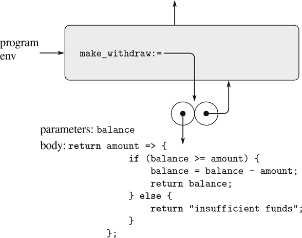

图 3.6 在程序环境中定义`make_withdraw`的结果。

当我们将函数`make_withdraw`应用到一个参数时，计算的有趣部分发生了：

```js
const W1 = make_withdraw(100);
```

我们通常是通过设置环境 E1 来开始的，在这个环境中，参数`balance`绑定到参数 100。在这个环境中，我们求值`make_withdraw`的主体，即返回语句，其返回表达式是一个 lambda 表达式。对这个 lambda 表达式的求值构造了一个新的函数对象，其代码由 lambda 表达式指定，其环境是 E1，lambda 表达式被求值以产生函数的环境。由对`make_withdraw`的调用返回的结果是这个函数对象。由于常量声明本身是在程序环境中被求值的，所以它在程序环境中绑定到`W1`。图 3.7 显示了生成的环境结构。

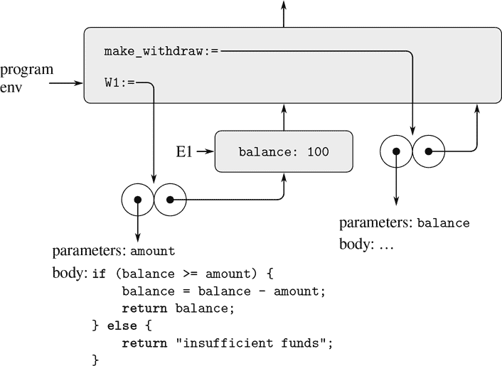

图 3.7 求值`const W1 = make_withdraw(100);`的结果。

现在我们可以分析当`W1`应用到一个参数时会发生什么：

```js
W1(50);
50
```

我们首先构建一个帧，在这个帧中，`W1`的参数`amount`绑定到参数 50。需要注意的关键点是，这个帧的封闭环境不是程序环境，而是环境 E1，因为这是由`W1`函数对象指定的环境。在这个新环境中，我们求值函数的主体：

```js
if (balance >= amount) {
    balance = balance - amount;
    return balance;
} else {
    return "insufficient funds";
}
```

生成的环境结构如图 3.8 所示。正在求值的表达式引用了`amount`和`balance`。变量`amount`将在环境中的第一个帧中找到，而`balance`将通过跟随封闭环境指针到 E1 中找到。

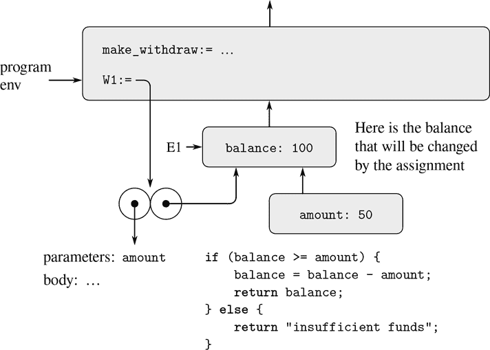

图 3.8 应用函数对象`W1`创建的环境。

当执行赋值时，E1 中`balance`的绑定被更改。在调用`W1`完成时，`balance`为 50，并且仍然由函数对象`W1`指向包含`balance`的帧。绑定`amount`的帧（我们执行了更改`balance`的代码）不再相关，因为构造它的函数调用已经终止，并且没有来自环境其他部分的指针指向该帧。下次调用`W1`时，这将构建一个绑定`amount`的新帧，其封闭环境为 E1。我们看到 E1 充当了为函数对象`W1`保存局部状态变量的“位置”。图 3.9 显示了调用`W1`后的情况。

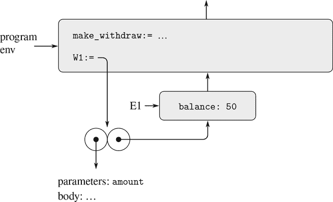

图 3.9 调用`W1`后的环境。

观察当我们通过再次调用`make_withdraw`创建第二个`withdraw`对象时会发生什么：

```js
const W2 = make_withdraw(100);
```

这产生了图 3.10 中的环境结构，显示`W2`是一个函数对象，即一个带有一些代码和一个环境的对。`W2`的环境 E2 是通过调用`make_withdraw`创建的。它包含一个带有自己的局部绑定`balance`的帧。另一方面，`W1`和`W2`具有相同的代码：`make_withdraw`主体中 lambda 表达式指定的代码。¹⁷我们在这里看到了为什么`W1`和`W2`表现为独立对象。对`W1`的调用引用存储在 E1 中的状态变量`balance`，而对`W2`的调用引用 E2 中存储的`balance`。因此，对一个对象的局部状态的更改不会影响另一个对象。

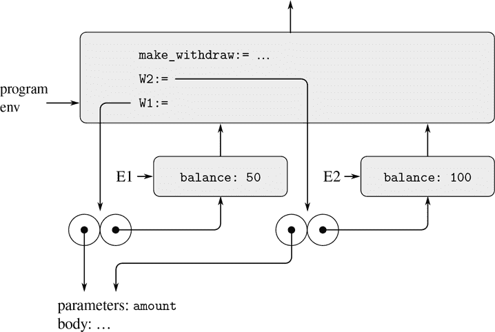

图 3.10 使用`const W2 = make_withdraw(100);`创建第二个对象。

##### 练习 3.10

在`make_withdraw`函数中，局部变量`balance`作为`make_withdraw`的参数创建。我们还可以使用我们可以称之为*立即调用的 lambda 表达式*单独创建局部状态变量，如下所示：

```js
function make_withdraw(initial_amount) {
    return (balance =>
              amount => {
                  if (balance >= amount) {
                      balance = balance - amount;
                      return balance;
                   } else {
                      return "insufficient funds";
                   }
              })(initial_amount);
}
```

外部 lambda 表达式在求值后立即被调用。它的唯一目的是创建一个名为`balance`的局部变量，并将其初始化为`initial_amount`。使用环境模型分析`make_withdraw`的这个替代版本，绘制类似上面的图形以说明交互。

```js
const W1 = make_withdraw(100);

W1(50);

const W2 = make_withdraw(100);
```

展示`make_withdraw`的两个版本创建具有相同行为的对象。这两个版本的环境结构有何不同？

### 3.2.4 内部声明

在本节中，我们处理包含声明的函数体或其他块（例如条件语句的分支）。每个块为在块中声明的名称打开一个新的作用域。为了在给定环境中求值一个块，我们通过一个包含在块的主体中直接声明的所有名称的新帧来扩展该环境，然后在新构建的环境中求值主体。

1.1.8 节介绍了函数可以具有内部声明的概念，从而导致块结构，如下面的函数计算平方根：

```js
function sqrt(x) {
   function is_good_enough(guess) {
      return abs(square(guess) - x) < 0.001;
   }
   function improve(guess) {
      return average(guess, x / guess);
   }
   function sqrt_iter(guess){
      return is_good_enough(guess)
             ? guess
             : sqrt_iter(improve(guess));
   }
   return sqrt_iter(1);
}
```

现在我们可以使用环境模型来看为什么这些内部声明的行为符合预期。图 3.11 显示了在求值表达式`sqrt(2)`时，内部函数`is_good_enough`首次被调用，其中`guess`等于 1。

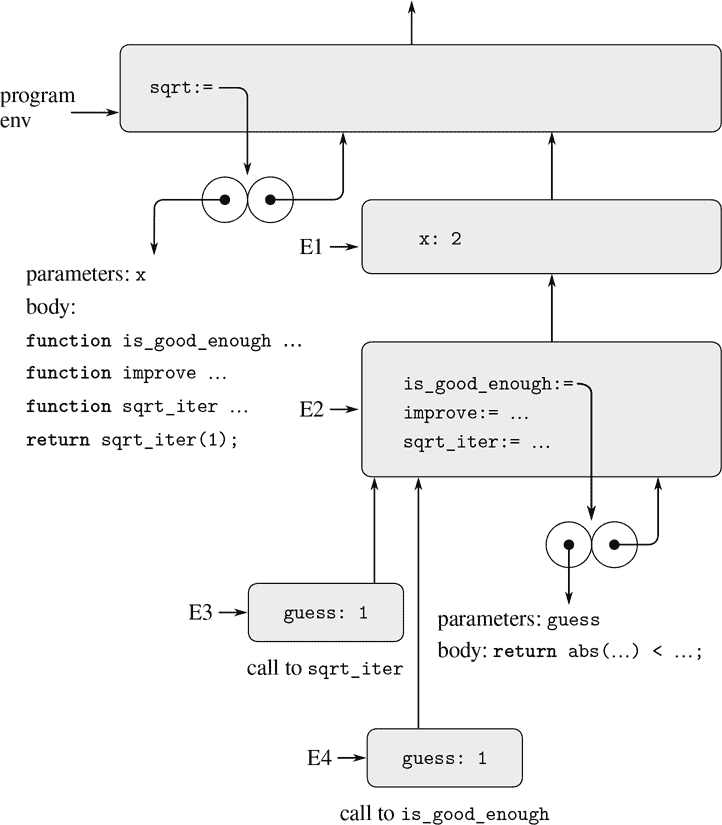

图 3.11 带有内部声明的`sqrt`函数。

观察环境的结构。名称`sqrt`在程序环境中绑定到一个函数对象，其关联的环境是程序环境。当调用`sqrt`时，形成了一个新的环境 E1，它是程序环境的下属，在其中参数`x`绑定到 2。然后在 E1 中求值了`sqrt`的主体。该主体是一个带有本地函数声明的块，因此 E1 被扩展为这些声明的新框架，导致新的环境 E2。然后在 E2 中求值了该块的主体。由于主体中的第一条语句是...

```js
function is_good_enough(guess) {
    return abs(square(guess) - x) < 0.001;
}
```

求值此声明在环境 E2 中创建了函数`is_good_enough`。更准确地说，E2 中的第一个框架中的名称`is_good_enough`绑定到一个函数对象，其关联的环境是 E2。类似地，`improve`和`sqrt_iter`在 E2 中被定义为函数。为简洁起见，图 3.11 仅显示了`is_good_enough`的函数对象。

在定义了本地函数之后，仍然在环境 E2 中求值了表达式`sqrt_iter(1)`。因此，在环境 E2 中绑定到`sqrt_iter`的函数对象被调用，并以 1 作为参数。这创建了一个环境 E3，在其中`sqrt_iter`的参数`guess`绑定到 1。然后`sqrt_iter`调用`is_good_enough`，并以`guess`的值（来自 E3）作为`is_good_enough`的参数。这建立了另一个环境 E4，在其中`is_good_enough`的参数`guess`绑定到 1。尽管`sqrt_iter`和`is_good_enough`都有一个名为`guess`的参数，但这些是位于不同框架中的两个不同的本地变量。此外，E3 和 E4 都将 E2 作为其封闭环境，因为`sqrt_iter`和`is_good_enough`函数都将 E2 作为其环境部分。这的一个结果是`is_good_enough`主体中出现的名称`x`将引用 E1 中出现的`x`的绑定，即调用原始`sqrt`函数时的`x`的值。

因此，环境模型解释了使本地函数声明成为模块化程序的两个关键属性。

+   本地函数的名称不会干扰封闭函数之外的名称，因为当块在求值时，本地函数名称将绑定在创建时的框架中，而不是绑定在程序环境中。

+   本地函数可以通过使用参数名称作为自由名称来访问封闭函数的参数。这是因为本地函数的主体在比封闭函数的求值环境低的环境中进行求值。

##### 练习 3.11

在 3.2.3 节中，我们看到环境模型如何描述具有本地状态的函数的行为。现在我们已经看到了内部声明的工作原理。典型的消息传递函数包含了这两个方面。考虑 3.1.1 节中的银行账户函数：

```js
function make_account(balance) {
    function withdraw(amount) {
        if (balance >= amount) {
            balance = balance - amount;
            return balance;
        } else {
            return "Insufficient funds";
        }
    }
    function deposit(amount) {
        balance = balance + amount;
        return balance;
    }
    function dispatch(m) {
        return m === "withdraw"
               ? withdraw
               : m === "deposit"
               ? deposit
               : "Unknown request: make_account";
    }
    return dispatch;
}
```

展示由交互序列生成的环境结构

```js
const acc = make_account(50);

acc("deposit")(40);
90

acc("withdraw")(60);
30
```

`acc`的本地状态在哪里保存？假设我们定义另一个帐户。

```js
const acc2 = make_account(100);
```

如何保持两个帐户的本地状态不同？`acc`和`acc2`之间共享环境结构的哪些部分？

##### 更多关于块的内容

正如我们所看到的，`sqrt`中声明的名称的作用域是`sqrt`的整个主体。这解释了为什么*相互递归*可以工作，就像这种（相当浪费的）检查非负整数是否为偶数的方式一样。

```js
function f(x) {
    function is_even(n) {
        return n === 0
               ? true
               : is_odd(n - 1);
    }
    function is_odd(n) {
        return n === 0
               ? false
               : is_even(n - 1);
    }
    return is_even(x);
}
```

当在调用`f`期间调用`is_even`时，环境图看起来像调用`sqrt_iter`时的图 3.11 中的图。函数`is_even`和`is_odd`在 E2 中绑定到指向 E2 的环境中调用这些函数的函数对象。因此，`is_even`中的`is_odd`指的是正确的函数。尽管`is_odd`在`is_even`之后定义，但这与`sqrt_iter`的主体中`improve`和`sqrt_iter`本身指向正确的函数没有区别。

有了处理块内声明的方法，我们可以重新审视顶层的名称声明。在 3.2.1 节中，我们看到在顶层声明的名称被添加到程序框架中。更好的解释是整个程序被放置在一个隐式块中，在全局环境中进行求值。上面描述的块的处理然后处理顶层：全局环境通过包含隐式块中声明的所有名称的绑定的框架进行扩展。该框架是程序框架，结果环境是程序环境。

我们说一个块的主体在一个包含在块主体中直接声明的所有名称的环境中进行求值。当进入块时，局部声明的名称被放入环境中，但没有关联的值。在求值块主体时，其声明的求值将名称分配给右边的表达式的结果，就好像声明是一个赋值一样。由于名称添加到环境中是与声明的求值分开的，整个块都在名称的范围内，一个错误的程序可能会在其声明被求值之前尝试访问名称的值；未分配名称的求值会发出错误信号。¹⁸

## 3.3 用可变数据建模

第 2 章讨论了复合数据作为构建计算对象的手段，这些对象有几个部分，以模拟具有多个方面的现实世界对象。在该章中，我们介绍了数据抽象的学科，根据这一学科，数据结构是根据构造函数来指定的，构造函数创建数据对象，选择器访问复合数据对象的部分。但是现在我们知道第 2 章没有涉及的数据的另一个方面。希望模拟由具有不断变化状态的对象组成的系统，这导致我们需要修改复合数据对象，以及构造和从中选择。为了模拟具有不断变化状态的复合对象，我们将设计数据抽象，以包括除选择器和构造函数之外的操作，称为*变异器*，这些操作修改数据对象。例如，模拟银行系统需要我们改变账户余额。因此，用于表示银行账户的数据结构可能允许一个操作

```js
set_balance(account, new-value)
```

更改指定帐户的余额为指定的新值的操作。定义了突变器的数据对象称为*可变数据对象*。

第 2 章介绍了对偶对作为合成复合数据的通用“粘合剂”。我们从定义对偶对的基本突变器开始这一部分，以便对偶对可以作为构造可变数据对象的构建块。这些突变器极大地增强了对偶对的表示能力，使我们能够构建除了我们在第 2.2 节中使用的序列和树之外的数据结构。我们还提供了一些模拟的示例，其中复杂系统被建模为具有局部状态的对象集合。

### 3.3.1 可变列表结构

对对的基本操作——`pair`、`head`和`tail`——可以用来构造列表结构和从列表结构中选择部分，但它们无法修改列表结构。到目前为止，我们使用的列表操作也是如此，比如`append`和`list`，因为这些可以用`pair`、`head`和`tail`来定义。要修改列表结构，我们需要新的操作。

对于对来说，原始的修改器是`set_head`和`set_tail`。函数`set_head`接受两个参数，第一个参数必须是对。它修改这个对，用`set_head`的第二个参数的指针替换`head`指针。¹⁹

例如，假设`x`绑定到`list(list("a", "b"), "c", "d")`，`y`绑定到`list("e", "f")`，如图 3.12 所示。求值表达式`set_head(x, y)`修改了`x`绑定的对，用`y`的值替换了它的`head`。操作的结果如图 3.13 所示。结构`x`已被修改，现在等价于`list(list("e", "f"), "c", "d")`。代表列表`list("a", "b")`的对，由被替换的指针标识，现在已从原始结构中分离。²⁰

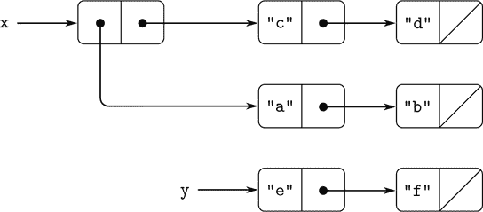

图 3.12 列表`x`：`list(list("a", "b"), "c", "d")`和`y`：`list("e", "f")`。

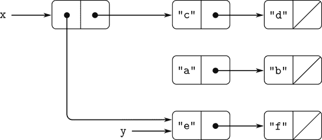

图 3.13 `set_head(x, y)`对图 3.12 中的列表的影响。

将图 3.13 与图 3.14 进行比较，它说明了执行的结果

```js
const z = pair(y, tail(x));
```

`x`和`y`绑定到图 3.12 中的原始列表。现在，名称`z`绑定到由`pair`操作创建的新对；`x`绑定的列表保持不变。`set_tail`操作类似于`set_head`。唯一的区别是用`tail`指针替换对的`head`指针。在图 3.12 中执行`set_tail(x, y)`的效果如图 3.15 所示。这里，`x`的`tail`指针已被替换为指向`list("e", "f")`。此外，曾经是`x`的`tail`的列表`list("c", "d")`现在已从结构中分离。

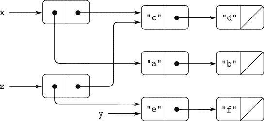

图 3.14 `const z = pair(y, tail(x));`对图 3.12 中的列表的影响。

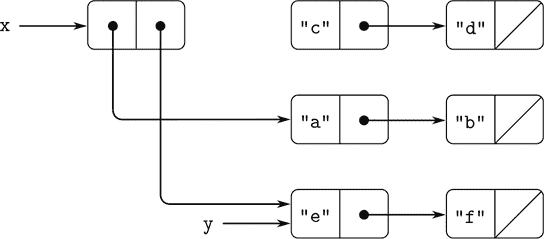

图 3.15 `set_tail(x, y)`对图 3.12 中的列表的影响。

函数`pair`通过创建新的对来构建新的列表结构，而`set_head`和`set_tail`修改现有的对。事实上，我们可以使用这两个修改器来实现`pair`，再加上一个`get_new_pair`函数，它返回一个不属于任何现有列表结构的新对。我们获得新对，将其`head`和`tail`指针设置为指定的对象，并将新对作为`pair`的结果返回。²¹

```js
function pair(x, y) {
    const fresh = get_new_pair();
    set_head(fresh, x);
    set_tail(fresh, y);
    return fresh;
}
```

##### 练习 3.12

在 2.2.1 节中引入了以下用于追加列表的函数：

```js
function append(x, y) {
    return is_null(x)
           ? y
           : pair(head(x), append(tail(x), y));
}
```

函数`append`通过将`x`的元素依次添加到`y`的前面来形成一个新的列表。函数`append_mutator`类似于`append`，但它是一个修改器而不是构造器。它通过将它们拼接在一起来追加列表，修改`x`的最后一个对，使其`tail`现在是`y`。（使用空的`x`调用`append_mutator`是一个错误。）

```js
function append_mutator(x, y) {
    set_tail(last_pair(x), y);
    return x;
}
```

这里`last_pair`是一个返回其参数中的最后一个对的函数：

```js
function last_pair(x) {
    return is_null(tail(x))
          ? x
          : last_pair(tail(x));
}
```

考虑交互

```js
const x = list("a", "b");

const y = list("c", "d");

const z = append(x, y);

z;
["a", ["b", ["c", ["d, null]]]]

tail(x);
response

const w = append_mutator(x, y);

w;
["a", ["b", ["c", ["d", null]]]]

tail(x);
response
```

缺少的`response`是什么？绘制框和指针图来解释你的答案。

##### 练习 3.13

考虑以下`make_cycle`函数，它使用了练习 3.12 中定义的`last_pair`函数：

```js
function make_cycle(x) {
    set_tail(last_pair(x), x);
    return x;
}
```

绘制一个框和指针图，显示由`z`创建的结构

```js
const z = make_cycle(list("a", "b", "c"));
```

如果我们尝试计算`last_pair(z)`会发生什么？

##### 练习 3.14

以下功能非常有用，尽管有些晦涩：

```js
function mystery(x) {
    function loop(x, y) {
        if (is_null(x)) {
            return y;
        } else {
            const temp = tail(x);
            set_tail(x, y);
            return loop(temp, x);
        }
    }
    return loop(x, null);
}
```

函数`loop`使用“临时”名称`temp`来保存`x`的`tail`的旧值，因为下一行的`set_tail`会破坏`tail`。解释`mystery`一般是做什么的。假设`v`由以下定义

```js
const v = list("a", "b", "c", "d");
```

绘制代表`v`绑定的列表的框和指针图。假设我们现在求值

```js
const w = mystery(v);
```

绘制框和指针图，显示在求值此程序后`v`和`w`的结构。`v`和`w`的值将打印为什么？

##### 共享和身份

我们在 3.1.3 节中提到了由赋值引入的“相同”和“改变”的理论问题。当不同的数据对象之间共享个别成对时，这些问题在实践中会出现。例如，考虑以下结构形成的结构

```js
const x = list("a", "b");
const z1 = pair(x, x);
```

如图 3.16 所示，`z1`是一个`head`和`tail`都指向同一个`x`的成对。`z1`的`head`和`tail`共享`x`是`pair`实现的直接方式的结果。一般来说，使用`pair`构造列表将导致成对的交织结构，其中许多单个成对被许多不同的结构共享。

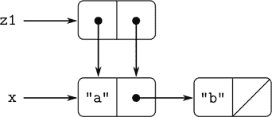

图 3.16 由`pair(x, x)`形成的列表`z1`。

与图 3.16 相比，图 3.17 显示了由此创建的结构

```js
const z2 = pair(list("a", "b"), list("a", "b"));
```

在这个结构中，两个`list("a", "b")`列表中的成对是不同的，尽管它们包含相同的字符串。²²

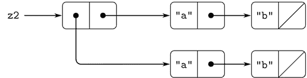

图 3.17 由`pair(list("a", "b"), list("a", "b"))`形成的列表`z2`。

当被视为列表时，`z1`和`z2`都代表“相同”的列表：

```js
list(list("a", "b"), "a", "b")
```

一般来说，如果我们只使用`pair`，`head`和`tail`在列表上操作，共享是完全不可检测的。但是，如果我们允许在列表结构上使用变异器，共享就变得重要。作为共享可能产生的差异的一个例子，考虑以下函数，该函数修改了应用于它的结构的`head`：

```js
function set_to_wow(x) {
    set_head(head(x), "wow");
    return x;
}
```

尽管`z1`和`z2`是“相同”的结构，但将`set_to_wow`应用于它们会产生不同的结果。对于`z1`，改变`head`也会改变`tail`，因为在`z1`中`head`和`tail`是相同的成对。对于`z2`，`head`和`tail`是不同的，因此`set_to_wow`只修改`head`：

```js
z1;
[["a", ["b", null]], ["a", ["b", null]]]

set_to_wow(z1);
[["wow", ["b", null]], ["wow", ["b", null]]]

z2;
[["a", ["b", null]], ["a", ["b", null]]]

set_to_wow(z2);
[["wow", ["b", null]], ["a", ["b", null]]]
```

检测列表结构中的共享的一种方法是使用原始谓词`===`，我们在 1.1.6 节中引入了它来测试两个数字是否相等，并在 2.3.1 节中扩展了它来测试两个字符串是否相等。当应用于两个非原始值时，`x === y`测试`x`和`y`是否是相同的对象（即`x`和`y`是否作为指针相等）。因此，对于图 3.16 和 3.17 中定义的`z1`和`z2`，`head(z1) === tail(z1)`为真，`head(z2) === tail(z2)`为假。

如下一节所示，我们可以利用共享来大大扩展可以由成对表示的数据结构的范围。另一方面，共享也可能是危险的，因为对结构所做的修改也会影响其他恰好共享修改部分的结构。变异操作`set_head`和`set_tail`应该谨慎使用；除非我们对数据对象的共享有很好的理解，否则变异可能会产生意想不到的结果。²³

##### 练习 3.15

绘制框和指针图，解释`set_to_wow`对上述`z1`和`z2`结构的影响。

##### 练习 3.16

Ben Bitdiddle 决定编写一个函数来计算任何列表结构中的成对数。“很容易”，他推理道。“任何结构中的成对数是`head`中的数加上`tail`中的数再加一来计算当前的成对数。”于是 Ben 写下了以下函数

```js
function count_pairs(x) {
    return ! is_pair(x)
           ? 0
           : count_pairs(head(x)) +
             count_pairs(tail(x)) + 1;
}
```

展示这个函数是不正确的。特别是，绘制盒和指针图，表示由恰好三对组成的列表结构，Ben 的函数将返回 3；返回 4；返回 7；根本不返回。

##### 练习 3.17

设计练习 3.16 中`count_pairs`函数的正确版本，该函数返回任何结构中不同对的数量。（提示：遍历结构，维护一个辅助数据结构，用于跟踪已经计数的对。）

##### 练习 3.18

编写一个函数，检查列表并确定它是否包含循环，也就是说，一个试图通过连续的`tail`找到列表末尾的程序会进入无限循环。练习 3.13 构建了这样的列表。

##### 练习 3.19

使用仅占用恒定空间的算法重新执行练习 3.18。（这需要一个非常聪明的想法。）

##### 突变只是赋值

当我们引入复合数据时，我们在 2.1.3 节中观察到，对可以纯粹用函数表示：

```js
function pair(x, y) {
    function dispatch(m) {
    return m === "head"
           ? x
           : m === "tail"
           ? y
           : error(m, "undefined operation – pair");
    }
    return dispatch;
}
function head(z) { return z("head"); }
function tail(z) { return z("tail"); }
```

对于可变数据，同样的观察是正确的。我们可以使用赋值和本地状态将可变数据对象实现为函数。例如，我们可以扩展上面的对实现，以处理`set_head`和`set_tail`，类似于我们在 3.1.1 节中使用`make_account`实现银行账户的方式：

```js
function pair(x, y) {
    function set_x(v) { x = v; }
    function set_y(v) { y = v; }
    return m => m === "head"
                ? x
                : m === "tail"
                ? y
                : m === "set_head"
                ? set_x
                : m === "set_tail"
                ? set_y
                : error(m, "undefined operation – pair");
}
function head(z) { return z("head"); }
function tail(z) { return z("tail"); }
function set_head(z, new_value) {
    z("set_head")(new_value);
    return z;
}
function set_tail(z, new_value) {
    z("set_tail")(new_value);
    return z;
}
```

理论上，只需要赋值就可以解释可变数据的行为。一旦我们承认在我们的语言中进行赋值，我们就提出了所有问题，不仅是赋值的问题，而且是可变数据的问题。²⁴

##### 练习 3.20

绘制环境图来说明语句序列的求值

```js
const x = pair(1, 2);
const z = pair(x, x);
set_head(tail(z), 17);

head(x);
17
```

使用上面给出的对的函数实现。（比较练习 3.11。）

### 3.3.2 表示队列

改变器`set_head`和`set_tail`使我们能够使用对来构建不能仅用`pair`、`head`和`tail`构建的数据结构。本节展示了如何使用对来表示称为队列的数据结构。3.3.3 节将展示如何表示称为表的数据结构。

*队列*是一个序列，其中项目被插入到一端（称为队列的*后端*），并从另一端（*前端*）删除。图 3.18 显示了一个最初为空的队列，其中插入了项目`a`和`b`。然后移除了`a`，插入了`c`和`d`，并移除了`b`。因为项目总是按照插入的顺序移除，所以队列有时被称为*FIFO*（先进先出）缓冲区。

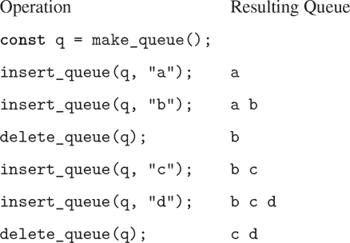

图 3.18 队列操作。

在数据抽象方面，我们可以将队列视为以下一组操作定义：

+   一个构造器：

    `make_queue`()

    返回一个空队列（不包含任何项目的队列）。

+   一个谓词：

    `is_empty_queue(queue)`

    测试队列是否为空。

+   一个选择器：

    `front_queue(queue)`

    返回队列前端的对象，如果队列为空则发出错误信号；它不修改队列。

+   两个改变器：

    `insert_queue(queue, item)`

    在队列的后端插入项目，并将修改后的队列作为其值返回。

    `delete_queue(queue)`

    移除队列前端的项目，并返回修改后的队列作为其值，如果在删除前队列为空，则发出错误信号。

因为队列是一系列项目，我们当然可以将其表示为普通列表；队列的前端将是列表的`head`，在队列中插入项目将相当于在列表末尾添加一个新元素，从队列中删除项目只是取列表的`tail`。然而，这种表示是低效的，因为为了插入一个项目，我们必须扫描列表直到达到末尾。由于我们扫描列表的唯一方法是通过连续的`tail`操作，因此对于`n`个项目的列表，这种扫描需要`Θ(n)`步骤。通过对列表表示的简单修改，可以克服这个缺点，使得队列操作可以实现为需要Θ(1)步骤；也就是说，需要的步骤数与队列的长度无关。

列表表示的困难之处在于需要扫描以找到列表的末尾。我们需要扫描的原因是，尽管将列表表示为一对对的链表是标准的方法，它很容易为我们提供指向列表开头的指针，但它并没有为我们提供指向末尾的指针。避免这个缺点的修改是将队列表示为列表，以及一个额外的指针，指示列表中的最后一对。这样，当我们要插入一个项目时，我们可以查看后指针，从而避免扫描列表。

然后，队列表示为一对指针，`front_ptr`和`rear_ptr`，分别指示普通列表中的第一对和最后一对。由于我们希望队列是一个可识别的对象，我们可以使用`pair`来组合这两个指针。因此，队列本身将是这两个指针的`pair`。图 3.19 说明了这种表示。

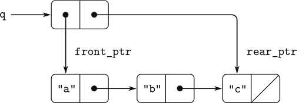

图 3.19 将队列实现为具有前端和后端指针的列表。

为了定义队列操作，我们使用以下函数，这些函数使我们能够选择和修改队列的前端和后端指针：

```js
function front_ptr(queue) { return head(queue); }
function rear_ptr(queue) { return tail(queue); }
function set_front_ptr(queue, item) { set_head(queue, item); }
function set_rear_ptr(queue, item) { set_tail(queue, item); }
```

现在我们可以实现实际的队列操作。如果队列的前端指针是空列表，我们将考虑队列为空：

```js
function is_empty_queue(queue) { return is_null(front_ptr(queue)); }
```

`make_queue`构造函数返回一个最初为空的队列，其`head`和`tail`都是空列表：

```js
function make_queue() { return pair(null, null); }
```

要选择队列前端的项目，我们返回由前端指针指示的对的`head`：

```js
function front_queue(queue) {
    return is_empty_queue(queue)
           ? error(queue, "front_queue called with an empty queue")
           : head(front_ptr(queue));
}
```

要在队列中插入一个项目，我们遵循图 3.20 中指示的结果的方法。我们首先创建一个新的对，其`head`是要插入的项目，其`tail`是空列表。如果队列最初为空，我们将队列的前端和后端指针设置为这个新对。否则，我们修改队列中的最后一对，使其指向新对，并且将后端指针设置为新对。

```js
function insert_queue(queue, item) {
    const new_pair = pair(item, null);
    if (is_empty_queue(queue)) {
        set_front_ptr(queue, new_pair);
        set_rear_ptr(queue, new_pair);
    } else {
        set_tail(rear_ptr(queue), new_pair);
        set_rear_ptr(queue, new_pair);
    }
    return queue;
}
```

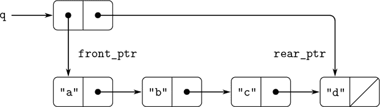

图 3.20 在图 3.19 的队列上使用`insert_queue(q, "d")`的结果。

要删除队列前端的项目，我们只需修改前端指针，使其现在指向队列中的第二个项目，可以通过跟随第一个项目的`tail`指针找到（参见图 3.21）：²⁵

```js
function delete_queue(queue) {
    if (is_empty_queue(queue)) {
        error(queue, "delete_queue called with an empty queue");
    } else {
        set_front_ptr(queue, tail(front_ptr(queue)));
        return queue;
    }
}
```

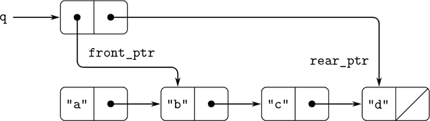

图 3.21 在图 3.20 的队列上使用`delete_queue(q)`的结果。

##### 练习 3.21

Ben Bitdiddle 决定测试上述队列实现。他将函数输入 JavaScript 解释器，并开始尝试它们：

```js
const q1 = make_queue();

insert_queue(q1, "a");
[["a", null], ["a", null]]

insert_queue(q1, "b");
[["a", ["b", null]], ["b", null]]

delete_queue(q1);
[["b", null], ["b", null]]

delete_queue(q1);
[null, ["b", null]]
```

“这全都错了！”他抱怨道。“解释器的响应显示最后一个项目被插入队列两次。当我删除两个项目时，第二个`b`仍然存在，所以队列不是空的，尽管它应该是。”Eva Lu Ator 建议 Ben 误解了发生了什么。“不是项目被插入队列两次，”她解释道。“只是标准的 JavaScript 打印机不知道如何理解队列表示。如果你想正确打印队列，你必须为队列定义自己的打印函数。”解释 Eva Lu 所说的。特别是，说明 Ben 的示例产生了它们所产生的打印结果。定义一个函数`print_queue`，该函数以队列作为输入并打印队列中的项目序列。

##### 练习 3.22

我们可以将队列表示为具有本地状态的函数，而不是将队列表示为一对指针。本地状态将包括指向普通列表的开头和结尾的指针。因此，`make_queue`函数将具有以下形式

```js
function make_queue() {
    let front_ptr = ...;
    let rear_ptr = ...;
    〈declarations of internal functions〉
    function dispatch(m) {...}
    return dispatch;
}
```

完成`make_queue`的定义，并使用此表示提供队列操作的实现。

##### 练习 3.23

双端队列（“*deque*”）是一个序列，其中项目可以在前端或后端插入和删除。双端队列的操作包括构造函数`make_deque`，谓词`is_empty_deque`，选择器`front_deque`和`rear_deque`，以及变异器`front_insert_deque`，`front_delete_deque`，`rear_insert_deque`和`rear_delete_ deque`。展示如何使用对表示 deque，并给出操作的实现。²⁶所有操作应在Θ(1)步骤中完成。

### 3.3.3 表示表

当我们在第 2 章研究了各种表示集合的方式时，在第 2.3.3 节中提到了通过识别键索引的记录表的维护任务。在第 2.4.3 节中的数据导向编程的实现中，我们广泛使用了二维表，其中使用两个键存储和检索信息。在这里，我们看到如何将表构建为可变列表结构。

首先考虑一维表，其中每个值都存储在单个键下。我们将表实现为记录的列表，每个记录都实现为一个由键和相关值组成的对。这些记录通过将`head`指向连续记录的对粘合在一起形成列表。这些粘合对被称为表的*支柱*。为了在向表中添加新记录时有一个可以更改的位置，我们将表构建为*头列表*。头列表在开头有一个特殊的支柱对，其中包含一个虚拟的“记录”——在这种情况下是任意选择的字符串`"table"`。图 3.22 显示了表的盒子和指针图。

```js
a: 1
b: 2
c: 3
```

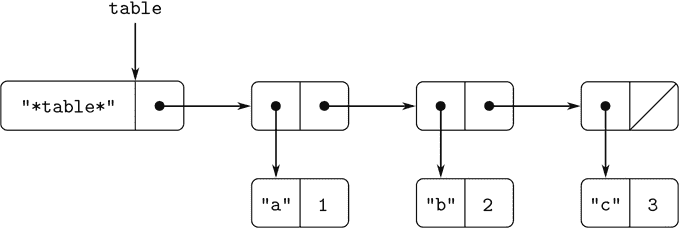

图 3.22 以头列表形式表示的表。

为了从表中提取信息，我们使用`lookup`函数，该函数以键作为参数并返回相关值（如果在该键下没有存储值，则返回`undefined`）。`lookup`函数是根据`assoc`操作定义的，该操作期望键和记录列表作为参数。请注意，`assoc`从不看到虚拟记录。`assoc`函数返回具有给定键作为`head`的记录。²⁷然后`lookup`函数检查`assoc`返回的结果记录是否不是`undefined`，并返回记录的值（`tail`）。

```js
function lookup(key, table) {
    const record = assoc(key, tail(table));
    return is_undefined(record)
           ? undefined
           : tail(record);
}
function assoc(key, records) {
    return is_null(records)
           ? undefined
           : equal(key, head(head(records)))
           ? head(records)
           : assoc(key, tail(records));
}
```

要在指定的键下向表中插入一个值，我们首先使用`assoc`来查看表中是否已经存在具有该键的记录。如果没有，我们通过将键与值进行`pair`形成一个新记录，并将其插入到表的记录列表的头部（在虚拟记录之后）。如果已经存在具有该键的记录，我们将该记录的`tail`设置为指定的新值。表的标题为我们提供了一个固定的位置，以便插入新记录。²⁸

```js
function insert(key, value, table) {
    const record = assoc(key, tail(table));
    if (is_undefined(record)) {
        set_tail(table,
                 pair(pair(key, value), tail(table)));
    } else {
        set_tail(record, value);
    }
    return "ok";
}
```

要构造一个新表，我们只需创建一个包含字符串`"table"`的列表：

```js
function make_table() {
    return list("table");
}
```

##### 二维表

在二维表中，每个值都由两个键索引。我们可以将这样的表构造为一个一维表，其中每个键都标识一个子表。图 3.23 显示了该表的框和指针图。

```js
"math":
    "+": 43
    "-": 45
    "*": 42
"letters":
    "a": 97
    "b": 98
```

该对象有两个子表。（子表不需要特殊的标题字符串，因为标识子表的键就起到了这个作用。）

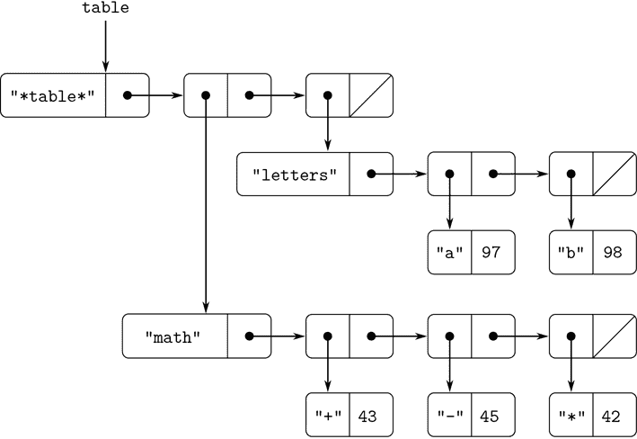

图 3.23 二维表。

当我们查找一个项目时，我们使用第一个键来标识正确的子表。然后我们使用第二个键来标识子表中的记录。

```js
function lookup(key_1, key_2, table) {
    const subtable = assoc(key_1, tail(table));
    if (is_undefined(subtable)) {
        return undefined;
    } else {
        const record = assoc(key_2, tail(subtable));
        return is_undefined(record)
               ? undefined
               : tail(record);
    }
}
```

要在一对键下插入一个新项目，我们使用`assoc`来查看是否已经存储了第一个键下的子表。如果没有，我们构建一个包含单个记录（`key_2`，`value`）的新子表，并将其插入到第一个键下的表中。如果有一个

如果第一个键的子表已经存在，我们将使用上面描述的一维表的插入方法将新记录插入到该子表中：

```js
function insert(key_1, key_2, value, table) {
    const subtable = assoc(key_1, tail(table));
    if (is_undefined(subtable)) {
        set_tail(table,
                 pair(list(key_1, pair(key_2, value)), tail(table)));
    } else {
        const record = assoc(key_2, tail(table));
        if (is_undefined(record)) {
            set_tail(subtable,
                     pair(pair(key_2, value), tail(subtable)));
        } else {
            set_tail(record, value);
        }
    }
    return "ok";
}
```

##### 创建本地表

上面定义的`lookup`和`insert`操作将表作为参数。这使我们能够使用访问多个表的程序。处理多个表的另一种方法是为每个表单独拥有`lookup`和`insert`函数。我们可以通过过程化地表示一个表来实现这一点，将其作为一个对象，该对象将内部表作为其本地状态的一部分。当发送适当的消息时，这个“表对象”提供用于在内部表上操作的函数。以下是以这种方式表示的二维表的生成器：

```js
function make_table() {
    const local_table = list("table");
    function lookup(key_1, key_2) {
        const subtable = assoc(key_1, tail(local_table));
        if (is_undefined(subtable)) {
            return undefined;
        } else {
            const record = assoc(key_2, tail(subtable));
            return is_undefined(record)
                   ? undefined
                   : tail(record);
        }
    }
    function insert(key_1, key_2, value) {
        const subtable = assoc(key_1, tail(local_table));
        if (is_undefined(subtable)) {
            set_tail(local_table,
                     pair(list(key_1, pair(key_2, value)),
                          tail(local_table)));
        } else {
            const record = assoc(key_2, tail(subtable));
            if (is_undefined(record)) {
                set_tail(subtable,
                         pair(pair(key_2, value), tail(subtable)));
            } else {
                set_tail(record, value);
            }
        }
    }
    function dispatch(m) {
        return m === "lookup"
               ? lookup
               : m === "insert"
               ? insert
               : error(m, "unknown operation – table");
    }
    return dispatch;
}
```

使用`make_table`，我们可以实现第 2.4.3 节中用于数据导向编程的`get`和`put`操作，如下所示：

```js
const operation_table = make_table();
const get = operation_table("lookup");
const put = operation_table("insert");
```

函数`get`以两个键作为参数，`put`以两个键和一个值作为参数。这两个操作都访问同一个本地表，该表封装在通过调用`make_table`创建的对象中。

##### 练习 3.24

在上面的表实现中，使用`equal`（由`assoc`调用）来测试键的相等性。这并不总是适当的测试。例如，我们可能有一个具有数字键的表，在这种情况下，我们不需要与我们查找的数字完全匹配，而只需要在某个公差范围内的数字。设计一个表构造函数`make_table`，它以一个`same_key`函数作为参数，该函数将用于测试键的“相等性”。函数`make_table`应返回一个`dispatch`函数，该函数可用于访问本地表的适当`lookup`和`insert`函数。

##### 练习 3.25

将一维和二维表泛化，展示如何实现一个表，其中值存储在任意数量的键下，并且不同数量的键下可能存储不同的值。`lookup`和`insert`函数应以用于访问表的键列表作为输入。

##### 练习 3.26

上面实现的搜索表需要扫描记录列表。这基本上是第 2.3.3 节的无序列表表示。对于大表，可能更有效地以不同的方式构造表。描述一个表实现，其中（键，值）记录使用二叉树组织，假设键可以以某种方式排序（例如，按数字或字母顺序）。 （比较第 2 章的练习 2.66。）

##### 练习 3.27

*记忆化*（也称为*制表法*）是一种使函数能够记录先前计算过的值的技术。这种技术可以极大地改善程序的性能。记忆化函数维护一个表，其中存储了以产生值的参数为键的先前调用的值。当记忆化函数被要求计算一个值时，它首先检查表，看看值是否已经存在，如果是，就返回该值。否则，它以普通方式计算新值，并将其存储在表中。作为记忆化的一个例子，回想一下第 1.2.2 节中用于计算斐波那契数的指数过程：

```js
function fib(n) {
    return n === 0
           ? 0
           : n === 1
           ? 1
           : fib(n - 1) + fib(n - 2);
}
```

相同函数的记忆化版本是

```js
const memo_fib = memoize(n => n === 0
                              ? 0
                              : n === 1
                              ? 1
                              : memo_fib(n - 1) +
                                memo_fib(n - 2)
                        );
```

其中记忆器定义为

```js
function memoize(f) {
    const table = make_table();
    return x => {
               const previously_computed_result =
                   lookup(x, table);
               if (is_undefined(previously_computed_result)) {
                   const result = f(x);
                   insert(x, result, table);
                   return result;
               } else {
                   return previously_computed_result;
               }
           };
}
```

绘制一个环境图来分析`memo_fib(3)`的计算。解释为什么`memo_fib`计算第 n 个斐波那契数的步骤数量与 n 成比例。如果我们简单地将`memo_fib`定义为`memoize(fib)`，这种方案是否仍然有效？

### 3.3.4 数字电路模拟器

设计复杂的数字系统，如计算机，是一项重要的工程活动。数字系统是通过连接简单元素构建的。尽管这些单独元素的行为很简单，但它们的网络可能具有非常复杂的行为。计算机模拟提议的电路设计是数字系统工程师使用的重要工具。在本节中，我们设计了一个用于执行数字逻辑模拟的系统。这个系统代表了一种称为*事件驱动模拟*的程序类型，其中动作（“事件”）触发以后发生的更多事件，这些事件又触发更多事件，依此类推。

我们的电路的计算模型将由与构成电路的基本组件对应的对象组成。有*电线*，它们携带*数字信号*。数字信号在任何时刻只能有两个可能值之一，0 和 1。还有各种类型的数字*功能框*，它们将携带输入信号的电线连接到其他输出电线。这些框从它们的输入信号计算输出信号。输出信号的延迟时间取决于功能框的类型。例如，*反相器*是一个原始功能框，它反转其输入。如果反相器的输入信号变为 0，则一个*反相器延迟*后，反相器将把其输出信号更改为 1。如果反相器的输入信号变为 1，则一个*反相器延迟*后，反相器将把其输出信号更改为 0。我们以图 3.24 中的符号来绘制反相器。*与门*也显示在图 3.24 中，它是一个具有两个输入和一个输出的原始功能框。它将其输出信号驱动到与输入的*逻辑与*值相同的值。也就是说，如果其两个输入信号都变为 1，则一个*与门延迟*时间后，与门将强制其输出信号为 1；否则输出将为 0。*或门*是一个类似的两输入原始功能框，它将其输出信号驱动到与输入的*逻辑或*值相同的值。也就是说，如果至少一个输入信号为 1，则输出将变为 1；否则输出将变为 0。

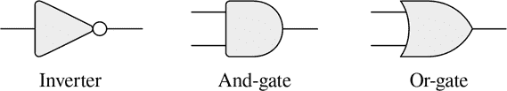

图 3.24 数字逻辑模拟器中的原始函数。

我们可以将原始函数连接在一起，以构建更复杂的函数。为了实现这一点，我们将一些功能框的输出连接到其他功能框的输入。例如，图 3.25 中显示的*半加器*电路由一个或门、两个与门和一个反相器组成。它接收两个输入信号`A`和`B`，并有两个输出信号`S`和`C`。当`A`和`B`中恰好有一个为 1 时，`S`将变为 1，当`A`和`B`都为 1 时，`C`将变为 1。从图中我们可以看到，由于涉及到的延迟，输出可能在不同的时间生成。数字电路设计中的许多困难都源于这一事实。

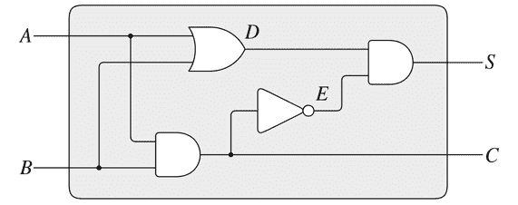

图 3.25 一个半加器电路。

我们现在将构建一个用于建模我们希望研究的数字逻辑电路的程序。该程序将构建计算对象，对信号进行建模。功能框将由强制执行信号之间正确关系的函数进行建模。

我们模拟的一个基本元素将是一个名为`make_wire`的函数，用于构建信号线。例如，我们可以按照以下方式构建六根信号线：

```js
const a = make_wire();
const b = make_wire();
const c = make_wire();
const d = make_wire();
const e = make_wire();
const s = make_wire();
```

我们通过调用一个构造该类型框的函数将一个函数框连接到一组线上。构造函数的参数是要连接到框的线。例如，鉴于我们可以构建与门、或门和反相器，我们可以将图 3.25 中显示的半加器连接在一起：

```js
or_gate(a, b, d);
"ok"

and_gate(a, b, c);
"ok"

inverter(c, e);
"ok"

and_gate(d, e, s);
"ok"
```

更好的是，我们可以通过定义一个名为`half_ adder`的函数来显式命名这个操作，该函数构建这个电路，给定要连接到半加器的四根外部线：

```js
function half_adder(a, b, s, c) {
    const d = make_wire();
    const e = make_wire();
    or_gate(a, b, d);
    and_gate(a, b, c);
    inverter(c, e);
    and_gate(d, e, s);
    return "ok";
}
```

制定这个定义的优势在于，我们可以使用`half_adder`本身作为创建更复杂电路的构建块。例如，图 3.26 展示了由两个半加器和一个或门组成的*全加器*。我们可以按照以下方式构建一个全加器：

```js
function full_adder(a, b, c_in, sum, c_out) {
    const s = make_wire();
    const c1 = make_wire();
    const c2 = make_wire();
    half_adder(b, c_in, s, c1);
    half_adder(a, s, sum, c2);
    or_gate(c1, c2, c_out);
    return "ok";
}
```

定义了`full_adder`作为一个函数后，我们现在可以将其用作创建更复杂电路的构建块。（例如，参见练习 3.30。）

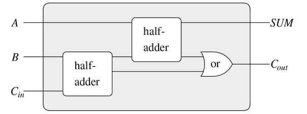

图 3.26 一个全加器电路。

实质上，我们的模拟器为我们提供了构建电路语言的工具。如果我们采用了我们在第 1.1 节中研究 JavaScript 时所采用的关于语言的一般观点，我们可以说原始功能框构成了语言的原始元素，将框连接在一起提供了一种组合的手段，指定框作为函数的连线模式作为抽象的手段。

##### 原始功能框

原始功能框实现了一根线上的信号变化如何影响其他线上的信号的“力量”。为了构建功能框，我们使用以下操作：

+   `get_signal(wire)`

    返回信号线上的当前值。

+   `set_signal(wire, new-value):`

    将信号线上的信号值更改为新值。

+   `add_action(wire, function-of -no-arguments):`

    断言指定的函数应该在线上的信号值发生变化时运行。这些函数是信号值变化传递给其他线的工具。

此外，我们将使用一个名为`after_delay`的函数，该函数接受一个时间延迟和一个要运行的函数，并在给定延迟后执行给定的函数。

使用这些功能，我们可以定义原始的数字逻辑功能。要通过反相器将输入连接到输出，我们使用`add_action`将输入线与一个函数关联起来，每当输入线上的信号值发生变化时，该函数就会运行。该函数计算输入信号的`logical_not`，然后在一个`inverter_delay`之后，将输出信号设置为这个新值：

```js
function inverter(input, output) {
    function invert_input() {
        const new_value = logical_not(get_signal(input));
        after_delay(inverter_delay,
                    () => set_signal(output, new_value));
    }
    add_action(input, invert_input);
    return "ok";
}
function logical_not(s) {
    return s === 0
           ? 1
           : s === 1
           ? 0
           : error(s, "invalid signal");
}
```

与门稍微复杂一些。如果门的任一输入发生变化，则必须运行动作函数。它计算输入电线上的信号值的`logical_and`（使用类似于`logical_not`的函数），并设置在`and_gate_delay`之后在输出电线上发生新值的变化。

```js
function and_gate(a1, a2, output) {
    function and_action_function() {
        const new_value = logical_and(get_signal(a1),
                                      get_signal(a2));
        after_delay(and_gate_delay,
                    () => set_signal(output, new_value));
    }
    add_action(a1, and_action_function);
    add_action(a2, and_action_function);
    return "ok";
}
```

##### 练习 3.28

将或门定义为原始函数框。您的`or_gate`构造函数应类似于`and_gate`。

##### 练习 3.29

构建或门的另一种方法是作为一个复合数字逻辑设备，由与门和反相器构建而成。定义一个函数`or_gate`来实现这一点。或门的延迟时间是多少，用`and_gate_delay`和`inverter_delay`来表示？

##### 练习 3.30

图 3.27 显示了由串联`n`个全加器形成的*链式进位加法器*。这是用于加法两个`n`位二进制数的最简单形式的并行加法器。输入`A[1]`、`A[2]`、`A[3]`，...，`A[n]`和`B[1]`、`B[2]`、`B[3]`，...，`B[n]`是要相加的两个二进制数（每个`A[k]`和`B[k]`都是 0 或 1）。电路生成` S[1], S [2], S [3], ...,  S [n]`，和`C`，加法的进位。编写一个函数`ripple_carry_adder`来生成这个电路。该函数应该接受三个`n`个电线的列表作为参数——`A[k]`、`B[k]`和`S[k]`，还有另一个电线`C`。*链式进位加法器*的主要缺点是需要等待进位信号传播。以*与门*、*或门*和反相器的延迟来表示，获得`n`位*链式进位加法器*的完整输出所需的延迟是多少？

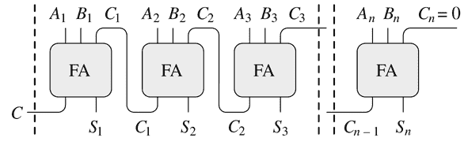

图 3.27 一个用于`n`位数字的*链式进位加法器*。

##### 代表电线

在我们的模拟中，电线将是一个计算对象，具有两个本地状态变量：`signal_value`（最初为 0）和要在信号变化时运行的`action_functions`集合。我们使用消息传递样式实现电线，作为一组本地函数以及选择适当的本地操作的`dispatch`函数，就像我们在第 3.1.1 节中的简单银行账户对象中所做的那样：

```js
function make_wire() {
    let signal_value = 0;
    let action_functions = null;
    function set_my_signal(new_value) {
        if (signal_value !== new_value) {
            signal_value = new_value;
            return call_each(action_functions);
        } else {
            return "done";
        }
    }
    function accept_action_function(fun) {
        action_functions = pair(fun, action_functions);
        fun();
    }
    function dispatch(m) {
        return m === "get_signal"
               ? signal_value
               : m === "set_signal"
               ? set_my_signal
               : m === "add_action"
               ? accept_action_function
               : error(m, "unknown operation – wire");
    }
    return dispatch;
}
```

本地函数`set_my_signal`测试新的信号值是否改变了电线上的信号。如果是，它将运行每个动作函数，使用以下函数`call_each`，该函数调用无参数函数列表中的每个项目：

```js
function call_each(functions) {
    if (is_null(functions)) {
        return "done";
    } else {
        head(functions)();
        return call_each(tail(functions));
    }
}
```

本地函数`accept_action_function`将给定的函数添加到要运行的函数列表中，然后运行新函数一次。（参见练习 3.31。）

设置本地`dispatch`函数后，我们可以提供以下函数来访问线上的本地操作：³⁰

```js
function get_signal(wire) {
    return wire("get_signal");
}
function set_signal(wire, new_value) {
    return wire("set_signal")(new_value);
}
function add_action(wire, action_function) {
    return wire("add_action")(action_function);
}
```

电线具有时变信号，可以逐步连接到设备，这是可变对象的典型特征。我们将它们建模为具有本地状态变量的函数，这些状态变量通过赋值进行修改。创建新电线时，将分配一组新的状态变量（通过`make_wire`中的`let`语句），并构造并返回一个新的`dispatch`函数，捕获具有新状态变量的环境。

电线被各种设备共享，这些设备已连接到它们。因此，通过与一个设备的交互所做的更改将影响连接到电线的所有其他设备。电线通过在建立连接时提供的动作函数来将更改通知给其邻居。

##### 议程

完成模拟器所需的唯一事情是`after_delay`。这里的想法是我们维护一个数据结构，称为`agenda`，其中包含要执行的计划。议程定义了以下操作：

+   `make_agenda()`：

    返回一个新的空议程。

+   `is_empty_agenda(agenda)`

    如果指定的议程为空，则为真。

+   `first_agenda_item(agenda)`

    返回日程表上的第一项。

+   `remove_first_agenda_item(agenda)`

    通过删除第一项来修改日程表。

+   `add_to_agenda(time, action, agenda)`

    通过添加给定的动作函数来修改日程表，以便在指定时间运行。

+   `current_time(agenda)`

    返回当前模拟时间。

我们使用的特定日程表由`the_agenda`表示。函数`after_delay`向`the_agenda`添加新元素：

```js
function after_delay(delay, action) {
    add_to_agenda(delay + current_time(the_agenda),
                  action,
                  the_agenda);
}
```

模拟由`propagate`函数驱动，该函数按顺序执行`the_agenda`上的每个函数。一般来说，随着模拟的运行，新的项目将被添加到日程表中，只要日程表上还有项目，`propagate`就会继续模拟：

```js
function propagate() {
    if (is_empty_agenda(the_agenda)) {
        return "done";
    } else {
        const first_item = first_agenda_item(the_agenda);
        first_item();
        remove_first_agenda_item(the_agenda);
        return propagate();
    }
}
```

##### 一个示例模拟

以下函数在动作上放置一个“探针”，展示了模拟器的运行。探针告诉导线，每当其信号值发生变化时，它应该打印新的信号值，以及当前时间和标识导线的名称。

```js
function probe(name, wire) {
    add_action(wire,
               () => display(name + " " +
                             stringify(current_time(the_agenda)) +
                             ", new value = " +
                             stringify(get_signal(wire))));
}
```

我们首先初始化日程表，并为原始函数框架指定延迟：

```js
const the_agenda = make_agenda();
const inverter_delay = 2;
const and_gate_delay = 3;
const or_gate_delay = 5;
```

现在我们定义了四根导线，并在其中两根上放置了探针：

```js
const input_1 = make_wire();
const input_2 = make_wire();
const sum = make_wire();
const carry = make_wire();

probe("sum", sum);
"sum 0, new value = 0"

probe("carry", carry);
"carry 0, new value = 0"
```

接下来，我们连接半加器电路中的导线（如图 3.25 所示），将`input_1`上的信号设置为 1，并运行模拟：

```js
half_adder(input_1, input_2, sum, carry);
"ok"

set_signal(input_1, 1);
"done"

propagate();
"sum 8, new value = 1"
"done"
```

`sum`信号在时间 8 时变为 1。现在距离模拟开始已经过去了八个时间单位。此时，我们可以将`input_2`上的信号设置为 1，并允许值传播：

```js
set_signal(input_2, 1);
"done"

propagate();
"carry 11, new value = 1"
"sum 16, new value = 0"
"done"
```

在时间 11 时，`carry`变为 1，而在时间 16 时，`sum`变为 0。

##### 练习 3.31

在`make_wire`中定义的内部函数`accept_action_function`指定了当新的动作函数被添加到导线时，立即运行该函数。解释为什么这种初始化是必要的。特别是，通过上面段落中的半加器示例追踪，并说出如果我们将`accept_action_function`定义为何，系统的响应会有何不同

```js
function accept_action_function(fun) {
    action_functions = pair(fun, action_functions);
}
```

##### 实施日程表

最后，我们详细介绍了日程表数据结构，该结构保存了计划用于将来执行的函数。

日程表由*时间段*组成。每个时间段都是一个数字（时间）和一个队列（参见练习 3.32），该队列保存了计划在该时间段内运行的函数。

```js
function make_time_segment(time, queue) {
    return pair(time, queue);
}
function segment_time(s) { return head(s); }
function segment_queue(s) { return tail(s); }
```

我们将使用 3.3.2 节中描述的队列操作来操作时间段队列。

日程表本身是一个时间段的一维表。它与 3.3.3 节中描述的表不同之处在于，时间段将按照时间递增的顺序进行排序。此外，我们在日程表的头部存储*当前时间*（即，上次处理的动作的时间）。新构建的日程表没有时间段，并且当前时间为 0：

```js
function make_agenda() { return list(0); }
function current_time(agenda) { return head(agenda); }
function set_current_time(agenda, time) {
    set_head(agenda, time);
}
function segments(agenda) { return tail(agenda); }
function set_segments(agenda, segs) {
    set_tail(agenda, segs);
}
function first_segment(agenda) { return head(segments(agenda)); }
function rest_segments(agenda) { return tail(segments(agenda)); }
```

如果日程表没有时间段，则为空：

```js
function is_empty_agenda(agenda) {
    return is_null(segments(agenda));
}
```

要向日程表添加一个动作，我们首先检查日程表是否为空。如果是，我们为该动作创建一个时间段，并将其安装在日程表中。否则，我们扫描日程表，检查每个时间段的时间。如果我们找到了一个与我们指定时间相符的时间段，我们就将该动作添加到相关队列中。如果我们到达了晚于我们指定时间的时间，我们就在它之前插入一个新的时间段到日程表中。如果我们到达了日程表的末尾，我们必须在末尾创建一个新的时间段。

```js
function add_to_agenda(time, action, agenda) {
    function belongs_before(segs) {
        return is_null(segs) || time < segment_time(head(segs));
    }
    function make_new_time_segment(time, action) {
        const q = make_queue();
        insert_queue(q, action);
        return make_time_segment(time, q);
    }
    function add_to_segments(segs) {
        if (segment_time(head(segs)) === time) {
            insert_queue(segment_queue(head(segs)), action);
        } else {
            const rest = tail(segs);
            if (belongs_before(rest)) {
                set_tail(segs, pair(make_new_time_segment(time, action),
                                    tail(segs)));
            } else {
                add_to_segments(rest);
            }
        }
    }
    const segs = segments(agenda);
    if (belongs_before(segs)) {
        set_segments(agenda,
                    pair(make_new_time_segment(time, action), segs));
    } else {
        add_to_segments(segs);
    }
}
```

删除日程表中的第一项的函数会删除第一个时间段中的队列中的项目。如果这个删除使时间段为空，我们就把它从时间段列表中移除。

```js
function remove_first_agenda_item(agenda) {
    const q = segment_queue(first_segment(agenda));
    delete_queue(q);
    if (is_empty_queue(q)) {
        set_segments(agenda, rest_segments(agenda));
    } else {}
}
```

第一个日程表项位于第一个时间段的队列的头部。每当我们提取一个项目时，我们也会更新当前时间：

```js
function first_agenda_item(agenda) {
    if (is_empty_agenda(agenda)) {
        error("agenda is empty – first_agenda_item");
    } else {
        const first_seg = first_segment(agenda);
        set_current_time(agenda, segment_time(first_seg));
        return front_queue(segment_queue(first_seg));
    }
}
```

##### 练习 3.32

待在议程的每个时间段内运行的函数被保存在一个队列中。因此，每个时间段的函数按照它们被添加到议程的顺序被调用（先进先出）。解释为什么必须使用这个顺序。特别是，追踪一个与门的行为，当它的输入在同一个时间段内从`0,1`变为`1,0`，并说出如果我们将一个时间段的函数存储在一个普通列表中，只在前面添加和删除函数时，行为会有何不同。

### 3.3.5 约束的传播

计算机程序通常以单向计算的方式组织，它们对预先指定的参数执行操作以产生期望的输出。另一方面，我们经常以量之间的关系来建模系统。例如，机械结构的数学模型可能包括这样的信息：金属杆的挠度`d`与杆上的力`F`、杆的长度`L`、横截面积`A`和弹性模量`E`之间通过方程

```js
dAE = FL
```

这样的方程不是单向的。给定这些量中的任意四个，我们可以使用它来计算第五个。然而，将方程转化为传统的计算机语言会迫使我们选择其中一个量来根据其他四个计算。因此，一个用于计算面积`A`的函数不能用于计算挠度`d`，即使`A`和`d`的计算都来自同一个方程。³⁴

在本节中，我们概述了一种能够让我们直接使用关系本身的语言的设计。语言的原始元素是 *原始约束*，它们陈述了某些量之间的关系。例如，`adder(a, b, c)`指定了量`a`、`b`和`c`必须满足方程`a + b = c`，`multiplier(x, y, z)`表达了约束`xy = z`，`constant(3.14, x)`表示`x`的值必须是 3.14。

我们的语言提供了一种将原始约束组合以表达更复杂关系的方法。我们通过构建 *约束网络* 来组合约束，其中约束由 *连接器* 连接。连接器是一个“持有”一个值的对象，可以参与一个或多个约束。例如，我们知道华氏温度和摄氏温度之间的关系是

```js
9C = 5(F – 32)
```

这样的约束可以被看作是一个由原始加法器、乘法器和常量约束构成的网络（图 3.28）。在图中，我们可以看到左边有一个带有三个端口的乘法器盒子，标有`m[1]`、`m[2]`和`p`。这些将乘法器与网络的其余部分连接起来：`m[1]`端口连接到一个连接器`C`，它将持有摄氏温度。`m[2]`端口连接到一个连接器`w`，它也连接到一个持有 9 的常量盒子。乘法器盒子约束的`p`端口连接到另一个乘法器盒子的`p`端口，后者的`m[2]`连接到一个常量 5，`m[1]`连接到一个求和中的一个项。

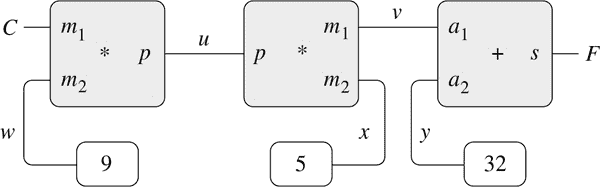

图 3.28 表达为约束网络的关系`9C = 5(F – 32)`。

这样的网络进行计算的过程如下：当连接器被赋予一个值（由用户或与其链接的约束框），它会唤醒其所有相关约束（除了刚刚唤醒它的约束），通知它们它有一个值。然后每个唤醒的约束框轮询其连接器，看是否有足够的信息来确定连接器的值。如果是，该框将设置该连接器，然后唤醒其所有相关约束，依此类推。例如，在摄氏度和华氏度之间的转换中，`w`、`x`和`y`立即由常量框设置为 9、5 和 32。连接器唤醒乘法器和加法器，确定没有足够的信息来继续。如果用户（或网络的其他部分）将`C`设置为一个值（比如 25），最左边的乘法器将被唤醒，它将把`u`设置为`25*9=225`。然后`u`唤醒第二个乘法器，将`v`设置为 45，`v`唤醒加法器，将`F`设置为 77。

##### 使用约束系统

要使用约束系统执行上面概述的温度计算，我们首先调用构造函数`make_connector`来创建两个连接器`C`和`F`，然后将它们链接到一个适当的网络中：

```js
const C = make_connector();
const F = make_connector();
celsius_fahrenheit_converter(C, F);
"ok"
```

定义创建网络的函数如下：

```js
function celsius_fahrenheit_converter(c, f) {
    const u = make_connector();
    const v = make_connector();
    const w = make_connector();
    const x = make_connector();
    const y = make_connector();
    multiplier(c, w, u);
    multiplier(v, x, u);
    adder(v, y, f);
    constant(9, w);
    constant(5, x);
    constant(32, y);
    return "ok";
}
```

这个函数创建内部连接器`u`、`v`、`w`、`x`和`y`，并使用原始约束构造函数`adder`、`multiplier`和`constant`将它们链接如图 3.28 所示。就像 3.3.4 节中的数字电路模拟器一样，用函数表达这些原始元素的组合自动为我们的语言提供了复合对象的抽象手段。

观察网络的运行，我们可以在连接器`C`和`F`上放置探针，使用类似于我们在 3.3.4 节中用来监视电线的`probe`函数。在连接器上放置探针将导致在给连接器赋值时打印消息：

```js
probe("Celsius temp", C);
probe("Fahrenheit temp", F);
```

接下来我们将`C`的值设置为 25。（`set_value`的第三个参数告诉`C`这个指令来自`user`。）

```js
set_value(C, 25, "user");
"Probe: Celsius temp = 25"
"Probe: Fahrenheit temp = 77"
"done"
```

`C`上的探针醒来并报告值。`C`也通过网络传播其值，如上所述。这将`F`设置为 77，探针上报告了这一点。

现在我们可以尝试将`F`设置为一个新值，比如 212：

```js
set_value(F, 212, "user");
"Error! Contradiction: (77, 212)"
```

连接器抱怨它已经感知到矛盾：它的值是 77，有人试图将其设置为 212。如果我们真的想要使用新的值重新使用网络，我们可以告诉`C`忘记它的旧值：

```js
forget_value(C, "user");
"Probe: Celsius temp = ?"
"Probe: Fahrenheit temp = ?"
"done"
```

`C`发现`"user"`，最初设置其值的人，现在正在撤回该值，因此`C`同意失去其值，如探针所示，并通知网络的其余部分。这些信息最终传播到`F`，现在`F`发现没有理由继续相信自己的值是 77。因此，`F`也放弃了它的值，如探针所示。

现在`F`没有值，我们可以自由地将其设置为 212：

```js
set_value(F, 212, "user");
"Probe: Fahrenheit temp = 212"
"Probe: Celsius temp = 100"
"done"?
```

这个新值在网络中传播，强制`C`的值为 100，并由`C`上的探针注册。请注意，同一个网络被用来计算`C`给定`F`和计算`F`给定`C`。这种计算的非定向性是约束系统的显著特征。

##### 实现约束系统

约束系统是通过具有局部状态的过程对象实现的，与 3.3.4 节中的数字电路模拟器非常相似。尽管约束系统的原始对象有些复杂，但整个系统更简单，因为不必担心议程和逻辑延迟。

连接器的基本操作如下：

+   `has_value(connector)`

    告诉连接器是否有值。

+   `get_value(connector)`

    返回连接器的当前值。

+   `set_value(connector, new-value, informant)`

    表示通知者正在请求连接器将其值设置为新值。

+   `forget_value(connector, retractor)`

    告诉连接器，撤回者正在请求它忘记其值。

+   `connect(connector, new-constraint)`

    告诉连接器参与新的约束。

连接器通过函数`inform_ about_value`与约束进行通信，该函数告诉给定约束连接器具有值，并且`inform_about_no_value`告诉约束连接器已经失去了它的值。

`Adder`在加数连接器`a1`和`a2`以及一个`sum`连接器之间构造一个加法器约束。加法器实现为具有本地状态的函数（下面的函数`me`）：

```js
function adder(a1, a2, sum) {
    function process_new_value() {
        if (has_value(a1) && has_value(a2)) {
            set_value(sum, get_value(a1) + get_value(a2), me);
        } else if (has_value(a1) && has_value(sum)) {
            set_value(a2, get_value(sum) - get_value(a1), me);
        } else if (has_value(a2) && has_value(sum)) {
            set_value(a1, get_value(sum) - get_value(a2), me);
        } else {}
    }
    function process_forget_value() {
        forget_value(sum, me);
        forget_value(a1, me);
        forget_value(a2, me);
        process_new_value();
    }
    function me(request) {
        if (request === "I have a value.") {
            process_new_value();
        } else if (request === "I lost my value.") {
            process_forget_value();
        } else {
            error(request, "unknown request – adder");
        }
    }
    connect(a1, me);
    connect(a2, me);
    connect(sum, me);
    return me;
}
```

函数`adder`将新的加法器连接到指定的连接器并将其作为其值返回。代表加法器的函数`me`充当本地函数的分派。与分派一起使用以下“语法接口”（参见第 3.3.4 节中的脚注 30）：

```js
function inform_about_value(constraint) {
    return constraint("I have a value.");
}
function inform_about_no_value(constraint) {
    return constraint("I lost my value.");
}
```

当加法器被告知其连接器之一具有值时，将调用加法器的本地函数`process_new_value`。加法器首先检查看看`a1`和`a2`是否都有值。如果是这样，它会告诉`sum`将其值设置为两个加数的和。`set_value`的`informant`参数是`me`，即加法器对象本身。如果`a1`和`a2`都没有值，那么加法器会检查看看也许`a1`和`sum`有值。如果是这样，它会将`a2`设置为这两者的差。最后，如果`a2`和`sum`有值，这就为加法器提供了足够的信息来设置`a1`。如果加法器被告知其连接器之一失去了值，它会要求所有连接器现在都失去它们的值。（实际上只有这些值是由此加法器设置的才会丢失。）然后运行`process_new_value`。这最后一步的原因是一个或多个连接器可能仍然具有值（即，连接器可能具有一个不是最初由加法器设置的值），并且这些值可能需要通过加法器传播回去。

乘法器与加法器非常相似。如果因子中的任何一个为 0，即使另一个因子未知，它也会将其`product`设置为 0。

```js
function multiplier(m1, m2, product) {
    function process_new_value() {
        if ((has_value(m1) && get_value(m1) === 0)
         || (has_value(m2) && get_value(m2) === 0)) {
            set_value(product, 0, me);
        } else if (has_value(m1) && has_value(m2)) {
            set_value(product, get_value(m1) * get_value(m2), me);
        } else if (has_value(product) && has_value(m1)) {
            set_value(m2, get_value(product) / get_value(m1), me);
        } else if (has_value(product) && has_value(m2)) {
            set_value(m1, get_value(product) / get_value(m2), me);
        } else {}
    }
    function process_forget_value() {
        forget_value(product, me);
        forget_value(m1, me);
        forget_value(m2, me);
        process_new_value();
    }
    function me(request) {
        if (request === "I have a value.") {
            process_new_value();
        } else if (request === "I lost my value.") {
            process_forget_value();
        } else {
            error(request, "unknown request – multiplier");
        }
    }
    connect(m1, me);
    connect(m2, me);
    connect(product, me);
    return me;
}
```

“常量”构造函数只是设置指定连接器的值。发送到常量框的任何“我有一个值。”或“我失去了我的价值。”消息都会产生错误。

```js
function constant(value, connector) {
    function me(request) {
        error(request, "unknown request – constant");
    }
    connect(connector, me);
    set_value(connector, value, me);
    return me;
}
```

最后，探针打印有关设置或取消指定连接器的消息：

```js
function probe(name, connector) {
    function print_probe(value) {
        display("Probe: " + name + " = " + stringify(value));
    }
    function process_new_value() {
        print_probe(get_value(connector));
    }
    function process_forget_value() {
        print_probe("?");
    }
    function me(request) {
        return request === "I have a value."
               ? process_new_value()
               : request === "I lost my value."
               ? process_forget_value()
               : error(request, "unknown request – probe");
    }
    connect(connector, me);
    return me;
}
```

##### 表示连接器

连接器表示为具有本地状态变量`value`的过程对象，即连接器的当前值；`informant`，设置连接器值的对象；和`constraints`，连接器参与的约束列表。

```js
function make_connector() {
    let value = false;
    let informant = false;
    let constraints = null;
    function set_my_value(newval, setter) {
        if (!has_value(me)) {
            value = newval;
            informant = setter;
            return for_each_except(setter,
                                   inform_about_value,
                                   constraints);
        } else if (value !== newval) {
            error(list(value, newval), "contradiction");
        } else {
            return "ignored";
        }
    }
    function forget_my_value(retractor) {
        if (retractor === informant) {
            informant = false;
            return for_each_except(retractor,
                                   inform_about_no_value,
                                   constraints);
        } else {
            return "ignored";
        }
    }
    function connect(new_constraint) {
        if (is_null(member(new_constraint, constraints))) {
            constraints = pair(new_constraint, constraints);
        } else {}
        if (has_value(me)) {
            inform_about_value(new_constraint);
        } else {}
        return "done";
    }
    function me(request) {
        if (request === "has_value") {
            return informant !== false;
        } else if (request === "value") {
            return value;
        } else if (request === "set_value") {
            return set_my_value;
        } else if (request === "forget") {
            return forget_my_value;
        } else if (request === "connect") {
            return connect;
        } else {
            error(request, "unknown operation – connector");
        }
    }
    return me;
}
```

当有请求设置连接器的值时，将调用连接器的本地函数`set_my_value`。如果连接器当前没有值，它将设置其值并记住请求设置值的约束作为`informant`。然后，连接器将通知除了请求设置值的约束之外的所有参与约束。这是通过以下迭代器实现的，该迭代器将指定的函数应用于列表中除给定项之外的所有项：

```js
function for_each_except(exception, fun, list) {
    function loop(items) {
        if (is_null(items)) {
            return "done";
        } else if (head(items) === exception) {
            return loop(tail(items));
        } else {
            fun(head(items));
            return loop(tail(items));
        }
    }
    return loop(list);
}
```

如果要求连接器忘记其值，则运行`forget_my_value`，这是一个本地函数，首先检查请求是否来自最初设置值的相同对象。如果是这样，连接器会通知其关联的约束丢失了值。

本地函数`connect`将指定的新约束添加到约束列表中，如果它尚未在该列表中。然后，如果连接器具有值，它会告知新约束这一事实。

连接器的函数`me`用作对其他内部函数的调度，并且也代表连接器作为一个对象。以下函数为调度提供了语法接口：

```js
function has_value(connector) {
    return connector("has_value");
}
function get_value(connector) {
    return connector("value");
}
function set_value(connector, new_value, informant) {
    return connector("set_value")(new_value, informant);
}
function forget_value(connector, retractor) {
    return connector("forget")(retractor);
}
function connect(connector, new_constraint) {
   return connector("connect")(new_constraint);
}
```

##### 练习 3.33

使用原始乘法器、加法器和常量约束，定义一个名为`averager`的函数，该函数以三个连接器`a`，`b`和`c`作为输入，并建立约束，使得`c`的值是`a`和`b`的平均值。

##### 练习 3.34

Louis Reasoner 想要构建一个平方器，这是一个具有两个端子的约束设备，使得第二个端子上的连接器 b 的值始终是第一个端子上连接器 a 的值的平方。他提出了以下由乘法器制成的简单设备：

```js
function squarer(a, b) {
    return multiplier(a, a, b);
}
```

这个想法存在一个严重的缺陷。请解释。

##### 练习 3.35

Ben Bitdiddle 告诉 Louis，避免练习 3.34 中的麻烦的一种方法是将平方器定义为一个新的原始约束。填写 Ben 的轮廓中用于实现这种约束的函数的缺失部分：

```js
function squarer(a, b) {
    function process_new_value() {
        if (has_value(b)) {
            if (get_value(b) < 0) {
                error(get_value(b), "square less than 0 – squarer");
            } else {
                alternative[1]
            }
        } else {
            alternative[2]
        }
    }
    function process_forget_value() {
        body[1]
    }
    function me(request) {
        body[2]
    }
    statements
    return me;
}
```

##### 练习 3.36

假设我们在程序环境中求值以下语句序列：

```js
const a = make_connector();
const b = make_connector();
set_value(a, 10, "user");
```

在`set_value`的求值过程中的某个时间，将求值连接器的本地函数中的以下表达式：

```js
for_each_except(setter, inform_about_value, constraints);
```

绘制一个环境图，显示上述表达式的求值环境。

##### 练习 3.37

与更注重表达式的定义风格相比，`celsius_fahrenheit_converter`函数显得很繁琐，例如

```js
function celsius_fahrenheit_converter(x) {
   return cplus(cmul(cdiv(cv(9), cv(5)), x), cv(32));
}

const C = make_connector();
const F = celsius_fahrenheit_converter(C);
```

在这里，`cplus`，`cmul`等是算术操作的“约束”版本。例如，`cplus`接受两个连接器作为参数，并返回一个与这些连接器相关的连接器，通过加法器约束：

```js
function cplus(x, y) {
    const z = make_connector();
    adder(x, y, z);
    return z;
}
```

定义类似的函数`cminus`，`cmul`，`cdiv`和`cv`（常量值），使我们能够像上面的转换器示例一样定义复合约束。³⁷

## 3.4 并发性：时间至关重要

我们已经看到了具有局部状态的计算对象作为建模工具的强大力量。然而，正如 3.1.3 节所警告的那样，这种力量是有代价的：失去了引用透明性，引发了关于相同性和变化的一系列问题，并且需要放弃替换模型的求值，转而采用更复杂的环境模型。

隐藏在状态、相同性和变化的复杂性下的核心问题是，通过引入赋值，我们被迫将*时间*引入我们的计算模型中。在引入赋值之前，我们所有的程序都是无时间的，即任何具有值的表达式始终具有相同的值。相比之下，回想一下在 3.1.1 节开头介绍的从银行账户中提取和返回结果余额的建模示例：

```js
withdraw(25);
75

withdraw(25);
50
```

这里对同一表达式的连续求值产生了不同的值。这种行为是由于赋值语句（在本例中是对变量`balance`的赋值）的执行划定了值发生变化的*时间点*。求值表达式的结果不仅取决于表达式本身，还取决于求值是在这些时间点之前还是之后发生的。以计算对象的局部状态构建模型迫使我们面对时间作为编程中的一个基本概念。

我们可以进一步构建计算模型，使其与我们对物理世界的感知相匹配。世界中的对象不是按顺序一个接一个地变化。相反，我们将它们视为同时*并发*执行。因此，通常自然地将系统建模为同时执行的*线程*（计算步骤序列）的集合。正如我们可以通过以对象的方式组织模型来使程序更加模块化，将计算模型分成部分以便分别和同时演变也是合适的。即使程序将在顺序计算机上执行，将程序编写成并发执行的方式也会迫使程序员避免不必要的时间约束，从而使程序更加模块化。

除了使程序更加模块化外，并发计算还可以比顺序计算提供速度优势。顺序计算机一次只执行一个操作，因此执行任务所需的时间与执行的总操作数成正比。然而，如果可以将问题分解为相对独立并且只需要偶尔通信的部分，那么可能可以将这些部分分配给单独的计算处理器，从而产生与可用处理器数量成正比的速度优势。

不幸的是，赋值引入的复杂性在并发存在时变得更加棘手。并发执行的事实，无论是因为世界是并行运行的，还是因为我们的计算机是，并发执行都会增加我们对时间理解的复杂性。

### 3.4.1 并发系统中时间的本质

表面上，时间似乎很简单。它是对事件施加的一种排序。对于任何事件`A`和`B`，要么`A`发生在`B`之前，`A`和`B`同时发生，或者`A`发生在`B`之后。例如，回到银行账户的例子，假设彼得从一个初始含有 100 美元的联合账户中提取了 10 美元，而保罗从中提取了 25 美元，留下 65 美元在账户中。根据两次提取的顺序，账户中的余额序列要么是 100 90 65，要么是 100 75 65。在银行系统的计算机实现中，这种不断变化的余额序列可以通过对变量`balance`进行连续赋值来建模。

然而，在复杂情况下，这样的观点可能会有问题。假设彼得和保罗，以及其他人，通过遍布全球的银行机器网络访问同一个银行账户。账户中的实际余额序列将严重依赖于访问的详细时间和机器之间通信的细节。

事件顺序的不确定性可能会在并发系统的设计中带来严重问题。例如，假设彼得和保罗的提取是作为两个共享一个公共变量`balance`的独立线程实现的，每个线程由第 3.1.1 节中给出的函数指定：

```js
function withdraw(amount) {
    if (balance >= amount) {
        balance = balance - amount;
        return balance;
    } else {
        return "Insufficient funds";
    }
}
```

如果两个线程独立操作，那么彼得可能会测试余额并尝试提取合法金额。然而，保罗可能会在彼得检查余额和彼得完成提取之间提取一些资金，从而使彼得的测试无效。

事情可能会变得更糟。考虑这个声明

```js
balance = balance - amount;
```

作为每个提取过程的一部分执行。这包括三个步骤：(1) 访问`balance`变量的值；(2) 计算新的余额；(3) 将`balance`设置为这个新值。如果彼得和保罗的提取同时执行这个语句，那么两个提取可能会交错访问`balance`和将其设置为新值的顺序。

图 3.29 中的时序图描述了一系列事件的顺序，其中`balance`从 100 开始，Peter 取款 10，Paul 取款 25，最终`balance`的值却是 75。正如图中所示，这种异常的原因是 Paul 将 75 赋给`balance`的假设是要减少的`balance`的值为 100。然而，当 Peter 将`balance`改为 90 时，这个假设变得无效。这对银行系统来说是一个灾难性的失败，因为系统中的总金额没有得到守恒。交易之前，系统中的总金额是 100 美元。之后，Peter 有 10 美元，Paul 有 25 美元，银行有 75 美元。^41

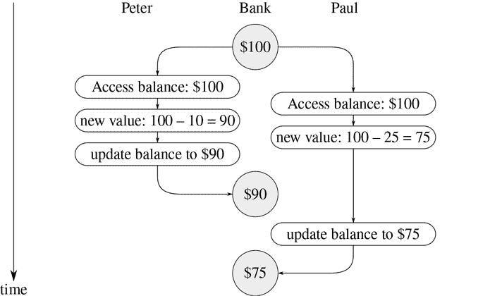

图 3.29 时序图显示了两笔银行取款事件的交错顺序可能导致最终余额不正确。

这里展示的一般现象是，多个线程可以共享一个公共状态变量。使这变得复杂的是，可能有多个线程同时尝试操作共享状态。对于银行账户的例子，在每笔交易中，每个客户都应该能够假设其他客户不存在。当客户以依赖于余额的方式改变余额时，他们必须能够假设在改变的那一刻之前，余额仍然是他们认为的那样。

##### 并发程序的正确行为

上面的例子典型地说明了可能潜入并发程序的微妙错误。这种复杂性的根源在于不同线程之间共享的变量的赋值。我们已经知道，在编写使用赋值的程序时必须小心，因为计算的结果取决于赋值发生的顺序。^42 在并发线程中，我们必须特别小心赋值，因为我们可能无法控制不同线程所做的赋值的顺序。如果可能同时进行几个这样的更改（例如两个存款人访问联合账户），我们需要某种方式来确保我们的系统行为正确。例如，在联合银行账户的取款情况下，我们必须确保金钱是守恒的。为了使并发程序行为正确，我们可能需要对并发执行施加一些限制。

对并发的一种可能限制是规定不能同时发生改变任何共享状态变量的两个操作。这是一个非常严格的要求。对于分布式银行业务，这将要求系统设计者确保只能一次进行一笔交易。这既低效又过于保守。图 3.30 展示了 Peter 和 Paul 共享一个银行账户，Paul 也有一个私人账户。该图说明了从共享账户中取款（Peter 和 Paul 各取一笔）以及向 Paul 的私人账户存款。^43 从共享账户中取款的两笔操作不能同时进行（因为两者都访问并更新同一个账户），Paul 的存款和取款也不能同时进行（因为两者都访问并更新 Paul 钱包中的金额）。但是允许 Paul 向他的私人账户存款与 Peter 从共享账户中取款同时进行应该没有问题。

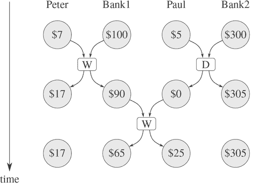

图 3.30 在 Bank1 的联合账户和 Bank2 的私人账户中同时存款和取款。

对并发的限制较少会确保并发系统产生与线程按某种顺序顺序运行时相同的结果。这一要求有两个重要方面。首先，它不要求线程实际上按顺序运行，而只要求产生与它们按顺序运行时相同的结果。例如，在图 3.30 的例子中，银行账户系统的设计者可以安全地允许保罗的存款和彼得的取款同时发生，因为最终结果将与这两个操作按顺序发生时的结果相同。其次，一个并发程序可能产生多个可能的“正确”结果，因为我们只要求结果与*某些*顺序的结果相同。例如，假设彼得和保罗的联合账户一开始有 100 美元，彼得存入 40 美元，同时保罗取出账户中的一半。然后，顺序执行可能导致账户余额为 70 美元或 90 美元（见练习 3.38）⁴⁴。

对并发程序的正确执行还有更弱的要求。用于模拟扩散（比如物体中的热量流动）的程序可能由大量线程组成，每个线程代表一小块空间，它们同时更新自己的值。每个线程反复将自己的值更改为自己的值和邻居的值的平均值。这种算法收敛到正确的答案，不受操作顺序的影响；对共享值的并发使用没有任何限制的必要。

##### 练习 3.38

假设彼得、保罗和玛丽共享一个最初包含 100 美元的联合银行账户。同时，彼得存入 10 美元，保罗取出 20 美元，玛丽取出账户中的一半，执行以下命令：

| 彼得：| `balance = balance + 10` |
| --- | --- |
| 保罗：| `balance = balance - 20` |
| 玛丽：| `balance = balance - (balance / 2)` |

1.  a. 假设银行系统强制这三个线程按某种顺序顺序运行，请列出这三个交易完成后`balance`的所有不同可能值。

1.  b. 如果系统允许线程交错，还可能产生哪些其他值？画出类似图 3.29 中的时间图，解释这些值是如何产生的。

### 3.4.2 控制并发的机制

我们已经看到处理并发线程的困难根源在于需要考虑不同线程中事件顺序的交错。例如，假设我们有两个线程，一个有三个有序事件（`a`，`b`，`c`），另一个有三个有序事件（`x`，`y`，`z`）。如果两个线程同时运行，而不限制它们的执行交错方式，那么与两个线程的各自顺序一致的 20 种不同可能的事件顺序：

|（`a`，`b`，`c`，`x`，`y`，`z`）|（`a`，`x`，`b`，`y`，`c`，`z`）|（`x`，`a`，`b`，`c`，`y`，`z`）|（`x`，`a`，`y`，`z`，`b`，`c`）|
| --- | --- | --- | --- |
|（`a`，`b`，`x`，`c`，`y`，`z`）|（`a`，`x`，`b`，`y`，`z`，`c`）|（`x`，`a`，`b`，`y`，`c`，`z`）|（`x`，`y`，`a`，`b`，`c`，`z`）|
|（`a`，`b`，`x`，`y`，`c`，`z`）|（`a`，`x`，`y`，`b`，`c`，`z`）|（`x`，`a`，`b`，`y`，`z`，`c`）|（`x`，`y`，`a`，`b`，`z`，`c`）|
|（`a`，`b`，`x`，`y`，`z`，`c`）|（`a`，`x`，`y`，`b`，`z`，`c`）|（`x`，`a`，`y`，`b`，`c`，`z`）|（`x`，`y`，`a`，`z`，`b`，`c`）|
|（`a`，`x`，`b`，`c`，`y`，`z`）|（`a`，`x`，`y`，`z`，`b`，`c`）|（`x`，`a`，`y`，`b`，`z`，`c`）|（`x`，`y`，`z`，`a`，`b`，`c`）|

作为设计这个系统的程序员，我们必须考虑这 20 种顺序的影响，并检查每种行为是否可接受。随着线程和事件数量的增加，这种方法很快变得难以控制。

设计并发系统的更实际的方法是设计通用机制，允许我们限制并发线程的交错，以确保程序行为是正确的。为此目的已经开发了许多机制。在本节中，我们描述其中之一，即*序列化程序*。

##### 对共享状态进行序列化访问

序列化实现了以下思想：线程将同时执行，但将有一定的函数集合不能同时执行。更确切地说，序列化创建了一组特殊的函数集，以便每次只允许在每个序列化集中执行一个函数。如果正在执行集合中的某个函数，则试图执行集合中任何函数的线程将被迫等待，直到第一次执行完成。

我们可以使用序列化来控制对共享变量的访问。例如，如果我们想要基于该变量的先前值更新共享变量，我们将变量的先前值的访问和对变量的新值的赋值放在同一个函数中。然后，我们通过使用相同的序列化程序对所有这些函数进行序列化，以确保没有其他分配给变量的函数可以与此函数同时运行。这保证了变量的值在访问和相应的赋值之间不能被更改。

##### 序列化程序

为了使上述机制更具体，假设我们已经扩展了 JavaScript，包括一个名为`concurrent_execute`的函数：

```js
concurrent_execute(f[1], f[2], ..., f[k])
```

每个`f`必须是一个没有参数的函数。函数`concurrent_execute`为每个`f`创建一个单独的线程，该线程将`f`（无参数）应用于`f`。这些线程都同时运行。[^45]

作为如何使用它的示例，考虑

```js
let x = 10;
concurrent_execute(() => { x = x * x; },
                   () => { x = x + 1; });
```

这创建了两个并发线程——`T[1]`，将`x`设置为`x`乘以`x`，以及`T[2]`，增加`x`。执行完成后，`x`将保留五种可能的值之一，具体取决于`T[1]`和`T[2]`的事件交错：

| 101: | `T[1]`将`x`设置为 100，然后`T[2]`将`x`增加到 101。 |
| --- | --- |
| 121: | `T[2]`将`x`增加到 11，然后`T[1]`将`x`设置为`x`乘以`x`。 |
| 110: | `T[2]`在`T[1]`之间将`x`从 10 更改为 11 |
|  | 在求值`x * x`期间访问`x`的值。 |
| 11: | `T[2]`访问`x`，然后`T[1]`将`x`设置为 100，然后`T[2]`设置`x`。 |
| 100: | `T[1]`访问`x`（两次），然后`T[2]`将`x`设置为 11，然后`T[1]`设置`x`。 |

我们可以通过使用序列化函数来限制并发，这些函数是由*序列化程序*创建的。序列化程序是由`make_serializer`构造的，其实现如下所示。序列化程序接受一个函数作为参数，并返回一个行为类似于原始函数的序列化函数。对给定序列化程序的所有调用都返回相同集合中的序列化函数。

因此，与上面的示例相比，执行

```js
let x = 10;
const s = make_serializer();
concurrent_execute(s(() => { x = x * x; }),
                   s(() => { x = x + 1; }));
```

可以产生`x`的两个可能值，101 或 121。其他可能性被消除，因为`T[1]`和`T[2]`的执行不能交错。

这是从 3.1.1 节中的`make_account`函数的一个版本，其中存款和取款已经被序列化：

```js
function make_account(balance) {
    function withdraw(amount) {
        if (balance > amount) {
            balance = balance - amount;
            return balance;
        } else {
            return "Insufficient funds";
        }
    }
    function deposit(amount) {
        balance = balance + amount;
        return balance;
    }
    const protect = make_serializer();
    function dispatch(m) {
        return m === "withdraw"
               ? protect(withdraw)
               : m === "deposit"
               ? protect(deposit)
               : m === "balance"
               ? balance
               : error(m, "unknown request – make_account");
    }
    return dispatch;
}
```

通过这种实现，两个线程不能同时从单个帐户中提取或存款。这消除了图 3.29 中所示错误的来源，即 Peter 在 Paul 访问余额以计算新值和 Paul 实际执行分配之间更改帐户余额的时间。另一方面，每个帐户都有自己的序列化程序，因此不同帐户的存款和取款可以同时进行。

##### 练习 3.39

如果我们改为按照以下方式对执行进行序列化，上述并发执行中的五种可能性中哪些仍然存在：

```js
let x = 10;
const s = make_serializer();
concurrent_execute( () => { x = s(() => x * x)(); },
                   s(() => { x = x + 1; }));
```

##### 练习 3.40

给出执行后可能的所有`x`的值

```js
let x = 10;
concurrent_execute(() => { x = x * x; },
                   () => { x = x * x * x; });
```

如果我们使用序列化函数，那么这些可能性中还剩下哪些呢：

```js
let x = 10;
const s = make_serializer(); concurrent_execute(s(() => { x = x * x; }),
                   s(() => { x = x * x * x; }));
```

##### 练习 3.41

Ben Bitdiddle 担心最好按照以下方式实现银行账户（已更改的部分已在注释行中）：

```js
function make_account(balance) {
    function withdraw(amount) {
        if (balance > amount) {
            balance = balance - amount;
            return balance;
        } else {
            return "Insufficient funds";
        }
    }
    function deposit(amount) {
        balance = balance + amount;
        return balance;
    }
    const protect = make_serializer();
    function dispatch(m) {
        return m === "withdraw"
               ? protect(withdraw)
               : m === "deposit"
               ? protect(deposit)
               : m === "balance"
               ? protect(() => balance)(undefined) // serialized
               : error(m, "unknown request – make_account");
    }
    return dispatch;
}
```

因为允许对银行余额进行未序列化访问可能会导致异常行为。你同意吗？有没有任何情景可以证明 Ben 的担忧？

##### 练习 3.42

Ben Bitdiddle 建议，针对每个`withdraw`和`deposit`消息创建一个新的序列化函数是浪费时间。他说`make_account`可以被改变，这样对`protect`的调用就在`dispatch`函数之外完成。也就是说，一个账户每次要求提取函数时都会返回相同的序列化函数（该函数是在创建账户时同时创建的）。

```js
function make_account(balance) {
    function withdraw(amount) {
        if (balance > amount) {
            balance = balance - amount;
            return balance;
        } else {
            return "Insufficient funds";
        }
    }
    function deposit(amount) {
        balance = balance + amount;
        return balance;
    }
    const protect = make_serializer();
    const protect_withdraw = protect(withdraw);
    const protect_deposit = protect(deposit);
    function dispatch(m) {
        return m === "withdraw"
               ? protect_withdraw
               : m === "deposit"
               ? protect_deposit
               : m === "balance"
               ? balance
               : error(m, "unknown request – make_account");
    }
    return dispatch;
}
```

这样改变安全吗？特别是，这两个版本的`make_account`允许的并发性有什么区别吗？

##### 使用多个共享资源的复杂性

序列化器提供了一个强大的抽象，有助于隔离并发程序的复杂性，以便可以小心地（希望）正确地处理。然而，当只有一个共享资源（如单个银行账户）时，使用序列化器相对来说是相对简单的，但是当存在多个共享资源时，并发编程可能会非常困难。

为了说明可能出现的困难之一，假设我们希望交换两个银行账户的余额。我们访问每个账户以查找余额，计算余额之间的差额，从一个账户中提取这个差额，并将其存入另一个账户。我们可以这样实现：

```js
function exchange(account1, account2) {
    const difference = account1("balance") - account2("balance");
    account1("withdraw")(difference);
    account2("deposit")(difference);
}
```

当只有一个线程尝试进行交换时，这个函数运行良好。然而，假设 Peter 和 Paul 都可以访问账户`a[1]`、`a[2]`和`a[3]`，Peter 交换`a[1]`和`a[2]`，同时 Paul 并发地交换`a[1]`和`a[3]`。即使对于单个账户的存款和取款都是串行化的（就像本节中上面显示的`make_account`函数一样），`exchange`仍然可能产生不正确的结果。例如，Peter 可能计算`a[1]`和`a[2]`的余额差，但是 Paul 可能在 Peter 完成交换之前改变`a[1]`的余额。为了正确的行为，我们必须安排`exchange`函数在整个交换过程中锁定对账户的任何其他并发访问。

我们可以通过使用两个账户的序列化器来实现这一点，以序列化整个`exchange`函数。为此，我们将安排访问账户的序列化器。请注意，我们故意打破了银行账户对象的模块化，通过消息传递来暴露序列化器。下面的`make_account`版本与第 3.1.1 节中给出的原始版本相同，只是提供了一个序列化器来保护余额变量，并且通过消息传递导出了序列化器：

```js
function make_account_and_serializer(balance) {
    function withdraw(amount) {
        if (balance > amount) {
            balance = balance - amount;
            return balance;
        } else {
            return "Insufficient funds";
        }
    }
    function deposit(amount) {
        balance = balance + amount;
        return balance;
    }
    const balance_serializer = make_serializer();
    return m => m === "withdraw"
                ? withdraw
                : m === "deposit"
                ? deposit
                : m === "balance"
                ? balance
                : m === "serializer"
                ? balance_serializer
                : error(m, "unknown request – make_account");
}
```

我们可以使用这个来进行序列化的存款和取款。然而，与我们之前的序列化账户不同，现在每个银行账户对象的用户都有责任显式地管理序列化，例如：

```js
function deposit(account, amount) {
    const s = account("serializer");
    const d = account("deposit");
    s(d(amount));
}
```

以这种方式导出序列化器为我们提供了足够的灵活性来实现一个序列化的交换程序。我们只需使用两个账户的序列化器对原始的`exchange`函数进行序列化：

```js
function serialized_exchange(account1, account2) {
    const serializer1 = account1("serializer");
    const serializer2 = account2("serializer");
    serializer1(serializer2(exchange))(account1, account2);
}
```

##### 练习 3.43

假设三个账户的余额初始为 \$10、\$20 和 \$30，并且多个线程运行，交换账户中的余额。论证如果线程按顺序运行，在任意数量的并发交换之后，账户余额应该以某种顺序为 \$10、\$20 和 \$30。绘制一个类似于图 3.29 中的时间图，以展示如果使用本节中账户交换程序的第一个版本，这个条件如何被违反。另外，论证即使使用这个`exchange`程序，账户余额的总和也会被保留。绘制一个时间图，以展示如果我们没有对各个账户上的交易进行序列化，即使这个条件也会被违反。

##### 练习 3.44

考虑从一个账户转账到另一个账户的问题。本·比特迪德尔声称，即使有多个人同时在多个账户之间转账，使用任何序列化存款和取款交易的账户机制，例如上文中的`make_account`版本，也可以通过以下函数实现。

```js
function transfer(from_account, to_account, amount) {
    from_account("withdraw")(amount);
    to_account("deposit")(amount);
}
```

路易斯·里森纳声称这里存在问题，我们需要使用更复杂的方法，比如处理交换问题所需的方法。路易斯是对的吗？如果不是，转账问题和交换问题之间的本质区别是什么？（假设`from_account`中的余额至少为`amount`。）

##### 练习 3.45

路易斯·里森纳认为我们的银行账户系统现在过于复杂和容易出错，因为存款和取款不再自动序列化。他建议`make_account_and_serializer`应该导出序列化器（供`serialized_exchange`等函数使用），而不是像`make_account`一样使用它来序列化账户和存款。他建议重新定义账户如下：

```js
function make_account_and_serializer(balance) {
    function withdraw(amount) {
        if (balance > amount) {
            balance = balance - amount;
            return balance;
        } else {
            return "Insufficient funds";
        }
    }
    function deposit(amount) {
        balance = balance + amount;
        return balance;
    }
    const balance_serializer = make_serializer();
    return m => m === "withdraw"
                ? balance_serializer(withdraw)
                : m === "deposit"
                ? balance_serializer(deposit)
                : m === "balance"
                ? balance
                : m === "serializer"
                ? balance_serializer
                : error(m, "unknown request – make_account");
}
```

然后存款的处理方式与原始的`make_account`相同：

```js
function deposit(account, amount) {
    account("deposit")(amount);
}
```

解释路易斯的推理有什么问题。特别是考虑`serialized_exchange`被调用时会发生什么。

##### 实现序列化器

我们根据一种称为*互斥体*的更原始的同步机制来实现序列化器。互斥体是支持两种操作的对象——可以*获取*互斥体，也可以*释放*互斥体。一旦互斥体被获取，那么在互斥体被释放之前，该互斥体上的其他获取操作都无法进行。在我们的实现中，每个序列化器都有一个关联的互斥体。给定一个函数`f`，序列化器返回一个函数，该函数获取互斥体，运行`f`，然后释放互斥体。这确保了由序列化器产生的函数中只有一个可以同时运行，这正是我们需要保证的序列化属性。为了将序列化器应用于接受任意数量参数的函数，我们使用 JavaScript 的*剩余*参数和*展开*语法。参数`args`前面的`…`收集函数的任何调用中的所有参数（这里是全部参数）到一个*向量*数据结构中。在应用`f(…args)`中`args`前面的`…`将`args`的元素展开，使它们成为`f`的单独参数。

```js
function make_serializer() {
    const mutex = make_mutex();
    return f => {
               function serialized_f(…args) {
                   mutex("acquire");
                   const val = f(…args);
                   mutex("release");
                   return val;
               }
               return serialized_f;
           };
}
```

互斥体是一个可变对象（这里我们将使用一个一元列表，称为*单元格*），它可以保存`true`或`false`的值。当值为`false`时，互斥体可用于获取。当值为`true`时，互斥体不可用，任何试图获取互斥体的线程都必须等待。

我们的互斥锁构造函数`make_mutex`首先将单元内容初始化为假。要获取互斥锁，我们测试单元。如果互斥锁可用，我们将单元内容设置为真并继续。否则，我们在一个循环中等待，一遍又一遍地尝试获取，直到我们发现互斥锁可用。⁵⁰ 要释放互斥锁，我们将单元内容设置为假。

```js
function make_mutex() {
    const cell = list(false);
    function the_mutex(m) {
    return m === "acquire"
           ? test_and_set(cell)
             ? the_mutex("acquire") // retry
             : true
           : m === "release"
           ? clear(cell)
           : error(m, "unknown request – mutex");
    }
    return the_mutex;
}
function clear(cell) {
    set_head(cell, false);
}
```

函数`test_and_set`测试单元并返回测试结果。此外，如果测试结果为假，`test_and_set`在返回假之前将单元内容设置为真。我们可以将这种行为表达为以下函数：

```js
function test_and_set(cell) {
    if (head(cell)) {
        return true;
    } else {
        set_head(cell, true);
        return false;
    }
}
```

然而，这种`test_and_set`的实现并不足以满足要求。这里有一个关键的微妙之处，这是并发控制进入系统的基本地方：`test_and_set`操作必须被*原子化*执行。也就是说，我们必须保证，一旦一个线程测试了单元并发现它为假，单元内容实际上会在任何其他线程测试单元之前被设置为真。如果我们不能做到这一点，那么互斥锁可能会以类似于图 3.29 中的银行账户失败的方式失败。（参见练习 3.46。）

`test_and_set`的实际实现取决于我们的系统如何运行并发线程的细节。例如，我们可能正在使用时间片轮转机制在顺序处理器上执行并发线程，该机制循环遍历线程，允许每个线程在中断之前运行一小段时间。在这种情况下，`test_and_set`可以通过在测试和设置期间禁用时间片轮转来工作。另外，多处理计算机提供了直接在硬件中支持原子操作的指令。⁵¹

##### 练习 3.46

假设我们使用文本中所示的普通函数来实现`test_and_set`，而不尝试使操作原子化。绘制一个类似于图 3.29 中的时序图，以演示互斥锁实现如何通过允许两个线程同时获取互斥锁而失败。

##### 练习 3.47

信号量（大小为`n`）是互斥锁的一种泛化。像互斥锁一样，信号量支持获取和释放操作，但它更一般，最多`n`个线程可以同时获取它。尝试获取信号量的其他线程必须等待释放操作。给出信号量的实现

1.  a. 以互斥锁为条件

1.  b. 以原子`test_and_set`操作为条件。

##### 死锁

现在我们已经看到了如何实现串行化器，我们可以看到即使在上面的`serialized_exchange`函数中，账户交换仍然存在问题。假设 Peter 试图将`a[1]`与`a[2]`交换，同时 Paul 尝试将`a[2]`与`a[1]`交换。假设 Peter 的线程到达了进入保护`a[1]`的串行化函数的点，就在那之后，Paul 的线程进入了保护`a[2]`的串行化函数。现在 Peter 无法继续（进入保护`a[2]`的串行化函数）直到 Paul 退出保护`a[2]`的串行化函数。同样，Paul 在 Peter 退出保护`a[1]`的串行化函数之前也无法继续。每个线程都永远被阻塞，等待另一个线程。这种情况被称为*死锁*。在提供对多个共享资源的并发访问的系统中，死锁总是一个危险。

在这种情况下避免死锁的一种方法是给每个账户分配一个唯一的标识号，并重写`serialized_exchange`，使得一个线程总是尝试首先进入保护最低编号账户的函数。虽然这种方法对于交换问题效果很好，但还有其他需要更复杂的死锁避免技术的情况，或者根本无法避免死锁。（参见练习 3.48 和 3.49。）⁵²

##### 练习 3.48

详细解释上述避免死锁的方法（即，账户编号，并且每个线程尝试先获取编号较小的账户）在交换问题中避免死锁的原因。重写`serialized_exchange`以纳入这个想法。（您还需要修改`make_account`，以便每个账户都带有一个可以通过发送适当消息访问的编号。）

##### 练习 3.49

给出一个情景，说明上述避免死锁的机制不起作用的情况。（提示：在交换问题中，每个线程事先知道它将需要访问的账户。考虑一个情况，一个线程必须在知道它将需要访问哪些额外的共享资源之前获得对一些共享资源的访问。）

##### 并发、时间和通信

我们已经看到，编写并发系统需要控制不同线程访问共享状态时事件的顺序，并且我们已经看到如何通过合理使用串行器来实现这种控制。但并发的问题并不仅仅如此，因为从根本上来看，“共享状态”并不总是清楚是什么意思。

诸如`test_and_set`之类的机制要求线程在任意时间检查全局共享标志。这在现代高速处理器中实现起来是有问题且低效的，因为由于流水线和缓存内存等优化技术，内存的内容可能不会在每一时刻处于一致状态。因此，在一些多处理系统中，串行器范式正在被其他并发控制方法所取代。

共享状态的问题也出现在大型分布式系统中。例如，想象一个分布式银行系统，其中各个分行维护银行余额的本地值，并定期将其与其他分行维护的值进行比较。在这样的系统中，“账户余额”的价值在同步之后才会确定。如果 Peter 向他与 Paul 共同持有的账户存钱，我们应该在何时说账户余额已经改变——当本地分行的余额改变时，还是直到同步之后？如果 Paul 从不同的分行访问账户，对于银行系统来说应该放置什么合理的约束条件，以使行为“正确”？对于正确性来说，唯一重要的可能是 Peter 和 Paul 个别观察到的行为以及同步后账户的“状态”。关于“真实”账户余额或同步之间事件顺序的问题可能是无关或无意义的。

这里的基本现象是，同步不同的线程，建立共享状态，或对事件进行排序都需要线程之间的通信。实质上，并发控制中的任何时间概念都必须与通信紧密联系在一起。引人入胜的是，在相对论中也存在时间和通信之间的类似联系，光速（可以用来同步事件的最快信号）是一个将时间和空间联系起来的基本常数。我们在处理计算模型中的时间和状态时遇到的复杂性，实际上可能反映了物理宇宙的基本复杂性。

## 3.5 流

我们已经对作为建模工具的赋值有了很好的理解，也对赋值引发的复杂问题有了认识。现在是时候问问我们是否可以以不同的方式进行事情，以避免其中一些问题。在本节中，我们将探讨一种基于称为“流”的数据结构的状态建模的替代方法。正如我们将看到的，流可以减轻一些状态建模的复杂性。

让我们退一步，回顾一下这种复杂性的根源。为了模拟现实世界的现象，我们做出了一些看似合理的决定：我们用具有局部变量的计算对象来模拟具有局部状态的现实世界对象。我们将现实世界中的时间变化与计算机中的时间变化相对应。我们用模型对象的局部变量的赋值来实现计算机中模型对象状态的时间变化。

还有其他方法吗？我们能否避免将计算机中的时间与模拟世界中的时间相对应？我们必须使模型随时间变化以模拟变化中的世界现象吗？从数学函数的角度来思考这个问题。我们可以将数量`x`的随时间变化描述为时间的函数`x(t)`。如果我们一瞬间地专注于`x`，我们会认为它是一个变化的数量。然而，如果我们专注于值的整个时间历史，我们并不强调变化——函数本身并不改变。⁵⁶

如果时间以离散步骤来衡量，那么我们可以将时间函数建模为（可能是无限的）序列。在本节中，我们将看到如何以代表被建模系统的时间历史的序列来建模变化。为了实现这一点，我们引入了称为*流*的新数据结构。从抽象的角度来看，流只是一个序列。然而，我们会发现，将流的直接实现作为列表（如 2.2.1 节中所示）并不能充分展现流处理的威力。作为替代，我们引入了*延迟求值*技术，这使我们能够将非常大（甚至是无限的）序列表示为流。

流处理让我们能够建模具有状态的系统，而无需使用赋值或可变数据。这对于理论和实践都有重要的影响，因为我们可以构建避免引入赋值固有缺点的模型。另一方面，流框架本身也带来了困难，以及哪种建模技术能够导致更模块化和更易维护的系统的问题仍然是开放的。

### 3.5.1 流是延迟列表

正如我们在 2.2.3 节中看到的，序列可以作为组合程序模块的标准接口。我们为操作序列制定了强大的抽象，如`map`、`filter`和`accumulate`，以简洁而优雅的方式捕捉了各种操作。

不幸的是，如果我们将序列表示为列表，这种优雅是以计算效率严重不足的代价换来的，无论是在时间还是空间上。当我们将对序列的操作表示为列表的转换时，我们的程序必须在过程的每一步构造和复制数据结构（可能非常庞大）。

为了理解这一点，让我们比较两个计算区间内所有质数之和的程序。第一个程序是用标准的迭代风格编写的：⁵⁷

```js
function sum_primes(a, b) {
    function iter(count, accum) {
        return count > b
               ? accum
               : is_prime(count)
               ? iter(count + 1, count + accum)
               : iter(count + 1, accum);
    }
    return iter(a, 0);
}
```

第二个程序使用 2.2.3 节的序列操作执行相同的计算：

```js
function sum_primes(a, b) {
    return accumulate((x, y) => x + y,
                      0,
                      filter(is_prime,
                             enumerate_interval(a, b)));
}
```

在进行计算时，第一个程序只需要存储正在累积的总和。相比之下，第二个程序中的过滤器在`enumerate_interval`构建完整的区间数字列表之前无法进行任何测试。过滤器生成另一个列表，然后传递给`accumulate`，然后被折叠以形成总和。第一个程序不需要这样大的中间存储，我们可以将其视为逐步枚举区间，将每个质数添加到生成的总和中。

如果我们使用序列范例来计算从 10,000 到 1,000,000 的区间中第二个质数，那么使用列表的低效性就会变得非常明显，通过求值表达式

```js
head(tail(filter(is_prime,
                 enumerate_interval(10000, 1000000))));
```

这个表达式确实找到了第二个素数，但计算开销是过分的。我们构造了一个接近一百万的整数列表，通过测试每个元素的素性来过滤这个列表，然后忽略了几乎所有的结果。在更传统的编程风格中，我们会交错枚举和过滤，并在达到第二个素数时停止。

流是一个巧妙的想法，它允许我们使用序列操作而不会产生列表操作的成本。有了流，我们可以实现两全其美：我们可以优雅地将程序构建为序列操作，同时获得增量计算的效率。基本思想是只部分构造流，并将部分构造传递给消费流的程序。如果消费者尝试访问尚未构造的流的一部分，流将自动构造足够的自身来产生所需的部分，从而保持整个流存在的幻觉。换句话说，尽管我们将编写程序，就好像我们正在处理完整的序列，但我们的流实现被设计为自动透明地交错流的构造和使用。

为了实现这一点，我们将使用对构造流，流的第一项在对的头部。然而，我们不是将流的其余值放入对的尾部，而是在那里放置一个“承诺”，以计算其余部分（如果有的话）。如果我们有一个数据项`h`和一个流`t`，我们通过求值`pair(h, () => t)`来构造一个流，其头部是`h`，尾部是`t`—流的尾部`t`被包装在一个没有参数的函数中，因此其求值将被*延迟*。空流是`null`，与空列表相同。

要访问非空流的第一个数据项，我们只需选择一对的`head`，就像列表一样。但是要访问流的尾部，我们需要求值延迟的表达式。为了方便起见，我们定义

```js
function stream_tail(stream) {
    return tail(stream)();
}
```

这选择了一对的尾部，并应用在那里找到的函数来获得流的下一对（或者如果流的尾部为空则为`null`）—实际上，*强制*了对尾部的函数来实现其承诺。

我们可以制作和使用流，就像我们可以制作和使用列表一样，来表示按顺序排列的聚合数据。特别是，我们可以构建章节 2 中的列表操作的流模拟，例如`list_ref`、`map`和`for_each`:⁵⁸

```js
function stream_ref(s, n) {
    return n === 0
           ? head(s)
           : stream_ref(stream_tail(s), n - 1);
}
function stream_map(f, s) {
    return is_null(s)
           ? null
           : pair(f(head(s)),
                  () => stream_map(f, stream_tail(s)));
}
function stream_for_each(fun, s) {
    if (is_null(s)) {
        return true;
    } else {
        fun(head(s));
        return stream_for_each(fun, stream_tail(s));
    }
}
```

`stream_for_each`函数对于查看流是有用的。

```js
function display_stream(s) {
    return stream_for_each(display, s);
}
```

为了使流的实现自动透明地交错流的构造和使用，我们安排了流的尾部在被`stream_tail`函数访问时进行求值，而不是在`pair`构造流时进行求值。这种实现选择让人想起了我们在 2.1.2 节中讨论有理数时所看到的情况，那里我们看到我们可以选择实现有理数，使得分子和分母的约分在构造时或选择时进行。这两种有理数实现产生相同的数据抽象，但选择对效率有影响。流和普通列表之间存在类似的关系。作为数据抽象，流和列表是相同的。不同之处在于元素的求值时间。对于普通列表，`head`和`tail`都在构造时进行求值。对于流，`tail`在选择时进行求值。

##### 流的实际应用

为了看到这种数据结构的行为，让我们分析上面看到的“过分”的素数计算，以流的术语重新表述：

```js
head(stream_tail(stream_filter(
                     is_prime,
                     stream_enumerate_interval(10000, 1000000))));
```

我们将看到它确实有效地工作。

我们首先使用参数 10,000 和 1,000,000 调用`stream_enumerate_interval`函数。函数`stream_enumerate_interval`是`enumerate_interval`（2.2.3 节）的流模拟：

```js
function stream_enumerate_interval(low, high) {
    return low > high
           ? null
           : pair(low,
                  () => stream_enumerate_interval(low + 1, high));
}
```

因此，由`stream_enumerate_interval`返回的结果，由`pair`组成，是⁵⁹

```js
pair(10000, () => stream_enumerate_interval(10001, 1000000));
```

也就是说，`stream_enumerate_interval`返回一个表示为`pair`的流，其`head`为 10,000，`tail`是一个承诺，如果需要的话会枚举更多的间隔。现在，使用`filter`函数的流模拟对素数进行过滤。

```js
function stream_filter(pred, stream) {
    return is_null(stream)
           ? null
           : pred(head(stream))
           ? pair(head(stream),
                  () => stream_filter(pred, stream_tail(stream)))
           : stream_filter(pred, stream_tail(stream));
}
```

函数`stream_filter`测试流的`head`（即 10,000）。由于这不是素数，`stream_filter`检查其输入流的尾部。调用`stream_tail`迫使延迟的`stream_enumerate_interval`，现在返回

```js
pair(10001, () => stream_enumerate_interval(10002, 1000000));
```

函数`stream_filter`现在查看这个流的`head`，10,001，看到这也不是素数，强制另一个`stream_tail`，依此类推，直到`stream_enumerate_interval`产生素数 10,007，然后根据其定义，`stream_filter`返回

```js
pair(head(stream),
     stream_filter(pred, stream_tail(stream)));
```

在这种情况下是

```js
pair(10007,
     () => stream_filter(
              is_prime,
              pair(10008,
                   () => stream_enumerate_interval(10009, 1000000))));
```

这个结果现在传递给了我们原始表达式中的`stream_tail`。这迫使延迟的`stream_filter`，进而不断迫使延迟的`stream_enumerate_interval`，直到找到下一个素数，即 10,009。最后，结果传递给了我们原始表达式中的`head`。

```js
pair(10009,
     () => stream_filter(
              is_prime,
              pair(10010,
                   () => stream_enumerate_interval(10011, 1000000))));
```

函数`head`返回 10,009，计算完成。只有测试了必要数量的整数以确定素数，只有在必要时才枚举了间隔以提供素数过滤器。

一般来说，我们可以将延迟求值看作是“需求驱动”的编程，即流处理中的每个阶段只激活足够满足下一个阶段的部分。我们所做的是将计算中的实际事件顺序与函数的表面结构分离。我们编写函数，就好像流“一次性”存在一样，而实际上，计算是逐步进行的，就像传统的编程风格一样。

##### 一个优化

当我们构造流对时，我们通过将这些表达式包装在函数中来延迟求值它们的尾部表达式。我们在需要时通过应用函数来强制执行它们的求值。

这个实现足以使流按照广告宣传的方式工作，但是在需要时我们将考虑一个重要的优化。在许多应用中，我们最终会多次强制执行相同的延迟对象。这可能导致涉及流的递归程序严重低效。（见练习 3.57。）解决方案是构建延迟对象，使得第一次强制执行时，它们存储计算的值。后续的强制执行将简单地返回存储的值，而不重复计算。换句话说，我们实现了流对的构造，作为类似于练习 3.27 中描述的记忆化函数的一种方式。实现这一点的一种方法是使用以下函数，它以一个函数（无参数）作为参数，并返回函数的记忆化版本。第一次运行记忆化函数时，它保存计算结果。在后续的求值中，它只是返回结果。⁶⁰

```js
function memo(fun) {
    let already_run = false;
    let result = undefined;
    return () => {
               if (!already_run) {
                   result = fun();
                   already_run = true;
                   return result;
               } else {
                   return result;
               }
           };
}
```

我们可以在构造流对时使用`memo`。例如，而不是

```js
function stream_map(f, s) {
    return is_null(s)
           ? null
           : pair(f(head(s)),
                  () => stream_map(f, stream_tail(s)));
}
```

我们可以定义一个优化的函数`stream_map`如下：

```js
function stream_map_optimized(f, s) {
    return is_null(s)
           ? null
           : pair(f(head(s)),
                  memo(() =>
                         stream_map_optimized(f, stream_tail(s))));
}
```

##### 练习 3.50

声明一个函数`stream_map_2`，它接受一个二元函数和两个流作为参数，并返回一个流，其元素是将函数成对应用于参数流的相应元素的结果。

```js
function stream_map_2(f, s1, s2) {
    …
}
```

类似于`stream_map_optimized`，通过修改`stream_map_2`声明一个函数`stream_map_2_optimized`，使结果流使用记忆化。

##### 练习 3.51

请注意，我们的原始函数`display`在显示后返回其参数。解释器在求值以下序列中的每个语句时打印什么？

```js
let x = stream_map(display, stream_enumerate_interval(0, 10));
stream_ref(x, 5);
stream_ref(x, 7);
```

如果使用`stream_map_optimized`而不是`stream_map`，解释器会打印什么？

```js
let x = stream_map_optimized(display, stream_enumerate_interval(0, 10));
stream_ref(x, 5);
stream_ref(x, 7);
```

##### 练习 3.52

考虑以下语句序列

```js
let sum = 0;
function accum(x) {
    sum = x + sum;
    return sum;
}
const seq = stream_map(accum, stream_enumerate_interval(1, 20));
const y = stream_filter(is_even, seq);
const z = stream_filter(x => x % 5 === 0, seq);
stream_ref(y, 7);
display_stream(z);
```

在上述每个语句被求值后，`sum`的值是多少？求值`stream_ref`和`display_stream`表达式的打印响应是什么？如果我们在每个构造的流对的每个尾部应用了函数`memo`，如上面的优化建议，这些响应会有所不同吗？请解释。

### 3.5.2 无限流

我们已经看到如何支持操作流的幻觉，即使在实际上，我们只计算我们需要访问的流的部分。我们可以利用这种技术来有效地表示序列作为流，即使序列非常长。更重要的是，我们可以使用流来表示无限长的序列。例如，考虑以下正整数流的定义：

```js
function integers_starting_from(n) {
    return pair(n, () => integers_starting_from(n + 1));
}
const integers = integers_starting_from(1);
```

这是有道理的，因为`integers`将是一个对，其`head`是 1，`tail`是一个承诺去产生从 2 开始的整数。这是一个无限长的流，但在任何给定的时间，我们只能检查其中的有限部分。因此，我们的程序永远不会知道整个无限流不存在。

使用`integers`，我们可以定义其他无限流，例如不能被 7 整除的整数流：

```js
function is_divisible(x, y) { return x % y === 0; }
const no_sevens = stream_filter(x => ! is_divisible(x, 7),
                                integers);
```

然后我们可以通过访问该流的元素来找到不能被 7 整除的整数：

```js
stream_ref(no_sevens, 100);
117
```

类似于`integers`，我们可以定义斐波那契数的无限流：

```js
function fibgen(a, b) {
    return pair(a, () => fibgen(b, a + b));
}
const fibs = fibgen(0, 1);
```

常量`fibs`是一个对的`head`是 0，`tail`是一个承诺去求值`fibgen(1, 1)`。当我们求值这个延迟的`fibgen(1, 1)`时，它将产生一个对，其`head`是 1，`tail`是一个承诺去求值`fibgen(1, 2)`，依此类推。

要查看更激动人心的无限流，我们可以将`no_sevens`示例推广到使用称为*厄拉托斯特尼筛法*的方法构造质数的无限流。我们从从 2 开始的整数开始，这是第一个质数。为了得到其余的质数，我们首先从其余的整数中过滤出 2 的倍数。这留下了一个以 3 开始的流，这是下一个质数。现在我们从这个流的其余部分中过滤出 3 的倍数。这留下了一个以 5 开始的流，这是下一个质数，依此类推。换句话说，我们通过筛选过程构造质数，描述如下：对流 S 进行筛选，形成一个流，其第一个元素是 S 的第一个元素，其余部分是通过从 S 的其余部分中过滤出 S 的第一个元素的所有倍数并进行筛选得到的。这个过程可以很容易地用流操作来描述：

```js
function sieve(stream) {
    return pair(head(stream),
                () => sieve(stream_filter(
                                 x => ! is_divisible(x, head(stream)),
                                 stream_tail(stream))));
}
const primes = sieve(integers_starting_from(2));
```

现在，要找到特定的质数，我们只需要询问：

```js
stream_ref(primes, 50);
233
```

思考一下由`sieve`建立的信号处理系统，如图 3.31 中的“亨德森图”所示。输入流馈入一个`unpairer`，将流的第一个元素与其余部分分开。第一个元素用于构造一个可被整除的过滤器，通过该过滤器传递其余部分，并将过滤器的输出馈送到另一个筛子箱中。然后将原始的第一个元素与内部筛子的输出相连，形成输出流。因此，流不仅是无限的，信号处理器也是无限的，因为筛子中包含一个筛子。

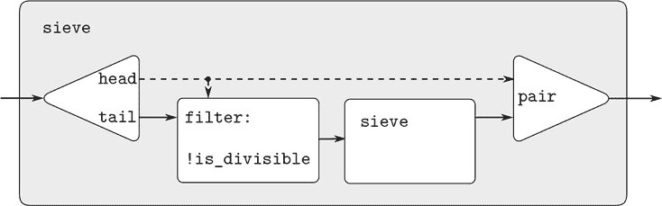

图 3.31 将素数筛视为信号处理系统。每条实线代表正在传输的值流。从`head`到`pair`和`filter`的虚线表示这是一个单个值，而不是一个流。

##### 隐式定义流

上述`integers`和`fibs`流是通过指定显式计算流元素的“生成”函数来定义的。指定流的另一种方法是利用延迟求值来隐式定义流。例如，以下语句定义了流`ones`为无限流的 1：

```js
const ones = pair(1, () => ones);
```

这与递归函数的声明非常相似：`ones`是一个`head`为 1 且`tail`是一个承诺来求值`ones`的对，求值`tail`再次给我们一个 1 和一个承诺来求值`ones`，依此类推。

我们可以通过使用`add_streams`等操作来操作流，从而做更有趣的事情，该操作产生两个给定流的逐元素和。⁶⁴

```js
function add_streams(s1, s2) {
    return stream_map_2((x1, x2) => x1 + x2, s1, s2);
}
```

现在我们可以如下定义整数：

```js
const integers = pair(1, () => add_streams(ones, integers));
```

这定义了`integers`为一个流，其第一个元素为 1，其余部分是`ones`和`integers`的和。因此，`integers`的第二个元素是`integers`的第一个元素加 1，或 2；`integers`的第三个元素是`integers`的第二个元素加 1，或 3；依此类推。这个定义之所以有效，是因为在任何时候，`integers`流的足够部分已经生成，以便我们可以将其反馈到定义中以产生下一个整数。

我们可以以相同的方式定义斐波那契数：

```js
const fibs = pair(0,
                  () => pair(1,
                             () => add_streams(stream_tail(fibs),
                                               fibs)));
```

这个定义表示`fibs`是一个以 0 和 1 开头的流，这样流的其余部分可以通过将`fibs`加到自身移位一个位置来生成：

```js
1  1  2  3  5  8  13  21  ...  =  stream_tail(fibs) 

0  1  1  2  3  5  8  13  ...  =  fibs 

0  1  1  2  3  5  8  13  21  34  ...  =  fibs 
```

函数`scale_stream`在制定这种流定义时也很有用。这将流中的每个项目乘以给定的常数：

```js
function scale_stream(stream, factor) {
    return stream_map(x => x * factor,
                      stream);
}
```

例如，

```js
const double = pair(1, () => scale_stream(double, 2));
```

产生 2 的幂的流：`1, 2, 4, 8, 16, 32, ....`

可以通过从整数开始并通过测试素数性进行过滤来给出素数流的另一种定义。我们需要第一个素数 2 来开始：

```js
const primes = pair(2,
                    () => stream_filter(is_prime,
                                        integers_starting_from(3)));
```

这个定义并不像看起来那么简单，因为我们将测试一个数`n`是否为素数，方法是检查是否可以被小于或等于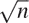的素数（而不是任意整数）整除：

```js
function is_prime(n) {
    function iter(ps) {
        return square(head(ps)) > n
               ? true
               : is_divisible(n, head(ps))
               ? false
               : iter(stream_tail(ps));
    }
    return iter(primes);
}
```

这是一个递归定义，因为`primes`是根据`is_prime`谓词定义的，而`is_prime`谓词本身使用`primes`流。这个函数之所以有效，是因为在任何时候，`primes`流的足够部分已经生成，以便我们可以测试下一个需要检查的数的素数性。也就是说，对于每个`n`，我们测试其是否为素数，要么`n`不是素数（在这种情况下，已经生成了一个可以整除它的素数），要么`n`是素数（在这种情况下，已经生成了一个素数，即小于`n`的素数，大于的素数）。

##### 练习 3.53

不运行程序的情况下，描述由以下定义的流的元素

```js
const s = pair(1, () => add_streams(s, s));
```

##### 练习 3.54

定义一个函数`mul_streams`，类似于`add_streams`，它产生其两个输入流的逐元素乘积。与`integers`流一起使用，完成以下流的定义，其第`n`个元素（从 0 开始计数）是`n + 1`的阶乘：

```js
const factorials = pair(1, () => mul_streams(〈??〉, 〈??〉));
```

##### 练习 3.55

定义一个名为`partial_sums`的函数，该函数以流`S`作为参数，并返回其元素为`S[0]`，`S[0]` + `S[1]`，`S[0]` + `S[1]` + `S[2]`，...的流。例如，`partial_sums(integers)`应该是流`1, 3, 6, 10, 15, ...`。

##### 练习 3.56

一个著名的问题，首次由 R. Hamming 提出，是按升序枚举所有没有除了 2、3 或 5 之外的质因数的正整数，而且没有重复。一个明显的方法是简单地依次测试每个整数，看它是否有除 2、3 和 5 之外的因子。但这非常低效，因为随着整数变大，符合要求的整数越来越少。作为替代方案，让我们称所需的数字流为`S`，并注意关于它的以下事实。

+   `S`以 1 开始。

+   `scale_stream(S, 2)`的元素也是`S`的元素。

+   `scale_stream(S, 3)`和`scale_stream(S, 5)`也是如此。

+   这些都是`S`的元素。

现在我们只需要从这些来源中组合元素。为此，我们定义一个函数`merge`，它将两个有序流合并成一个有序结果流，消除重复项：

```js
function merge(s1, s2) {
    if (is_null(s1)) {
        return s2;
    } else if (is_null(s2)) {
        return s1;
    } else {
        const s1head = head(s1);
        const s2head = head(s2);
        return s1head < s2head
               ? pair(s1head, () => merge(stream_tail(s1), s2))
               : s1head > s2head
               ? pair(s2head, () => merge(s1, stream_tail(s2)))
               : pair(s1head, () => merge(stream_tail(s1), stream_tail(s2)));
    }
}
```

然后，可以使用`merge`构造所需的流，如下所示：

```js
const S = pair(1, () => merge((??), (??)));
```

在上面标有`(??)`的地方填写缺失的表达式。

##### 练习 3.57

使用基于`add_streams`函数的 fibs 声明计算第 n 个斐波那契数时执行了多少次加法？证明如果`add_streams`使用练习 3.50 中描述的`stream_map_2_optimized`函数，这个数字呈指数增长。

##### 练习 3.58

给出函数计算的流的解释

```js
function expand(num, den, radix) {
    return pair(math_trunc((num * radix) / den),
                () => expand((num * radix) % den, den, radix));
}
```

其中`math_trunc`丢弃其参数的小数部分，即除法的余数。`expand(1, 7, 10)`产生的连续元素是什么？`expand(3, 8, 10)`产生什么？

##### 练习 3.59

在 2.5.3 节中，我们看到如何实现多项式算术系统，将多项式表示为项的列表。类似地，我们可以处理*幂级数*，例如

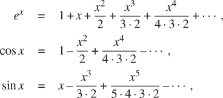

表示为无限流。我们将级数`a[0] + a[1]x + a[2]x² + a[3]x³ + ...`表示为其元素为系数`a[0]`，`a[1], a[2], a[3],  ...`的流。

1.  a. 级数`a[0] + a[1]x + a[2]x² + a[3]x³ + ...`的积分是级数

    ```js
    c + a[0]x + 1/2 a[1]x² + 1/3 a[2]x³ +  1/4 a[3]x⁴ + ...
    ```

    定义一个函数`integrate_series`，它以流`a[0], a[1], a[2],  ...`作为输入，表示幂级数，并返回非常数项积分的系数流`a[0], 1/2 a[1], 1/3 a[2],  ...`。（由于结果没有常数项，它不表示幂级数；当我们使用`integrate_series`时，我们将使用`pair`将适当的常数添加到流的开头。）

1.  b. 函数`x -> eˣ`是它自己的导数。这意味着`eˣ`和`eˣ`的积分是相同的级数，除了常数项，它是`e⁰= 1`。因此，我们可以生成`eˣ`的级数为

    ```js
    const exp_series = pair(1, () => integrate_series(exp_series));
    ```

    展示如何从正弦的导数是余弦和余弦的导数是负正弦这两个事实开始生成正弦和余弦的级数：

    ```js
    const cosine_series = pair(1, 〈??〉);
    const sine_series = pair(0, 〈??〉);
    ```

##### 练习 3.60

使用练习 3.59 中级数表示为系数流的方式，通过`add-streams`实现级数相加。完成以下函数的声明以实现级数相乘：

```js
function mul_series(s1, s2) {
    pair(〈??〉, () => add_streams(〈??〉, 〈??〉));
}
```

您可以通过验证`sin²x + cos²x = 1`，使用练习 3.59 中的级数来测试您的函数。

##### 练习 3.61

设`S`是一个幂级数（练习 3.59），其常数项为 1。假设我们想找到幂级数`1/S`，即级数`X`，使得`S X = 1`。将`S`写为`1 + S[R]`，其中`S[R]`是常数项之后的`S`的部分。然后我们可以按如下方式解出`X`：

```js
 S · X  =  1 

 (1 + S[R]) · X  =  1 

 X + S[R] · X  =  1 

 X  =  1 – S[R] · X 
```

换句话说，`X`是常数项为 1 的幂级数，其高阶项由`S[R]`的负数乘以`X`给出。使用这个想法编写一个名为`invert_unit_series`的函数，该函数计算常数项为 1 的幂级数`S`的`1/S`。您需要使用练习 3.60 中的`mul_series`。

##### 练习 3.62

使用练习 3.60 和 3.61 的结果定义一个名为`div_series`的函数，该函数可以将两个幂级数相除。`div_series`函数应适用于任何两个级数，只要分母级数以非零常数项开头。（如果分母有零常数项，则`div_series`应发出错误信号。）展示如何使用`div_series`与练习 3.59 的结果一起生成正切的幂级数。

### 3.5.3 利用流范式

具有延迟求值的流可以是一个强大的建模工具，提供了许多局部状态和赋值的好处。此外，它们避免了引入赋值到编程语言中时伴随的一些理论上的纠缠。

流方法可以提供启发，因为它允许我们构建具有不同模块边界的系统，而不是围绕对状态变量的赋值组织的系统。例如，我们可以将整个时间序列（或信号）视为关注的焦点，而不是单个时刻的状态变量的值。这使得方便地组合和比较来自不同时刻的状态组件。

##### 将迭代公式表述为流过程

在 1.2.1 节中，我们介绍了迭代过程，通过更新状态变量进行。我们现在知道，我们可以将状态表示为“无时间”的值流，而不是一组要更新的变量。让我们在重新访问 1.1.7 节中的求平方根函数时采用这种观点。回想一下，这个想法是通过反复应用改进猜测的函数来生成越来越好的`x`的平方根的序列：

```js
function sqrt_improve(guess, x) {
    return average(guess, x / guess);
}
```

在我们原始的`sqrt`函数中，我们让这些猜测成为状态变量的连续值。相反，我们可以生成无限的猜测流，从初始猜测值 1 开始：

```js
function sqrt_stream(x) {
    return pair(1, () => stream_map(guess => sqrt_improve(guess, x),
                                    sqrt_stream(x)));
}

display_stream(sqrt_stream(2));
`1`
1.5
1.4166666666666665
1.4142156862745097
1.4142135623746899
...
```

我们可以生成越来越多的流项，以获得越来越好的猜测。如果愿意，我们可以编写一个函数，直到答案足够好为止一直生成项。（参见练习 3.64。）

我们可以以相同的方式处理的另一个迭代是基于我们在 1.3.1 节中看到的交替级数生成`π`的近似值：

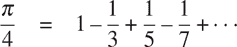

首先生成级数的和项流（奇整数的倒数，交替符号）。然后我们取越来越多项的和的流（使用练习 3.55 的`partial_sums`函数）并将结果缩放 4 倍：

```js
function pi_summands(n) {
    return pair(1 / n, () => stream_map(x => - x, pi_summands(n + 2)));
}
const pi_stream = scale_stream(partial_sums(pi_summands(1)), 4);

display_stream(pi_stream);
`4`
2.666666666666667
3.466666666666667
2.8952380952380956
3.3396825396825403
2.9760461760461765
3.2837384837384844
3.017071817071818
...
```

这给我们提供了一个越来越好的`π`的近似流，尽管这些近似值收敛得相当慢。序列的八个项将`π`的值限制在 3.284 和 3.017 之间。

到目前为止，我们对状态流方法的使用与更新状态变量并没有太大不同。但是流使我们有机会做一些有趣的技巧。例如，我们可以使用*序列加速器*转换流，将近似值序列转换为收敛到与原始值相同的新序列，只是更快。

其中一种加速器，由十八世纪瑞士数学家 Leonhard Euler 提出，对于偏和交错级数的序列效果很好（交错符号的项的级数）。在欧拉的技术中，如果`S[n]`是原始和序列的第`n`项，则加速的序列具有项

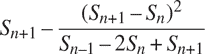

因此，如果原始序列表示为值的流，则变换后的序列由

```js
function euler_transform(s) {
    const s0 = stream_ref(s, 0);     // S[n][–1]
    const s1 = stream_ref(s, 1);     // S[n]
    const s2 = stream_ref(s, 2);     // S[n][+1]
    return pair(s2 - square(s2 - s1) / (s0 + (-2) * s1 + s2),
                memo(() => euler_transform(stream_tail(s))));
}
```

请注意，我们利用了第 3.5.1 节的记忆化优化，因为在接下来的内容中，我们将依赖于对生成的流的重复求值。

我们可以用我们对`π`的逼近序列来演示欧拉加速：

```js
display_stream(euler_transform(pi_stream));
3.166666666666667
3.1333333333333337
3.1452380952380956
3.13968253968254
3.1427128427128435
3.1408813408813416
3.142071817071818
3.1412548236077655
...
```

更好的是，我们可以加速加速的序列，然后递归加速，依此类推。也就是说，我们创建了一个流的流（我们将其称为*表格*的结构），其中每个流都是前一个流的变换：

```js
function make_tableau(transform, s) {
    return pair(s, () => make_tableau(transform, transform(s)));
}
```

表格的形式

```js
 s[00]  s[01]  s[02]  s[03]  s[04]  ...

   s[10]  s[11]  s[12]  s[13]  ...

     s[20]  s[21]  s[22]  ...

         ...  
```

最后，我们通过取表格的每一行的第一个项来形成一个序列：

```js
function accelerated_sequence(transform, s) {
    return stream_map(head, make_tableau(transform, s));
}
```

我们可以演示这种“超加速”`π`序列：

```js
display_stream(accelerated_sequence(euler_transform, pi_stream));
`4`
3.166666666666667
3.142105263157895
3.141599357319005
3.1415927140337785
3.1415926539752927
3.1415926535911765
3.141592653589778
...
```

结果令人印象深刻。取序列的八个项可以得到`π`的正确值，精确到小数点后 14 位。如果我们只使用原始的`π`序列，我们需要计算大约`10¹³`个项（即，扩展系列直到单个项小于`10^(–13)`）才能获得这么高的精度！

我们本可以在不使用流的情况下实现这些加速技术。但是流的表述特别优雅和方便，因为整个状态序列作为数据结构对我们可用，并且可以使用统一的一组操作进行操作。

##### 练习 3.63

Louis Reasoner 对`sqrt_stream`函数生成的流的性能不满意，并尝试使用记忆化来优化它：

```js
function sqrt_stream_optimized(x) {
    return pair(1,
                memo(() => stream_map(guess =>
                                        sqrt_improve(guess, x),
                                      sqrt_stream_optimized(x))));
}
```

Alyssa P. Hacker 提出

```js
function sqrt_stream_optimized_2(x) {
    const guesses = pair(1,
                         memo(() => stream_map(guess =>
                                                 sqrt_improve(guess, x),
                                               guesses)));
    return guesses;
}
```

并声称 Louis 的版本比她的要低效得多，因为它执行了冗余计算。解释 Alyssa 的答案。Alyssa 的方法如果没有记忆化，是否比原始的`sqrt_stream`更有效？

##### 练习 3.64

编写一个名为`stream_limit`的函数，它接受一个流和一个数字（容差）作为参数。它应该检查流，直到找到两个连续的元素，它们的绝对值之差小于容差，并返回这两个元素中的第二个。使用这个函数，我们可以通过

```js
function sqrt(x, tolerance) {
    return stream_limit(sqrt_stream(x), tolerance);
}
```

##### 练习 3.65

使用级数

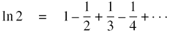

计算三个逼近自然对数 2 的序列，方式与我们上面对`π`所做的方式相同。这些序列收敛得有多快？

##### 无限流的对

在第 2.2.3 节中，我们看到序列范式如何处理传统的嵌套循环，作为对成对序列定义的过程。如果我们将这种技术推广到无限流，那么我们可以编写不容易表示为循环的程序，因为“循环”必须在无限集合上进行。

例如，假设我们想要将第 2.2.3 节的`prime_sum_pairs`函数推广为生成*所有*整数`(i, j)`对的流，其中`i ≤ j`，使得`i + j`是素数。如果`int_pairs`是所有整数`(i, j)`对的序列，其中`i ≤ j`，那么我们所需的流就是简单的⁶⁷

```js
stream_filter(pair => is_prime(head(pair) + head(tail(pair))),
              int_pairs);
```

因此，我们的问题是生成`int_pairs`流。更一般地说，假设我们有两个流`S = (S[i])`和`T = (T[j])`，并想象一个无限的矩形数组

```js
 (S[0], T[0])  (S[0], T[1])  (S[0], T[2])  ...

 (S[1], T[0])  (S[1], T[1])  (S[1], T[2])  ...

 (S[2], T[0])  (S[2], T[1])  (S[2], T[2])  ...

 ...      
```

我们希望生成一个包含数组中所有位于对角线上方或对角线上的成对的流，即成对

```js
 (S[0], T[0])  (S[0], T[1])  (S[0], T[2])  ...

   (S[1], T[1])  (S[1], T[2])  ...

     (S[2], T[2])  ...

       ...
```

（如果我们将`S`和`T`都作为整数流，那么这将是我们期望的流`int_pairs`。）

将成对的一般流称为`pairs(S, T)`，并将其视为由三部分组成：对(`S[0]`, `T[0]`)，第一行中其余的对，以及剩余的对。

```js
 (S[0], T[0])  (S[0], T[1])  (S[0], T[2])  ... 

   (S[1], T[1])  (S[1], T[2])  ... 

     (S[2], T[2])  ... 

       ... 
```

观察到这种分解中的第三部分（不在第一行中的对）是（递归地）由`stream_tail(S)`和`stream_tail(T)`形成的对。还要注意第二部分（第一行的其余部分）是

```js
stream_map(x => list(head(s), x),
stream_tail(t));
```

因此，我们可以按以下方式形成我们的成对流：

```js
function pairs(s, t) {
    return pair(list(head(s), head(t)),
                () => combine-in-some-way(
                          stream_map(x => list(head(s), x),
                                     stream_tail(t)),
                          pairs(stream_tail(s), stream_tail(t))));
}
```

为了完成函数，我们必须选择一种组合两个内部流的方法。一个想法是使用第 2.2.1 节中的`append`函数的流模拟：

```js
function stream_append(s1, s2) {
    return is_null(s1)
           ? s2
           : pair(head(s1),
                  () => stream_append(stream_tail(s1), s2));
}
```

然而，这对于无限流来说是不合适的，因为它在合并第二个流之前从第一个流中取出所有元素。特别是，如果我们尝试使用以下方式生成所有正整数的成对：

```js
pairs(integers, integers);
```

我们的结果流将首先尝试运行所有第一个整数等于 1 的对，因此永远不会产生任何其他第一个整数值的对。

为了处理无限流，我们需要设计一种组合顺序，以确保如果我们让程序运行足够长的时间，每个元素最终都会被访问到。实现这一点的一种优雅方法是使用以下`interleave`函数：

```js
function interleave(s1, s2) {
    return is_null(s1)
           ? s2
           : pair(head(s1),
                  () => interleave(s2, stream_tail(s1)));
}
```

由于`interleave`从两个流中交替获取元素，因此第二个流的每个元素最终都会进入交错流中，即使第一个流是无限的。

因此，我们可以生成所需的成对流如下：

```js
function pairs(s, t) {
    return pair(list(head(s), head(t)),
                () => interleave(stream_map(x => list(head(s), x),
                                            stream_tail(t)),
                                 pairs(stream_tail(s),
                                       stream_tail(t))));
}
```

##### 练习 3.66

检查流`pairs(integers, integers)`。您能对成对放入流中的顺序做出一般性评论吗？例如，大约有多少对在(1,100)之前？对(99,100)之前？对(100,100)之前？（如果您能在这里做出精确的数学陈述，那就更好了。但是，如果您发现自己陷入困境，请随时给出更多的定性答案。）

##### 练习 3.67

修改`pairs`函数，使得`pairs(integers, integers)`将生成*所有*整数对`(i, j)`的流（不带条件`i ≤ j`）。提示：您需要混合另一个流。

##### 练习 3.68

Louis Reasoner 认为从三个部分构建成对流是不必要复杂的。他建议不将对(`S[0]`, `T[0]`)与第一行中其余的对分开，而是建议使用整个第一行，如下所示：

```js
function pairs(s, t) {
    return interleave(stream_map(x => list(head(s), x),
                                 t),
                      pair(stream_tail(s), stream_tail(t)));
}
```

这样行得通吗？考虑一下，如果我们使用 Louis 对`pairs`的定义来求值`pairs(integers, integers)`会发生什么。

##### 练习 3.69

编写一个名为`triples`的函数，该函数接受三个无限流`S`、`T`和`U`，并生成三元组`(S[i], T[j], U[k])`的流，其中`i ≤ j ≤ k`。使用`triples`生成所有正整数的勾股三元组的流，即三元组`(i, j, k)`，使得`i ≤ j`且`i² + j² = k²`。

##### 练习 3.70

生成流时，以某种有用的顺序出现的整数对会更好，而不是通过*特设*的交错过程得到的顺序。如果我们定义一种方法来表明一个整数对“小于”另一个整数对，我们可以使用类似于练习 3.56 的`merge`函数的技术。这样做的一种方法是定义一个“加权函数”`W(i, j)`，并规定如果`W(i[1], j[1]) < W(i[2], j[2])`，则`(i[1], j[1])`小于`(i[2], j[2])`。编写一个名为`merge_weighted`的函数，它类似于`merge`，但`merge_weighted`接受一个额外的参数`weight`，这是一个计算一对整数的权重的函数，并用于确定结果合并流中元素应该出现的顺序。使用这个方法，将`pairs`推广为一个名为`weighted_pairs`的函数，它接受两个流，以及一个计算加权函数的函数，并生成整数对的流，根据权重排序。使用你的函数生成

1.  a. 所有正整数对`(i, j)`的流，其中`i ≤ j`，根据和`i + j`进行排序

1.  b. 所有正整数对`(i, j)`的流，其中`i ≤ j`，`i`和`j`都不能被 2、3 或 5 整除，并且这些对根据和`2i + 3j + 5ij`进行排序。

##### 练习 3.71

有时称为*拉马努金数*的数字可以用两种以上的方式表示为两个立方数的和，以纪念数学家斯里尼瓦萨·拉马努金。有序的整数对流为计算这些数字提供了一种优雅的解决方案。要找到一个可以用两种不同方式写成两个立方数的和的数字，我们只需要生成根据和`i³ + j³`（参见练习 3.70）加权的整数对流，然后在流中搜索具有相同权重的两个连续整数对。编写一个函数来生成拉马努金数。第一个这样的数字是 1,729。接下来的五个是什么？

##### 练习 3.72

类似于练习 3.71，生成一个流，其中包含所有可以用三种不同方式写成两个平方和的数字（显示它们可以这样写成的方式）。

##### 流作为信号

我们通过将流描述为信号处理系统中的“信号”的计算模拟来开始我们对流的讨论。实际上，我们可以直接使用流来模拟信号处理系统，将信号在连续时间间隔的值表示为流的连续元素。例如，我们可以实现一个*积分器*或*求和器*，对于输入流`x = (x[i])`，初始值`C`和小增量`dt`，累积和。

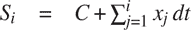

并返回值流`S = (S[i])`。以下的`integral`函数类似于整数流的“隐式样式”定义（第 3.5.2 节）：

```js
function integral(integrand, initial_value, dt) {
    const integ = pair(initial_value,
                       () => add_streams(scale_stream(integrand, dt),
                                         integ));
    return integ;
}
```

图 3.32 是一个与`integral`函数对应的信号处理系统的图片。输入流通过`dt`进行缩放，并通过加法器，其输出再次通过相同的加法器传递。`integ`的定义中的自引用在图中通过将加法器的输出连接到其中一个输入的反馈环中得到反映。

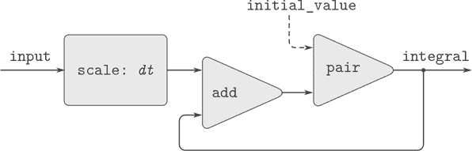

图 3.32 `integral`函数视为信号处理系统。

##### 练习 3.73

我们可以使用流来模拟电路，以表示一系列时间点上的电流或电压值。例如，假设我们有一个由电阻`R`和电容`C`串联组成的 *RC 电路*。电路对注入电流`i`的电压响应`v`由图 3.33 中的公式确定，其结构由附带的信号流图所示。

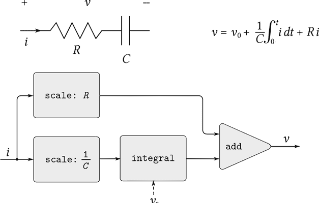

图 3.33 一个 RC 电路和相关的信号流图。

编写一个模拟这个电路的函数`RC`。`RC`应该以`R`、`C`和`dt`的值作为输入，并应该返回一个函数，该函数以表示当前`i`的流和电容器电压`v[0]`的初始值作为输入，并产生电压`v`的流作为输出。例如，您应该能够通过求值`const RC1 = RC(5, 1, 0.5)`来使用`RC`来模拟一个`R=5`欧姆、`C=1`法拉和 0.5 秒时间步长的 RC 电路。这将定义`RC1`作为一个函数，它接受表示电流时间序列的流和初始电容器电压，并产生电压的输出流。

##### 练习 3.74

艾莉莎·P·黑客正在设计一个系统，用于处理来自物理传感器的信号。她希望产生的一个重要特性是描述输入信号的*零交叉*的信号。也就是说，结果信号应该在输入信号从负变为正时为+1，在输入信号从正变为负时为-1，否则为 0。（假设 0 输入的符号为正。）例如，具有其相关零交叉信号的典型输入信号可能是

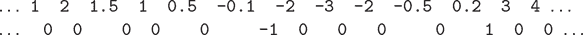

在艾莉莎的系统中，传感器的信号表示为一个流`sense_data`，而流`zero_crossings`是相应的零交叉流。艾莉莎首先编写了一个名为`sign_change_detector`的函数，该函数将两个值作为参数并比较这些值的符号以产生适当的 0、1 或-1。然后她按照以下方式构造了她的零交叉流：

```js
function make_zero_crossings(input_stream, last_value) {
    return pair(sign_change_detector(head(input_stream), last_value),
                () => make_zero_crossings(stream_tail(input_stream),
                                          head(input_stream)));
}
const zero_crossings = make_zero_crossings(sense_data, 0);
```

艾莉莎的老板伊娃·卢·阿特走过来，建议这个程序大致等同于以下使用练习 3.50 中的`stream_map_2`函数的程序：

```js
const zero_crossings = stream_map_2(sign_change_detector,
                                    sense_data,
                                    expression);
```

通过提供指定的`expression`来完成程序。

##### 练习 3.75

很遗憾，艾莉莎在练习 3.74 中的零交叉检测器证明是不够的，因为传感器的嘈杂信号导致了虚假的零交叉。硬件专家莱姆·E·特维基建议艾莉莎在提取零交叉之前平滑信号以滤除噪音。艾莉莎接受了他的建议，并决定从通过将感应数据的每个值与前一个值进行平均构造的信号中提取零交叉。她向助手路易斯·里森纳解释了问题，后者试图实施这个想法，修改了艾莉莎的程序如下：

```js
function make_zero_crossings(input_stream, last_value) {
    const avpt = (head(input_stream) + last_value) / 2;
    return pair(sign_change_detector(avpt, last_value),
                () => make_zero_crossings(stream_tail(input_stream),
                                          avpt));
}
```

这并没有正确实现艾莉莎的计划。找到路易斯安装的错误并修复它，而不改变程序的结构。（提示：您需要增加`make_zero_crossings`的参数数量。）

##### 练习 3.76

伊娃·卢·阿特对路易斯在练习 3.75 中的方法提出了批评。他写的程序不是模块化的，因为它混合了平滑操作和零交叉提取。例如，如果艾莉莎找到了更好的方法来调节她的输入信号，提取器就不应该被改变。通过编写一个名为`smooth`的函数来帮助路易斯，该函数以流作为输入并产生一个流，其中每个元素都是两个连续输入流元素的平均值。然后使用`smooth`作为组件以更模块化的方式实现零交叉检测器。

### 3.5.4 流和延迟求值

在前一节的最后，`integral`函数展示了我们如何使用流来模拟包含反馈环的信号处理系统。图 3.32 中所示的加法器的反馈环是通过`integral`的内部流`integ`是根据自身定义的事实来建模的：

```js
const integ = pair(initial_value,
                   () => add_streams(scale_stream(integrand, dt),
                                     integ));
```

解释器处理这种隐式定义的能力取决于将对`add_streams`的调用包装在 lambda 表达式中所产生的延迟。没有这种延迟，解释器无法在求值对`add_streams`的调用之前构造`integ`，这将要求`integ`已经被定义。一般来说，这种延迟对于使用流来模拟包含循环的信号处理系统至关重要。没有延迟，我们的模型必须被制定为信号处理组件的任何输入在输出产生之前必须被完全求值。这将禁止循环。

很不幸，带有循环的系统的流模型可能需要超出迄今为止所见的流编程模式的延迟。例如，图 3.34 显示了一个信号处理系统，用于解决微分方程`dy/dt = f(y)`，其中`f`是一个给定的函数。图中显示了一个映射组件，它将`f`应用于其输入信号，并以一种非常类似于实际用于解决这类方程的模拟计算机电路的反馈环路连接到积分器。

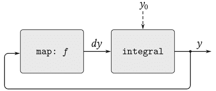

图 3.34 一个解方程`dy/dt = f(y)`的“模拟计算机电路”。

假设我们对`y`有一个初始值`y[0]`，我们可以尝试使用以下函数来模拟这个系统

```js
function solve(f, y0, dt) {
    const y = integral(dy, y0, dt);
    const dy = stream_map(f, y);
    return y;
}
```

这个函数不起作用，因为在`solve`的第一行中，对`integral`的调用要求定义输入`dy`，而这直到`solve`的第二行才发生。

另一方面，我们的定义意图是有意义的，因为原则上我们可以开始生成`y`流而不知道`dy`。实际上，`integral`和许多其他流操作可以在只有关于参数的部分信息时生成部分答案。对于`integral`，输出流的第一个元素是指定的`initial_value`。因此，我们可以在不求值被积函数`dy`的情况下生成输出流的第一个元素。一旦我们知道`y`的第一个元素，`solve`的第二行中的`stream_map`就可以开始工作来生成`dy`的第一个元素，这将产生`y`的下一个元素，依此类推。

为了利用这个想法，我们将重新定义`integral`，以期望积分流作为*延迟参数*。函数`integral`将强制积分在需要生成输出流的第一个元素时才被求值：

```js
function integral(delayed_integrand, initial_value, dt) {
    const integ =
        pair(initial_value, 
             () => {
                 const integrand = delayed_integrand();
                 return add_streams(scale_stream(integrand, dt),
                                    integ);
             });
    return integ;
}
```

现在我们可以通过延迟`y`的声明中`dy`的求值来实现我们的`solve`函数：

```js
function solve(f, y0, dt) {
    const y = integral(() => dy, y0, dt);
    const dy = stream_map(f, y);
    return y;
}
```

一般来说，`integral`的每个调用者现在都必须延迟被积函数的参数。我们可以通过计算微分方程`dy/dt = y`的解在`y = 1`处的值来证明`solve`函数的工作：

```js
stream_ref(solve(y => y, 1, 0.001), 1000);
2.716923932235896
```

##### 练习 3.77

上面使用的`integral`函数类似于第 3.5.2 节中整数无限流的“隐式”定义。或者，我们可以给出更像`integers-starting-from`（也在第 3.5.2 节中）的`integral`的定义：

```js
function integral(integrand, initial_value, dt) {
    return pair(initial_value,
                is_null(integrand)
                ? null
                : integral(stream_tail(integrand),
                           dt * head(integrand) + initial_value,
                           dt));
}
```

在带有循环的系统中使用时，这个函数与我们原始版本的`integral`一样存在问题。修改函数，以便它期望`integrand`作为延迟参数，因此可以在上面显示的`solve`函数中使用。

##### 练习 3.78

考虑设计一个信号处理系统来研究齐次二阶线性微分方程

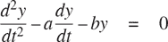

输出流，对`y`进行建模，是由一个包含循环的网络生成的。这是因为`d²y/dt²`的值取决于`y`和`dy/dt`的值，而这两者都是通过对`d²y/dt²`进行积分来确定的。我们想要编码的图表如图 3.35 所示。编写一个名为`solve_2nd`的函数，该函数以常数`a`、`b`和`dt`以及`y`和`dy/dt`的初始值`y[0]`和`dy[0]`作为参数，并生成`y`的连续值流。

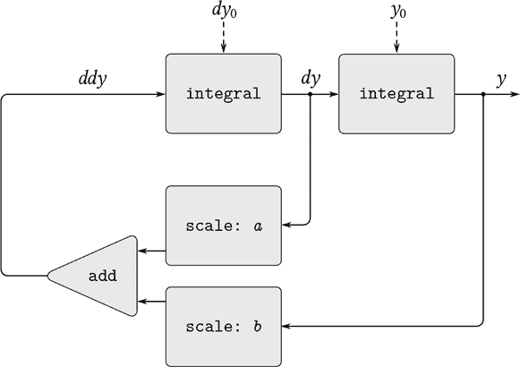

图 3.35 用于解决二阶线性微分方程的信号流图。

##### 练习 3.79

将练习 3.78 的`solve_2nd`函数泛化，以便用于解决一般的二阶微分方程`d²y/dt² = f (dy/dt, y)`。

##### 练习 3.80

*串联 RLC 电路*由一个电阻、一个电容和一个电感器串联而成，如图 3.36 所示。如果`R`、`L`和`C`分别是电阻、电感和电容，那么这三个元件的电压（`v`）和电流（`i`）之间的关系由以下方程描述

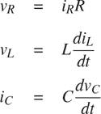

电路连接规定了关系

`i[R]` = `i[L]` = –`i[C]`

`v[C]` = `v[L]` + `v[R]`

结合这些方程表明电路的状态（由电容器两端的电压`v[C]`和电感器中的电流`i[L]`总结）由一对微分方程描述

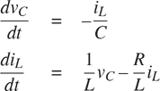

表示这个微分方程系统的信号流图如图 3.37 所示。

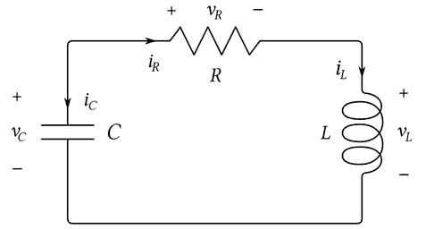

图 3.36 一个串联 RLC 电路。

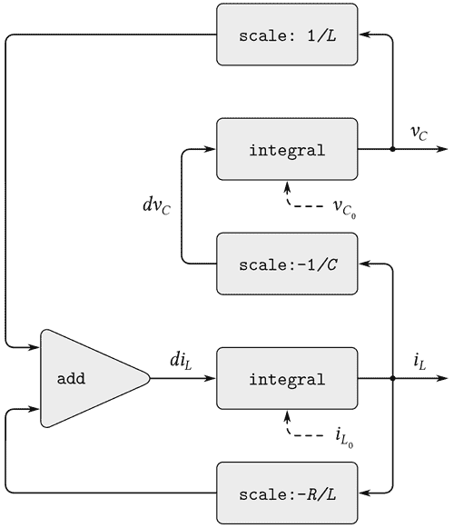

图 3.37 一个用于解决串联 RLC 电路的信号流图。

编写一个名为`RLC`的函数，该函数以电路的参数`R`、`L`和`C`以及时间增量`dt`作为参数。类似于练习 3.73 中的`RC`函数，`RLC`应该生成一个函数，该函数接受状态变量的初始值，`5v[C0]`和`i[L0]`，并生成状态`v[C]`和`i[L]`的流的一对（使用`pair`）。使用`RLC`，生成一对流，模拟具有`R = 1`欧姆、`C = 0.2`法拉、`L = 1`亨利、`dt = 0.1`秒和初始值`i[L0] = 0`安培和`v[C0] = 10`伏特的串联 RLC 电路的行为。

##### 正常顺序求值

本节中的示例说明了延迟求值如何提供很大的编程灵活性，但这些示例也表明了这如何使我们的程序变得更加复杂。例如，我们的新`integral`函数赋予我们建模具有循环的系统的能力，但现在我们必须记住应该使用延迟的被积函数来调用`integral`，并且使用`integral`的每个函数都必须意识到这一点。实际上，我们创建了两类函数：普通函数和接受延迟参数的函数。通常情况下，创建不同类别的函数会迫使我们创建不同类别的高阶函数。⁷³

避免需要两种不同类别的函数的一种方法是使所有函数都采用延迟参数。我们可以采用一种求值模型，其中所有函数的参数都自动延迟，并且只有在实际需要时才强制参数（例如，当原始操作需要时）。这将使我们的语言转换为使用正则序求值，我们在 1.1.5 节介绍求值替换模型时首次描述了这一点。转换为正则序求值提供了一种统一而优雅的方式来简化延迟求值的使用，如果我们只关注流处理，这将是一种自然的策略。在 4.2 节中，我们在研究了求值器之后，将看到如何以这种方式转换我们的语言。不幸的是，在函数调用中包含延迟会破坏我们设计依赖事件顺序的程序的能力，例如使用赋值、改变数据或执行输入或输出的程序。即使在一对的尾部延迟也会造成很大的混乱，正如练习 3.51 和 3.52 所示。据人所知，可变性和延迟求值在编程语言中并不相容。

### 3.5.5 函数式程序的模块化和对象的模块化

正如我们在 3.1.2 节中看到的，引入赋值的主要好处之一是，我们可以通过将大系统的部分状态封装或“隐藏”在局部变量中来增加系统的模块化。流模型可以在不使用赋值的情况下提供等效的模块化。举例来说，我们可以从流处理的角度重新实现我们在 3.1.2 节中研究的`π`的蒙特卡洛估计。

关键的模块化问题是，我们希望隐藏随机数生成器的内部状态，不让使用随机数的程序知道。我们从一个名为`rand_update`的函数开始，它的连续值提供了我们的随机数供应，并用它来生成一个随机数生成器：

```js
function make_rand() {
    let x = random_init;
    return () => {
               x = rand_update(x);
               return x;
           };
}
const rand = make_rand();
```

在流的表述中，没有随机数生成器*per se*，只是通过连续调用`rand_update`产生的随机数流：

```js
const random_numbers =
    pair(random_init,
         () => stream_map(rand_update, random_numbers));
```

我们用这个来构建在`random_numbers`流中对连续对执行的 Cesàro 实验结果的流：

```js
function map_successive_pairs(f, s) {
    return pair(f(head(s), head(stream_tail(s))),
                () => map_successive_pairs(
                          f,
                          stream_tail(stream_tail(s))));
}
const dirichlet_stream =
    map_successive_pairs((r1, r2) => gcd(r1, r2) === 1,
                         random_numbers);
```

现在`dirichlet_stream`被输入到`monte_carlo`函数中，它产生一个概率估计的流。然后将结果转换为`π`的估计流。这个程序的版本不需要一个告诉要执行多少次试验的参数。通过查看`pi`流的更远处，可以获得更好的`π`估计（通过进行更多的实验）：

```js
function monte_carlo(experiment_stream, passed, failed) {
    function next(passed, failed) {
        return pair(passed / (passed + failed),
                    () => monte_carlo(stream_tail(experiment_stream),
                                      passed, failed));
    }
    return head(experiment_stream)
           ? next(passed + 1, failed)
           : next(passed, failed + 1);
}
const pi = stream_map(p => math_sqrt(6 / p),
                      monte_carlo(dirichlet_stream, 0, 0));
```

这种方法具有相当的模块化，因为我们仍然可以制定一个通用的`monte_carlo`函数，可以处理任意的实验。但是没有赋值或局部状态。

##### 练习 3.81

练习 3.6 讨论了将随机数生成器泛化，以允许重新设置随机数序列，从而产生可重复的“随机”数列。以此相同生成器的流形式进行一个流的表述，它在一个请求输入流上操作，请求是`"generate"`一个新的随机数或`"reset"`序列到指定值，并产生所需的随机数流。在你的解决方案中不要使用赋值。

##### 练习 3.82

重新进行练习 3.5，使用流的术语进行蒙特卡洛积分。`estimate_integral`的流版本不会有一个告诉要执行多少次试验的参数。相反，它将产生基于越来越多试验的估计流。

##### 时间的函数式编程视图

现在让我们回到本章开头提出的对象和状态问题，并从一个新的角度来审视它们。我们引入了赋值和可变对象，以提供一种模块化构建具有状态的系统的程序的机制。我们使用本地状态变量构建了计算对象，并使用赋值来修改这些变量。我们通过相应的计算对象的时间行为来模拟对象在世界中的时间行为。

现在我们已经看到，流提供了一种用本地状态模拟对象的替代方式。我们可以使用表示连续状态的时间历史的流来模拟变化的数量，例如某个对象的本地状态。实质上，我们使用流明确表示时间，这样我们就可以将模拟世界中的时间与求值过程中发生的事件序列分离开来。实际上，由于延迟求值的存在，模型中模拟的时间与求值过程中事件的顺序可能几乎没有关系。

为了对比这两种建模方法，让我们重新考虑一下监视银行账户余额的“取款处理器”的实现。在 3.1.3 节中，我们实现了一个简化版本的这样一个处理器：

```js
function make_simplified_withdraw(balance) {
    return amount => {
               balance = balance - amount;
               return balance;
           };
}
```

对`make_simplified_withdraw`的调用会产生计算对象，每个对象都有一个名为`balance`的本地状态变量，该变量会随着对对象的连续调用而递减。该对象接受一个`amount`作为参数，并返回新的余额。我们可以想象银行账户的用户输入一系列输入到该对象中，并观察显示屏上显示的返回值序列。

或者，我们可以将取款处理器建模为一个函数，该函数以余额和要取款的金额流作为输入，并产生账户中连续余额的流：

```js
function stream_withdraw(balance, amount_stream) {
    return pair(balance,
                () => stream_withdraw(balance - head(amount_stream),
                                      stream_tail(amount_stream)));
}
```

函数`stream_withdraw`实现了一个明确定义的数学函数，其输出完全由其输入确定。然而，假设输入`amount_stream`是用户输入的连续值的流，而结果余额的流被显示。那么，从输入值和观察结果的用户的角度来看，流程过程与`make_simplified_withdraw`创建的对象具有相同的行为。然而，使用流版本，没有赋值，没有本地状态变量，因此也没有我们在 3.1.3 节中遇到的理论困难。然而，系统具有状态！

这真是非常了不起。即使`stream_withdraw`实现了一个行为不会改变的明确定义的数学函数，用户在这里的感知是在与一个具有变化状态的系统进行交互。解决这个悖论的一种方法是意识到是用户的时间存在给系统带来了状态。如果用户能够从交互中退出，并考虑余额流而不是单独的交易，系统将显得没有状态。⁷⁴

从复杂过程的某一部分的角度来看，其他部分似乎随时间变化。它们具有隐藏的时间变化的本地状态。如果我们希望编写模拟我们世界中这种自然分解的程序（从我们作为该世界一部分的视角来看），并在我们的计算机中使用结构，我们将创建不是功能性的计算对象——它们必须随时间变化。我们使用本地状态变量来模拟状态，并使用对这些变量的赋值来模拟状态的变化。通过这样做，我们使计算模型的执行时间成为我们所在世界的时间，因此我们在计算机中得到了“对象”。

用对象建模是强大且直观的，主要是因为这与我们与之交互的世界的感知相匹配。然而，正如我们在本章中反复看到的那样，这些模型引发了关于约束事件顺序和同步多个进程的棘手问题。避免这些问题的可能性刺激了*函数式编程语言*的发展，这些语言不包括任何关于赋值或可变数据的规定。在这样的语言中，所有函数都实现其参数的明确定义的数学函数，其行为不会改变。函数式方法对处理并发系统非常有吸引力。

另一方面，如果我们仔细观察，我们也可以看到与时间相关的问题潜入了函数式模型。当我们希望设计交互式系统，特别是模拟独立实体之间的交互时，一个特别棘手的领域就会出现。例如，再次考虑允许联合银行账户的银行系统的实现。在使用赋值和对象的传统系统中，我们将彼得和保罗共享一个账户的事实建模为彼得和保罗都将其交易请求发送到同一个银行账户对象，正如我们在 3.1.3 节中所看到的。从流的角度来看，*本质上*没有“对象”，我们已经指出银行账户可以被建模为一个处理交易请求流以产生响应流的过程。因此，我们可以通过合并彼得的交易请求流和保罗的请求流，并将结果馈送到银行账户流程，来建模彼得和保罗共有一个联合银行账户，如图 3.38 所示。

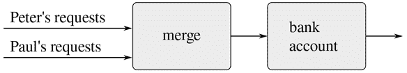

图 3.38 一个联合银行账户，通过合并两个交易请求流来建模。

这种表述的问题在于*合并*的概念。不能简单地通过交替从彼得和保罗那里获取交易请求来合并这两个流。假设保罗很少访问账户。我们几乎无法强迫彼得等待保罗访问账户，然后才能发出第二笔交易。无论如何实现这样的合并，它都必须以某种方式交错这两个交易流，这种方式受到“彼得和保罗感知的”真实时间的约束，即如果彼得和保罗相遇，他们可以同意某些交易在会面之前被处理，而其他交易在会面之后被处理。这正是我们在 3.4.1 节中需要处理的约束，我们发现需要引入显式同步来确保并发处理具有状态对象的事件的“正确”顺序。因此，在支持函数式风格的尝试中，合并来自不同代理的输入重新引入了函数式风格旨在消除的相同问题。

我们开始本章的目标是构建计算模型，其结构与我们试图建模的真实世界的感知相匹配。我们可以将世界建模为一组独立的、有时间限制的、相互作用的具有状态的对象，或者我们可以将世界建模为一个单一的、无时间的、无状态的统一体。每种观点都有强大的优势，但单独的观点都不完全令人满意。一个宏伟的统一尚未出现。
