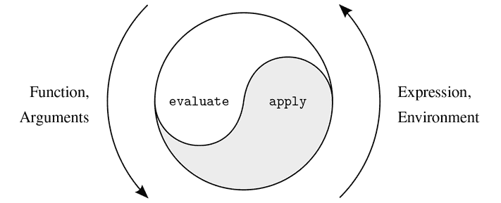
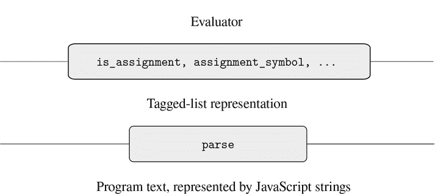
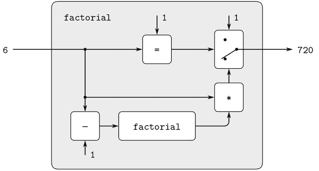
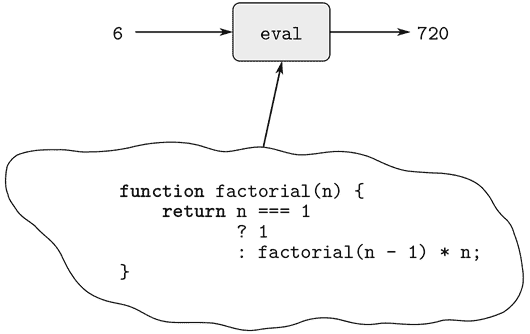
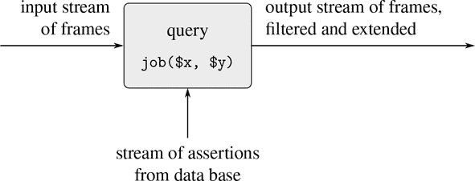
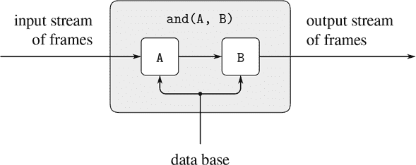
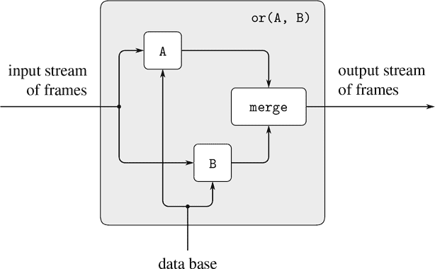
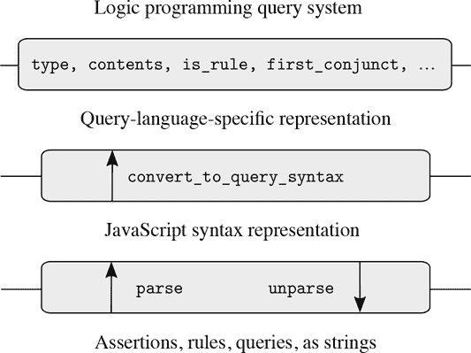

# 四、元语言抽象

> 原文：[4 Metalinguistic Abstraction](https://sourceacademy.org/sicpjs/4)
> 
> 译者：[飞龙](https://github.com/wizardforcel)
> 
> 协议：[CC BY-NC-SA 4.0](https://creativecommons.org/licenses/by-nc-sa/4.0/)

> ...魔法就在于文字——Abracadabra，开门，以及其他——但一个故事中的魔法词在另一个故事中并不神奇。真正的魔法是理解哪些词起作用，何时起作用，以及为什么起作用；诀窍就是学会这个诀窍。
> 
> ...而这些词是由我们字母表的字母组成的：我们可以用笔画出的几十个波浪线。这就是关键！如果我们能得到这个关键，也是宝藏！就好像——好像宝藏的关键 *就是* 宝藏！

> ——约翰·巴斯，《奇美拉》

在我们对程序设计的研究中，我们已经看到，专业程序员使用与所有复杂系统设计者使用的相同的一般技术来控制设计的复杂性。他们将原始元素组合成复合对象，将复合对象抽象成更高级的构建块，并通过采用适当的系统结构的大规模视图来保持模块化。在说明这些技术时，我们使用 JavaScript 作为描述过程和构建计算数据对象和过程的语言，以模拟现实世界中复杂现象。然而，随着我们面对越来越复杂的问题，我们会发现 JavaScript，或者任何固定的编程语言，都无法满足我们的需求。为了更有效地表达我们的想法，我们必须不断转向新的语言。建立新语言是控制工程设计复杂性的强大策略；通过采用新语言，我们经常可以增强处理复杂问题的能力，使我们能够以不同的方式描述（因此思考）问题，使用特别适合手头问题的原语、组合手段和抽象手段。¹

编程赋予了多种语言。有物理语言，比如特定计算机的机器语言。这些语言涉及数据和控制的表示，以存储的个别位和原始机器指令。机器语言程序员关心如何利用给定的硬件来建立系统和实用程序，以有效地实现资源有限的计算。高级语言建立在机器语言基础上，隐藏了关于数据表示和程序表示的担忧，这些语言具有组合和抽象的手段，比如函数声明，适用于系统的大规模组织。

*元语言抽象*——建立新语言——在所有工程设计领域都起着重要作用。对于计算机编程来说尤为重要，因为在编程中，我们不仅可以制定新语言，还可以通过构建求值器来实现这些语言。编程语言的*求值器*（或*解释器*）是一个函数，当应用于语言的语句或表达式时，执行求值该语句或表达式所需的操作。把这看作编程中最基本的想法绝非夸大：

> 确定编程语言中语句和表达式的含义的求值器只是另一个程序。

要理解这一点就是改变我们作为程序员的形象。我们开始把自己看作语言的设计者，而不仅仅是他人设计的语言的使用者。

事实上，我们几乎可以将任何程序视为某种语言的求值器。例如，第 2.5.3 节的多项式处理系统体现了多项式算术规则，并将其实现为对列表结构数据的操作。如果我们增加这个系统的函数来读取和打印多项式表达式，我们就有了一个处理符号数学问题的特定目的语言的核心。第 3.3.4 节的数字逻辑模拟器和第 3.3.5 节的约束传播器本身就是合法的语言，每种语言都有自己的原语、组合手段和抽象手段。从这个角度来看，应对大规模计算机系统的技术与构建新计算机语言的技术融为一体，计算机科学本身不再（也不会更少）只是构建适当描述性语言的学科。

我们现在开始了解语言建立在其他语言基础上的技术之旅。在本章中，我们将以 JavaScript 为基础，将求值器实现为 JavaScript 函数。我们将通过为 JavaScript 本身构建一个求值器来迈出理解语言如何实现的第一步。我们的求值器实现的语言将是 JavaScript 的一个子集。尽管本章描述的求值器是针对 JavaScript 的特定子集编写的，但它包含了为顺序机器编写程序设计语言的求值器的基本结构。（事实上，大多数语言处理器深藏其中一个小型求值器。）为了说明和讨论的目的，求值器已经简化，并且一些重要的特性被省略了，这些特性对于生产质量的 JavaScript 系统来说是重要的。然而，这个简单的求值器足以执行本书中大部分的程序。

将求值器作为 JavaScript 程序可访问的一个重要优势是，我们可以通过将其描述为对求值器程序的修改来实现替代求值规则。我们可以利用这种能力的一个地方是，以更好的效果获得对计算模型体现时间概念的额外控制，这在第 3 章的讨论中是如此核心。在那里，我们通过使用流来解耦世界中的时间表示与计算机中的时间，来减轻一些状态和赋值的复杂性。然而，我们的流程序有时会很笨重，因为它们受到 JavaScript 的应用顺序求值的限制。在 4.2 节中，我们将改变基础语言，以提供更优雅的方法，通过修改求值器来提供*正则顺序求值*。

第 4.3 节实现了一个更有雄心的语言变化，即语句和表达式具有多个值，而不仅仅是一个单一值。在这种*非确定性计算*语言中，自然地表达生成所有可能值的过程，然后搜索满足某些约束的值。就计算模型和时间而言，这就像时间分支成一组“可能的未来”，然后搜索适当的时间线。通过我们的非确定性求值器，跟踪多个值和执行搜索都由语言的基础机制自动处理。

在第 4.4 节中，我们实现了一种*逻辑编程*语言，其中知识是以关系的形式表达，而不是以输入和输出的计算形式。尽管这使得语言与 JavaScript 或任何传统语言都大不相同，但我们将看到逻辑编程求值器与 JavaScript 求值器共享基本结构。

## 4.1 元循环求值器

我们的 JavaScript 求值器将作为 JavaScript 程序实现。用 JavaScript 实现 JavaScript 程序的求值似乎是循环的。然而，求值是一个过程，因此用 JavaScript 描述求值过程是合适的，毕竟，这是我们描述过程的工具。³ 用相同语言编写的求值器被称为*元循环*求值器。

元循环求值器本质上是对 3.2 节中描述的求值环境模型的 JavaScript 表述。回想一下，该模型指定了函数应用的求值有两个基本步骤：

1.  1. 求值函数应用时，首先求值子表达式，然后将函数子表达式的值应用于参数子表达式的值。

1.  2. 将复合函数应用于一组参数时，求值函数体在新环境中。为构造此环境，通过将函数对象的环境部分扩展为函数的参数绑定到应用函数的参数的帧。

这两条规则描述了求值过程的本质，即在环境中要求值的语句和表达式被简化为要应用于参数的函数，然后再简化为在新环境中要求值的新语句和表达式，依此类推，直到我们到达名称，其值在环境中查找，以及运算符和原始函数，这些直接应用（见图 4.1）。⁴ 这种求值循环将由求值器中两个关键函数`evaluate`和`apply`之间的相互作用体现出来，这些函数在 4.1.1 节中描述（见图 4.1）。



图 4.1 `evaluate`-`apply`循环揭示了计算机语言的本质。

求值器的实现将依赖于定义要求值的语句和表达式的*语法*的函数。我们将使用数据抽象使求值器独立于语言的表示。例如，我们不会选择将赋值表示为以名称开头后跟`=`的字符串，而是使用抽象谓词`is_assignment`来测试赋值，并使用抽象选择器`assignment_symbol`和`assignment_value_expression`来访问赋值的部分。4.1.2 节中提出的数据抽象层将使求值器保持独立于具体的语法问题，例如解释语言的关键字，以及表示程序组件的数据结构的选择。还有在 4.1.3 节中描述的操作，用于指定函数和环境的表示。例如，`make_function`构造复合函数，`lookup_symbol_value`访问名称的值，`apply_primitive_function`将原始函数应用于给定的参数列表。

### 4.1.1 求值器的核心

求值过程可以描述为`evaluate`和`apply`两个函数之间的相互作用。

##### 函数`evaluate`

函数`evaluate`以程序*组件*（语句或表达式）和环境作为参数。它对组件进行分类并指导其求值。函数`evaluate`被构造为对要求值的组件的句法类型进行案例分析。为了保持函数的一般性，我们抽象地表达了组件类型的确定，不对各种组件类型的具体表示做出承诺。每种组件类型都有一个*语法谓词*来测试它，并选择其部分的抽象手段。这种*抽象语法*使我们可以通过使用相同的求值器，但使用不同的语法函数集合来轻松地看到如何改变语言的语法。

###### 原始表达式

+   对于文字表达式，比如数字，`evaluate`返回它们的值。

+   函数`evaluate`必须在环境中查找名称以找到它们的值。

###### 组合

+   对于函数应用，`evaluate`必须递归求值应用的函数表达式和参数表达式。得到的函数和参数被传递给`apply`，后者处理实际的函数应用。

+   操作符组合被转换为函数应用，然后进行求值。

###### 句法形式

+   条件表达式或语句需要对其部分进行特殊处理，以便在谓词为真时求值结果，否则求值替代方案。

+   λ表达式必须通过将λ表达式指定的参数和主体与求值的环境一起打包，转换为可应用的函数。

+   一系列语句需要按照它们出现的顺序求值其组件。

+   一个块需要在反映块内声明的所有名称的新环境中求值其主体。

+   返回语句必须产生一个值，该值成为导致返回语句求值的函数调用的结果。

+   函数声明被转换为常量声明，然后进行求值。

+   常量或变量声明或赋值必须调用`evaluate`进行递归计算，以计算与正在声明或分配的名称关联的新值。必须修改环境以反映名称的新值。

这是`evaluate`的声明：

```js
function evaluate(component, env) {
    return is_literal(component)
           ? literal_value(component)
           : is_name(component)
           ? lookup_symbol_value(symbol_of_name(component), env)
           : is_application(component)
           ? apply(evaluate(function_expression(component), env),
                   list_of_values(arg_expressions(component), env))
           : is_operator_combination(component)
           ? evaluate(operator_combination_to_application(component), env)
           : is_conditional(component)
           ? eval_conditional(component, env)
           : is_lambda_expression(component)
           ? make_function(lambda_parameter_symbols(component),
                           lambda_body(component), env)
           : is_sequence(component)
           ? eval_sequence(sequence_statements(component), env)
           : is_block(component)
           ? eval_block(component, env)
           : is_return_statement(component)
           ? eval_return_statement(component, env)
           : is_function_declaration(component)
           ? evaluate(function_decl_to_constant_decl(component), env)
           : is_declaration(component)
           ? eval_declaration(component, env)
           : is_assignment(component)
           ? eval_assignment(component, env)
           : error(component, "unknown syntax – evaluate");
}
```

为了清晰起见，`evaluate`已经被实现为使用条件表达式的案例分析。这样做的缺点是，我们的函数只处理了一些可区分的语句和表达式类型，而且没有新的类型可以在不编辑`evaluate`的声明的情况下定义。在大多数解释器实现中，根据组件的类型进行分派是以数据导向的方式进行的。这允许用户添加`evaluate`可以区分的新类型的组件，而无需修改`evaluate`本身的声明。（见练习 4.3。）

名称的表示由语法抽象处理。在内部，求值器使用字符串来表示名称，我们将这样的字符串称为*符号*。函数`evaluate`中使用的`symbol_of_name`从名称中提取其表示的符号。

##### 应用

函数`apply`接受两个参数，一个函数和一个应用该函数的参数列表。函数`apply`将函数分类为两种：它调用`apply_primitive_function`来应用原始函数；它通过求值组成函数主体的块来应用复合函数。复合函数的主体的求值环境是通过扩展函数携带的基本环境来构建的，以包括将函数的参数绑定到要应用函数的参数的帧。这是`apply`的声明：

```js
function apply(fun, args) {
    if (is_primitive_function(fun)) {
        return apply_primitive_function(fun, args);
    } else if (is_compound_function(fun)) {
        const result = evaluate(function_body(fun),
                               extend_environment(
                                   function_parameters(fun),
                                   args,
                                   function_environment(fun)));
        return is_return_value(result)
               ? return_value_content(result)
               : undefined;
    } else {
        error(fun, "unknown function type – apply");
    }
}
```

为了返回一个值，JavaScript 函数需要求值一个返回语句。如果一个函数在不求值返回语句的情况下终止，将返回值`undefined`。为了区分这两种情况，返回语句的求值将返回表达式的结果包装成一个*返回值*。如果函数体的求值产生了这样一个返回值，就会检索返回值的内容；否则将返回值`undefined`。⁶

##### 函数参数

当`evaluate`处理函数应用时，它使用`list_of_values`来生成要应用函数的参数列表。函数`list_of_values`以应用的参数表达式作为参数。它求值每个参数表达式并返回相应值的列表：⁷

```js
function list_of_values(exps, env) {
    return map(arg => evaluate(arg, env), exps);
}
```

##### 条件语句

函数`eval_conditional`求值给定环境中条件组件的谓词部分。如果结果为真，则求值结果，否则求值替代结果：

```js
function eval_conditional(component, env) {
    return is_truthy(evaluate(conditional_predicate(component), env))
           ? evaluate(conditional_consequent(component), env)
           : evaluate(conditional_alternative(component), env);
}
```

请注意，求值器不需要区分条件表达式和条件语句。

在`eval_conditional`中使用`is_truthy`突出了实现语言和实现语言之间的连接问题。`conditional_predicate`在正在实现的语言中进行求值，因此产生该语言中的一个值。解释器谓词`is_truthy`将该值转换为可以由实现语言中的条件表达式测试的值：真实的元循环表示可能与底层 JavaScript 的表示不同。⁸

##### 序列

函数`eval_sequence`由`evaluate`用于求值顶层或块中的语句序列。它以语句序列和环境作为参数，并按照它们出现的顺序求值这些语句。返回的值是最终语句的值，但如果序列中任何语句的求值产生了返回值，那么将返回该值，并且忽略后续的语句。⁹

```js
function eval_sequence(stmts, env) {
    if (is_empty_sequence(stmts)) {
        return undefined;
    } else if (is_last_statement(stmts)) {
        return evaluate(first_statement(stmts), env);
    } else {
        const first_stmt_value =
            evaluate(first_statement(stmts), env);
        if (is_return_value(first_stmt_value)) {
            return first_stmt_value;
        } else {
            return eval_sequence(rest_statements(stmts), env);
        }
    }
}
```

##### 块

函数`eval_block`处理块。在块中声明的变量和常量（包括函数）具有整个块作为它们的作用域，因此在求值块的主体之前会“扫描出”它们。块的主体是根据通过将每个本地名称绑定到特殊值`"unassigned"`来扩展当前环境的环境进行求值。这个字符串作为一个占位符，在声明求值之前，访问名称的值会导致运行时错误（见第 1 章脚注 56 中的练习 4.12）。

```js
function eval_block(component, env) {
    const body = block_body(component);
    const locals = scan_out_declarations(body);
    const unassigneds = list_of_unassigned(locals);
    return evaluate(body, extend_environment(locals,
                                             unassigneds,
                                             env));
}
function list_of_unassigned(symbols) {
    return map(symbol => "unassigned", symbols);
}
```

函数`scan_out_declarations`收集在函数体中声明的所有符号名称的列表。它使用`declaration_symbol`从找到的声明语句中检索表示名称的符号。

```js
function scan_out_declarations(component) {
    return is_sequence(component)
           ? accumulate(append,
                        null,
                        map(scan_out_declarations,
                            sequence_statements(component)))
           : is_declaration(component)
           ? list(declaration_symbol(component))
           : null;
}
```

我们忽略嵌套在另一个块中的声明，因为该块的求值会处理它们。函数`scan_out_declarations`只在序列中查找声明，因为条件语句、函数声明和 lambda 表达式中的声明总是在嵌套块中。

##### 返回语句

函数`eval_return_statement`用于求值返回语句。正如在`apply`和序列的求值中所看到的，返回语句的求值结果需要是可识别的，以便函数体的求值可以立即返回，即使在返回语句之后还有语句。为此，返回语句的求值将返回表达式的求值结果包装在一个返回值对象中。¹⁰

```js
function eval_return_statement(component, env) {
    return make_return_value(evaluate(return_expression(component),
                                      env));
}
```

##### 赋值和声明

函数`eval_assignment`处理对名称的赋值。（为了简化我们的求值器的表示，我们不仅允许对变量进行赋值，还允许对常量进行错误的赋值。练习 4.11 解释了我们如何区分常量和变量，并防止对常量进行赋值。）函数`eval_assignment`调用值表达式上的`evaluate`来找到要赋值的值，并调用`assignment_symbol`来检索表示名称的符号。函数`eval_assignment`将符号和值传递给`assign_symbol_value`，以安装在指定环境中。赋值的求值返回被赋的值。

```js
function eval_assignment(component, env) {
    const value = evaluate(assignment_value_expression(component),
                           env);
    assign_symbol_value(assignment_symbol(component), value, env);
    return value;
}
```

常量和变量声明都由`is_declaration`语法谓词识别。它们的处理方式类似于赋值，因为`eval_block`已经将它们的符号绑定到当前环境中的`"unassigned"`。它们的求值将`"unassigned"`替换为值表达式的求值结果。

```js
function eval_declaration(component, env) {
    assign_symbol_value(
        declaration_symbol(component),
        evaluate(declaration_value_expression(component), env), env);
    return undefined;
}
```

函数的返回值由`return`语句确定，因此`eval_declaration`中的返回值`undefined`只在声明发生在顶层，即在任何函数体之外时才重要。在这里，我们使用返回值`undefined`来简化表示；练习 4.8 描述了在 JavaScript 中求值顶层组件的真实结果。

##### 练习 4.1

请注意，我们无法确定元循环求值器是从左到右还是从右到左求值参数表达式。它的求值顺序是从底层 JavaScript 继承的：如果`map`中`pair`的参数是从左到右求值的，那么`list_of_values`将从左到右求值参数表达式；如果`pair`的参数是从右到左求值的，那么`list_of_values`将从右到左求值参数表达式。

编写一个`list_of_values`的版本，无论底层 JavaScript 的求值顺序如何，都从左到右求值参数表达式。还要编写一个`list_of_values`的版本，从右到左求值参数表达式。

### 4.1.2 表示组件

程序员将程序编写为文本，即一系列以编程环境或文本编辑器输入的字符。要运行我们的求值器，我们需要从 JavaScript 值开始表示这个程序文本。在 2.3.1 节中，我们介绍了字符串来表示文本。我们希望求值诸如 1.1.2 节中的`"const size = 2; 5 * size;"`之类的程序。不幸的是，这样的程序文本并不能为求值器提供足够的结构。在这个例子中，程序部分`"size = 2"`和`"5 * size"`看起来相似，但含义完全不同。通过检查程序文本来实现抽象语法函数，如`declaration_value_expression`，将会很困难且容易出错。因此，在本节中，我们引入了一个名为`parse`的函数，将程序文本转换为*标记列表表示*，类似于 2.4.2 节的标记数据。例如，对上面的程序字符串应用`parse`会产生一个反映程序结构的数据结构：一个序列，其中包含一个将名称`size`与值 2 关联起来的常量声明和一个乘法。

```js
parse("const size = 2; 5 * size;");
list("sequence",
     list(list("constant_declaration",
               list("name", "size"), list("literal", 2)),
          list("binary_operator_combination", "*",
               list("literal", 5), list("name", "size"))))
```

求值器使用的语法函数访问`parse`产生的标记列表表示。

求值器类似于第 2.3.2 节讨论的符号微分程序。这两个程序都操作符号数据。在这两个程序中，对对象进行操作的结果是通过递归地对对象的部分进行操作，并以一种取决于对象类型的方式将结果组合起来。在这两个程序中，我们使用数据抽象来将操作的一般规则与对象的表示方式分离开来。在微分程序中，这意味着相同的微分函数可以处理前缀形式的代数表达式，中缀形式的代数表达式，或者其他形式的代数表达式。对于求值器，这意味着被求值的语言的语法完全由`parse`和分类和提取`parse`产生的标记列表的部分的函数确定。

图 4.2 描述了由语法谓词和选择器形成的抽象屏障，这些语法谓词和选择器将求值器与程序的标记列表表示接口，这又与字符串表示由`parse`分隔开。下面我们描述程序组件的解析，并列出相应的语法谓词和选择器，以及如果需要的话的构造函数。



图 4.2 求值器中的语法抽象。

##### 文字表达式

文字表达式被解析为带有标签`"literal"`和实际值的标记列表。

```js
《literal-expression 》 = list("literal", value)
```

其中`value`是由`literal-expression`字符串表示的 JavaScript 值。这里`《literal-expression》`表示解析字符串`literal-expression`的结果。

```js
parse("1;");
list("literal", 1)

parse("'hello world';");
list("literal", "hello world")

parse("null;");
list("literal", null)
```

文字表达式的语法谓词是`is_literal`。

```js
function is_literal(component) {
   return is_tagged_list(component, "literal");
}
```

它是根据函数`is_tagged_list`定义的，该函数标识以指定字符串开头的列表：

```js
function is_tagged_list(component, the_tag) {
   return is_pair(component) && head(component) === the_tag;
}
```

解析文字表达式产生的列表的第二个元素是其实际的 JavaScript 值。用于检索值的选择器是`literal_value`。

```js
function literal_value(component) {
   return head(tail(component));
}

literal_value(parse("null;"));
null
```

在本节的其余部分，我们只列出语法谓词和选择器，并省略它们的声明，如果它们只是访问明显的列表元素。

我们为文字提供了一个构造函数，这将很方便：

```js
function make_literal(value) {
   return list("literal", value);
}
```

##### 名称

名称的标记列表表示包括标签`"name"`作为第一个元素和表示名称的字符串作为第二个元素。

```js
《 name 》 = list("name", symbol)
```

其中`symbol`是一个包含构成程序中`name`的字符的字符串。名称的语法谓词是`is_name`。可以使用选择器`symbol_of_name`访问符号。我们为名称提供了一个构造函数，供`operator_combination_to_application`使用：

```js
function make_name(symbol) {
   return list("name", symbol);
}
```

##### 表达式语句

我们不需要区分表达式和表达式语句。因此，`parse`可以忽略这两种组件之间的区别：

```js
《 expression; 》 = 《 expression 》
```

##### 函数应用

函数应用的解析如下：

```js
《 fun-expr(arg-expr[1], ..., arg-expr[n]) 》=
     list("application",
          《 fun-expr 》,
          list(《 arg-expr[1] 》, ..., 《 arg-expr[n] 》))
```

我们将`is_application`声明为语法谓词，`function_expression`和`arg_expressions`作为选择器。我们添加了一个函数应用的构造函数，供`operator_combination_to_application`使用：

```js
function make_application(function_expression, argument_expressions) {
    return list("application",
                function_expression, argument_expressions);
}
```

##### 条件

条件表达式的解析如下：

```js
《 predicate ? consequent-expression : alternative-expression 》=
         list("conditional_expression",
              《 predicate 》,
              《 consequent-expression 》,
              《 alternative-expression 》)
```

类似地，条件语句的解析如下：

```js
《 if (predicate) consequent-block else alternative-block 》=
         list("conditional_statement",
              《 predicate 》,
              《 consequent-block 》,
              《 alternative-block 》)
```

语法谓词`is_conditional`对两种条件都返回`true`，选择器`conditional_predicate`，`conditional_consequent`和`conditional_alternative`可以应用于两种条件。

##### Lambda 表达式

解析主体为表达式的 lambda 表达式，就好像主体由包含单个返回语句的块解析，返回表达式是 lambda 表达式的主体。

```js
《 (name[1], ..., name[n]) => expression 》 =
    《 (name[1], ..., name[n]) => { return expression ; } 》
```

解析主体为块的 lambda 表达式如下：

```js
《 (name[1], ..., name[n]) => block 》=
    list("lambda_expression",
     list(《 name[1] 》, ..., 《 name[n] 》),
     《 block 》)
```

语法谓词是`is_lambda_expression`，lambda 表达式的主体选择器是`lambda_body`。称为`lambda_parameter_symbols`的参数选择器还从名称中提取符号。

```js
function lambda_parameter_symbols(component) {
    return map(symbol_of_name, head(tail(component)));
}
```

函数`function_decl_to_constant_decl`需要一个 lambda 表达式的构造函数：

```js
function make_lambda_expression(parameters, body) {
    return list("lambda_expression", parameters, body);
}
```

##### 序列

序列语句将一系列语句打包成一个单独的语句。语句序列的解析如下：

```js
《 statement[1] ... statement[n] 》 =
      list("sequence", list(《 statement[1] 》, ..., 《 statement[n] 》))
```

语法谓词是`is_sequence`，选择器是`sequence_statements`。我们使用`first_statement`检索语句列表的第一个语句，使用`rest_statements`检索剩余的语句。我们使用谓词`is_empty_sequence`测试列表是否为空，并使用谓词`is_last_statement`测试列表是否只包含一个元素。¹¹

```js
function first_statement(stmts) { return head(stmts); }
function rest_statements(stmts) { return tail(stmts); }
function is_empty_sequence(stmts) { return is_null(stmts); }
function is_last_statement(stmts) { return is_null(tail(stmts)); }
```

##### 块

块的解析如下：¹²

```js
《 { statements } 》 = list("block", 《 statements 》 )
```

这里`statements`指的是一系列语句，如上所示。语法谓词是`is_block`，选择器是`block_body`。

##### 返回语句

返回语句的解析如下：

```js
《 return expression; 》 = list("return_statement", 《 expression 》 )
```

语法谓词和选择器分别是`is_return_statement`和`return_expression`。

##### 赋值

赋值的解析如下：

```js
《 name = expression 》 = list("assignment", 《 name 》 , 《 expression 》 )
```

语法谓词是`is_assignment`，选择器是`assignment_symbol`和`assignment_value_expression`。符号包装在表示名称的标记列表中，因此`assignment_symbol`需要将其解包。

```js
function assignment_symbol(component) {
    return symbol_of_name(head(tail(component))));
}
```

##### 常量、变量和函数声明

常量和变量声明的解析如下：

```js
《 const name = expression; 》 =
    list("constant_declaration", 《 name 》, 《 expression 》)
《 let name = expression; 》 =
    list("variable_declaration", 《 name 》, 《 expression 》)
```

选择器`declaration_symbol`和`declaration_value_expression`适用于两种情况。

```js
function declaration_symbol(component) {
    return symbol_of_name(head(tail(component)));
}
function declaration_value_expression(component) {
    return head(tail(tail(component)));
}
```

函数`function_decl_to_constant_decl`需要一个常量声明的构造函数：

```js
function make_constant_declaration(name, value_expression) {
    return list("constant_declaration", name, value_expression);
}
```

函数声明的解析如下：

```js
function name(name[1], ... name[n]) block 》=
    list("function_declaration",
     《 name 》,
     list(《 name[1] 》, ..., 《 name[n] 》),
     《 block 》)
```

语法谓词`is_function_declaration`识别这些。选择器是`function_declaration_name`，`function_declaration_parameters`和`function_declaration_body`。

语法谓词`is_declaration`对所有三种声明返回`true`。

```js
function is_declaration(component) {
    return is_tagged_list(component, "constant_declaration") ||
           is_tagged_list(component, "variable_declaration") ||
           is_tagged_list(component, "function_declaration");
}
```

##### 派生组件

我们语言中的一些语法形式可以根据涉及其他语法形式的组件来定义，而不是直接实现。一个例子是函数声明，`evaluate`将其转换为值表达式为 lambda 表达式的常量声明。¹³

```js
function function_decl_to_constant_decl(component) {
    return make_constant_declaration(
               function_declaration_name(component),
               make_lambda_expression(
                   function_declaration_parameters(component),
                   function_declaration_body(component)));
}
```

以这种方式实现函数声明的求值简化了求值器，因为它减少了必须明确指定求值过程的语法形式的数量。

同样，我们定义操作符组合以函数应用的形式。操作符组合是一元或二元的，并且在标记列表表示中携带其操作符符号作为第二个元素：

```js
《 unary-operator expression 》=
    list("unary_operator_combination",
         "unary-operator",
         list(《 expression 》))
```

其中`*`是`!`（逻辑否定）或`-unary`（数值否定），并且

```js
《 expression[1] binary-operator expression[2] 》=
    list("binary_operator_combination",
         "binary-operator",
         list(《 expression[1] 》, 《 expression[2] 》))
```

其中`binary-operator`是`+`，`-`，`*`，`/`，`%`，`===`，`!==`，`>`，`<`，`>=`或`<=`。语法谓词是`is_operator_combination`，`is_unary_operator_combination`和`is_binary_operator_combination`，选择器是`operator_symbol`，`first_operand`和`second_operand`。

求值器使用`operator_combination_to_application`将操作符组合转换为一个函数应用，其函数表达式是操作符的名称：

```js
function operator_combination_to_application(component) {
    const operator = operator_symbol(component);
    return is_unary_operator_combination(component)
           ? make_application(make_name(operator),
                              list(first_operand(component)))
           : make_application(make_name(operator),
                              list(first_operand(component),
                                   second_operand(component)));
}
```

我们选择将组件（如函数声明和操作符组合）实现为语法转换的*派生组件*。逻辑组合操作也是派生组件（参见练习 4.4）。

##### 练习 4.2

`parse`的逆操作称为`unparse`。它以`parse`生成的标记列表作为参数，并返回一个符合 JavaScript 表示的字符串。

1.  a. 按照`evaluate`的结构（不包括环境参数），编写一个名为`unparse`的函数，但是产生一个表示给定组件的字符串，而不是对其进行求值。回想一下，从第 3.3.4 节中得知，操作符`+`可以应用于两个字符串以将它们连接起来，原始函数`stringify`将值（如 1.5、`true`、`null`和`undefined`）转换为字符串。请注意，通过使用括号（总是或在必要时）括起来，以保持操作符的优先级。

1.  b. 在解决本节中的后续练习时，您的`unparse`函数会派上用场。通过向结果字符串添加`" "`（空格）和`"\n"`（换行）字符，以遵循本书中 JavaScript 程序中使用的缩进样式，改进`unparse`。为了使文本更易于阅读，向程序文本中添加（或删除）此类空白字符称为*美化打印*。

##### 练习 4.3

重写`evaluate`，以便以数据导向的方式进行分派。将此与练习 2.73 中的数据导向微分函数进行比较。 （您可以使用标记列表表示的标记作为组件类型。）

##### 练习 4.4

回想一下，从第 1.1.6 节中得知，逻辑组合操作`&&`和`||`是条件表达式的语法糖：逻辑连接`expression[1] && expression[2]`是`expression[1] ? expression[2] : false`的语法糖，逻辑析取`expression[1] || expression[2]`是`expression[1] ? true : expression[2]`的语法糖。它们的解析如下：

```js
《 expression[1] logical-operation expression[2] 》=
    list("logical_composition",
         "logical-operation",
         list(《 expression[1]  》, 《 expression[2]  》))
```

其中`logical-operation`是`&&`或`||`。通过声明适当的语法函数和求值函数`eval_and`和`eval_or`，将`&&`和`||`作为求值器的新语法形式。或者，展示如何将`&&`和`||`实现为派生组件。

##### 练习 4.5

1.  a. 在 JavaScript 中，lambda 表达式不能具有重复参数。第 4.1.1 节中的求值器没有检查这一点。

    +   修改求值器，以便任何尝试应用具有重复参数的函数都会发出错误信号。

    +   实现一个`verify`函数，检查给定程序中的任何 lambda 表达式是否包含重复参数。有了这样一个函数，我们可以在将其传递给`evaluate`之前检查整个程序。

    为了在 JavaScript 的求值器中实现此检查，您更喜欢这两种方法中的哪一种？为什么？

1.  b. 在 JavaScript 中，lambda 表达式的参数必须与 lambda 表达式的主体块中*直接*声明的名称不同（而不是在内部块中）。使用上面的首选方法来检查这一点。 

##### 练习 4.6

Scheme 语言包括一个名为`let`的变体。我们可以通过规定`let`声明隐式引入一个新的块，该块的主体包括声明和声明出现的语句序列中的所有后续语句，来近似 JavaScript 中`let`的行为。例如，程序

```js
let* x = 3;
let* y = x + 2;
let* z = x + y + 5;
display(x * z);
```

显示 39 并且可以被视为一种简写

```js
{
  let x = 3;
  {
    let y = x + 2;
    {
      let z = x + y + 5;
      display(x * z);
    }
  }
}
```

1.  a. 在这样一个扩展的 JavaScript 语言中编写一个程序，当一些关键字`let`的出现被替换为`let*`时，其行为会有所不同。

1.  b. 通过设计合适的标记列表表示并编写解析规则，将`let*`引入为一个新的语法形式。声明标记列表表示的语法谓词和选择器。

1.  c. 假设`parse`实现了您的新规则，请编写一个`let_star_to_nested_let`函数，以转换给定程序中的任何`let*`的出现，如上所述。然后，通过运行`evaluate(let_star_to_nested_let(p))`来求值扩展语言中的程序`p`。

1.  d. 作为一种替代方案，考虑通过向`evaluate`添加一个子句来实现`let*`，该子句识别新的语法形式并调用一个名为`eval_let_star_declaration`的函数。为什么这种方法行不通？

##### 练习 4.7

JavaScript 支持重复执行给定语句的*`while`循环*。具体来说，

```js
while (predicate) { body }
```

求值`predicate`，如果结果为`true`，则求值`body`，然后再次求值整个`while`循环。一旦`predicate`求值为`false`，`while`循环终止。

例如，回想一下第 3.1.3 节中迭代阶乘函数的命令式版本：

```js
function factorial(n) {
    let product = 1;
    let counter = 1;
    function iter() {
        if (counter > n) {
            return product;
        } else {
            product = counter * product;
            counter = counter + 1;
            return iter();
        }
    }
    return iter();
}
```

我们可以使用`while`循环来制定相同的算法，如下所示：

```js
function factorial(n) {
    let product = 1;
    let counter = 1;
    while (counter <= n) {
        product = counter * product;
        counter = counter + 1;
    }
    return product;
}
```

当循环被解析如下：

```js
《 while (predicate) block 》 =
        list("while_loop", 《 predicate 》, 《 block 》)
```

1.  a. 声明一个语法谓词和选择器来处理`while`循环。

1.  b. 声明一个名为`while_loop`的函数，该函数接受谓词和主体作为参数，每个参数由一个没有参数的函数表示，并模拟`while`循环的行为。然后`factorial`函数如下所示：

    ```js
    function factorial(n) {
        let product = 1;
        let counter = 1;
        while_loop(() => counter <= n,
                   () => {
                       product = counter * product;
                       counter = counter + 1;
                   });
        return product;
    }
    ```

    你的`while_loop`函数应该生成一个迭代过程（参见第 1.2.1 节）。

1.  c. 通过定义一个转换函数`while_to_application`，将`while`循环安装为一个派生组件，利用你的`while_loop`函数。

1.  d. 当程序员在循环的主体内决定从包含循环的函数返回时，使用这种方法实现`while`循环会出现什么问题？

1.  e. 改变你的方法来解决这个问题。直接为求值器安装`while`循环，使用一个名为`eval_while`的函数如何？

1.  f. 遵循这种直接的方法，实现一个`break;`语句，它立即终止它所在的循环。

1.  g. 实现一个`predicate;`语句，它只终止它所在的循环迭代，并继续求值`while`循环的谓词。

##### 练习 4.8

函数主体的求值结果由其返回语句确定。继续参考脚注 9 和第 4.1.1 节中声明的求值，这个练习解决了一个问题，即由一系列语句（声明、块、表达式语句和条件语句）组成的 JavaScript 程序在*任何函数主体之外*的情况下应该是什么结果。

对于这样的程序，JavaScript 在*产生值*和*不产生值*的语句之间进行静态区分。（这里的“静态”意味着我们可以通过*检查*程序而不是运行它来进行区分。）所有声明都不产生值，所有表达式语句和条件语句都产生值。表达式语句的值是表达式的值。条件语句的值是执行的分支的值，如果该分支不产生值，则值为`undefined`。如果块的主体（语句序列）是产生值的，则块是产生值的，然后它的值是其主体的值。如果序列的任何组成语句是产生值的，则序列是产生值的，然后它的值是其*最后*产生值的组成语句的值。最后，如果整个程序不产生值，则其值为`undefined`。

1.  a. 根据这个规范，以下四个程序的值是什么？

    ```js
    1; 2; 3;

    1; { if (true) {} else { 2; } }

    1; const x = 2;

    1; { let x = 2; { x = x + 3; } }
    ```

1.  b. 修改求值器以符合这个规范。

### 4.1.3  求值器数据结构

除了定义组件的表示形式之外，求值器实现还必须定义求值器在程序执行过程中内部操作的数据结构，例如函数和环境的表示以及`true`和`false`的表示。

##### 谓词的测试

为了将条件语句的谓词限制为适当的谓词（求值为布尔值的表达式），我们坚持要求`is_truthy`函数只应用于布尔值，并且我们只接受布尔值`true`为真值。`is_truthy`的相反称为`is_falsy`。

```js
function is_truthy(x) {
    return is_boolean(x)
           ? x
           : error(x, "boolean expected, received");
}
function is_falsy(x) { return ! is_truthy(x); }
```

##### 表示函数

为了处理原始数据，我们假设有以下函数可用：

+   `apply_primitive_function(fun, args)`

    将给定的原始函数应用于列表`args`中的参数值，并返回应用的结果。

+   `is_primitive_function(fun)`

    测试`fun`是否为原始函数。

这些处理原始数据的机制在 4.1.4 节中进一步描述。

使用构造函数`make_function`构建复合函数，由参数、函数体和环境组成：

```js
function make_function(parameters, body, env) {
    return list("compound_function", parameters, body, env);
}
function is_compound_function(f) {
    return is_tagged_list(f, "compound_function");
}
function function_parameters(f) { return list_ref(f, 1); }
function function_body(f) { return list_ref(f, 2); }
function function_environment(f) { return list_ref(f, 3); }
```

##### 表示返回值

我们在 4.1.1 节中看到，当遇到`return`语句时，序列的求值终止，如果函数体的求值没有遇到`return`语句，则函数应用的求值需要返回值`undefined`。为了识别返回语句导致的值，我们引入*返回值*作为求值器数据结构。

```js
function make_return_value(content) {
    return list("return_value", content);
}
function is_return_value(value) {
    return is_tagged_list(value, "return_value");
}
function return_value_content(value) {
    return head(tail(value));
}
```

##### 环境操作

求值器需要操作来操作环境。如 3.2 节所述，环境是帧的序列，其中每个帧都是将符号与其对应值关联的绑定表。我们使用以下操作来操作环境：

+   `lookup_symbol_value(symbol, env)`

    返回在环境`env`中绑定到`symbol`的值，如果`symbol`未绑定，则发出错误。

+   `extend_environment(symbols, values, base-env)`

    返回一个新环境，由一个新帧组成，其中列表`symbols`中的符号绑定到列表`values`中的相应元素，封闭环境是环境`base-env`。

+   `assign_symbol_value(symbol, value, env)`

    找到`env`中`symbol`绑定的最内层帧，并更改该帧，使`symbol`现在绑定到`value`，如果`symbol`未绑定，则发出错误。

为了实现这些操作，我们将环境表示为帧的列表。环境的封闭环境是列表的`tail`。空环境就是空列表。

```js
function enclosing_environment(env) { return tail(env); }
function first_frame(env) { return head(env); }
const the_empty_environment = null;
```

每个环境的帧都表示为两个列表的对：一个是该帧中绑定的名称列表，另一个是相关值的列表。

```js
function make_frame(symbols, values) { return pair(symbols, values); }
function frame_symbols(frame) { return head(frame); }
function frame_values(frame) { return tail(frame); }
```

通过将符号与值关联的新帧扩展环境，我们将一个由符号列表和值列表组成的帧添加到环境中。如果符号的数量与值的数量不匹配，则发出错误。

```js
function extend_environment(symbols, vals, base_env) {
    return length(symbols) === length(vals)
           ? pair(make_frame(symbols, vals), base_env)
           : error(pair(symbols, vals),
                   length(symbols) < length(vals)
                   ? "too many arguments supplied"
                   : "too few arguments supplied");
}
```

这是在 4.1.1 节中由`apply`使用的，将函数的参数绑定到其参数。

要在环境中查找符号，我们扫描第一个帧中的符号列表。如果找到所需的符号，我们返回值列表中的相应元素。如果在当前帧中找不到符号，则搜索封闭环境，依此类推。如果达到空环境，则发出`"未绑定的名称"`错误。

```js
function lookup_symbol_value(symbol, env) {
    function env_loop(env) {
        function scan(symbols, vals) {
            return is_null(symbols)
                   ? env_loop(enclosing_environment(env))
                   : symbol === head(symbols)
                   ? head(vals)
                   : scan(tail(symbols), tail(vals));
        }
        if (env === the_empty_environment) {
            error(symbol, "unbound name");
        } else {
            const frame = first_frame(env);
            return scan(frame_symbols(frame), frame_values(frame));
        }
    }
    return env_loop(env);
}
```

要在指定的环境中为符号分配新值，我们扫描符号，就像在`lookup_symbol_value`中一样，并在找到时更改相应的值。

```js
function assign_symbol_value(symbol, val, env) {
    function env_loop(env) {
        function scan(symbols, vals) {
            return is_null(symbols)
                   ? env_loop(enclosing_environment(env))
                   : symbol === head(symbols)
                   ? set_head(vals, val)
                   : scan(tail(symbols), tail(vals));
        }
        if (env === the_empty_environment) {
            error(symbol, "unbound name – assignment");
        } else {
            const frame = first_frame(env);
            return scan(frame_symbols(frame), frame_values(frame));
        }
    }
    return env_loop(env);
}
```

这里描述的方法只是表示环境的许多合理方法中的一种。由于我们使用数据抽象来将求值器的其余部分与表示的详细选择隔离开来，如果需要，我们可以更改环境表示。 （见练习 4.9。）在生产质量的 JavaScript 系统中，求值器环境操作的速度，特别是符号查找的速度，对系统的性能有重大影响。这里描述的表示虽然在概念上很简单，但并不高效，通常不会在生产系统中使用。¹⁶

##### 练习 4.9

我们可以将框架表示为绑定的列表，其中每个绑定都是一个符号-值对，而不是将框架表示为列表对。重写环境操作以使用这种替代表示。

##### 练习 4.10

函数`lookup_symbol_value`和`assign_symbol_value`可以用更抽象的函数来表达环境结构的遍历。定义一个捕获常见模式的抽象，并根据这个抽象重新定义这两个函数。

##### 练习 4.11

我们的语言通过使用不同的关键字`const`和`let`区分常量和变量，并阻止对常量进行赋值。然而，我们的解释器并没有利用这种区别；函数`assign_symbol_value`将愉快地为给定的符号分配一个新值，而不管它是作为常量还是变量声明的。通过在尝试在赋值的左侧使用常量时调用函数`error`来纠正这个缺陷。您可以按照以下步骤进行：

+   引入谓词`is_constant_declaration`和`is_variable_declaration`，允许您区分这两种类型。如 4.1.2 节所示，`parse`通过使用标签`"constant_declaration"`和`"variable_declaration"`来区分它们。

+   更改`scan_out_declarations`和（如果必要）`extend_environment`，使常量在绑定它们的框架中与变量区分开来。

+   更改`assign_symbol_value`，使其检查给定的符号是作为变量还是常量声明的，并在后一种情况下发出错误信号，不允许对常量进行赋值操作。

+   更改`eval_declaration`，使其在遇到常量声明时调用一个新函数`assign_constant_value`，该函数不执行您在`assign_symbol_value`中引入的检查。

+   如果需要，更改`apply`以确保仍然可以对函数参数进行赋值。

##### 练习 4.12

1.  a. JavaScript 的规范要求实现在尝试访问名称的值之前对其声明进行求值时发出运行时错误（请参见 3.2.4 节的末尾）。为了在求值器中实现这种行为，更改`lookup_symbol_value`，如果它找到的值是`"unassigned"`，则发出错误信号。

1.  b.同样，如果我们尚未求值其`let`声明，我们就不应该为变量分配新值。更改赋值的求值，以便在这种情况下，对使用`let`声明的变量进行赋值会发出错误信号。

##### 练习 4.13

在我们在本书中使用的 ECMAScript 2015 的严格模式之前，JavaScript 变量的工作方式与 Scheme 变量有很大不同，这将使得将 Scheme 适应到 JavaScript 的工作变得不那么引人注目。

1.  a.在 ECMAScript 2015 之前，JavaScript 中声明局部变量的唯一方法是使用关键字`var`而不是关键字`let`。使用`var`声明的变量的作用域是立即周围的函数声明或 lambda 表达式的整个主体，而不仅仅是立即封闭的块。修改`scan_out_declarations`和`eval_block`，使得使用`const`和`let`声明的名称遵循`var`的作用域规则。

1.  b. 在非严格模式下，JavaScript 允许未声明的名称出现在赋值语句的`=`左侧。这样的赋值会将新的绑定添加到全局环境中。修改函数`assign_symbol_value`使赋值行为如此。严格模式禁止这样的赋值，旨在使程序更安全。通过阻止赋值向全局环境添加绑定来解决了什么安全问题？

### 4.1.4 作为程序运行求值器

有了求值器，我们手头上有了一个描述（用 JavaScript 表达）JavaScript 语句和表达式如何被求值的过程。将求值器表达为程序的一个优点是我们可以运行这个程序。这使我们在 JavaScript 中运行时，得到了 JavaScript 本身如何求值表达式的工作模型。这可以作为实验求值规则的框架，正如我们将在本章后面所做的那样。

我们的求值器程序最终将表达式简化为原始函数的应用。因此，我们运行求值器所需要的就是创建一个机制，调用底层 JavaScript 系统来模拟原始函数的应用。

每个原始函数名称和运算符都必须有一个绑定，这样当`evaluate`求值原始应用的函数表达式时，它将找到一个对象传递给`apply`。因此，我们建立了一个全局环境，将唯一对象与原始函数和运算符的名称相关联，这些名称可以出现在我们将要求值的表达式中。全局环境还包括`undefined`和其他名称的绑定，以便它们可以在要求值的表达式中用作常量。

```js
function setup_environment() {
    return extend_environment(append(primitive_function_symbols,
                                     primitive_constant_symbols),
                              append(primitive_function_objects,
                                     primitive_constant_values),
                              the_empty_environment);
}
const the_global_environment = setup_environment();
```

我们如何表示原始函数对象并不重要，只要`apply`能够使用`is_primitive_function`和`apply_primitive_function`函数识别和应用它们。我们选择将原始函数表示为以字符串`"primitive"`开头并包含在底层 JavaScript 中实现该原始函数的函数的列表。

```js
function is_primitive_function(fun) {
    return is_tagged_list(fun, "primitive");
}
function primitive_implementation(fun) { return head(tail(fun)); }
```

函数`setup_environment`将从列表中获取原始名称和实现函数：¹⁷

```js
const primitive_functions = list(list("head", head ),
                                 list("tail", tail ),
                                 list("pair", pair ),
                                 list("is_null", is_null ),
                                 list("+", (x, y) => x + y ),
                                 〈more primitive functions〉
                                );
const primitive_function_symbols =
    map(f => head(f), primitive_functions);
const primitive_function_objects =
    map(f => list("primitive", head(tail(f))),
        primitive_functions);
```

与原始函数类似，我们通过函数`setup_environment`在全局环境中定义其他原始常量。

```js
const primitive_constants = list(list("undefined", undefined),
                                 list("math_PI", math_PI)
                                 〈more primitive constants〉
                                );
const primitive_constant_symbols =
    map(c => head(c), primitive_constants);
const primitive_constant_values =
    map(c => head(tail(c)), primitive_constants);
```

要应用原始函数，我们只需使用底层 JavaScript 系统将实现函数应用于参数：¹⁸

```js
function apply_primitive_function(fun, arglist) {
    return apply_in_underlying_javascript(
               primitive_implementation(fun), arglist);
}
```

为了方便运行元循环求值器，我们提供了一个*驱动循环*，模拟了底层 JavaScript 系统的读取-求值-打印循环。它打印一个*提示符*并将输入程序读取为一个字符串。它将程序字符串转换为标记列表表示的语句，如 4.1.2 节所述的过程，称为解析，由原始函数`parse`完成。我们在每个打印的结果之前加上一个*输出提示*，以区分程序的值和可能打印的其他输出。驱动循环获取前一个程序的程序环境作为参数。如 3.2.4 节末尾所述，驱动循环将程序视为在一个块中：它扫描出声明，通过包含每个名称绑定到`"unassigned"`的框架扩展给定的环境，并根据扩展的环境求值程序，然后将其作为参数传递给驱动循环的下一次迭代。

```js
const input_prompt = "M-evaluate input: ";
const output_prompt = "M-evaluate value: ";
function driver_loop(env) {
    const input = user_read(input_prompt);
    if (is_null(input)) {
       display("evaluator terminated");
    } else {
       const program = parse(input);
       const locals = scan_out_declarations(program);
       const unassigneds = list_of_unassigned(locals);
       const program_env = extend_environment(locals, unassigneds, env);
       const output = evaluate(program, program_env);
       user_print(output_prompt, output);
       return driver_loop(program_env);
    }
}
```

我们使用 JavaScript 的`prompt`函数从用户那里请求并读取输入字符串：

```js
function user_read(prompt_string) {
    return prompt(prompt_string);
}
```

当用户取消输入时，函数`prompt`返回`null`。我们使用一个特殊的打印函数`user_print`，以避免打印复合函数的环境部分，这可能是一个非常长的列表（甚至可能包含循环）。

```js
function user_print(string, object) {
    function prepare(object) {
        return is_compound_function(object)
               ? "< compound-function >"
               : is_primitive_function(object)
               ? "< primitive-function >"
               : is_pair(object)
               ? pair(prepare(head(object)),
                      prepare(tail(object)))
               : object;
    }
    display(string + " " + stringify(prepare(object)));
}
```

现在我们需要做的就是初始化全局环境并启动驱动程序循环来运行求值器。以下是一个示例交互：

```js
const the_global_environment = setup_environment();
driver_loop(the_global_environment);
```

*M-求值输入：*

```js
function append(xs, ys) {
    return is_null(xs)
           ? ys
           : pair(head(xs), append(tail(xs), ys));
}
```

*M-求值值：*

```js
undefined
```

*M-求值输入：*

```js
append(list("a", "b", "c"), list("d", "e", "f"));
```

*M-求值值：*

```js
["a", ["b", ["c", ["d", ["e", ["f", null]]]]]]
```

##### 练习 4.14

Eva Lu Ator 和 Louis Reasoner 各自对元循环求值器进行实验。Eva 输入了`map`的定义，并运行了一些使用它的测试程序。它们都很好。相比之下，Louis 安装了`map`的系统版本作为元循环求值器的原语。当他尝试时，事情变得非常糟糕。解释为什么 Louis 的`map`失败，即使 Eva 的工作正常。

### 4.1.5 数据作为程序

在考虑一个求值 JavaScript 语句和表达式的 JavaScript 程序时，类比可能会有所帮助。程序含义的一个操作视图是，程序是对一个抽象（也许是无限大的）机器的描述。例如，考虑计算阶乘的熟悉程序：

```js
function factorial(n) {
    return n === 1
           ? 1
           : factorial(n - 1) * n;
}
```

我们可以将这个程序看作是一个包含递减、乘法和相等测试部分的机器的描述，还有一个两位置开关和另一个阶乘机器。（阶乘机器是无限的，因为它包含另一个阶乘机器。）图 4.3 是阶乘机器的流程图，显示了部件如何连接在一起。



图 4.3 阶乘程序，视为一个抽象机器。

以类似的方式，我们可以将求值器视为一个非常特殊的机器，它以描述一个机器作为输入。根据这个输入，求值器配置自身以模拟所描述的机器。例如，如果我们向求值器提供`factorial`的定义，如图 4.4 所示，求值器将能够计算阶乘。



图 4.4 求值器模拟阶乘机器。

从这个角度来看，我们的求值器被视为*通用机器*。当这些机器被描述为 JavaScript 程序时，它模仿其他机器。¹⁹这是令人震惊的。试着想象一个类似的电路求值器。这将是一个电路，它以编码其他电路计划的信号作为输入，比如一个滤波器。给定这个输入，电路求值器将表现得像一个具有相同描述的滤波器。这样一个通用电路几乎是难以想象的复杂。值得注意的是，程序求值器是一个相当简单的程序。²⁰

求值器的另一个引人注目的方面是，它充当了我们编程语言中操作的数据对象和编程语言本身之间的桥梁。想象一下，求值器程序（用 JavaScript 实现）正在运行，用户正在向求值器输入程序并观察结果。从用户的角度来看，输入程序如`x * x;`是编程语言中的一个程序，求值器应该执行它。然而，从求值器的角度来看，程序只是一个字符串，或者在解析后是一个标记列表表示，根据一套明确定义的规则进行操作。

用户的程序是求值器的数据并不一定会引起混淆。事实上，有时忽略这种区别并给用户明确地将一个字符串作为 JavaScript 语句进行求值的能力是很方便的，使用 JavaScript 的原始函数`eval`，它以字符串作为参数。它解析字符串，并且——只要它在语法上是正确的——在`eval`应用的环境中求值所得到的表示。因此，

```js
eval("5 * 5;");
```

和

```js
evaluate(parse("5 * 5;"), the_global_environment);
```

都将返回 25。²¹

##### 练习 4.15

给定一个一参数函数`f`和一个对象`a`，如果求值表达式`f(a)`返回一个值（而不是以错误消息终止或永远运行），则称`f`在`a`上“停止”。证明不可能编写一个函数`halts`，它可以正确地确定对于任何函数`f`和对象`a`，`f`是否在`a`上停止。使用以下推理：如果你有这样一个函数`halts`，你可以实现以下程序：

```js
function run_forever() { return run_forever(); }
function strange(f) {
    return halts(f, f)
           ? run_forever();
           : "halted";
}
```

现在考虑求值表达式`strange(strange)`并展示任何可能的结果（无论是停止还是永远运行）都违反了`halts`的预期行为。

### 4.1.6 内部声明

在 JavaScript 中，声明的作用域是紧邻声明的整个块，而不仅仅是从声明发生的地方开始的块的部分。本节将更详细地讨论这个设计选择。

让我们重新审视第 3.2.4 节中在函数`f`的主体中本地声明的相互递归函数`is_even`和`is_odd`。

```js
function f(x) {
    function is_even(n) {
        return n === 0
               ? true
               : is_odd(n - 1);
    }
    function is_odd(n) {
        return n === 0
               ? false
               : is_even(n - 1);
    }
    return is_even(x);
}
```

我们的意图是，函数`is_even`主体中的名称`is_odd`应该指的是在`is_even`之后声明的函数`is_odd`。名称`is_odd`的作用域是`f`的整个主体块，而不仅仅是从`is_odd`的声明发生的地方开始的`f`主体的部分。事实上，当我们考虑`is_odd`本身是根据`is_even`定义的时候——所以`is_even`和`is_odd`是相互递归的函数——我们看到这两个声明的唯一令人满意的解释是将它们视为`is_even`和`is_odd`同时添加到环境中。更一般地，在块结构中，局部名称的作用域是在求值声明的整个块中。

在第 4.1.1 节的元循环求值器中，块的求值通过扫描块中的声明并使用包含所有声明名称绑定的帧扩展当前环境来实现局部名称的同时作用域。因此，在求值块体的新环境中已经包含了`is_even`和`is_odd`的绑定，任何一个这些名称的出现都指向正确的绑定。一旦它们的声明被求值，这些名称就绑定到它们声明的值，即具有扩展环境作为环境部分的函数对象。因此，例如，当`is_even`在`f`的主体中被应用时，它的环境已经包含了符号`is_odd`的正确绑定，而在`is_even`的主体中求值名称`is_odd`会检索到正确的值。

##### 练习 4.16

考虑第 1.3.2 节中的函数`f_3`：

```js
function f_3(x, y) {
    const a = 1 + x * y;
    const b = 1 - y;
    return x * square(a) + y * b + a * b;
}
```

1.  a. 绘制在求值`f_3`的返回表达式期间生效的环境的图表。

1.  b. 在求值函数应用时，求值器创建两个帧：一个用于参数，一个用于在函数的主体块中*直接*声明的名称，而不是在内部块中声明的名称。由于所有这些名称具有相同的作用域，一个实现可以合并这两个帧。更改求值器，使得对主体块的求值不会创建新的帧。您可以假设这不会导致帧中出现重复的名称（练习 4.5 证明了这一点）。

##### 练习 4.17

Eva Lu Ator 正在编写程序，其中函数声明和其他语句是交错的。她需要确保在应用函数之前对声明进行求值。她抱怨道：“为什么求值器不能处理这个琐事，并且将所有函数声明提升到它们出现的块的开头？块外的函数声明应该提升到程序的开头。”

1.  a. 修改求值器以遵循 Eva 的建议。

1.  b. JavaScript 的设计者决定遵循 Eva 的方法。讨论这个决定。

1.  c. 此外，JavaScript 的设计者决定允许使用赋值重新分配函数声明的名称。相应地修改您的解决方案并讨论这一决定。

##### 练习 4.18

在我们的解释器中，递归函数是通过一种迂回的方式获得的：首先声明将引用递归函数的名称，并将其分配给特殊值`"unassigned"`；然后在该名称的范围内定义递归函数；最后将定义的函数分配给名称。当递归函数被应用时，主体中名称的任何出现都会正确地引用递归函数。令人惊讶的是，可以在不使用声明或赋值的情况下指定递归函数。以下程序通过应用递归阶乘函数计算 10 的阶乘：²³

```js
(n => (fact => fact(fact, n))
      ((ft, k) => k === 1
                  ? 1
                  : k * ft(ft, k - 1)))(10);
```

1.  a. 通过求值表达式来检查这确实计算了阶乘。为计算斐波那契数设计一个类似的表达式。

1.  b. 考虑上面给出的函数`f`：

    ```js
    function f(x) {
        function is_even(n) {
            return n === 0
                   ? true
                   : is_odd(n - 1);
        }
        function is_odd(n) {
            return n === 0
                   ? false
                   : is_even(n - 1);
        }
        return is_even(x);
    }
    ```

    填写缺失的表达式以完成对`f`的替代声明，该声明没有内部函数声明：

    ```js
    function f(x) {
        return ((is_even, is_odd) => is_even(is_even, is_odd, x))
               ((is_ev, is_od, n) => n === 0 ? true : is_od(〈??〉, 〈??〉, 〈??〉),
                (is_ev, is_od, n) => n === 0 ? false : is_ev( 〈??〉, 〈??〉, 〈??〉));
    }
    ```

##### 顺序声明处理

我们 4.1.1 节的求值器设计对块的求值施加了运行时负担：它需要扫描块的主体以查找本地声明的名称，使用绑定这些名称的新框架扩展当前环境，并在此扩展环境中求值块主体。或者，块的求值可以使用空框架扩展当前环境。然后，块主体中每个声明的求值将向该框架添加一个新的绑定。为了实现这一设计，我们首先简化`eval_block`：

```js
function eval_block(component, env) {
    const body = block_body(component);
    return evaluate(body, extend_environment(null, null, env);
}
```

函数`eval_declaration`不再能假定环境已经为该名称绑定。它不再使用`assign_symbol_value`来更改现有绑定，而是调用一个新函数`add_binding_to_frame`，将名称绑定到值表达式的值的第一个框架中的环境中。

```js
function eval_declaration(component, env) {
    add_binding_to_frame(
        declaration_symbol(component),
        evaluate(declaration_value_expression(component), env),
        first_frame(env));
    return undefined;
}
function add_binding_to_frame(symbol, value, frame) {
    set_head(frame, pair(symbol, head(frame)));
    set_tail(frame, pair(value, tail(frame)));
}
```

顺序声明处理后，声明的范围不再是直接包围声明的整个块，而只是从声明发生的地方开始的块的一部分。尽管我们不再具有同时的范围，但顺序声明处理将正确地求值本节开头的函数`f`的调用，但出于“意外”的原因：由于内部函数的声明首先出现，直到所有这些函数都声明完毕之前，不会求值对这些函数的任何调用。因此，`is_odd`在执行`is_even`时已经被声明。实际上，对于任何内部声明首先出现在主体中且声明的值表达式的求值实际上不使用任何声明的名称的函数，顺序声明处理将给出与我们在 4.1.1 节中的扫描名称求值器相同的结果。练习 4.19 展示了一个不遵守这些限制的函数的示例，因此替代求值器与我们的扫描名称求值器并不等价。

顺序声明处理比扫描名称更高效且更易于实现。但是，使用顺序处理时，名称引用的声明可能取决于求值块中语句的顺序。在练习 4.19 中，我们看到对于是否希望这样做的观点可能会有不同。

##### 练习 4.19

Ben Bitdiddle，Alyssa P. Hacker 和 Eva Lu Ator 正在就求值程序的期望结果进行争论

```js
const a = 1;
function f(x) {
    const b = a + x;
    const a = 5;
    return a + b;
}
f(10);
```

Ben 断言应该使用声明的顺序处理结果：`b`被声明为 11，然后`a`被声明为 5，因此结果是 16。Alyssa 反对相互递归需要内部函数声明的同时作用规则，并且认为将函数名称与其他名称区别对待是不合理的。因此，她主张在第 4.1.1 节中实现的机制。这将导致在计算`b`的值时，`a`尚未被赋值。因此，在 Alyssa 看来，该函数应该产生错误。Eva 有第三种观点。她说，如果`a`和`b`的声明确实是同时的，那么在计算`b`时应该使用`a`的值 5。因此，在 Eva 看来，`a`应该是 5，`b`应该是 15，结果应该是 20。你支持这些观点中的哪一个（如果有的话）？你能想出一种实现内部声明的方法，使其符合 Eva 的期望吗？

### 4.1.7 将语法分析与执行分离

上面实现的求值器很简单，但非常低效，因为组件的语法分析与其执行交织在一起。因此，如果一个程序被执行多次，它的语法将被分析多次。例如，考虑使用以下`factorial`定义来求值`factorial(4)`：

```js
function factorial(n) {
    return n === 1
           ? 1
           : factorial(n - 1) * n;
}
```

每次调用`factorial`时，求值器必须确定函数体是条件表达式并提取谓词。只有这样才能求值谓词并根据其值进行分派。每次求值表达式`factorial(n - 1) * n`或子表达式`factorial(n - 1)`和`n - 1`时，求值器必须执行`evaluate`中的情况分析，以确定表达式是一个应用程序，并必须提取其函数表达式和参数表达式。这种分析是昂贵的。重复执行它是浪费的。

我们可以通过安排事物，使得语法分析只执行一次，从而使求值器变得更加高效。我们将`evaluate`分成两部分，`analyze`函数只接受组件。它执行语法分析并返回一个新函数，*执行函数*，它封装了执行分析组件所需的工作。执行函数以环境作为参数并完成求值。这样做可以节省工作，因为`analyze`只会在组件上调用一次，而执行函数可能会被多次调用。

通过将分析和执行分开，`evaluate`现在变成了

```js
function evaluate(component, env) {
    return analyze(component)(env);
}
```

调用`analyze`的结果是要应用于环境的执行函数。`analyze`函数与第 4.1.1 节中的原始`evaluate`执行的情况分析相同，只是我们分派的函数只执行分析，而不是完全求值。

```js
function analyze(component) {
    return is_literal(component)
           ? analyze_literal(component)
           : is_name(component)
           ? analyze_name(component)
           : is_application(component)
           ? analyze_application(component)
           : is_operator_combination(component)
           ? analyze(operator_combination_to_application(component))
           : is_conditional(component)
           ? analyze_conditional(component)
           : is_lambda_expression(component)
           ? analyze_lambda_expression(component)
           : is_sequence(component)
           ? analyze_sequence(sequence_statements(component))
           : is_block(component)
           ? analyze_block(component)
           : is_return_statement(component)
           ? analyze_return_statement(component)
           : is_function_declaration(component)
           ? analyze(function_decl_to_constant_decl(component))
           : is_declaration(component)
           ? analyze_declaration(component)
           : is_assignment(component)
           ? analyze_assignment(component)
           : error(component, "unknown syntax – analyze");
}
```

这是最简单的语法分析函数，处理文字表达式。它返回一个执行函数，忽略其环境参数，只返回文字的值。

```js
function analyze_literal(component) {
    return env => literal_value(component);
}
```

查找名称的值仍然必须在执行阶段完成，因为这取决于知道环境。

```js
function analyze_name(component) {
    return env => lookup_symbol_value(symbol_of_name(component), env);
}
```

分析一个应用程序，我们分析函数表达式和参数表达式，并构造一个执行函数，该函数调用函数表达式的执行函数（以获取要应用的实际函数）和参数表达式的执行函数（以获取实际参数）。然后我们将这些传递给`execute_application`，这类似于第 4.1.1 节中的`apply`。`execute_application`函数与`apply`不同之处在于，复合函数的函数体已经被分析过，因此不需要进行进一步的分析。相反，我们只需在扩展环境上调用函数体的执行函数。

```js
function analyze_application(component) {
    const ffun = analyze(function_expression(component));
    const afuns = map(analyze, arg_expressions(component));
    return env => execute_application(ffun(env),
                                      map(afun => afun(env), afuns));
}
function execute_application(fun, args) {
    if (is_primitive_function(fun)) {
        return apply_primitive_function(fun, args);
    } else if (is_compound_function(fun)) {
        const result = function_body(fun)
                       (extend_environment(function_parameters(fun),
                                           args,
                                           function_environment(fun)));
        return is_return_value(result)
               ? return_value_content(result)
               : undefined;
    } else {
        error(fun, "unknown function type – execute_application");
    }
}
```

对于条件语句，我们在分析时提取并分析谓词、结果和替代。

```js
function analyze_conditional(component) {
    const pfun = analyze(conditional_predicate(component));
    const cfun = analyze(conditional_consequent(component));
    const afun = analyze(conditional_alternative(component));
    return env => is_truthy(pfun(env)) ? cfun(env) : afun(env);
}
```

分析 lambda 表达式也实现了效率的主要提升：我们只对 lambda 主体进行一次分析，即使由 lambda 表达式的求值产生的函数可能被多次应用。

```js
function analyze_lambda_expression(component) {
    const params = lambda_parameter_symbols(component);
    const bfun = analyze(lambda_body(component));
    return env => make_function(params, bfun, env);
}
```

对一系列语句的分析更为复杂。序列中的每个语句都经过分析，产生一个执行函数。这些执行函数组合在一起，产生一个接受环境作为参数并按顺序调用每个单独执行函数的执行函数。

```js
function analyze_sequence(stmts) {
    function sequentially(fun1, fun2) {
        return env => {
                   const fun1_val = fun1(env);
                   return is_return_value(fun1_val)
                          ? fun1_val
                          : fun2(env);
               };
    }
    function loop(first_fun, rest_funs) {
        return is_null(rest_funs)
               ? first_fun
               : loop(sequentially(first_fun, head(rest_funs)),
                      tail(rest_funs));
    }
    const funs = map(analyze, stmts);
    return is_null(funs)
           ? env => undefined
           : loop(head(funs), tail(funs));
}
```

块的主体只被扫描一次以获取局部声明。当调用块的执行函数时，这些绑定将被安装在环境中。

```js
function analyze_block(component) {
    const body = block_body(component);
    const bfun = analyze(body);
    const locals = scan_out_declarations(body);
    const unassigneds = list_of_unassigned(locals);
    return env => bfun(extend_environment(locals, unassigneds, env));
}
```

对于返回语句，我们分析返回表达式。返回语句的执行函数只是调用返回表达式的执行函数，并将结果包装在返回值中。

```js
function analyze_return_statement(component) {
    const rfun = analyze(return_expression(component));
    return env => make_return_value(rfun(env));
}
```

函数`analyze_assignment`必须推迟实际设置变量，直到执行时才会提供环境。然而，分析赋值值表达式（递归地）在分析期间是效率的主要提升，因为赋值值表达式现在只会被分析一次。对于常量和变量声明也是如此。

```js
function analyze_assignment(component) {
    const symbol = assignment_symbol(component);
    const vfun = analyze(assignment_value_expression(component));
    return env => {
               const value = vfun(env);
               assign_symbol_value(symbol, value, env);
               return value;
           };
}
function analyze_declaration(component) {
    const symbol = declaration_symbol(component);
    const vfun = analyze(declaration_value_expression(component));
    return env => {
               assign_symbol_value(symbol, vfun(env), env);
               return undefined;
           };
}
```

我们的新求值器使用与 4.1.2、4.1.3 和 4.1.4 节中相同的数据结构、语法函数和运行时支持函数。

##### 练习 4.20

扩展本节中的求值器以支持`while`循环。（见练习 4.7。）

##### 练习 4.21

Alyssa P. Hacker 不明白为什么`analyze_sequence`需要这么复杂。所有其他分析函数都是相应求值函数（或 4.1.1 节中的`evaluate`子句）的直接转换。她期望`analyze_sequence`看起来像这样：

```js
function analyze_sequence(stmts) {
    function execute_sequence(funs, env) {
        if (is_null(funs)) {
            return undefined;
        } else if (is_null(tail(funs))) {
            return head(funs)(env);
        } else {
            const head_val = head(funs)(env);
            return is_return_value(head_val)
                   ? head_val
                   : execute_sequence(tail(funs), env);
        }
    }
    const funs = map(analyze, stmts);
    return env => execute_sequence(funs, env);
}
```

Eva Lu Ator 向 Alyssa 解释，文本中的版本在分析时更多地求值了序列的工作。Alyssa 的序列执行函数不是内置调用各个执行函数，而是按顺序循环调用这些函数：实际上，尽管序列中的各个语句已经被分析，但序列本身还没有被分析。

比较`analyze_sequence`的两个版本。例如，考虑常见情况（函数体的典型情况），即序列只有一个语句。Alyssa 程序生成的执行函数会做什么工作？上述文本中程序生成的执行函数又会做什么工作？这两个版本在包含两个表达式的序列中如何比较？

##### 练习 4.22

设计并进行一些实验，比较原始的元循环求值器与本节中的版本的速度。使用你的结果来估计在各种函数中分析与执行所花费的时间比例。

## 4.2 惰性求值

现在我们有了一个表达为 JavaScript 程序的求值器，我们可以通过修改求值器来实验语言设计的替代选择。事实上，新语言通常是通过首先编写一个将新语言嵌入到现有高级语言中的求值器来发明的。例如，如果我们希望与 JavaScript 社区的其他成员讨论对 JavaScript 的某个修改方面，我们可以提供一个体现了这种改变的求值器。接收者可以使用新的求值器进行实验，并发送评论作为进一步的修改。高级实现基础不仅使得测试和调试求值器更容易；此外，嵌入使得设计者能够从基础语言中吸取特性，就像我们嵌入的 JavaScript 求值器使用了基础 JavaScript 的原语和控制结构一样。设计者只有在以后（如果有必要）才需要费力地在低级语言或硬件中构建完整的实现。在本节和下一节中，我们将探讨一些提供显著额外表达能力的 JavaScript 变体。

### 4.2.1 正常顺序和应用顺序

在第 1.1 节，我们开始讨论求值模型时，我们注意到 JavaScript 是一种 *应用顺序* 语言，也就是说，当函数被应用时，JavaScript 函数的所有参数都会被求值。相反，*正常顺序* 语言会延迟求值函数参数，直到实际参数值被需要为止。延迟求值函数参数直到最后可能的时刻（例如，直到它们被原始操作所需）被称为*延迟求值*。²⁹ 考虑函数

```js
function try_me(a, b) {
    return a === 0 ? 1 : b;
}
```

在 JavaScript 中求值`try_me(0, head(null));`会导致错误。使用延迟求值，就不会出现错误。求值该语句将返回 1，因为参数`head(null)`永远不会被求值。

利用延迟求值的一个例子是声明一个函数`unless`

```js
function unless(condition, usual_value, exceptional_value) {
    return condition ? exceptional_value : usual_value;
}
```

可以在诸如下面的语句中使用

```js
unless(is_null(xs), head(xs), display("error: xs should not be null"));
```

这在应用顺序语言中不起作用，因为在调用`unless`之前通常值和异常值都会被求值（参见练习 1.6）。延迟求值的一个优点是，一些函数，比如`unless`，即使求值它们的一些参数会产生错误或不会终止，也可以进行有用的计算。

如果在求值参数之前进入函数体，则我们说该函数对该参数是 *非严格* 的。如果在进入函数体之前求值参数，则我们说该函数对该参数是 *严格* 的。³⁰ 在纯粹的应用顺序语言中，所有函数对每个参数都是严格的。在纯粹的正常顺序语言中，所有复合函数对每个参数都是非严格的，原始函数可以是严格的也可以是非严格的。还有一些语言（参见练习 4.29）允许程序员对他们定义的函数的严格性进行详细控制。

一个引人注目的例子是一个可以有用地变为非严格的函数`pair`（或者一般来说，几乎任何数据结构的构造函数）。即使元素的值未知，也可以进行有用的计算，将元素组合成数据结构并对生成的数据结构进行操作。例如，计算列表的长度而不知道列表中各个元素的值是完全有意义的。我们将在第 4.2.3 节中利用这个想法，将第 3 章的流实现为由非严格对组成的列表。

##### 练习 4.23

假设（在普通的应用顺序 JavaScript 中）我们按上面所示定义`unless`，然后根据`unless`定义`factorial`如下

```js
function factorial(n) {
    return unless(n === 1,
                  n * factorial(n - 1),
                  1);
}
```

如果我们尝试求值`factorial(5)`会发生什么？我们的函数在正常顺序语言中会工作吗？

##### 练习 4.24

Ben Bitdiddle 和 Alyssa P. Hacker 对于实现诸如`unless`之类的惰性求值的重要性存在分歧。Ben 指出可以在应用序中实现`unless`作为一个语法形式。Alyssa 反驳说，如果这样做，`unless`将只是语法，而不是可以与高阶函数一起使用的函数。在这个论点的双方填写细节。展示如何将`unless`实现为一个派生组件（类似于操作符组合），通过在`evaluate`中捕获函数表达式为`unless`的应用。给出一个可能有用的情况的例子，其中`unless`作为函数而不是语法形式可用。

### 4.2.2 惰性求值的解释器

而不仅仅是`evaluate`，我们使用

基本思想是，在应用函数时，解释器必须确定哪些参数需要求值，哪些需要延迟。延迟的参数不会被求值；相反，它们会被转换为称为*thunk*的对象。thunk 必须包含在需要时产生参数值所需的信息，就好像它在应用时已经被求值一样。因此，thunk 必须包含参数表达式和函数应用被求值的环境。

在 thunk 中求值表达式的过程称为*forcing*。通常情况下，只有在需要其值时才会强制执行 thunk：当它被传递给将使用 thunk 值的原始函数时；当它是条件语句的谓词的值时；当它是即将被应用为函数的函数表达式的值时。我们可以选择是否对 thunk 进行*记忆化*，类似于第 3.5.1 节中对流的优化。使用记忆化时，第一次强制执行 thunk 时，它会存储计算出的值。后续的强制执行只需返回存储的值，而不重复计算。我们将使我们的解释器进行记忆化，因为这对许多应用来说更有效率。然而，这里有一些棘手的考虑。

##### 修改求值器

惰性求值和第 4.1 节中的求值器在`evaluate`和`apply`中对函数应用的处理上的主要区别。

`evaluate`的`is_application`子句变成

```js
: is_application(component)
? apply(actual_value(function_expression(component), env),
        arg_expressions(component), env)
```

这几乎与第 4.1.1 节中`evaluate`的`is_application`子句相同。然而，对于惰性求值，我们调用`apply`并传入参数表达式，而不是对它们进行求值后产生的参数。由于如果参数需要延迟，我们将需要环境来构造 thunk，因此我们也必须传递环境。我们仍然求值函数表达式，因为`apply`需要实际的函数来进行分派（原始函数与复合函数）并应用它。

在这一节中，我们将实现一个与 JavaScript 相同的正常顺序语言，只是每个参数中的复合函数是非严格的。原始函数仍然是严格的。修改第 4.1.1 节的求值器，使其解释的语言以这种方式运行并不困难。几乎所有所需的更改都集中在函数应用周围。

```js
function actual_value(exp, env) {
   return force_it(evaluate(exp, env));
}
```

来代替，这样如果表达式的值是 thunk，它将被强制执行。

我们的新版本的`apply`也几乎与第 4.1.1 节中的版本相同。不同之处在于`evaluate`传入了未求值的参数表达式：对于原始函数（严格的），我们在应用原始函数之前求值所有参数；对于复合函数（非严格的），我们在应用函数之前延迟所有参数。

```js
function apply(fun, args, env) {
    if (is_primitive_function(fun)) {
        return apply_primitive_function(
                   fun,
                   list_of_arg_values(args, env));              // changed
    } else if (is_compound_function(fun)) {
        const result = evaluate(
                           function_body(fun),
                           extend_environment(
                               function_parameters(fun),
                               list_of_delayed_args(args, env), // changed
                               function_environment(fun)));
        return is_return_value(result)
               ? return_value_content(result)
               : undefined;
    } else {
        error(fun, "unknown function type – apply");
    }
}
```

处理参数的函数与 4.1.1 节中的`list_of_values`几乎相同，只是`list_of_delayed_args`延迟参数而不是求值它们，而`list_of_arg_values`使用`actual_value`而不是`evaluate`：

```js
function list_of_arg_values(exps, env) {
    return map(exp => actual_value(exp, env), exps);
}
function list_of_delayed_args(exps, env) {
    return map(exp => delay_it(exp, env), exps);
}
```

我们必须更改求值器的另一个地方是在处理条件语句时，我们必须使用`actual_value`而不是`evaluate`来获取谓词表达式的值，然后再测试它是真还是假：

```js
function eval_conditional(component, env) {
    return is_truthy(actual_value(conditional_predicate(component), env))
           ? evaluate(conditional_consequent(component), env)
           : evaluate(conditional_alternative(component), env);
}
```

最后，我们必须更改`driver_loop`函数（来自 4.1.4 节），以使用`actual_value`而不是`evaluate`，这样如果延迟的值传播回读取-求值-打印循环，它将在打印之前被强制。我们还更改提示，指示这是惰性求值器：

```js
const input_prompt = "L-evaluate input: ";
const output_prompt = "L-evaluate value: ";

function driver_loop(env) {
    const input = user_read(input_prompt);
    if (is_null(input)) {
        display("evaluator terminated");
    } else {
        const program = parse(input);
        const locals = scan_out_declarations(program);
        const unassigneds = list_of_unassigned(locals);
        const program_env = extend_environment(locals, unassigneds, env);
        const output = actual_value(program, program_env);
        user_print(output_prompt, output);
        return driver_loop(program_env);
    }
}
```

做出这些更改后，我们可以启动求值器并对其进行测试。成功求值 4.2.1 节中讨论的`try_me`表达式表明解释器正在执行惰性求值：

```js
const the_global_environment = setup_environment(); driver_loop(the_global_environment);
```

*左求值输入：*

```js
function try_me(a, b) {
    return a === 0 ? 1 : b;
}
```

*左求值值：*

```js
undefined
```

*左求值输入：*

```js
try_me(0, head(null));
```

*左求值值：*

```js
`1`
```

##### 表示 thunk

我们的求值器必须安排在将函数应用于参数时创建 thunk，并稍后强制这些 thunk。一个 thunk 必须将表达式与环境打包在一起，以便稍后可以生成参数。为了强制 thunk，我们只需从 thunk 中提取表达式和环境，并在环境中求值表达式。我们使用`actual_value`而不是`evaluate`，以便在表达式的值本身是 thunk 的情况下，我们将强制执行，依此类推，直到达到不是 thunk 的东西：

```js
function force_it(obj) {
    return is_thunk(obj)
           ? actual_value(thunk_exp(obj), thunk_env(obj))
           : obj;
}
```

打包表达式与环境的一种简单方法是创建一个包含表达式和环境的列表。因此，我们可以按照以下方式创建 thunk：

```js
function delay_it(exp, env) {
    return list("thunk", exp, env);
}
function is_thunk(obj) {
    return is_tagged_list(obj, "thunk");
}
function thunk_exp(thunk) { return head(tail(thunk)); }
function thunk_env(thunk) { return head(tail(tail(thunk))); }
```

实际上，我们为解释器想要的不完全是这样，而是已经被记忆的 thunk。当强制 thunk 时，我们将通过用其值替换存储的表达式并更改`thunk`标记来将其转换为已求值的 thunk，以便可以识别它已经被求值。³⁴

```js
function is_evaluated_thunk(obj) {
    return is_tagged_list(obj, "evaluated_thunk");
}
function thunk_value(evaluated_thunk) {
    return head(tail(evaluated_thunk));
}
function force_it(obj) {
    if (is_thunk(obj)) {
        const result = actual_value(thunk_exp(obj), thunk_env(obj));
        set_head(obj, "evaluated_thunk");
        set_head(tail(obj), result); // replace exp with its value
        set_tail(tail(obj), null); // forget unneeded env
        return result;
    } else if (is_evaluated_thunk(obj)) {
        return thunk_value(obj);
    } else {
        return obj;
    }
}
```

注意，相同的`delay_it`函数在有记忆和无记忆的情况下都有效。

##### 练习 4.25

假设我们向惰性求值器输入以下声明：

```js
let count = 0;
function id(x) {
    count = count + 1;
    return x;
}
```

给出以下交互序列中的缺失值，并解释你的答案。

```js
const w = id(id(10));
```

*左求值输入：*

```js
count;
```

*左求值值：*

```js
〈response〉
```

*左求值输入：*

```js
w;
```

*左求值值：*

```js
〈response〉
```

*左求值输入：*

```js
count;
```

*左求值值：*

```js
〈response〉
```

##### 练习 4.26

函数`evaluate`在将函数表达式传递给`apply`之前使用`actual_value`而不是`evaluate`来求值函数表达式，以强制函数表达式的值。给出一个演示这种强制需求的示例。

##### 练习 4.27

展示一个程序，你期望它在没有记忆的情况下运行得比有记忆的情况慢得多。另外，考虑以下交互，其中`id`函数的定义如练习 4.25 中所述，`count`从 0 开始：

```js
function square(x) {
    return x * x;
}
```

*左求值输入：*

```js
square(id(10));
```

*左求值值：*

```js
〈response〉
```

*左求值输入：*

```js
count;
```

*左求值值：*

```js
〈response〉
```

给出求值器记忆和不记忆时的响应。

##### 练习 4.28

改过自新的 C 程序员赛·D·费克特担心一些副作用可能永远不会发生，因为惰性求值器不会强制序列中的语句。由于序列中语句的值可能不会被使用（语句可能只是为了其效果而存在，例如赋值给变量或打印），因此可能没有后续使用这个值的情况（例如作为原始函数的参数），这将导致它被强制。因此，赛认为在求值序列时，我们必须强制序列中的所有语句。他建议修改 4.1.1 节中的`evaluate_sequence`，以使用`actual_value`而不是`evaluate`：

```js
function eval_sequence(stmts, env) {
    if (is_empty_sequence(stmts)) {
        return undefined;
    } else if (is_last_statement(stmts)) {
        return actual_value(first_statement(stmts), env);
    } else {
        const first_stmt_value =
            actual_value(first_statement(stmts), env);
        if (is_return_value(first_stmt_value)) {
            return first_stmt_value;
        } else {
            return eval_sequence(rest_statements(stmts), env);
        }
    }
}
```

1.  本·比特迪德尔认为赛伊是错误的。他向赛伊展示了练习 2.23 中描述的`for_each`函数，这给出了一个具有副作用的序列的重要示例：

    ```js
    function for_each(fun, items) {
        if (is_null(items)){
            return "done";
        } else {
            fun(head(items));
            for_each(fun, tail(items));
        }
    }
    ```

    他声称文本中的求值者（具有原始的`eval_sequence`）正确处理了这一点：

    ```js
    L-evaluate input:
    for_each(display, list(57, 321, 88));

    57
    321
    88
    L-evaluate value:
    "done"
    ```

    解释为什么 Ben 对`for_each`的行为是正确的。

1.  b. Cy 同意 Ben 关于`for_each`示例的观点，但说这不是他在提出对`eval_sequence`的更改时考虑的程序类型。他在惰性求值器中声明了以下两个函数：

    ```js
    function f1(x) {
        x = pair(x, list(2));
        return x;
    }
    function f2(x) {
        function f(e) { 
            e;
            return x;
        }
        return f(x = pair(x, list(2)));
    }
    ```

    原始`eval_sequence`的`f1(1)`和`f2(1)`的值是多少？Cy 对`eval_sequence`的建议更改后的值会是多少？

1.  c. Cy 还指出，按照他的建议更改`eval_sequence`不会影响部分 a 中示例的行为。解释为什么这是真的。

1.  d. 你认为序列在惰性求值器中应该如何处理？你喜欢 Cy 的方法，文本中的方法，还是其他方法？

##### 练习 4.29

本节中采用的方法有些不愉快，因为它对 JavaScript 进行了不兼容的更改。实现惰性求值作为*向上兼容的扩展*可能更好，即普通 JavaScript 程序将像以前一样工作。我们可以通过在函数声明内部引入可选参数声明作为新的语法形式来实现这一点，以让用户控制参数是否延迟。顺便说一句，我们可能也可以让用户选择是否延迟记忆。例如，声明

```js
function f(a, b, c, d) {
    parameters("strict", "lazy", "strict", "lazy_memo");
    ...
}
```

将`f`定义为一个四个参数的函数，其中在调用函数时会求值第一个和第三个参数，第二个参数会延迟，第四个参数既延迟又被记忆。您可以假设参数声明始终是函数声明体中的第一条语句，如果省略了参数声明，则所有参数都是严格的。因此，普通函数声明将产生与普通 JavaScript 相同的行为，而在每个复合函数的每个参数上添加`"lazy_memo"`声明将产生本节中定义的惰性求值器的行为。设计并实现所需的更改以产生 JavaScript 的这种扩展。`parse`函数将参数声明视为函数应用程序，因此您需要修改`apply`以分派到新的语法形式的实现。您还必须安排`evaluate`或`apply`确定何时延迟参数，并相应地强制或延迟参数，并且必须安排强制记忆或不适当。

### 4.2.3 流作为惰性列表

在 3.5.1 节中，我们展示了如何将流实现为延迟列表。我们使用 lambda 表达式构造了一个“承诺”来计算流的尾部，而不是在以后实际实现该承诺。我们被迫创建流作为一种新的数据对象，类似但不完全相同于列表，这要求我们重新实现许多用于流的普通列表操作（`map`，`append`等）。

使用惰性求值，流和列表可以是相同的，因此不需要单独的列表和流操作。我们需要做的就是安排`pair`是非严格的。实现这一点的一种方法是将惰性求值器扩展为允许非严格的原语，并将`pair`实现为其中之一。一个更简单的方法是回想一下（第 2.1.3 节）根本没有必要将`pair`实现为原语。相反，我们可以将对偶表示为函数：³⁶

```js
function pair(x, y) {
    return m => m(x, y);
}
function head(z) {
    return z((p, q) => p);
}
function tail(z) {
    return z((p, q) => q);
}
```

根据这些基本操作，列表操作的标准定义将适用于无限列表（流）以及有限列表，并且流操作可以实现为列表操作。以下是一些示例：

```js
function list_ref(items, n) {
    return n === 0
           ? head(items)
           : list_ref(tail(items), n - 1);
}
function map(fun, items) {
    return is_null(items)
           ? null
           : pair(fun(head(items)),
                  map(fun, tail(items)));
}
function scale_list(items, factor) {
    return map(x => x * factor, items);
}
function add_lists(list1, list2) {
    return is_null(list1)
           ? list2
           : is_null(list2)
           ? list1
           : pair(head(list1) + head(list2),
                  add_lists(tail(list1), tail(list2)));
}
const ones = pair(1, ones);
const integers = pair(1, add_lists(ones, integers));
```

*左求值输入：*

```js
list_ref(integers, 17);
```

*左求值值：*

```js
18
```

请注意，这些懒惰列表甚至比第 3 章的流更懒惰：列表的头部和尾部都被延迟。事实上，甚至访问懒惰对的`head`或`tail`也不需要强制列表元素的值。只有在真正需要时才会强制该值，例如用作原语的参数，或者作为答案打印时。

懒惰的对也有助于在第 3.5.4 节中出现的流的问题，我们发现，构建具有循环的系统的流模型可能需要我们在程序中添加额外的 lambda 表达式来延迟，除了构造流对所需的 lambda 表达式。通过惰性求值，所有函数的参数都被统一延迟。例如，我们可以按照我们在第 3.5.4 节最初打算的方式实现函数来集成列表和解决微分方程：

```js
function integral(integrand, initial_value, dt) {
    const int = pair(initial_value,
                     add_lists(scale_list(integrand, dt),
                               int));
    return int;
}
function solve(f, y0, dt) {
    const y = integral(dy, y0, dt);
    const dy = map(f, y);
    return y;
}
```

*左求值输入：*

```js
list_ref(solve(x => x, 1, 0.001), 1000);
```

*左求值值：*

```js
2.716924
```

##### 练习 4.30

给出一些例子，说明第 3 章的流和本节中描述的“更懒惰”的惰性列表之间的区别。你如何利用这种额外的懒惰？

##### 练习 4.31

Ben Bitdiddle 通过求值表达式来测试上述懒惰列表的实现

```js
head(list("a", "b", "c"));
```

令他惊讶的是，这产生了一个错误。经过一番思考，他意识到从原始`list`函数获得的“列表”与新定义的`pair`、`head`和`tail`操作的列表是不同的。修改求值器，使得在驱动循环中键入原始`list`函数的应用程序将产生真正的惰性列表。

##### 练习 4.32

修改求值器的驱动循环，以便懒惰的对和列表以某种合理的方式打印出来。（你打算如何处理无限列表？）你可能还需要修改懒惰对的表示，以便求值器能够识别它们以便打印它们。

## 4.3 非确定性计算

在本节中，我们通过将支持自动搜索的功能内置到求值器中，扩展 JavaScript 求值器以支持一种称为*非确定性计算*的编程范式。这对于语言的改变比第 4.2 节中引入的惰性求值更为深刻。

非确定性计算，如流处理，对于“生成和测试”应用程序非常有用。考虑从两个正整数列表开始，并找到一对整数，一个来自第一个列表，一个来自第二个列表，它们的和是素数的任务。我们在第 2.2.3 节中看到了如何处理这个问题，并在第 3.5.3 节中使用无限流。我们的方法是生成所有可能的对的序列，并过滤这些对以选择其和为素数的对。无论我们是否像在第 2 章中那样实际生成整个对序列，还是像在第 3 章中那样交替生成和过滤，对于计算组织的基本形象来说都是无关紧要的。

非确定性方法唤起了不同的形象。想象一下，我们简单地选择（以某种方式）从第一个列表中选择一个数字，从第二个列表中选择一个数字，并要求（使用某种机制）它们的和是素数。这由以下函数表示：

```js
function prime_sum_pair(list1, list2) {
    const a = an_element_of(list1);
    const b = an_element_of(list2);
    require(is_prime(a + b));
    return list(a, b);
}
```

这个函数似乎只是重新陈述了问题，而不是指定了解决问题的方法。尽管如此，这是一个合法的非确定性程序。

关键思想在于非确定性语言中的组件可以有多个可能的值。例如，`an_element_of`可能返回给定列表的任何元素。我们的非确定性程序求值器将通过自动选择一个可能的值并跟踪选择来工作。如果后续要求不满足，求值器将尝试不同的选择，并将不断尝试新的选择，直到求值成功，或者直到我们用尽了选择。就像惰性求值器使程序员摆脱了值如何延迟和强制的细节一样，非确定性程序求值器将使程序员摆脱选择如何进行的细节。

对比非确定性求值和流处理所唤起的不同时间形象是有启发性的。流处理使用惰性求值来解耦可能答案流被组装的时间和实际流元素产生的时间。求值器支持这样一个错觉，即所有可能的答案都以一个无时间的序列摆在我们面前。而非确定性求值中，一个组件代表了一组可能世界的探索，每个世界由一组选择确定。一些可能的世界导致了死胡同，而另一些则有有用的值。非确定性程序求值器支持这样一个错觉，即时间分支，我们的程序有不同的可能执行历史。当我们遇到死胡同时，我们可以重新访问之前的选择点，并沿着不同的分支继续。

下面实现的非确定性程序求值器称为`amb`求值器，因为它基于一个称为`amb`的新的语法形式。我们可以在`amb`求值器驱动循环中键入`prime_sum_pair`的上述声明（以及`is_prime`、`an_element_of`和`require`的声明），并按如下方式运行该函数：

*amb-求值输入：*

```js
prime_sum_pair(list(1, 3, 5, 8), list(20, 35, 110));
```

*开始一个新问题*

*amb-求值值：*

```js
[3, [20, null]]
```

返回的值是在求值器重复选择每个列表中的元素，直到成功选择之后获得的。

第 4.3.1 节介绍了`amb`并解释了它如何通过求值器的自动搜索机制支持非确定性。第 4.3.2 节介绍了非确定性程序的示例，第 4.3.3 节详细介绍了如何通过修改普通 JavaScript 求值器来实现`amb`求值器。

### 4.3.1 搜索和`amb`

为了支持非确定性，我们引入了一个称为`amb`的新的语法形式。表达式`amb(``e[1]`, `e[2]`, `...` , `e[n]``)`以“模棱两可”的方式返回`n`个表达式`e[i]`中的一个值。例如，表达式

```js
list(amb(1, 2, 3), amb("a", "b"));
```

可以有六个可能的值：

```js
list(1, "a") list(1, "b") list(2, "a")
list(2, "b") list(3, "a") list(3, "b")
```

一个带有单个选择的`amb`表达式会产生一个普通（单个）值。

没有选择的`amb`表达式——表达式`amb()`——是一个没有可接受值的表达式。在操作上，我们可以将`amb()`看作是一个导致计算“失败”的表达式：计算中止，不产生值。利用这个想法，我们可以表达一个特定的谓词表达式`p`必须为真的要求如下：

```js
function require(p) {
    if (! p) {
        amb();
    } else {}
}
```

使用`amb`和`require`，我们可以实现上面使用的`an_element_of`函数：

```js
function an_element_of(items) {
    require(! is_null(items));
    return amb(head(items), an_element_of(tail(items)));
}
```

如果列表为空，则`an_element_of`的应用将失败。否则，它会模棱两可地返回列表的第一个元素或从列表的其余部分中选择的一个元素。

我们还可以表示无限范围的选择。以下函数可能返回大于或等于给定`n`的任何整数：

```js
function an_integer_starting_from(n) {
    return amb(n, an_integer_starting_from(n + 1));
}
```

这类似于第 3.5.2 节中描述的`integers_starting_from`流函数，但有一个重要的区别：流函数返回一个表示以`n`开头的所有整数序列的对象，而`amb`函数返回一个单个整数。

抽象地说，我们可以想象求值`amb`表达式会导致时间分成分支，其中计算在每个分支上继续，使用表达式的可能值之一。我们说`amb`代表一个*非确定性选择点*。如果我们有一台具有足够多动态分配的处理器的机器，我们可以以直接的方式实现搜索。执行将继续进行，就像在顺序机器中一样，直到遇到`amb`表达式。在这一点上，将分配更多的处理器，并初始化以继续选择所暗示的所有并行执行。每个处理器将按顺序进行，就好像它是唯一的选择，直到它通过遇到失败而终止，或者进一步细分，或者完成。⁴¹

另一方面，如果我们有一台只能执行一个进程（或几个并发进程）的机器，我们必须按顺序考虑各种选择。人们可以想象修改求值器，在遇到选择点时随机选择一个分支进行跟踪。然而，随机选择很容易导致失败的值。我们可以尝试一遍又一遍地运行求值器，做出随机选择，并希望找到一个非失败的值，但更好的方法是*系统地搜索*所有可能的执行路径。我们将在本节中开发和使用的`amb`求值器实现了以下系统搜索：当求值器遇到`amb`的应用时，它最初选择第一个备选方案。这个选择本身可能导致进一步的选择。求值器总是在每个选择点最初选择第一个备选方案。如果一个选择导致失败，那么求值器会自动地⁴² *回溯*到最近的选择点，并尝试下一个备选方案。如果在任何选择点用完备选方案，求值器将回到上一个选择点并从那里继续。这个过程导致了一种被称为*深度优先搜索*或*按时间顺序回溯*的搜索策略。⁴³

##### 驱动循环

`amb`求值器的驱动循环具有一些不寻常的特性。它读取一个程序，并打印第一个非失败执行的值，就像上面显示的`prime_sum_pair`示例一样。如果我们想要看到下一个成功执行的值，我们可以要求解释器回溯并尝试生成第二个非失败执行。这是通过输入`retry`来表示的。如果给出除`retry`之外的任何其他输入，解释器将开始一个新问题，丢弃上一个问题中未探索的备选方案。以下是一个示例交互：

*amb-求值输入：*

```js
prime_sum_pair(list(1, 3, 5, 8), list(20, 35, 110));
```

*开始一个新问题*

*amb-求值值：*

```js
[3, [20, null]]
```

*amb-求值输入：*

```js
retry
```

*amb-求值值：*

```js
[3, [110, null]]
```

*amb-求值输入：*

```js
retry
```

*amb-求值值：*

```js
[8, [35, null]]
```

*amb-求值输入：*

```js
retry
```

*没有更多的值*

```js
prime_sum_pair([1, [3, [5, [8, null]]]], [20, [35, [110, null]]])
```

*amb-求值输入：*

```js
prime_sum_pair(list(19, 27, 30), list(11, 36, 58));
```

*开始一个新问题*

*amb-求值值：*

```js
[30, [11, null]]
```

##### 练习 4.33

编写一个名为`an_integer_between`的函数，该函数返回给定边界之间的整数。这可以用来实现一个函数，找到勾股数三元组，即在给定边界之间的整数三元组（`i`，`j`，`k`），使得`i ≤ j和i² + j² = k²`，如下所示：

```js
function a_pythogorean_triple_between(low, high) {
    const i = an_integer_between(low, high);
    const j = an_integer_between(i, high);
    const k = an_integer_between(j, high);
    require(i * i + j * j === k * k);
    return list(i, j, k);
}
```

##### 练习 4.34

练习 3.69 讨论了如何生成*所有*勾股数三元组的流，对要搜索的整数大小没有上限。解释为什么在练习 4.33 中的函数中简单地将`an_integer_between`替换为`an_integer_starting_from`不是生成任意勾股数三元组的充分方式。编写一个实际可以实现这一点的函数。（也就是说，编写一个函数，重复输入`retry`理论上最终会生成所有的勾股数三元组。）

##### 练习 4.35

Ben Bitdiddle 声称生成勾股数的以下方法比练习 4.33 中的方法更有效。他正确吗？（提示：考虑必须探索的可能性数量。）

```js
function a_pythagorean_triple_between(low, high) {
    const i = an_integer_between(low, high);
    const hsq = high * high;
    const j = an_integer_between(i, high);
    const ksq = i * i + j * j;
    require(hsq >= ksq);
    const k = math_sqrt(ksq);
    require(is_integer(k));
    return list(i, j, k);
}
```

### 4.3.2 非确定性程序的示例

第 4.3.3 节描述了`amb`求值器的实现。然而，我们首先给出一些它的使用示例。非确定性编程的优势在于我们可以抑制搜索是如何进行的细节，从而以更高的抽象级别表达我们的程序。

##### 逻辑谜题

以下谜题（改编自 Dinesman 1968）是一个典型的简单逻辑谜题：

> 软件公司 Gargle 正在扩张，Alyssa、Ben、Cy、Lem 和 Louis 将搬进新大楼的一排五个私人办公室。Alyssa 不会搬进最后一个办公室。Ben 不会搬进第一个办公室。Cy 既不搬进第一个办公室，也不搬进最后一个办公室。Lem 搬进比 Ben 晚的一个办公室。Louis 的办公室不会在 Cy 的旁边。Cy 的办公室也不会在 Ben 的旁边。谁搬进哪个办公室？

我们可以通过列举所有可能性并施加给定的限制来直接确定谁搬进哪个办公室：⁴⁴

```js
function office_move() {
    const alyssa = amb(1, 2, 3, 4, 5);
    const ben = amb(1, 2, 3, 4, 5);
    const cy = amb(1, 2, 3, 4, 5);
    const lem = amb(1, 2, 3, 4, 5);
    const louis = amb(1, 2, 3, 4, 5);
    require(distinct(list(alyssa, ben, cy, lem, louis)));
    require(alyssa !== 5);
    require(ben !== 1);
    require(cy !== 5);
    require(cy !== 1);
    require(lem > ben);
    require(math_abs(louis - cy) !== 1);
    require(math_abs(cy - ben) !== 1);
    return list(list("alyssa", alyssa),
                list("ben", ben),
                list("cy", cy),
                list("lem", lem),
                list("louis", louis));
}
```

求值表达式`office_move()`的结果是

```js
list(list("alyssa", 3), list("ben", 2), list("cy", 4),
     list("lem", 5), list("louis", 1))
```

尽管这个简单的函数有效，但速度非常慢。练习 4.37 和 4.38 讨论了一些可能的改进。

##### 练习 4.36

修改办公室搬迁函数，省略 Louis 的办公室不会在 Cy 的旁边的要求。对于这个修改后的谜题有多少解？

##### 练习 4.37

办公室搬迁函数中限制的顺序是否影响答案？它是否影响找到答案的时间？如果你认为它很重要，通过重新排列限制从给定的函数中获得更快的程序。如果你认为它不重要，请阐述你的观点。

##### 练习 4.38

在办公室搬迁问题中，人们搬进办公室的分配集合有多少个，在办公室分配必须不同的要求之前和之后？生成所有可能的人员到办公室的分配，然后依靠回溯来消除它们是非常低效的。例如，大多数限制只依赖于一个或两个人员-办公室名称，因此可以在为所有人员选择办公室之前施加。编写并演示一个更有效的非确定性函数，它基于生成仅仅是之前的限制已经排除的那些可能性来解决这个问题。

##### 练习 4.39

编写一个普通的 JavaScript 程序来解决办公室搬迁谜题。

##### 练习 4.40

解决以下“说谎者”谜题（改编自 Phillips 1934）：

> Alyssa、Cy、Eva、Lem 和 Louis 在 SoSoService 商务午餐。他们的餐点一个接一个地到达，比他们下订单的时间晚了很多。为了取悦 Ben，他们决定每个人都说一句真话和一句假话关于他们的订单：
> 
> +   Alyssa：“Lem 的餐第二个到了。我的第三个到了。”
> 
> +   Cy：“我的先到了。Eva 的第二个到了。”
> 
> +   Eva：“我的第三个到了，可怜的 Cy 的最后一个到了。”
> 
> +   Lem：“我的第二个到了。Louis 的第四个到了。”
> 
> +   Louis：“我的第四个到了。Alyssa 的第一个到了。”
> 
> 五个用餐者的真实用餐顺序是什么？

##### 练习 4.41

使用`amb`求值器来解决以下谜题（改编自 Phillips 1961）：

> Alyssa、Ben、Cy、Eva 和 Louis 分别选择 SICP JS 的不同章节，并解决该章节中的所有练习。Louis 解决了“函数”章节中的练习，Alyssa 解决了“数据”章节中的练习，Cy 解决了“状态”章节中的练习。他们决定相互检查对方的工作，Alyssa 自愿检查“元”章节中的练习。由 Ben 解决“寄存器机器”章节中的练习，并由 Louis 检查。检查“函数”章节中的练习的人解决了 Eva 检查的练习。谁检查“数据”章节中的练习？

尝试编写程序，使其运行效率高（参见练习 4.38）。还要确定如果我们不知道 Alyssa 检查“Meta”章节中的练习，有多少解决方案。

##### 练习 4.42

练习 2.42 描述了在国际象棋棋盘上放置皇后，使得没有两个皇后互相攻击的“八皇后谜题”。编写一个非确定性程序来解决这个谜题。

##### 解析自然语言

设计为接受自然语言作为输入的程序通常从尝试*解析*输入开始，即将输入与某种语法结构匹配。例如，我们可以尝试识别由冠词后跟名词后跟动词组成的简单句子，如“The cat eats”。为了完成这样的分析，我们必须能够识别单词的词性。我们可以从一些分类各种单词的列表开始：

```js
const nouns = list("noun", "student", "professor", "cat", "class");

const verbs = list("verb", "studies", "lectures", "eats", "sleeps");

const articles = list("article", "the", "a");
```

我们还需要一个*语法*，即一组描述语法元素如何由更简单的元素组成的规则。一个非常简单的语法可能规定一个句子总是由两部分组成——一个名词短语后跟一个动词——而一个名词短语由一个冠词后跟一个名词组成。有了这个语法，句子“The cat eats”被解析如下：

```js
list("sentence",
     list("noun-phrase", list("article", "the"), list("noun", "cat"),
     list("verb", "eats"))
```

我们可以用一个简单的程序生成这样的解析，该程序为每个语法规则分别定义了函数。为了解析一个句子，我们识别它的两个组成部分，并返回带有符号`sentence`的这两个元素的列表：

```js
function parse_sentence() {
    return list("sentence",
                parse_noun_phrase(),
                parse_word(verbs));
}
```

类似地，名词短语通过找到一个冠词后跟一个名词来解析：

```js
function parse_noun_phrase() {
    return list("noun-phrase",
                parse_word(articles),
                parse_word(nouns));
}
```

在最低级别，解析归结为反复检查下一个尚未解析的单词是否属于所需词性的单词列表。为了实现这一点，我们维护一个全局变量`not_yet_parsed`，它是尚未解析的输入。每次检查一个单词时，我们要求`not_yet_parsed`必须非空，并且它应该以指定列表中的一个单词开头。如果是这样，我们就从`not_yet_parsed`中删除该单词，并返回该单词以及它的词性（该词性位于列表的开头）：

```js
function parse_word(word_list) {
    require(! is_null(not_yet_parsed));
    require(! is_null(member(head(not_yet_parsed), tail(word_list))));
    const found_word = head(not_yet_parsed);
    not_yet_parsed = tail(not_yet_parsed);
    return list(head(word_list), found_word);
}
```

要开始解析，我们所需要做的就是将`not_yet_parsed`设置为整个输入，尝试解析一个句子，并检查是否有剩余的内容：

```js
let not_yet_parsed = null;

function parse_input(input) {
    not_yet_parsed = input;
    const sent = parse_sentence();
    require(is_null(not_yet_parsed));
    return sent;
}
```

现在我们可以尝试解析器，并验证它是否适用于我们的简单测试句子：

*amb-求值输入：*

```js
parse_input(list("the",  "cat",  "eats"));
```

*开始一个新问题*

*amb-求值值：*

```js
list("sentence",
      list("noun-phrase", list("article", "the"), list("noun", "cat")),
      list("verb", "eats"))
```

`amb`求值器在这里很有用，因为使用`require`来表达解析约束非常方便。然而，当我们考虑更复杂的语法，其中有关于单元如何分解的选择时，自动搜索和回溯确实很有回报。

让我们在我们的语法中添加一个介词列表：

```js
const prepositions = list("prep", "for", "to", "in", "by", "with");
```

并定义介词短语（例如，“为猫”）为介词后跟一个名词短语：

```js
function parse_prepositional_phrase() {
    return list("prep-phrase",
                parse_word(prepositions),
                parse_noun_phrase());
}
```

现在我们可以定义一个句子为一个名词短语后跟一个动词短语，其中动词短语可以是一个动词，也可以是一个由介词短语扩展的动词短语：

```js
function parse_sentence() {
    return list("sentence",
                parse_noun_phrase(),
                parse_verb_phrase());
}
function parse_verb_phrase() {
    function maybe_extend(verb_phrase) {
        return amb(verb_phrase,
                   maybe_extend(list("verb-phrase",
                                     verb_phrase,
                                     parse_prepositional_phrase())));
    }
    return maybe_extend(parse_word(verbs));
}
```

顺便说一下，我们还可以详细说明名词短语的定义，以允许“a cat in the class”这样的内容。我们过去称之为名词短语的东西，现在称之为简单名词短语，名词短语现在可以是一个简单名词短语，也可以是由介词短语扩展的名词短语：

```js
function parse_simple_noun_phrase() {
    return list("simple-noun-phrase",
                parse_word(articles),
                parse_word(nouns));
}
function parse_noun_phrase() {
    function maybe_extend(noun_phrase) {
        return amb(noun_phrase,
                   maybe_extend(list("noun-phrase",
                                     noun_phrase,
                                     parse_prepositional_phrase())));
    }
    return maybe_extend(parse_simple_noun_phrase());
}
```

我们的新语法让我们能够解析更复杂的句子。例如

```js
parse_input(list("the", "student", "with", "the", "cat",
                 "sleeps", "in", "the", "class"));
```

产生

```js
list("sentence",
     list("noun-phrase",
          list("simple-noun-phrase",
               list("article", "the"), list("noun", "student")),
          list("prep-phrase", list("prep", "with"),
               list("simple-noun-phrase",
                    list("article", "the"),
                    list("noun", "cat")))),
     list("verb-phrase",
          list("verb", "sleeps"),
          list("prep-phrase", list("prep", "in"),
               list("simple-noun-phrase",
                    list("article", "the"),
                    list("noun", "class")))))
```

注意，给定的输入可能有多个合法的解析。在句子“The professor lectures to the student with the cat.”中，可能是教授正在和猫一起讲课，也可能是学生有这只猫。我们的非确定性程序找到了这两种可能性：

```js
parse_input(list("the", "professor", "lectures",
                 "to", "the", "student", "with", "the", "cat"));
```

产生

```js
list("sentence",
     list("simple-noun-phrase",
          list("article", "the"), list("noun", "professor")),
     list("verb-phrase",
          list("verb-phrase",
               list("verb", "lectures"),
               list("prep-phrase", list("prep", "to"),
                    list("simple-noun-phrase",
                    list("article", "the"),
                    list("noun", "student")))),
          list("prep-phrase", list("prep", "with"),
               list("simple-noun-phrase",
                    list("article", "the"),
                    list("noun", "cat")))))
```

要求求值器重试会产生

```js
list("sentence",
     list("simple-noun-phrase",
          list("article", "the"), list("noun", "professor")),
     list("verb-phrase",
          list("verb", "lectures"),
          list("prep-phrase", list("prep", "to"),
               list("noun-phrase",
                    list("simple-noun-phrase",
                         list("article", "the"),
                         list("noun", "student")),
                    list("prep-phrase", list("prep", "with"),
                         list("simple-noun-phrase",
                         list("article", "the"),
                         list("noun", "cat")))))))
```

##### 练习 4.43

使用上面给出的语法，以下句子可以有五种不同的解析方式：“The professor lectures to the student in the class with the cat.” 给出这五种解析并解释它们之间的意义差异。

##### 练习 4.44

第 4.1 和 4.2 节的求值器不确定参数表达式的求值顺序。我们将看到`amb`求值器会从左到右对它们进行求值。解释为什么如果参数表达式以其他顺序进行求值，我们的解析程序将无法工作。

##### 练习 4.45

Louis Reasoner 建议，由于动词短语要么是一个动词，要么是一个动词短语后跟一个介词短语，因此将函数`parse_verb_phrase`声明为以下方式（名词短语也是如此）会更加直接：

```js
function parse_verb_phrase() {
    return amb(parse_word(verbs),
               list("verb-phrase",
                   parse_verb_phrase(),
                   parse_prepositional_phrase()));
}
```

这样行得通吗？如果我们交换`amb`中表达式的顺序，程序的行为会改变吗？

##### 练习 4.46

扩展上面给出的语法以处理更复杂的句子。例如，您可以扩展名词短语和动词短语以包括形容词和副词，或者您可以处理并列句。

##### 练习 4.47

Alyssa P. Hacker 对生成有趣的句子更感兴趣，而不是解析它们。她认为，通过简单地更改函数`parse_word`，使其忽略“输入句子”，而总是成功并生成一个合适的单词，我们可以使用我们为解析构建的程序来进行生成。实现 Alyssa 的想法，并展示生成的前六个或更多句子。

### 4.3.3 实现`amb`求值器

普通 JavaScript 程序的求值可能返回一个值，可能永远不会终止，也可能会发出错误。在非确定性 JavaScript 中，程序的求值可能会导致发现死胡同，此时求值必须回溯到先前的选择点。这种额外情况使得非确定性 JavaScript 的解释变得复杂。

我们将通过修改第 4.1.7 节的分析求值器来构建非确定性 JavaScript 的`amb`求值器。与分析求值器一样，组件的求值是通过调用分析该组件的执行函数来完成的。普通 JavaScript 的解释和非确定性 JavaScript 的解释之间的区别将完全体现在执行函数中。

##### 执行函数和延续

请记住，普通求值器的执行函数接受一个参数：执行环境。相比之下，`amb`求值器中的执行函数接受三个参数：环境和两个称为*延续函数*的函数。组件的求值将通过调用这两个延续函数之一来完成：如果求值得到一个值，将调用*成功延续*并传递该值；如果求值导致发现死胡同，则调用*失败延续*。构造和调用适当的延续是非确定性求值器实现回溯的机制。

成功延续的工作是接收一个值并继续计算。除了该值之外，成功延续还传递另一个失败延续，如果使用该值导致死胡同，随后将调用该失败延续。

失败延续的工作是尝试非确定性过程的另一个分支。非确定性语言的本质在于组件可以代表在选择之间进行选择。这样的组件的求值必须继续进行所指示的备选选择之一，即使事先不知道哪些选择将导致可接受的结果。为了处理这个问题，求值器选择其中一个备选方案，并将该值传递给成功延续。除了该值之外，求值器还构造并传递一个失败延续，以便稍后调用以选择不同的备选方案。

在求值过程中触发失败（即调用失败延续）当用户程序明确拒绝当前攻击线路时（例如，调用`require`可能导致执行`amb()`，一个总是失败的表达式-见第 4.3.1 节）。此时手头的失败延续将导致最近的选择点选择另一个替代方案。如果在该选择点没有更多的替代方案需要考虑，将触发较早选择点的失败，依此类推。失败延续还会在驱动循环响应`retry`请求时调用，以找到程序的另一个值。

此外，如果在选择的过程中发生了副作用操作（例如对变量的赋值），当过程找到死胡同时，可能需要在进行新的选择之前撤消副作用。这是通过使副作用操作产生一个失败延续来实现的，该失败延续撤消副作用并传播失败。

总之，失败延续是由构建的

+   `amb`表达式-提供一种机制，如果`amb`表达式的当前选择导致死胡同，则进行替代选择。

+   顶层驱动程序-提供一种机制，在选择耗尽时报告失败；

+   分配-拦截失败并在回溯期间撤消分配。

只有在遇到死胡同时才会启动失败。这发生在

+   如果用户程序执行`amb()`；

+   如果用户在顶层驱动程序处键入`retry`。

在处理失败时也称为失败延续：

+   当由分配创建的失败延续完成撤消副作用时，它调用它拦截的失败延续，以将失败传播回导致此分配的选择点或顶层。

+   当`amb`的失败延续用尽选择时，它调用最初给`amb`的失败延续，以将失败传播回先前的选择点或顶层。

##### 求值器的结构

`amb`求值器的语法和数据表示函数，以及基本的`analyze`函数，与第 4.1.7 节的求值器相同，只是我们需要额外的语法函数来识别`amb`语法形式：

```js
function is_amb(component) {
    return is_tagged_list(component, "application") &&
           is_name(function_expression(component)) &&
           symbol_of_name(function_expression(component)) === "amb";
}
function amb_choices(component) {
    return arg_expressions(component);
}
```

我们继续使用第 4.1.2 节的解析函数，该函数不支持`amb`作为语法形式，而是将`amb(``...``)`视为函数应用。函数`is_amb`确保每当名称`amb`出现为应用的函数表达式时，求值器将“应用”视为不确定性选择点。

我们还必须在`analyze`的分发中添加一个子句，以识别这样的表达式并生成适当的执行函数：

```js
...
: is_amb(component)
? analyze_amb(component)
: is_application(component)
...
```

顶层函数`ambeval`（类似于第 4.1.7 节中给出的`evaluate`版本）分析给定的组件，并将生成的执行函数应用于给定的环境，以及两个给定的延续：

```js
function ambeval(component, env, succeed, fail) {
    return analyze(component)(env, succeed, fail);
}
```

成功延续是一个带有两个参数的函数：刚刚获得的值和另一个失败延续，如果该值导致后续失败，则使用该失败延续。失败延续是一个没有参数的函数。因此，执行函数的一般形式是

```js
(env, succeed, fail) => {
    // succeed is (value, fail) => ...
    // fail is () => ...
    ...
}
```

例如，执行

```js
ambeval(component,
        the_global_environment,
        (value, fail) => value,
        () => "failed");
```

将尝试求值给定的组件，并将返回组件的值（如果求值成功）或字符串`"failed"`（如果求值失败）。下面显示的驱动循环中对`ambeval`的调用使用了更复杂的延续函数，这些函数继续循环并支持`retry`请求。

`amb`求值器的大部分复杂性都来自于在执行函数相互调用时传递延续的机制。在阅读以下代码时，您应该将每个执行函数与第 4.1.7 节中给出的普通求值器的相应函数进行比较。

##### 简单表达式

最简单类型表达式的执行函数基本上与普通求值器的执行函数相同，除了需要管理延续。执行函数只是成功地返回表达式的值，并传递给它们的失败延续。

```js
function analyze_literal(component) {
    return (env, succeed, fail) =>
             succeed(literal_value(component), fail);
}

function analyze_name(component) {
    return (env, succeed, fail) =>
             succeed(lookup_symbol_value(symbol_of_name(component),
                                         env),
                    fail);
}

function analyze_lambda_expression(component) {
    const params = lambda_parameter_symbols(component);
    const bfun = analyze(lambda_body(component));
    return (env, succeed, fail) =>
             succeed(make_function(params, bfun, env),
                     fail);
}
```

请注意，查找名称总是“成功”的。如果`lookup_symbol_value`未能找到名称，它会像往常一样发出错误信号。这样的“失败”表示程序错误 - 引用未绑定的名称；这不是表明我们应该尝试另一个非确定性选择，而不是当前正在尝试的选择。

##### 条件和序列

条件也以与普通求值器相似的方式处理。由`analyze_conditional`生成的执行函数调用谓词执行函数`pfun`，并使用一个成功延续来检查谓词值是否为真，并继续执行条件的结果或替代方案。如果`pfun`的执行失败，将调用条件表达式的原始失败延续。

```js
function analyze_conditional(component) {
    const pfun = analyze(conditional_predicate(component));
    const cfun = analyze(conditional_consequent(component));
    const afun = analyze(conditional_alternative(component));
    return (env, succeed, fail) =>
             pfun(env,
                  // success continuation for evaluating the predicate
                  // to obtain pred_value (pred_value, fail2) =>
                    is_truthy(pred_value)
                    ? cfun(env, succeed, fail2)
                    : afun(env, succeed, fail2),
                  // failure continuation for evaluating the predicate
                  fail);
}
```

序列也以与以前的求值器相同的方式处理，除了在子函数`sequentially`中进行的操作，这些操作对于传递延续是必需的。即，为了依次执行`a`和`b`，我们使用一个成功延续调用`a`，该成功延续调用`b`。

```js
function analyze_sequence(stmts) {
    function sequentially(a, b) {
        return (env, succeed, fail) =>
                 a(env,
                   // success continuation for calling a
                   (a_value, fail2) =>
                     is_return_value(a_value)
                     ? succeed(a_value, fail2)
                     : b(env, succeed, fail2),
                   // failure continuation for calling
                   a fail);
    }
    function loop(first_fun, rest_funs) {
        return is_null(rest_funs)
               ? first_fun
               : loop(sequentially(first_fun, head(rest_funs)),
                      tail(rest_funs));
    }
    const funs = map(analyze, stmts);
    return is_null(funs)
           ? env => undefined
           : loop(head(funs), tail(funs));
}
```

##### 声明和赋值

声明是另一种情况，我们必须费力地管理延续，因为必须在实际声明新名称之前求值声明值表达式。为了实现这一点，使用环境、成功延续和失败延续调用声明值执行函数`vfun`。如果`vfun`的执行成功，获得了声明名称的值`val`，则声明名称并传播成功：

```js
function analyze_declaration(component) {
    const symbol = declaration_symbol(component);
    const vfun = analyze(declaration_value_expression(component));
    return (env, succeed, fail) =>
             vfun(env,
                  (val, fail2) => {
                      assign_symbol_value(symbol, val, env);
                      return succeed(undefined, fail2);
                  },
                  fail);
}
```

赋值更有趣。这是我们真正使用延续的第一个地方，而不仅仅是传递它们。赋值的执行函数开始时与声明的执行函数类似。它首先尝试获取要分配给名称的新值。如果`vfun`的求值失败，赋值也失败。

然而，如果`vfun`成功，并且我们继续进行赋值，我们必须考虑这一计算分支可能以后会失败的可能性，这将需要我们回溯到赋值之外。因此，我们必须安排在回溯过程中撤消赋值。

这是通过给`vfun`一个成功继续（在下面标有注释`1`）来实现的，该成功继续在分配新值给变量并从分配中继续之前保存变量的旧值。与分配值一起传递的失败继续（在下面标有注释`2`）在继续失败之前恢复变量的旧值。也就是说，成功的分配提供了一个失败继续，该失败继续将拦截后续的失败；否则会调用`fail2`的任何失败都会调用此函数，以在实际调用`fail2`之前撤消分配。

```js
function analyze_assignment(component) {
    const symbol = assignment_symbol(component);
    const vfun = analyze(assignment_value_expression(component));
    return (env, succeed, fail) =>
             vfun(env,
                  (val, fail2) => { // 1
                      const old_value = lookup_symbol_value(symbol,
                                                            env);
                      assign_symbol_value(symbol, val, env);
                      return succeed(val,
                                     () => { // 2
                                         assign_symbol_value(symbol,
                                                             old_value,
                                                             env);
                                         return fail2();
                                     });
                  },
                  fail);
}
```

##### 返回语句和块

分析返回语句很简单。返回表达式被分析以产生执行函数。返回语句的执行函数调用具有成功继续的执行函数，该成功继续将返回值包装在返回值对象中并将其传递给原始成功继续。

```js
function analyze_return_statement(component) {
    const rfun = analyze(return_expression(component));
    return (env, succeed, fail) =>
             rfun(env,
                  (val, fail2) =>
                    succeed(make_return_value(val), fail2),
                  fail);
}
```

块的执行函数在扩展环境上调用主体的执行函数，而不更改成功或失败继续。

```js
function analyze_block(component) {
    const body = block_body(component);
    const locals = scan_out_declarations(body);
    const unassigneds = list_of_unassigned(locals);
    const bfun = analyze(body);
    return (env, succeed, fail) =>
             bfun(extend_environment(locals, unassigneds, env),
                  succeed,
                  fail);
}
```

##### 函数应用

应用的执行函数中除了管理继续的技术复杂性外，没有新的想法。这种复杂性出现在`analyze_ application`中，因为我们在求值参数表达式时需要跟踪成功和失败继续。我们使用一个函数`get_args`来求值参数表达式的列表，而不是像普通求值器中那样简单地使用`map`。

```js
function analyze_application(component) {
    const ffun = analyze(function_expression(component));
    const afuns = map(analyze, arg_expressions(component));
    return (env, succeed, fail) =>
             ffun(env,
                  (fun, fail2) =>
                    get_args(afuns,
                             env,
                             (args, fail3) =>
                               execute_application(fun,
                                                   args,
                                                   succeed,
                                                   fail3),
                             fail2),
                  fail);
}
```

在`get_args`中，注意如何通过使用一个递归调用`get_args`的成功继续来遍历`afun`执行函数列表并构造`args`的结果列表。每个对`get_args`的递归调用都有一个成功继续，其值是使用`pair`将新获得的参数添加到累积参数列表中得到的新列表：

```js
function get_args(afuns, env, succeed, fail) {
    return is_null(afuns)
           ? succeed(null, fail)
           : head(afuns)(env,
                         // success continuation for this afun
                         (arg, fail2) =>
                           get_args(tail(afuns),
                                    env,
                                    // success continuation for
                                    // recursive call to get_args
                                    (args, fail3) =>
                                      succeed(pair(arg, args),
                                              fail3),
                                    fail2),
                         fail);
}
```

实际的函数应用是由`execute_application`执行的，与普通求值器一样，只是需要管理继续。

```js
function execute_application(fun, args, succeed, fail) {
    return is_primitive_function(fun)
           ? succeed(apply_primitive_function(fun, args),
                     fail)
           : is_compound_function(fun)
           ? function_body(fun)(
                 extend_environment(function_parameters(fun),
                                    args,
                                    function_environment(fun)),
                 (body_result, fail2) =>
                   succeed(is_return_value(body_result)
                           ? return_value_content(body_result)
                           : undefined,
                           fail2),
                 fail)
           : error(fun, "unknown function type - execute_application");
}
```

##### 求值`**amb**`表达式

`amb`语法形式是非确定性语言中的关键元素。在这里，我们看到了解释过程的本质以及跟踪继续的原因。`amb`的执行函数定义了一个循环`try_next`，该循环循环执行`amb`表达式的所有可能值的执行函数。每个执行函数都使用一个失败继续进行调用，该失败继续将尝试下一个值。当没有更多的替代方案可尝试时，整个`amb`表达式失败。

```js
function analyze_amb(component) {
    const cfuns = map(analyze, amb_choices(component));
    return (env, succeed, fail) => {
               function try_next(choices) {
                   return is_null(choices)
                          ? fail()
                          : head(choices)(env,
                                          succeed,
                                          () =>
                                            try_next(tail(choices)));
               }
               return try_next(cfuns);
           };
}
```

##### 驱动循环

由于允许用户重试求值程序的机制，`amb`求值器的驱动循环非常复杂。驱动程序使用一个名为`internal_loop`的函数，该函数以`retry`函数作为参数。意图是调用`retry`应该继续尝试非确定性求值中的下一个未尝试的替代方案。函数`internal_loop`要么在用户在驱动循环中键入`retry`时调用`retry`，要么通过调用`ambeval`开始新的求值。

对于对`ambeval`的此调用的失败继续通知用户没有更多的值，并重新调用驱动循环。

对于对`ambeval`的调用，成功的延续更加微妙。我们打印获得的值，然后使用`retry`函数重新调用内部循环，该函数将能够尝试下一个替代方案。这个`next_alternative`函数是传递给成功延续的第二个参数。通常，我们认为这第二个参数是一个失败延续，如果当前的求值分支后来失败了，就会使用它。然而，在这种情况下，我们已经完成了一个成功的求值，因此我们可以调用“失败”替代分支，以搜索额外的成功求值。

```js
const input_prompt = "amb-求值输入：";
const output_prompt = "amb-求值值：";

function driver_loop(env) {
    function internal_loop(retry) {
        const input = user_read(input_prompt);
        if (is_null(input)) {
            display("evaluator terminated");
        } else if (input === "retry") {
            return retry();
        } else {
            display("Starting a new problem");
            const program = parse(input);
            const locals = scan_out_declarations(program);
            const unassigneds = list_of_unassigned(locals);
            const program_env = extend_environment(
                                     locals, unassigneds, env);
            return ambeval(
                       program,
                       program_env,
                       // ambeval success
                       (val, next_alternative) => {
                           user_print(output_prompt, val);
                           return internal_loop(next_alternative);
                       },
                       // ambeval failure
                       () => {
                           display("There are no more values of");
                           display(input);
                           return driver_loop(program_env);
                       });
        }
    }
    return internal_loop(() => {
                             display("There is no current problem");
                             return driver_loop(env);
                         });
}
```

对`internal_loop`的初始调用使用`retry`函数，该函数抱怨当前没有问题并重新启动驱动循环。如果用户在没有进行求值时输入`retry`，则会发生这种行为。

我们像往常一样启动驱动循环，通过设置全局环境并将其作为第一次迭代的封闭环境传递给`driver_loop`。

```js
const the_global_environment = setup_environment();
driver_loop(the_global_environment);
```

##### 练习 4.48

实现一个新的语法形式`ramb`，它类似于`amb`，但是以随机顺序搜索替代，而不是从左到右。展示这如何帮助艾丽莎在练习 4.47 中的问题。

##### 练习 4.49

更改赋值的实现，使其在失败时不会被撤消。例如，我们可以从列表中选择两个不同的元素，并计算成功选择所需的尝试次数如下：

```js
let count = 0;

let x = an_element_of("a", "b", "c");
let y = an_element_of("a", "b", "c"); count = count + 1;
require(x !== y); list(x, y, count);
```

*开始新问题：*

*amb-求值值：*

```js
["a", ["b", [2, null]]]
```

*amb-求值输入：*

```js
retry
```

*amb-求值值：*

```js
["a", ["c", [3, null]]]
```

如果我们使用了赋值的原始含义而不是永久赋值，将显示哪些值？

##### 练习 4.50

我们将可怕地滥用条件语句的语法，通过实现以下形式的结构：

```js
if (evaluation_succeeds_take) { statement } else { alternative }
```

该结构允许用户捕获语句的失败。它像往常一样求值语句，如果求值成功，则像往常一样返回。但是，如果求值失败，将求值给定的替代语句，如下例所示：

amb-求值输入：

```js
if (evaluation_succeeds_take) {
    const x = an_element_of(list(1, 3, 5));
    require(is_even(x));
    x;
} else {
    "all odd";
}
```

*开始一个新问题*

*amb-求值值：*

```js
"all odd"
```

amb-求值输入：

```js
if (evaluation_succeeds_take) {
    const x = an_element_of(list(1, 3, 5, 8));
    require(is_even(x));
    x;
} else {
    "all odd";
}
```

*开始一个新问题*

*amb-求值值：*

```js
`8`
```

通过扩展`amb`求值器来实现此结构。提示：函数`is_amb`显示了如何滥用现有的 JavaScript 语法以实现新的语法形式。

##### 练习 4.51

使用练习 4.49 中描述的新类型的赋值和结构

```js
if (evaluation_succeeds_take) { ... } else { ... }
```

就像在练习 4.50 中一样，求值的结果将是什么

```js
let pairs = null;
if (evaluation_succeeds_take) {
    const p = prime_sum_pair(list(1, 3, 5, 8), list(20, 35, 110));
    pairs = pair(p, pairs); // using permanent assignment
    amb();
} else {
    pairs;
}
```

##### 练习 4.52

如果我们没有意识到`require`可以作为一个普通函数来实现，该函数使用`amb`，由用户作为非确定性程序的一部分来定义，我们将不得不将其实现为一个语法形式。这将需要语法函数

```js
function is_require(component) {
    return is_tagged_list(component, "require");
}
function require_predicate(component) { return head(tail(component)); }
```

以及在`analyze`的调度中的新子句

```js
: is_require(component)
? analyze_require(component)
```

以及处理`require`表达式的`analyze_require`函数。完成`analyze_require`的以下定义。

```js
function analyze_require(component) {
    const pfun = analyze(require_predicate(component));
    return (env, succeed, fail) =>
            pfun(env,
                 (pred_value, fail2) =>
                   〈??〉
                   ? 〈??〉
                   : succeed("ok", fail2),
                 fail);
}
```

## 4.4 逻辑编程

在第 1 章中，我们强调计算机科学涉及命令式（如何）知识，而数学涉及声明式（什么是）知识。事实上，编程语言要求程序员以一种形式表达知识，该形式指示解决特定问题的逐步方法。另一方面，高级语言作为语言实现的一部分，提供了大量的方法论知识，使用户不必关心特定计算的进展细节。

大多数编程语言，包括 JavaScript，都是围绕计算数学函数的值而组织的。面向表达式的语言（如 Lisp、C、Python 和 JavaScript）利用了一个“双关语”，即描述函数值的表达式也可以被解释为计算该值的手段。因此，大多数编程语言都倾向于单向计算（具有明确定义的输入和输出的计算）。然而，也有根本不同的编程语言放松了这种偏见。我们在 3.3.5 节中看到了一个这样的例子，其中计算的对象是算术约束。在约束系统中，计算的方向和顺序没有那么明确定义；因此，在进行计算时，系统必须提供比普通算术计算更详细的“如何”知识。然而，这并不意味着用户完全摆脱了提供命令性知识的责任。有许多约束网络实现了相同的约束集，用户必须从数学上等价的网络集合中选择一个合适的网络来指定特定的计算。

第 4.3 节的非确定性程序求值器也摆脱了编程是关于构建计算单向函数的观点。在非确定性语言中，表达式可以有多个值，因此计算处理的是关系而不是单值函数。逻辑编程通过将编程的关系视野与一种称为*统一*的强大的符号模式匹配相结合来扩展这一思想。

这种方法在起作用时可以是编写程序的一种非常强大的方式。部分原因在于一个“是什么”事实可以用来解决许多不同的问题，这些问题可能有不同的“如何”组成部分。例如，考虑`append`操作，它接受两个列表作为参数，并将它们的元素组合成一个单一的列表。在 JavaScript 等过程式语言中，我们可以根据基本的列表构造函数`pair`来定义`append`，就像我们在 2.2.1 节中所做的那样。

```js
function append(x, y) {
    return is_null(x)
           ? y
           : pair(head(x), append(tail(x), y));
}
```

这个函数可以被看作是将以下两条规则翻译成 JavaScript，第一条规则涵盖了第一个列表为空的情况，第二条规则处理了非空列表的情况，即两个部分的`pair`：

+   对于任何列表`y`，空列表和`y append`形成`y`。

+   对于任何`u`、`v`、`y`和`z`，如果`pair(u, v)`和`y append`形成`pair(u, z)`，那么`v`和`y append`形成`z`。

使用`append`函数，我们可以回答诸如

找到`list("a", "b")`和`list("c", "d")`的`append`。

但是，同样的两条规则也足以回答以下类型的问题，而函数无法回答：

找到一个列表`y`，它与`list("a", "b")`一起`append`以产生

```js
    list("a", "b", "c", "d").
```

找到所有`x`和`y`，它们`append`形成`list("a", "b", "c", "d")`。

在逻辑编程语言中，程序员通过陈述上述关于`append`的两条规则来编写`append`“函数”。解释器会自动提供“如何”知识，以便使用这一对规则来回答关于`append`的所有三种类型的问题。

当代逻辑编程语言（包括我们在这里实现的语言）存在重大缺陷，因为它们的一般“如何”方法可能会导致它们陷入虚假的无限循环或其他不良行为。逻辑编程是计算机科学中的一个活跃研究领域。

在本章的前面，我们探讨了实现解释器的技术，并描述了对于类似 JavaScript 的语言（实际上，对于任何传统语言）的解释器所必不可少的元素。现在我们将应用这些想法来讨论逻辑编程语言的解释器。我们将这种语言称为*查询语言*，因为它非常适用于通过用语言表达的*查询*或问题来从数据库中检索信息。尽管查询语言与 JavaScript 非常不同，但我们将发现用相同的一般框架来描述语言是方便的：作为原始元素的集合，以及使我们能够将简单元素组合成更复杂元素的组合手段和使我们能够将复杂元素视为单个概念单位的抽象手段。逻辑编程语言的解释器比像 JavaScript 这样的语言的解释器复杂得多。尽管如此，我们将看到我们的查询语言解释器包含了在第 4.1 节的解释器中找到的许多相同元素。特别是，将有一个“求值”部分，根据类型对表达式进行分类，以及一个“应用”部分，实现语言的抽象机制（JavaScript 的情况下是函数，逻辑编程的情况下是*规则*）。此外，实现中的一个核心作用是由框架数据结构发挥的，它确定了符号和它们关联值之间的对应关系。我们查询语言实现的另一个有趣方面是我们大量使用了流，这在第 3 章中介绍过。

### 4.4.1 推理信息检索

逻辑编程在提供接口以用于信息检索的数据库方面表现出色。我们将在本章实现的查询语言旨在以这种方式使用。

为了说明查询系统的功能，我们将展示如何使用它来管理波士顿地区蓬勃发展的高科技公司 Gargle 的人员记录数据库。该语言提供了对人员信息的模式导向访问，并且还可以利用一般规则进行逻辑推断。

##### 一个样本数据库

Gargle 的人员数据库包含有关公司人员的*断言*。以下是有关 Ben Bitdiddle 的信息，他是公司的计算机专家：

```js
address(list("Bitdiddle", "Ben"),
        list("Slumerville", list("Ridge", "Road"), 10))
job(list("Bitdiddle", "Ben"), list("computer", "wizard"))
salary(list("Bitdiddle", "Ben"), 122000)
```

断言看起来就像 JavaScript 中的函数应用，但实际上它们代表了数据库中的信息。第一个符号——这里是`address`、`job`和`salary`——描述了各自断言中包含的*信息种类*，而“参数”是列表或原始值，如字符串和数字。第一个符号不需要像 JavaScript 中的常量或变量那样被声明；它们的范围是全局的。

作为公司的专家，Ben 负责公司的计算机部门，并监督两名程序员和一名技术员。以下是关于他们的信息：

```js
address(list("Hacker", "Alyssa", "P"),
        list("Cambridge", list("Mass", "Ave"), 78))
job(list("Hacker", "Alyssa", "P"), list("computer", "programmer"))
salary(list("Hacker", "Alyssa", "P"), 81000)
supervisor(list("Hacker", "Alyssa", "P"), list("Bitdiddle", "Ben"))

address(list("Fect", "Cy", "D"),
        list("Cambridge", list("Ames", "Street"), 3))
job(list("Fect", "Cy", "D"), list("computer", "programmer"))
salary(list("Fect", "Cy", "D"), 70000)
supervisor(list("Fect", "Cy", "D"), list("Bitdiddle", "Ben"))

address(list("Tweakit", "Lem", "E"),
        list("Boston", list("Bay", "State", "Road"), 22))
job(list("Tweakit", "Lem", "E"), list("computer", "technician"))
salary(list("Tweakit", "Lem", "E"), 51000)
supervisor(list("Tweakit", "Lem", "E"), list("Bitdiddle", "Ben"))
```

还有一名程序员实习生，由 Alyssa 监督：

```js
address(list("Reasoner", "Louis"),
        list("Slumerville", list("Pine", "Tree", "Road"), 80))
job(list("Reasoner", "Louis"),
        list("computer", "programmer", "trainee"))
salary(list("Reasoner", "Louis"), 62000)
supervisor(list("Reasoner", "Louis"), list("Hacker", "Alyssa", "P"))
```

所有这些人都在计算机部门，这可以从他们的工作描述中的第一个项目为“计算机”这个词来看出。

Ben 是一名高级雇员。他的主管是公司的大佬本人：

```js
supervisor(list("Bitdiddle", "Ben"), list("Warbucks", "Oliver"))

address(list("Warbucks", "Oliver"),
        list("Swellesley", list("Top", "Heap", "Road")))
job(list("Warbucks", "Oliver"), list("administration", "big", "wheel"))
salary(list("Warbucks", "Oliver"), 314159)
```

除了由 Ben 监督的计算机部门，公司还有一个会计部门，由一名总会计和他的助手组成：

```js
address(list("Scrooge", "Eben"),
        list("Weston", list("Shady", "Lane"), 10))
job(list("Scrooge", "Eben"), list("accounting", "chief", "accountant"))
salary(list("Scrooge", "Eben"), 141421)
supervisor(list("Scrooge", "Eben"), list("Warbucks", "Oliver"))

address(list("Cratchit", "Robert"),
        list("Allston", list("N", "Harvard", "Street"), 16))
job(list("Cratchit", "Robert"), list("accounting", "scrivener"))
salary(list("Cratchit", "Robert"), 26100)
supervisor(list("Cratchit", "Robert"), list("Scrooge", "Eben"))
```

公司的大佬还有一名行政助理：

```js
address(list("Aull", "DeWitt"),
        list("Slumerville", list("Onion", "Square"), 5))
job(list("Aull", "DeWitt"), list("administration", "assistant"))
salary(list("Aull", "DeWitt"), 42195)
supervisor(list("Aull", "DeWitt"), list("Warbucks", "Oliver"))
```

数据库还包含有关持有其他种类工作的人可以做哪种工作的断言。例如，计算机专家可以做计算机程序员和计算机技术员的工作：

```js
can_do_job(list("computer", "wizard"),
           list("computer", "programmer"))
can_do_job(list("computer", "wizard"),
           list("computer", "technician"))
```

计算机程序员可以代替实习生：

```js
can_do_job(list("computer", "programmer"),
           list("computer", "programmer", "trainee"))
```

此外，众所周知，

```js
can_do_job(list("administration", "assistant"),
           list("administration", "big", "wheel"))
```

##### 简单查询

查询语言允许用户通过对系统提示的查询来从数据库中检索信息。例如，要找到所有计算机程序员，可以说

*查询输入：*

```js
job($x, list("computer", "programmer"))
```

系统将响应以下项目：

*查询结果：*

```js
job(list("Hacker", "Alyssa", "P"), list("computer", "programmer"))

job(list("Fect", "Cy", "D"), list("computer", "programmer"))
```

输入查询指定我们正在寻找与数据中的某个*模式*匹配的条目。在这个例子中，模式指定`job`作为我们正在寻找的信息类型。第一项可以是任何东西，第二项是字面上的列表`list("computer", "programmer")`。匹配断言中可以作为第一项的“任何东西”由*模式变量*`$x`指定。作为模式变量，我们使用以美元符号开头的 JavaScript 名称。我们将在下面看到为什么指定模式变量的名称比只在模式中放入一个符号（比如`$`）来代表“任何东西”更有用。系统通过显示所有与指定模式匹配的数据中的条目来响应简单查询。

模式可以有多个变量。例如，查询

```js
address($x, $y)
```

将列出所有员工的地址。

模式可以没有变量，这种情况下查询只是确定该模式是否是数据中的一个条目。如果是，将会有一个匹配；如果不是，将没有匹配。

相同的模式变量可以在查询中出现多次，指定相同的“任何东西”必须出现在每个位置。这就是为什么变量有名称。例如，

```js
supervisor($x, $x)
```

查找所有监督自己的人（尽管在我们的样本数据库中没有这样的断言）。

查询

```js
job($x, list("computer", $type))
```

匹配所有工作条目，其第二项是一个第一项为`"computer"`的两元素列表：

```js
job(list("Bitdiddle", "Ben"), list("computer", "wizard"))
job(list("Hacker", "Alyssa", "P"), list("computer", "programmer"))
job(list("Fect", "Cy", "D"), list("computer", "programmer"))
job(list("Tweakit", "Lem", "E"), list("computer", "technician"))
```

这个模式*不*匹配

```js
job(list("Reasoner", "Louis"),
    list("computer", "programmer", "trainee"))
```

因为断言中的第二项是一个三元素列表，而模式的第二项指定应该有两个元素。如果我们想要更改模式，使得第二项可以是以`"computer"`开头的任何列表，我们可以指定

```js
job($x, pair("computer", $type))
```

例如，

```js
pair("computer", $type)
```

匹配数据

```js
list("computer", "programmer", "trainee")
```

以`$type`为`list("programmer", "trainee")`。它也匹配数据

```js
list("computer", "programmer")
```

以`$type`为`list("programmer")`，并匹配数据

```js
list("computer")
```

以`$type`为空列表，`null`。

我们可以描述查询语言对简单查询的处理如下：

+   系统找到查询模式中变量的所有赋值，这些赋值*满足*该模式——也就是说，所有变量的值集合，使得如果模式变量被*实例化为*（替换为）这些值，结果就在数据中。

+   系统通过列出满足查询模式的变量赋值来响应查询。

注意，如果模式没有变量，查询将简化为确定该模式是否在数据中。如果是，空赋值将满足该模式。

##### 练习 4.53

给出从数据库中检索以下信息的简单查询：

1.  a. 由 Ben Bitdiddle 监督的所有人；

1.  b. 会计部门所有人的姓名和工作；

1.  c. 居住在 Slumerville 的所有人的姓名和地址。

##### 复合查询

简单查询形成了查询语言的原始操作。为了形成复合操作，查询语言提供了组合的手段。查询语言成为逻辑编程语言的一个原因是，组合的手段反映了形成逻辑表达式时使用的组合手段：`and`，`or`和`not`。

我们可以使用`and`如下来找到所有计算机程序员的地址：

```js
and(job($person, list("computer", "programmer")),
    address($person, $where))
```

结果输出为

```js
and(job(list("Hacker", "Alyssa", "P"), list("computer", "programmer")),
    address(list("Hacker", "Alyssa", "P"),
            list("Cambridge", list("Mass", "Ave"), 78)))
and(job(list("Fect", "Cy", "D"), list("computer", "programmer")),
    address(list("Fect", "Cy", "D"),
            list("Cambridge", list("Ames", "Street"), 3)))
```

一般来说，

```js
and(query[1], query[2], ..., query[n])
```

由同时满足`query[1]，...，query[n]`的模式变量的值集合来满足模式。

对于简单查询，系统通过找到满足查询的模式变量的所有赋值，然后显示具有这些值的查询的实例化来处理复合查询。

构建复合查询的另一种方法是通过`or`。例如，

```js
or(supervisor($x, list("Bitdiddle", "Ben")),
   supervisor($x, list("Hacker", "Alyssa", "P")))
```

将找到所有由 Ben Bitdiddle 或 Alyssa P. Hacker 监督的员工：

```js
or(supervisor(list("Hacker", "Alyssa", "P"),
              list("Bitdiddle", "Ben")),
   supervisor(list("Hacker", "Alyssa", "P"),
              list("Hacker", "Alyssa", "P")))

or(supervisor(list("Fect", "Cy", "D"),
              list("Bitdiddle", "Ben")),
   supervisor(list("Fect", "Cy", "D"),
              list("Hacker", "Alyssa", "P")))

or(supervisor(list("Tweakit", "Lem", "E"),
              list("Bitdiddle", "Ben")),
   supervisor(list("Tweakit", "Lem", "E"),
              list("Hacker", "Alyssa", "P")))

or(supervisor(list("Reasoner", "Louis"),
              list("Bitdiddle", "Ben")),
   supervisor(list("Reasoner", "Louis"),
              list("Hacker", "Alyssa", "P")))
```

一般来说，

```js
or(query[1], query[2], ..., query[n])
```

由满足至少一个`query[1] ... query[n]`的模式变量的值集合满足。

复合查询也可以用`not`形成。例如，

```js
and(supervisor($x, list("Bitdiddle", "Ben")),
    not(job($x, list("computer", "programmer"))))
```

找到所有由 Ben Bitdiddle 监督的不是计算机程序员的人。一般来说，

```js
not(query[1])
```

由不满足`query[1]`的模式变量的所有赋值满足。⁵⁷

最终的组合形式以`javascript_predicate`开头，包含一个 JavaScript 谓词。一般来说，

```js
javascript_predicate(predicate)
```

将满足`predicate`中实例化的`predicate`为真的模式变量的赋值。例如，要找到所有工资大于 5 万美元的人，我们可以写⁵⁸

```js
and(salary($person, $amount), javascript_predicate($amount > 50000))
```

##### 练习 4.54

制定检索以下信息的复合查询：

1.  a. 所有由 Ben Bitdiddle 监督的人的姓名，以及他们的地址；

1.  b. 所有工资低于 Ben Bitdiddle 的人，以及他们的工资和 Ben Bitdiddle 的工资；

1.  c. 所有由不在计算机部门的人监督的人，以及主管的姓名和工作。

##### 规则

除了原始查询和复合查询，查询语言还提供了抽象查询的手段。这些由*规则*给出。规则

```js
rule(lives_near($person_1, $person_2),
    and(address($person_1, pair($town, $rest_1)),
        address($person_2, pair($town, $rest_2)),
        not(same($person_1, $person_2))))
```

指定如果两个人住在同一个城镇，那么他们住在附近。最后的`not`子句防止规则说所有人都住在自己附近。`same`关系由一个非常简单的规则定义：⁵⁹

```js
rule(same($x, $x))
```

以下规则声明，如果一个人监督一个人，而这个人又是一个主管，那么这个人在组织中是一个“轮子”：

```js
rule(wheel($person),
     and(supervisor($middle_manager, $person),
         supervisor($x, $middle_manager)))
```

规则的一般形式是

```js
rule(conclusion, body)
```

其中`conclusion`是一个模式，`body`是任何查询。⁶⁰我们可以认为规则代表一个大（甚至无限）的断言集，即满足规则体的变量赋值的规则结论的所有实例化。当我们描述简单查询（模式）时，我们说变量的赋值满足模式，如果实例化的模式在数据库中。但是模式不一定要作为断言明确地在数据库中。它可以是由规则暗示的隐式断言。例如，查询

```js
lives_near($x, list("Bitdiddle", "Ben"))
```

导致

```js
lives_near(list("Reasoner", "Louis"), list("Bitdiddle", "Ben"))

lives_near(list("Aull", "DeWitt"), list("Bitdiddle", "Ben"))
```

要找到所有住在 Ben Bitdiddle 附近的计算机程序员，我们可以问

```js
and(job($x, list("computer", "programmer")),
    lives_near($x, list("Bitdiddle", "Ben")))
```

与复合函数一样，规则可以作为其他规则的一部分（就像我们上面看到的`lives_near`规则），甚至可以递归地定义。例如，规则

```js
rule(outranked_by($staff_person, $boss),
     or(supervisor($staff_person, $boss),
        and(supervisor($staff_person, $middle_manager),
            outranked_by($middle_manager, $boss))))
```

说一个员工在组织中被老板超越，如果老板是这个人的主管，或者（递归地）如果这个人的主管被老板超越。

##### 练习 4.55

定义一个规则，规定如果人 1 和人 2 做同样的工作，或者做人 1 的工作的人也可以做人 2 的工作，那么人 1 可以取代人 2，前提是人 1 和人 2 不是同一个人。使用你的规则，给出以下查询：

1.  a. 所有可以取代 Cy D. Fect 的人；

1.  b. 所有可以取代收入比他们高的人的人，以及两个人的工资。

##### 练习 4.56

定义一个规则，如果一个人在部门中工作但没有一个在部门中工作的主管，那么这个人在部门中是一个“大人物”。

##### 练习 4.57

Ben Bitdiddle 错过了太多次会议。担心他忘记会议的习惯可能会让他失去工作，Ben 决定采取一些行动。他通过断言将公司的所有周会议添加到 Gargle 数据库中，如下所示：

```js
meeting("accounting", list("Monday", "9am"))
meeting("administration", list("Monday", "10am"))
meeting("computer", list("Wednesday", "3pm"))
meeting("administration", list("Friday", "1pm"))
```

上述每个断言都是整个部门的会议。Ben 还为跨越所有部门的全公司会议添加了一个条目。公司的所有员工都参加这次会议。

```js
meeting("whole-company", list("Wednesday", "4pm"))
```

1.  a. 在星期五早上，Ben 想要查询当天发生的所有会议。他应该使用什么查询？

1.  b. Alyssa P. Hacker 并不感到满意。她认为，通过指定她的名字来询问她的会议将会更有用。因此，她设计了一个规则，规定一个人的会议包括所有“整公司”会议以及该人所在部门的所有会议。填写 Alyssa 的规则的主体。 

    ```js
    rule(meeting_time($person, $day_and_time),
         rule-body)
    ```

1.  c. Alyssa 在周三早上到达工作岗位，想知道当天她需要参加哪些会议。在定义了上述规则之后，她应该提出什么查询来找出这一点？

##### 练习 4.58

通过给出查询

```js
lives_near($person, list("Hacker", "Alyssa", "P"))
```

Alyssa P. Hacker 能够找到住在她附近的人，可以和他们一起上班。另一方面，当她尝试通过查询找到所有住在附近的人的对时

```js
lives_near($person_1, $person_2)
```

她注意到每对住在附近的人都被列出了两次；例如，

```js
lives_near(list("Hacker", "Alyssa", "P"), list("Fect", "Cy", "D"))
lives_near(list("Fect", "Cy", "D"), list("Hacker", "Alyssa", "P"))
```

为什么会发生这种情况？有没有办法找到住在附近的人的名单，其中每对只出现一次？请解释。

##### 逻辑作为程序

我们可以将规则视为一种逻辑蕴涵：*如果*对模式变量的值的分配满足主体，*那么*它满足结论。因此，我们可以认为查询语言具有根据规则执行*逻辑推导*的能力。例如，考虑第 4.4 节开头描述的`append`操作。正如我们所说的，`append`可以由以下两个规则来描述：

+   对于任何列表`y`，空列表和`y append`成`y`。

+   对于任何`u`、`v`、`y`和`z`，如果`v`和`y append`成`z`，则`pair(u, v)`和`y append`成`pair(u, z)`。

为了在我们的查询语言中表达这一点，我们为一个关系定义了两个规则

```js
append_to_form(x, y, z)
```

我们可以将其解释为“`x`和`y append`成`z`”：

```js
rule(append_to_form(null, $y, $y))

rule(append_to_form(pair($u, $v), $y, pair($u, $z)),
     append_to_form($v, $y, $z))
```

第一个规则没有主体，这意味着结论对于任何`$y`的值都成立。请注意第二个规则如何利用`pair`来命名列表的头部和尾部。

在给定这两个规则的情况下，我们可以制定计算两个列表的`append`的查询：

*查询输入：*

```js
append_to_form(list("a", "b"), list("c", "d"), $z)
```

*查询结果：*

```js
append_to_form(list("a", "b"), list("c", "d"), list("a", "b", "c", "d"))
```

更令人惊讶的是，我们可以使用相同的规则来询问“哪个列表`append`到`list("a", "b")`会产生`list("a", "b", "c", "d")`？” 这样做如下：

*查询输入：*

```js
append_to_form(list("a", "b"), $y, list("a", "b", "c", "d"))
```

*查询结果：*

```js
append_to_form(list("a", "b"), list("c", "d"), list("a", "b", "c", "d"))
```

我们可以要求所有`append`成`list("a", "b", "c", "d")`的列表对：

*查询输入：*

```js
append_to_form($x, $y, list("a", "b", "c", "d"))
```

*查询结果：*

```js
append_to_form(null, list("a", "b", "c", "d"), list("a", "b", "c", "d"))

append_to_form(list("a"), list("b", "c", "d"), list("a", "b", "c", "d"))

append_to_form(list("a", "b"), list("c", "d"), list("a", "b", "c", "d"))

append_to_form(list("a", "b", "c"), list("d"), list("a", "b", "c", "d"))

append_to_form(list("a", "b", "c", "d"), null, list("a", "b", "c", "d"))
```

查询系统似乎在使用规则推断上述查询的答案时表现出相当多的智能。实际上，正如我们将在下一节中看到的那样，系统正在遵循一个明确定义的算法来解开规则。不幸的是，尽管系统在`append`情况下的工作令人印象深刻，但一般方法可能会在更复杂的情况下崩溃，正如我们将在第 4.4.3 节中看到的那样。

##### 练习 4.59

以下规则实现了一个`next_to_in`关系，找到列表的相邻元素：

```js
rule(next_to_in($x, $y, pair($x, pair($y, $u))))

rule(next_to_in($x, $y, pair($v, $z)),
     next_to_in($x, $y, $z))
```

对以下查询的响应将是什么？

```js
next_to_in($x, $y, list(1, list(2, 3), 4))
next_to_in($x, 1, list(2, 1, 3, 1))
```

##### 练习 4.60

定义规则来实现练习 2.17 的`last_pair`操作，该操作返回包含非空列表的最后一个元素的列表。在以下查询中检查您的规则：

+   last_pair(list(3), $x)

+   last_pair(list(1, 2, 3), $x)

+   last_pair(list(2, $x), list(3))

您的规则在诸如`last_pair($x, list(3))`的查询上是否正确工作？

##### 练习 4.61

以下数据库（参见创世记 4）追溯了亚当的后裔的家谱，经由该隐：

```js
son("Adam", "Cain")
son("Cain", "Enoch")
son("Enoch", "Irad")
son("Irad", "Mehujael") son("Mehujael", "Methushael") son("Methushael", "Lamech") wife("Lamech", "Ada")
son("Ada", "Jabal")
son("Ada", "Jubal")
```

制定规则，例如“如果`S`是`F`的儿子，`F`是`G`的儿子，那么`S`是`G`的孙子”，以及“如果`W`是`M`的妻子，`S`是`W`的儿子，那么`S`是`M`的儿子”（这在圣经时代比今天更真实），这将使查询系统能够找到该隐的孙子；拉麦的儿子；麦土撒的孙子。（参见练习 4.67，了解推断更复杂关系的一些规则。）

### 4.4.2 查询系统的工作原理

在第 4.4.4 节中，我们将介绍查询解释器的一组函数实现。在本节中，我们将概述解释器的一般结构，独立于低级实现细节。在描述解释器的实现之后，我们将能够理解查询语言的逻辑操作与数学逻辑操作的一些微妙差异以及一些限制。

显然，查询求值器必须执行某种搜索，以便将查询与数据库中的事实和规则匹配。一种方法是将查询系统实现为一个非确定性程序，使用第 4.3 节的`amb`求值器（参见练习 4.75）。另一种可能性是使用流来管理搜索。我们的实现遵循第二种方法。

查询系统围绕两个中心操作组织，称为*模式匹配*和*统一*。我们首先描述模式匹配，并解释这个操作，以及信息的组织方式，以流的形式的帧，使我们能够实现简单和复合查询。接下来我们讨论统一，这是模式匹配的一般化，需要实现规则。最后，我们展示整个查询解释器如何通过一个函数组合在一起，类似于第 4.1 节中描述的解释器对表达式进行分类的方式。

##### 模式匹配

*模式匹配器*是一个测试某个数据是否符合指定模式的程序。例如，数据`list(list("a", "b"), "c", list("a", "b"))`与模式`list($x, "c", $x)`匹配，其中模式变量`$x`绑定到`list("a", "b")`。相同的数据列表与模式`list($x, $y, $z)`匹配，其中`$x`和`$z`都绑定到`list("a", "b")`，`$y`绑定到`"c"`。它还与模式`list(list($x, $y), "c", list($x, $y))`匹配，其中`$x`绑定到`"a"`，`$y`绑定到`"b"`。但是，它不与模式`list($x, "a", $y)`匹配，因为该模式指定了第二个元素为字符串`"a"`的列表。

查询系统使用的模式匹配器将模式、数据和指定各种模式变量绑定的*帧*作为输入。它检查数据是否与模式匹配，并且与帧中已有的绑定一致。如果是，它返回给定的帧，其中可能包含由匹配确定的任何绑定。否则，它指示匹配失败。

使用模式`list($x, $y, $x)`来匹配`list("a", "b", "a")`，给定一个空帧，例如，将返回一个指定`$x`绑定为`"a"`和`$y`绑定为`"b"`的帧。尝试使用相同的模式、相同的数据和指定`$y`绑定为`"a"`的帧进行匹配将失败。尝试使用相同的模式、相同的数据和一个帧，其中`$y`绑定为`"b"`和`$x`未绑定，将返回给定的帧，增加了`$x`绑定为`"a"`。

模式匹配器是处理不涉及规则的简单查询所需的全部机制。例如，处理查询

```js
job($x, list("computer", "programmer"))
```

我们扫描数据库中的所有断言，并选择与最初空帧相匹配的断言。对于我们找到的每个匹配，我们使用匹配返回的帧来实例化具有`$x`值的模式。

##### 帧流

通过使用流，模式对帧的测试是有组织的。给定一个单个帧，匹配过程逐个运行数据库条目。对于每个数据库条目，匹配器生成一个特殊符号，指示匹配失败，或者是帧的扩展。所有数据库条目的结果被收集到一个流中，通过过滤器传递以清除失败。结果是所有通过与数据库中某个断言的匹配扩展给定帧的所有帧的流。⁶¹

在我们的系统中，查询接受帧的输入流，并对流中的每个帧执行上述匹配操作，如图 4.5 所示。也就是说，对于输入流中的每个帧，查询生成一个新的流，其中包含通过与数据库中的断言匹配的该帧的所有扩展。然后将所有这些流组合成一个巨大的流，其中包含输入流中每个帧的所有可能扩展。这个流是查询的输出。



图 4.5 查询处理帧流。

为了回答一个简单的查询，我们使用一个输入流，其中包含一个单个的空帧的查询。生成的输出流包含对空帧的所有扩展（即，对我们查询的所有答案）。然后使用这些帧的流来生成原始查询模式的副本流，其中变量由每个帧中的值实例化，这是最终打印的流。

##### 复合查询

当我们处理复合查询时，流式帧实现的真正优雅之处就显而易见了。复合查询的处理利用了我们的匹配器要求匹配与指定帧一致的能力。例如，处理两个查询的`and`，如

```js
and(can_do_job($x, list("computer", "programmer", "trainee")),
    job($person, $x))
```

（非正式地，“找到所有能够做计算机程序员实习生工作的人”），我们首先找到所有与模式匹配的条目

```js
can_do_job($x, list("computer", "programmer", "trainee"))
```

这产生了一系列帧，每个帧都包含`$x`的绑定。然后对于流中的每个帧，我们找到所有与之匹配的条目

```js
job($person, $x)
```

以与`$x`的给定绑定一致的方式。每个这样的匹配都将产生一个包含`$x`和`$person`绑定的帧。两个查询的`and`可以被视为两个组成查询的串联组合，如图 4.6 所示。通过第一个查询过滤的帧将通过第二个查询进行进一步的过滤和扩展。



图 4.6 两个查询的`and`组合是通过对帧流进行串联操作而产生的。

图 4.7 显示了计算两个查询的`or`的类似方法，作为两个组成查询的并联组合。输入的帧流分别由每个查询单独扩展。然后合并两个结果流以产生最终的输出流。



图 4.7 两个查询的`or`组合是通过并行操作帧流并合并结果来产生的。

即使从这个高层描述中，处理复合查询的过程可能会很慢。例如，由于查询可能会为每个输入帧产生多个输出帧，并且`and`中的每个查询都从前一个查询中获取其输入帧，因此`and`查询在最坏的情况下可能需要执行指数数量的匹配（参见练习 4.73）。⁶² 尽管处理简单查询的系统非常实用，但处理复杂查询非常困难。⁶³

从帧流的观点来看，某些查询的`not`作为一个过滤器，删除所有可以满足查询的帧。例如，给定模式

```js
not(job($x, list("computer", "programmer")))
```

我们尝试，对于输入流中的每个帧，产生满足`job($x, list("computer", "programmer"))`的扩展帧。我们从输入流中删除所有存在这样的扩展的帧。结果是一个仅由那些绑定`$x`不满足`job($x, list("computer", "programmer"))`的帧组成的流。例如，在处理查询时

```js
and(supervisor($x, $y),
    not(job($x, list("computer", "programmer"))))
```

第一个子句将生成具有`$x`和`$y`绑定的帧。然后，`not`子句将通过删除所有绑定`$x`满足`$x`是计算机程序员的限制的帧来过滤这些帧。⁶⁴

`javascript_predicate`语法形式被实现为帧流上的类似过滤器。我们使用流中的每个帧来实例化模式中的任何变量，然后应用 JavaScript 谓词。我们从输入流中删除所有谓词失败的帧。

##### 统一

为了处理查询语言中的规则，我们必须能够找到结论与给定查询模式匹配的规则。规则结论类似于断言，只是它们可以包含变量，因此我们需要一种称为*统一*的模式匹配的泛化，其中“模式”和“数据”都可以包含变量。

统一器接受两个包含常量和变量的模式，并确定是否可能为变量分配值，使得两个模式相等。如果可以，它返回一个包含这些绑定的帧。例如，统一`list($x, "a", $y)`和`list($y, $z, "a")`将指定一个帧，其中`$x`，`$y`和`$z`都必须绑定到`"a"`。另一方面，统一`list($x, $y, "a")`和`list($x, "b", $y)`将失败，因为没有值可以使两个模式相等。 （为了使模式的第二个元素相等，`$y`必须是`"b"`；然而，为了使第三个元素相等，`$y`必须是`"a"`。）查询系统中使用的统一器，就像模式匹配器一样，接受一个帧作为输入，并执行与该帧一致的统一。

统一算法是查询系统中最技术上困难的部分。对于复杂的模式，执行统一可能需要推理。要统一

```js
list($x, $x) 
```

和

```js
list(list("a", $y, "c"), list("a", "b", $z))
```

例如，算法必须推断出`$x`应该是`list("a", "b", "c")`，`$y`应该是`"b"`，`$z`应该是`"c"`。我们可以将这个过程看作是在模式组件之间解方程组。一般来说，这些是同时方程，可能需要大量的操作来解决。⁶⁵ 例如，统一`list($x, $x)`和`list(list("a", $y, "c"), list("a", "b", $z))`可以被认为是指定同时方程

`$x = list("a", $y, "c")`

`$x = list("a", "b", $z)`

这些方程意味着

`list("a", $y, "c") = list("a", "b", $z)`

这反过来意味着

`"a" = "a"`, `$y = "b"`, `"c" = $z`

因此

$x = list("a", "b", "c")

在成功的模式匹配中，所有模式变量都被绑定，它们被绑定的值只包含常量。到目前为止，我们所见到的所有统一的例子也是如此。然而，一般来说，成功的统一可能并不完全确定变量的值；一些变量可能保持未绑定，而其他变量可能绑定到包含变量的值。

考虑`list($x, "a")`和`list(list("b", $y), $z)`的统一。我们可以推断`$x`=`list("b", $y)`和`"a"`=`$z`，但我们无法进一步解决`$x`或`$y`。统一不会失败，因为通过为`$x`和`$y`分配值，可以使这两个模式相等。由于这种匹配无论如何都不会限制`$y`可以取的值，所以不会将`$y`的绑定放入结果帧中。但是，这种匹配确实限制了`$x`的值。无论`$y`有什么值，`$x`必须是`list("b", $y)`。因此，将`$x`绑定到模式`list("b", $y)`放入帧中。如果以后确定了`$y`的值并将其添加到帧中（通过需要与此帧一致的模式匹配或统一），则先前绑定的`$x`将引用此值。

##### 应用规则

统一是查询系统的组成部分，用于从规则中进行推理。要了解如何实现这一点，可以考虑处理涉及应用规则的查询，例如

```js
lives_near($x, list("Hacker", "Alyssa", "P"))
```

为了处理这个查询，我们首先使用上面描述的普通模式匹配函数来查看数据库中是否有任何与这个模式匹配的断言。（在这种情况下不会有任何匹配，因为我们的数据库中没有关于谁住在附近的直接断言。）下一步是尝试将查询模式与每条规则的结论统一。我们发现模式与规则的结论统一。

```js
rule(lives_near($person_1, $person_2),
     and(address($person_1, pair($town, $rest_1)),
         address($person_2, list($town, $rest_2)),
         not(same($person_1, $person_2))))
```

导致一个指定`$x`应该绑定到（具有与）`$person_1`相同的值，并且`$person_2`绑定到`list("Hacker", "Alyssa", "P")`的帧。现在，相对于这个帧，我们求值规则体给出的复合查询。成功的匹配将通过为`$person_1`提供绑定来扩展此帧，因此也会提供`$x`的值，我们可以用它来实例化原始查询模式。

一般来说，查询求值器在尝试在指定了一些模式变量绑定的帧中建立查询模式时，使用以下方法应用规则：

+   将查询与规则的结论统一，如果成功，形成原始帧的扩展。

+   相对于扩展帧，求值规则体形成的查询。

注意这与 JavaScript 中`evaluate`/`apply`求值器中应用函数的方法有多么相似：

+   将函数的参数绑定到其参数以形成扩展原始函数环境的帧。

+   相对于扩展环境，求值函数体形成的表达式。

这两个求值器之间的相似之处应该不足为奇。正如函数定义是 JavaScript 中的抽象手段一样，规则定义是查询语言中的抽象手段。在每种情况下，我们通过创建适当的绑定来解开抽象，并相对于这些绑定来求值规则或函数体。

##### 简单查询

我们在本节前面看到了如何在没有规则的情况下求值简单查询。现在我们已经看到了如何应用规则，我们可以描述如何通过使用规则和断言来求值简单查询。

给定查询模式和帧流，我们为输入流中的每个帧生成两个流：

+   通过将模式与数据库中的所有断言进行匹配获得的扩展帧的流（使用模式匹配器），

+   通过应用所有可能的规则（使用统一器）获得的扩展帧的流。

将这两个流附加起来，产生的流包含了满足原始帧一致的给定模式的所有方式。这些流（每个输入流中的每个帧一个）现在都被组合成一个大流，因此包含了原始输入流中的任何帧扩展以产生与给定模式匹配的所有方式。

##### 查询求值器和驱动循环

尽管底层匹配操作复杂，但系统的组织方式与任何语言的求值器类似。协调匹配操作的函数称为`evaluate_query`，它的作用类似于 JavaScript 的`evaluate`函数。函数`evaluate_query`的输入是一个查询和一个帧流。它的输出是一个帧流，对应于成功匹配查询模式的情况，这些帧扩展了输入流中的某个帧，如图 4.5 所示。与`evaluate`类似，`evaluate_query`对不同类型的表达式（查询）进行分类，并为每个类型的表达式调用适当的函数。对于每种句法形式（`and`、`or`、`not`和`javascript_predicate`）以及简单查询，都有一个函数。

驱动循环类似于本章其他求值器中的`driver_loop`函数，它读取用户键入的查询。对于每个查询，它调用`evaluate_query`，并提供查询和由单个空帧组成的流。这将产生所有可能匹配的流（所有可能的扩展到空帧的情况）。对于结果流中的每个帧，它使用帧中找到的变量的值来实例化原始查询。然后打印这些实例化的查询流。

驱动程序还检查特殊命令`assert`，该命令表示输入不是查询，而是要添加到数据库的断言或规则。例如，

```js
assert(job(list("Bitdiddle", "Ben"), list("computer", "wizard")))

assert(rule(wheel($person),
            and(supervisor($middle_manager, $person),
                supervisor($x, $middle_manager))))
```

### 4.4.3 逻辑编程是数理逻辑吗？

查询语言中使用的组合方式乍看起来与数理逻辑中的“与”、“或”和“非”操作相同，事实上，查询语言规则的应用是通过一种合法的推理方法完成的。尽管如此，将查询语言与数理逻辑等同起来并不是真正有效的，因为查询语言提供了一个*控制结构*，以过程化方式解释逻辑语句。我们经常可以利用这种控制结构。例如，要找到所有程序员的主管，我们可以用两种逻辑上等价的形式来制定查询：

```js
and(job($x, list("computer", "programmer")),
    supervisor($x, $y))
```

或

```js
and(supervisor($x, $y),
    job($x, list("computer", "programmer")))
```

如果一个公司的主管比程序员多得多，最好使用第一种形式而不是第二种形式，因为数据库必须为第一个`and`子句产生的每个中间结果（帧）扫描。

逻辑编程的目的是为程序员提供将计算问题分解为两个独立问题的技术：“要计算什么”和“如何计算”。这是通过选择数理逻辑陈述的子集来实现的，该子集足够强大，可以描述任何想要计算的内容，但又足够弱，可以有可控的过程性解释。这里的意图是，一种逻辑编程语言中指定的程序应该是一个可以由计算机执行的有效程序。控制（“如何”计算）是通过使用语言的求值顺序来实现的。我们应该能够安排子句的顺序和每个子句内部子目标的顺序，以便以被认为是有效和高效的顺序进行计算。同时，我们应该能够将计算结果（“要计算什么”）视为逻辑法则的简单结果。

我们的查询语言可以被视为数学逻辑的一个过程可解释子集。一个断言代表一个简单的事实（一个原子命题）。规则代表规则结论成立的推论。规则有一个自然的过程解释：要建立规则的结论，要建立规则的主体。因此，规则指定了计算。然而，因为规则也可以被看作是数学逻辑的陈述，我们可以通过断言，即通过完全在数学逻辑中工作，来证明逻辑程序所完成的任何“推理”都是可以被证明的。⁷⁰

##### 无限循环

逻辑程序的过程性解释的一个结果是，可以构建解决某些问题的无望低效程序。当系统陷入无限循环时，效率低下的极端情况发生。举个简单的例子，假设我们正在建立一个包括著名婚姻的数据库，包括

```js
assert(married("Minnie", "Mickey"))
```

如果我们现在问

```js
married("Mickey", $who)
```

我们将得不到任何回应，因为系统不知道如果`A`与`B`结婚，那么`B`也与`A`结婚。因此，我们断言规则

```js
assert(rule(married($x, $y),
            married($y, $x)))
```

再次查询

```js
married("Mickey", $who)
```

不幸的是，这将使系统陷入无限循环，如下所示：

+   系统发现`married`规则适用；也就是说，规则结论`married($x, $y)`与查询模式`married("Mickey", $who)`统一，产生一个帧，其中`$x`绑定为`"Mickey"`，`$y`绑定为`$who`。因此，解释器继续在这个帧中求值规则主体`married($y, $x)`，实际上是处理查询`married($who, "Mickey")`。

+   一个答案，`married("Minnie", "Mickey")`，直接出现在数据库中作为一个断言。

+   `married`规则也适用，因此解释器再次求值规则主体，这次等同于`married("Mickey", $who)`。

系统现在陷入了无限循环。实际上，系统是否会在陷入循环之前找到简单的答案`married("Minnie", "Mickey")`取决于关于系统检查数据库中项目顺序的实现细节。这是可以发生的循环的一种非常简单的例子。相关规则的集合可能导致更难以预料的循环，并且循环的出现可能取决于`and`中子句的顺序（参见练习 4.62）或关于系统处理查询的顺序的低级细节。⁷¹

##### `not`的问题

查询系统中的另一个怪癖涉及`not`。给定第 4.4.1 节的数据库，考虑以下两个查询：

```js
and(supervisor($x, $y),
    not(job($x, list("computer", "programmer"))))

and(not(job($x, list("computer", "programmer"))),
    supervisor($x, $y))
```

这两个查询不会产生相同的结果。第一个查询首先查找与`supervisor($x, $y)`匹配的数据库中的所有条目，然后通过删除满足`job($x, list("computer", "programmer"))`的值的结果帧来过滤结果。第二个查询首先通过过滤传入的帧来删除可以满足`job($x, list("computer", "programmer"))`的帧。由于唯一的传入帧是空的，它检查满足`job($x, list("computer", "programmer"))`的模式的数据库。由于通常存在这种形式的条目，`not`子句会过滤掉空帧并返回一个空的帧流。因此，整个复合查询返回一个空的帧流。

问题在于我们的`not`实现实际上是作为变量值的过滤器。如果在处理`not`子句时，一些变量保持未绑定（如上面的示例中的`$x`），系统将产生意外的结果。类似的问题也会出现在使用`javascript_predicate`时——如果其中一些变量未绑定，JavaScript 谓词将无法工作。参见练习 4.74。

查询语言的`not`与数学逻辑中的`not`有一种更为严重的不同之处。在逻辑中，我们解释语句“`not P`”表示`P`不是真的。然而，在查询系统中，“`not P`”表示`P`不能从数据库中的知识中推导出来。例如，给定第 4.4.1 节的人事数据，系统会愉快地推断出各种`not`语句，比如本·比迪德尔不是棒球迷，外面不下雨，2+2 不等于 4。换句话说，逻辑编程语言中的`not`反映了所谓的*封闭世界假设*，即所有相关信息都已包含在数据库中。

##### 练习 4.62

路易斯·里森纳错误地从数据库中删除了`outranked_by`规则（第 4.4.1 节）。当他意识到这一点时，他迅速重新安装了它。不幸的是，他对规则进行了轻微更改，并将其输入为

```js
rule(outranked_by($staff_person, $boss),
     or(supervisor($staff_person, $boss),
        and(outranked_by($middle_manager, $boss),
            supervisor($staff_person, $middle_manager))))
```

就在路易斯将这些信息输入系统后，德维特·奥尔过来询问谁的地位高于本·比迪德尔。他发出了查询

```js
outanked_by(list("Bitdiddle", "Ben"), $who)
```

回答后，系统陷入无限循环。解释原因。

##### 练习 4.63

赛伊·D·费克特期待着有一天能在组织中崛起，他提出了一个查询，以找到所有的车轮（使用第 4.4.1 节的`wheel`规则）：

```js
wheel($who)
```

令他惊讶的是，系统的回应是

*查询结果：*

```js
wheel(list("Warbucks", "Oliver"))

wheel(list("Bitdiddle", "Ben"))

wheel(list("Warbucks", "Oliver"))

wheel(list("Warbucks", "Oliver"))

wheel(list("Warbucks", "Oliver"))
```

为什么奥利弗·沃巴克斯被列出了四次？

##### 练习 4.64

本一直在将查询系统概括为提供有关公司的统计信息。例如，要找到所有计算机程序员的总薪水，可以说

```js
sum($amount,
    and(job($x, list("computer", "programmer")),
        salary($x, $amount)))
```

一般来说，本的新系统允许形式的表达

```js
accumulation_function(variable,
                      query-pattern)
```

其中`accumulation_function`可以是`sum`、`average`或`maximum`之类的东西。本推断实现这应该很容易。他只需将查询模式提供给`evaluate_query`。这将产生一系列框架。然后，他将通过一个映射函数将这个流传递给累积函数，从而提取流中每个框架的指定变量的值，并将结果流传递给累积函数。就在本完成实现并准备尝试时，赛伊路过，仍在思考练习 4.63 中`wheel`查询结果。当赛伊向本展示系统的回应时，本叹息道：“哦，不，我的简单累积方案行不通！”

本刚刚意识到了什么？概述他可以用来挽救情况的方法。

##### 练习 4.65

设计一种方法，在查询系统中安装一个循环检测器，以避免文本和练习 4.62 中所示的简单循环。一般的想法是，系统应该维护其当前推断链的某种历史，并且不应该开始处理它已经在处理的查询。描述这个历史中包含的信息（模式和框架），以及应该如何进行检查。（在你研究第 4.4.4 节中的查询系统实现的细节之后，你可能想修改系统以包括你的循环检测器。）

##### 练习 4.66

定义规则来实现练习 2.18 的`reverse`操作，该操作以相反的顺序返回包含与给定列表相同元素的列表。（提示：使用`append_to_form`。）你的规则能回答查询`reverse(list(1, 2, 3), $x)`和查询`reverse($x, list(1, 2, 3))`吗？

##### 练习 4.67

让我们修改练习 4.61 的数据库和规则，将`great`添加到孙子关系中。这应该使系统能够推断出伊拉德是亚当的曾孙，或者贾伯尔和尤巴尔是亚当的曾曾曾曾曾孙。

1.  a.更改数据库中的断言，使得只有一种关系信息，即`related`。第一项描述了关系。因此，不是`son("Adam", "Cain")`，而是`related("son", "Adam", "Cain")`。例如，表示关于 Irad 的事实为

    related(list("great", "grandson"), "Adam", "Irad")

1.  b.编写规则，确定列表是否以单词`"grandson"`结尾。

1.  c.使用这个来表达一个允许推导关系的规则

    list(pair("great", $rel), $x, $y)

    其中`$rel`是以`"grandson"`结尾的列表。

1.  d.检查你的规则在查询`related(list("great", "grandson"), $g, $ggs)`和`related($relationship, "Adam", "Irad")`上的表现。

### 4.4.4 实现查询系统

4.4.2 节描述了查询系统的工作原理。现在我们通过提供系统的完整实现来填写细节。

#### 4.4.4.1 驱动循环

查询系统的驱动循环反复读取输入表达式。如果表达式是要添加到数据库中的规则或断言，那么信息就会被添加。否则，假定表达式是一个查询。驱动程序将此查询传递给`evaluate_query`，并与一个由单个空帧组成的初始帧流一起传递。求值的结果是通过满足在数据库中找到的变量值来生成的帧流。这些帧用于形成一个新的流，其中包含原始查询的副本，其中变量被帧流提供的值实例化，最终的流被显示：

```js
const input_prompt = "Query input:";
const output_prompt = "Query results:";

function query_driver_loop() {
    const input = user_read(input_prompt) + ";";
    if (is_null(input)) {
        display("evaluator terminated");
    } else {
        const expression = parse(input);
        const query = convert_to_query_syntax(expression);
        if (is_assertion(query)) {
            add_rule_or_assertion(assertion_body(query));
            display("Assertion added to data base.");
        } else {
            display(output_prompt);
            display_stream(
              stream_map(
                 frame =>
                   unparse(instantiate_expression(expression, frame)),
                 evaluate_query(query, singleton_stream(null))));
        }
        return query_driver_loop();
    }
}
```

在这里，与本章中的其他求值器一样，我们使用`parse`将作为字符串给出的查询语言的组件转换为 JavaScript 语法表示。（我们在输入表达式字符串后附加了一个分号，因为`parse`期望一个语句。）然后我们进一步将语法表示转换为适合查询系统的概念级别，使用`convert_to_query_syntax`，它在 4.4.4.7 节中声明，以及谓词`is_assertion`和选择器`assertion_body`。函数`add_rule_or_assertion`在 4.4.4.5 节中声明。查询求值产生的帧用于实例化语法表示，结果被解析成字符串进行显示。函数`instantiate_expression`和`unparse`在 4.4.4.7 节中声明。

#### 4.4.4.2 求值器

`evaluate_query`函数由`query_driver_loop`调用，是查询系统的基本求值器。它以查询和帧流作为输入，并返回扩展帧的流。它通过使用`get`和`put`进行数据导向分派来识别句法形式，就像我们在第 2 章中实现通用操作一样。任何未被识别为句法形式的查询都被假定为简单查询，由`simple_query`处理。

```js
function evaluate_query(query, frame_stream) {
    const qfun = get(type(query), "evaluate_query");
    return is_undefined(qfun)
           ? simple_query(query, frame_stream)
           : qfun(contents(query), frame_stream);
}
```

函数`type`和`contents`在 4.4.4.7 节中定义，实现了句法形式的抽象语法。

##### 简单查询

`simple_query`函数处理简单查询。它以简单查询（模式）和帧流作为参数，并返回通过扩展每个帧的所有数据库匹配项形成的流。

```js
function simple_query(query_pattern, frame_stream) {
    return stream_flatmap(
               frame =>
                 stream_append_delayed(
                     find_assertions(query_pattern, frame),
                     () => apply_rules(query_pattern, frame)),
               frame_stream);
}
```

对于输入流中的每个框架，我们使用`find_assertions`（第 4.4.4.3 节）来匹配数据库中所有断言与模式，产生一个扩展框架的流，并使用`apply_rules`（第 4.4.4.4 节）来应用所有可能的规则，产生另一个扩展框架的流。这两个流被合并（使用`stream_append_delayed`，第 4.4.4.6 节）以生成给定模式可以满足的所有方式的流，与原始框架一致（参见练习 4.68）。输入框架的流使用`stream_flatmap`（第 4.4.4.6 节）组合，形成一个大的流，列出原始输入流中任何框架可以扩展以与给定模式匹配的所有方式。

##### 复合查询

我们处理`and`查询，如图 4.6 所示，使用`conjoin`函数，它以连接词和框架流作为输入，并返回扩展框架的流。首先，`conjoin`处理框架流以找到满足连接词中第一个查询的所有可能框架扩展的流。然后，使用这个新的框架流，它递归地将`conjoin`应用于其余的查询。

```js
function conjoin(conjuncts, frame_stream) {
    return is_empty_conjunction(conjuncts)
           ? frame_stream
           : conjoin(rest_conjuncts(conjuncts),
                     evaluate_query(first_conjunct(conjuncts),
                                    frame_stream));
}
```

陈述

```js
put("and", "evaluate_query", conjoin);
```

设置`evaluate_query`以在遇到`and`时分派到`conjoin`。

我们类似地处理`or`查询，如图 4.7 所示。`or`的各个分离词的输出流分别计算，并使用第 4.4.4.6 节中的`interleave_delayed`函数合并。（参见练习 4.68 和 4.69。）

```js
function disjoin(disjuncts, frame_stream) {
    return is_empty_disjunction(disjuncts)
           ? null
           : interleave_delayed(
                evaluate_query(first_disjunct(disjuncts), frame_stream),
                () => disjoin(rest_disjuncts(disjuncts), frame_stream));
}
put("or", "evaluate_query", disjoin);
```

在第 4.4.4.7 节中给出了表示连接词和分离词的谓词和选择器。

##### 过滤器

`not`语法形式由第 4.4.2 节中概述的方法处理。我们尝试扩展输入流中的每个框架以满足被否定的查询，并且只有在不能扩展时才将给定框架包含在输出流中。

```js
function negate(exps, frame_stream) {
    return stream_flatmap(
               frame =>
                 is_null(evaluate_query(negated_query(exps),
                                        singleton_stream(frame)))
                 ? singleton_stream(frame)
                 : null, frame_stream);
}
put("not", "evaluate_query", negate);
```

`javascript_predicate`语法形式类似于`not`的过滤器。流中的每个框架用于实例化谓词中的变量，实例化的谓词被求值，谓词求值为`false`的框架被过滤出输入流。使用`evaluate`（第 4.1 节）从`the_global_environment`求值实例化的谓词，因此可以处理任何 JavaScript 表达式，只要在求值之前实例化所有模式变量。

```js
function javascript_predicate(exps, frame_stream) {
    return stream_flatmap(
               frame =>
                 evaluate(instantiate_expression(
                              javascript_predicate_expression(exps),
                              frame),
                          the_global_environment)
                 ? singleton_stream(frame)
                 : null,
               frame_stream);
}
put("javascript_predicate", "evaluate_query", javascript_predicate);
```

`always_true`语法形式提供了一个始终满足的查询。它忽略其内容（通常为空），并简单地通过输入流中的所有框架。`rule_body`选择器（第 4.4.4.7 节）使用`always_true`为没有定义体的规则提供体（即，始终满足的规则）。

```js
function always_true(ignore, frame_stream) {
    return frame_stream;
}
put("always_true", "evaluate_query", always_true);
```

定义`not`和`javascript_predicate`的选择器在第 4.4.4.7 节中给出。

#### 4.4.4.3 通过模式匹配查找断言

函数`find_assertions`由`simple_query`（第 4.4.4.2 节）调用，以模式和框架作为输入。它返回一个框架流，每个框架都通过给定模式的数据库匹配扩展给定框架。它使用`fetch_assertions`（第 4.4.4.5 节）获取数据库中所有断言的流，应该检查这些断言是否与模式和框架匹配。这里使用`fetch_assertions`的原因是我们通常可以应用简单的测试来消除数据库中的许多条目，使其不再是成功匹配的候选项。如果我们消除了`fetch_assertions`并简单地检查数据库中所有断言的流，系统仍然可以工作，但计算效率会降低，因为我们需要对匹配器进行更多的调用。

```js
function find_assertions(pattern, frame) {
    return stream_flatmap(
                datum => check_an_assertion(datum, pattern, frame),
                fetch_assertions(pattern, frame));
}
```

函数`check_an_assertion`以数据对象（断言）、模式和框架作为参数，并返回一个包含扩展框架的单元素流，或者如果匹配失败则返回`null`。

```js
function check_an_assertion(assertion, query_pat, query_frame) {
    const match_result = pattern_match(query_pat, assertion,
                                       query_frame);
    return match_result === "failed"
           ? null
           : singleton_stream(match_result);
}
```

基本模式匹配器返回字符串`failed`或给定框架的扩展。匹配器的基本思想是逐个元素地检查模式与数据，累积模式变量的绑定。如果模式和数据对象相同，则匹配成功，我们返回迄今为止累积的绑定框架。否则，如果模式是一个变量（由 4.4.4.7 节中声明的`is_variable`函数检查），我们通过将变量绑定到数据来扩展当前框架，只要这与框架中已有的绑定一致。如果模式和数据都是对，我们（递归地）将模式的头与数据的头进行匹配以产生一个框架；然后在这个框架中，我们将模式的尾与数据的尾进行匹配。如果这些情况都不适用，则匹配失败，我们返回字符串`failed`。

```js
function pattern_match(pattern, data, frame) {
    return frame === "failed"
           ? "failed"
           : equal(pattern, data)
           ? frame
           : is_variable(pattern)
           ? extend_if_consistent(pattern, data, frame)
           : is_pair(pattern) && is_pair(data)
           ? pattern_match(tail(pattern),
                           tail(data),
                           pattern_match(head(pattern),
                                         head(data),
                                         frame))
           : "failed";
}
```

这是一个通过添加新绑定来扩展框架的函数，如果这与框架中已有的绑定一致的话：

```js
function extend_if_consistent(variable, data, frame) {
    const binding = binding_in_frame(variable, frame);
    return is_undefined(binding)
           ? extend(variable, data, frame)
           : pattern_match(binding_value(binding), data, frame);
}
```

如果框架中没有变量的绑定，我们只需将变量的绑定添加到数据中。否则，我们在框架中将数据与框架中变量的值进行匹配。如果存储的值只包含常量，那么它必须在模式匹配期间由`extend_if_consistent`存储，匹配只是简单地测试存储的值和新值是否相同。如果是，则返回未修改的框架；如果不是，则返回失败指示。然而，存储的值可能包含模式变量，如果它是在统一期间存储的（见 4.4.4.4 节）。存储的模式与新数据的递归匹配将为这个模式中的变量添加或检查绑定。例如，假设我们有一个框架，其中`$x`绑定到`list("f", $y)`，而`$y`未绑定，我们希望通过将`$x`绑定到`list("f", "b")`来扩充这个框架。我们查找`$x`并发现它绑定到`list("f", $y)`。这导致我们在同一个框架中将`list("f", $y)`与建议的新值`list("f", "b")`进行匹配。最终，这个匹配通过添加`$y`绑定到`"b"`来扩展框架。变量`$x`仍然绑定到`list("f", $y)`。我们从不修改存储的绑定，也不会为给定变量存储多个绑定。

`extend_if_consistent`使用的函数来操作绑定在 4.4.4.8 节中定义。

#### 4.4.4.4 规则和统一

函数`apply_rules`是`find_assertions`（4.4.4.3 节）的规则类比。它以模式和框架作为输入，并通过应用来自数据库的规则形成一个扩展框架流。函数`stream_flatmap`将`apply_a_rule`映射到可能适用的规则流（由`fetch_rules`选择，4.4.4.5 节），并组合结果框架的流。

```js
function apply_rules(pattern, frame) {
    return stream_flatmap(rule => apply_a_rule(rule, pattern, frame),
                          fetch_rules(pattern, frame));
}
```

函数`apply_a_rule`使用 4.4.2 节中概述的方法应用规则。它首先通过将规则结论与给定框架中的模式统一来扩充其参数框架。如果成功，它就在这个新框架中求值规则主体。

然而，在发生这些情况之前，程序会将规则中的所有变量重命名为唯一的新名称。这样做的原因是为了防止不同规则应用的变量相互混淆。例如，如果两个规则都使用名为`$x`的变量，那么每个规则在应用时可能都会向框架中添加一个`$x`的绑定。这两个`$x`互不相关，我们不应该被误导以为这两个绑定必须一致。我们可以设计一个更聪明的环境结构来代替重命名变量；然而，我们选择的重命名方法是最直接的，即使不是最有效的（见练习 4.76）。这里是`apply_a_rule`函数：

```js
function apply_a_rule(rule, query_pattern, query_frame) {
    const clean_rule = rename_variables_in(rule);
    const unify_result = unify_match(query_pattern,
                                     conclusion(clean_rule),
                                     query_frame);
    return unify_result === "failed"
           ? null
           : evaluate_query(rule_body(clean_rule),
                            singleton_stream(unify_result));
}
```

提取规则的部分的选择器`rule_body`和`conclusion`在 4.4.4.7 节中定义。

我们通过将唯一标识符（如数字）与每个规则应用关联，并将此标识符与原始变量名结合起来来生成唯一的变量名。例如，如果规则应用标识符为 7，我们可能会将规则中的每个`$x`更改为`$x_7`，将规则中的每个`$y`更改为`$y_7`。（函数`make_new_variable`和`new_rule_application_id`包含在第 4.4.4.7 节的语法函数中。）

```js
function rename_variables_in(rule) {
    const rule_application_id = new_rule_application_id();
    function tree_walk(exp) {
        return is_variable(exp)
               ? make_new_variable(exp, rule_application_id)
               : is_pair(exp)
               ? pair(tree_walk(head(exp)),
                      tree_walk(tail(exp)))
               : exp;
    }
    return tree_walk(rule);
}
```

统一算法被实现为一个函数，它以两个模式和一个框架作为输入，并返回扩展的框架或字符串`"failed"`。统一器类似于模式匹配器，只是它是对称的 - 变量允许在匹配的两侧。函数`unify_match`基本上与`pattern_match`相同，只是下面有一个额外的子句（标记为`***`），用于处理右侧对象为变量的情况。

```js
function unify_match(p1, p2, frame) {
    return frame === "failed"
           ? "failed"
           : equal(p1, p2)
           ? frame
           : is_variable(p1)
           ? extend_if_possible(p1, p2, frame)
           : is_variable(p2) // *
           ? extend_if_possible(p2, p1, frame) // *
           : is_pair(p1) && is_pair(p2)
           ? unify_match(tail(p1),
                         tail(p2),
                         unify_match(head(p1),
                                     head(p2),
                                     frame))
           : "failed";
}
```

在统一中，就像单向模式匹配一样，我们只希望接受框架的提议扩展，只有当它与现有绑定一致时才会这样。在统一中使用的函数`extend_if_possible`与模式匹配中使用的函数`extend_if_consistent`相同，只是在程序中有两个特殊检查，标记为`***`。在第一种情况下，如果我们尝试匹配的变量未绑定，但我们尝试匹配的值本身是（不同的）变量，则有必要检查该值是否已绑定，并且如果是，则匹配其值。如果匹配的双方都未绑定，我们可以将其中一个绑定到另一个。

第二个检查处理尝试将变量绑定到包含该变量的模式的情况。只要在两个模式中重复一个变量，这种情况就会发生。例如，考虑在两个模式`list($x, $x)`和`list($y, 包含 $y 的表达式)`中统一，在其中`$x`和`$y`都未绑定的框架中。首先，将`$x`与`$y`匹配，将`$x`绑定到`$y`。接下来，将相同的`$x`与包含`$y`的给定表达式匹配。由于`$x`已绑定到`$y`，这导致将`$y`与表达式匹配。如果我们认为统一器是在找到一组使模式相同的模式变量的值，那么这些模式暗示了查找一个`$y`，使得`$y`等于包含`$y`的表达式。我们拒绝这样的绑定；这些情况由谓词`depends_on`识别。另一方面，我们不希望拒绝将变量绑定到自身的尝试。例如，考虑统一`list($x, $x)`和`list($y, $y)`。将`$x`绑定到`$y`的第二次尝试将`$y`（`$x`的存储值）与`$y`（`$x`的新值）匹配。这由`unify_match`的`equal`子句处理。

```js
function extend_if_possible(variable, value, frame) {
    const binding = binding_in_frame(variable, frame);
    if (! is_undefined(binding)) {
        return unify_match(binding_value(binding),
                            value, frame);
    } else if (is_variable(value)) { // *
         const binding = binding_in_frame(value, frame);
        return ! is_undefined(binding)
               ? unify_match(variable,
                             binding_value(binding),
                             frame)
               : extend(variable, value, frame);
    } else if (depends_on(value, variable, frame)) { // *
        return "failed";
    } else {
        return extend(variable, value, frame);
    }
}
```

函数`depends_on`是一个谓词，用于测试提议作为模式变量值的表达式是否依赖于该变量。这必须相对于当前框架来完成，因为表达式可能包含已经依赖于我们测试变量的值的变量的出现。`depends_on`的结构是一个简单的递归树遍历，我们在必要时替换变量的值。

```js
function depends_on(expression, variable, frame) {
    function tree_walk(e) {
        if (is_variable(e)) {
            if (equal(variable, e)) {
                return true;
            } else {
                const b = binding_in_frame(e, frame);
                return is_undefined(b)
                       ? false
                       : tree_walk(binding_value(b));
            }
        } else {
            return is_pair(e)
                   ? tree_walk(head(e)) || tree_walk(tail(e))
                   : false;
        }
    }
    return tree_walk(expression);
}
```

#### 4.4.4.5 维护数据库

设计逻辑编程语言的一个重要问题是安排事物，以便在检查给定模式时尽可能少地检查不相关的数据库条目。为此，我们将断言表示为一个列表，其头部是表示断言信息类型的字符串。我们将断言存储在单独的流中，每种信息类型一个流，在一个由信息类型索引的表中。要获取可能匹配模式的断言，我们返回（以便使用匹配器进行测试）所有具有相同头部（相同信息类型）的存储断言。更聪明的方法也可以利用帧中的信息。我们避免构建用于索引程序的标准；相反，我们调用体现我们标准的谓词和选择器。

```js
function fetch_assertions(pattern, frame) {
    return get_indexed_assertions(pattern);
}
function get_indexed_assertions(pattern) {
    return get_stream(index_key_of(pattern), "assertion-stream");
}
```

`get_stream`函数在表中查找流，并在没有存储内容时返回一个空的流。

```js
function get_stream(key1, key2) {
    const s = get(key1, key2);
    return is_undefined(s) ? null : s;
}
```

规则也是类似地存储，使用规则结论的头部。一个模式可以匹配具有相同头部的规则结论的规则。因此，当获取可能匹配模式的规则时，我们获取所有结论具有与模式相同头部的规则。

```js
function fetch_rules(pattern, frame) {
    return get_indexed_rules(pattern);
}
function get_indexed_rules(pattern) {
    return get_stream(index_key_of(pattern), "rule-stream");
}
```

`add_rule_or_assertion`函数由`query_driver_loop`用于向数据库添加断言和规则。每个项目都存储在索引中。

```js
function add_rule_or_assertion(assertion) {
    return is_rule(assertion)
           ? add_rule(assertion)
           : add_assertion(assertion);
}
function add_assertion(assertion) {
    store_assertion_in_index(assertion);
    return "ok";
}
function add_rule(rule) {
    store_rule_in_index(rule);
    return "ok";
}
```

要实际存储断言或规则，我们将其存储在适当的流中。

```js
function store_assertion_in_index(assertion) {
    const key = index_key_of(assertion);
    const current_assertion_stream =
                get_stream(key, "assertion-stream");
    put(key, "assertion-stream",
        pair(assertion, () => current_assertion_stream));
}
function store_rule_in_index(rule) {
    const pattern = conclusion(rule);
    const key = index_key_of(pattern);
    const current_rule_stream =
                get_stream(key, "rule-stream");
    put(key, "rule-stream",
        pair(rule, () => current_rule_stream));
}
```

模式（断言或规则结论）存储在表中的键是它以字符串开头的字符串。

```js
function index_key_of(pattern) { return head(pattern); }
```

#### 4.4.4.6 流操作

查询系统使用了一些流操作，这些操作在第 3 章中没有介绍。`stream_append_delayed`和`interleave_delayed`函数与`stream_append`和`interleave`（第 3.5.3 节）类似，只是它们接受了一个延迟参数（就像第 3.5.4 节中的`integral`函数）。这在某些情况下会推迟循环（参见练习 4.68）。

```js
function stream_append_delayed(s1, delayed_s2) {
    return is_null(s1)
           ? delayed_s2()
           : pair(head(s1),
                  () => stream_append_delayed(stream_tail(s1),
                                              delayed_s2));
}
function interleave_delayed(s1, delayed_s2) {
    return is_null(s1)
           ? delayed_s2()
           : pair(head(s1),
                  () => interleave_delayed(delayed_s2(),
                                           () => stream_tail(s1)));
}
```

`stream_flatmap`函数在查询求值器中用于在帧流上映射函数并组合结果帧流，它是第 2.2.3 节中为普通列表引入的`flatmap`函数的流模拟。然而，与普通的`flatmap`不同，我们使用交错过程累积流，而不是简单地追加它们（参见练习 4.69 和 4.70）。

```js
function stream_flatmap(fun, s) {
    return flatten_stream(stream_map(fun, s));
}
function flatten_stream(stream) {
    return is_null(stream)
           ? null
           : interleave_delayed(
                  head(stream),
                  () => flatten_stream(stream_tail(stream)));
}
```

求值器还使用以下简单函数生成由单个元素组成的流：

```js
function singleton_stream(x) {
    return pair(x, () => null);
}
```

#### 4.4.4.7 查询语法函数和实例化

我们在第 4.4.4.1 节中看到，驱动循环首先将输入字符串转换为 JavaScript 语法表示。输入被设计成看起来像 JavaScript 表达式，以便我们可以使用第 4.1.2 节中的`parse`函数，并且还支持`javascript_predicate`中的 JavaScript 表示。例如，

```js
parse('job($x, list("computer", "wizard"));');
```

产生

```js
list("application",
     list("name", "job"),
     list(list("name", "$x"),
          list("application",
               list("name", "list"),
               list(list("literal", "computer"),
                    list("literal", "wizard")))))
```

标签`"application"`表示，从语法上讲，查询将被视为 JavaScript 中的函数应用。函数`unparse`将语法转换回字符串：

```js
unparse(parse('job($x, list("computer", "wizard"));'));
'job($x, list("computer", "wizard"))'
```

在查询处理器中，我们假设了断言、规则和查询的查询语言特定表示。函数`convert_to_query_syntax`将语法表示转换为该表示。使用相同的示例，

```js
convert_to_query_syntax(parse('job($x, list("computer", "wizard"));'));
```

产生

list("job", list("name", "$x"), list("computer", "wizard"))

查询系统函数，如第 4.4.4.5 节中的`add_rule_or_assertion`和第 4.4.4.2 节中的`evaluate_query`，使用下面声明的选择器和谓词，如`type`、`contents`、`is_rule`和`first_conjunct`，对查询语言特定表示进行操作。图 4.8 描述了查询系统使用的三个抽象屏障以及转换函数`parse`、`unparse`和`convert_to_query_syntax`如何连接它们。



图 4.8 查询系统中的语法抽象。

##### 处理模式变量

在查询处理过程中，谓词`is_variable`用于查询语言特定表示，并在实例化过程中用于 JavaScript 语法表示，以识别以美元符号开头的名称。我们假设有一个`char_at`函数，它返回一个字符串，该字符串仅包含给定位置的给定字符串的字符。⁷⁵

```js
function is_variable(exp) {
    return is_name(exp) && char_at(symbol_of_name(exp), 0) === "$";
}
```

唯一变量是通过规则应用（在 4.4.4.4 节）中的以下函数构建的。规则应用的唯一标识符是一个数字，每次应用规则时都会递增。⁷⁶

```js
let rule_counter = 0;

function new_rule_application_id() { 
    rule_counter = rule_counter + 1;
    return rule_counter;
}
function make_new_variable(variable, rule_application_id) {
    return make_name(symbol_of_name(variable) + "_" +
                     stringify(rule_application_id));
}
```

##### 函数`convert_to_query_syntax`

函数`convert_to_query_syntax`通过简化断言、规则和查询，将 JavaScript 语法表示递归转换为查询语言特定表示，使得应用程序的函数表达式中的名称的符号成为标记，除非该符号是`"pair"`或`"list"`，则构建一个（未标记的）JavaScript 对或列表。这意味着`convert_to_query_syntax`在转换过程中解释构造函数`pair`和`list`的应用，并且处理函数（如 4.4.4.3 节的`pattern_match`和 4.4.4.4 节的`unify_match`）可以直接操作预期的对和列表，而不是在解析器生成的语法表示上进行操作。`javascript_predicate`的（单元素）“参数”列表保持未处理，如下所述。变量保持不变，文字简化为其包含的原始值。

```js
function convert_to_query_syntax(exp) {
   if (is_application(exp)) {
     const function_symbol = symbol_of_name(function_expression(exp));
     if (function_symbol === "javascript_predicate") {
       return pair(function_symbol, arg_expressions(exp));
     } else {
       const processed_args = map(convert_to_query_syntax,
                                  arg_expressions(exp));
       return function_symbol === "pair"
              ? pair(head(processed_args), head(tail(processed_args)))
              : function_symbol === "list"
              ? processed_args
              : pair(function_symbol, processed_args);
     }
   } else if (is_variable(exp)) {
     return exp;
   } else { // exp is literal
     return literal_value(exp);
   }
}
```

对此处理的一个例外是`javascript_predicate`。由于其谓词表达式的实例化 JavaScript 语法表示被传递给 4.1.1 节的`evaluate`，来自`parse`的原始语法表示需要保持在表达式的查询语言特定表示中。在 4.4.1 节的这个例子中

```js
and(salary($person, $amount), javascript_predicate($amount > 50000))
```

`convert_to_query_syntax`生成一个数据结构，其中 JavaScript 语法表示嵌入在查询语言特定表示中：

```js
list("and",
     list("salary", list("name", "$person"), list("name", "$amount")),
     list("javascript_predicate",
          list("binary_operator_combination",
               ">",
               list("name", "$amount"),
               list("literal", 50000))))
```

为了求值已处理查询的`javascript_predicate`子表达式，4.4.4.2 节的函数`javascript_predicate`调用嵌入的 JavaScript 语法表示的`$amount > 50000`的`instantiate_expression`（下文）来替换变量`list("name", "$amount")`为一个文字，例如`list("literal", 70000)`，表示`$amount`绑定的原始值，这里是 70000。JavaScript 求值器可以求值实例化的谓词，现在表示为`70000 > 50000`。

##### 表达式的实例化

4.4.4.2 节的函数`javascript_predicate`和 4.4.4.1 节的驱动循环在表达式上调用`instantiate_expression`，以获得一个副本，其中表达式中的任何变量都被给定帧中的值替换。输入和结果表达式使用 JavaScript 语法表示，因此从实例化变量中得到的任何值都需要从其在绑定中的形式转换为 JavaScript 语法表示。

```js
function instantiate_expression(expression, frame) {
   return is_variable(expression)
          ? convert(instantiate_term(expression, frame))
          : is_pair(expression)
          ? pair(instantiate_expression(head(expression), frame),
                 instantiate_expression(tail(expression), frame))
          : expression;
}
```

函数`instantiate_term`以变量、对或原始值作为第一个参数，并以帧作为第二个参数，并递归地将第一个参数中的变量替换为帧中的值，直到达到原始值或未绑定变量。当过程遇到对时，将构造一个新的对，其部分是原始部分的实例化版本。例如，如果在帧`f`中将`$x`绑定到对[`$y`, 5]，并且`$y`又绑定到 3，那么将`instantiate_term`应用于`list("name", "$x")`和`f`的结果是对[3, 5]。

```js
function instantiate_term(term, frame) {
    if (is_variable(term)) {
        const binding = binding_in_frame(term, frame);
        return is_undefined(binding)
              ? term // leave unbound variable as is
           : instantiate_term(binding_value(binding), frame);
    } else if (is_pair(term)) {
        return pair(instantiate_term(head(term), frame),
                    instantiate_term(tail(term), frame));
    } else { // term is a primitive value
        return term;
    }
}
```

函数`convert`构造了一个 JavaScript 语法表示，用于`instantiate_term`返回的变量、对或原始值。原始中的一对变成了 JavaScript 的对构造函数的应用，原始值变成了文字。

```js
function convert(term) {
    return is_variable(term)
           ? term
           : is_pair(term)
           ? make_application(make_name("pair"),
                              list(convert(head(term)),
                                   convert(tail(term))))
           : // term is a primitive value
             make_literal(term);
}
```

为了说明这三个函数，考虑查询时发生的情况

```js
job($x, list("computer", "wizard"))
```

其 JavaScript 语法表示在第 4.4.4.7 节开头给出，由驱动循环处理。假设结果流的帧`g`将变量`$x`绑定到`["Bitdiddle", $y]`，变量`$y`绑定到`["Ben", null]`。

```js
instantiate_term(list("name", "$x"), g)
```

返回列表

```js
list("Bitdiddle", "Ben")
```

将`convert`转换为

```js
list("application",
     list("name", "pair"),
     list(list("literal", "Bitdiddle"),
          list("application",
               list("name", "pair"),
               list(list("literal", "Ben"),
                    list("literal", null)))))
```

应用于查询的 JavaScript 语法表示和帧`g`的`instantiate_expression`的结果是：

```js
list("application",
     list("name", "job"),
     list(list("application",
               list("name", "pair"),
               list(list("literal", "Bitdiddle"),
                    list("application",
                         list("name", "pair"),
                         list(list("literal", "Ben"),
                              list("literal", null))))),
          list("application",
               list("name", "list"),
               list(list("literal", "computer"),
                    list("literal", "wizard")))))
```

驱动循环取消解析此表示并将其显示为：

```js
'job(list("Bitdiddle", "Ben"), list("computer", "wizard"))'
```

##### 函数`unparse`

函数`unparse`通过应用第 4.1.2 节的语法规则将给定的 JavaScript 语法表示转换为字符串。我们仅描述了`unparse`用于第 4.4.1 节示例中出现的那些表达式的类型，将语句和其余类型的表达式留给练习 4.2。通过`stringifying`其值来转换文字，将名称转换为其符号。应用通过取消解析函数表达式格式化，我们可以假定这里是一个名称，后面跟着用括号括起来的逗号分隔的参数表达式字符串。二元运算符组合使用中缀表示法格式化。

```js
function unparse(exp) {
    return is_literal(exp)
           ? stringify(literal_value(exp))
           : is_name(exp)
           ? symbol_of_name(exp)
           : is_list_construction(exp)
           ? unparse(make_application(make_name("list"),
                                      element_expressions(exp)))
           : is_application(exp) && is_name(function_expression(exp))
           ? symbol_of_name(function_expression(exp)) +
                 "(" +
                 comma_separated(map(unparse, arg_expressions(exp))) +
                 ")"
           : is_binary_operator_combination(exp)
           ? "(" + unparse(first_operand(exp)) +
             " " + operator_symbol(exp) +
             " " + unparse(second_operand(exp)) +
             ")"
           〈unparsing other kinds of JavaScript components〉
           : error(exp, "unknown syntax – unparse");
}
function comma_separated(strings) {
    return accumulate((s, acc) => s + (acc === "" ? "" : ", " + acc),
                      "",
                      strings);
}
```

函数`unparse`可以在没有子句的情况下正常工作

```js
: is_list_construction(exp)
? unparse(make_application(make_name("list"),
                           element_expressions(exp)))
```

但在模式变量由列表实例化的情况下，输出字符串将是不必要冗长的。在上面的例子中，处理查询

```js
job($x, list("computer", "wizard"))
```

产生将`$x`绑定到[`"Bitdiddle"`, [`"Ben"`, `null`]]的帧，`unparse`产生

```js
'job(list("Bitdiddle", "Ben"), list("computer", "wizard"))'
```

但是，如果没有子句，它将产生

```js
'job(pair("Bitdiddle", pair("Ben", null)), list("computer", "wizard"))'
```

明确构造了构成第一个列表的两个对。为了实现第 4.4.1 节中使用的更简洁的格式，我们插入了一个子句来检查表达式是否构造了一个列表，如果是的话，我们将其格式化为`list`的单个应用，该应用是我们从表达式中提取的元素表达式的列表。列表构造是文字`null`或`pair`的应用，其第二个参数本身是列表构造。

```js
function is_list_construction(exp) {
    return (is_literal(exp) && is_null(literal_value(exp))) ||
           (is_application(exp) && is_name(function_expression(exp)) &&
            symbol_of_name(function_expression(exp)) === "pair" &&
            is_list_construction(head(tail(arg_expressions(exp)))));
}
```

从给定的列表构造中提取元素表达式相当于收集`pair`的应用的第一个参数，直到达到文字`null`。

```js
function element_expressions(list_constr) {
    return is_literal(list_constr)
           ? null // list_constr is literal null
           :      // list_constr is application of pair
             pair(head(arg_expressions(list_constr)),
                  element_expressions(
                      head(tail(arg_expressions(list_constr)))));
}
```

##### 查询语言特定表示的谓词和选择器

函数`type`和`contents`，由`evaluate_query`（第 4.4.4.2 节）使用，指定了查询语言特定表示的句法形式由其头部的字符串标识。它们与第 2.4.2 节中的`type_tag`和`contents`函数相同，只是错误消息不同。

```js
function type(exp) {
    return is_pair(exp)
           ? head(exp)
           : error(exp, "unknown expression type");
}
function contents(exp) {
    return is_pair(exp)
           ? tail(exp)
           : error(exp, "unknown expression contents");
}
```

以下函数由`query_driver_loop`（第 4.4.4.1 节）使用，指定规则和断言通过`assert`命令添加到数据库中，函数`convert_to_query_syntax`将其转换为形式的一对`["assert", rule-or-assertion]`：

```js
function is_assertion(exp) {
    return type(exp) === "assert";
}
function assertion_body(exp) { return head(contents(exp)); }
```

以下是`and`、`or`、`not`和`javascript_predicate`语法形式（第 4.4.4.2 节）的谓词和选择器的声明：

```js
function is_empty_conjunction(exps) { return is_null(exps); }
function first_conjunct(exps) { return head(exps); }
function rest_conjuncts(exps) { return tail(exps); }

function is_empty_disjunction(exps) { return is_null(exps); }
function first_disjunct(exps) { return head(exps); }
function rest_disjuncts(exps) { return tail(exps); }

function negated_query(exps) { return head(exps); }

function javascript_predicate_expression(exps) { return head(exps); }
```

以下三个函数定义了查询语言特定规则的表示：

```js
function is_rule(assertion) {
    return is_tagged_list(assertion, "rule");
}
function conclusion(rule) { return head(tail(rule)); }
function rule_body(rule) {
    return is_null(tail(tail(rule)))
           ? list("always_true")
           : head(tail(tail(rule)));
}
```

#### 4.4.4.8 帧和绑定

帧被表示为绑定的列表，绑定是变量-值对：

```js
function make_binding(variable, value) {
    return pair(variable, value);
}
function binding_variable(binding) {
    return head(binding);
}
function binding_value(binding) {
    return tail(binding);
}
function binding_in_frame(variable, frame) {
    return assoc(variable, frame);
}
function extend(variable, value, frame) {
    return pair(make_binding(variable, value), frame);
}
```

##### 练习 4.68

路易斯·里森纳想知道为什么`simple_query`和`disjoin`函数（第 4.4.4.2 节）是使用延迟表达式实现的，而不是定义如下：

```js
function simple_query(query_pattern, frame_stream) {
    return stream_flatmap(
               frame =>
                 stream_append(find_assertions(query_pattern, frame),
                               apply_rules(query_pattern, frame)),
               frame_stream);
}
function disjoin(disjuncts, frame_stream) {
    return is_empty_disjunction(disjuncts)
           ? null
           : interleave(
                  evaluate_query(first_disjunct(disjuncts), frame_stream),
                  disjoin(rest_disjuncts(disjuncts), frame_stream));
}
```

您能举例说明这些更简单的定义会导致不良行为的查询吗？

##### 练习 4.69

为什么`disjoin`和`stream_flatmap`交错流而不是简单地附加它们？给出说明交错效果更好的例子。 （提示：为什么我们在 3.5.3 节中使用`interleave`？）

##### 练习 4.70

`flatten_stream`为什么在其主体中使用延迟表达式？以下定义它会有什么问题：

```js
function flatten_stream(stream) {
    return is_null(stream)
           ? null
           : interleave(head(stream),
                        flatten_stream(stream_tail(stream)));
}
```

##### 练习 4.71

Alyssa P. Hacker 建议在`negate`，`javascript_predicate`和`find_assertions`中使用`stream_flatmap`的简化版本。她观察到在这些情况下映射到帧流中的函数总是产生空流或单例流，因此在组合这些流时不需要交错。

1.  a. 填写 Alyssa 程序中的缺失表达式。

    ```js
    function simple_stream_flatmap(fun, s) {
        return simple_flatten(stream_map(fun, s));
    }
    function simple_flatten(stream) {
        return stream_map(〈??〉,
                          stream_filter(〈??〉, stream));
    }
    ```

1.  b. 如果我们以这种方式改变它，查询系统的行为会改变吗？

##### 练习 4.72

为查询语言实现一个名为`unique`的语法形式。`unique`的应用应该成功，如果数据库中满足指定查询的项目恰好有一个。例如，

```js
unique(job($x, list("computer", "wizard")))
```

应该打印一个项目流

```js
unique(job(list("Bitdiddle", "Ben"), list("computer", "wizard")))
```

由于 Ben 是唯一的计算机巫师，而

```js
unique(job($x, list("computer", "programmer")))
```

应该打印空流，因为有不止一个计算机程序员。此外，

```js
and(job($x, $j), unique(job($anyone, $j)))
```

应列出所有只由一个人填写的工作以及填写它们的人。

实现`unique`有两个部分。第一部分是编写处理这种语法形式的函数，第二部分是使`evaluate_query`分派到该函数。第二部分是微不足道的，因为`evaluate_query`以数据导向的方式进行分派。如果您的函数被称为`uniquely_asserted`，您只需要

```js
put("unique", "evaluate_query", uniquely_asserted);
```

和`evaluate_query`将为每个`type`（头）为字符串`"unique"`的查询分派到此函数。

真正的问题是编写函数`uniquely_asserted`。这应该将`unique`查询的`contents`（尾部）作为输入，以及一系列帧的流。对于流中的每个帧，它应该使用`evaluate_query`来查找满足给定查询的所有扩展帧的流。任何流中不恰好有一个项目的流都应该被消除。剩下的流应该被传回来累积成一个大流，这是`unique`查询的结果。这类似于`not`语法形式的实现。

通过形成一个列出监督恰好一个人的所有人的查询来测试您的实现。

##### 练习 4.73

我们将`and`的实现作为查询的系列组合（图 4.6）是优雅的，但效率低下，因为在处理`and`的第二个查询时，我们必须为第一个查询产生的每个帧扫描数据库。如果数据库有`N`个元素，并且典型查询产生的输出帧数量与`N`成比例（比如`N / k`），那么为了处理第一个查询产生的每个帧，需要`N²/k`次模式匹配器调用。另一种方法是分别处理`and`的两个子句，然后寻找所有兼容的输出帧对。如果每个查询产生`N / k`个输出帧，那么这意味着我们必须执行`N²/k²`个兼容性检查——比我们当前方法所需的匹配次数少`k`倍。

设计一个使用这种策略的`and`的实现。您必须实现一个函数，该函数以两个帧作为输入，检查帧中的绑定是否兼容，如果是，则生成一个合并两组绑定的帧。此操作类似于统一。

##### 练习 4.74

在第 4.4.3 节中，我们看到`not`和`javascript_predicate`可能会导致查询语言在应用到变量未绑定的帧时给出“错误”的答案。想出一种修复这个缺点的方法。一个想法是通过向帧附加一个“承诺”来进行“延迟”过滤，只有当足够的变量被绑定时才能实现过滤操作。我们可以等到执行所有其他操作之后再执行过滤。然而，出于效率的考虑，我们希望尽快进行过滤，以减少生成的中间帧的数量。

##### 练习 4.75

将查询语言重新设计为一个非确定性程序，以使用第 4.3 节的求值器来实现，而不是作为一个流程过程。在这种方法中，每个查询将产生一个单一的答案（而不是所有答案的流），用户可以输入`retry`来查看更多答案。你会发现，我们在本节构建的许多机制都被非确定性搜索和回溯所包含。然而，你可能也会发现，你的新查询语言在行为上有微妙的差异。你能找到一些例子来说明这种差异吗？

##### 练习 4.76

当我们在第 4.1 节实现 JavaScript 求值器时，我们看到了如何使用局部环境来避免函数参数之间的名称冲突。例如，在求值中

```js
function square(x) {
    return x * x;
}
function sum_of_squares(x, y) {
    return square(x) + square(y);
}
sum_of_squares(3, 4);
```

在`square`和`sum_of_squares`中的`x`之间没有混淆，因为我们在一个特别构造的环境中求值每个函数的主体，该环境包含局部名称的绑定。在查询系统中，我们使用了一种不同的策略来避免在应用规则时出现名称冲突。每次应用规则时，我们都会使用新的名称对变量进行重命名，这些名称保证是唯一的。对于 JavaScript 求值器的类似策略将是放弃局部环境，而是在应用函数时每次重命名函数的主体中的变量。

为查询语言实现一个使用环境而不是重命名的规则应用方法。看看你是否可以在你的环境结构上构建，以创建处理大型系统的查询语言构造，比如块结构函数的规则类比。你能把这些与在特定上下文中进行推理（例如，“如果我假设`P`是真的，那么我就能推断出`A`和`B`。”）作为解决问题的方法联系起来吗？（这个问题是开放式的。）
