# 五、使用寄存器机进行计算

> 原文：[5 Computing with Register Machines](https://sourceacademy.org/sicpjs/5)
> 
> 译者：[飞龙](https://github.com/wizardforcel)
> 
> 协议：[CC BY-NC-SA 4.0](https://creativecommons.org/licenses/by-nc-sa/4.0/)

> 我的目标是表明天堂机器不是一种神圣的生命体，而是一种钟表（相信钟表有灵魂属性的人将制造者的荣耀归功于作品），因为几乎所有多种运动都是由一种最简单和物质力量引起的，就像钟表的所有运动都是由单一重力引起的。
> 
> ——约翰内斯·开普勒（致赫尔瓦特·冯·霍恩堡的信，1605 年）

我们开始这本书是通过研究过程，并通过用 JavaScript 编写的函数来描述过程。为了解释这些函数的含义，我们使用了一系列的求值模型：第 1 章的替换模型，第 3 章的环境模型，以及第 4 章的元循环求值器。我们对元循环求值器的研究，特别是消除了 JavaScript 类似语言如何解释的许多神秘。但是，即使元循环求值器也留下了一些重要的问题没有解答，因为它未能阐明 JavaScript 系统中的控制机制。例如，求值器没有解释子表达式的求值如何返回一个值给使用这个值的表达式。此外，求值器也没有解释一些递归函数如何生成迭代过程（即使用恒定空间进行求值），而其他递归函数将生成递归过程。本章将解决这两个问题。

我们将描述过程，以传统计算机的逐步操作为基础。这样的计算机，或者*寄存器机*，顺序执行操作*指令*，这些指令操作固定一组称为*寄存器*的存储元素的内容。典型的寄存器机指令将原始操作应用于一些寄存器的内容，并将结果分配给另一个寄存器。我们对寄存器机执行的过程的描述看起来非常像传统计算机的“机器语言”程序。但是，我们不会专注于任何特定计算机的机器语言，而是会检查几个 JavaScript 函数，并设计一个特定的寄存器机来执行每个函数。因此，我们将从硬件架构师的角度而不是机器语言计算机程序员的角度来处理我们的任务。在设计寄存器机时，我们将开发用于实现重要编程构造（如递归）的机制。我们还将提供一种描述寄存器机设计的语言。在第 5.2 节中，我们将实现一个使用这些描述来模拟我们设计的机器的 JavaScript 程序。

我们的寄存器机的大多数原始操作都非常简单。例如，一个操作可能会将从两个寄存器中获取的数字相加，产生一个结果存储到第三个寄存器中。这样的操作可以通过简单描述的硬件来执行。然而，为了处理列表结构，我们还将使用`head`、`tail`和`pair`的内存操作，这需要一个复杂的存储分配机制。在第 5.3 节中，我们将研究它们的实现，以更基本的操作为基础。

在第 5.4 节中，当我们积累了将简单函数表述为寄存器机的经验后，我们将设计一台机器，执行第 4.1 节中元循环求值器描述的算法。这将填补我们对 JavaScript 程序如何解释的理解中的空白，通过为求值器中的控制机制提供一个明确的模型。在第 5.5 节中，我们将研究一个简单的编译器，将 JavaScript 程序转换为可以直接使用求值器寄存器机的寄存器和操作执行的指令序列。

## 5.1 设计寄存器机

设计一个寄存器机器，我们必须设计它的*数据路径*（寄存器和操作）和*控制器*，以便对这些操作进行排序。为了说明一个简单寄存器机器的设计，让我们来看一下欧几里得算法，它用于计算两个整数的最大公约数（GCD）。正如我们在 1.2.5 节中看到的，欧几里得算法可以通过迭代过程来执行，如下函数所示：

```js
function gcd(a, b) {
    return b === 0 ? a : gcd(b, a % b);
}
```

执行此算法的机器必须跟踪两个数字`a`和`b`，因此让我们假设这些数字存储在两个具有这些名称的寄存器中。所需的基本操作是测试寄存器`b`的内容是否为零，并计算寄存器`a`的内容除以寄存器`b`的余数。余数操作是一个复杂的过程，但暂时假设我们有一个计算余数的原始设备。在 GCD 算法的每个周期中，寄存器`a`的内容必须被寄存器`b`的内容替换，`b`的内容必须被`a`的旧内容除以`b`的旧内容的余数替换。如果这些替换可以同时进行将会很方便，但在我们的寄存器机器模型中，我们假设每次只能为一个寄存器分配一个新值。为了完成这些替换，我们的机器将使用第三个“临时”寄存器，我们称之为`t`。（首先余数将被放置在`t`中，然后`b`的内容将被放置在`a`中，最后存储在`t`中的余数将被放置在`b`中。）

我们可以通过使用图 5.1 中显示的数据路径图来说明此机器所需的寄存器和操作。在此图中，寄存器（`a`、`b`和`t`）由矩形表示。将值分配给寄存器的每种方法都由一个带有按钮的箭头表示——绘制为——在箭头头部后面，从数据源指向寄存器。按下按钮时，允许数据源的值“流”入指定的寄存器。每个按钮旁边的标签是我们将用来引用按钮的名称。这些名称是任意的，可以选择具有助记值（例如，`a<-b`表示按下将寄存器`b`的内容分配给寄存器`a`的按钮）。寄存器的数据源可以是另一个寄存器（如`a<-b`分配中），操作结果（如`t<-r`分配中），或者是一个常数（一个无法更改的内置值，在数据路径图中由包含常数的三角形表示）。

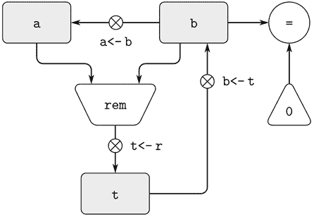

图 5.1 GCD 机器的数据路径。

计算常数和寄存器内容的值的操作在数据路径图中由一个梯形表示，其中包含操作的名称。例如，图 5.1 中标记为`rem`的框表示一个计算所附寄存器`a`和`b`的内容的余数的操作。箭头（没有按钮）从输入寄存器和常数指向框，箭头将操作的输出值连接到寄存器。测试由包含测试名称的圆圈表示。例如，我们的 GCD 机器有一个测试操作，用于测试寄存器`b`的内容是否为零。测试也有从其输入寄存器和常数的箭头，但它没有输出箭头；它的值由控制器而不是数据路径使用。总的来说，数据路径图显示了机器所需的寄存器和操作，以及它们之间的连接方式。如果我们将箭头视为电线，按钮视为开关，数据路径图就非常像可以由电子元件构建的机器的接线图。

为了使数据路径实际计算 GCD，必须按正确的顺序按下按钮。我们将根据控制器图表描述这个顺序，如图 5.2 所示。控制器图表的元素指示应如何操作数据路径组件。控制器图表中的矩形框标识要按下的数据路径按钮，并且箭头描述从一步到下一步的顺序。图表中的菱形代表一个决定。根据菱形中指定的数据路径测试的值，将遵循两个顺序箭头中的一个。我们可以根据物理类比来解释控制器：将图表视为一个迷宫，弹珠在其中滚动。当弹珠滚入一个框中时，它会按照框的名称按下数据路径按钮。当弹珠滚入决策节点（例如`b = 0`的测试）时，它会根据指定测试的结果离开节点。

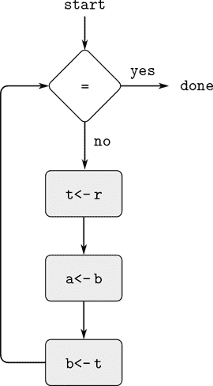

图 5.2 GCD 机器的控制器。

将数据路径和控制器结合起来，完全描述了一个计算 GCD 的机器。我们将控制器（滚动的弹珠）放在标有`start`的地方，然后在寄存器`a`和`b`中放入数字。当控制器到达`done`时，我们将在寄存器`a`中找到 GCD 的值。

##### 练习 5.1

设计一个寄存器机器，使用以下函数指定的迭代算法计算阶乘。为这台机器绘制数据路径和控制器图表。

```js
function factorial(n) {
    function iter(product, counter) {
    return counter > n
           ? product
           : iter(counter * product,
                  counter + 1);
    }
    return iter(1, 1);
}
```

### 5.1.1 描述寄存器机器的语言

数据路径和控制器图表足以表示诸如 GCD 之类的简单机器，但对于描述 JavaScript 解释器之类的大型机器来说，它们是笨重的。为了能够处理复杂的机器，我们将创建一种以文本形式呈现数据路径和控制器图表中提供的所有信息的语言。我们将从直接反映图表的符号开始。

我们通过描述寄存器和操作来定义机器的数据路径。为了描述一个寄存器，我们给它一个名称，并指定控制分配给它的按钮。我们给每个按钮一个名称，并指定进入由按钮控制的寄存器的数据的来源（来源可以是寄存器、常量或操作）。为了描述一个操作，我们给它一个名称，并指定它的输入（寄存器或常量）。

我们将机器的控制器定义为一系列*指令*，以及标识序列中*入口点*的*标签*。指令可以是以下之一：

+   按下数据路径按钮的名称，以将值分配给寄存器。（这对应于控制器图表中的一个框。）

+   一个`test`指令，执行指定的测试。

+   一个条件分支（`branch`指令）到控制器标签指示的位置，基于先前测试的结果。（测试和分支一起对应于控制器图表中的菱形。）如果测试为假，则控制器应继续执行序列中的下一条指令。否则，控制器应继续执行标签后的指令。

+   一个无条件分支（`go_to`指令），命名控制器标签，以便继续执行。

机器从控制器指令序列的开头开始，并在执行到达序列末尾时停止。除非分支改变了控制流，否则指令将按照它们列出的顺序执行。

图 5.3 显示了以这种方式描述的 GCD 机器。这个例子只是暗示了这些描述的一般性，因为 GCD 机器是一个非常简单的情况：每个寄存器只有一个按钮，并且每个按钮和测试在控制器中只使用一次。

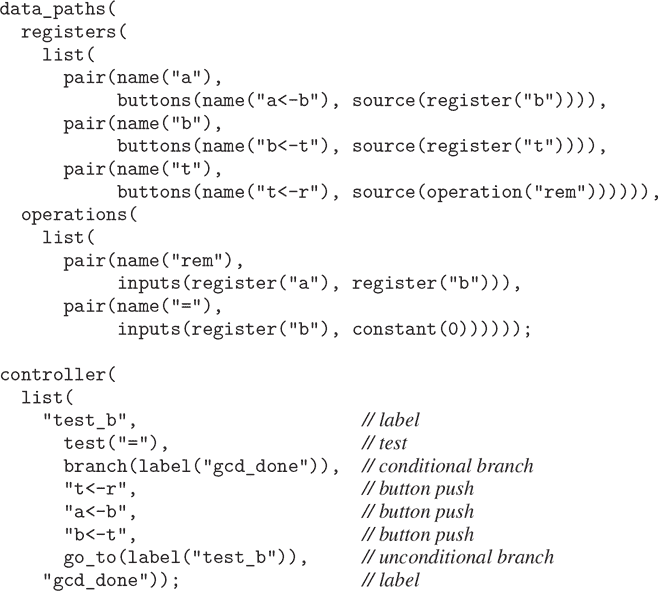

图 5.3 GCD 机器的规范。

不幸的是，阅读这样的描述是困难的。为了理解控制器指令，我们必须不断地参考按钮名称和操作名称的定义，为了理解按钮的功能，我们可能必须参考操作名称的定义。因此，我们将转换我们的符号，将数据路径和控制器描述的信息合并在一起，以便我们可以一起看到。

为了获得这种描述形式，我们将用它们的行为定义替换任意按钮和操作名称。也就是说，我们将说（在控制器中）“按下分配给寄存器`t`的按钮”并分别说（在数据路径中）“按钮`t<-r`将`rem`操作的值分配给寄存器`t`”和“`rem`操作的输入是寄存器`a`和`b`的内容”，我们将说（在控制器中）“按下将`rem`操作的值分配给寄存器`t`的按钮”。类似地，我们将说（在控制器中）“执行`=`测试”并分别说（在数据路径中）“`=`测试作用于寄存器`b`的内容和常量 0”，我们将说“对寄存器`b`的内容和常量 0 执行`=`测试”。我们将省略数据路径描述，只保留控制器序列。因此，GCD 机器的描述如下：

```js
controller(
  list(
    "test_b",
      test(list(op("="), reg("b"), constant(0))),
      branch(label("gcd_done")),
      assign("t", list(op("rem"), reg("a"), reg("b"))),
      assign("a", reg("b")),
      assign("b", reg("t")),
      go_to(label("test_b")),
    "gcd_done"))
```

这种描述形式比图 5.3 中所示的形式更容易阅读，但它也有缺点：

+   对于大型机器来说，它更冗长，因为每当在控制器指令序列中提到元素时，就会重复数据路径元素的完整描述。（这在 GCD 示例中不是问题，因为每个操作和按钮只使用一次。）此外，重复数据路径描述会使机器的实际数据路径结构变得模糊；对于大型机器来说，有多少寄存器、操作和按钮以及它们如何相互连接并不明显。

+   因为机器定义中的控制器指令看起来像 JavaScript 表达式，很容易忘记它们不是任意的 JavaScript 表达式。它们只能表示合法的机器操作。例如，操作只能直接作用于常量和寄存器的内容，而不能作用于其他操作的结果。

尽管存在这些缺点，但在本章中我们将使用这种寄存器机器语言，因为我们更关心理解控制器，而不是理解数据路径中的元素和连接。然而，我们应该记住，数据路径设计在设计真实机器时至关重要。

##### 练习 5.2

使用寄存器机器语言描述练习 5.1 中的迭代阶乘机器。

##### 行动

让我们修改 GCD 机器，以便我们可以输入我们想要的最大公约数的数字并打印答案。我们不会讨论如何制作一个可以读取和打印的机器，而是假设（就像我们在 JavaScript 中使用`prompt`和`display`时一样）它们作为原始操作是可用的。

`prompt`操作类似于我们一直在使用的操作，因为它产生一个可以存储在寄存器中的值。但`prompt`不从任何寄存器中获取输入；它的值取决于我们设计的机器之外发生的事情。

我们将允许我们机器的操作具有这样的行为，并且将绘制和标注`prompt`的使用，就像我们对任何计算值的其他操作一样。

另一方面，`display`操作在根本上与我们一直在使用的操作不同：它不会产生要存储在寄存器中的输出值。 尽管它有一个效果，但这个效果不是在我们设计的机器的一部分上。 我们将这种操作称为*动作*。 我们将在数据路径图中表示动作，就像我们表示计算值的操作一样 - 作为一个包含动作名称的梯形。 箭头从任何输入（寄存器或常数）指向动作框。 我们还将一个按钮与动作关联起来。 按下按钮会使动作发生。 为了使控制器按下动作按钮，我们使用一种称为`perform`的新类型指令。 因此，打印寄存器`a`的内容的动作在控制器序列中表示为指令

```js
perform(list(op("display"), reg("a")))
```

图 5.4 显示了新 GCD 机器的数据路径和控制器。 与其在打印答案后停止，我们让它重新开始，以便它反复读取一对数字，计算它们的 GCD，并打印结果。 这种结构类似于我们在第 4 章解释器中使用的驱动循环。

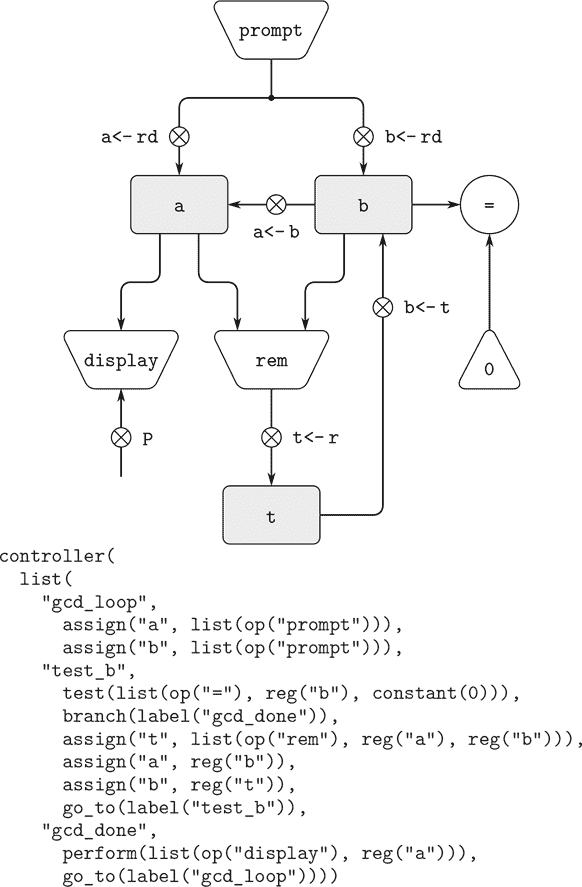

图 5.4 一个读取输入并打印结果的 GCD 机器。

### 5.1.2 机器设计中的抽象

我们经常定义一个机器包括实际上非常复杂的“原始”操作。 例如，在第 5.4 节和 5.5 节中，我们将把 JavaScript 的环境操作视为原始操作。 这种抽象是有价值的，因为它使我们能够忽略机器的某些部分的细节，以便我们可以集中精力处理设计的其他方面。 然而，我们将大量复杂性隐藏起来，并不意味着机器设计是不切实际的。 我们总是可以用更简单的原始操作来替换复杂的“原始”。

考虑 GCD 机器。 该机器具有一个指令，计算寄存器`a`和`b`的内容的余数，并将结果赋给寄存器`t`。 如果我们想要构建 GCD 机器而不使用原始的余数运算，我们必须指定如何通过更简单的操作（如减法）来计算余数。 实际上，我们可以编写一个 JavaScript 函数以这种方式找到余数：

```js
function remainder(n, d) {
    return n < d
           ? n
           : remainder(n - d, d);
}
```

因此，我们可以用减法和比较测试来替换 GCD 机器数据路径中的余数运算。 图 5.5 显示了详细机器的数据路径和控制器。指令

```js
assign("t", list(op("rem"), reg("a"), reg("b")))
```

在 GCD 控制器定义中被替换为包含循环的一系列指令，如图 5.6 所示。

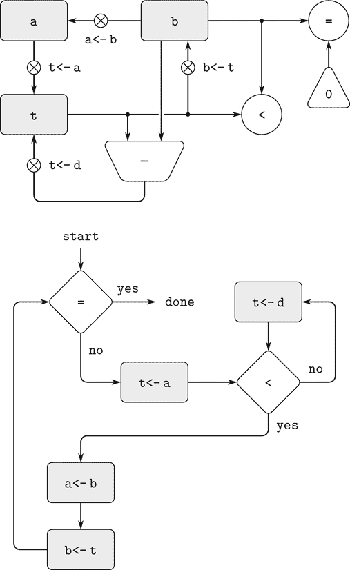

图 5.5 详细 GCD 机器的数据路径和控制器。

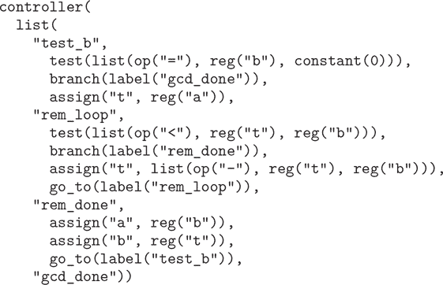

图 5.6 GCD 机器的控制器指令序列，如图 5.5 所示。

##### 练习 5.3

设计一个使用牛顿法计算平方根的机器，如第 1.1.7 节中描述的，并在第 1.1.8 节中用以下代码实现：

```js
function sqrt(x) {
    function is_good_enough(guess) {
        return math_abs(square(guess) - x) < 0.001;
    }
    function improve(guess) {
        return average(guess, x / guess);
    }
    function sqrt_iter(guess) {
        return is_good_enough(guess)
               ? guess
           : sqrt_iter(improve(guess));
    }
    return sqrt_iter(1);
}
```

首先假设`is_good_enough`和`improve`操作作为原始操作可用。 然后展示如何通过算术操作来扩展这些操作。 通过绘制数据路径图和用寄存器机器语言编写控制器定义，描述每个`sqrt`机器设计的版本。

### 5.1.3 子程序

设计执行计算的机器时，我们通常希望安排组件被不同部分的计算共享，而不是复制组件。考虑一个包括两个 GCD 计算的机器——一个是寻找寄存器`a`和`b`中内容的 GCD，另一个是寻找寄存器`c`和`d`中内容的 GCD。我们可能首先假设有一个原始的`gcd`操作，然后用更原始的操作来扩展两个`gcd`的实例。图 5.7 仅显示了结果机器数据路径的 GCD 部分，而没有显示它们如何连接到机器的其余部分。该图还显示了机器控制器序列的相应部分。


图 5.7 具有两个 GCD 计算的机器的数据路径和控制器序列的部分。

这台机器有两个余数运算框和两个用于测试相等性的框。如果复制的组件很复杂，比如余数框，这将不是一种经济的建造机器的方式。我们可以通过使用相同的组件来避免复制数据路径组件进行两个 GCD 计算，只要这样做不会影响较大机器的其余计算。如果寄存器`a`和`b`中的值在控制器到达`gcd_2`时不再需要（或者这些值可以移动到其他寄存器以供安全保管），我们可以更改机器，使其在计算第二个 GCD 时使用寄存器`a`和`b`，而不是寄存器`c`和`d`。如果这样做，我们将获得图 5.8 所示的控制器序列。

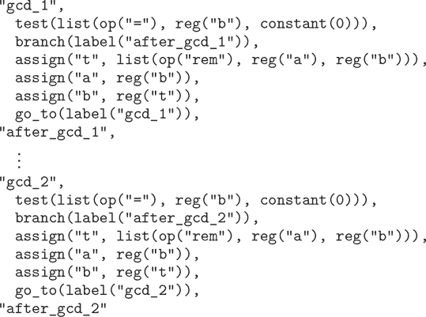

图 5.8 使用相同的数据路径组件进行两个不同的 GCD 计算的机器的控制器序列的部分。

我们已经删除了重复的数据路径组件（使数据路径再次如图 5.1 所示），但是控制器现在有两个仅在它们的入口点标签上不同的 GCD 序列。最好用单个序列的分支替换这两个序列——一个`gcd`*子程序*——在该子程序的末尾我们再次分支到主指令序列中的正确位置。我们可以通过以下方式实现这一点：在分支到`gcd`之前，我们将一个区分值（如 0 或 1）放入特殊寄存器`continue`。在`gcd`子程序结束时，根据`continue`寄存器的值，我们返回到`after_gcd_1`或`after_gcd_2`。图 5.9 显示了结果控制器序列的相关部分，其中仅包括`gcd`指令的单个副本。

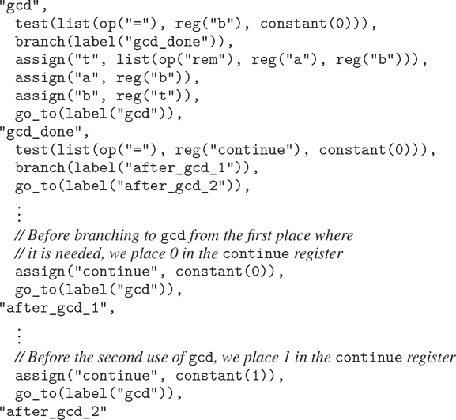

图 5.9 使用`continue`寄存器避免图 5.8 中重复的控制器序列。

这是处理小问题的合理方法，但如果控制器序列中有许多 GCD 计算的实例，这将是很笨拙的。为了决定在`gcd`子程序之后继续执行的位置，我们需要在数据路径中进行测试，并在控制器中为所有使用`gcd`的地方添加分支指令。实现子程序的更强大方法是使`continue`寄存器保存控制器序列中执行完成后应继续执行的入口点的标签。实现这种策略需要寄存器机器的数据路径和控制器之间的一种新连接：必须有一种方法将标签分配给寄存器，以便可以从寄存器中获取此值，并用于在指定的入口点继续执行。

为了反映这种能力，我们将扩展寄存器机器语言的`assign`指令，允许将寄存器分配为控制器序列中标签的值（作为一种特殊类型的常量）。我们还将扩展`go_to`指令，允许执行继续在寄存器的内容描述的入口点处继续，而不仅仅是在常量标签描述的入口点处。使用这些新构造，我们可以通过分支到`continue`寄存器中存储的位置来终止`gcd`子程序。这导致了图 5.10 中显示的控制器序列。

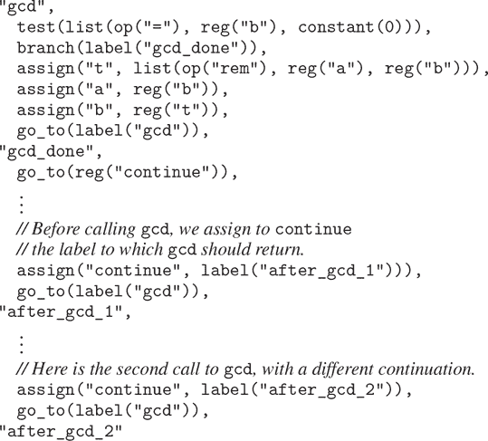

图 5.10 将标签分配给`continue`寄存器简化并概括了图 5.9 中显示的策略。

具有多个子例程的机器可以使用多个继续寄存器（例如`gcd_continue`，`factorial_continue`），或者我们可以让所有子例程共享一个`continue`寄存器。共享更经济，但是如果我们有一个子例程（`sub1`）调用另一个子例程（`sub2`），我们必须小心。除非`sub1`在设置`continue`以调用`sub2`之前将`continue`的内容保存在其他寄存器中，否则`sub1`完成时将不知道要去哪里。下一节中开发的处理递归的机制也提供了解决嵌套子例程调用问题的更好解决方案。

### 5.1.4 使用堆栈实现递归

到目前为止，我们所展示的思想可以通过指定具有与过程的每个状态变量对应的寄存器的寄存器机器来实现任何迭代过程。该机器重复执行控制器循环，改变寄存器的内容，直到满足某个终止条件。在控制器序列的每一点上，机器的状态（表示迭代过程的状态）完全由寄存器的内容（状态变量的值）确定。

然而，实现递归过程需要额外的机制。考虑以下用于计算阶乘的递归方法，我们在 1.2.1 节中首次研究了这个方法：

```js
function factorial(n) {
    return n === 1
           ? 1
           : n * factorial(n - 1);
}
```

从函数中我们可以看到，计算`n!`需要计算`(n – 1)!`. 我们的 GCD 机器，模拟了函数

```js
function gcd(a, b) {
    return b === 0 ? a : gcd(b, a % b);
}
```

同样需要计算另一个 GCD。但是`gcd`函数和`factorial`之间有一个重要的区别，`gcd`函数将原始计算减少为新的 GCD 计算，而`factorial`需要计算另一个阶乘作为子问题。在 GCD 中，新 GCD 计算的答案是原始问题的答案。要计算下一个 GCD，我们只需将新参数放入 GCD 机器的输入寄存器中，并通过执行相同的控制器序列重用机器的数据路径。当机器完成解决最终的 GCD 问题时，它已经完成了整个计算。

在阶乘（或任何递归过程）的情况下，新阶乘子问题的答案不是原始问题的答案。必须将`(n – 1)!`的值乘以`n`才能得到最终答案。如果我们试图模仿 GCD 设计，并通过减少`n`寄存器并重新运行阶乘机器来解决阶乘子问题，我们将不再拥有旧值`n`以便将结果相乘。因此，我们需要第二个阶乘机器来处理

子问题。这第二个阶乘计算本身有一个阶乘子问题，需要第三个阶乘机器，依此类推。由于每个阶乘机器中包含另一个阶乘机器，因此总机器包含无限数量的类似机器的嵌套，因此无法从固定的有限数量的部分构建。

然而，如果我们能够安排在机器的每个嵌套实例中使用相同的组件，我们就可以将阶乘过程实现为一个寄存器机。具体来说，计算`n!`的机器应该使用相同的组件来处理计算`(n – 1)!`的子问题，以及`(n – 2)!`的子问题，依此类推。这是合理的，因为阶乘过程规定需要无限数量的相同机器的副本来执行计算，但在任何给定时间只有一个副本需要处于活动状态。当机器遇到递归子问题时，它可以暂停主问题的工作，重复使用相同的物理部件来处理子问题，然后继续暂停的计算。

在子问题中，寄存器的内容将与主问题中的内容不同。（在这种情况下，`n`寄存器被递减。）为了能够继续暂停的计算，机器必须保存任何在解决子问题后将需要的寄存器的内容，以便在解决子问题后恢复这些内容以继续暂停的计算。在阶乘的情况下，我们将保存`n`的旧值，在完成对递减的`n`寄存器的阶乘计算后将其恢复。

由于嵌套递归调用的深度没有先验限制，我们可能需要保存任意数量的寄存器值。这些值必须以它们被保存的相反顺序进行恢复，因为在递归的嵌套中，最后进入的子问题是第一个完成的。这决定了使用“栈”或“后进先出”数据结构来保存寄存器值。我们可以通过添加两种指令来扩展寄存器机器语言以包括一个栈：使用`save`指令将值放入栈中，并使用`restore`指令从栈中恢复值。在一系列值被保存到栈上后，一系列`restore`将以相反的顺序检索这些值。

借助栈的帮助，我们可以为每个阶乘子问题重复使用阶乘机器的数据路径的单个副本。在重用操作数据路径的控制器序列方面存在类似的设计问题。为了重新执行阶乘计算，控制器不能简单地回到开始，因为在解决`(n – 1)!`子问题后，机器仍然必须将结果乘以`n`。控制器必须暂停计算`n!`，解决`(n – 1)!`子问题，然后继续计算`n!`。阶乘计算的这种观点表明了在 5.1.3 节中描述的子程序机制的使用，其中控制器使用`continue`寄存器来转移到解决子问题的序列的部分，然后继续在主问题上离开的地方。因此，我们可以制作一个返回到存储在`continue`寄存器中的入口点的阶乘子程序。在每个子程序调用周围，我们保存和恢复`continue`，就像我们对`n`寄存器做的那样，因为阶乘计算的每个“级别”将使用相同的`continue`寄存器。也就是说，阶乘子程序在调用自身解决子问题时必须在`continue`中放入一个新值，但为了返回到调用它解决子问题的地方，它将需要旧值。

图 5.11 显示了实现递归`factorial`函数的机器的数据路径和控制器。该机器有一个堆栈和三个寄存器，称为`n`，`val`和`continue`。为了简化数据路径图，我们没有命名寄存器分配按钮，只有堆栈操作按钮（`sc`和`sn`用于保存寄存器，`rc`和`rn`用于恢复寄存器）。要操作这台机器，我们将要计算阶乘的数放入寄存器`n`中并启动机器。当机器到达`fact_done`时，计算完成，答案将在`val`寄存器中找到。在控制器序列中，每次递归调用之前都会保存`n`和`continue`，并在调用返回时恢复。从调用返回是通过跳转到`continue`中存储的位置来实现的。机器启动时会初始化`continue`寄存器，以便最后的返回将到达`fact_done`。`val`寄存器保存了阶乘计算的结果，不会在递归调用之前保存，因为在子程序返回后，旧的`val`内容是没有用的。只有新值，也就是子计算产生的值，是需要的。

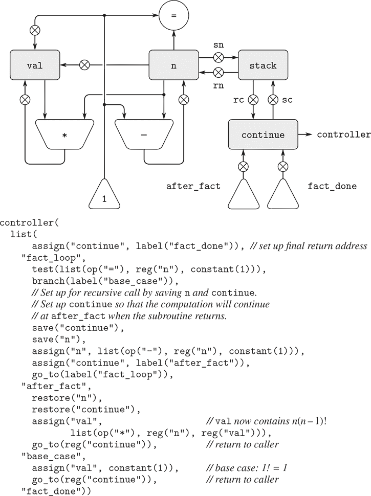

图 5.11 递归阶乘机器。

尽管原则上阶乘计算需要一个无限的机器，但是图 5.11 中的机器实际上是有限的，除了堆栈，堆栈可能是无限的。然而，任何特定的堆栈物理实现都将是有限大小的，这将限制机器可以处理的递归调用的深度。阶乘的这种实现说明了将递归算法实现为普通寄存器机器加上堆栈的一般策略。当遇到递归子问题时，我们在堆栈上保存当前值将在解决子问题后需要的寄存器，解决递归子问题，然后恢复保存的寄存器并继续在主问题上执行。`continue`寄存器必须始终保存。是否需要保存其他寄存器取决于特定的机器，因为并非所有递归计算都需要在解决子问题时修改的寄存器的原始值（参见练习 5.4）。

##### 双重递归

让我们来看一个更复杂的递归过程，即我们在 1.2.2 节中介绍的树递归计算斐波那契数：

```js
function fib(n) {
    return n === 0
           ? 0
           : n === 1
           ? 1
           : fib(n - 1) + fib(n - 2);
}
```

就像阶乘一样，我们可以使用寄存器机器来实现递归斐波那契计算，其中有寄存器`n`，`val`和`continue`。这台机器比阶乘的机器更复杂，因为在控制器序列中有两个地方需要进行递归调用——一次是计算`Fib(n – 1)`，一次是计算`Fib(n – 2)`。为了为每个调用设置准备，我们保存将来需要的寄存器的值，将`n`寄存器设置为需要递归计算的数（`n – 1`或`n – 2`），并将`continue`分配给主序列中的入口点以便返回（分别是`afterfib_n_1`或`afterfib_n_2`）。然后我们进入`fib_loop`。当我们从递归调用返回时，答案在`val`中。图 5.12 显示了这台机器的控制器序列。


图 5.12 计算斐波那契数的机器的控制器。

##### 练习 5.4

指定实现以下每个函数的寄存器机器。对于每台机器，编写一个控制器指令序列，并绘制一个显示数据路径的图。

1.  a. 递归指数运算：

    ```js
    function expt(b, n) {
        return n === 0
               ? 1
               : b * expt(b, n - 1);
    }
    ```

1.  b. 迭代指数运算：

    ```js
    function expt(b, n) {
        function expt_iter(counter, product) {
            return counter === 0
                   ? product
                   : expt_iter(counter - 1, b * product);
        }
        return expt_iter(n, 1);
    }
    ```

##### 练习 5.5

手动模拟阶乘和斐波那契机器，使用一些复杂的输入（需要执行至少一个递归调用）。显示执行中每个重要点的堆栈内容。

##### 练习 5.6

Ben Bitdiddle 观察到斐波那契机器的控制器序列有额外的`save`和额外的`restore`，可以删除以使机器更快。这些指令在哪里？

### 5.1.5 指令摘要

我们的寄存器机器语言中的控制器指令具有以下形式之一，其中每个`input[i]`是`reg(register-name)`或`constant(constant-value)`。

这些指令是在 5.1.1 节中引入的：

```js
assign(register-name, reg(register-name))

assign(register-name, constant(constant-value))

assign(register-name, list(op(operation-name), input[1], ..., input[n]))

perform(list(op(operation-name), input[1], ..., input[n]))

test(list(op(operation-name), input[1], ..., input[n]))

branch(label(label-name))

go_to(label(label-name))
```

使用寄存器保存标签是在 5.1.3 节中引入的：

```js
assign(register-name, label(label-name))

go_to(reg(register-name))
```

使用堆栈的指令是在 5.1.4 节中引入的：

```js
save(register-name)

restore(register-name)
```

到目前为止，我们看到的唯一类型的`constant-value`是一个数字，但稍后我们还将使用字符串和列表。例如，`constant("abc")`是字符串`"abc"`，`constant(null)`是空列表，`constant(list("a", "b", "c"))`是列表`list("a", "b", "c")`。

## 5.2 寄存器机器模拟器

为了更好地理解寄存器机器的设计，我们必须测试我们设计的机器，以查看它们是否按预期运行。测试设计的一种方法是手动模拟控制器的操作，就像练习 5.5 中那样。但是，除了最简单的机器外，这种方法非常乏味。在本节中，我们构建了一个模拟器，用于模拟寄存器机器语言描述的机器。该模拟器是一个 JavaScript 程序，具有四个接口函数。第一个使用寄存器机器的描述来构建机器的模型（一个数据结构，其部分对应于要模拟的机器的部分），另外三个允许我们通过操作模型来模拟机器：

+   `make_machine(register-names, operations, controller)`

    构建并返回具有给定寄存器、操作和控制器的机器模型。

+   `set_register_contents(machine-model, register-name, value)`

    在给定机器中的模拟寄存器中存储一个值。

+   `get_register_contents(machine-model, register-name)`

    返回给定机器中模拟寄存器的内容。

+   `start(machine-model)`

    模拟给定机器的执行，从控制器序列的开头开始，直到到达序列的末尾。

作为这些函数如何使用的示例，我们可以定义`gcd_machine`为 5.1.1 节中 GCD 机器的模型，如下所示：

```js
const gcd_machine =
    make_machine(
        list("a", "b", "t"),
        list(list("rem", (a, b) => a % b),
         list("=", (a, b) => a === b)),
        list(
          "test_b",
            test(list(op("="), reg("b"), constant(0))),
            branch(label("gcd_done")),
            assign("t", list(op("rem"), reg("a"), reg("b"))),
            assign("a", reg("b")),
            assign("b", reg("t")),
            go_to(label("test_b")),
      "gcd_done"));
```

`make_machine`的第一个参数是一个寄存器名称列表。下一个参数是一个表（包含两个元素列表的列表），将每个操作名称与实现该操作的 JavaScript 函数配对（即，给定相同的输入值产生相同的输出值）。最后一个参数指定控制器，格式为标签和机器指令的列表，就像 5.1 节中的格式。

要使用这台机器计算 GCD，我们设置输入寄存器，启动机器，并在模拟终止时检查结果：

```js
set_register_contents(gcd_machine, "a", 206);
"done"

set_register_contents(gcd_machine, "b", 40);
"done"

start(gcd_machine);
"done"

get_register_contents(gcd_machine, "a");
`2`
```

这个计算将比用 JavaScript 编写的`gcd`函数运行得慢得多，因为我们将模拟低级机器指令，比如`assign`，通过更复杂的操作。

##### 练习 5.7

使用模拟器测试您在练习 5.4 中设计的机器。

### 5.2.1 机器模型

`make_machine`生成的机器模型表示为使用消息传递技术在第 3 章中开发的本地状态的函数。为了构建这个模型，`make_machine`首先调用函数`make_new_machine`来构造所有寄存器机器共有的部分。由`make_new_machine`构建的基本机器模型本质上是一种包含一些寄存器和堆栈的容器，以及一个执行机制，逐个处理控制器指令。

然后函数`make_machine`扩展了这个基本模型（通过向其发送消息）以包括所定义的特定机器的寄存器、操作和控制器。首先，它为新机器中提供的每个寄存器名称分配一个寄存器，并在机器中安装指定的操作。然后，它使用一个*汇编器*（在第 5.2.2 节中描述）将控制器列表转换为新机器的指令，并将其安装为机器的指令序列。函数`make_machine`返回修改后的机器模型作为其值。

```js
function make_machine(register_names, ops, controller) {
    const machine = make_new_machine();
    for_each(register_name =>
               machine("allocate_register")(register_name),
             register_names);
    machine("install_operations")(ops);
    machine("install_instruction_sequence")
           (assemble(controller, machine));
    return machine;
}
```

##### 寄存器

我们将寄存器表示为具有局部状态的函数，就像第 3 章中一样。函数`make_register`创建一个可以访问或更改值的寄存器：

```js
function make_register(name) {
    let contents = "unassigned";
    function dispatch(message) {
        return message === "get"
               ? contents
               : message === "set"
               ? value => { contents = value; }
               : error(message, "unknown request – make_register");
    }
    return dispatch;
}
```

以下函数用于访问寄存器：

```js
function get_contents(register) {
    return register("get");
}
function set_contents(register, value) {
    return register("set")(value);
}
```

##### 栈

我们也可以将栈表示为具有局部状态的函数。函数`make_stack`创建一个栈，其局部状态包括栈上项目的列表。栈接受请求将项目`push`到栈上，`pop`弹出栈顶项目并返回它，以及`initialize`将栈初始化为空。

```js
function make_stack() {
    let stack = null;
    function push(x) {
        stack = pair(x, stack);
        return "done";
    }
    function pop() {
        if (is_null(stack)) {
            error("empty stack – pop");
        } else {
            const top = head(stack);
            stack = tail(stack);
            return top;
        }
    }
    function initialize() {
        stack = null;
        return "done";
    }
    function dispatch(message) {
        return message === "push"
               ? push
               : message === "pop"
               ? pop()
               : message === "initialize"
               ? initialize()
               : error(message, "unknown request – stack");
    }
    return dispatch;
}
```

以下函数用于访问栈：

```js
function pop(stack) {
    return stack("pop");
}
function push(stack, value) {
    return stack("push")(value);
}
```

##### 基本机器

`make_new_machine`函数，如图 5.13 所示，构造了一个对象，其局部状态包括一个栈、一个最初为空的指令序列、一个最初包含一个初始化栈操作的操作列表，以及一个*寄存器表*，最初包含两个寄存器，名为`flag`和`pc`（代表“程序计数器”）。内部函数`allocate_register`添加新条目到寄存器表中，内部函数`lookup_register`在表中查找寄存器。

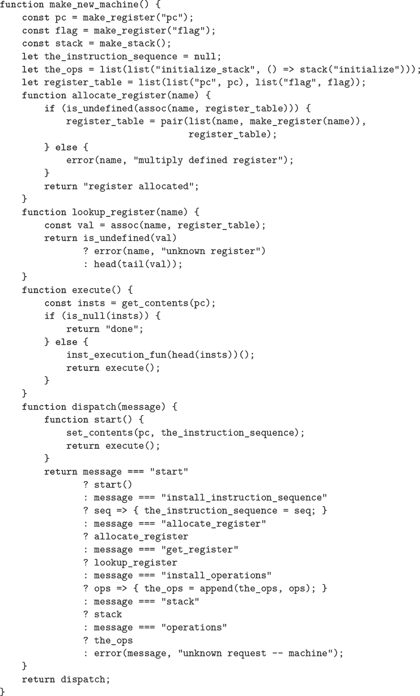

图 5.13 `make_new_machine`函数实现了基本的机器模型。

`flag`寄存器用于控制模拟机器中的分支。我们的`test`指令将`flag`的内容设置为测试的结果（真或假）。我们的`branch`指令通过检查`flag`的内容来决定是否进行分支。

`pc`寄存器确定指令在机器运行时的顺序。这种顺序由内部函数`execute`实现。在模拟模型中，每条机器指令都是一个数据结构，其中包括一个没有参数的函数，称为*指令执行函数*，调用这个函数模拟执行指令。随着模拟的运行，`pc`指向指令序列中下一条要执行的指令的位置。函数`execute`获取该指令，通过调用指令执行函数来执行它，并重复这个循环，直到没有更多的指令需要执行（即，直到`pc`指向指令序列的末尾）。

作为其操作的一部分，每个指令执行函数修改`pc`以指示下一个要执行的指令。`branch`和`go_to`指令将`pc`更改为指向新的目的地。所有其他指令只是推进`pc`，使其指向序列中的下一条指令。请注意，每次调用`execute`都会再次调用`execute`，但这不会产生无限循环，因为运行指令执行函数会改变`pc`的内容。

函数`make_new_machine`返回一个分发函数，实现对内部状态的消息传递访问。请注意，启动机器是通过将`pc`设置为指令序列的开头并调用`execute`来完成的。

为了方便起见，我们提供了一个机器的`start`操作的替代接口，以及用于设置和检查寄存器内容的函数，如第 5.2 节开头所述：

```js
function start(machine) {
    return machine("start");
}
function get_register_contents(machine, register_name) {
    return get_contents(get_register(machine, register_name));
}
function set_register_contents(machine, register_name, value) {
    set_contents(get_register(machine, register_name), value);
    return "done";
}
```

这些函数（以及第 5.2.2 和 5.2.3 节中的许多函数）使用以下内容来查找给定机器中具有给定名称的寄存器：

```js
function get_register(machine, reg_name) {
    return machine("get_register")(reg_name);
}
```

### 5.2.2 汇编器

汇编器将机器的控制器指令序列转换为相应的机器指令列表，每个指令都有其执行函数。总的来说，汇编器很像我们在第 4 章中学习的求值器——它有一个输入语言（在本例中是寄存器机器语言），我们必须对语言中的每种组件执行适当的操作。

为每条指令生成一个执行函数的技术正是我们在 4.1.7 节中用来通过将分析与运行时执行分离来加速求值器的技术。正如我们在第 4 章中看到的，可以在不知道名称的实际值的情况下执行对 JavaScript 表达式的有用分析。在这里，类似地，可以在不知道机器寄存器的实际内容的情况下执行对寄存器机器语言表达式的有用分析。例如，我们可以用指向寄存器对象的指针来替换对寄存器的引用，并且可以用指向标签在指令序列中指定位置的指针来替换对标签的引用。

在生成指令执行函数之前，汇编器必须知道所有标签的引用，因此它首先通过扫描控制器序列来将标签与指令分离。在扫描控制器时，它同时构造了指令列表和一个将每个标签与指向该列表中的指针关联起来的表。然后汇编器通过为每条指令插入执行函数来增强指令列表。

`assemble`函数是汇编器的主要入口。它接受控制器序列和机器模型作为参数，并返回要存储在模型中的指令序列。`assemble`函数调用`extract_labels`来从提供的控制器构建初始指令列表和标签表。`extract_labels`的第二个参数是一个函数，用于处理这些结果：该函数使用`update_insts`生成指令执行函数并将其插入指令列表，然后返回修改后的列表。

```js
function assemble(controller, machine) {
    return extract_labels(controller,
                          (insts, labels) => {
                              update_insts(insts, labels, machine);
                              return insts;
                          });
}
```

`extract_labels`函数接受一个名为`controller`的列表和一个名为`receive`的函数作为参数。函数`receive`将被调用并传入两个值：（1）一个名为`insts`的指令数据结构列表，其中包含来自`controller`的指令；和（2）一个名为`labels`的表，它将`controller`中的每个标签与其指定的`insts`列表中的位置关联起来。

```js
function extract_labels(controller, receive) {
    return is_null(controller)
           ? receive(null, null)
           : extract_labels(
                 tail(controller),
                 (insts, labels) => {
                   const next_element = head(controller);
                   return is_string(next_element)
                          ? receive(insts,
                                    pair(make_label_entry(next_element,
                                                          insts),
                                         labels))
                          : receive(pair(make_inst(next_element),
                                         insts),
                                    labels);
                 });
}
```

`extract_labels`函数通过顺序扫描`controller`的元素并累积`insts`和`labels`来工作。如果一个元素是字符串（因此是标签），则将适当的条目添加到`labels`表中。否则，该元素将被累积到`insts`列表中。

`update_insts`函数修改了指令列表，该列表最初只包含控制器指令，以包括相应的执行函数：

```js
function update_insts(insts, labels, machine) {
    const pc = get_register(machine, "pc");
    const flag = get_register(machine, "flag");
    const stack = machine("stack");
    const ops = machine("operations");
    return for_each(inst => set_inst_execution_fun(
                                inst,
                                make_execution_function(
                                    inst_controller_instruction(inst),
                                    labels, machine, pc,
                                    flag, stack, ops)),
                    insts);
}
```

机器指令数据结构简单地将控制器指令与相应的执行函数配对。当`extract_labels`构造指令时，执行函数尚不可用，而是稍后由`update_insts`插入。

```js
function make_inst(inst_controller_instruction) {
    return pair(inst_controller_instruction, null);
}
function inst_controller_instruction(inst) {
    return head(inst);
}
function inst_execution_fun(inst) {
    return tail(inst);
}
function set_inst_execution_fun(inst, fun) {
    set_tail(inst, fun);
}
```

我们的模拟器不使用控制器指令，但保留它以便进行调试（参见练习 5.15）。

标签表的元素是成对出现的：

```js
function make_label_entry(label_name, insts) {
    return pair(label_name, insts);
}
```

表中的条目将使用查找。

```js
function lookup_label(labels, label_name) {
    const val = assoc(label_name, labels);
    return is_undefined(val)
           ? error(label_name, "undefined label – assemble")
           : tail(val);
}
```

##### 练习 5.8

以下寄存器机器代码是模棱两可的，因为标签`here`被定义了多次：

```js
"start",
  go_to(label("here")),
"here",
  assign("a", constant(3)),
  go_to(label("there")),
"here",
  assign("a", constant(4)),
  go_to(label("there")),
"there",
```

按照目前的模拟器，当控制到达`there`时，寄存器`a`的内容将是什么？修改`extract_labels`函数，使得汇编器在使用相同的标签名称指示两个不同位置时会发出错误信号。

### 5.2.3 指令及其执行函数

汇编器调用`make_execution_function`为控制器指令生成执行函数。就像第 4.1.7 节的求值器中的`analyze`函数一样，这根据指令类型分发以生成适当的执行函数。这些执行函数的细节决定了寄存器机器语言中各个指令的含义。

```js
function make_execution_function(inst, labels, machine,
                                 pc, flag, stack, ops) {
    const inst_type = type(inst);
    return inst_type === "assign"
           ? make_assign_ef(inst, machine, labels, ops, pc)
           : inst_type === "test"
           ? make_test_ef(inst, machine, labels, ops, flag, pc)
           : inst_type === "branch"
           ? make_branch_ef(inst, machine, labels, flag, pc)
           : inst_type === "go_to"
           ? make_go_to_ef(inst, machine, labels, pc)
           : inst_type === "save"
           ? make_save_ef(inst, machine, stack, pc)
           : inst_type === "restore"
           ? make_restore_ef(inst, machine, stack, pc)
           : inst_type === "perform"
           ? make_perform_ef(inst, machine, labels, ops, pc)
           : error(inst, "unknown instruction type – assemble");
}
```

`controller`序列的元素由`make_machine`接收并传递给`assemble`，它们是字符串（用于标签）和带有标签的列表（用于指令）。指令中的标签是一个字符串，用于标识指令类型，比如`"go_to"`，列表的其余元素包含参数，比如`go_to`的目的地。`make_execution_function`中的分发使用

```js
function type(instruction) { return head(instruction); }
```

当求值作为`make_machine`的第三个参数的`list`表达式时，带有标签的列表被构造。`list`的每个参数都是一个字符串（求值为其自身）或者是一个带有指令标签列表构造函数的调用。例如，`assign("b", reg("t"))`调用构造函数`assign`，参数为`"b"`和调用构造函数`reg`的结果，参数为`"t"`。构造函数及其参数确定了寄存器机器语言中各个指令的语法。指令构造函数和选择器如下所示，以及使用选择器的执行函数生成器。

##### 指令`assign`

`make_assign_ef`函数为`assign`指令生成执行函数：

```js
function make_assign_ef(inst, machine, labels, operations, pc) {
    const target = get_register(machine, assign_reg_name(inst));
    const value_exp = assign_value_exp(inst);
    const value_fun =
        is_operation_exp(value_exp)
        ? make_operation_exp_ef(value_exp, machine, labels, operations)
        : make_primitive_exp_ef(value_exp, machine, labels);
    return () => {
               set_contents(target, value_fun());
               advance_pc(pc);
           };
}
```

`assign`函数构造`assign`指令。选择器`assign_reg_ name`和`assign_value_exp`从`assign`指令中提取寄存器名称和值表达式。

```js
function assign(register_name, source) {
    return list("assign", register_name, source);
}
function assign_reg_name(assign_instruction) {
    return head(tail(assign_instruction));
}
function assign_value_exp(assign_instruction) {
    return head(tail(tail(assign_instruction)));
}
```

`make_assign_ef`函数使用`get_register`查找寄存器名称以生成目标寄存器对象。如果值是操作的结果，则将值表达式传递给`make_ operation_exp_ef`，否则将其传递给`make_primitive_exp_ef`。这些函数（如下所示）分析值表达式并为该值生成执行函数。这是一个没有参数的函数，称为`value_fun`，在模拟期间将被求值以产生要分配给寄存器的实际值。请注意，查找寄存器名称和分析值表达式的工作只在汇编时执行一次，而不是每次模拟指令时执行。这种工作的节省是我们使用执行函数的原因，并直接对应于我们在第 4.1.7 节的求值器中将程序分析与执行分开获得的工作节省。

`make_assign_ef`返回的结果是`assign`指令的执行函数。当这个函数被调用（由机器模型的`execute`函数调用），它将目标寄存器的内容设置为执行`value_fun`得到的结果。然后通过运行函数将`pc`前进到下一条指令

```js
function advance_pc(pc) {
    set_contents(pc, tail(get_contents(pc)));
}
```

`advance_pc`函数是除`branch`和`go_to`之外的所有指令的正常终止。

##### 指令`test`，`branch`和`go_to`

`make_test_ef`函数以类似的方式处理`test`指令。它提取指定要测试的条件的表达式，并为其生成执行函数。在模拟时，调用条件的函数，将结果赋给`flag`寄存器，并将`pc`前进：

```js
function make_test_ef(inst, machine, labels, operations, flag, pc) {
    const condition = test_condition(inst);
    if (is_operation_exp(condition)) {
        const condition_fun = make_operation_exp_ef(
                                  condition, machine,
                                  labels, operations);
        return () => {
                   set_contents(flag, condition_fun());
                   advance_pc(pc);
               };
    } else {
        error(inst, "bad test instruction – assemble");
    }
}
```

`test`函数构造`test`指令。选择器`test_condition`从测试中提取条件。

```js
function test(condition) { return list("test", condition); }
function test_condition(test_instruction) {
    return head(tail(test_instruction));
}
```

`branch`指令的执行函数检查`flag`寄存器的内容，然后将`pc`的内容设置为分支目的地（如果分支被执行），或者只是推进`pc`（如果分支未被执行）。请注意，`branch`指令中指定的目的地必须是一个标签，`make_branch_ef`函数强制执行此条件。还要注意，标签是在汇编时查找的，而不是每次模拟`branch`指令时查找。

```js
function make_branch_ef(inst, machine, labels, flag, pc) {
    const dest = branch_dest(inst);
    if (is_label_exp(dest)) {
        const insts = lookup_label(labels, label_exp_label(dest));
        return () => {
                   if (get_contents(flag)) {
                       set_contents(pc, insts);
                   } else {
                       advance_pc(pc);
                   }
               };
    } else {
        error(inst, "bad branch instruction – assemble");
    }
}
```

`branch`函数构造`branch`指令。选择器`branch_dest`从分支中提取目的地。

```js
function branch(label) { return list("branch", label); }
function branch_dest(branch_instruction) {
    return head(tail(branch_instruction));
}
```

`go_to`指令类似于分支，不同之处在于目的地可以指定为标签或寄存器，并且没有条件需要检查——`pc`总是设置为新的目的地。

```js
function make_go_to_ef(inst, machine, labels, pc) {
    const dest = go_to_dest(inst);
    if (is_label_exp(dest)) {
        const insts = lookup_label(labels, label_exp_label(dest));
        return () => set_contents(pc, insts);
    } else if (is_register_exp(dest)) {
        const reg = get_register(machine, register_exp_reg(dest));
        return () => set_contents(pc, get_contents(reg));
    } else {
        error(inst, "bad go_to instruction – assemble");
    }
}
```

`go_to`函数构造`go_to`指令。选择器`go_to_dest`从`go_to`指令中提取目的地。

```js
function go_to(label) { return list("go_to", label); }
function go_to_dest(go_to_instruction) {
    return head(tail(go_to_instruction));
}
```

##### 其他指令

堆栈指令`save`和`restore`只是使用指定寄存器的堆栈并推进`pc`：

```js
function make_save_ef(inst, machine, stack, pc) {
    const reg = get_register(machine, stack_inst_reg_name(inst));
    return () => {
               push(stack, get_contents(reg));
               advance_pc(pc);
           };
}
function make_restore_ef(inst, machine, stack, pc) {
    const reg = get_register(machine, stack_inst_reg_name(inst));
    return () => {
               set_contents(reg, pop(stack));
               advance_pc(pc);
           };
}
```

`save`和`restore`函数构造`save`和`restore`指令。选择器`stack_inst_reg_name`从这些指令中提取寄存器名称。

```js
function save(reg) { return list("save", reg); }
function restore(reg) { return list("restore", reg); }
function stack_inst_reg_name(stack_instruction) {
    return head(tail(stack_instruction));
}
```

由`make_perform_ef`处理的最终指令类型生成要执行的动作的执行函数。在模拟时，执行动作函数并推进`pc`。

```js
function make_perform_ef(inst, machine, labels, operations, pc) {
    const action = perform_action(inst);
    if (is_operation_exp(action)) {
        const action_fun = make_operation_exp_ef(action, machine,
                                                 labels, operations);
        return () => {
                   action_fun();
                   advance_pc(pc);
               };
    } else {
        error(inst, "bad perform instruction – assemble");
    }
}
```

`perform`函数构造`perform`指令。选择器`perform_action`从`perform`指令中提取动作。

```js
function perform(action) { return list("perform", action); }
function perform_action(perform_instruction) {
    return head(tail(perform_instruction));
}
```

##### 子表达式的执行函数

可能需要对`reg`、`label`或`constant`表达式的值进行赋值给寄存器（如上面的`make_assign_ef`）或输入到操作中（如下面的`make_operation_exp_ef`）。以下函数生成执行函数，以在模拟期间为这些表达式生成值：

```js
function make_primitive_exp_ef(exp, machine, labels) {
    if (is_constant_exp(exp)) {
        const c = constant_exp_value(exp);
        return () => c;
    } else if (is_label_exp(exp)) {
        const insts = lookup_label(labels, label_exp_label(exp));
        return () => insts;
    } else if (is_register_exp(exp)) {
        const r = get_register(machine, register_exp_reg(exp));
        return () => get_contents(r);
    } else {
        error(exp, "unknown expression type – assemble");
    }
}
```

`reg`、`label`和`constant`表达式的语法由以下构造函数确定，以及相应的谓词和选择器。

```js
function reg(name) { return list("reg", name); }
function is_register_exp(exp) { return is_tagged_list(exp, "reg"); }
function register_exp_reg(exp) { return head(tail(exp)); }

function constant(value) { return list("constant", value); }
function is_constant_exp(exp) {
    return is_tagged_list(exp, "constant");
}
function constant_exp_value(exp) { return head(tail(exp)); }

function label(name) { return list("label", name); }
function is_label_exp(exp) { return is_tagged_list(exp, "label"); }
function label_exp_label(exp) { return head(tail(exp)); }
```

`assign`、`perform`和`test`指令可能包括对机器操作（由`op`表达式指定）对一些操作数（由`reg`和`constant`表达式指定）的应用。以下函数为“操作表达式”（包含指令中的操作和操作数表达式的列表）生成执行函数：

```js
function make_operation_exp_ef(exp, machine, labels, operations) {
    const op = lookup_prim(operation_exp_op(exp), operations);
    const afuns = map(e => make_primitive_exp_ef(e, machine, labels),
                      operation_exp_operands(exp));
    return () => apply_in_underlying_javascript(
                     op, map(f => f(), afuns));
}
```

操作表达式的语法由

```js
function op(name) { return list("op", name); }
function is_operation_exp(exp) {
    return is_pair(exp) && is_tagged_list(head(exp), "op");
}
function operation_exp_op(op_exp) { return head(tail(head(op_exp))); }
function operation_exp_operands(op_exp) { return tail(op_exp); }
```

注意，操作表达式的处理非常类似于求值器中`analyze_application`函数对函数应用的处理，我们为每个操作数生成一个执行函数。在模拟时，我们调用操作数函数并将模拟操作的 JavaScript 函数应用于生成的值。我们使用`apply_in_underlying_javascript`函数，就像在 4.1.4 节中的`apply_primitive_function`中所做的那样。这是为了将`op`应用于第一个`map`生成的参数列表`afuns`的所有元素，就好像它们是`op`的单独参数一样。如果没有这样做，`op`将被限制为一元函数。

通过在机器的操作表中查找操作名称来找到模拟函数：

```js
function lookup_prim(symbol, operations) {
    const val = assoc(symbol, operations);
    return is_undefined(val)
           ? error(symbol, "unknown operation – assemble")
           : head(tail(val));
}
```

##### 练习 5.9

上面对机器操作的处理允许它们对标签以及寄存器的内容和常量进行操作。修改表达式处理函数以强制执行操作只能与寄存器和常量一起使用的条件。

##### 练习 5.10

当我们在 5.1.4 节中介绍`save`和`restore`时，我们没有指定如果尝试恢复不是最后一个保存的寄存器会发生什么，例如在以下序列中

```js
save(y);
save(x);
restore(y);
```

对于`restore`的含义有几种合理的可能性：

1.  a. `restore(y)`将最后一个保存在堆栈上的值放入`y`中，无论该值来自哪个寄存器。这是我们模拟器的行为方式。展示如何利用这种行为来消除 5.1.4 节（图 5.12）中 Fibonacci 机器的一条指令。

1.  b. `restore(y)`将最后一个保存在堆栈上的值放入`y`中，但前提是该值是从`y`保存的；否则，它会发出错误信号。修改模拟器以使其行为如此。您将不得不更改`save`以将寄存器名称与值一起放入堆栈。

1.  c. `restore(y)`将最后一个保存在`y`中的值放入`y`中，而不管在`y`之后保存的其他寄存器是什么。修改模拟器以使其行为如此。您将不得不为每个寄存器关联一个单独的堆栈。您应该使`initialize_stack`操作初始化所有寄存器堆栈。

##### 练习 5.11

模拟器可用于帮助确定实现具有给定控制器的机器所需的数据路径。扩展汇编程序以在机器模型中存储以下信息：

+   所有指令的列表，去除重复项，按指令类型（`assign`，`go_to`等）排序；

+   一个（无重复）的寄存器列表，用于保存入口点（这些是由`go_to`指令引用的寄存器）；

+   一个（无重复）的寄存器列表，这些寄存器被“保存”或“恢复”；

+   对于每个寄存器，列出（无重复）分配给它的源（例如，图 5.11 中的阶乘机器中`val`寄存器的源是`constant(1)`和`list(op("*"), reg("n"), reg("val"))`）。

扩展与机器的消息传递接口，以提供对这些新信息的访问。为了测试您的分析器，定义来自图 5.12 的 Fibonacci 机器，并检查您构建的列表。

##### 练习 5.12

修改模拟器，使其使用控制器序列来确定机器具有哪些寄存器，而不是要求在`make_machine`的参数中预分配寄存器的列表。不要在`make_machine`中预分配寄存器，而是在汇编指令装配时首次看到它们时逐个分配它们。

### 5.2.4 监控机器性能

模拟不仅用于验证提议的机器设计的正确性，还用于测量机器的性能。例如，我们可以在模拟程序中安装一个“计量器”，用于测量计算中使用的堆栈操作次数。为此，我们修改我们的模拟堆栈以跟踪寄存器保存在堆栈上的次数和堆栈达到的最大深度，并在堆栈的接口中添加一个打印统计信息的消息，如下所示。我们还在基本机器模型中添加一个操作来打印堆栈统计信息，通过在`make_new_machine`中初始化`the_ops`来实现

```js
list(list("initialize_stack",
          () => stack("initialize")),
     list("print_stack_statistics",
          () => stack("print_statistics")));
```

这是`make_stack`的新版本：

```js
function make_stack() {
    let stack = null;
    let number_pushes = 0;
    let max_depth = 0;
    let current_depth = 0;
    function push(x) {
        stack = pair(x, stack);
        number_pushes = number_pushes + 1;
        current_depth = current_depth + 1;
        max_depth = math_max(current_depth, max_depth);
        return "done";
    }
    function pop() {
        if (is_null(stack)) {
            error("empty stack – pop");
        } else {
            const top = head(stack);
            stack = tail(stack);
            current_depth = current_depth - 1;
            return top;
        }
    }
    function initialize() {
        stack = null;
        number_pushes = 0;
        max_depth = 0;
        current_depth = 0;
        return "done";
    }
    function print_statistics() {
        display("total pushes = " + stringify(number_pushes));
        display("maximum depth = " + stringify(max_depth));
    }
    function dispatch(message) {
        return message === "push"
               ? push
               : message === "pop"
               ? pop()
               : message === "initialize"
               ? initialize()
               : message === "print_statistics"
               ? print_statistics()
               : error(message, "unknown request – stack");
    }
    return dispatch;
}
```

练习 5.14 到 5.18 描述了可以添加到寄存器机模拟器的其他有用的监控和调试功能。

##### 练习 5.13

测量计算`n`！所需的推送次数和最大堆栈深度，对于各个小值的`n`，使用图 5.11 中显示的阶乘机器。从您的数据中确定关于`n`的总推送操作次数和计算`n`！所需的最大堆栈深度的公式。请注意，这两者都是`n`的线性函数，因此由两个常数确定。为了打印统计信息，您将需要增加阶乘机器的指令来初始化堆栈并打印统计信息。您可能还希望修改机器，使其重复读取`n`的值，计算阶乘，并打印结果（就像我们在图 5.4 中对 GCD 机器所做的那样），这样您就不必反复调用`get_register_contents`，`set_register_contents`和`start`。

##### 练习 5.14

将*指令计数*添加到寄存器机器模拟中。也就是说，让机器模型跟踪执行的指令数量。扩展机器模型的接口，接受一个新的消息，打印指令计数的值并将计数重置为零。

##### 练习 5.15

增强模拟器以提供*指令跟踪*。也就是说，在执行每条指令之前，模拟器应该打印该指令。使机器模型接受`trace_on`和`trace_off`消息以打开和关闭跟踪。

##### 练习 5.16

扩展练习 5.15 的指令跟踪，以便在打印指令之前，模拟器打印出控制器序列中紧接着该指令的任何标签。要小心以不干扰指令计数（练习 5.14）的方式进行此操作。您将需要使模拟器保留必要的标签信息。

##### 练习 5.17

修改 5.2.1 节的`make_register`函数，以便可以跟踪寄存器。寄存器应该接受打开和关闭跟踪的消息。当寄存器被跟踪时，将值分配给寄存器应该打印寄存器的名称，寄存器的旧内容以及正在分配的新内容。扩展机器模型的接口，允许您为指定的机器寄存器打开和关闭跟踪。

##### 练习 5.18

Alyssa P. Hacker 希望模拟器中有一个*断点*功能，以帮助她调试她的机器设计。您已被聘请为她安装此功能。她希望能够指定控制器序列中的一个位置，模拟器将在那里停止，并允许她检查机器的状态。您要实现一个函数

```js
set_breakpoint(machine, label, n)
```

在给定标签后的第`n`条指令之前设置一个断点。例如，
`
```js
set_breakpoint(gcd_machine, "test_b", 4)
```

在`gcd_machine`中的寄存器`a`分配之前设置断点。当模拟器到达断点时，它应该打印标签和断点的偏移量，并停止执行指令。然后 Alyssa 可以使用`get_register_contents`和`set_register_contents`来操纵模拟机的状态。然后她应该能够通过说

```js
proceed_machine(machine)
```

她还应该能够通过以下方式删除特定的断点

```js
cancel_breakpoint(machine, label, n)
```

或通过以下方式删除所有断点

```js
cancel_all_breakpoints(machine)
```

## 5.3 存储分配和垃圾收集

在第 5.4 节中，我们将展示如何将 JavaScript 求值器实现为寄存器机器。为了简化讨论，我们将假设我们的寄存器机器可以配备*列表结构内存*，其中用于操作列表结构数据的基本操作是原始的。假设这样的内存存在是一个有用的抽象，当一个解释器专注于控制机制时，但这并不反映当代计算机的实际原始数据操作的真实视图。为了更全面地了解系统如何有效支持列表结构内存，我们必须调查如何表示列表结构，以使其与传统计算机内存兼容。

在实现列表结构时有两个考虑因素。第一个纯粹是一个表示问题：如何仅使用典型计算机内存的存储和寻址能力来表示对，使用“盒子和指针”结构。第二个问题涉及内存管理随着计算的进行。JavaScript 系统的操作至关重要的依赖于不断创建新的数据对象的能力。这些包括由 JavaScript 函数明确创建的对象，以及由解释器本身创建的结构，例如环境和参数列表。尽管在具有无限量快速可寻址内存的计算机上不断创建新的数据对象不会造成问题，但计算机内存只有有限的大小（更可惜）。因此，JavaScript 提供了*自动存储分配*设施，以支持无限内存的幻觉。当不再需要数据对象时，分配给它的内存会自动回收并用于构造新的数据对象。提供这种自动存储分配的各种技术。我们将在本节中讨论的方法称为*垃圾收集*。

### 5.3.1 记忆作为向量

传统计算机内存可以被认为是一个包含信息的小隔间数组。每个小隔间都有一个唯一的名称，称为其*地址*或*位置*。典型的内存系统提供两种原始操作：一种是获取存储在指定位置的数据，另一种是将新数据分配给指定位置。内存地址可以递增以支持对一些小隔间的顺序访问。更一般地，许多重要的数据操作要求将内存地址视为数据，可以存储在内存位置中，并在机器寄存器中进行操作。列表结构的表示是这种*地址算术*的一个应用。

为了模拟计算机内存，我们使用一种称为*向量*的新数据结构。抽象地说，向量是一个复合数据对象，其各个元素可以通过整数索引来访问，而访问的时间与索引无关。为了描述内存操作，我们使用两个用于操作向量的函数。

+   `vector_ref(vector, n)`返回向量的第`n`个元素。

+   `vector_set(vector, n, value)`将向量的第`n`个元素设置为指定的值。

例如，如果`v`是一个向量，那么`vector_ref(v, 5)`会得到向量`v`中的第五个条目，`vector_set(v, 5, 7)`会将向量`v`的第五个条目的值更改为 7。对于计算机内存，这种访问可以通过地址算术来实现，将指定向量在内存中的*基地址*与指定向量特定元素的*索引*相结合。

##### 表示数据

我们可以使用向量来实现列表结构内存所需的基本对结构。让我们想象计算机内存被分成两个向量：`the_heads`和`the_tails`。我们将表示列表结构如下：对于一对的指针是两个向量中的索引。一对的`head`是指定索引的`the_heads`中的条目，一对的`tail`是指定索引的`the_tails`中的条目。我们还需要一种表示除对之外的对象（如数字和字符串）的方法，以及一种区分一种数据类型与另一种的方法。有许多方法可以实现这一点，但它们都可以归结为使用*类型化指针*，即将“指针”的概念扩展到包括有关数据类型的信息。数据类型使系统能够区分指向一对的指针（它由“对”数据类型和内存向量中的索引组成）和指向其他类型数据的指针（它由其他数据类型和用于表示该类型数据的任何内容组成）。如果它们的指针相同，两个数据对象被认为是相同的（`===`）。图 5.14 说明了使用这种方法表示`list(list(1, 2), 3, 4)`，其盒式图也显示在图中。我们使用字母前缀来表示数据类型信息。因此，指向索引 5 的对的指针表示为`p5`，空列表由指针`e0`表示，指向数字 4 的指针表示为`n4`。在盒式图中，我们在每对的左下方指示了指定`head`和`tail`存储位置的向量索引。`the_heads`和`the_tails`中的空白位置可能包含其他列表结构的部分（这里不感兴趣）。

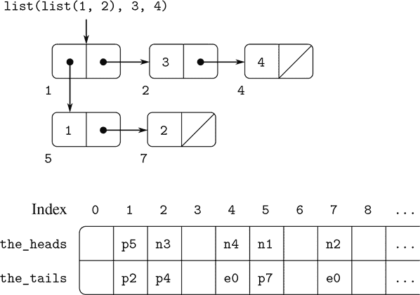

图 5.14 列表`list(list(1, 2), 3, 4)`的盒式图和内存向量表示。

例如，指向数字的指针，比如`n4`，可能由一个指示数字数据的类型和数字 4 的实际表示组成。为了处理无法在单个指针分配的固定空间中表示的太大的数字，我们可以使用一个不同的*bignum*数据类型，其中指针指定一个列表，其中存储了数字的各个部分。

一个字符串可以被表示为一个类型化的指针，该指针指定了形成字符串打印表示的字符序列。当解析器遇到字符串文字时，它构造这样一个序列，字符串连接运算符`+`和诸如`stringify`之类的字符串生成原始函数也构造这样一个序列。由于我们希望两个字符串实例被`===`识别为“相同”的字符串，并且我们希望`===`是指针相等的简单测试，我们必须确保如果系统两次看到相同的字符串，它将使用相同的指针（指向相同的字符序列）来表示这两个实例。为了实现这一点，系统维护一个称为*字符串池*的表，其中包含它曾经遇到的所有字符串。当系统即将构造一个字符串时，它会检查字符串池，看看它以前是否见过相同的字符串。如果没有，它会构造一个新的字符串（指向新的字符序列的类型化指针）并将这个指针输入字符串池。如果系统以前见过这个字符串，它会返回字符串池中存储的字符串指针。这个用唯一指针替换字符串的过程称为*字符串国际化*。

##### 实现原始列表操作

根据上述表示方案，我们可以用一个或多个原始向量操作替换寄存器机器的每个“原始”列表操作。我们将使用两个寄存器`the_heads`和`the_tails`来标识内存向量，并假设`vector_ref`和`vector_set`可用作原始操作。我们还假设指针的数值操作（例如递增指针，使用对指针索引向量，或者将两个数字相加）仅使用类型指针的索引部分。

例如，我们可以使一个寄存器机器支持以下指令

```js
assign(reg[1], list(op("head"), reg(reg[2])))

assign(reg[1], list(op("tail"), reg(reg[2])))
```

如果我们分别实现这些，作为

```js
assign(reg[1], list(op("vector_ref"), reg("the_heads"), reg(reg[2])))

assign(reg[1], list(op("vector_ref"), reg("the_tails"), reg(reg[2])))
```

指令

```js
perform(list(op("set_head"), reg(reg[1]), reg(reg[2])))

perform(list(op("set_tail"), reg(reg[1]), reg(reg[2])))
```

被实现为

```js
perform(list(op("vector_set"), reg("the_heads"), reg(reg[1]), reg(reg[2])))

perform(list(op("vector_set"), reg("the_tails"), reg(reg[1]), reg(reg[2])))
```

`pair`操作通过分配一个未使用的索引并将`pair`的参数存储在该索引向量位置的`the_heads`和`the_tails`中来执行。我们假设有一个特殊的寄存器`free`，它始终保存一个包含下一个可用索引的对指针，并且我们可以递增该指针的索引部分以找到下一个空闲位置。¹² 例如，指令

```js
assign(reg[1], list(op("pair"), reg(reg[2]), reg(reg[3])))
```

被实现为以下向量操作的序列：¹³

```js
perform(list(op("vector_set"),
             reg("the_heads"), reg("free"), reg(reg[2]))),
perform(list(op("vector_set"),
             reg("the_tails"), reg("free"), reg(reg[3]))),
assign(reg[1], reg("free")),
assign("free", list(op("+"), reg("free"), constant(1)))
```

`===`操作

```js
list(op("==="), reg(reg[1]), reg(reg[2]))
```

简单地测试寄存器中所有字段的相等性，而诸如`is_pair`、`is_null`、`is_string`和`is_number`之类的谓词只需要检查类型字段。

##### 实现堆栈

尽管我们的寄存器机器使用堆栈，但在这里我们不需要做任何特殊处理，因为堆栈可以用列表来建模。堆栈可以是由特殊寄存器`the_stack`指向的保存值的列表。因此，`save(`reg`)`可以被实现为

```js
assign("the_stack", list(op("pair"), reg(reg), reg("the_stack")))
```

同样，`restore(`reg`)`可以被实现为

```js
assign(reg, list(op("head"), reg("the_stack")))
assign("the_stack", list(op("tail"), reg("the_stack")))
```

和`perform(list(op("initialize_stack")))`可以被实现为

```js
assign("the_stack", constant(null))
```

这些操作可以进一步扩展为上述的向量操作。然而，在传统的计算机体系结构中，通常有利于将堆栈分配为单独的向量。然后，通过增加或减少对该向量的索引来推送和弹出堆栈。

##### 练习 5.19

绘制盒子和指针表示以及由以下列表结构产生的内存向量表示（如图 5.14 中所示）。

```js
const x = pair(1, 2);
const y = list(x, x);
```

初始情况下，`free`指针为`p1`。`free`的最终值是多少？哪些指针代表了`x`和`y`的值？

##### 练习 5.20

为以下函数实现寄存器机器。假设列表结构内存操作可用作机器原语。

1.  a. 递归`count_leaves`：

    ```js
    function count_leaves(tree) {
        return is_null(tree)
               ? 0
               : ! is_pair(tree)
               ? 1
               : count_leaves(head(tree)) +
                 count_leaves(tail(tree));
    }
    ```

1.  b. 递归`count_leaves`并带有显式计数器：

    ```js
    function count_leaves(tree) {
        function count_iter(tree, n) {
        return is_null(tree)
                   ? n
                   : ! is_pair(tree)
                   ? n + 1
                   : count_iter(tail(tree),
                                count_iter(head(tree), n));
        }
        return count_iter(tree, 0);
    }
    ```

##### 练习 5.21

3.3.1 节的练习 3.12 提出了一个`append`函数，它将两个列表连接起来形成一个新列表，以及一个`append_mutator`函数，它将两个列表拼接在一起。设计一个寄存器机器来实现这些函数。假设列表结构内存操作可用作原始操作。

### 5.3.2 维持内存无限的幻觉

5.3.1 节中概述的表示方法解决了实现列表结构的问题，前提是我们有无限的内存。在真实的计算机中，我们最终会耗尽用于构造新对的空间。¹⁴ 然而，在典型计算中生成的大多数对仅用于保存中间结果。在访问这些结果之后，这些对将不再需要——它们是*垃圾*。例如，计算

```js
accumulate((x, y) => x + y,
           0,
           filter(is_odd, enumerate_interval(0, n)))
```

构造两个列表：枚举和过滤枚举的结果。当累积完成时，这些列表将不再需要，并且分配的内存可以被回收。如果我们可以安排定期收集所有的垃圾，并且如果这样做以大约与我们构造新对的速度相同的速度回收内存，我们将保留内存无限的幻觉。

为了回收对，我们必须有一种方法来确定哪些分配的对不再需要（即它们的内容不再能影响计算的未来）。我们将研究用于实现这一点的方法称为*垃圾收集*。垃圾收集基于这样的观察：在基于列表结构的内存的解释中的任何时刻，只有可以通过从当前机器寄存器中的指针开始的一系列`head`和`tail`操作到达的对象才能影响计算的未来。任何不可访问的内存单元都可以被回收。 ¹⁵

执行垃圾收集有许多方法。我们将在这里研究的方法称为*停止-复制*。基本思想是将内存分为两半：“工作内存”和“空闲内存”。当`pair`构造成对时，它们被分配在工作内存中。当工作内存满时，我们通过定位工作内存中所有有用的对并将其复制到空闲内存中来执行垃圾收集。（通过跟踪所有`head`和`tail`指针来定位有用的对，从机器寄存器开始。）由于我们不复制垃圾，所以可能会有额外的空闲内存，我们可以用来分配新的对。此外，工作内存中的任何内容都不再需要，因为其中的所有有用对都已经被复制。因此，如果我们交换工作内存和空闲内存的角色，我们可以继续处理；新的对将在新的工作内存中（原来的空闲内存）分配。当这个满了，我们可以将有用的对复制到新的空闲内存中（原来的工作内存）。

##### 实现停止-复制垃圾收集器

现在我们使用寄存器机器语言更详细地描述停止-复制算法。我们假设有一个名为`root`的寄存器，其中包含一个指向最终指向所有可访问数据的结构的指针。这可以通过在开始垃圾收集之前将所有机器寄存器的内容存储在由`root`指向的预分配列表中来安排。我们还假设，除了当前的工作内存之外，还有可用的空闲内存，我们可以将有用的数据复制到其中。当前的工作内存由基地址在名为`the_heads`和`the_tails`的寄存器中的向量组成，而空闲内存在名为`new_heads`和`new_tails`的寄存器中。

当我们耗尽当前工作内存中的空闲单元时，也就是说，当`pair`操作尝试将`free`指针增加到内存向量的末尾之外时，垃圾收集就会被触发。当垃圾收集过程完成时，`root`指针将指向新的内存，从`root`可访问的所有对象都将被移动到新的内存中，`free`指针将指示新内存中可以分配新对的下一个位置。此外，工作内存和新内存的角色将被交换-新的对将在新的内存中构造，从`free`指示的位置开始，而（之前的）工作内存将作为下一次垃圾收集的新内存可用。图 5.15 显示了垃圾收集前后内存的布局。

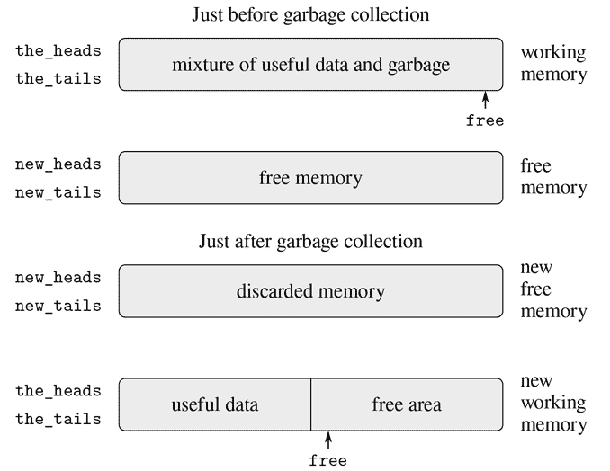

图 5.15 垃圾收集过程中内存的重新配置。

垃圾收集过程的状态由维护两个指针来控制：`free`和`scan`。它们被初始化为指向新内存的开始。算法从将`root`指向的一对重新定位到新内存的开始。复制这对，调整`root`指针指向新位置，并递增`free`指针。此外，标记这对的旧位置以显示其内容已被移动。标记的方法如下：在“头”位置，我们放置一个特殊标记，表示这是一个已经移动的对象（这样的对象传统上被称为*破碎的心*）。在“尾”位置，我们放置一个*转发地址*，指向对象已被移动的位置。

搬迁根节点后，垃圾收集器进入基本循环。算法的每一步中，“扫描”指针（最初指向已搬迁的根节点）指向一个已移动到新内存中的一对，但其“头”和“尾”指针仍指向旧内存中的对象。这些对象都被重新定位，然后“扫描”指针递增。要重新定位一个对象（例如，我们正在扫描的一对中由“头”指针指示的对象），我们检查对象是否已经被移动（由对象的“头”位置上的破碎心标记表示）。如果对象尚未被移动，我们将其复制到`free`指示的位置，更新`free`，在对象的旧位置设置一个破碎的心，并更新指向对象的指针（在这个例子中，我们正在扫描的一对的“头”指针）指向新位置。如果对象已经被移动，其转发地址（在破碎心的“尾”位置找到）将替换正在扫描的一对中的指针。最终，所有可访问的对象都将被移动和扫描，此时“扫描”指针将超过`free`指针，进程将终止。

我们可以将停止-复制算法指定为寄存器机器的一系列指令。重新定位对象的基本步骤是通过一个名为`relocate_old_result_in_new`的子例程来完成的。这个子例程从一个名为`old`的寄存器中获取其参数，即要重新定位的对象的指针。它重新定位指定的对象（在此过程中递增`free`），将指向重新定位对象的指针放入一个名为`new`的寄存器中，并通过跳转到存储在寄存器`relocate_continue`中的入口点返回。要开始垃圾收集，我们调用这个子例程来重新定位`root`指针，然后初始化`free`和`scan`。当`root`的重新定位完成后，我们将新指针安装为新的`root`，并进入垃圾收集器的主循环。

```js
"begin_garbage_collection",
  assign("free", constant(0)),
  assign("scan", constant(0)),
  assign("old", reg("root")),
  assign("relocate_continue", label("reassign_root")),
  go_to(label("relocate_old_result_in_new")),
"reassign_root",
  assign("root", reg("new")),
  go_to(label("gc_loop")),
```

在垃圾收集器的主循环中，我们必须确定是否还有更多的对象需要扫描。我们通过测试`scan`指针是否与`free`指针重合来做到这一点。如果指针相等，则所有可访问的对象都已经被重新定位，我们将跳转到`gc_flip`，清理一切，以便我们可以继续中断的计算。如果仍有要扫描的一对，我们调用重新定位子例程来重新定位下一对的“头”（将“头”指针放入`old`中）。设置`relocate_continue`寄存器，以便子例程将返回更新“头”指针。

```js
"gc_loop",
  test(list(op("==="), reg("scan"), reg("free"))),
  branch(label("gc_flip")),
  assign("old", list(op("vector_ref"), reg("new_heads"), reg("scan"))),
  assign("relocate_continue", label("update_head")),
  go_to(label("relocate_old_result_in_new")),
```

在`update_head`中，我们修改正在扫描的一对的“头”指针，然后继续重新定位“尾”。当重新定位和更新“尾”完成后，我们完成了扫描该对，因此我们继续进行主循环。

```js
"update_head",
  perform(list(op("vector_set"),
               reg("new_heads"), reg("scan"), reg("new"))),
  assign("old", list(op("vector_ref"),
                     reg("new_tails"), reg("scan"))),
  assign("relocate_continue", label("update_tail")),
  go_to(label("relocate_old_result_in_new")),
"update_tail",
  perform(list(op("vector_set"),
               reg("new_tails"), reg("scan"), reg("new"))),
  assign("scan", list(op("+"), reg("scan"), constant(1))),
  go_to(label("gc_loop")),
```

子例程`relocate_old_result_in_new`的重定位对象如下：如果要重定位的对象（由`old`指向）不是一对，那么我们将返回指向对象的相同指针（在`new`中不变）。（例如，我们可能正在扫描一个`head`为数字 4 的对。如果我们按照第 5.3.1 节中描述的方式将`head`表示为`n4`，那么我们希望“重定位”的`head`指针仍然是`n4`。）否则，我们必须执行重定位。如果要重定位的对的`head`位置包含一个破碎心标记，那么该对实际上已经被移动，因此我们从破碎心的`tail`位置检索转发地址，并将其返回到`new`中。如果`old`中的指针指向尚未移动的对，则我们将该对移动到新内存中的第一个空闲单元（由`free`指向），并通过在旧位置存储破碎心标记和转发地址来设置破碎心。子例程`relocate_old_result_in_new`使用寄存器`oldht`来保存由`old`指向的对象的`head`或`tail`。¹⁹

```js
"relocate_old_result_in_new",
  test(list(op("is_pointer_to_pair"), reg("old"))),
  branch(label("pair")),
  assign("new", reg("old")),
  go_to(reg("relocate_continue")),
"pair",
  assign("oldht", list(op("vector_ref"),
                       reg("the_heads"), reg("old"))),
  test(list(op("is_broken_heart"), reg("oldht"))),
  branch(label("already_moved")),
  assign("new", reg("free")),     // new location for pair
  // Update free pointer
  assign("free", list(op("+"), reg("free"), constant(1))),
  // Copy the head and tail to new memory
  perform(list(op("vector_set"),
               reg("new_heads"), reg("new"),
               reg("oldht"))),
  assign("oldht", list(op("vector_ref"),
                      reg("the_tails"), reg("old"))),
  perform(list(op("vector_set"),
               reg("new_tails"), reg("new"),
               reg("oldht"))),
  // Construct the broken heart
  perform(list(op("vector_set"),
               reg("the_heads"), reg("old"),
               constant("broken_heart"))),
  perform(list(op("vector_set"),
               reg("the_tails"), reg("old"),
               reg("new"))),
  go_to(reg("relocate_continue")),
"already_moved",
  assign("new", list(op("vector_ref"),
                     reg("the_tails"), reg("old"))),
  go_to(reg("relocate_continue")),
```

在垃圾收集过程的最后，我们通过交换指针来交换旧内存和新内存的角色：交换`the_heads`和`new_heads`，以及`the_tails`和`new_tails`。然后，我们将准备好在内存耗尽时执行另一次垃圾收集。

```js
"gc_flip",
  assign("temp", reg("the_tails")),
  assign("the_tails", reg("new_tails")),
  assign("new_tails", reg("temp")),
  assign("temp", reg("the_heads")),
  assign("the_heads", reg("new_heads")),
  assign("new_heads", reg("temp"))
```

## 5.4 显式控制求值器

在第 5.1 节中，我们看到如何将简单的 JavaScript 程序转换为寄存器机器的描述。我们现在将对更复杂的程序执行此转换，即第 4.1.1–4.1.4 节中的元循环求值器，该程序展示了如何用`evaluate`和`apply`函数描述 JavaScript 解释器的行为。本节中开发的*显式控制求值器*展示了在求值过程中使用的基础函数调用和参数传递机制如何可以用寄存器和堆栈上的操作来描述。此外，显式控制求值器可以作为 JavaScript 解释器的实现，用一种非常类似于传统计算机的本机机器语言编写。求值器可以由第 5.2 节的寄存器机器模拟器执行。或者，它可以用作构建 JavaScript 求值器的机器语言实现的起点，甚至是用于求值 JavaScript 程序的专用机器的起点。图 5.16 展示了这样一个硬件实现：一个硅片作为 Scheme 的求值器，该语言在本书的原版中代替了 JavaScript。芯片设计者从与本节描述的求值器类似的寄存器机器的数据路径和控制器规格开始，并使用设计自动化程序构建集成电路布局。²⁰

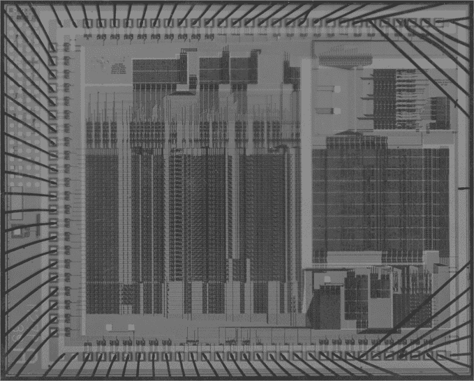

图 5.16 Scheme 求值器的硅片实现。

##### 寄存器和操作

在设计显式控制求值器时，我们必须指定在我们的寄存器机器中使用的操作。我们描述了元循环求值器，使用诸如`is_literal`和`make_function`之类的函数来描述抽象语法。在实现寄存器机器时，我们可以将这些函数扩展为基本的列表结构内存操作的序列，并在我们的寄存器机器上实现这些操作。然而，这将使我们的求值器非常冗长，使基本结构被细节所遮盖。为了阐明表述，我们将在寄存器机器的原始操作中包括第 4.1.2 节中给出的语法函数和第 4.1.3 和 4.1.4 节中给出的表示环境和其他运行时数据的函数。为了完全指定一个可以在低级机器语言中编程或在硬件中实现的求值器，我们将用更基本的操作替换这些操作，使用我们在第 5.3 节中描述的列表结构实现。

我们的 JavaScript 求值器寄存器机器包括一个堆栈和七个寄存器：`comp`、`env`、`val`、`continue`、`fun`、`argl`和`unev`。`comp`寄存器用于保存要求值的组件，`env`包含要执行求值的环境。在求值结束时，`val`包含在指定环境中求值组件获得的值。`continue`寄存器用于实现递归，如第 5.1.4 节中所述。（求值器需要递归调用自身，因为求值一个组件需要求值其子组件。）`fun`、`argl`和`unev`寄存器用于求值函数应用。

我们不会提供数据路径图来显示求值器的寄存器和操作如何连接，也不会提供完整的机器操作列表。这些都隐含在求值器的控制器中，将会详细介绍。

### 5.4.1 调度程序和基本求值

求值器中的中心元素是从`eval_dispatch`开始的指令序列。这对应于第 4.1.1 节中描述的元循环求值器的`evaluate`函数。当控制器从`eval_dispatch`开始时，它在由`env`指定的环境中求值由`comp`指定的组件。求值完成后，控制器将转到存储在`continue`中的入口点，而`val`寄存器将保存组件的值。与元循环的`evaluate`一样，`eval_dispatch`的结构是对待求值组件的语法类型的情况分析。

```js
"eval_dispatch",
  test(list(op("is_literal"), reg("comp"))),
  branch(label("ev_literal")),
  test(list(op("is_name"), reg("comp"))),
  branch(label("ev_name")),
  test(list(op("is_application"), reg("comp"))),
  branch(label("ev_application")),
  test(list(op("is_operator_combination"), reg("comp"))),
  branch(label("ev_operator_combination")),
  test(list(op("is_conditional"), reg("comp"))),
  branch(label("ev_conditional")),
  test(list(op("is_lambda_expression"), reg("comp"))),
  branch(label("ev_lambda")),
  test(list(op("is_sequence"), reg("comp"))),
  branch(label("ev_sequence")),
  test(list(op("is_block"), reg("comp"))),
  branch(label("ev_block")),
  test(list(op("is_return_statement"), reg("comp"))),
  branch(label("ev_return")),
  test(list(op("is_function_declaration"), reg("comp"))),
  branch(label("ev_function_declaration")),
  test(list(op("is_declaration"), reg("comp"))),
  branch(label("ev_declaration")),
  test(list(op("is_assignment"), reg("comp"))),
  branch(label("ev_assignment")),
  go_to(label("unknown_component_type")),
```

##### 求值简单表达式

数字和字符串、名称和 lambda 表达式没有要求值的子表达式。对于这些情况，求值器只需将正确的值放入`val`寄存器中，并在`continue`指定的入口点继续执行。简单表达式的求值由以下控制器代码执行：

```js
"ev_literal",
  assign("val", list(op("literal_value"), reg("comp"))),
  go_to(reg("continue")),
"ev_name",
  assign("val", list(op("symbol_of_name"), reg("comp"), reg("env"))),
  assign("val", list(op("lookup_symbol_value"),
                     reg("val"), reg("env"))),
  go_to(reg("continue")),
"ev_lambda",
  assign("unev", list(op("lambda_parameter_symbols"), reg("comp"))),
  assign("comp", list(op("lambda_body"), reg("comp"))),
  assign("val", list(op("make_function"),
                     reg("unev"), reg("comp"), reg("env"))),
  go_to(reg("continue")),
```

观察`ev_lambda`如何使用`unev`和`comp`寄存器来保存 lambda 表达式的参数和主体，以便它们可以与`env`中的环境一起传递给`make_function`操作。

##### 条件句

与元循环求值器一样，语法形式通过选择性地求值组件的片段来处理。对于条件句，我们必须求值谓词，并根据谓词的值决定是求值结果还是替代方案。

在求值谓词之前，我们保存条件本身，即在`comp`中，以便稍后提取结果或替代项。为了求值谓词表达式，我们将其移动到`comp`寄存器中并转到`eval_dispatch`。`env`寄存器中的环境已经是正确的环境，用于求值谓词。但是，我们保存`env`，因为稍后我们将需要它来求值结果或替代项。我们设置`continue`，以便在求值完谓词后在`ev_conditional_decide`处恢复求值。然而，首先我们保存`continue`的旧值，因为稍后我们需要它来返回到等待条件值的语句的求值。

```js
"ev_conditional",
  save("comp"), // save conditional for later
save("env"),
save("continue"),
assign("continue", label("ev_conditional_decide")),
assign("comp", list(op("conditional_predicate"), reg("comp"))),
  go_to(label("eval_dispatch")), // evaluate the predicate
```

在求值谓词后，在`ev_conditional_decide`处恢复时，我们测试它是真还是假，并根据结果在转到`eval_dispatch`之前将结果或替代项放在`comp`中。请注意，这里恢复`env`和`continue`设置了`eval_dispatch`具有正确的环境，并在正确的位置继续接收条件的值。

```js
"ev_conditional_decide",
  restore("continue"),
  restore("env"),
  restore("comp"),
  test(list(op("is_falsy"), reg("val"))),
  branch(label("ev_conditional_alternative")),
"ev_conditional_consequent",
  assign("comp", list(op("conditional_consequent"), reg("comp"))),
  go_to(label("eval_dispatch")),
"ev_conditional_alternative",
  assign("comp", list(op("conditional_alternative"), reg("comp"))),
  go_to(label("eval_dispatch")),
```

##### 序列求值

显式控制求值器中从`ev_sequence`开始处理语句序列的部分类似于元循环求值器的`eval_ sequence`函数。

`ev_sequence_next`和`ev_sequence_continue`处的条目形成一个循环，依次求值序列中的每个语句。未求值语句的列表保存在`unev`中。在`ev_sequence`处，我们将要求值的语句序列放在`unev`中。如果序列为空，我们将`val`设置为`undefined`，并通过`ev_sequence_empty`跳转到`continue`。否则，我们开始序列求值循环，首先在堆栈上保存`continue`的值，因为`continue`寄存器将用于循环中的局部控制流，原始值在语句序列之后继续时是需要的。在求值每个语句之前，我们检查序列中是否有其他语句需要求值。如果有，我们保存未求值语句的其余部分（保存在`unev`中）和必须求值这些语句的环境（保存在`env`中），并调用`eval_dispatch`来求值已放置在`comp`中的语句。在此求值后，这两个保存的寄存器在`ev_sequence_continue`处被恢复。

该序列中的最终语句在入口点`ev_sequence_last_statement`处以不同的方式处理。由于在此之后没有更多的语句需要求值，因此在转到`eval_dispatch`之前，我们不需要保存`unev`或`env`。整个序列的值是最后一个语句的值，因此在求值最后一个语句之后，除了继续保存在`ev_sequence`处保存的入口点外，没有其他事情要做。我们不是设置`continue`以安排`eval_dispatch`返回到这里，然后从堆栈中恢复`continue`并在该入口点继续，而是在转到`eval_dispatch`之前从堆栈中恢复`continue`，以便`eval_dispatch`在求值语句后继续在该入口点继续。

```js
"ev_sequence",
  assign("unev", list(op("sequence_statements"), reg("comp"))),
  test(list(op("is_empty_sequence"), reg("unev"))),
  branch(label("ev_sequence_empty")),
  save("continue"),
"ev_sequence_next",
  assign("comp", list(op("first_statement"), reg("unev"))),
  test(list(op("is_last_statement"), reg("unev"))),
  branch(label("ev_sequence_last_statement")),
  save("unev"),
  save("env"),
  assign("continue", label("ev_sequence_continue")),
  go_to(label("eval_dispatch")),
"ev_sequence_continue",
  restore("env"),
  restore("unev"),
  assign("unev", list(op("rest_statements"), reg("unev"))),
  go_to(label("ev_sequence_next")),
"ev_sequence_last_statement",
  restore("continue"),
  go_to(label("eval_dispatch")),

"ev_sequence_empty",
  assign("val", constant(undefined)),
  go_to(reg("continue")),
```

与元循环求值器中的`eval_sequence`不同，`ev_sequence`不需要检查是否求值了返回语句以终止序列求值。这个求值器中的“显式控制”允许返回语句直接跳转到当前函数应用的继续部分，而不是恢复序列求值。因此，序列求值不需要关心返回，甚至不需要知道语言中返回语句的存在。因为返回语句跳出了序列求值代码，所以在`ev_sequence_continue`处保存的寄存器的恢复不会被执行。稍后我们将看到返回语句如何从堆栈中移除这些值。

### 5.4.2 求值函数应用

函数应用由包含函数表达式和参数表达式的组合指定。函数表达式是一个值为函数的子表达式，参数表达式是值为应用函数的参数的子表达式。元循环`evaluate`通过递归调用自身来处理应用，以求值组合的每个元素，然后将结果传递给`apply`，执行实际的函数应用。显式控制求值器也是这样做的；这些递归调用是通过`go_to`指令实现的，同时使用堆栈保存寄存器，在递归调用返回后将被恢复。在每次调用之前，我们将小心地确定哪些寄存器必须被保存（因为它们的值稍后将被需要）²³

与元循环求值器一样，操作符组合被转换为对应于操作符的原始函数的应用。这发生在`ev_operator_combination`中，在这里在`comp`中进行了转换，并且通过到`ev_application`的下降。²⁴

我们通过求值函数表达式开始应用的求值，以产生一个函数，稍后将应用于求值的参数表达式。为了求值函数表达式，我们将其移动到`comp`寄存器中，并转到`eval_dispatch`。`env`寄存器中的环境已经是正确的环境，用于求值函数表达式。但是，我们保存`env`，因为稍后我们将需要它来求值参数表达式。我们还将参数表达式提取到`unev`中，并将其保存在堆栈上。我们设置`continue`，以便`eval_dispatch`在函数表达式求值后将在`ev_appl_did_function_expression`处恢复。但首先，我们保存`continue`的旧值，告诉控制器在应用后继续的位置。

```js
"ev_operator_combination",
  assign("comp", list(op("operator_combination_to_application"),
                      reg("comp"), reg("env"))),
"ev_application",
  save("continue"),
  save("env"),
  assign("unev", list(op("arg_expressions"), reg("comp"))),
  save("unev"),
  assign("comp", list(op("function_expression"), reg("comp"))),
  assign("continue", label("ev_appl_did_function_expression")),
  go_to(label("eval_dispatch")),
```

从求值函数表达式返回后，我们继续求值应用的参数表达式，并将结果参数累积到`argl`中的列表中。（这类似于求值一系列语句，只是我们收集值。）首先，我们恢复未求值的参数表达式和环境。我们将`argl`初始化为空列表。然后，我们将由求值函数表达式产生的函数分配给`fun`寄存器。如果没有参数表达式，我们直接转到`apply_dispatch`。否则，我们在堆栈上保存`fun`并开始参数求值循环：²⁵

```js
"ev_appl_did_function_expression",
  restore("unev"), // the argument expressions
  restore("env"),
  assign("argl", list(op("empty_arglist"))),
  assign("fun", reg("val")), // the function
  test(list(op("is_null"), reg("unev"))),
  branch(label("apply_dispatch")),
  save("fun"),
```

参数求值循环的每个周期从`unev`中的列表中求值一个参数表达式，并将结果累积到`argl`中。为了求值参数表达式，我们将其放入`comp`寄存器中，并转到`eval_dispatch`，然后设置`continue`，以便执行将在参数累积阶段恢复。但首先，我们保存到目前为止累积的参数（保存在`argl`中），环境（保存在`env`中），以及要求值的剩余参数表达式（保存在`unev`中）。对于最后一个参数表达式的求值，特殊情况在`ev_appl_last_arg`中处理。

```js
"ev_appl_argument_expression_loop",
  save("argl"),
  assign("comp", list(op("head"), reg("unev"))),
  test(list(op("is_last_argument_expression"), reg("unev"))),
  branch(label("ev_appl_last_arg")),
  save("env"),
  save("unev"),
  assign("continue", label("ev_appl_accumulate_arg")),
  go_to(label("eval_dispatch")),
```

当参数表达式被求值后，值被累积到`argl`中的列表中。然后，参数表达式从`unev`中的未求值参数表达式列表中移除，并且参数求值循环继续。

```js
"ev_appl_accumulate_arg",
  restore("unev"),
  restore("env"),
  restore("argl"),
  assign("argl", list(op("adjoin_arg"), reg("val"), reg("argl"))),
  assign("unev", list(op("tail"), reg("unev"))),
  go_to(label("ev_appl_argument_expression_loop")),
```

最后一个参数表达式的求值处理方式不同，序列中的最后一个语句也是如此。在去往`eval_dispatch`之前，没有必要保存环境或未求值的参数表达式列表，因为在求值最后一个参数表达式后将不再需要它们。因此，我们从求值返回到一个特殊的入口点`ev_appl_accum_last_arg`，它恢复参数列表，累积新的参数，恢复保存的函数，并进行应用。

```js
"ev_appl_last_arg",
  assign("continue", label("ev_appl_accum_last_arg")),
  go_to(label("eval_dispatch")),
"ev_appl_accum_last_arg",
  restore("argl"),
  assign("argl", list(op("adjoin_arg"), reg("val"), reg("argl"))),
  restore("fun"),
  go_to(label("apply_dispatch")),
```

参数求值循环的细节决定了解释器求值组合的参数表达式的顺序（例如，从左到右或从右到左—参见练习 3.8）。这个顺序不是由元循环求值器确定的，元循环求值器从其实现的底层 JavaScript 继承其控制结构。因为我们在`ev_appl_argument_expression_loop`中使用`head`来从`unev`中提取连续的参数表达式，并在`ev_appl_accumulate_arg`中使用`tail`来提取其余的参数表达式，显式控制求值器将按照 ECMAScript 规范要求，按照从左到右的顺序求值组合的参数表达式。

##### 函数应用

入口点`apply_dispatch`对应于元循环求值器的`apply`函数。当我们到达`apply_dispatch`时，`fun`寄存器包含要应用的函数，`argl`包含要应用的已求值参数的列表。保存的`continue`值（最初传递给`eval_dispatch`并保存在`ev_application`处），告诉在函数应用的结果返回到哪里，存储在堆栈上。应用完成后，控制器转移到由保存的`continue`指定的入口点，带有应用的结果在`val`中。与元循环的`apply`一样，有两种情况需要考虑。要么要应用的函数是原始的，要么是复合函数。

```js
"apply_dispatch",
  test(list(op("is_primitive_function"), reg("fun"))),
  branch(label("primitive_apply")),
  test(list(op("is_compound_function"), reg("fun"))),
  branch(label("compound_apply")),
  go_to(label("unknown_function_type")),
```

我们假设每个原始函数都是这样实现的，以便从`argl`中获取其参数并将其结果放入`val`中。要指定机器如何处理原始函数，我们需要提供一系列控制器指令来实现每个原始函数，并安排`primitive_apply`分派到由`fun`的内容标识的原始函数的指令。由于我们对求值过程的结构感兴趣，而不是原始函数的细节，因此我们将使用一个`apply_primitive_function`操作，将`fun`中的函数应用于`argl`中的参数。为了模拟 5.2 节中的模拟器的求值器，我们使用`apply_primitive_function`函数，它调用底层的 JavaScript 系统来执行应用，就像我们在 4.1.1 节中对元循环求值器所做的那样。计算出原始应用的值后，我们恢复`continue`并转到指定的入口点。

```js
"primitive_apply",
  assign("val", list(op("apply_primitive_function"),
                     reg("fun"), reg("argl"))),
  restore("continue"),
  go_to(reg("continue")),
```

标记为`compound_apply`的指令序列指定了复合函数的应用。要应用复合函数，我们以类似于元循环求值器的方式进行。我们构造一个框架，将函数的参数绑定到参数，使用这个框架来扩展函数携带的环境，并在这个扩展的环境中求值函数的主体。

此时，复合函数在寄存器`fun`中，其参数在`argl`中。我们将函数的参数提取到`unev`中，将其环境提取到`env`中。然后我们用扩展参数绑定的环境构造的环境替换`env`中的环境。然后我们将函数的主体提取到`comp`中。自然的下一步将是恢复保存的`continue`并继续到`eval_dispatch`来求值主体，并在`val`中使用结果继续到恢复的延续，就像对序列的最后一个语句所做的那样。但是有一个复杂性！

这个复杂性有两个方面。一方面，在函数体的求值过程中的任何时刻，返回语句可能需要函数返回返回表达式的值作为函数体的值。但是，返回语句可能在函数体中嵌套任意深，因此在遇到返回语句的时刻的堆栈不一定是从函数返回所需的堆栈。调整堆栈以进行返回的一种方法是在堆栈上放置一个*标记*，可以被返回代码找到。这是通过`push_marker_to_stack`指令实现的。然后返回代码可以使用`revert_stack_to_marker`指令将堆栈恢复到标记指示的位置，然后求值返回表达式。

复杂性的另一个方面是，如果函数体的求值在不执行返回语句的情况下终止，函数体的值必须是`undefined`。为了处理这个问题，我们设置`continue`寄存器指向`return_undefined`的入口点，然后去`eval_dispatch`求值函数体。如果在函数体的求值过程中没有遇到返回语句，函数体的求值将继续在`return_undefined`处。

```js
"compound_apply",
  assign("unev", list(op("function_parameters"), reg("fun"))),
  assign("env", list(op("function_environment"), reg("fun"))),
  assign("env", list(op("extend_environment"),
                     reg("unev"), reg("argl"), reg("env"))),
  assign("comp", list(op("function_body"), reg("fun"))),
  push_marker_to_stack(),
  assign("continue", label("return_undefined")),
  go_to(label("eval_dispatch")),
```

解释器中`env`寄存器被赋予新值的唯一地方是`compound_apply`和`ev_block`（5.4.3 节）。就像在元循环求值器中一样，用于求值函数体的新环境是从函数携带的环境中构建的，以及参数列表和相应的名称绑定列表。

当在`ev_return`处求值返回语句时，我们使用`revert_stack_` `to_marker`指令将堆栈恢复到函数调用开始时的状态，通过从堆栈中删除所有值直到包括标记。因此，`restore("continue")`将恢复函数调用的延续，这是在`ev_application`处保存的。然后我们继续求值返回表达式，其结果将放入`val`中，因此在继续求值返回表达式后返回函数时的值。

```js
"ev_return",
  revert_stack_to_marker(),
  restore("continue"),
  assign("comp", list(op("return_expression"), reg("comp"))),
  go_to(label("eval_dispatch")),
```

如果在函数体的求值过程中没有遇到返回语句，求值将继续在`return_undefined`处，这是在`compound_apply`中设置的延续。为了从函数中返回`undefined`，我们将`undefined`放入`val`中，并转到在`ev_application`中放入堆栈的入口点。然而，在我们可以从堆栈中恢复该延续之前，我们必须删除在`compound_apply`保存的标记。

```js
"return_undefined",
  revert_stack_to_marker(),
  restore("continue"),
  assign("val", constant(undefined)),
  go_to(reg("continue")),
```

##### 返回语句和尾递归

在第 1 章中，我们说过，由函数描述的过程如下

```js
function sqrt_iter(guess, x) {
    return is_good_enough(guess, x)
           ? guess
           : sqrt_iter(improve(guess, x), x);
}
```

这是一个迭代过程。即使函数在语法上是递归的（以自身定义），但从一个调用`sqrt_iter`到下一个调用时，逻辑上并不需要求值器保存信息。一个求值器可以执行`sqrt_iter`这样的函数，而不需要在函数继续调用自身时增加存储空间，这被称为*尾递归*求值器。

第 4 章中求值器的元循环实现不是尾递归的。它将返回语句实现为返回值对象的构造函数，该对象包含要返回的值，并检查函数调用的结果是否是这样的对象。如果函数体的求值产生一个返回值对象，则函数的返回值是该对象的内容；否则，返回值是`undefined`。返回值对象的构造和最终对函数调用结果的检查都是延迟操作，这导致堆栈上的信息积累。

我们的显式控制求值器是尾递归的，因为它不需要包装返回值以进行检查，从而避免了由延迟操作导致的堆栈积累。在`ev_return`中，为了求值计算函数返回值的表达式，我们直接转移到`eval_dispatch`，堆栈上除了函数调用之前的内容之外没有其他东西。我们通过使用`revert_stack_to_marker`来撤销函数对堆栈的任何保存（因为我们正在返回），从而实现这一点。然后，我们在转到`eval_dispatch`之前从堆栈中恢复`continue`，而不是安排`eval_dispatch`在这里返回，然后从堆栈中恢复`continue`并在该入口点继续。这样，`eval_dispatch`在求值表达式后将在该入口点继续。最后，我们转移到`eval_dispatch`而不在堆栈上保存任何信息。因此，当我们继续求值返回表达式时，堆栈与我们即将计算其返回值的函数调用之前的堆栈相同。因此，求值返回表达式——即使它是一个函数调用（如`sqrt_iter`中的情况，其中条件表达式简化为对`sqrt_iter`的调用）——都不会导致堆栈上积累任何信息。³⁰

如果我们没有考虑到不需要在求值返回表达式时保留堆栈上的无用信息，我们可能会采取直接的方法来求值返回表达式，然后回来恢复堆栈，并最终在等待函数调用结果的入口点继续：

```js
"ev_return",  // alternative implementation: not tail-recursive
  assign("comp", list(op("return_expression"), reg("comp"))),
  assign("continue", label("ev_restore_stack")),
  go_to(label("eval_dispatch")),
"ev_restore_stack",
revert_stack_to_marker(),     // undo saves in current function
restore("continue"),          // undo save at ev_application
  go_to(reg("continue")),
```

这可能看起来像是对我们以前用于求值返回语句的代码的一个微小更改：唯一的区别是，我们延迟了对堆栈中任何寄存器保存的撤销，直到返回表达式的求值之后。解释器对于任何表达式仍然会给出相同的值。但是这个改变对于尾递归实现来说是致命的，因为现在我们必须在求值返回表达式之后回来撤销（无用的）寄存器保存。这些额外的保存将在一系列函数调用中累积。因此，像`sqrt_iter`这样的过程将需要与迭代次数成比例的空间，而不是需要常量空间。这种差异可能是显著的。例如，使用尾递归，可以仅使用函数调用和返回机制来表示无限循环：

```js
function count(n) {
    display(n);
    return count(n + 1);
}
```

没有尾递归，这样的函数最终会耗尽堆栈空间，并且表达真正的迭代将需要除了函数调用之外的某种控制机制。

请注意，我们的 JavaScript 实现需要使用`return`才能实现尾递归。因为寄存器保存的撤销发生在`ev_return`，从`count`函数中删除`return`将导致最终耗尽堆栈空间。这解释了在第 4 章中无限驱动循环中使用`return`的原因。

##### 练习 5.22

解释一下，如果从`count`中删除`return`，堆栈是如何构建起来的：

```js
function count(n) {
    display(n);
    count(n + 1);
}
```

##### 练习 5.23

通过在`compound_apply`处使用`save`来实现`push_marker_to_stack`的等效操作，以在堆栈上存储特殊的标记值。在`ev_return`和`return_undefined`处实现`revert_stack_to_marker`的等效操作，作为一个循环，重复执行`restore`直到遇到标记。请注意，这将需要将值恢复到与保存时不同的寄存器。这是必要的，因为从堆栈弹出的唯一方法是通过恢复到寄存器。提示：您需要创建一个唯一的常量作为标记，例如使用`const marker = list("marker")`。因为`list`创建一个新的对，它不能与堆栈上的其他任何东西`===`。

##### 练习 5.24

按照 5.2.3 节中`save`和`restore`的实现，将`push_marker_to_stack`和`revert_stack_to_marker`实现为寄存器机器指令。添加`push_marker`和`pop_marker`函数来访问堆栈，与 5.2.1 节中`push`和`pop`的实现相呼应。请注意，您不需要实际将标记插入堆栈。相反，您可以向堆栈模型添加一个本地状态变量，以跟踪每次`push_marker_to_stack`之前的`save`的位置。如果选择将标记放在堆栈上，请参考练习 5.23 中的提示。

### 5.4.3 块、赋值和声明

##### 块

块的主体是在当前环境的基础上进行求值的，该环境通过将所有本地名称绑定到值`"unassigned"`的帧进行扩展。我们暂时利用`val`寄存器来保存块中声明的所有变量的列表，该列表是通过第 4.1.1 节中的`scan_out_declarations`获得的。假定`scan_out_declarations`和`list_of_unassigned`函数作为机器操作可用。

```js
"ev_block",
  assign("comp", list(op("block_body"), reg("comp"))),
  assign("val", list(op("scan_out_declarations"), reg("comp"))),

save("comp"), // so we can use it to temporarily hold unassigned values
  assign("comp", list(op("list_of_unassigned"), reg("val"))),
  assign("env", list(op("extend_environment"),
                     reg("val"), reg("comp"), reg("env"))),
  restore("comp"), // the block body
  go_to(label("eval_dispatch")),
```

##### 赋值和声明

赋值由`ev_assignment`处理，通过`eval_dispatch`到达，其中包含在`comp`中的赋值表达式。`ev_assignment`中的代码首先求值表达式的值部分，然后将新值安装到环境中。假定`assign_symbol_value`函数作为机器操作可用。

```js
"ev_assignment",
  assign("unev", list(op("assignment_symbol"), reg("comp"))),
  save("unev"), // save variable for later
  assign("comp", list(op("assignment_value_expression"), reg("comp"))),
  save("env"),
  save("continue"),
  assign("continue", label("ev_assignment_install")),
  go_to(label("eval_dispatch")), // evaluate assignment value
"ev_assignment_install",
  restore("continue"),
  restore("env"),
  restore("unev"),
  perform(list(op("assign_symbol_value"),
               reg("unev"), reg("val"), reg("env"))),
  go_to(reg("continue")),
```

变量和常量的声明都是以类似的方式处理的。请注意，赋值的值是被赋的值，声明的值是`undefined`。这是通过在继续之前将`val`设置为`undefined`来处理的。与元循环求值器一样，我们将函数声明转换为一个值表达式为 lambda 表达式的常量声明。这发生在`ev_function_declaration`，它在`comp`中进行转换并且继续到`ev_declaration`。

```js
"ev_function_declaration",
  assign("comp",
         list(op("function_decl_to_constant_decl"), reg("comp"))),
"ev_declaration",
  assign("unev", list(op("declaration_symbol"), reg("comp"))),
  save("unev"), // save declared name
  assign("comp",
         list(op("declaration_value_expression"), reg("comp"))),
  save("env"),
  save("continue"),
  assign("continue", label("ev_declaration_assign")),
  go_to(label("eval_dispatch")), // evaluate declaration value
"ev_declaration_assign",
  restore("continue"),
  restore("env"),
  restore("unev"),
  perform(list(op("assign_symbol_value"),
               reg("unev"), reg("val"), reg("env"))),
  assign("val", constant(undefined)),
  go_to(reg("continue")),
```

##### 练习 5.25

扩展求值器以处理`while`循环，将其转换为`while_loop`函数的应用，如练习 4.7 所示。您可以将`while_loop`函数的声明粘贴到用户程序的前面。您可以通过假设语法转换器`while_to_application`作为机器操作来“作弊”。参考练习 4.7，讨论如果允许在`while`循环中使用`return`、`break`和`continue`语句，这种方法是否有效。如果不行，您如何修改显式控制求值器以运行包含这些语句的`while`循环程序？

##### 练习 5.26

修改求值器，使其使用基于第 4.2 节的惰性求值的正常顺序求值。

### 5.4.4 运行求值器

随着显式控制求值者的实施，我们完成了从第 1 章开始的一个发展，其中我们已经探索了逐渐更精确的求值过程模型。 我们从相对不正式的替换模型开始，然后在第 3 章将其扩展为环境模型，这使我们能够处理状态和变化。 在第 4 章的元循环求值者中，我们使用 JavaScript 本身作为一种语言，以使在求值组件期间构建的环境结构更加明确。 现在，通过寄存器机器，我们仔细研究了求值者的存储管理、参数传递和控制机制。 在每个新的描述级别上，我们都不得不提出问题并解决在以前不太精确的求值处理中不明显的模糊问题。 要理解显式控制求值者的行为，我们可以模拟它并监视其性能。

我们将在我们的求值机器中安装一个驱动循环。这起到了第 4.1.4 节中`driver_loop`函数的作用。 求值者将重复打印提示，读取程序，通过转到`eval_dispatch`来求值程序，并打印结果。 如果在提示处没有输入任何内容，我们将跳转到标签`evaluator_done`，这是控制器中的最后一个入口点。 以下说明构成了显式控制求值器的控制器序列的开头：³²

```js
"read_evaluate_print_loop",
  perform(list(op("initialize_stack"))),
  assign("comp", list(op("user_read"),
                      constant("EC-evaluate input:"))),
  assign("comp", list(op("parse"), reg("comp"))),
  test(list(op("is_null"), reg("comp"))),
  branch(label("evaluator_done")),
  assign("env", list(op("get_current_environment"))),
  assign("val", list(op("scan_out_declarations"), reg("comp"))),
  save("comp"),    // so we can use it to temporarily hold unassigned values
  assign("comp", list(op("list_of_unassigned"), reg("val"))),
  assign("env", list(op("extend_environment"),
                     reg("val"), reg("comp"), reg("env"))),
  perform(list(op("set_current_environment"), reg("env"))),
  restore("comp"), // the program
  assign("continue", label("print_result")),
  go_to(label("eval_dispatch")),
"print_result",
  perform(list(op("user_print"),
               constant("EC-evaluate value:"), reg("val"))),
  go_to(label("read_evaluate_print_loop")),
```

我们将当前环境（最初是全局环境）存储在变量`current_environment`中，并在每次循环时更新它以记住过去的声明。 操作`get_current_environment`和`set_current_ environment`只是获取和设置这个变量。

```js
let current_environment = the_global_environment;
function get_current_environment() {
    return current_environment;
}
function set_current_environment(env) {
    current_environment = env;
}
```

当我们在函数中遇到错误（例如在`apply_dispatch`处指示的“未知函数类型”错误）时，我们会打印错误消息并返回到驱动循环。³³

```js
"unknown_component_type",
  assign("val", constant("unknown syntax")),
  go_to(label("signal_error")),

"unknown_function_type",
  restore("continue"), // clean up stack (from apply_dispatch)
  assign("val", constant("unknown function type")),
  go_to(label("signal_error")),

"signal_error",
  perform(list(op("user_print"),
               constant("EC-evaluator error:"), reg("val"))),
  go_to(label("read_evaluate_print_loop")),
```

为了模拟的目的，我们在每次通过驱动循环时初始化堆栈，因为在求值中断后（例如未声明的名称）可能不为空。³⁴

如果我们将在第 5.4.1–5.4.4 节中呈现的所有代码片段组合起来，我们可以创建一个求值者机器模型，可以使用第 5.2 节的寄存器机器模拟器运行。

```js
const eceval = make_machine(list("comp", "env", "val", "fun",
                                 "argl", "continue", "unev"),
                            eceval_operations,
                            list("read_evaluate_print_loop",
                                 〈entire machine controller as given above〉
                                 "evaluator_done"));
```

我们必须定义 JavaScript 函数来模拟求值者作为原语使用的操作。 这些是我们在第 4.1 节中用于元循环求值者的相同函数，以及在第 5.4 节中的脚注中定义的少数额外函数。

```js
const eceval_operations = list(list("is_literal", is_literal),
                               〈complete list of operations for eceval machine〉);
```

最后，我们可以初始化全局环境并运行求值者：

```js
const the_global_environment = setup_environment();
start(eceval);
```

*EC-求值输入：*

```js
function append(x, y) {
    return is_null(x)
           ? y
           : pair(head(x), append(tail(x), y));
}
```

*EC-求值值：*

```js
undefined
```

*EC-求值输入：*

```js
append(list("a", "b", "c"), list("d", "e", "f"));
```

*EC-求值值：*

```js
["a", ["b", ["c", ["d", ["e", ["f", null]]]]]]
```

当然，以这种方式求值程序将比直接在 JavaScript 中输入它们要花费更长的时间，因为涉及多个级别的模拟。 我们的程序由显式控制求值者机器求值，该机器由 JavaScript 程序模拟，JavaScript 解释器本身也在求值。

##### 监控求值者的性能

模拟可以是指导求值者实施的强大工具。 模拟不仅使探索寄存器机器设计的变化变得容易，还可以监视模拟求值者的性能。 例如，性能中的一个重要因素是求值者如何有效地使用堆栈。 我们可以通过使用收集堆栈使用统计信息的模拟器版本（第 5.2.4 节）定义求值者寄存器机器，并在求值者的`print_result`入口点添加指令来打印统计信息，观察求值各种程序所需的堆栈操作数量：

```js
"print_result",
  perform(list(op("print_stack_statistics"))), // added instruction
  // rest is same as before
  perform(list(op("user_print"),
               constant("EC-evaluate value:"), reg("val"))),
  go_to(label("read_evaluate_print_loop")),
```

现在与求值者的交互看起来像这样：

*EC-求值输入：*

```js
function factorial (n) {
    return n === 1
           ? 1
           : factorial(n - 1) * n;
}
```

*总推送= 4*

*最大深度= 3*

*EC-求值值：*

```js
undefined
```

*EC-求值输入：*

```js
factorial(5);
```

*总推送次数 = 151*

*最大深度 = 28*

*EC-求值值：*

120

请注意，求值器的驱动循环在每次交互开始时重新初始化堆栈，因此打印的统计数据将仅涉及用于求值上一个程序的堆栈操作。

##### 练习 5.27

使用监控堆栈来探索求值器的尾递归属性（第 5.4.2 节）。启动求值器并定义迭代`factorial`函数，该函数来自第 1.2.1 节：

```js
function factorial(n) {
    function iter(product, counter) {
    return counter > n
           ? product
           : iter(counter * product,
                  counter + 1);
    }
    return iter(1, 1);
}
```

运行该函数，使用一些小的`n`值。记录计算`n!`所需的最大堆栈深度和推送次数。

1.  a. 您会发现求值`n!`所需的最大深度与`n`无关。那个深度是多少？

1.  b. 根据您的数据，确定用于求值`n!`的总推送操作次数的`n`的公式，其中`n >= 1`。请注意，使用的操作次数是`n`的线性函数，因此由两个常数确定。

##### 练习 5.28

与练习 5.27 进行比较，探索以下函数的行为，用于递归计算阶乘：

```js
function factorial(n) {
    return n === 1
           ? 1
           : factorial(n - 1) * n;
}
```

通过使用监控堆栈运行此函数，确定作为`n`的函数的堆栈的最大深度和用于求值`n!`的总推送次数。（同样，这些函数将是线性的。）通过使用适当的`n`表达式填写以下表格来总结您的实验：

|  | 最大深度 | 推送次数 |
| --- | --- | --- |
| 递归阶乘 |  |  |
| 迭代阶乘 |  |  |

最大深度是求值器在执行计算时使用的空间量的度量，推送次数与所需时间相关。

##### 练习 5.29

修改求值器的定义，通过更改`ev_return`，如第 5.4.2 节所述，使求值器不再是尾递归。重新运行练习 5.27 和 5.28 中的实验，以证明`factorial`函数的两个版本现在都需要随着输入增长而线性增长的空间。

##### 练习 5.30

监视树递归 Fibonacci 计算中的堆栈操作：

```js
function fib(n) {
    return n < 2 ? n : fib(n - 1) + fib(n - 2);
}
```

1.  a. 给出一个关于计算`Fib(n)`所需的堆栈的最大深度的`n`的公式，其中`n ≥ 2`。提示：在第 1.2.2 节中，我们认为该过程使用的空间随`n`呈线性增长。

1.  b. 给出一个公式，用于计算`Fib(n)`的总推送次数，其中`n ≥ 2`。您应该发现推送次数（与使用的时间相关）随着`n`呈指数增长。提示：让`S(n)`表示计算`Fib(n)`时使用的推送次数。您应该能够证明存在一个公式，用`S(n – 1)`、`S(n – 2)`和一些固定的“开销”常数`k`来表示`S(n)`。给出公式，并说明`k`是多少。然后证明`S(n)`可以表示为`aFib(n + 1) + b`，并给出`a`和`b`的值。

##### 练习 5.31

我们的求值器目前只捕获并信号两种错误——未知组件类型和未知函数类型。其他错误将使我们退出求值器读取-求值-打印循环。当我们使用寄存器机模拟器运行求值器时，这些错误会被底层 JavaScript 系统捕获。这类似于当用户程序出错时计算机崩溃。³⁵制作一个真正的错误系统是一个大项目，但值得努力去理解这里涉及的内容。

1.  a. 在求值过程中发生的错误，例如尝试访问未绑定的名称，可以通过更改查找操作来捕获，使其返回一个不同的条件代码，这个代码不可能是任何用户名称的可能值。求值器可以测试这个条件代码，然后执行必要的操作转到`signal_error`。找到求值器中需要进行这种更改的所有地方并修复它们。这是很多工作。

1.  b. 处理错误的问题更糟糕，这些错误是通过应用原始函数来发出的，比如尝试除以零或尝试提取字符串的`head`。在专业编写的高质量系统中，每个原始应用都会作为原始的一部分进行安全检查。例如，对`head`的每次调用都可以首先检查参数是否是一对。如果参数不是一对，应用将返回一个特殊的条件代码给求值器，然后报告失败。我们可以通过使每个原始函数检查适用性并在失败时返回适当的特殊条件代码来安排在我们的寄存器机器模拟器中。然后，求值器中的`primitive_apply`代码可以检查条件代码，并在必要时转到`signal_error`。构建这个结构并使其工作。这是一个重大项目。

## 5.5 编译

第 5.4 节的显式控制求值器是一个寄存器机器，其控制器解释 JavaScript 程序。在本节中，我们将看到如何在控制器不是 JavaScript 解释器的寄存器机器上运行 JavaScript 程序。

显式控制求值器机器是通用的——它可以执行任何可以用 JavaScript 描述的计算过程。求值器的控制器编排其数据路径的使用，以执行所需的计算。因此，求值器的数据路径是通用的：它们足以执行我们想要的任何计算，只要有适当的控制器。³⁶

商用通用计算机是围绕一组寄存器和操作组织的寄存器机器，构成了一组高效和方便的通用数据路径。通用机器的控制器是一个解释器，用于解释我们一直在使用的寄存器机器语言。这种语言被称为机器的*本地语言*，或者简称为*机器语言*。用机器语言编写的程序是使用机器的数据路径的指令序列。例如，显式控制求值器的指令序列可以被视为通用计算机的机器语言程序，而不是专用解释器机器的控制器。

在高级语言和寄存器机器语言之间弥合差距的常见策略有两种。显式控制求值器说明了解释的策略。用机器的本地语言编写的解释器配置机器以执行用于求值的语言（称为*源语言*）编写的程序。源语言的原始函数被实现为用给定机器的本地语言编写的子例程库。要解释的程序（称为*源程序*）表示为数据结构。解释器遍历这个数据结构，分析源程序。在这样做的同时，它通过从库中调用适当的原始子例程来模拟源程序的预期行为。

在这一部分，我们探讨了*编译*的替代策略。给定源语言和机器的编译器将源程序翻译成等效的程序（称为*目标程序*），用机器的本地语言编写。我们在这一部分实现的编译器将 JavaScript 编写的程序翻译成要使用显式控制求值器机器数据路径执行的指令序列。³⁷

与解释相比，编译可以大大提高程序执行的效率，我们将在编译器概述中解释。另一方面，解释器提供了一个更强大的交互式程序开发和调试环境，因为正在执行的源程序可以在运行时进行检查和修改。此外，由于整个原语库都存在，因此在调试期间可以构建新程序并将其添加到系统中。

考虑到编译和解释的互补优势，现代程序开发环境采用混合策略。这些系统通常组织得很好，以便解释函数和编译函数可以相互调用。这使程序员可以编译那些假定已经调试的程序部分，从而获得编译的效率优势，同时保留解释执行模式，用于程序中处于交互式开发和调试状态的部分。

##### 编译器概述

我们的编译器在结构和功能上都与我们的解释器非常相似。因此，编译器用于分析组件的机制将类似于解释器使用的机制。此外，为了方便地接口编译和解释的代码，我们将设计编译器生成遵循与解释器相同的寄存器使用约定的代码：环境将保留在`env`寄存器中，参数列表将累积在`argl`中，要应用的函数将在`fun`中，函数将在`val`中返回它们的答案，并且函数应返回的位置将保留在`continue`中。通常，编译器将源程序转换为执行与解释器在求值相同源程序时执行的基本相同的寄存器操作的目标程序。

这种描述提出了实现一个基本编译器的策略：我们以与解释器相同的方式遍历组件。当我们遇到解释器在求值组件时执行的寄存器指令时，我们不执行该指令，而是将其累积到一个序列中。生成的指令序列将成为目标代码。观察编译相对于解释的效率优势。每次解释器求值一个组件时，例如`f(96, 22)`，它都会执行对组件进行分类的工作（发现这是一个函数应用），并测试参数表达式列表的结束（发现有两个参数表达式）。使用编译器，组件只在编译时分析一次。编译器生成的目标代码仅包含求值函数表达式和两个参数表达式、组装参数列表以及将函数（在`fun`中）应用于参数（在`argl`中）的指令。

这与我们在第 4.1.7 节的分析求值器中实现的优化相同。但是在编译代码中还有进一步提高效率的机会。解释器运行时，遵循一个必须适用于语言中的任何组件的过程。相比之下，编译代码的一个特定段意味着执行某个特定的组件。这可能会有很大的不同，例如在使用堆栈保存寄存器时。当解释器求值一个组件时，必须为任何可能发生的情况做好准备。在求值子组件之前，解释器保存所有以后可能需要的寄存器，因为子组件可能需要任意求值。另一方面，编译器可以利用它正在处理的特定组件的结构来生成避免不必要的堆栈操作的代码。

以应用程序`f(96, 22)`为例。在解释器求值应用程序的函数表达式之前，它通过保存包含参数表达式和环境的寄存器来为此求值做好准备，这些值稍后将被需要。然后解释器求值函数表达式以获取`val`中的结果，恢复保存的寄存器，最后将结果从`val`移动到`fun`。然而，在我们处理的特定表达式中，函数表达式是名称`f`，其求值是通过不改变任何寄存器的机器操作`lookup_symbol_value`完成的。我们在本节中实现的编译器将利用这一事实，并生成使用指令求值函数表达式的代码。

```js
assign("fun",
       list(op("lookup_symbol_value"), constant("f"), reg("env")))
```

`lookup_symbol_value`的参数在编译时从解析器对`f(96, 22)`的表示中提取。这段代码不仅避免了不必要的保存和恢复，还直接将查找的值分配给`fun`，而解释器将在`val`中获取结果，然后将其移动到`fun`。

编译器还可以优化对环境的访问。在分析了代码之后，编译器可以知道特定名称的值将位于哪个帧中，并直接访问该帧，而不是执行`lookup_symbol_value`搜索。我们将在第 5.5.6 节讨论如何实现这样的词法寻址。然而，在那之前，我们将专注于上述寄存器和堆栈优化的类型。编译器还可以执行许多其他优化，例如将原始操作“内联”编码，而不是使用通用的`apply`机制（参见练习 5.41）；但我们在这里不会强调这些。本节的主要目标是在一个简化（但仍然有趣）的上下文中说明编译过程。

### 5.5.1 编译器的结构

在第 4.1.7 节中，我们修改了我们原始的元循环解释器，将分析与执行分开。我们分析每个组件以产生一个以环境为参数并执行所需操作的执行函数。在我们的编译器中，我们将基本上进行相同的分析。但是，我们不会生成执行函数，而是生成要由我们的寄存器机器运行的指令序列。

`compile`函数是编译器中的顶层调度。它对应于第 4.1.1 节的`evaluate`函数，第 4.1.7 节的`analyze`函数，以及第 5.4.1 节中显式控制求值器的`eval_dispatch`入口。编译器和解释器一样，使用了第 4.1.2 节中定义的组件语法函数。`compile`函数对要编译的组件的句法类型进行案例分析。对于每种类型的组件，它都会分派到一个专门的*代码生成器*。

```js
function compile(component, target, linkage) {
    return is_literal(component)
           ? compile_literal(component, target, linkage)
           : is_name(component)
           ? compile_name(component, target, linkage)
           : is_application(component)
           ? compile_application(component, target, linkage)
           : is_operator_combination(component)
           ? compile(operator_combination_to_application(component),
                     target, linkage)
           : is_conditional(component)
           ? compile_conditional(component, target, linkage)
           : is_lambda_expression(component)
           ? compile_lambda_expression(component, target, linkage)
           : is_sequence(component)
           ? compile_sequence(sequence_statements(component),
                              target, linkage)
           : is_block(component)
           ? compile_block(component, target, linkage)
           : is_return_statement(component)
           ? compile_return_statement(component, target, linkage)
           : is_function_declaration(component)
           ? compile(function_decl_to_constant_decl(component),
                     target, linkage)
           : is_declaration(component)
           ? compile_declaration(component, target, linkage)
           : is_assignment(component)
           ? compile_assignment(component, target, linkage)
           : error(component, "unknown component type – compile");
}
```

##### 目标和链接

函数`compile`和它调用的代码生成器除了要编译的组件外，还需要两个参数。一个是*目标*，它指定编译后的代码将返回组件的值的寄存器。还有一个*链接描述符*，它描述了组件编译后的代码在执行完毕后应该如何进行。链接描述符可以要求代码执行以下三种操作之一：

+   继续到下一个指令序列（这是由链接描述符`"next"`指定的），

+   跳转到`continue`寄存器的当前值，作为从函数调用返回的一部分（这由链接描述符`"return"`指定），或

+   跳转到命名的入口点（这是通过使用指定的标签作为链接描述符来指定的）。

例如，使用`val`寄存器作为目标和链接为`"next"`编译字面量`5`应该产生指令

```js
assign("val", constant(5))
```

使用链接`"return"`编译相同的表达式应该产生指令

```js
assign("val", constant(5)),
go_to(reg("continue"))
```

在第一种情况下，执行将继续进行下一个指令序列。在第二种情况下，我们将跳转到`continue`寄存器中存储的任何入口点。在这两种情况下，表达式的值将被放入目标`val`寄存器中。我们的编译器在编译返回语句的返回表达式时使用`"return"`链接。就像在显式控制求值器中一样，从函数调用返回发生在三个步骤中：

1.  1. 将堆栈恢复到标记并恢复`continue`（它保存了在函数调用开始时设置的继续）

1.  2. 计算返回值并将其放入`val`

1.  3. 跳转到`continue`中的入口点

返回语句的编译显式生成了用于恢复堆栈和恢复`continue`的代码。返回表达式使用目标`val`和链接`"return"`进行编译，以便计算返回值的生成代码将返回值放入`val`，并以跳转到`continue`结束。

##### 指令序列和堆栈使用

每个代码生成器返回一个包含它为组件生成的目标代码的*指令序列*。复合组件的代码生成是通过组合子组件的简单代码生成器的输出来完成的，就像复合组件的求值是通过求值子组件来完成的。

组合指令序列的最简单方法是一个名为`append_instruction_sequences`的函数，它接受两个要依次执行的指令序列作为参数。它将它们附加在一起并返回组合的序列。也就是说，如果*seq*[1]和*seq*[2]是指令序列，那么求值

```js
append_instruction_sequences(seq[1], seq[2])
```

产生序列

```js
seq[1]
seq[2]
```

每当需要保存寄存器时，编译器的代码生成器使用`preserving`，这是一种更微妙的组合指令序列的方法。函数`preserving`接受三个参数：一组寄存器和两个要依次执行的指令序列。它以这样的方式附加序列，以便在第一个序列的执行过程中保留集合中每个寄存器的内容，如果这对于执行第二个序列是必要的。也就是说，如果第一个序列修改了寄存器并且第二个序列实际上需要寄存器的原始内容，那么`preserving`在附加序列之前将寄存器的`save`和`restore`包装在第一个序列周围。否则，`preserving`简单地返回附加的指令序列。因此，例如，

```js
preserving(list(reg[1], reg[2]), seq[1], seq[2])
```

根据`seq[1]`和`seq[2]`如何使用`reg[1]`和`reg[2]`，产生以下四种指令序列之一：

```js
 seq[1]  save(reg[1]),  save(reg[2]),  save(reg[2]), 

 seq[2]  seq[1]  seq[1]  save(reg[1]), 

   restore(reg[1]),  restore(reg[2]),  seq[1] 

   seq[2]  seq[2]  restore(reg[1]), 

       restore(reg[2]), 

       seq[2] 
```

通过使用`preserving`来组合指令序列，编译器避免了不必要的堆栈操作。这也隔离了是否在`preserving`函数内生成`save`和`restore`指令的细节，将它们与编写每个单独代码生成器时出现的问题分开。实际上，除了调用函数的代码保存`continue`和返回函数的代码恢复它之外，代码生成器并没有显式产生`save`或`restore`指令：这些对应的`save`和`restore`指令是由不同的`compile`调用显式生成的，而不是由`preserving`匹配生成的（我们将在 5.5.3 节中看到）。

原则上，我们可以简单地将指令序列表示为指令列表。然后，`append_instruction_sequences`函数可以通过执行普通的列表`append`来组合指令序列。然而，`preserving`将是一个复杂的操作，因为它必须分析每个指令序列以确定序列如何使用其寄存器。`preserving`也将是低效的，因为它必须分析其每个指令序列参数，即使这些序列本身可能已经通过对`preserving`的调用构造，这样它们的部分已经被分析。为了避免这种重复的分析，我们将与每个指令序列关联一些关于其寄存器使用的信息。当我们构造基本指令序列时，我们将明确提供这些信息，并且组合指令序列的函数将从与要组合的序列相关联的信息中推导出组合序列的寄存器使用信息。

指令序列将包含三个信息：

+   必须在序列中的指令执行之前初始化的寄存器集合（这些寄存器被称为序列*需要*的寄存器），

+   指令序列中被指令修改的寄存器集合，

+   序列中的实际指令。

我们将把指令序列表示为其三个部分的列表。因此，指令序列的构造函数是

```js
function make_instruction_sequence(needs, modifies, instructions) {
    return list(needs, modifies, instructions);
}
```

例如，查找当前环境中符号`x`的值，将结果赋给`val`，然后继续执行的两条指令序列需要初始化寄存器`env`和`continue`，并修改寄存器`val`。因此，这个序列将被构造为

```js
make_instruction_sequence
    list("env", "continue"), list("val"), list(assign("val",
                list(op("lookup_symbol_value"), constant("x"),
                     reg("env"))),
         go_to(reg("continue"))));
```

组合指令序列的函数在 5.5.4 节中显示。

##### 练习 5.32

在求值函数应用时，显式控制求值器总是在函数表达式的求值周围保存和恢复`env`寄存器，在每个参数表达式的求值周围保存和恢复`env`（最后一个除外），在每个参数表达式的求值周围保存和恢复`argl`，并在参数表达式序列的求值周围保存和恢复`fun`。对于以下每个应用，说出这些`save`和`restore`操作中哪些是多余的，因此可以通过编译器的`preserving`机制消除：

```js
f("x", "y")
f()("x", "y")
f(g("x"), y)
f(g("x"), "y")
```

##### 练习 5.33

使用`preserving`机制，编译器将避免在应用的函数表达式的求值周围保存和恢复`env`，在函数表达式是名称的情况下。我们也可以将这样的优化构建到求值器中。事实上，5.4 节的显式控制求值器已经通过将没有参数的应用视为特殊情况来执行类似的优化。

1.  a.将显式控制求值器扩展为识别函数表达式为名称的组件的一个单独类，并利用这一事实来求值这些组件。

1.  b. Alyssa P. Hacker 建议通过扩展求值器以识别越来越多的特殊情况，我们可以合并所有编译器的优化，这将消除编译的优势。你对这个想法有什么看法？

### 5.5.2 编译组件

在本节和下一节中，我们实现了`compile`函数分派到的代码生成器。

##### 编译链接代码

一般来说，每个代码生成器的输出都将以由函数`compile_linkage`生成的指令结尾，这些指令实现了所需的链接。如果链接是`"return"`，那么我们必须生成指令`go_to(reg("continue"))`。这需要`continue`寄存器，不修改任何寄存器。如果链接是`"next"`，那么我们不需要包括任何额外的指令。否则，链接是一个标签，我们会生成一个`go_to`到该标签，这是一个不需要或修改任何寄存器的指令。

```js
function compile_linkage(linkage) {
    return linkage === "return"
           ? make_instruction_sequence(list("continue"), null,
                                       list(go_to(reg("continue"))))
           : linkage === "next"
           ? make_instruction_sequence(null, null, null)
           : make_instruction_sequence(null, null,
                                       list(go_to(label(linkage))));
}
```

链接代码通过`保留` `continue`寄存器附加到指令序列，因为`"return"`链接将需要`continue`寄存器：如果给定的指令序列修改`continue`并且链接代码需要它，`continue`将被保存和恢复。

```js
function end_with_linkage(linkage, instruction_sequence) {
    return preserving(list("continue"),
                      instruction_sequence,
                      compile_linkage(linkage));
}
```

##### 编译简单组件

字面表达式和名称的代码生成器构造指令序列，将所需的值分配给目标寄存器，然后按链接描述符指定的方式继续。

字面值在编译时从被编译的组件中提取，并放入`assign`指令的常量部分。对于名称，当运行编译程序时，会生成一个指令来使用`lookup_symbol_value`操作，以查找当前环境中与符号关联的值。与字面值一样，符号在编译时从被编译的组件中提取。因此，`symbol_of_name(component)`只在编译程序时执行一次，并且该符号出现为`assign`指令中的常量。

```js
function compile_literal(component, target, linkage) {
    const literal = literal_value(component);
    return end_with_linkage(linkage,
               make_instruction_sequence(null, list(target),
                   list(assign(target, constant(literal)))));
}
function compile_name(component, target, linkage) {
    const symbol = symbol_of_name(component);
    return end_with_linkage(linkage,
               make_instruction_sequence(list("env"), list(target),
                   list(assign(target,
                               list(op("lookup_symbol_value"),
                                    constant(symbol),
                                    reg("env"))))));
}
```

这些任务说明修改目标寄存器，查找符号的指令需要`env`寄存器。

赋值和声明的处理方式与解释器中的处理方式类似。函数`compile_assignment_declaration`递归生成代码，计算与符号关联的值，并将更新环境中与符号关联的值的两条指令序列附加到其中，并将整个组件的值（赋值的值或声明的`undefined`）分配给目标寄存器。递归编译的目标为`val`和链接为`"next"`，以便代码将其结果放入`val`并继续在其后附加的代码。附加的代码保留`env`，因为更新符号-值关联需要环境，并且计算值的代码可能是复杂表达式的编译，可能以任意方式修改寄存器。

```js
function compile_assignment(component, target, linkage) {
    return compile_assignment_declaration(
               assignment_symbol(component),
               assignment_value_expression(component),
               reg("val"),
               target, linkage);
}
function compile_declaration(component, target, linkage) {
    return compile_assignment_declaration(
               declaration_symbol(component),
               declaration_value_expression(component),
               constant(undefined),
               target, linkage);
}
function compile_assignment_declaration(
             symbol, value_expression, final_value,
             target, linkage) {
    const get_value_code = compile(value_expression, "val", "next");
    return end_with_linkage(linkage,
               preserving(list("env"),
                   get_value_code,
                   make_instruction_sequence(list("env", "val"),
                                             list(target),
                        list(perform(list(op("assign_symbol_value"),
                                          constant(symbol),
                                          reg("val"),
                                          reg("env"))),
                             assign(target, final_value)))));
}
```

附加的两条指令序列需要`env`和`val`并修改目标。请注意，尽管我们为此序列保留了`env`，但我们没有保留`val`，因为`get_value_code`旨在将其结果明确放入`val`以供此序列使用。（实际上，如果我们保留了`val`，我们将会有一个错误，因为这将导致在运行`get_value_code`后恢复`val`的先前内容。）

##### 编译条件

使用给定目标和链接编译的条件代码的形式为

```js
〈compilation of predicate, target val, linkage "next"〉
  test(list(op("is_falsy"), reg("val"))),
  branch(label("false_branch")),
"true_branch",
  〈compilation of consequent with given target and given linkage or* after_cond〉
"false_branch",
  〈compilation of alternative with given target and linkage〉
"after_cond"
```

为了生成这段代码，我们编译谓词、结果和替代，并将生成的代码与用于测试谓词结果的指令以及用于标记真假分支和条件结束的新生成标签组合起来。在这种代码排列中，如果测试为假，我们必须绕过真分支。唯一的小复杂之处在于如何处理真分支的链接。如果条件的链接是"return"或者一个标签，那么真假分支都将使用相同的链接。如果链接是"next"，那么真分支将以跳过假分支代码到条件结束标签的跳转结束。

```js
function compile_conditional(component, target, linkage) {
    const t_branch = make_label("true_branch");
    const f_branch = make_label("false_branch");
    const after_cond = make_label("after_cond");
    const consequent_linkage =
            linkage === "next" ? after_cond : linkage;
    const p_code = compile(conditional_predicate(component),
                           "val", "next");
    const c_code = compile(conditional_consequent(component),
                           target, consequent_linkage);
    const a_code = compile(conditional_alternative(component),
                           target, linkage);
    return preserving(list("env", "continue"),
             p_code,
             append_instruction_sequences(
               make_instruction_sequence(list("val"), null,
                 list(test(list(op("is_falsy"), reg("val"))),
                      branch(label(f_branch)))),
               append_instruction_sequences(
                 parallel_instruction_sequences(
                   append_instruction_sequences(t_branch, c_code),
                   append_instruction_sequences(f_branch, a_code)),
                 after_cond)));
}
```

在谓词代码周围保留`env`寄存器，因为它可能会被`true`和`false`分支所需要，`continue`也被保留，因为它可能会被这些分支中的链接代码所需要。真假分支的代码（它们不是顺序执行的）使用特殊的组合器`parallel_instruction_sequences`进行附加，该组合器在 5.5.4 节中描述。

##### 编译序列

语句序列的编译与显式控制求值器中它们的求值并行进行，唯一的例外是：如果一个`return`语句出现在序列的任何位置，我们将其视为最后一条语句。序列的每个语句都会被编译——最后一条语句（或`return`语句）使用指定为序列的链接，其他语句使用`"next"`链接（执行序列的其余部分）。单个语句的指令序列被附加在一起，以便保留`env`（需要用于序列的其余部分）和`continue`（可能需要用于序列末尾的链接）。

```js
function compile_sequence(seq, target, linkage) {
    return is_empty_sequence(seq)
           ? compile_literal(make_literal(undefined), target, linkage)
           : is_last_statement(seq) ||
                 is_return_statement(first_statement(seq))
           ? compile(first_statement(seq), target, linkage)
           : preserving(list("env", "continue"),
                 compile(first_statement(seq), target, "next"),
                 compile_sequence(rest_statements(seq),
                                  target, linkage));
}
```

将`return`语句视为序列中的最后一条语句，避免编译`return`语句之后永远不会执行的“死代码”。删除`is_return_statement`检查不会改变对象程序的行为；然而，有许多原因不编译死代码，这超出了本书的范围（安全性、编译时间、对象代码的大小等），许多编译器对死代码会发出警告。

##### 编译块

通过在块的编译体之前添加一个`assign`指令来编译块。该赋值通过将在块中声明的名称绑定到值`"unassigned"`的帧扩展了当前环境。这个操作既需要又修改了`env`寄存器。

```js
function compile_block(stmt, target, linkage) {
    const body = block_body(stmt);
    const locals = scan_out_declarations(body);
    const unassigneds = list_of_unassigned(locals);
    return append_instruction_sequences(
               make_instruction_sequence(list("env"), list("env"),
                   list(assign("env", list(op("extend_environment"),
                                           constant(locals),
                                           constant(unassigneds),
                                           reg("env"))))),
               compile(body, target, linkage));
}
```

##### 编译 lambda 表达式

Lambda 表达式构造函数。lambda 表达式的对象代码必须具有以下形式

```js
〈construct function object and assign it to target register〉
〈linkage〉
```

编译 lambda 表达式时，我们还会生成函数体的代码。虽然在函数构造时不会执行函数体，但是将其插入到对象代码中 lambda 表达式的代码之后是很方便的。如果 lambda 表达式的链接是一个标签或者"return"，那么这样做是可以的。但是如果链接是"next"，我们需要通过跳转到函数体之后插入的标签的链接来跳过函数体的代码。因此，对象代码的形式如下

```js
〈construct function object and assign it to target register〉
〈code for given linkage〉 or go_to(label("after_lambda"))
〈compilation of function body〉
"after_lambda"
```

函数 compile_lambda_expression 生成构造函数对象的代码，然后是函数体的代码。函数对象将在运行时通过将当前环境（声明点的环境）与编译函数体的入口点（新生成的标签）组合来构造。

```js
function compile_lambda_expression(exp, target, linkage) {
    const fun_entry = make_label("entry");
    const after_lambda = make_label("after_lambda");
    const lambda_linkage =
            linkage === "next" ? after_lambda : linkage;
    return append_instruction_sequences(
               tack_on_instruction_sequence(
                   end_with_linkage(lambda_linkage,
                       make_instruction_sequence(list("env"),
                                                 list(target),
                           list(assign(target,
                                    list(op("make_compiled_function"),
                                         label(fun_entry),
                                         reg("env")))))),
                   compile_lambda_body(exp, fun_entry)),
               after_lambda);
}
```

函数`compile_lambda_expression`使用特殊的组合器`tack_on_ instruction_sequence`（来自 5.5.4 节）而不是`append_instruction_ sequences`来将函数体附加到 lambda 表达式代码中，因为函数体不是将在进入组合序列时执行的指令序列的一部分；相反，它只是在序列中，因为那是一个方便的放置位置。

函数`compile_lambda_body`构造函数主体的代码。此代码以入口点的标签开头。接下来是指令，这些指令将导致运行时求值环境切换到正确的环境，以求值函数主体——即函数的环境，扩展为包括参数与调用函数时的参数的绑定。之后是函数主体的代码，增强以确保它以返回语句结束。增强的主体使用目标`val`进行编译，以便其返回值将被放置在`val`中。传递给此编译的链接描述符是无关紧要的，因为它将被忽略。⁴⁴由于需要链接参数，我们随意选择了`"next"`。

```js
function compile_lambda_body(exp, fun_entry) {
    const params  = lambda_parameter_symbols(exp);
    return append_instruction_sequences(
        make_instruction_sequence(list("env", "fun", "argl"),
                                  list("env"),
            list(fun_entry,
                 assign("env",
                        list(op("compiled_function_env"),
                             reg("fun"))),
                 assign("env",
                        list(op("extend_environment"),
                             constant(params),
                             reg("argl"),
                             reg("env"))))),
        compile(append_return_undefined(lambda_body(exp)),
                "val", "next"));
}
```

为了确保所有函数最终都通过执行返回语句结束，`compile_` `lambda_body`在 lambda 主体中附加了一个返回语句，其返回表达式是文字`undefined`。为此，它使用函数`append_return_ undefined`，该函数构造了解析器的标记列表表示（来自 4.1.2 节）的序列，其中包括主体和一个`return undefined;`语句。

```js
function append_return_undefined(body) {
    return list("sequence", list(body,
                                 list("return_statement",
                                      list("literal", undefined))));
}
```

对 lambda 主体的这种简单转换是确保没有显式返回的函数具有返回值`undefined`的第三种方法。在元循环求值器中，我们使用了返回值对象，它还在停止序列求值中发挥了作用。在显式控制求值器中，没有显式返回的函数继续到一个入口点，该入口点将`undefined`存储在`val`中。参见练习 5.35，了解处理插入返回语句的更加优雅的方法。

##### 练习 5.34

42 脚注指出编译器并未识别所有死代码的实例。编译器要检测所有死代码的实例需要什么？

提示：答案取决于我们如何定义死代码。一个可能的（也有用的）定义是“在序列中跟随返回语句的代码”——但是在`if (false)` `...`的结果分支中的代码呢？或者在练习 4.15 中调用`run_forever()`之后的代码呢？

##### 练习 5.35

`append_return_undefined`的当前设计有点粗糙：它总是将`return undefined;`附加到 lambda 主体，即使在主体的每个执行路径中已经有了返回语句。重写`append_return_undefined`，使其仅在不包含返回语句的路径末尾插入`return undefined;`。在下面的函数上测试您的解决方案，用任何表达式替换`e[1]`和`e[2]`，用任何（非返回）语句替换`s[1]`和`s[2]`。在`t`中，返回语句应该添加在两个`(*)`或仅在`(**)`中。在`w`和`h`中，返回语句应该添加在一个`(*)`中。在`m`中，不应添加返回语句。

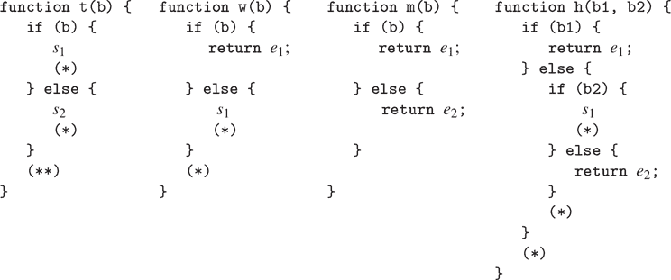

### 5.5.3 编译应用程序和返回语句

编译过程的本质是编译函数应用程序。使用给定目标和链接的应用程序的代码具有以下形式

```js
〈compilation of function expression, target fun, linkage "next"〉
〈evaluate argument expressions and construct argument list in* argl〉
〈compilation of function call with given target and linkage〉
```

寄存器`env`，`fun`和`argl`在函数和参数表达式的求值过程中可能需要保存和恢复。请注意，这是编译器中唯一指定目标不是`val`的地方。

所需的代码由`compile_application`生成。这将递归编译函数表达式，以生成将要应用的函数放入`fun`的代码，并编译参数表达式，以生成求值应用的各个参数表达式的代码。参数表达式的指令序列（由`construct_arglist`组合）与构造`argl`中的参数列表的代码组合在一起，生成的参数列表代码与函数代码和执行函数调用的代码（由`compile_function_call`生成）组合在一起。在附加代码序列时，必须在函数表达式的求值周围保留`env`寄存器（因为求值函数表达式可能会修改`env`，这将需要用于求值参数表达式），并且在构造参数列表时必须保留`fun`寄存器（因为求值参数表达式可能会修改`fun`，这将需要用于实际的函数应用）。`continue`寄存器在整个过程中也必须保留，因为它在函数调用中需要用于链接。

```js
function compile_application(exp, target, linkage) {
    const fun_code = compile(function_expression(exp), "fun", "next");
    const argument_codes = map(arg => compile(arg, "val", "next"),
                               arg_expressions(exp));
    return preserving(list("env", "continue"),
                      fun_code,
                      preserving(list("fun", "continue"),
                          construct_arglist(argument_codes),
                          compile_function_call(target, linkage)));
}
```

构建参数列表的代码将求值每个参数表达式为`val`，然后使用`pair`将该值与在`argl`中累积的参数列表组合起来。由于我们按顺序将参数添加到`argl`的前面，所以我们必须从最后一个参数开始，以第一个结束，这样参数将按顺序出现在生成的列表中。我们不想浪费一条指令来将`argl`初始化为空列表以准备进行这一系列的求值，因此我们让第一个代码序列构造初始的`argl`。参数列表构造的一般形式如下：

```js
〈compilation of last argument, targeted to val〉
〈assign("argl", list(op("list"), reg("val"))),
〈compilation of next argument, targeted to val〉
〈assign("argl", list(op("pair"), reg("val"), reg("argl"))),
...
〈compilation of first argument, targeted to val〉
assign("argl", list(op("pair"), reg("val"), reg("argl"))),
```

在每个参数求值周围必须保留`argl`寄存器，除了第一个（这样迄今为止累积的参数不会丢失），并且在每个参数求值周围必须保留`env`（供后续参数求值使用）。

编译这个参数代码有点棘手，因为第一个要求值的参数表达式的特殊处理以及在不同位置需要保留`argl`和`env`。`construct_arglist`函数以求值各个参数表达式的代码作为参数。如果根本没有参数表达式，它只是发出指令

```js
assign(argl, constant(null))
```

否则，`construct_arglist`创建代码，用最后一个参数初始化`argl`，并附加代码来求值其余的参数，并依次将它们添加到`argl`中。为了从后到前处理参数，我们必须按照`compile_application`提供的顺序反转参数代码序列的列表。

```js
function construct_arglist(arg_codes) {
    if (is_null(arg_codes)) {
        return make_instruction_sequence(null, list("argl"),
                   list(assign("argl", constant(null))));
    } else {
        const rev_arg_codes = reverse(arg_codes);
        const code_to_get_last_arg =
            append_instruction_sequences(
                head(rev_arg_codes),
                make_instruction_sequence(list("val"), list("argl"),
                    list(assign("argl",
                                list(op("list"), reg("val"))))));
        return is_null(tail(rev_arg_codes))
               ? code_to_get_last_arg
               : preserving(list("env"),
                     code_to_get_last_arg,
                     code_to_get_rest_args(tail(rev_arg_codes)));
    }
}
function code_to_get_rest_args(arg_codes) {
    const code_for_next_arg =
        preserving(list("argl"),
            head(arg_codes),
            make_instruction_sequence(list("val", "argl"), list("argl"),
                list(assign("argl", list(op("pair"),
                                         reg("val"), reg("argl"))))));
    return is_null(tail(arg_codes))
           ? code_for_next_arg
           : preserving(list("env"),
                        code_for_next_arg,
                        code_to_get_rest_args(tail(arg_codes)));
}
```

##### 应用函数

在求值函数应用的元素之后，编译的代码必须将`fun`中的函数应用于`argl`中的参数。该代码执行的基本上与第 4.1.1 节中的元循环求值器中的`apply`函数或第 5.4.2 节中的显式控制求值器中的`apply_dispatch`入口相同的分发。它检查要应用的函数是原始函数还是编译函数。对于原始函数，它使用`apply_primitive_function`；我们很快将看到它如何处理编译函数。函数应用代码的形式如下：

```js
  test(list(op("primitive_function"), reg("fun"))),
  branch(label("primitive_branch")),
"compiled_branch",
 〈code to apply compiled function with given target and appropriate linkage〉
"primitive_branch",
  assign(target,
         list(op("apply_primitive_function"), reg("fun"), reg("argl"))),
 〈linkage〉
"after_call"
```

注意，编译的分支必须跳过原始分支。因此，如果原始函数调用的链接是`"next"`，则复合分支必须使用跳转到原始分支之后插入的标签的链接。（这类似于`compile_conditional`中真分支使用的链接。）

```js
function compile_function_call(target, linkage) {
    const primitive_branch = make_label("primitive_branch");
    const compiled_branch = make_label("compiled_branch");
    const after_call = make_label("after_call");
    const compiled_linkage = linkage === "next" ? after_call : linkage;
    return append_instruction_sequences(
        make_instruction_sequence(list("fun"), null,
            list(test(list(op("is_primitive_function"), reg("fun"))),
                 branch(label(primitive_branch)))),
            append_instruction_sequences(
                parallel_instruction_sequences(
                    append_instruction_sequences(
                        compiled_branch,
                        compile_fun_appl(target, compiled_linkage)),
                    append_instruction_sequences(
                        primitive_branch,
                        end_with_linkage(linkage,
                            make_instruction_sequence(list("fun", "argl"),
                                                      list(target),
                                list(assign(
                                       target,
                                       list(op("apply_primitive_function"),
                                            reg("fun"), reg("argl")))))))),
            after_call));
}
```

原始分支和复合分支（例如`compile_ conditional`中的真分支和假分支）使用`parallel_instruction_sequences`附加，而不是普通的`append_instruction_sequences`，因为它们不会按顺序执行。

##### 应用编译函数

函数应用和返回的处理是编译器最微妙的部分。编译函数（由`compile_lambda_expression`构造）具有一个入口点，这是一个标签，指定函数代码的起始位置。在这个入口点的代码中，计算`val`中的结果，并通过执行编译返回语句的指令结束。

编译函数应用程序的代码与显式控制求值器（第 5.4.2 节）使用堆栈的方式相同：在跳转到编译函数的入口点之前，它将函数调用的继续保存到堆栈中，然后是一个标记，允许将堆栈恢复到调用之前的状态，并将继续保持在顶部。

```js
  // set up for return from function
  save("continue"),
  push_marker_to_stack(),
  // jump to the function's entry point
  assign("val", list(op("compiled_function_entry"), reg("fun"))),
  go_to(reg("val")),
```

编译返回语句（使用`compile_return_statement`）会生成相应的代码来恢复堆栈并恢复并跳转到`continue`。

```js
  revert_stack_to_marker(),
  restore("continue"),
  〈evaluate the return expression and store the result in val〉
  go_to(reg("continue")), // "return"-linkage code
```

除非函数进入无限循环，否则它将通过执行上述返回代码结束，该代码是由程序中的`return`语句或由`compile_lambda_body`插入的返回`undefined`生成的。

具有给定目标和链接的编译函数应用程序的直接代码将设置`continue`，使函数返回到本地标签而不是最终链接，以将函数值从`val`复制到目标寄存器（如果需要）。如果链接是标签，它将如下所示：

```js
  assign("continue", label("fun_return")), // where function should return to
  save("continue"),       // will be restored by the function
  push_marker_to_stack(), // allows the function to revert stack to find fun_return
  assign("val", list(op("compiled_function_entry"), reg("fun"))),
  go_to(reg("val")),    // eventually reverts stack, restores and jumps to continue
"fun_return",             // the function returns to here
  assign(target, reg("val")), // included if target is not val
  go_to(label(linkage)),   // linkage code
```

或者像这样-在开始时保存调用者的继续，以便在结束时恢复并转到它-如果链接是`return`（也就是说，如果应用程序在`return`语句中并且其值是要返回的结果）：

```js
  save("continue"), // save the caller's continuation
  assign("continue", label("fun_return")), // where function should return to
  save("continue"), // will be restored by the function
push_marker_to_stack(), // allows the function to revert stack to find fun_return
  assign("val", list(op("compiled_function_entry"), reg("fun"))),
  go_to(reg("val")), // eventually reverts stack, restores and jumps to continue
"fun_return", // the function returns to here
  assign(target, reg("val")), // included if target is not val
  restore("continue"), // restore the caller's continuation
  go_to(reg("continue")), // linkage code
```

这段代码设置`continue`，使函数返回到标签`fun_return`并跳转到函数的入口点。`fun_return`处的代码将函数的结果从`val`传输到目标寄存器（如果需要），然后跳转到链接指定的位置。（链接始终是`return`或标签，因为`compile_function_call`会将复合函数分支的`next`链接替换为`after_call`标签。）在跳转到函数的入口点之前，我们保存`continue`并执行`push_marker_to_stack()`以使函数能够返回到程序中预期的位置并具有预期的堆栈。`revert_stack_to_marker()`和`restore("continue")`指令由`compile_return_statement`为函数体中的每个`return`语句生成。

实际上，如果目标不是`val`，那么上面的代码就是我们的编译器将生成的代码。然而，通常情况下，目标是`val`（编译器指定不同寄存器的唯一时间是将函数表达式的求值目标指向`fun`），因此函数结果直接放入目标寄存器，无需跳转到复制它的特殊位置。相反，我们通过设置`continue`来简化代码，使被调用函数直接“返回”到调用者链接指定的位置：

```js
〈set up continue for linkage and push the marker〉
assign("val", list(op("compiled_function_entry"), reg("fun"))),
go_to(reg("val")),
```

如果链接是一个标签，我们将设置`continue`，使函数继续在该标签处。（也就是说，被调用函数结束时的`go_to(reg("continue"))`相当于上面的`fun_return`处的`go_to(label(linkage))`。）

```js
assign("continue", label(linkage)),
save("continue"),
push_marker_to_stack(),
assign("val", list(op("compiled_function_entry"), reg("fun"))),
go_to(reg("val")),
```

如果链接是`return`，我们不需要分配`continue`：它已经保存了所需的位置。（也就是说，被调用函数结束时的`go_to(reg("continue"))`会直接到达`fun_return`处的`go_to(reg("continue"))`所指定的位置。）

```js
save("continue"),
push_marker_to_stack(),
assign("val", list(op("compiled_function_entry"), reg("fun"))),
go_to(reg("val")),
```

使用这种实现的`return`链接，编译器生成尾递归代码。在返回语句中的函数调用，其值是要返回的结果，进行直接转移，而不在堆栈上保存不必要的信息。

假设我们处理了链接为`return`且目标为`val`的函数调用的情况，方式与非`val`目标的情况相同。这将破坏尾递归。我们的系统仍然会为任何函数调用返回相同的值。但每次调用函数时，我们都会保存`continue`并在调用后返回以撤消（无用的）保存。这些额外的保存会在函数调用的嵌套中累积。⁴⁸

函数`compile_fun_appl`通过考虑四种情况生成上述函数应用代码，具体取决于调用的目标是否为`val`以及链接是否为`return`。请注意，指令序列被声明为修改所有寄存器，因为执行函数体可能以任意方式更改寄存器。⁴⁹

```js
function compile_fun_appl(target, linkage) {
    const fun_return = make_label("fun_return");
    return target === "val" && linkage !== "return"
           ? make_instruction_sequence(list("fun"), all_regs,
                 list(assign("continue", label(linkage)),
                      save("continue"),
                      push_marker_to_stack(),
                      assign("val", list(op("compiled_function_entry"),
                                         reg("fun"))),
                      go_to(reg("val"))))
           : target !== "val" && linkage !== "return"
           ? make_instruction_sequence(list("fun"), all_regs,
                 list(assign("continue", label(fun_return)),
                      save("continue"),
                      push_marker_to_stack(),
                      assign("val", list(op("compiled_function_entry"),
                                         reg("fun"))),
                      go_to(reg("val")),
                      fun_return,
                      assign(target, reg("val")),
                      go_to(label(linkage))))
           : target === "val" && linkage === "return"
           ? make_instruction_sequence(list("fun", "continue"),
                                       all_regs,
                 list(save("continue"),
                      push_marker_to_stack(),
                      assign("val", list(op("compiled_function_entry"),
                                         reg("fun"))),
                      go_to(reg("val"))))
           : // target !== "val" && linkage === "return"
             error(target, "return linkage, target not val – compile");
}
```

我们已经展示了如何在链接是`return`时为函数应用生成尾递归链接代码，也就是说，当应用在返回语句中时，它的值是要返回的结果。同样，正如在 5.4.2 节中解释的那样，这里使用的堆栈标记机制（以及显式控制求值器）仅在这种情况下产生尾递归行为。为函数应用生成的代码的这两个方面结合在一起，确保当函数通过返回函数调用的值结束时，不会累积堆栈。

##### 编译返回语句

无论给定的链接和目标如何，返回语句的代码都采用以下形式：

```js
revert_stack_to_marker(),
restore("continue"),   // saved by compile_fun_appl
〈evaluate the return expression and store the result in val〉
go_to(reg("continue")) // "return"-linkage code
```

使用标记还原堆栈的指令，然后恢复`continue`对应于`compile_fun_appl`生成的指令，用于保存`continue`和标记堆栈。通过使用`return`链接编译返回表达式时生成最终跳转到`continue`。函数`compile_return_statement`与所有其他代码生成器不同，因为它忽略了目标和链接参数——它总是使用目标`val`和链接`return`编译返回表达式。

```js
function compile_return_statement(stmt, target, linkage) {
    return append_instruction_sequences(
               make_instruction_sequence(null, list("continue"),
                   list(revert_stack_to_marker(),
                        restore("continue"))),
               compile(return_expression(stmt), "val", "return"));
}
```

### 5.5.4 组合指令序列

本节描述了指令序列的表示和组合的详细信息。回想一下 5.5.1 节，指令序列被表示为所需寄存器的列表，修改的寄存器和实际指令。我们还将标签（字符串）视为指令序列的退化情况，它不需要或修改任何寄存器。因此，为了确定指令序列所需和修改的寄存器，我们使用选择器。

```js
function registers_needed(s) {
    return is_string(s) ? null : head(s);
}
function registers_modified(s) {
    return is_string(s) ? null : head(tail(s));
}
function instructions(s) {
    return is_string(s) ? list(s) : head(tail(tail(s)));
}
```

要确定给定序列是否需要或修改给定寄存器，我们使用谓词。

```js
function needs_register(seq, reg) {
    return ! is_null(member(reg, registers_needed(seq)));
}
function modifies_register(seq, reg) {
    return ! is_null(member(reg, registers_modified(seq)));
}
```

通过这些谓词和选择器，我们可以实现编译器中使用的各种指令序列组合器。

基本组合器是`append_instruction_sequences`。它以两个将按顺序执行的指令序列作为参数，并返回一个指令序列，其语句是两个序列的语句附加在一起。微妙的一点是确定所需和修改的寄存器。它修改了任一序列修改的寄存器；它需要那些必须在第一个序列运行之前初始化的寄存器（第一个序列需要的寄存器），以及第二个序列需要但第一个序列未初始化（修改）的寄存器。

函数`append_instruction_sequences`给出了两个指令序列`seq1`和`seq2`，并返回指令序列，其指令是`seq1`的指令，后跟`seq2`的指令，其修改的寄存器是`seq1`或`seq2`修改的寄存器，并且所需的寄存器是`seq1`所需的寄存器以及`seq2`所需的寄存器，这些寄存器不被`seq1`修改。（在集合操作方面，所需寄存器的新集合是`seq1`所需的寄存器的并集，与`seq2`所需的寄存器和`seq1`修改的寄存器的差集。）因此，`append_instruction_sequences`的实现如下：

```js
function append_instruction_sequences(seq1, seq2) {
    return make_instruction_sequence(
               list_union(registers_needed(seq1),
                          list_difference(registers_needed(seq2),
                                         registers_modified(seq1))),
               list_union(registers_modified(seq1),
                          registers_modified(seq2)),
               append(instructions(seq1), instructions(seq2)));
}
```

这个函数使用一些简单的操作来操作列表表示的集合，类似于第 2.3.3 节中描述的（无序）集合表示：

```js
function list_union(s1, s2) {
    return is_null(s1)
           ? s2
           : is_null(member(head(s1), s2))
           ? pair(head(s1), list_union(tail(s1), s2))
           : list_union(tail(s1), s2);
}
function list_difference(s1, s2) {
    return is_null(s1)
           ? null
           : is_null(member(head(s1), s2))
           ? pair(head(s1), list_difference(tail(s1), s2))
           : list_difference(tail(s1), s2);
}
```

函数`preserving`，第二个主要的指令序列组合器，接受一个寄存器列表`regs`和两个要顺序执行的指令序列`seq1`和`seq2`。它返回一个指令序列，其指令是`seq1`的指令，后跟`seq2`的指令，`seq1`中被`seq1`修改但`seq2`所需的寄存器在`seq1`周围有适当的`save`和`restore`指令来保护。为了实现这一点，`preserving`首先创建一个具有所需的`save`，然后是`seq1`的指令，然后是所需的`restore`的序列。这个序列需要被保存和恢复的寄存器，以及`seq1`所需的寄存器，并修改了`seq1`修改的寄存器，但不包括被保存和恢复的寄存器。然后以通常的方式附加这个增强的序列和`seq2`。以下函数以递归方式实现了这种策略，遍历要保留的寄存器列表：

```js
function preserving(regs, seq1, seq2) {
    if (is_null(regs)) {
        return append_instruction_sequences(seq1, seq2);
    } else {
        const first_reg = head(regs);
        return needs_register(seq2, first_reg) &&
               modifies_register(seq1, first_reg)
               ? preserving(tail(regs),
                     make_instruction_sequence(
                         list_union(list(first_reg),
                                    registers_needed(seq1)),
                         list_difference(registers_modified(seq1),
                                         list(first_reg)),
                         append(list(save(first_reg)),
                                append(instructions(seq1),
                                       list(restore(first_reg))))),
                     seq2)
               : preserving(tail(regs), seq1, seq2);
    }
}
```

另一个序列组合器`tack_on_instruction_sequence`由`compile_lambda_expression`使用，用于将函数体附加到另一个序列。因为函数体不是“内联”执行作为组合序列的一部分，所以它的寄存器使用对嵌入它的序列的寄存器使用没有影响。因此，当我们将其附加到其他序列时，我们忽略函数体的所需和修改的寄存器集。

```js
function tack_on_instruction_sequence(seq, body_seq) {
    return make_instruction_sequence(
               registers_needed(seq),
               registers_modified(seq),
               append(instructions(seq), instructions(body_seq)));
}
```

函数`compile_conditional`和`compile_function_call`使用一个特殊的组合器`parallel_instruction_sequences`来附加跟随测试的两个替代分支。这两个分支永远不会按顺序执行；对于测试的任何特定求值，将进入其中一个分支。因此，第二个分支所需的寄存器仍然需要由组合序列，即使这些寄存器被第一个分支修改。

```js
function parallel_instruction_sequences(seq1, seq2) {
    return make_instruction_sequence(
               list_union(registers_needed(seq1),
                          registers_needed(seq2)),
               list_union(registers_modified(seq1),
                          registers_modified(seq2)),
               append(instructions(seq1), instructions(seq2)));
}
```

### 5.5.5 编译代码的示例

现在我们已经看到了编译器的所有元素，让我们看一个编译代码的示例，看看这些元素如何组合在一起。我们将通过将`parse`应用于程序的字符串表示（这里使用反引号`ˋ...ˋ`）来编译递归`factorial`函数的声明作为`compile`的第一个参数，反引号可以像单引号和双引号一样工作，但允许字符串跨越多行。

```js
compile(parse(ˋ
function factorial(n) {
    return n === 1
           ? 1
           : factorial(n - 1) * n;
}
              ˋ),
        "val",
        "next");
```

我们已经指定声明的值应放在`val`寄存器中。我们不在乎编译后的代码在执行声明后做什么，因此我们选择`"next"`作为链接描述符是任意的。

函数`compile`确定它得到了一个函数声明，因此将其转换为常量声明，然后调用`compile_declaration`。这将编译代码来计算要分配的值（目标为`val`），然后是安装声明的代码，然后是将声明的值（即值`undefined`）放入目标寄存器的代码，最后是链接代码。在计算值时，`env`寄存器被保留，因为它需要用于安装声明。因为链接是"`next`"，所以在这种情况下没有链接代码。因此，编译代码的骨架如下

```js
〈save env if modified by code to compute value〉
〈compilation of declaration value, target val, linkage "next"〉
〈restore env if saved above〉
perform(list(op("assign_symbol_value"),
             constant("factorial"),
             reg("val"),
             reg("env"))),
assign("val", constant(undefined))
```

编译生成名称`factorial`的值的表达式是一个 lambda 表达式，其值是计算阶乘的函数。函数`compile`通过调用`compile_lambda_expression`来处理这个问题，它编译函数体，将其标记为新的入口点，并生成将函数体与运行时环境组合并将结果分配给`val`的指令。然后，序列跳过编译的函数代码，该代码插入到此处。函数代码本身首先通过将参数`n`绑定到函数参数的帧来扩展函数的声明环境。然后是实际的函数体。由于名称的值的代码不修改`env`寄存器，因此不会生成上面显示的可选的`save`和`restore`。（此时不执行`entry1`处的函数代码，因此其对`env`的使用是无关紧要的。）因此，编译代码的骨架变为

```js
  assign("val", list(op("make_compiled_function"),
                     label("entry1"),
                     reg("env"))),
  go_to(label("after_lambda2")),
"entry1",
  assign("env", list(op("compiled_function_env"), reg("fun"))),
  assign("env", list(op("extend_environment"),
                     constant(list("n")),
                     reg("argl"),
                     reg("env"))),
  〈compilation of function body〉
"after_lambda2",
  perform(list(op("assign_symbol_value"),
               constant("factorial"),
               reg("val"),
               reg("env"))),
  assign("val", constant(undefined))
```

函数体总是使用目标`val`和链接"`next`"编译（由`compile_lambda_body`）。在这种情况下，函数体由单个返回语句组成：⁵⁰

```js
return n === 1
       ? 1
       : factorial(n - 1) * n;
```

函数`compile_return_statement`生成代码，使用标记还原堆栈并恢复`continue`寄存器，然后编译返回表达式，目标为`val`，链接为"`return`"，因为其值将从函数返回。返回表达式是一个条件表达式，`compile_conditional`生成代码，首先计算谓词（目标为`val`），然后检查结果并在谓词为假时绕过真分支。在谓词代码周围保留`env`和`continue`寄存器，因为它们可能需要用于条件表达式的其余部分。真分支和假分支都使用目标`val`和链接"`return`"进行编译。（也就是说，条件的值，即由其任一分支计算得到的值，是函数的值。）

```js
  revert_stack_to_marker(),
  restore("continue"),
  〈save continue, env if modified by predicate and needed by branches〉
  〈compilation of predicate, target val, linkage "next"〉
  〈restore continue, env if saved above〉
  test(list(op("is_falsy"), reg("val"))),
  branch(label("false_branch4")),
"true_branch3",
  〈compilation of true branch, target val, linkage "return"〉
"false_branch4",
  〈compilation of false branch, target val, linkage "return"〉
"after_cond5",
```

谓词`n === 1`是一个函数应用（在转换运算符组合后）。这查找函数表达式（符号`"==="`）并将该值放入`fun`中。然后将参数`1`和`n`的值组合成`argl`。然后测试`fun`是否包含原始函数或复合函数，并相应地分派到原始分支或复合分支。两个分支都在`after_call`标签处恢复。复合分支必须设置`continue`以跳过原始分支，并将标记推送到堆栈以匹配函数的编译返回语句中的还原操作。在函数和参数表达式的求值周围保留寄存器的要求不会导致寄存器的保存，因为在这种情况下，这些求值不会修改相关寄存器。

```js
  assign("fun", list(op("lookup_symbol_value"),
                     constant("==="), reg("env"))),
  assign("val", constant(1)),
  assign("argl", list(op("list"), reg("val"))),
  assign("val", list(op("lookup_symbol_value"),
                     constant("n"), reg("env"))),
  assign("argl", list(op("pair"), reg("val"), reg("argl"))),
  test(list(op("is_primitive_function"), reg("fun"))),
  branch(label("primitive_branch6")),
"compiled_branch7",
  assign("continue", label("after_call8")),
  save("continue"),
  push_marker_to_stack(),
  assign("val", list(op("compiled_function_entry"), reg("fun"))),
  go_to(reg("val")),
"primitive_branch6",
  assign("val", list(op("apply_primitive_function"),
                     reg("fun"),
                     reg("argl"))),
"after_call8",
```

真分支，即常量 1，编译（目标为`val`和链接`return`）为

```js
  assign("val", constant(1)),
  go_to(reg("continue")),
```

假分支的代码是另一个函数调用，其中函数是符号`"*"`的值，参数是`n`和另一个函数调用的结果（对`factorial`的调用）。每个调用都设置了`fun`和`argl`以及自己的原始和复合分支。图 5.17 显示了`factorial`函数声明的完整编译。请注意，由于谓词中的函数调用修改了这些寄存器并且需要用于函数调用和分支中的“返回”链接，因此上面显示的`continue`和`env`的可能“保存”和“恢复”实际上是生成的。

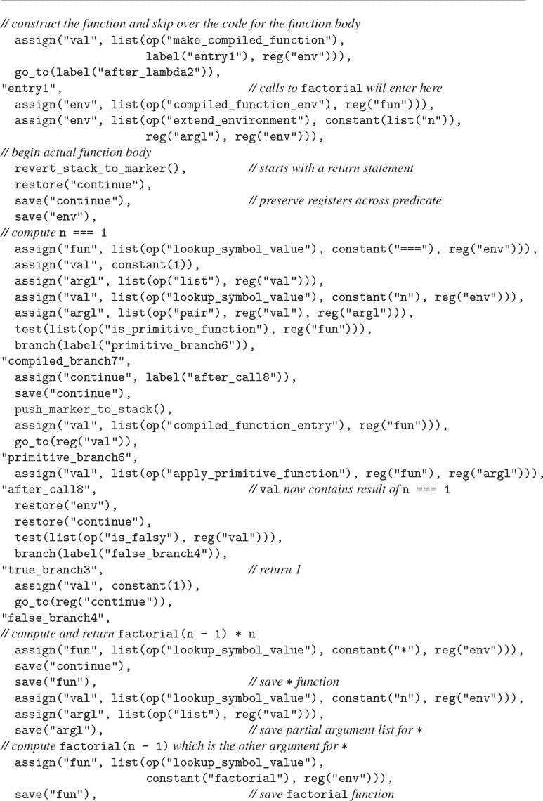

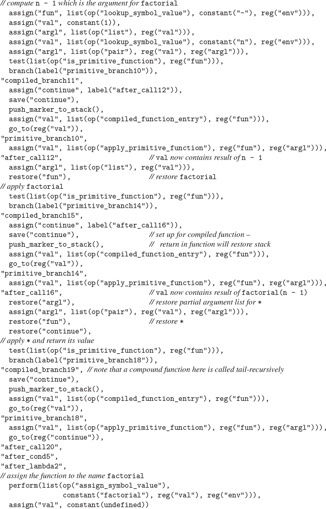

图 5.17 `factorial`函数声明的编译。

##### 练习 5.36

考虑以下阶乘函数的声明，它与上面给出的函数略有不同：

```js
function factorial_alt(n) {
    return n === 1
           ? 1
           : n * factorial_alt(n - 1);
}
```

编译此函数并将生成的代码与`factorial`的代码进行比较。解释您发现的任何差异。这两个程序中哪一个执行效率更高？

##### 练习 5.37

编译迭代阶乘函数

```js
function factorial(n) {
    function iter(product, counter) {
        return counter > n
               ? product
               : iter(product * counter, counter + 1);
    }
    return iter(1, 1);
}
```

注释生成的代码，显示迭代和递归版本的`factorial`之间的基本差异，使一个进程构建堆栈空间，另一个在恒定堆栈空间中运行。

##### 练习 5.38

编译了哪个程序以生成图 5.18 中显示的代码？

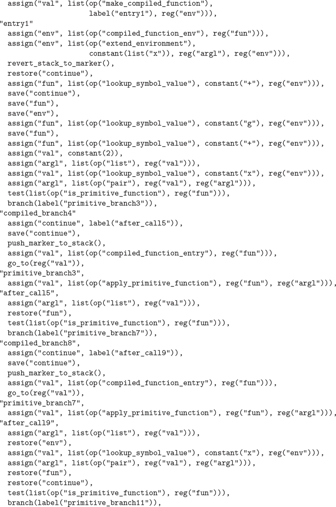

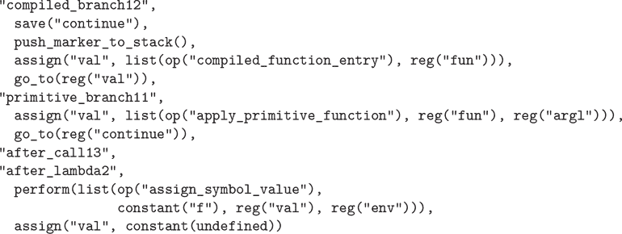

图 5.18 编译器输出的示例。参见练习 5.38。

##### 练习 5.39

我们的编译器为应用程序的参数产生什么样的求值顺序？是从左到右（如 ECMAScript 规范所规定的）还是从右到左，还是其他顺序？编译器中的哪个部分确定了这个顺序？修改编译器，使其产生其他求值顺序。（参见 5.4.1 节中对显式控制求值器的求值顺序的讨论。）改变参数求值的顺序如何影响构造参数列表的代码的效率？

##### 练习 5.40

理解编译器对优化堆栈使用的“保留”机制的一种方法是看看如果我们不使用这个想法会生成什么额外的操作。修改“保留”，使其总是生成“保存”和“恢复”操作。编译一些简单的表达式，并识别生成的不必要的堆栈操作。将代码与保留机制完整生成的代码进行比较。

##### 练习 5.41

我们的编译器在避免不必要的堆栈操作方面很聪明，但在编译语言的原始函数调用方面一点也不聪明，这些原始函数调用是通过机器提供的原始操作来实现的。例如，考虑编译计算`a + 1`的代码量：代码在`argl`中设置参数列表，将原始加法函数（通过在环境中查找符号`"+"`找到）放入`fun`，并测试函数是原始的还是复合的。编译器总是生成代码来执行测试，以及原始和复合分支的代码（只有一个会被执行）。我们没有展示实现原始的控制器部分，但我们假设这些指令利用了机器数据路径中的原始算术操作。考虑如果编译器可以*开放代码*原始操作——也就是说，如果它可以生成代码直接使用这些原始机器操作，将会生成多少更少的代码。表达式`a + 1`可能被编译成如下简单的形式⁵¹

```js
assign("val", list(op("lookup_symbol_value"), constant("a"), reg("env"))),
assign("val", list(op("+"), reg("val"), constant(1)))
```

在这个练习中，我们将扩展我们的编译器以支持对选定原语的开放编码。将为这些原语函数的调用生成专用代码，而不是一般的函数应用代码。为了支持这一点，我们将用特殊的参数寄存器`arg1`和`arg2`来扩展我们的机器。机器的原始算术操作将从`arg1`和`arg2`中获取它们的输入。结果可以放入`val`、`arg1`或`arg2`中。

编译器必须能够识别源程序中开放编码原语的应用。我们将扩展`compile`函数中的分派，以识别这些原语的名称，以及它当前识别的句法形式。对于我们编译器的每个句法形式，都有一个代码生成器。在这个练习中，我们将为开放编码的原语构建一组代码生成器。

1.  a. 与句法形式不同，开放编码的原语都需要求值它们的参数表达式。编写一个名为`spread_arguments`的代码生成器，供所有开放编码代码生成器使用。函数`spread_arguments`应接受参数表达式列表，并将给定的参数表达式编译为连续的参数寄存器。注意，参数表达式可能包含对开放编码原语的调用，因此在参数表达式求值期间必须保留参数寄存器。

1.  b. JavaScript 运算符`===`、`*`、`-`和`+`等在寄存器机器中作为原始函数实现，并在全局环境中用符号`===`、`*`、`-`和`+`引用。在 JavaScript 中，不可能重新声明这些名称，因为它们不符合名称的句法限制。这意味着可以安全地开放编码它们。对于每个原始函数`===`、`*`、`-`和`+`，编写一个代码生成器，该代码生成器接受一个带有命名该函数的函数表达式的应用，以及一个目标和链接描述符，并生成代码将参数传播到寄存器，然后执行针对给定目标和给定链接的操作。使`compile`分派到这些代码生成器。

1.  c. 尝试在“阶乘”示例上使用你的新编译器。将生成的代码与不使用开放编码产生的结果进行比较。

### 5.5.6 词法寻址

编译器执行的最常见优化之一是名称查找的优化。到目前为止，我们实现的编译器生成使用求值器机器的`lookup_symbol_value`操作的代码。这通过将名称与当前绑定的每个名称进行比较来搜索名称，通过运行时环境逐帧向外工作。如果框架嵌套深或名称很多，这种搜索可能很昂贵。例如，考虑在返回的五个参数的函数的应用中，求解表达式`x * y * z`时查找`x`的值的问题。

```js
((x, y) =>
   (a, b, c, d, e) =>
     ((y, z) => x * y * z)(a * b * x, c + d + x))(3, 4)
```

每次`lookup_symbol_value`搜索`x`时，它必须确定符号`x`不等于`y`或`z`（在第一个框架中），也不等于`a`、`b`、`c`、`d`或`e`（在第二个框架中）。因为我们的语言是词法作用域的，任何组件的运行时环境都将与组件所在的程序的词法结构相对应。因此，编译器在分析上述表达式时可以知道，每次应用函数时，`x * y * z`中的`x`的绑定将在当前框架的外部两个框架处找到，并且将是该框架中的第一个绑定。

我们可以利用这一事实，通过发明一种新的名称查找操作`lexical_address_lookup`，它接受环境和由两个数字组成的*词法地址*作为参数：*帧编号*，指定要跳过多少帧，和*位移编号*，指定在该帧中要跳过多少绑定。操作`lexical_address_lookup`将生成相对于当前环境存储在该词法地址的名称的值。如果我们将`lexical_address_lookup`操作添加到我们的机器中，我们可以让编译器生成使用这个操作引用名称的代码，而不是`lookup_symbol_value`。同样，我们的编译代码可以使用新的`lexical_address_assign`操作，而不是`assign_symbol_value`。使用词法寻址，对象代码中不需要包含任何名称的符号引用，帧在运行时也不需要包含符号。

为了生成这样的代码，编译器必须能够确定它即将编译引用的名称的词法地址。程序中名称的词法地址取决于代码中的位置。例如，在以下程序中，表达式`e[1]`中`x`的地址是(2,0)——向后两个帧，帧中的第一个名称。在那一点上，`y`的地址是`(0,0)`，`c`的地址是`(1,2)`。在表达式`e[2]`中，`x`在`(1,0)`，`y`在`(1,1)`，`c`在`(0,2)`。

```js
((x, y) =>
   (a, b, c, d, e) =>
     ((y, z) => e1)(e2, c + d + x))(3, 4);
```

编译器产生使用词法寻址的代码的一种方法是维护一个称为*编译时环境*的数据结构。这个数据结构跟踪当执行特定的名称访问操作时，绑定将位于运行时环境的哪个帧的哪个位置。编译时环境是一个帧的列表，每个帧包含一个符号列表。与符号相关联的值将不会有，因为值不是在编译时计算的。（练习 5.47 将改变这一点，作为常量的优化。）编译时环境成为`compile`的一个额外参数，并传递给每个代码生成器。对`compile`的顶层调用使用包括所有原始函数和原始值名称的编译时环境。当编译 lambda 表达式的主体时，`compile_lambda_body`通过包含函数参数的帧扩展编译时环境，以便使用扩展的环境编译主体。同样，当编译块的主体时，`compile_block`通过包含主体的本地名称的帧扩展编译时环境。在编译的每个点上，`compile_name`和`compile_assignment_declaration`使用编译时环境以生成适当的词法地址。

练习 5.42 到 5.45 描述了如何完成词法寻址策略的草图，以便将词法查找纳入编译器。练习 5.46 和 5.47 描述了编译时环境的其他用途。

##### 练习 5.42

编写一个实现新查找操作的函数`lexical_address_lookup`。它应该接受两个参数——词法地址和运行时环境，并返回存储在指定词法地址的名称的值。如果名称的值是字符串`"unassigned"`，函数`lexical_address_lookup`应该发出错误信号。还要编写一个实现改变指定词法地址处名称的值的操作的函数`lexical_address_assign`。

##### 练习 5.43

修改编译器以维护上述编译时环境。也就是说，向`compile`和各种代码生成器添加一个编译时环境参数，并在`compile_lambda_body`和`compile_block`中扩展它。

##### 练习 5.44

编写一个函数`find_symbol`，它以符号和编译时环境作为参数，并返回相对于该环境的符号的词法地址。例如，在上面显示的程序片段中，在编译表达式`e[1]`期间的编译时环境是

```js
list(list("y", "z"),
     list("a", "b", "c", "d", "e"),
     list("x", "y"))
```

函数`find_symbol`应该产生

```js
find_symbol("c", list(list("y", "z"),
                      list("a", "b", "c", "d", "e"),
                      list("x", "y")));
list(1, 2)

find_symbol("x", list(list("y", "z"),
                      list("a", "b", "c", "d", "e"),
                      list("x", "y")));
list(2, 0)

find_symbol("w", list(list("y", "z"),
                      list("a", "b", "c", "d", "e"),
                      list("x", "y")));
"not found"
```

##### 练习 5.45

使用练习 5.44 中的`find_symbol`，重写`compile_assignment_declaration`和`compile_name`以输出词法地址指令。在`find_symbol`返回`"not found"`的情况下（即名称不在编译时环境中），应报告编译时错误。在一些简单情况下测试修改后的编译器，例如本节开头的嵌套 lambda 组合。

##### 练习 5.46

在 JavaScript 中，试图为声明为常量的名称分配新值会导致错误。练习 4.11 展示了如何在运行时检测此类错误。通过本节中介绍的技术，我们可以在*编译时*检测尝试为常量分配新值的行为。为此，扩展函数`compile_lambda_body`和`compile_block`以记录在编译时环境中名称是声明为变量（使用`let`或作为参数）还是常量（使用`const`或`function`）。修改`compile_assignment`以在检测到对常量的赋值时报告适当的错误。

##### 练习 5.47

编译时对常量的了解打开了许多优化的大门，使我们能够生成更高效的目标代码。除了在练习 5.46 中扩展编译时环境以指示声明为常量的名称外，如果在编译时知道常量的值或其他可以帮助我们优化代码的信息，我们可以存储常量的值。

1.  a. 诸如`const name = literal;`的常量声明允许我们在声明的范围内用`literal`替换所有`name`的出现，这样就不必在运行时环境中查找`name`。这种优化称为*常量传播*。使用扩展的编译时环境存储字面常量，并修改`compile_name`以在生成的`assign`指令中使用存储的常量而不是`lookup_symbol_value`操作。

1.  b. 函数声明是一个派生组件，它扩展为常量声明。让我们假设全局环境中原始函数的名称也被视为常量。如果我们进一步扩展我们的编译时环境以跟踪哪些名称指向编译函数，哪些指向原始函数，我们可以将检查函数是编译还是原始的测试从运行时移动到编译时。这使得目标代码更加高效，因为它通过编译器替换了在生成的代码中每个函数应用必须执行一次的测试。使用这样扩展的编译时环境，修改`compile_function_call`，以便在编译时确定所调用的函数是编译还是原始时，只生成`compiled_branch`或`primitive_branch`中的指令。

1.  c. 像第(a)部分那样用字面值替换常量名称为另一种优化铺平了道路，即用编译时计算的结果替换对字面值的原始函数的应用。这种优化称为*常量折叠*，通过在编译器中执行加法，将诸如`40 + 2`之类的表达式替换为`42`。扩展编译器以对数字的算术运算和字符串连接执行常量折叠。

### 5.5.7 将编译代码与求值器进行接口

我们还没有解释如何将编译代码加载到求值器机器中，或者如何运行它。我们将假设明确控制求值器机器已经被定义，就像第 5.4.4 节中所述，其中还有脚注 43（第 5.5.2 节）中指定的其他操作。我们将实现一个名为`compile_and_go`的函数，该函数编译 JavaScript 程序，将生成的目标代码加载到求值器机器中，并使机器运行求值器全局环境中的代码，打印结果，并进入求值器的驱动循环。我们还将修改求值器，以便解释组件可以调用编译函数以及解释函数。然后，我们可以将编译函数放入机器中，并使用求值器调用它：

```js
compile_and_go(parse(ˋ
function factorial(n) { 
    return n === 1
           ? 1
           : factorial(n - 1) * n;
}
                     ˋ));
```

*EC-求值值：*

```js
undefined
```

*EC-求值输入：*

```js
factorial(5);
```

*EC-求值值：*

120

为了使求值器能够处理编译函数（例如，求值上面的`factorial`调用），我们需要更改`apply_dispatch`（第 5.4.2 节）处的代码，以便它识别编译函数（与复合函数或原始函数不同），并直接将控制转移到编译代码的入口点。⁵²

```js
"apply_dispatch",
  test(list(op("is_primitive_function"), reg("fun"))),
  branch(label("primitive_apply")),
  test(list(op("is_compound_function"), reg("fun"))),
  branch(label("compound_apply")),
  test(list(op("is_compiled_function"), reg("fun"))),
  branch(label("compiled_apply")),
  go_to(label("unknown_function_type")),

"compiled_apply",
  push_marker_to_stack(),
  assign("val", list(op("compiled_function_entry"), reg("fun"))),
  go_to(reg("val")),
```

在`compiled_apply`处，与`compound_apply`一样，我们将一个标记推送到堆栈，以便编译函数中的返回语句可以将堆栈恢复到此状态。请注意，在标记堆栈之前，在`compiled_apply`处没有保存`continue`，因为求值器被安排在`apply_dispatch`处，继续将位于堆栈顶部。

为了使我们能够在启动求值器机器时运行一些编译代码，我们在求值器机器的开头添加了一个`branch`指令，如果`flag`寄存器被设置，该指令将使机器转到新的入口点。⁵³

```js
  branch(label("external_entry")), // branches if flag is set
"read_evaluate_print_loop",
  perform(list(op("initialize_stack"))),
  ...
```

`external_entry`处的代码假定机器以`val`包含的指令序列的位置启动，该指令序列将结果放入`val`，并以`go_to(reg("continue"))`结束。从这个入口点开始跳转到由`val`指定的位置，但首先分配`continue`，以便执行将返回到`print_result`，该函数打印`val`中的值，然后转到求值器的读取-求值-打印循环的开头。⁵⁴

```js
"external_entry",
  perform(list(op("initialize_stack"))),
  assign("env", list(op("get_current_environment"))),
  assign("continue", label("print_result")),
  go_to(reg("val")),
```

现在我们可以使用以下函数来编译函数声明，执行编译代码，并运行读取-求值-打印循环，以便尝试该函数。因为我们希望编译代码继续到`continue`的位置，并在`val`中返回结果，所以我们使用`val`作为目标编译程序，并使用`"return"`作为链接。为了将编译器生成的目标代码转换为求值器寄存器机器的可执行指令，我们使用寄存器机器模拟器（第 5.2.2 节）中的`assemble`函数。为了使解释程序引用编译程序中顶层声明的名称，我们扫描顶层名称，并通过将这些名称绑定到`"unassigned"`来扩展全局环境，知道编译代码将为它们分配正确的值。然后，我们将`val`寄存器初始化为指向指令列表，设置`flag`以便求值器将转到`external_entry`，然后启动求值器。

```js
function compile_and_go(program) {
    const instrs = assemble(instructions(compile(program,
                                                 "val", "return")),
                            eceval);
    const toplevel_names = scan_out_declarations(program);
    const unassigneds = list_of_unassigned(toplevel_names);
    set_current_environment(extend_environment(
                               toplevel_names,
                               unassigneds,
                               the_global_environment));
    set_register_contents(eceval, "val", instrs);
    set_register_contents(eceval, "flag", true);
    return start(eceval);
}
```

如果我们已经设置了堆栈监视，就像在第 5.4.4 节的末尾一样，我们可以检查编译代码的堆栈使用情况：

```js
compile_and_go(parse(ˋ
function factorial(n) { 
    return n === 1
           ? 1
           : factorial(n - 1) * n;
}
                     ˋ));
```

*总推送次数= 0*

*最大深度= 0*

*EC-求值值：*

```js
undefined
```

*EC-求值输入：*

```js
factorial(5);
```

*总推送次数= 36*

*最大深度= 14*

*EC-求值值：*

120

将此示例与使用相同函数的解释版本求值`factorial(5)`进行比较，该函数显示在第 5.4.4 节的末尾。解释版本需要 151 次推送和最大堆栈深度为 28。这说明了我们编译策略带来的优化。

##### 解释和编译

有了本节中的程序，我们现在可以尝试解释和编译的替代执行策略。解释器将机器提升到用户程序的级别；编译器将用户程序降低到机器语言的级别。我们可以将 JavaScript 语言（或任何编程语言）视为建立在机器语言上的一系列连贯的抽象。解释器适用于交互式程序开发和调试，因为程序执行步骤是根据这些抽象组织的，因此对程序员更易理解。编译代码可以更快地执行，因为程序执行步骤是根据机器语言组织的，并且编译器可以进行跨越更高级抽象的优化。

解释和编译的选择也导致将语言移植到新计算机的不同策略。假设我们希望为新机器实现 JavaScript。一种策略是从第 5.4 节的显式控制求值器开始，并将其指令转换为新机器的指令。另一种策略是从编译器开始，并更改代码生成器，以便为新机器生成代码。第二种策略允许我们首先使用运行在原始 JavaScript 系统上的编译器编译任何 JavaScript 程序，并将其与运行时库的编译版本链接起来，在新机器上运行任何 JavaScript 程序。更好的是，我们可以编译编译器本身，并在新机器上运行它来编译其他 JavaScript 程序。或者我们可以编译第 4.1 节中的解释器之一，以产生在新机器上运行的解释器。

##### 练习 5.48

通过比较编译代码和求值器在相同计算中使用的堆栈操作，我们可以确定编译器优化堆栈使用的程度，无论是在速度上（减少总堆栈操作次数）还是在空间上（减少最大堆栈深度）。将这种优化的堆栈使用与相同计算的特定用途机器的性能进行比较，可以在一定程度上反映编译器的质量。

1.  a. 练习 5.28 要求您确定作为`n`的函数，求值器计算`n!`所需的推送次数和最大堆栈深度。练习 5.13 要求您对图 5.11 中显示的特定用途阶乘机执行相同的测量。现在使用编译的`factorial`函数执行相同的分析。

    取编译版本中推送次数与解释版本中推送次数的比率，并对最大堆栈深度做同样的操作。由于计算`n!`所需的操作次数和堆栈深度与`n`成线性关系，因此这些比率在`n`变大时应该接近常数。这些常数是多少？同样，找出特定用途机器的堆栈使用量与解释版本的使用量的比率。

    比较特定用途与解释代码的比率与编译与解释代码的比率。您应该会发现，特定用途的机器比编译代码更有效，因为手工定制的控制器代码应该比我们的基本通用编译器生成的代码要好得多。

1.  b. 您能否提出改进编译器的建议，以帮助它生成性能更接近手工定制版本的代码？

##### 练习 5.49

进行类似于练习 5.48 中的分析，以确定编译树递归斐波那契函数的有效性

```js
function fib(n) {
    return n < 2 ? n : fib(n - 1) + fib(n - 2);
}
```

与使用图 5.12 的专用斐波那契机器相比的效果。（有关解释性能的测量，请参见练习 5.30。）对于斐波那契，使用的时间资源与`n`不成线性关系；因此，堆栈操作的比值不会接近与`n`无关的极限值。

##### 练习 5.50

本节描述了如何修改显式控制求值器，以便解释代码可以调用编译函数。展示如何修改编译器，以便编译函数不仅可以调用原始函数和编译函数，还可以调用解释函数。这需要修改`compile_function_call`来处理复合（解释）函数的情况。确保处理与`compile_fun_appl`中相同的所有`target`和`linkage`组合。要执行实际的函数应用，代码需要跳转到求值器的`compound_apply`入口点。这个标签不能在目标代码中直接引用（因为汇编器要求所有被汇编的代码引用的标签都在那里定义），所以我们将在求值器机器中添加一个名为`compapp`的寄存器来保存这个入口点，并添加一个指令来初始化它：

```js
  assign("compapp", label("compound_apply")),
  branch(label("external_entry")),     // branches if flag is set
"read_evaluate_print_loop",
  ...
```

要测试您的代码，请先声明一个调用函数`g`的函数`f`。使用`compile_and_go`编译`f`的声明并启动求值器。现在，在求值器中输入，声明`g`并尝试调用`f`。

##### 练习 5.51

本节实现的`compile_and_go`接口很笨拙，因为编译器只能被调用一次（在启动求值器机器时）。通过提供一个`compile_and_run`原语来增强编译器-解释器接口，可以从显式控制求值器中调用它，如下所示：

*EC-求值输入：*

```js
compile_and_run(parse(ˋ
function factorial(n) {
    return n === 1
           ? 1
           : factorial(n - 1) * n;
}
                      ˋ));
```

*EC-求值值：*

```js
undefined
```

*EC-求值输入：*

```js
factorial(5)
```

*EC-求值值：*

120

##### 练习 5.52

作为使用显式控制求值器的读取-求值-打印循环的替代方案，设计一个执行读取-编译-执行-打印循环的寄存器机器。也就是说，该机器应该运行一个循环，读取一个程序，编译它，组装和执行生成的代码，并打印结果。在我们的模拟设置中很容易运行，因为我们可以安排调用函数`compile`和`assemble`作为“寄存器机器操作”。

##### 练习 5.53

使用编译器编译第 4.1 节的元循环求值器，并使用寄存器机器模拟器运行此程序。因为解析器以字符串作为输入，所以您需要将程序转换为字符串。最简单的方法是使用反引号（`-`），就像我们对`compile_and_go`和`compile_and_run`的示例输入所做的那样。由于多层解释，生成的解释器运行速度会非常慢，但使所有细节正常工作是一个有益的练习。

##### 练习 5.54

通过将第 5.4 节的显式控制求值器翻译成 C，开发一个简陋的 JavaScript 在 C 中的实现（或者您选择的其他低级语言）。为了运行这段代码，您还需要提供适当的存储分配例程和其他运行时支持。

##### 练习 5.55

作为练习 5.54 的对照，修改编译器，使其将 JavaScript 函数编译成 C 指令序列。编译第 4.1 节的元循环求值器，以生成用 C 编写的 JavaScript 解释器。
