# 002：整数乘法

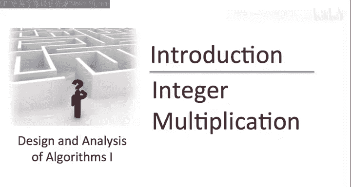

## 概述
在本节课中，我们将要学习一个基础的算法问题：整数乘法。我们将首先精确地定义这个问题，然后回顾你在小学三年级可能学过的乘法算法，并分析其性能。最后，我们将提出一个算法设计师的核心问题：我们能否做得更好？

---

## 问题定义
许多课程讲座将遵循一个模式：首先定义一个计算问题，明确其输入和期望的输出，然后给出一个将输入转换为输出的算法。

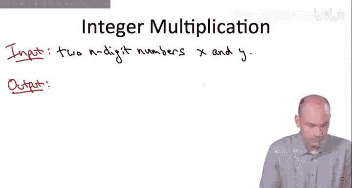

对于整数乘法问题，输入是两个 **n** 位数字的整数 **X** 和 **Y**。数字的长度 **n** 可以是任意值，但为了便于理解，你可以想象 **n** 非常大，例如数千位甚至更多，就像在某些需要处理极大数字的密码学应用中一样。

期望的输出很简单，就是乘积 **X × Y**。

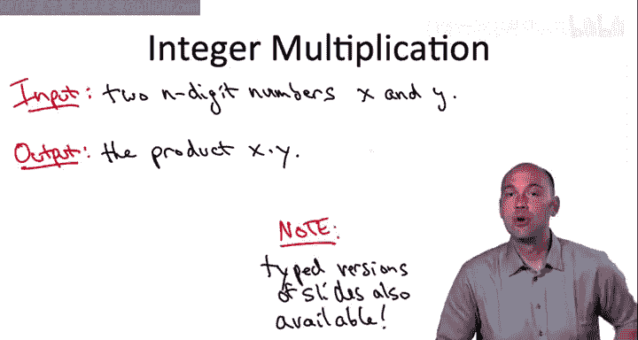

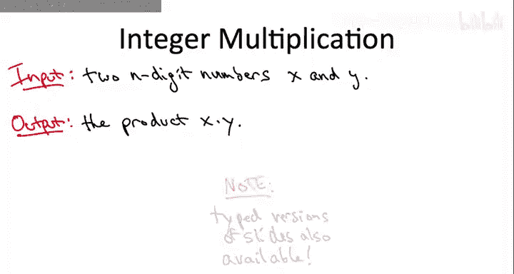

---

## 小学乘法算法
上一节我们定义了整数乘法问题，本节中我们来看看解决这个问题的经典算法：小学三年级学习的乘法算法。

我们将通过计算该算法执行的基本操作数量来评估其性能。目前，我们将基本操作定义为两个单位数字的加法或乘法。接下来，我们将分析该算法所需的基本操作数量，作为输入数字位数 **n** 的函数。

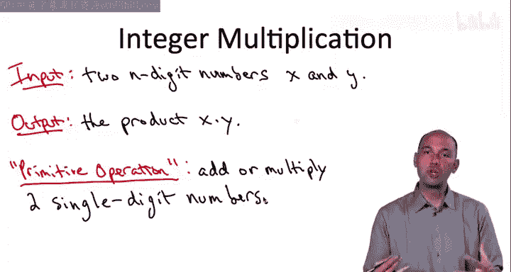

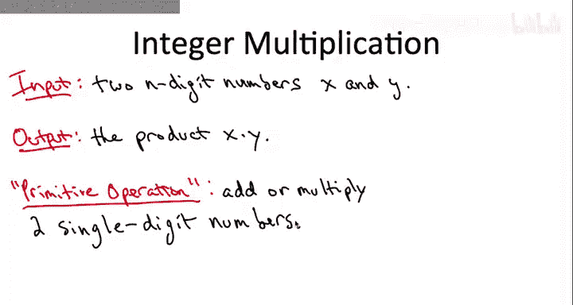

以下是该算法在一个具体例子（1234 × 5678）上的演示。我们的重点应放在算法执行的基本操作数量上，在本例中，输入数字是4位数。

### 算法步骤
1.  **计算部分积**：为第二个数字的每一位计算一个部分积。
    *   首先计算 4 × 5678。
    *   然后计算 3 × 5678，并在结果末尾添加一个零（即左移一位）。
    *   接着计算 2 × 5678，并在结果末尾添加两个零。
    *   最后计算 1 × 5678，并在结果末尾添加三个零。
2.  **求和**：将所有部分积相加，得到最终结果。

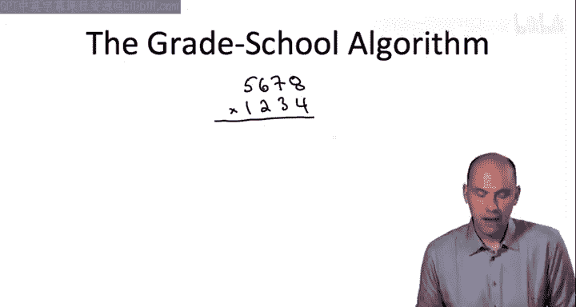

### 算法分析
你可能在三年级就意识到这个算法是**正确**的：无论起始整数 **X** 和 **Y** 是什么，只要正确执行此过程和所有中间计算，算法最终都会终止并输出正确的乘积 **X × Y**。

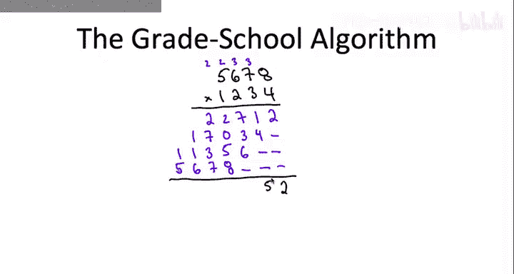

但你当时可能没有考虑执行这个算法直到结束所需的时间，即完成前所需的单位数字加法或乘法的基本操作数量。

现在，让我们快速非正式地分析一下，作为输入长度 **n** 的函数，所需操作的数量。

*   计算第一个部分积（例如 4 × 5678）时，我们需要将第一个数字的每一位（共 **n** 位）与第二个数字的当前位相乘，并进行进位处理。这最多需要 **2n** 次基本操作。
*   对于每一个部分积（共有 **n** 个），情况都是类似的，每个最多需要 **2n** 次操作。因此，生成所有部分积最多需要 **2n × n = 2n²** 次操作。
*   最后，将所有部分积相加也需要可比数量的操作，最多再需要约 **2n²** 次操作。

**核心结论**：随着输入数字变大（即位数 **n** 增加），小学乘法算法执行的操作数量大致以 **常数 × n²** 的速度增长。也就是说，其时间复杂度是输入长度 **n** 的**二次方**。

**公式表示**：操作数量 ≈ **c · n²**，其中 **c** 是一个常数。

例如：
*   如果输入长度（位数）**加倍**，使用此算法必须执行的操作数量将**增加四倍**。
*   如果输入长度**变为四倍**，操作数量将**增加十六倍**。

---

## 寻求更好的算法
根据你三年级时的性格，你可能认为这个步骤是计算两个数字乘积的唯一或至少是最优方法。

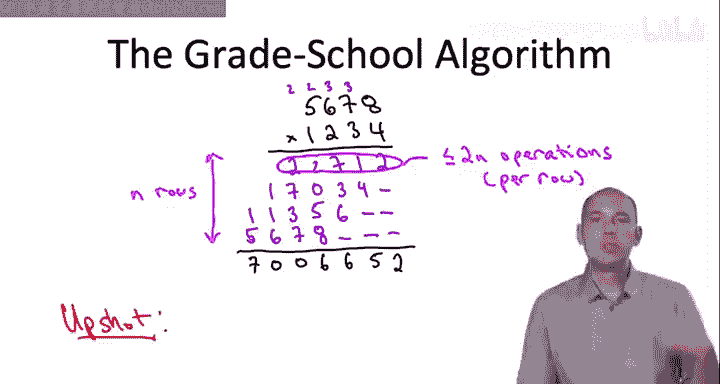

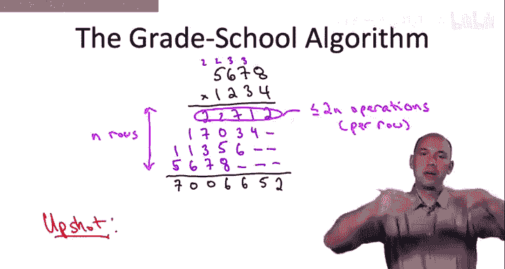

但是，如果你想成为一名严肃的算法设计师，就必须摆脱这种顺从的怯懦。一本关于算法设计与分析的重要早期教科书（Aho, Hopcroft, Ullman 著）中有一句我非常喜欢的话：

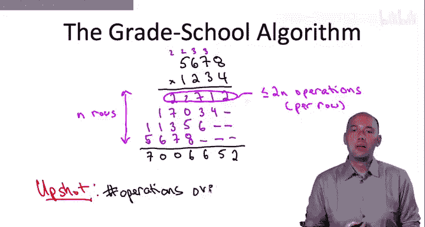

> “也许对于优秀的算法设计师来说，最重要的原则就是拒绝满足。”

我可以将其更简洁地总结为：作为算法设计师，你应该将“**我们能否做得更好？**”这句话作为你的座右铭。

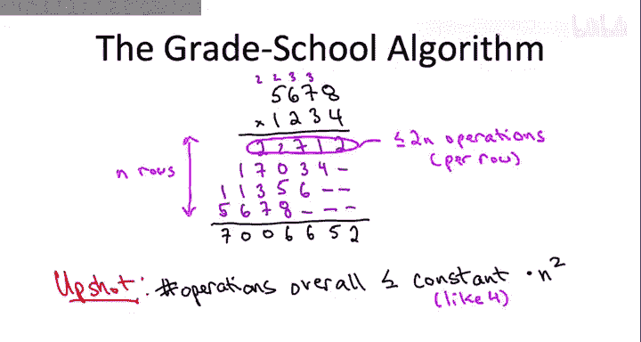

当你面对一个计算问题的朴素或直接解法时（例如整数乘法的小学算法），这个问题尤其适用。

你在三年级时可能没有问过自己：我们能否比这种直接的乘法算法做得更好？现在，是时候寻找答案了。

---

## 总结
本节课中我们一起学习了：
1.  精确地定义了**整数乘法**这个计算问题，其输入是两个 **n** 位整数，输出是它们的乘积。
2.  回顾并分析了**小学乘法算法**，确认其正确性，并分析了其时间复杂度为 **O(n²)**，即操作数量随输入位数呈二次方增长。
3.  引入了算法设计中的一个核心精神：永不满足，并始终追问“**我们能否做得更好？**”，为后续探索更高效的算法奠定了基础。