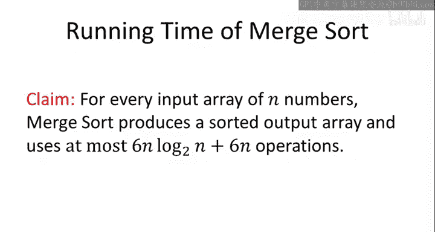
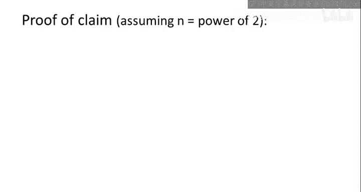
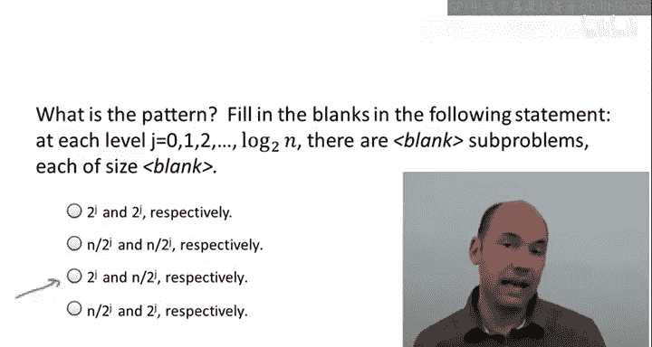
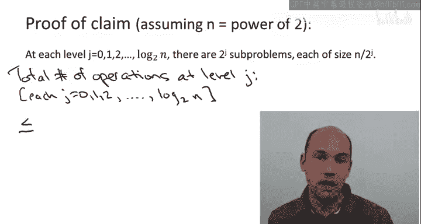
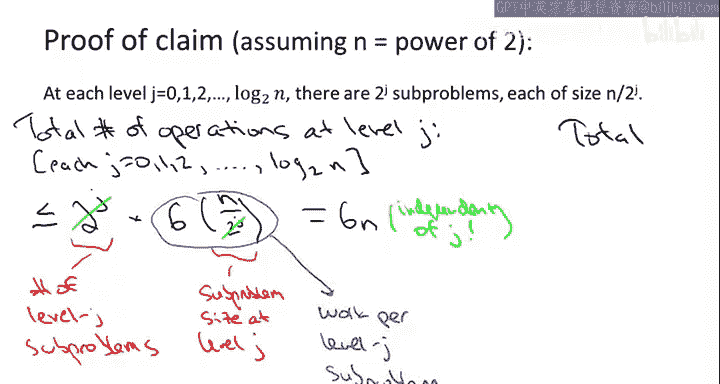
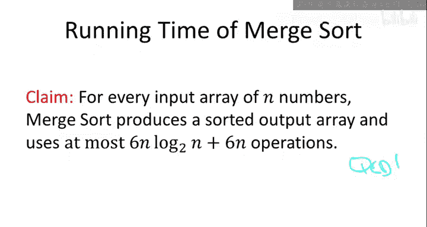

# 006：归并排序分析 🧮

在本节课中，我们将对归并排序算法进行运行时间分析。我们将通过数学论证来证实，这种递归分治的归并排序算法，其性能优于你可能知道的更简单的排序算法，如插入排序、选择排序和冒泡排序。

具体目标是，从数学上论证之前视频中提出的一个主张：为了对一个包含 `n` 个数字的数组进行排序，归并排序算法最多需要执行常数乘以 `n log n` 次操作。这是它最多会执行的代码行数，具体来说是 `6n log₂ n + 6n` 次操作。

## 递归树方法 🌳

为了证明这个主张，我们将使用一种称为**递归树**的方法。

上一节我们明确了分析目标，本节中我们来看看如何通过递归树来达成这个目标。

递归树方法的核心思想是，将递归的归并排序算法完成的所有工作，以一种树形结构写出来。树中给定节点的子节点，对应于该节点进行的递归调用。这种树形结构的意义在于，它能以一种有趣的方式帮助计算算法完成的总体工作量，从而极大地简化分析。

具体来说，这棵树是什么样的呢？在第0层，我们有一个根节点。

这对应于归并排序最外层的调用。我称这一层为第0层。这棵树是二叉树，因为归并排序的每次调用都会进行两次递归调用。因此，两个子节点对应于归并排序的两次递归调用。在根节点，我们操作整个输入数组。在下一层（第1层），我们有两个子问题：一个对应输入数组的左半部分，另一个对应右半部分。

当然，第1层的这两个递归调用各自又会进行两次递归调用，每个调用操作原数组的四分之一。这些是第2层的递归调用，共有4个。这个过程会一直持续，直到递归在基本情况（数组大小为0或1）时结束。

现在有一个问题：在这个对应基本情况的递归树底部，叶子节点位于哪一层？

正确答案是第二个选项。递归树的层数基本上与输入数组大小的对数成正比。原因在于，随着递归的每一层，输入大小都会以因子2减少。如果在最外层输入大小为 `n`，那么第一组递归调用每个操作大小为 `n/2` 的数组；在第2层，每个数组大小为 `n/4`，依此类推，直到递归在输入数组大小为1或更小时的基本情况结束。

换句话说，递归的层数恰好等于你需要将 `n` 除以2多少次，才能得到一个小于等于1的数。回想一下，这正是以2为底的 `n` 的对数 `log₂ n` 的定义。由于第一层是第0层，最后一层是第 `log₂ n` 层，所以总层数实际上是 `log₂ n + 1`。

写下这个表达式时，我假设 `n` 是2的幂。这不是大问题，分析可以很容易地扩展到 `n` 不是2的幂的情况，但这样我们就不必考虑分数，`log₂ n` 就是一个整数。

让我们回到递归树，快速重画一下。

在树的底部，我们有叶子节点，即不再进行递归的基本情况。当 `n` 是2的幂时，这些基本情况恰好对应于单元素数组。

这就是归并排序调用对应的递归树。以这种方式组织归并排序执行的工作，其动机在于它允许我们逐层计算工作量。我们将看到，这是一种特别方便的方法，可以统计所有被执行的不同代码行。

为了更详细地理解这一点，我需要你识别一个特定的模式。首先，第一个问题是：在这个递归树的给定第 `j` 层，有多少个不同的子问题？这是关于层数 `j` 的函数。第二个问题是：对于第 `j` 层的每个不同子问题，输入大小是多少？即传递给位于递归树第 `j` 层的子问题的数组大小是多少？

正确答案是第三个选项。

首先，在给定第 `j` 层，恰好有 `2^j` 个不同的子问题。第0层有一个最外层的子问题，它有两个递归调用，这些是第1层的两个子问题，依此类推。通常，由于归并排序调用自身两次，子问题的数量每层翻倍，这给出了第 `j` 层子问题数量的表达式 `2^j`。

另一方面，通过类似的论证，输入大小每次都在减半。随着每次递归调用，你传递给你被给予的输入的一半。所以在递归树的每一层，我们看到的是前一层输入大小的一半。经过 `j` 层后，由于我们开始时输入大小为 `n`，每个子问题将操作长度为 `n / 2^j` 的数组。

## 逐层计算工作量 ⚙️

现在让我们利用这个模式，实际计算归并排序执行的所有代码行数。如前所述，关键思想是逐层计算工作量。需要明确的是，当我谈论第 `j` 层完成的工作量时，我指的是那 `2^j` 个归并排序实例所做的工作，**不包括**它们各自的递归调用，也不包括在树中更低层递归中将要完成的工作。

回顾一下，归并排序是一个非常简单的算法，它只有三行代码：首先是一个递归调用（我们在第 `j` 层不计算这个），然后是另一个递归调用（同样不计算），第三行只是调用合并子程序。

因此，在递归调用之外，归并排序所做的就是一次合并子程序的调用。

进一步回顾，我们已经很好地理解了合并子程序在大小为 `m` 的输入上所需的代码行数。根据我们在上一个视频中的分析，它最多使用 `6m` 行代码。

让我们固定一个层数 `j`。我们知道有多少个子问题：`2^j` 个。我们知道每个子问题的大小：`n / 2^j`。我们知道合并在这样的输入上需要多少工作：我们只需乘以6。然后我们乘出来，就得到了在第 `j` 层所有子问题上完成的工作量。

以下是更详细的步骤：

我们从第 `j` 层不同子问题的数量开始，我们注意到这个数量最多是 `2^j`。

我们还观察到，每个第 `j` 层的子问题被传递一个长度为 `n / 2^j` 的数组作为输入。我们知道，当合并子程序被给予一个大小为 `n / 2^j` 的数组时，它将执行最多6倍于该数量的代码行。

因此，为了计算第 `j` 层完成的总工作量，我们只需将问题数量乘以每个子问题完成的工作量。然后，某种奇妙的事情发生了：我们得到了 `2^j` 的抵消，并得到了一个上界 `6n`。

这个上界与层数 `j` 无关。所以我们在根节点最多做 `6n` 次操作，在第1层最多做 `6n` 次操作，在第2层也是如此，依此类推。它独立于层数。

从数学上讲，发生这种情况的原因是两个竞争力量之间的完美平衡：首先，子问题的数量随着递归树的每一层而翻倍；但其次，我们每个子问题所做的工作量随着递归树的每一层而减半。由于这两者相互抵消，我们得到了一个独立于层数 `j` 的上界 `6n`。

## 计算总工作量 📊

现在，这就是它如此酷的原因：我们并不真正关心某一特定层的工作量，我们关心的是归并排序在所有层上完成的总工作量。如果我们有一个独立于层数的每层工作量上界，那么我们的总上界计算就变得非常简单。

我们该怎么做？我们只需取层数，我们知道层数是多少：恰好是 `log₂ n + 1`。记住，层数是从0到 `log₂ n`（包含）。然后，我们对这 `log₂ n + 1` 层中的每一层都有一个上界 `6n`。

因此，如果我们展开这个量，我们恰好得到了之前声称的上界：即归并排序执行的操作数最多为 `6n * log₂ n + 6n`。

## 总结 🎯

本节课中我们一起学习了归并排序算法的运行时间分析。这就是为什么它的运行时间以常数乘以 `n log n` 为上界。特别是当 `n` 变大时，这远远优于更简单的迭代算法，如插入排序或选择排序。

我们通过递归树方法，逐层分析了算法的工作量，并利用子问题数量翻倍与每个子问题工作量减半相互抵消的特性，得出了简洁的总工作量上界公式 `6n log₂ n + 6n`。这个分析清晰地展示了归并排序高效的原因。