# 008：渐近分析入门 🚀

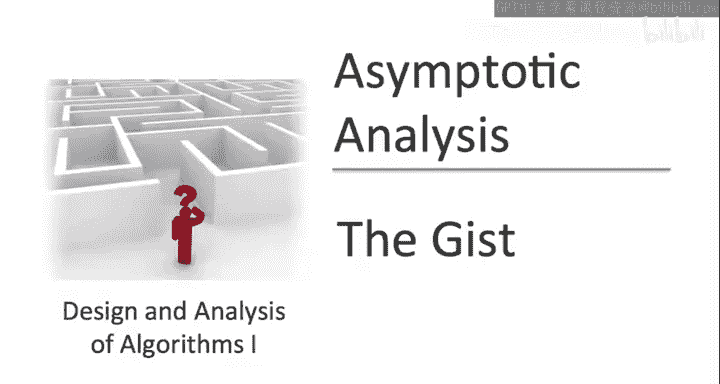

在本节课中，我们将要学习**渐近分析**。这是每一位严肃的程序员和计算机科学家用来讨论算法高层次性能的通用语言，因此是一个至关重要的主题。本节课的目标是衔接课程介绍中已讨论的高层次概念与下一节将开始建立的数学形式化体系。在进入数学形式之前，我们希望确保你充分理解这个主题的动机，对其目标有坚实的直觉，并看过几个简单的直观例子。

## 渐近分析的核心思想 💡

渐近分析为讨论算法的设计与分析提供了基本词汇。虽然它是一个数学概念，但绝非为了数学而数学。你经常会听到资深程序员说某段代码的运行时间是 **O(n)**，而另一段是 **O(n²)**。理解这些说法的含义非常重要。

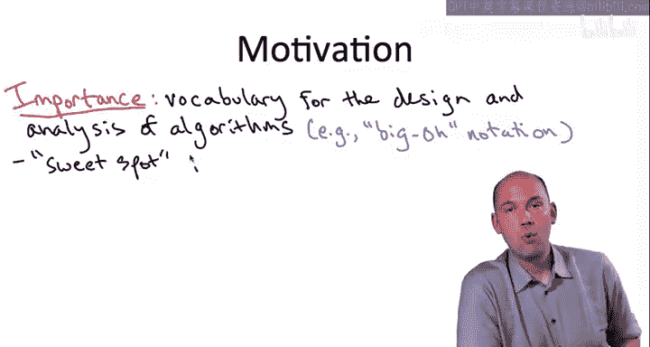

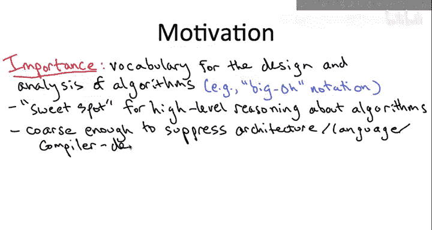

这种词汇之所以无处不在，是因为它找到了一个讨论算法高层次性能的“最佳平衡点”。一方面，它足够**粗略**，可以忽略掉所有你希望忽略的细节，例如依赖于特定架构、编程语言或编译器的细节。另一方面，它又足够**精确**，能够用于对不同高级算法方案进行预测性比较，尤其是在处理大规模输入时。正如我们之前讨论的，大规模输入才是真正需要算法智慧的地方。

例如，渐近分析能让我们区分排序算法的优劣，以及整数乘法算法的优劣。

## 核心原则：忽略常数因子和低阶项 ⚙️

大多数资深程序员会告诉你，渐近分析的主要目的就是**忽略前导常数因子和低阶项**。当然，渐近分析的内容远不止这七个字，但长远来看，如果你只记住关于渐近分析的七个字，我希望就是这七个字。

我们如何证明采用这种形式化方法是合理的呢？低阶项，顾名思义，在处理大规模输入时会变得越来越无关紧要。而常数因子则高度依赖于运行环境、编译器、语言等具体细节。如果我们想忽略这些细节，那么采用一个不过分关注前导常数因子的形式化方法就是合理的。

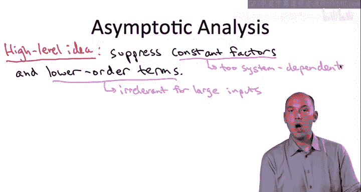

**示例：归并排序**
回忆我们分析归并排序算法时，给出的运行时间上界是 `6n log n + 6n`，其中 `n` 是输入数组的长度。这里的低阶项是 `6n`，它比 `n log n` 增长得慢，所以我们将其丢弃。前导常数因子是 `6`，我们也将其忽略。经过这两步简化，我们得到了一个更简单的表达式：`n log n`。

相应的术语是：归并排序的运行时间是 **O(n log n)**。换句话说，当你说一个算法的运行时间是 **O(f(n))** 时，你的意思是：在丢弃低阶项并忽略前导常数因子之后，剩下的就是函数 `f(n)`。直观上，这就是大O符号的含义。

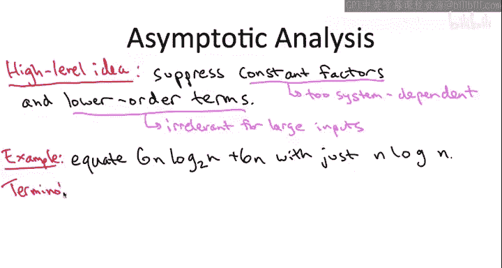

需要明确的是，我并非断言常数因子在算法设计与分析中**从不重要**。我的意思是，当你思考高层次算法方案、比较解决同一问题的根本不同方法时，渐近分析通常是指导你判断哪种方法性能更好的正确工具，尤其是在处理较大规模输入时。当然，一旦你确定了解决某个问题的具体算法方案，你完全可以努力优化其前导常数因子，甚至改进低阶项。如果你的创业公司的未来依赖于某几行代码的实现效率，那么请务必让它尽可能快。

## 简单示例解析 🔍

在接下来的内容中，我们将通过四个非常简单的例子来加深理解。如果你已经熟悉大O符号，可以跳过这部分直接进入下一节的数学形式化内容。但如果你是初次接触，希望这些例子能帮助你建立认知。

### 示例一：在数组中搜索整数

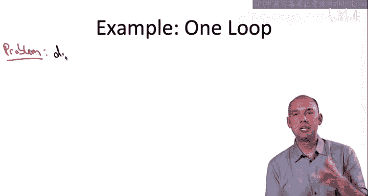

我们先从一个非常基础的问题开始：在数组中搜索给定的整数。

**算法分析**
我们分析解决这个问题的直接算法：线性扫描数组，检查每个元素是否是目标整数 `t`。代码依次检查每个数组元素，如果找到 `t` 则返回 `true`，如果扫描完整个数组都没找到，则返回 `false`。

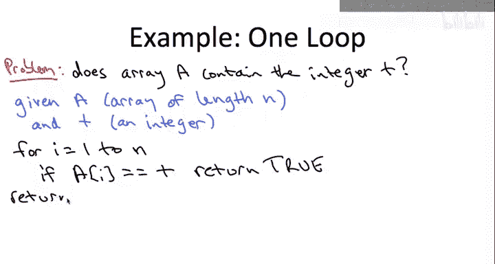

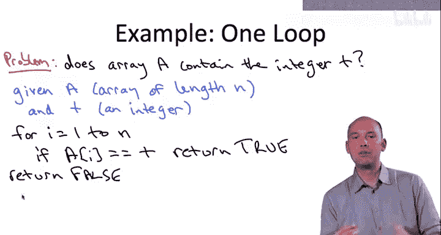

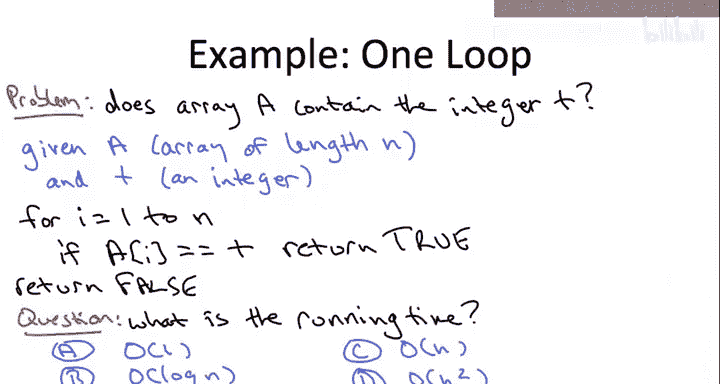

那么，你认为这个算法的运行时间，作为数组长度 `n` 的函数，用大O表示法是什么？

**答案与解释**
答案是 **O(n)**，或者说该算法的运行时间相对于输入长度 `n` 是**线性**的。

为什么？让我们思考这段代码会执行多少次操作。实际上，执行的代码行数取决于输入：取决于目标 `t` 是否在数组 `A` 中，以及如果在的话，它位于数组的哪个位置。但在**最坏情况**下，`t` 不在数组中，代码会扫描整个数组 `A` 然后返回 `false`。此时的操作次数是一个常数（例如初始设置和返回布尔值）加上对数组中每个元素执行的常数次操作。无论这个常数是2、3还是4，它都会被大O表示法方便地忽略掉。因此，总操作次数与 `n` 成线性关系，所以大O表示法就是 **O(n)**。

### 示例二：顺序执行的两个循环

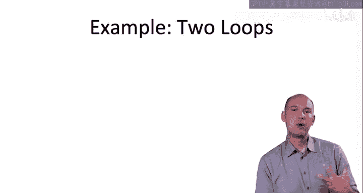

上一个例子我们分析了单个循环。接下来，我们看看两个循环以不同方式组合的情况。首先，我们看一个循环接着另一个循环执行，即两个循环**顺序**执行的情况。

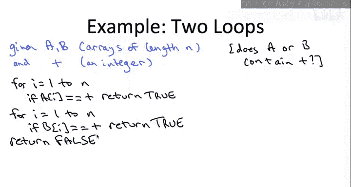

**问题描述**
我们研究一个与上一个类似的问题：现在给定两个数组 `A` 和 `B`，假设长度都是 `n`，我们想知道目标 `t` 是否存在于其中任何一个数组中。我们再次查看直接算法：先搜索 `A`，如果在 `A` 中没找到 `t`，再搜索 `B`。如果 `B` 中也没找到，则返回 `false`。

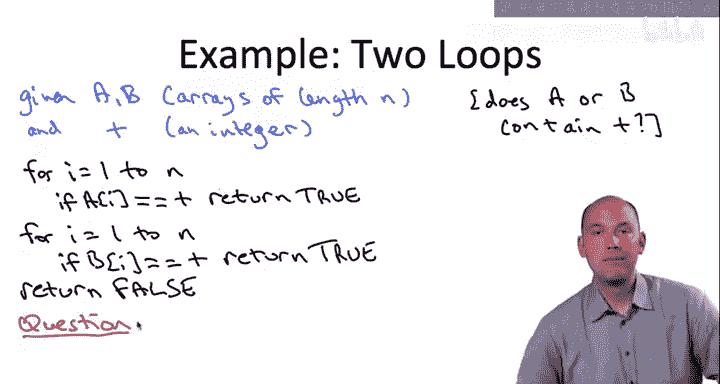

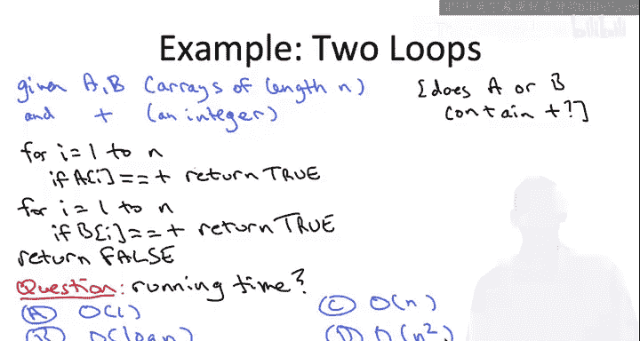

那么，对于这段更长的代码，用大O表示法，它的运行时间是多少？

**答案与解释**
答案与上次相同：**O(n)**。

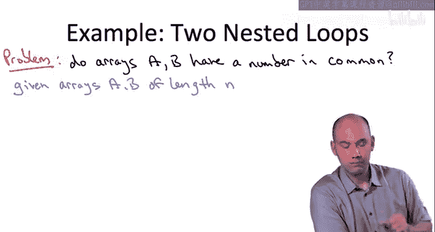

如果我们实际计算操作次数，它当然不会和上次完全一样，大约是上一段代码的两倍，因为我们需要搜索两个长度均为 `n` 的不同数组。无论之前做了多少工作，现在都要做两遍。当然，这个“两倍”是一个独立于输入长度 `n` 的常数，在我们使用大O表示法时会被忽略。因此，这个算法和上一个一样，是一个**线性时间**算法，运行时间为 **O(n)**。

### 示例三：嵌套循环（比较两个数组）

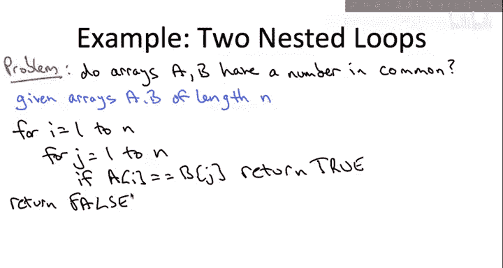

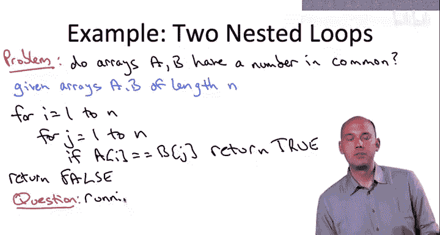

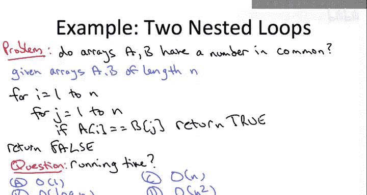

现在让我们看一个更有趣的两个循环的例子，这次不是顺序执行，而是**嵌套**执行。具体来说，我们看一个问题：判断两个给定的输入数组（长度均为 `n`）是否包含一个相同的数字。

**算法分析**
我们查看解决这个问题的最直接算法：比较所有可能性。对于数组 `A` 的每个索引 `i` 和数组 `B` 的每个索引 `j`，我们检查 `A[i]` 是否等于 `B[j]`。如果相等，返回 `true`。如果穷尽所有可能性都没有找到相等的元素，则返回 `false`。

那么，用大O表示法，作为数组长度 `n` 的函数，这段代码的运行时间是多少？

**答案与解释**
这次答案变了。这段代码的运行时间不是 **O(n)**，而是 **O(n²)**。我们也可以称之为**二次时间**算法，因为运行时间相对于输入长度 `n` 是二次的。这类算法的特点是，如果你将输入长度加倍，算法的运行时间将增加四倍，而不是像前两段代码那样只增加两倍。

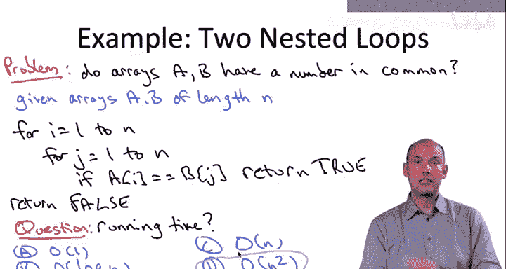

为什么是 **O(n²)**？同样，有一些常数级的设置成本会被大O表示法忽略。对于数组 `A` 的每个固定索引 `i` 和数组 `B` 的每个固定索引 `j`，我们只执行常数次操作。具体常数无关紧要，因为它会被大O表示法忽略。不同之处在于，这个双重 `for` 循环总共有 **n²** 次迭代。在第一个例子中，单个 `for` 循环只有 `n` 次迭代。在第二个例子中，因为一个 `for` 循环在另一个开始前就结束了，所以总共只有 `2n` 次迭代。而在这里，外层 `for` 循环的每次迭代（共 `n` 次），内层 `for` 循环都要执行 `n` 次迭代，这就得到了 `n * n`，即 `n²` 次总迭代。这就是这段代码的运行时间。

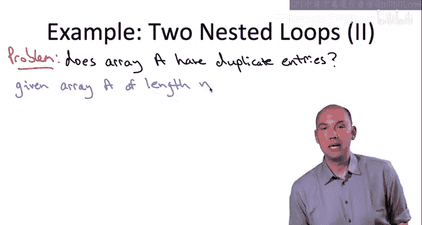

### 示例四：嵌套循环（在单个数组中查找重复项）

让我们以最后一个例子结束。这又是一个嵌套 `for` 循环的例子，但这次我们是在单个数组 `A` 中查找重复项，而不是比较两个不同的数组 `A` 和 `B`。

**算法分析**
这是我们要分析的用于检测输入数组 `A` 是否有重复项的代码。相对于上一张幻灯片上比较两个数组的代码，这里只有两个小改动：
1.  第一个改动毫不意外：将所有对数组 `B` 的引用改为 `A`，即比较 `A[i]` 和 `A[j]`。
2.  第二个改动更微妙一些：我改变了内层 `for` 循环，让索引 `j` 从 `i+1` 开始（`i` 是外层 `for` 循环的当前值），而不是从索引 `1` 开始。如果从 `1` 开始，代码仍然是正确的，但会浪费资源。因为那样每个不同的元素对会被比较两次，而实际上只需要比较一次就知道它们是否相等。

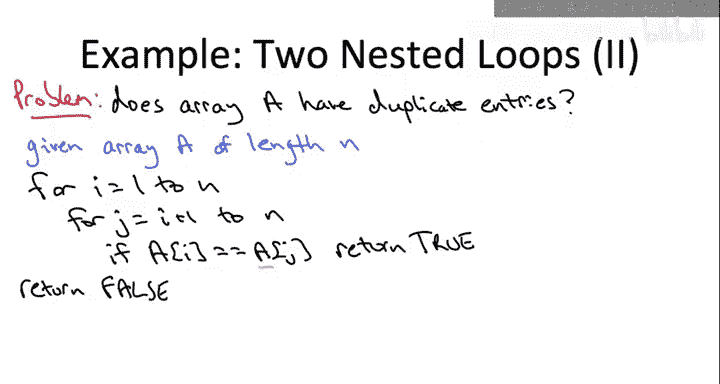

那么，用大O表示法，这段代码的运行时间是多少？

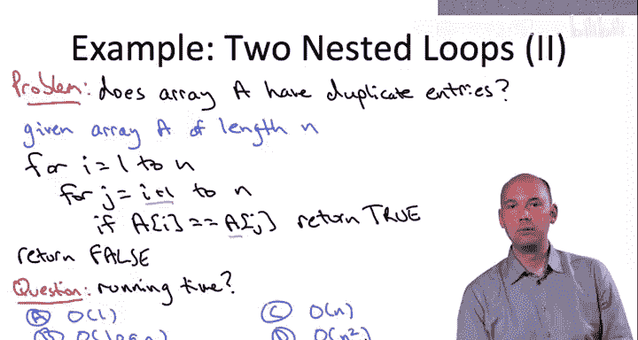

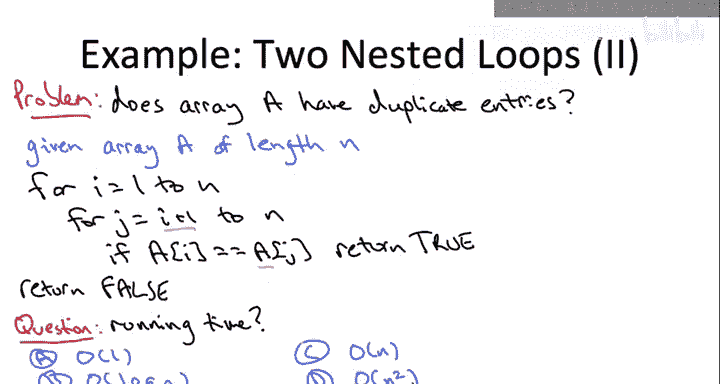

**答案与解释**
这个问题的答案和上一个相同：**O(n²)**。也就是说，这段代码也具有二次运行时间。

我希望有一点是清楚的：这段代码的运行时间与这个双重 `for` 循环的迭代次数成正比。和所有例子一样，每次迭代我们做常数级的工作，我们不关心这个常数，它会被大O表示法忽略。所以我们只需要弄清楚这个双重 `for` 循环有多少次迭代。

我的观点是，这个双重 `for` 循环大约有 **n² / 2** 次迭代。有几种方式可以理解：我们讨论过这段代码与上一段代码的区别在于，我们只计数一次，而不是两次，这为我们节省了迭代次数上的一个因子 `2`。当然，这个 `1/2` 因子无论如何都会被大O表示法忽略，所以大O运行时间不会改变。另一种论证方式是：对于 `1` 到 `n` 之间每一对不同的索引 `i` 和 `j`，都有一次迭代。一个简单的计数论证表明，这样的不同 `i` 和 `j` 的选择有 **C(n, 2)** 种，即 `n * (n-1) / 2`。再次忽略低阶项和常数因子，我们仍然得到相对于输入数组 `A` 长度的二次依赖关系。

## 总结 📝

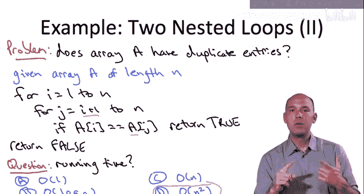

本节课我们一起学习了**渐近分析**的初步概念。我们了解到，渐近分析是一种用于讨论算法性能的通用语言，其核心是**忽略常数因子和低阶项**，从而专注于算法在大规模输入下的增长趋势。我们通过四个简单的例子（线性搜索、顺序循环、嵌套循环比较两个数组、嵌套循环查找单个数组中的重复项）直观地感受了如何判断算法的运行时间是 **O(n)** 还是 **O(n²)**。这些例子帮助我们建立了对大O符号的初步直觉。在接下来的课程中，我们将正式进入数学形式化定义，并分析更多有趣的算法。