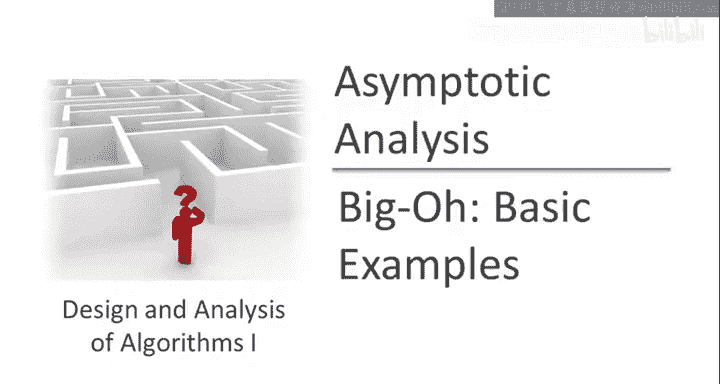
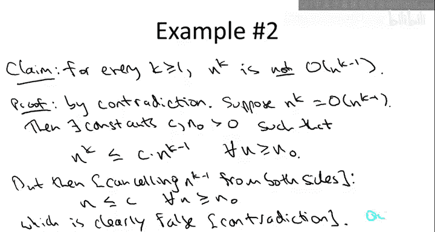

# 010：大O记号基础示例 🧮

在本节课中，我们将通过两个基础示例来学习如何正式证明一个函数属于大O记号，以及如何证明一个函数不属于大O记号。这些示例将帮助我们验证大O记号的核心目的：**抑制常数因子和低阶项**，并让我们熟悉其形式化定义的应用。

上一节我们详细讨论了大O记号的形式化定义。本节中，我们来看看如何应用这个定义进行证明。

## 示例一：证明多项式属于大O记号 ✅

我们首先证明以下命题：如果一个函数 `T(n)` 是一个 `k` 次多项式，那么 `T(n)` 是 `O(n^k)`。

**命题**：设 `T(n)` 是一个 `k` 次多项式，形式如下：
`T(n) = a_k * n^k + a_{k-1} * n^{k-1} + ... + a_1 * n + a_0`
其中 `k` 是任意正整数，系数 `a_i` 可以是任意正数或负数。那么，`T(n)` 是 `O(n^k)`。

这个命题的数学含义是：大O记号确实会抑制多项式中的常数因子和低阶项。当 `n` 趋于无穷大时，多项式中最高次项 `n^k` 主导了其增长。

### 证明过程

回忆一下，要证明 `T(n)` 是 `O(n^k)`，关键在于找到一对常数 `C` 和 `n_0`，使得对于所有 `n ≥ n_0`，都有 `T(n) ≤ C * n^k` 成立。

为了使证明简单明了（尽管选择常数的过程看起来有些神秘），我们将直接给出这对常数，然后验证它们满足条件。

以下是常数的选择：
*   令 `n_0 = 1`。
*   令 `C = |a_k| + |a_{k-1}| + ... + |a_1| + |a_0|`，即所有系数绝对值的和。

我们需要证明：对于所有 `n ≥ 1`，都有 `T(n) ≤ C * n^k`。

以下是证明步骤：

1.  从 `T(n)` 的定义开始：
    `T(n) = a_k * n^k + a_{k-1} * n^{k-1} + ... + a_1 * n + a_0`

2.  将每个系数 `a_i` 替换为其绝对值 `|a_i|`。由于 `n ≥ 1`，如果某个系数从负数变为正数，整个表达式的值只会增大（或不变）。因此：
    `T(n) ≤ |a_k| * n^k + |a_{k-1}| * n^{k-1} + ... + |a_1| * n + |a_0|`

3.  现在，将每一项中的 `n` 的幂次统一替换为最高次幂 `n^k`。因为 `n ≥ 1`，所以 `n^k ≥ n^{k-1} ≥ ... ≥ n ≥ 1`。用更大的 `n^k` 替换较低的幂次，整个表达式的值只会增大。因此：
    `T(n) ≤ |a_k| * n^k + |a_{k-1}| * n^k + ... + |a_1| * n^k + |a_0| * n^k`

4.  提取公因子 `n^k`：
    `T(n) ≤ (|a_k| + |a_{k-1}| + ... + |a_1| + |a_0|) * n^k`

5.  根据我们选择的 `C`，括号内的部分正是 `C`。因此：
    `T(n) ≤ C * n^k`

至此，我们完成了证明。对于所有 `n ≥ 1`，`T(n)` 确实被 `C * n^k` 所限定。

> **关于常数选择的说明**：在实际证明中，我们通常通过“逆向工程”来推导出可行的 `C` 和 `n_0`。即先假设它们存在，然后像上面一样进行推导，看看需要 `C` 和 `n_0` 满足什么条件才能使不等式成立，从而确定它们的值。

## 示例二：证明函数不属于大O记号 ❌

接下来，我们证明一个“非示例”：对于任意 `k ≥ 1`，`n^k` **不是** `O(n^{k-1})`。

这个结论符合我们的直觉：不同的多项式幂次在大O记号下不应“坍缩”为同一个类别。如果这个结论不成立，那说明我们的定义有问题。

### 证明过程：反证法

我们将使用**反证法**来证明。首先，假设我们想证明的结论不成立。

1.  **假设反面成立**：假设 `n^k` 是 `O(n^{k-1})`。

2.  **根据大O定义**：如果假设成立，那么根据定义，存在正常数 `C` 和 `n_0`，使得对于所有 `n ≥ n_0`，都有：
    `n^k ≤ C * n^{k-1}`

3.  **推导矛盾**：由于 `n ≥ 1` 且 `k ≥ 1`，我们可以将不等式两边同时除以 `n^{k-1}`（这是一个正数，不会改变不等号方向）：
    `n ≤ C`
    这个不等式意味着：对于所有足够大的 `n`（即 `n ≥ n_0`），`n` 的值都被一个常数 `C` 所限定。

4.  **发现矛盾**：上述结论显然错误。因为正整数序列 `{n}` 是无界增长的，不可能全部小于或等于某个固定的常数 `C`。例如，取 `n = C + 1`（或 `⌊C⌋ + 2` 等），它就不满足 `n ≤ C`。

5.  **得出结论**：由于我们从一个假设出发，推导出了一个错误的结论，因此原假设不成立。所以，`n^k` 不是 `O(n^{k-1})`。

这个证明确认了：在大O记号的意义下，`n^k` 和 `n^{k-1}` 代表了不同的增长级别，它们不会混淆。

---

本节课中我们一起学习了如何应用大O记号的形式化定义。通过第一个示例，我们证明了多项式函数的增长率由其最高次项决定。通过第二个示例，我们使用反证法证明了不同幂次的函数属于不同的大O类别。这两个基础示例巩固了我们对大O记号核心思想——**关注渐近增长的主导项**——的理解。