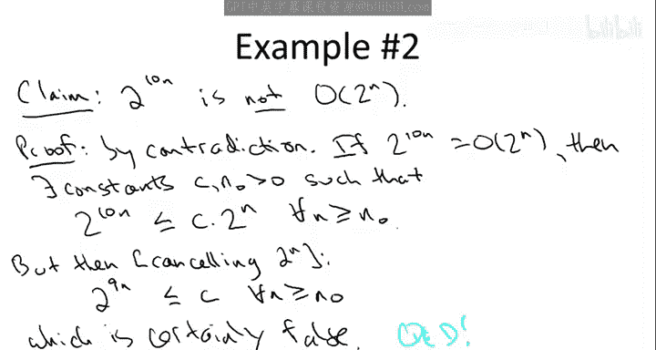

# 012：渐进符号补充示例复习（可选）📚

在本节中，我们将通过三个额外的示例来练习渐进符号（Big O、Theta）的使用。这些示例将帮助你更深入地理解如何形式化地证明一个函数是另一个函数的渐进上界，以及如何证明两个函数渐进相等。

---

## 示例一：证明函数是 Big O 🧮

上一节我们介绍了渐进符号的基本概念，本节中我们来看看如何形式化地证明一个函数是另一个函数的 Big O。

**目标**：证明函数 `2^(n+10)` 是 `2^n` 的 Big O。

根据 Big O 的定义，我们需要找到两个常数 `C` 和 `n₀`，使得对于所有足够大的 `n`（即 `n ≥ n₀`），以下不等式成立：
`2^(n+10) ≤ C * 2^n`

以下是证明步骤：

1.  从等式 `2^(n+10)` 开始。
2.  利用指数法则将其重写为 `2^10 * 2^n`。
3.  计算 `2^10 = 1024`，因此得到 `1024 * 2^n`。
4.  此时，我们可以选择常数 `C = 1024` 和 `n₀ = 1`。
5.  对于所有 `n ≥ 1`，不等式 `2^(n+10) = 1024 * 2^n ≤ 1024 * 2^n` 显然成立。

因此，我们证明了 `2^(n+10)` 是 `O(2^n)`。

---

## 示例二：证明函数不是 Big O ❌

接下来，我们看一个反例，学习如何证明一个函数**不是**另一个函数的 Big O。

**目标**：证明函数 `2^(10n)` **不是** `2^n` 的 Big O。

我们采用反证法。假设 `2^(10n)` 是 `O(2^n)`，那么根据定义，存在常数 `C` 和 `n₀`，使得对于所有 `n ≥ n₀`，有：
`2^(10n) ≤ C * 2^n`

以下是推导矛盾的过程：

1.  将不等式两边同时除以 `2^n`（因为 `n` 为正数，`2^n > 0`）。
2.  得到 `2^(10n) / 2^n ≤ C`。
3.  根据指数运算法则，`2^(10n) / 2^n = 2^(10n - n) = 2^(9n)`。
4.  因此，不等式变为 `2^(9n) ≤ C`，对于所有 `n ≥ n₀` 成立。
5.  然而，`2^(9n)` 随着 `n` 的增长趋向于无穷大，而 `C` 是一个固定常数。这个不等式不可能对所有足够大的 `n` 都成立。

由此得出矛盾，故假设不成立。所以，`2^(10n)` 不是 `O(2^n)`。

---

## 示例三：使用 Theta 符号证明渐进相等 ⚖️

最后，我们来看一个更复杂的例子，它涉及 Theta 符号，用于证明两个函数渐进相等。

**目标**：对于任意两个定义在正整数上的函数 `f(n)` 和 `g(n)`，证明 `max(f(n), g(n))` 是 `Θ(f(n) + g(n))`。

这里，`max(f, g)` 表示逐点取最大值，即对于每个 `n`，取 `f(n)` 和 `g(n)` 中较大的那个值。

根据 Theta 符号的定义，我们需要找到常数 `C₁`, `C₂` 和 `n₀`，使得对于所有 `n ≥ n₀`，有：
`C₁ * (f(n) + g(n)) ≤ max(f(n), g(n)) ≤ C₂ * (f(n) + g(n))`

以下是推导过程，我们假设 `f(n)` 和 `g(n)` 始终输出非负值（这在算法分析中是合理的）：

1.  **上界证明**：
    对于任意 `n`，`max(f(n), g(n))` 是两个非负数中较大的那个。显然，它不会超过这两个数的和，即：
    `max(f(n), g(n)) ≤ f(n) + g(n)`
    这给出了上界，其中 `C₂ = 1`。

2.  **下界证明**：
    同样，对于任意 `n`，`max(f(n), g(n))` 至少是 `f(n)` 和 `g(n)` 的平均值的一半。因为：
    `2 * max(f(n), g(n)) ≥ f(n) + g(n)` （两个“较大值”之和至少等于总和）
    将两边同时除以 2，得到：
    `max(f(n), g(n)) ≥ (1/2) * (f(n) + g(n))`
    这给出了下界，其中 `C₁ = 1/2`。

3.  **综合**：
    结合以上两个不等式，我们得到对于所有 `n ≥ 1`（这里 `n₀` 可以取 1）：
    `(1/2) * (f(n) + g(n)) ≤ max(f(n), g(n)) ≤ 1 * (f(n) + g(n))`
    这恰好满足了 Theta 符号的定义。

因此，我们证明了 `max(f(n), g(n))` 是 `Θ(f(n) + g(n))`。

---

## 总结 📝

本节课中我们一起学习了三个渐进符号的补充示例：
1.  我们通过选择常数 `C=1024` 和 `n₀=1`，形式化地证明了 `2^(n+10)` 是 `O(2^n)`。
2.  我们使用反证法，通过推导出 `2^(9n) ≤ C` 这一矛盾，证明了 `2^(10n)` 不是 `O(2^n)`。
3.  我们利用不等式推导，证明了对于任意非负函数 `f` 和 `g`，其逐点最大值 `max(f, g)` 渐进等于它们的和 `f+g`，即 `max(f, g) = Θ(f + g)`。

这些练习巩固了我们对 Big O 和 Theta 符号定义的理解，并展示了如何运用这些定义进行严格的数学证明。